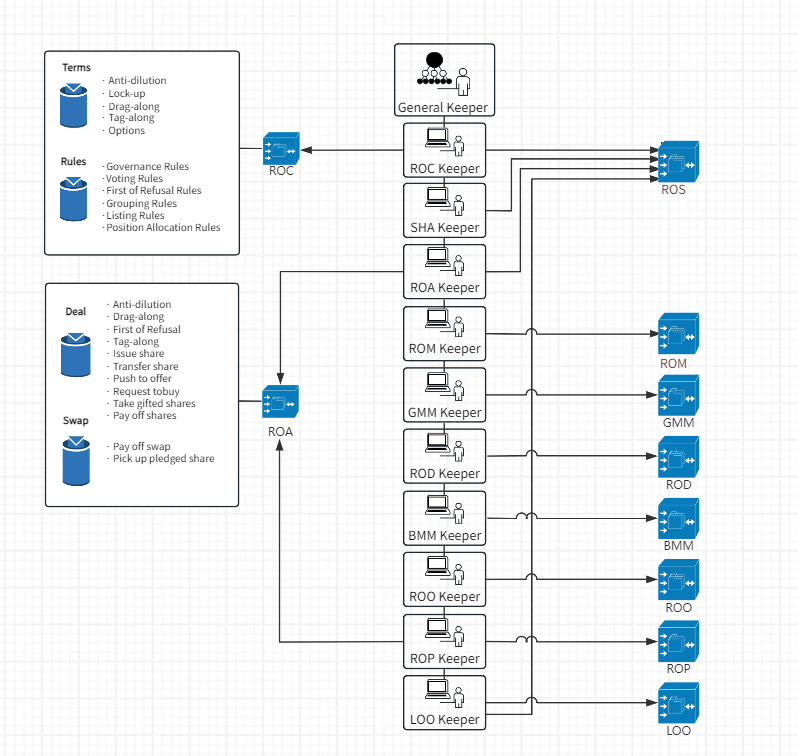

## Abstract

This ERC describes the details of the Equity Shares Book-Entry System (the "**System**"), a proposed protocol and ABI definition that can automatically manage the book-entry records of a company with respect to its equity shares and corporate governance behaviors, in accordance with the consitutional document thereof, so as to enable investors, shareholders, managers, and other stakeholders can directly engage in almost all equity share transactions and corporate governance activities under the automatic control of smart contracts, including share subscription, share transfer, share pledge, share consideration payment, share listing, constitution updates, contracts signing, motion submission, voting, candidates nomination, taking office and resignation etc..

Under the automatic control of smart contracts, many “claim rights” that require cooperation of obligors are transformed into "disposal rights" that can be unilaterally exercised by right holders. In this way, the possibility of defaults will be completely eliminated. So that, the System may fundamentally solve the corporate governance problems such as **"Insider Control"** and **"Misleading Statements"** that has plagued the capital markets for many years, and completely realize:
1. right holders may **directly exercise** their rights; 
2. obligors have **no chance** to default; and
3. **real-time** information disclosure.

By booking the equity shares on EVM blockchain, investors may use cryptocurrency or Central Bank Digital Currencies to pay for share consideration, which means effectively connecting the company’ equity shares to the trillion-dollar crypto markets, so that the companies may have an opportunity to have their equity value reevaluated and reconfirmed with the robust support of the huge liquidity.

## Motivation

The capital markets have long suffered from some "pain points" of corporate governance, which can be summarized into following three aspects:
1. Right holders can hardly exercise their rights smoothly; 
2. Obligors sometimes deliberately violate their obligations; and
3. Untimely and inaccurate information disclosure.

By using smart contracts to book equity shares and control corporate governance activities, human influences can be minimized to an extreme extent, thus enabling:
1. right holders may **directly exercise** rights;
2. obligors have **no chance** to default; and
3. **real-time** information disclosure.

Booking equity shares on chain does not simply mean to move the records of “Register of Shareholders” or "Register of Members" onto the blockchain.  What's more important is to utilize smart contracts to solve various problems of corporate governance aforementioned, i.e. authorizing smart contracts to fully control all legal procedures of share transaction and corporate governance, so as to ensure all those legal behaviors can be carried out strictly in line with the internal governance rules (like the Articles of Association, the Operation Agreement or the Shareholders Agreement etc.), as well as the external governing laws (such as the Securities Act and the Securities Exchange Act).  

So that the capital market can rely on the rigid logic of smart contracts to automatically control the creation, change, exercising, and elimination of the rights of equity shares, i.e. by means of implementing the concept of "**Code Is Law**" to establish a trustworthy "**Credit Internet of Web 3.0**" in real sense.

## Specification

### 1. Overview

#### 1.1. Architecture

The core functions of the System **MUST** be defined by the following five types of smart contracts: 
- Shareholders Agreement
- Book Keepers
- Registers
- Investment Agreement
- RegCenter



**Shareholders Agreement** is to dynamically define rules and conditions relating to share transactions and corporate governance.  

**Book Keepers** are to define the ABIs for dozens of legal behaviors regarding corporate governance and share transactions, so as to manage and control the identification of actors, conditions, procedures and consequences of the relevant legal behaviors. 

**Registers** are to define the registers for book-entry interests (such as equities, pledges, options) and corporate governance records (such as general meeting minutes and board meeting minutes). 

**Investment Agreement** is to dynamically define all necessary elements of deals for issuing new shares or transfer shares, such as the subject equity shares, price, amounts, buyer's identity, signing deadline, closing deadline, contractual parties and so on.  

**RegCenter** provides a special mapping from user's address to its unique user number, which will be used to generate and verify users' digital identity. In addition, RegCenter also **MAY** provide a special series of mappings between contracts' address and their serial number to control the versions of different templates and their clone contracts.

#### 1.2. Identification

The System **SHALL** adopt three verification methods at three different levels as per the nature of write commands and their scopes of influence:
1. Access Control Mechanism on smart contracts' level;
2. Commands Routing Mechanism within a company's book-entry system; and
3. Users Identification Mechanism for entire System.

#### 1.3. Template Smart Contracts and Version Control

To save deploying gas fees and keep security, the System is **RECOMMENDED** to adopt cloning technology of smart contracts, i.e. using the data structures, functions and algorithms defined in the template contract, to compute the variables in the context of cloned contracts via delegation call mechanism. 

The System is **RECOMMENDED** to have the following 26 template contracts registered in RegCenter:

| No. | Name | No. | Name | No. | Name |
| --- | --- | --- | --- | --- | --- |
| 1 | Register of Constitutions Keeper | 11 | Register of Constitutions | 21 | Investment Agreement |
| 2 | Register of Directors Keeper | 12 | Register of Directors | 22 | Shareholders Agreement |
| 3 | Board Meeting Minutes Keeper | 13 | Board Meeting Minutes | 23 | Anti-Dilution |
| 4 | Register of Members Keeper | 14 | Register of Members | 24 | Lock-Up |
| 5 | General Meeting Minutes Keeper | 15 | Register of Agreements | 25 | Drag-Along & Tag-Along |
| 6 | Register of Agreements Keeper | 16 | Register of Options | 26 | Call-Option & Put-Option |
| 7 | Register of Options Keeper | 17 | Register of Pledges |  |  |
| 8 | Register of Pledges Keeper | 18 | Register of Shares | | |
| 9 | Shareholders Agreement Keeper | 19 | List of Orders | | |
| 10 | List of Orders Keeper | 20 | General Keeper | | |

### 2. Shareholders Agreement sepecification

The rules governing share transactions and corporate governance **SHALL** be stipulated in the Shareholders Agreement in two forms:

- "Rules":  defined in form of a byte32 array, and **SHALL** be relied on a public library of Rules Parser to parse their key attributes, members of which are **RECOMMENDED** to include: 
    - General Governance Rules
    - Voting Rules
    - Position Allocate Rules
    - First Refusal Rules 
    - Grouping Update Orders
    - Listing Rules

- "Terms": defined in form of smart contracts, and are relied on structured data objects and their methods to define specific pre-conditions of rights and intermediate parameters algorithm, members of which are **RECOMMENDED** to include: 
    - Anti Dilution
    - Lock Up
    - Drag Along & Tag Along
    - Put Option & Call Option

The Shareholders Agreement **SHALL** expose the following:

```solidity
    //#############
    //##  Write  ##
    //#############

    /**
     * @dev Create a clone contract as per the template type number (`typeOfDoc`) 
     * and its version number (`version`).
     * Note `typeOfDoc` and `version` shall be bigger than zero.
     */
    function createTerm(uint typeOfDoc, uint version) external;

    /**
     * @dev Remove tracking of a clone contract from mapping as per its template 
     * type number (`typeOfDoc`). 
     */
    function removeTerm(uint typeOfDoc) external;

    /**
     * @dev Add a pre-defined `rule` into the Rules Mapping (seqNumber => rule)
     * Note a sequence number (`seqNumber`) of the `rule` SHALL be able to be parsed by 
     * RuleParser library, and such `seqNumber` shall be used as the search key to 
     * retrieve the rule from the Rules Mapping.
     */
    function addRule(bytes32 rule) external;

    /**
     * @dev Remove tracking of a rule from the Rules Mapping as per its sequence 
     * number (`seq`). 
     */
    function removeRule(uint256 seq) external;

    /**
     * @dev Initiate the Shareholders Agreement with predefined default rules. 
     */
    function initDefaultRules() external;

    /**
     * @dev Transfer special Roles having write authorities to address "Zero",
     * so as to fix the contents of the Shareholders Agreement avoiding any further 
     * revision by any EOA. 
     */
    function finalizeSHA() external;

    //################
    //##    Read    ##
    //################

    // ==== Terms ====
 
    /**
     * @dev Returns whether a specific Term numbered as `title` exist  
     * in the current Shareholders Agreemnt.
     */
    function hasTitle(uint256 title) external view returns (bool);

    /**
     * @dev Returns total quantities of Terms in the current 
     * Shareholders Agreemnt.
     */
    function qtyOfTerms() external view returns (uint256);

    /**
     * @dev Returns total quantities of Terms stiputed in the current 
     * Shareholders Agreemnt.
     */
    function getTitles() external view returns (uint256[] memory);

    /**
     * @dev Returns the contract address of the specific Term  
     * numbered as `title` from the Terms Mapping of the Shareholders Agreemnt.
     */
    function getTerm(uint256 title) external view returns (address);

    // ==== Rules ====

    /**
     * @dev Returns whether a specific Rule numbered as `seq` exist  
     * in the current Shareholders Agreemnt.
     */    
    function hasRule(uint256 seq) external view returns (bool);

    /**
     * @dev Returns total quantities of Rules in the current 
     * Shareholders Agreemnt.
     */
    function qtyOfRules() external view returns (uint256);

    /**
     * @dev Returns total quantities of Rules stiputed in the current 
     * Shareholders Agreemnt.
     */
    function getRules() external view returns (uint256[] memory);

    /**
     * @dev Returns the specific Rule numbered as `seq` from the Rules Mapping
     * of the Shareholders Agreemnt.
     */
    function getRule(uint256 seq) external view returns (bytes32);
```

### 3. Book Keepers sepecification

To satisfy the size requirements of EIP170, the System is **RECOMMENDED** to define two or more tiers of Book Keepers, namely:
- General Keeper
- Sub-Book Keepers

**General Keeper** sits at the uppermost layer and **SHALL** has the following functions:
- Acts as the only entrance for external write operation commands;
- Route write commands to downstream Sub-Book Keepers;
- Manage an address mapping of Registers from sequence number to its contract address;
- Represents the legal entity of the company and acts on its behalf, e.g. signing or executing smart contracts, making payments, exercising voting rights etc.;
- Represents the company's legal entity to hold cryptocurrencies such as ETH, CBP, etc.; 

**Sub-Book Keepers** are the core computation layer controlling the identity verification, conditions, procedures and consequences of legal behaviors, which include:
1. (**MUST**) Register of Constitution Keeper ("**ROCKeeper**"): manage the creation, circulation, signing, enactivation, acceptance and other several legal behaviors of the Shareholders Agreement;
2. (**MAY**) Register of Directors Keeper ("**RODKeeper**"): manage the appointment, dismissal, and resignation of directors and other executive officers;
3. (**MAY**) Board Meeting Minutes Keeper ("**BMMKeeper**"): manage the creation and proposal of board motion, appointment of voting delegate, casting vote, counting of vote results, execution of resolutions, and other borad meeting concerned legal behaviors. The motions **MAY** include the appointment and dismissal of managers, reviewing of contracts, payment with tokens, and calling on-chain smart contracts etc.;
4. (**MUST**) Register of Members Keeper ("**ROMKeeper**"): manage setting the maximum number of shareholders, setting hash locks on paid-in shares, unlocking and withdrawing paid-in shares, reduction of registered capital and other relevant legal behaviors;
5. (**MUST**) General Meeting Minutes Keeper ("**GMMKeeper**"): manage creation and proposal of motion, appointment of delegate voting delegates, casting votes, counting vote results, execution of resolutions, and other members' meeting concerned legal behaviors. The motions **MAY** include appointment and dismissal of directors, reviewing contracts, payment with tokens, and calling on-chain smart contracts etc.;
6. (**MUST**) Register of Agreements Keeper ("**ROAKeeper**"): manage creation, circulation, signing of Investment Agreement, locking the subject equity, unlocking and withdrawing the subject equity, issuing new shares, transferring share, terminating transaction, paying transaction consideration, and other Investment Agreement concerned legal behaviors;
7. (**OPTIONAL**) Register of Options Keeper ("**ROOKeeper**"): manage the input of option trigger events, exercising options, setting option pledge, payment of option’s consideration for the subject shares, execute of option pledge, requesting the veto person to purchase the subject shares, payment of consideration for the subject shares of the veto transaction, execution of the veto person's share, and other options concerned legal behaviors;
8. (**RECOMMENDED**) Register of Pledges Keeper ("**ROPKeeper**"): manage creation, transfer and execution of pledges, payment of debt, extension of secured period, locking of pledge, unlocking and releasing of pledge, revocation of pledge, and other pledges concerned legal behaviors;
9. (**RECOMMENDED**) Shareholders Agreement Keeper ("**SHAKeeper**"): manage the exercising and accepting special shareholders' rights like drag-along, tag-along, anti-dilution and first refusal, and other relevant legal behaviors;
10. (**OPTIONAL**) List of Orders Keeper ("**LOOKeeper**"): manage application of register investors, approving investors, revoking investment qualification, listing and withdrawing initial offer, share transfer offer, submitting buy orders, and other listing process concerned legal behaviors.

#### 3.1 General Keeper specification 

The General Keeper **SHALL** expose the following:

```solidity
    // ###############
    // ##   Event   ##
    // ###############

    event ExecAction(uint256 indexed contents, bool indexed result);

    // ######################
    // ##   AccessControl  ##
    // ######################

    function setCompInfo (
        uint8 _currency,
        bytes20 _symbol,
        string memory _name
    ) external;

    function createCorpSeal() external;

    function getCompInfo() external view returns(CompInfo memory);

    function getCompUser() external view returns (UsersRepo.User memory);

    function regKeeper(uint256 title, address keeper) external;

    function isKeeper(address caller) external view returns (bool flag);

    function getKeeper(uint256) external view returns(address keeper);

    function regBook(uint256 title, address keeper) external;

    function getBook(uint256 title) external view returns (address);

    // ##################
    // ##  ROCKeeper   ##
    // ##################

    function createSHA(uint version) external;

    function circulateSHA(address body, bytes32 docUrl, bytes32 docHash) external;

    function signSHA(address sha, bytes32 sigHash) external;

    function activateSHA(address body) external;

    function acceptSHA(bytes32 sigHash) external;

    // ###################
    // ##   RODKeeper   ##
    // ###################

    function takeSeat(uint256 seqOfMotion, uint256 seqOfPos) external;

    function removeDirector (uint256 seqOfMotion, uint256 seqOfPos) external;

    function takePosition(uint256 seqOfMotion, uint256 seqOfPos) external;

    function removeOfficer (uint256 seqOfMotion, uint256 seqOfPos) external;

    function quitPosition(uint256 seqOfPos) external;

    // ###################
    // ##   BMMKeeper   ##
    // ###################

    function nominateOfficer(uint256 seqOfPos, uint candidate) external;

    function createMotionToRemoveOfficer(uint256 seqOfPos) external;

    function createMotionToApproveDoc(uint doc, uint seqOfVR, uint executor) external;

    function createAction(
        uint seqOfVR,
        address[] memory targets,
        uint256[] memory values,
        bytes[] memory params,
        bytes32 desHash,
        uint executor
    ) external;

    function entrustDelegaterForBoardMeeting(uint256 seqOfMotion, uint delegate) external;

    function proposeMotionToBoard (uint seqOfMotion) external;

    function castVote(uint256 seqOfMotion, uint attitude, bytes32 sigHash) external;

    function voteCounting(uint256 seqOfMotion) external;

    function execAction(
        uint typeOfAction,
        address[] memory targets,
        uint256[] memory values,
        bytes[] memory params,
        bytes32 desHash,
        uint256 seqOfMotion
    ) external;

    // ###################
    // ##   ROMKeeper   ##
    // ###################

    function setMaxQtyOfMembers(uint max) external;

    function setPayInAmt(uint seqOfShare, uint amt, uint expireDate, bytes32 hashLock) external;

    function requestPaidInCapital(bytes32 hashLock, string memory hashKey) external;

    function withdrawPayInAmt(bytes32 hashLock, uint seqOfShare) external;

    function payInCapital(uint seqOfShare, uint amt) external payable;

    // ###################
    // ##   GMMKeeper   ##
    // ###################

    function nominateDirector(uint256 seqOfPos, uint candidate) external;

    function createMotionToRemoveDirector(uint256 seqOfPos) external;

    function proposeDocOfGM(uint doc, uint seqOfVR, uint executor) external;

    function createActionOfGM(
        uint seqOfVR,
        address[] memory targets,
        uint256[] memory values,
        bytes[] memory params,
        bytes32 desHash,
        uint executor
    ) external;

    function entrustDelegaterForGeneralMeeting(uint256 seqOfMotion, uint delegate) external;

    function proposeMotionToGeneralMeeting(uint256 seqOfMotion) external;

    function castVoteOfGM(
        uint256 seqOfMotion,
        uint attitude,
        bytes32 sigHash
    ) external;

    function voteCountingOfGM(uint256 seqOfMotion) external;

    function execActionOfGM(
        uint seqOfVR,
        address[] memory targets,
        uint256[] memory values,
        bytes[] memory params,
        bytes32 desHash,
        uint256 seqOfMotion
    ) external;

    // ###################
    // ##   ROAKeeper   ##
    // ###################

    function createIA(uint256 snOfIA) external;

    function circulateIA(address body, bytes32 docUrl, bytes32 docHash) external;

    function signIA(address ia, bytes32 sigHash) external;

    // ======== Deal Closing ========

    function pushToCoffer(address ia, uint256 seqOfDeal, bytes32 hashLock, uint closingDeadline) external;

    function closeDeal(address ia, uint256 seqOfDeal, string memory hashKey) external;

    function issueNewShare(address ia, uint256 seqOfDeal) external;

    function transferTargetShare(address ia, uint256 seqOfDeal) external;

    function terminateDeal(address ia, uint256 seqOfDeal) external;

    function requestToBuy(address ia, uint seqOfDeal, uint paidOfTarget, uint seqOfPledge) external;

    function payOffRejectedDeal(
        address ia,
        uint seqOfDeal,
        uint seqOfSwap
    ) external payable;

    function pickupPledgedShare(
        address ia,
        uint seqOfDeal,
        uint seqOfSwap
    ) external;

    function payOffApprovedDeal(
        address ia,
        uint seqOfDeal
    ) external payable;

    // #################
    // ##  ROOKeeper  ##
    // #################

    function updateOracle(
        uint256 seqOfOpt,
        uint d1,
        uint d2,
        uint d3
    ) external;

    function execOption(uint256 seqOfOpt) external;

    function payOffSwap(
        uint256 seqOfOpt, 
        uint256 seqOfSwap
    ) external payable;

    function terminateSwap(
        uint256 seqOfOpt, 
        uint256 seqOfSwap
    ) external;

    // ###################
    // ##   ROPKeeper   ##
    // ###################

    function createPledge(bytes32 snOfPld, uint paid, uint par, uint guaranteedAmt, uint execDays) external;

    function transferPledge(uint256 seqOfShare, uint256 seqOfPld, uint buyer, uint amt) 
    external;

    function refundDebt(uint256 seqOfShare, uint256 seqOfPld, uint amt) external;

    function extendPledge(uint256 seqOfShare, uint256 seqOfPld, uint extDays) external;

    function lockPledge(uint256 seqOfShare, uint256 seqOfPld, bytes32 hashLock) external;

    function releasePledge(uint256 seqOfShare, uint256 seqOfPld, string memory hashKey) external;

    function execPledge(bytes32 snOfDeal, uint256 seqOfPld, uint version, uint buyer, uint groupOfBuyer) external;

    function revokePledge(uint256 seqOfShare, uint256 seqOfPld) external;


    // ###################
    // ##   SHAKeeper   ##
    // ###################

    // ======= TagAlong ========

    function execTagAlong(
        address ia,
        uint256 seqOfDeal,
        uint256 seqOfShare,
        uint paid,
        uint par,
        bytes32 sigHash
    ) external;

    // ======= DragAlong ========

    function execDragAlong(
        address ia,
        uint256 seqOfDeal,
        uint256 seqOfShare,
        uint paid,
        uint par,
        bytes32 sigHash
    ) external;

    function acceptAlongDeal(
        address ia,
        uint256 seqOfDeal,
        bytes32 sigHash
    ) external;

    // ======== AntiDilution ========

    function execAntiDilution(
        address ia,
        uint256 seqOfDeal,
        uint256 seqOfShare,
        bytes32 sigHash
    ) external;

    function takeGiftShares(address ia, uint256 seqOfDeal) external;

    // ======== First Refusal ========

    function execFirstRefusal(
        uint256 seqOfRule,
        uint256 seqOfRightholder,
        address ia,
        uint256 seqOfDeal,
        bytes32 sigHash
    ) external;

    function computeFirstRefusal(
        address ia,
        uint256 seqOfDeal
    ) external;

    // ############
    // ##  Fund  ##
    // ############

    function getCentPrice() external view returns(uint);

    function saveToCoffer(uint acct, uint value) external;

    function pickupDeposit() external;

    function proposeToDistributeProfits(
        uint amt,
        uint expireDate,
        uint seqOfVR,
        uint executor
    ) external;

    function distributeProfits(
        uint amt,
        uint expireDate,
        uint seqOfMotion
    ) external; 

    function proposeToTransferFund(
        bool toBMM,
        address to,
        bool isCBP,
        uint amt,
        uint expireDate,
        uint seqOfVR,
        uint executor
    ) external;

    function transferFund(
        bool fromBMM,
        address to,
        bool isCBP,
        uint amt,
        uint expireDate,
        uint seqOfMotion
    ) external;

    // #################
    // ##  LOOKeeper  ##
    // #################

    function regInvestor(uint groupRep, bytes32 idHash) external;

    function approveInvestor(uint userNo, uint seqOfLR) external;

    function revokeInvestor(uint userNo, uint seqOfLR) external;

    function placeInitialOffer(
        uint classOfShare,
        uint execHours,
        uint paid,
        uint price,
        uint seqOfLR
    ) external;

    function withdrawInitialOffer(
        uint classOfShare,
        uint seqOfOrder,
        uint seqOfLR
    ) external;

    function placeSellOrder(
        uint seqOfClass,
        uint execHours,
        uint paid,
        uint price,
        uint seqOfLR,
        bool sortFromHead
    ) external;

    function withdrawSellOrder(
        uint classOfShare,
        uint seqOfOrder
    ) external;    

    function placeBuyOrder(uint classOfShare, uint paid, uint price) external payable;
    
    // ###############
    // ##  Routing  ##
    // ###############

    function getROC() external view returns (IRegisterOfConstitution );

    function getSHA() external view returns (IShareholdersAgreement);

    function getROD() external view returns (IRegisterOfDirectors);

    function getBMM() external view returns (IMeetingMinutes);

    function getROM() external view returns (IRegisterOfMembers);

    function getGMM() external view returns (IMeetingMinutes);

    function getROA() external view returns (IRegisterOfAgreements);

    function getROO() external view returns (IRegisterOfOptions);

    function getROP() external view returns (IRegisterOfPledges);

    function getROS() external view returns (IRegisterOfShares);

    function getLOO() external view returns (IListOfOrders);

    function depositOfMine(uint user) external view returns(uint);
    
    function totalDeposits() external view returns(uint);
```

#### 3.2 ROCKeeper specification

The ROCKeeper **SHALL** expose the following:

```solidity
    function createSHA(uint version, address primeKeyOfCaller, uint caller) external;

    function circulateSHA(
        address sha,
        bytes32 docUrl,
        bytes32 docHash,
        uint256 caller
    ) external;

    function signSHA(
        address sha,
        bytes32 sigHash,
        uint256 caller
    ) external;

    function activateSHA(address sha, uint256 caller) external;

    function acceptSHA(bytes32 sigHash, uint256 caller) external;
```

#### 3.3 RODKeeper specification

The RODKeeper **SHALL** expose the following:

```solidity
    // ==== Directors ====

    function takeSeat(
        uint256 seqOfMotion,
        uint256 seqOfPos,
        uint caller 
    ) external;

    function removeDirector (
        uint256 seqOfMotion, 
        uint256 seqOfPos,
        uint caller
    ) external;

    // ==== Officers ====

    function takePosition(
        uint256 seqOfMotion,
        uint256 seqOfPos,
        uint caller 
    ) external;

    function removeOfficer (
        uint256 seqOfMotion, 
        uint256 seqOfPos,
        uint caller
    ) external;

    // ==== Quit ====

    function quitPosition(uint256 seqOfPos, uint caller) external;
```

#### 3.4 BMMKeeper specification

The BMMKeeper **SHALL** expose the following:

```solidity
    function nominateOfficer(
        uint256 seqOfPos,
        uint candidate,
        uint nominator
    ) external;

    function createMotionToRemoveOfficer(
        uint256 seqOfPos,
        uint nominator
    ) external;

    // ---- Docs ----

    function createMotionToApproveDoc(
        uint doc,
        uint seqOfVR,
        uint executor,
        uint proposer
    ) external;

    // ---- TransferFund ----

    function proposeToTransferFund(
        address to,
        bool isCBP,
        uint amt,
        uint expireDate,
        uint seqOfVR,
        uint executor,
        uint proposer
    ) external;

    // ---- Action ----

    function createAction(
        uint seqOfVR,
        address[] memory targets,
        uint256[] memory values,
        bytes[] memory params,
        bytes32 desHash,
        uint executor,
        uint proposer
    ) external;

    // ==== Cast Vote ====

    function entrustDelegaterForBoardMeeting(
        uint256 seqOfMotion,
        uint delegate,
        uint caller
    ) external;

    function proposeMotionToBoard (
        uint seqOfMotion,
        uint caller
    ) external;

    function castVote(
        uint256 seqOfMotion,
        uint attitude,
        bytes32 sigHash,
        uint256 caller
    ) external;

    // ==== Vote Counting ====

    function voteCounting(uint256 seqOfMotion) external;

    // ==== Exec Motion ====

    function transferFund(
        address to,
        bool isCBP,
        uint amt,
        uint expireDate,
        uint seqOfMotion,
        uint caller
    ) external;

    function execAction(
        uint typeOfAction,
        address[] memory targets,
        uint256[] memory values,
        bytes[] memory params,
        bytes32 desHash,
        uint256 seqOfMotion,
        uint caller
    ) external returns (uint);
```

#### 3.5 ROMKeeper specification

The ROMKeeper **SHALL** expose the following:

```solidity
    // ==== BOS funcs ====

    function setMaxQtyOfMembers(uint max) external;

    function setPayInAmt(uint seqOfShare, uint amt, uint expireDate, bytes32 hashLock) external;

    function requestPaidInCapital(bytes32 hashLock, string memory hashKey) external;

    function withdrawPayInAmt(bytes32 hashLock, uint seqOfShare) external;

    function payInCapital(
        uint seqOfShare, 
        uint amt, 
        uint msgValue, 
        uint caller
    ) external;

    function decreaseCapital(
        uint256 seqOfShare,
        uint paid,
        uint par
    ) external;

    function updatePaidInDeadline(uint256 seqOfShare, uint line) external; 
```

#### 3.6 GMMKeeper specification

The GMMKeeper **SHALL** expose the following:

```solidity
    // ################
    // ##   Motion   ##
    // ################

    function nominateDirector(
        uint256 seqOfPos,
        uint candidate,
        uint nominator
    ) external;

    function createMotionToRemoveDirector(
        uint256 seqOfPos,
        uint caller
    ) external;

    function proposeDocOfGM(uint doc, uint seqOfVR, uint executor,  uint proposer) external;

    function proposeToDistributeProfits(
        uint amt,
        uint expireDate,
        uint seqOfVR,
        uint executor,
        uint caller
    ) external;

    function proposeToTransferFund(
        address to,
        bool isCBP,
        uint amt,
        uint expireDate,
        uint seqOfVR,
        uint executor,
        uint proposer
    ) external;


    function createActionOfGM(
        uint seqOfVR,
        address[] memory targets,
        uint256[] memory values,
        bytes[] memory params,
        bytes32 desHash,
        uint executor,
        uint proposer
    ) external;

    function entrustDelegaterForGeneralMeeting(uint256 seqOfMotion, uint delegate, uint caller) external;

    function proposeMotionToGeneralMeeting(uint256 seqOfMotion,uint caller) external;

    function castVoteOfGM(
        uint256 seqOfMotion,
        uint attitude,
        bytes32 sigHash,
        uint256 caller
    ) external;

    function voteCountingOfGM(uint256 seqOfMotion) external;

    function distributeProfits(
        uint amt,
        uint expireDate,
        uint seqOfMotion,
        uint caller
    ) external;


    function transferFund(
        address to,
        bool isCBP,
        uint amt,
        uint expireDate,
        uint seqOfMotion,
        uint caller
    ) external;

    function execActionOfGM(
        uint typeOfAction,
        address[] memory targets,
        uint256[] memory values,
        bytes[] memory params,
        bytes32 desHash,
        uint256 seqOfMotion,
        uint caller
    ) external returns(uint);
```

#### 3.7 ROAKeeper specification

The ROAKeeper **SHALL** expose the following:

```solidity
    function createIA(uint256 version, address primeKeyOfCaller, uint caller) external;

    function circulateIA(
        address ia,
        bytes32 docUrl,
        bytes32 docHash,
        uint256 caller
    ) external;

    function signIA(
        address ia,
        uint256 caller,
        bytes32 sigHash
    ) external;

    // ==== Deal & IA ====

    function pushToCoffer(
        address ia,
        uint256 seqOfDeal,
        bytes32 hashLock,
        uint closingDeadline,
        uint256 caller
    ) external;

    function closeDeal(
        address ia,
        uint256 seqOfDeal,
        string memory hashKey
    ) external;

    function transferTargetShare(
        address ia,
        uint256 seqOfDeal,
        uint256 caller
    ) external;

    function issueNewShare(address ia, uint256 seqOfDeal, uint caller) external;

    function terminateDeal(
        address ia,
        uint256 seqOfDeal,
        uint256 caller
    ) external;

    function payOffApprovedDeal(
        address ia,
        uint seqOfDeal,
        uint msgValue,
        uint caller
    ) external;    
```

#### 3.8 ROOKeeper specification

The ROOKeeper **SHALL** expose the following:

```solidity
    function updateOracle(
        uint256 seqOfOpt,
        uint d1,
        uint d2,
        uint d3
    ) external;

    function execOption(uint256 seqOfOpt, uint256 caller)
        external;

    function createSwap(
        uint256 seqOfOpt,
        uint seqOfTarget,
        uint paidOfTarget,
        uint seqOfPledge,
        uint256 caller
    ) external;

    function payOffSwap(
        uint256 seqOfOpt, 
        uint256 seqOfSwap,
        uint msgValue,
        uint caller
    ) external;

    function terminateSwap(
        uint256 seqOfOpt, 
        uint256 seqOfSwap,
        uint caller
    ) external;

    // ==== Swap ====

    function requestToBuy(
        address ia,
        uint seqOfDeal,
        uint paidOfTarget,
        uint seqOfPledge,
        uint caller
    ) external;

    function payOffRejectedDeal(
        address ia,
        uint seqOfDeal,
        uint seqOfSwap,
        uint msgValue,
        uint caller
    ) external;

    function pickupPledgedShare(
        address ia,
        uint seqOfDeal,
        uint seqOfSwap,
        uint caller
    ) external;
```

#### 3.9 ROPKeeper specification

The ROPKeeper **SHALL** expose the following:

```solidity
    function createPledge(
        bytes32 snOfPld,
        uint paid,
        uint par,
        uint guaranteedAmt,
        uint execDays,
        uint256 caller
    ) external;

    function transferPledge(
        uint256 seqOfShare,
        uint256 seqOfPld,
        uint buyer,
        uint amt,
        uint256 caller        
    ) external;

    function refundDebt(
        uint256 seqOfShare,
        uint256 seqOfPld,
        uint amt,
        uint256 caller
    ) external;

    function extendPledge(
        uint256 seqOfShare,
        uint256 seqOfPld,
        uint extDays,
        uint256 caller
    ) external;

    function lockPledge(
        uint256 seqOfShare,
        uint256 seqOfPld,
        bytes32 hashLock,
        uint256 caller
    ) external;

    function releasePledge(
        uint256 seqOfShare, 
        uint256 seqOfPld, 
        string memory hashKey
    ) external;

    function execPledge(
        bytes32 snOfDeal,
        uint256 seqOfPld,
        uint version,
        address primeKeyOfCaller,
        uint buyer,
        uint groupOfBuyer,
        uint256 caller
    ) external;

    function revokePledge(
        uint256 seqOfShare, 
        uint256 seqOfPld,
        uint256 caller
    ) external;
```

#### 3.10 SHAKeeper specification

The SHAKeeper **SHALL** expose the following:

```solidity
    function execAlongRight(
        address ia,
        uint256 seqOfDeal,
        bool dragAlong,
        uint256 seqOfShare,
        uint paid,
        uint par,
        uint256 caller,
        bytes32 sigHash
    ) external;

    function acceptAlongDeal(
        address ia,
        uint256 seqOfDeal,
        uint256 caller,
        bytes32 sigHash
    ) external;

    // ======== AntiDilution ========

    function execAntiDilution(
        address ia,
        uint256 seqOfDeal,
        uint256 seqOfShare,
        uint256 caller,
        bytes32 sigHash
    ) external;

    function takeGiftShares(
        address ia,
        uint256 seqOfDeal,
        uint caller
    ) external;

    // ======== FirstRefusal ========

    function execFirstRefusal(
        uint256 seqOfFRRule,
        uint256 seqOfRightholder,
        address ia,
        uint256 seqOfDeal,
        uint256 caller,
        bytes32 sigHash
    ) external;

    function computeFirstRefusal(
        address ia,
        uint256 seqOfDeal,
        uint256 caller
    ) external;
```

#### 3.11 LOOKeeper specification

The LOOKeeper **SHALL** expose the following:

```solidity
    function regInvestor(
        uint userNo,
        uint groupRep,
        bytes32 idHash
    ) external;

    function approveInvestor(
        uint userNo,
        uint caller,
        uint seqOfLR
    ) external;

    function revokeInvestor(
        uint userNo,
        uint caller,
        uint seqOfLR
    ) external;

    function placeInitialOffer(
        uint caller,
        uint classOfShare,
        uint execHours,
        uint paid,
        uint price,
        uint seqOfLR
    ) external;

    function withdrawInitialOffer(
        uint caller,
        uint classOfShare,
        uint seqOfOrder,
        uint seqOfLR
    ) external;

    function placeSellOrder(
        uint caller,
        uint seqOfClass,
        uint execHours,
        uint paid,
        uint price,
        uint seqOfLR,
        bool sortFromHead
    ) external;

    function withdrawSellOrder(
        uint caller,
        uint classOfShare,
        uint seqOfOrder
    ) external;

    function placeBuyOrder(
        uint caller,
        uint classOfShare,
        uint paid,
        uint price,
        uint msgValue
    ) external;
```

### 4. Registers sepecification

Based on the types of information recorded, Registers can be divided into two categories: 
- Registers of book-entry interests; and
- Registers of corporate governance records.

Registers of the System consist of:
1. (**MUST**) Register of Constitution ("**ROC**"): records all editions of ShareholdersAgreement with respect to their address, legal force status, procedural schedules for creation, review and voting etc., so as to enable users or smart contracts to retrieve or check the currently valid version of ShareholdersAgreement, as well as all its historical revoked versions;
2. (**MAY**) Register of Directors ("**ROD**"): records all information about directors and managers (officers) with respect to their user number, nominator, the voting rules applied for election, the start and end date of tenure etc., so as to enable users or smart contracts to search or verify the identity or authority of executive officers;
3. (**MAY**) Board Meeting Minutes ("**BMM**"): records all the motions submitted to the Board of Directors with respect to their proposer, proposal date, start and end time of voting, voting results, delegate arrangement, executor, execution status, etc, so as to enable users or smart contracts to retrieve or verify the motions of Board;
4. (**MUST**) Register of Members ("**ROM**"): records all information about members or shareholders with respect to their equity shares, voting rights, amount of subscribed / paid-in / clean capital (i.e. capital contribution with no pledges, transfer arrangements or other legal encumbrances), so as to enable users or smart contracts to check or verify the shareholding status of a member;
5. (**MUST**) General Meeting Minutes ("**GMM**"): records all the motions submitted to the General Meeting of Shareholders with respect to their proposer, proposal time, voting start and end time, voting results, delegate arrangements, executor, execution state, etc, so as to enable users or smart contracts to check or verify the relevant information of the motion submitted to General Meeting of Members;
6. (**MUST**) Register of Agreements ("**ROA**"): records all the InvestmentAgreements with respect to their address, status, transaction type and detailed arrangements, parties, procedural schedules for exercising special rights, so as to enable users or smart contracts to check and retrieve the relevant InvestmentAgreements, and, to enable the parties concerned to execute the deals under these InvestmentAgreements. Moreover, ROA also can mock the transaction results and calculate the ultimate controller of the company after closing of the deals concerned, so as to anticipate whether the conditions of drag-along or tag-along will be triggered (i.e. change of controlling power);
7. (**OPTIONAL**) Register of Options ("**ROO**"): record all information of (call / put) options with respect to their right holders, obligors, execution period, closing period, trigger conditions, exercise price, class and amount of the subject equity, etc;
8. (**RECOMMENDED**) Register of Pledges ("**ROP**"): record all pledges attached to the equity shares with respect to their creditor, debtor, pledgor, pledged amount, guaranteed amount, debt expiration date, guarantee period etc.;
9. (**MUST**) Register of Shares ("**ROS**"): record all equity shares issued by the company with respect to their shareholders, class, voting weight, issue date, paid-in deadline / date, par value, paid-in amount, issue price and so on;
10. (**OPTIONAL**) List of Orders ("**LOO**"): record all information about listing trade of shares with respect to the subject shares class, sequence number, investors, limited sell orders, limited buy orders, and deals closed etc.

#### 4.1 Register of Consitutions specification

The ROC **SHALL** expose the following:

```solidity
    //##############
    //##  Event   ##
    //##############

    event ChangePointer(address indexed pointer);

    //#############
    //##  Write  ##
    //#############

    function changePointer(address body) external;

    //################
    //##    Read    ##
    //################

    function pointer() external view returns (address);

    // ==== IFilesFolder ====

    //#############
    //##  Event  ##
    //#############

    event UpdateStateOfFile(address indexed body, uint indexed state);

    //#################
    //##  Write I/O  ##
    //#################

    function regFile(bytes32 snOfDoc, address body) external;

    function circulateFile(
        address body,
        uint16 signingDays,
        uint16 closingDays,
        RulesParser.VotingRule memory vr,
        bytes32 docUrl,
        bytes32 docHash
    ) external;

    function proposeFile(address body, uint64 seqOfMotion) external;

    function voteCountingForFile(address body, bool approved) external;

    function execFile(address body) external;

    function terminateFile(address body) external;

    function setStateOfFile(address body, uint state) external;

    //##################
    //##   read I/O   ##
    //##################

    function signingDeadline(address body) external view returns (uint48);

    function closingDeadline(address body) external view returns (uint48);

    function frExecDeadline(address body) external view returns (uint48);

    function dtExecDeadline(address body) external view returns (uint48);

    function terminateStartpoint(address body) external view returns (uint48);

    function votingDeadline(address body) external view returns (uint48);

    function isRegistered(address body) external view 
        returns (bool);

    function qtyOfFiles() external view 
        returns (uint256);

    function getFilesList() external view 
        returns (address[] memory);

    function getFile(address body) external view 
        returns (FilesRepo.File memory);

    function getHeadOfFile(address body) external view 
        returns (FilesRepo.Head memory head);
```

#### 4.2 Register of Directors specification

The ROD **SHALL** expose the following:

```solidity
    //##################
    //##    events    ##
    //##################

    event AddPosition(bytes32 indexed snOfPos);

    event RemovePosition(uint256 indexed seqOfPos);

    event TakePosition(uint256 indexed seqOfPos, uint256 indexed caller);

    event QuitPosition(uint256 indexed seqOfPos, uint256 indexed caller);

    event RemoveOfficer(uint256 indexed seqOfPos);

    //#################
    //##  Write I/O  ##
    //#################

    function createPosition(bytes32 snOfPos) external;

    function updatePosition(OfficersRepo.Position memory pos) external;

    function removePosition(uint256 seqOfPos) external;

    function takePosition (uint256 seqOfPos, uint caller) external;

    function quitPosition (uint256 seqOfPos, uint caller) external; 

    function removeOfficer (uint256 seqOfPos) external;

    //################
    //##    Read    ##
    //################
    
    // ==== Positions ====

    function posExist(uint256 seqOfPos) external view returns (bool);

    function isOccupied(uint256 seqOfPos) external view returns (bool);

    function getPosition(uint256 seqOfPos) external view 
        returns (OfficersRepo.Position memory);

    // ==== Managers ====

    function isManager(uint256 acct) external view returns (bool);

    function getNumOfManagers() external view returns (uint256);    

    function getManagersList() external view returns (uint256[] memory);

    function getManagersPosList() external view returns(uint[] memory);

    // ==== Directors ====

    function isDirector(uint256 acct) external view returns (bool);

    function getNumOfDirectors() external view returns (uint256);

    function getDirectorsList() external view 
        returns (uint256[] memory);

    function getDirectorsPosList() external view 
        returns (uint256[] memory);

    // ==== Executives ====
    
    function hasPosition(uint256 acct, uint256 seqOfPos)
        external view returns(bool);

    function getPosInHand(uint256 acct) 
        external view returns (uint256[] memory);

    function getFullPosInfoInHand(uint acct) 
        external view returns (OfficersRepo.Position[] memory);

    function hasTitle(uint acct, uint title) 
        external returns (bool flag);

    function hasNominationRight(uint seqOfPos, uint acct) 
        external view returns (bool);

    // ==== seatsCalculator ====

    function getBoardSeatsOccupied(uint acct) external view 
        returns (uint256);
```

#### 4.3 Board Meeting Minutes specification

The BMM **SHALL** expose the following:

```solidity
    //##################
    //##    events    ##
    //##################

    event CreateMotion(bytes32 indexed snOfMotion, uint256 indexed contents);

    event ProposeMotionToGeneralMeeting(uint256 indexed seqOfMotion, uint256 indexed proposer);

    event ProposeMotionToBoard(uint256 indexed seqOfMotion, uint256 indexed proposer);

    event EntrustDelegate(uint256 indexed seqOfMotion, uint256 indexed delegate, uint256 indexed principal);

    event CastVoteInGeneralMeeting(uint256 indexed seqOfMotion, uint256 indexed caller, uint indexed attitude, bytes32 sigHash);    

    event CastVoteInBoardMeeting(uint256 indexed seqOfMotion, uint256 indexed caller, uint indexed attitude, bytes32 sigHash);    

    event VoteCounting(uint256 indexed seqOfMotion, uint8 indexed result);            

    event ExecResolution(uint256 indexed seqOfMotion, uint256 indexed caller);

    //#################
    //##  Write I/O  ##
    //#################

    function nominateOfficer(
        uint256 seqOfPos,
        uint seqOfVR,
        uint canidate,
        uint nominator
    ) external returns(uint64);

    function createMotionToRemoveOfficer(
        uint256 seqOfPos,
        uint seqOfVR,
        uint nominator    
    ) external returns(uint64);

    function createMotionToApproveDoc(
        uint doc,
        uint seqOfVR,
        uint executor,
        uint proposer    
    ) external returns(uint64);

    function createMotionToDistributeProfits(
        uint amt,
        uint expireDate,
        uint seqOfVR,
        uint executor,
        uint proposer
    ) external returns (uint64);

    function createMotionToTransferFund(
        address to,
        bool isCBP,
        uint amt,
        uint expireDate,
        uint seqOfVR,
        uint executor,
        uint proposer
    ) external returns (uint64);

    function createAction(
        uint seqOfVR,
        address[] memory targets,
        uint256[] memory values,
        bytes[] memory params,
        bytes32 desHash,
        uint executor,
        uint proposer
    ) external returns(uint64);

    function proposeMotionToGeneralMeeting(
        uint256 seqOfMotion,
        uint proposer
    ) external;

    function proposeMotionToBoard (
        uint seqOfMotion,
        uint caller
    ) external;

    function entrustDelegate(
        uint256 seqOfMotion,
        uint delegate, 
        uint principal
    ) external;

    // ==== Vote ====

    function castVoteInGeneralMeeting(
        uint256 seqOfMotion,
        uint attitude,
        bytes32 sigHash,
        uint256 caller
    ) external;

    function castVoteInBoardMeeting(
        uint256 seqOfMotion,
        uint attitude,
        bytes32 sigHash,
        uint256 caller
    ) external;

    // ==== UpdateVoteResult ====

    function voteCounting(bool flag0, uint256 seqOfMotion, MotionsRepo.VoteCalBase memory base) 
        external returns(uint8);

    // ==== ExecResolution ====

    function execResolution(uint256 seqOfMotion, uint256 contents, uint caller)
        external;

    function distributeProfits(
        uint amt,
        uint expireDate,
        uint seqOfMotion,
        uint caller
    ) external;

    function transferFund(
        address to,
        bool isCBP,
        uint amt,
        uint expireDate,
        uint seqOfMotion,
        uint caller
    ) external;

    function execAction(
        uint seqOfVR,
        address[] memory targets,
        uint256[] memory values,
        bytes[] memory params,
        bytes32 desHash,
        uint256 seqOfMotion,
        uint caller
    ) external returns(uint contents);

    //################
    //##    Read    ##
    //################


    // ==== Motions ====

    function isProposed(uint256 seqOfMotion) external view returns (bool);

    function voteStarted(uint256 seqOfMotion) external view returns (bool);

    function voteEnded(uint256 seqOfMotion) external view returns (bool);

    // ==== Delegate ====

    function getVoterOfDelegateMap(uint256 seqOfMotion, uint256 acct)
        external view returns (DelegateMap.Voter memory);

    function getDelegateOf(uint256 seqOfMotion, uint acct)
        external view returns (uint);

    // ==== motion ====

    function getMotion(uint256 seqOfMotion)
        external view returns (MotionsRepo.Motion memory motion);

    // ==== voting ====

    function isVoted(uint256 seqOfMotion, uint256 acct) external view returns (bool);

    function isVotedFor(
        uint256 seqOfMotion,
        uint256 acct,
        uint atti
    ) external view returns (bool);

    function getCaseOfAttitude(uint256 seqOfMotion, uint atti)
        external view returns (BallotsBox.Case memory );

    function getBallot(uint256 seqOfMotion, uint256 acct)
        external view returns (BallotsBox.Ballot memory);

    function isPassed(uint256 seqOfMotion) external view returns (bool);

    function getSeqList() external view returns (uint[] memory);
```

#### 4.4 Register of Members specification

The ROM **SHALL** expose the following:

```solidity
    //##################
    //##    Event     ##
    //##################

    event SetVoteBase(bool indexed basedOnPar);

    event CapIncrease(uint indexed votingWeight, uint indexed paid, uint indexed par);

    event CapDecrease(uint indexed votingWeight, uint indexed paid, uint indexed par);

    event SetMaxQtyOfMembers(uint indexed max);

    event SetMinVoteRatioOnChain(uint indexed min);

    event SetAmtBase(bool indexed basedOnPar);

    event AddMember(uint256 indexed acct, uint indexed qtyOfMembers);

    event AddShareToMember(uint indexed seqOfShare, uint indexed acct);

    event RemoveShareFromMember(uint indexed seqOfShare, uint indexed acct);

    event ChangeAmtOfMember(
        uint indexed acct,
        uint indexed paid,
        uint indexed par,
        uint clean,
        bool increase
    );

    event AddMemberToGroup(uint indexed acct, uint indexed root);

    event RemoveMemberFromGroup(uint256 indexed acct, uint256 indexed root);

    event ChangeGroupRep(uint256 indexed orgRep, uint256 indexed newRep);

    //#################
    //##  Write I/O  ##
    //#################

    function setMaxQtyOfMembers(uint max) external;

    function setMinVoteRatioOnChain(uint min) external;

    function setVoteBase(bool _basedOnPar) external;

    function capIncrease(
        uint votingWeight, 
        uint paid, 
        uint par, 
        bool isIncrease
    ) external;

    function addMember(uint256 acct) external;

    function addShareToMember(
        SharesRepo.Share memory share
    ) external;

    function removeShareFromMember(
        SharesRepo.Share memory share
    ) external;

    function increaseAmtOfMember(
        uint acct,
        uint votingWeight,
        uint deltaPaid,
        uint deltaPar,
        uint deltaClean,
        bool isIncrease
    ) external ;

    function addMemberToGroup(uint acct, uint root) external;

    function removeMemberFromGroup(uint256 acct) external;

    // ##############
    // ##   Read   ##
    // ##############

    function isMember(uint256 acct) external view returns (bool);

    function qtyOfMembers() external view returns (uint);

    function membersList() external view returns (uint256[] memory);

    function sortedMembersList() external view returns (uint256[] memory);

    function qtyOfTopMembers() external view returns (uint);

    function topMembersList() external view returns (uint[] memory);

    // ---- Cap & Equity ----

    function ownersEquity() 
        external view 
        returns(Checkpoints.Checkpoint memory);

    function capAtDate(uint date)
        external view
        returns (Checkpoints.Checkpoint memory);

   function equityOfMember(uint256 acct)
        external view
        returns (Checkpoints.Checkpoint memory);

    function equityAtDate(uint acct, uint date) 
        external view returns(Checkpoints.Checkpoint memory);

    function votesInHand(uint256 acct)
        external view returns (uint64);

    function votesAtDate(uint256 acct, uint date)
        external view
        returns (uint64);

    function votesHistory(uint acct)
        external view 
        returns (Checkpoints.Checkpoint[] memory);

    // ---- ShareNum ----

    function qtyOfSharesInHand(uint acct)
        external view returns(uint);
    
    function sharesInHand(uint256 acct)
        external view
        returns (uint[] memory);

    // ---- Class ---- 

    function qtyOfSharesInClass(uint acct, uint class)
        external view returns(uint);

    function sharesInClass(uint256 acct, uint class)
        external view returns (uint[] memory);

    function isClassMember(uint256 acct, uint class)
        external view returns(bool);

    function classesBelonged(uint acct)
        external view returns(uint[] memory);

    function qtyOfClassMember(uint class)
        external view returns(uint);

    function getMembersOfClass(uint class)
        external view returns(uint256[] memory);
 
    // ---- TopChain ----

    function basedOnPar() external view returns (bool);

    function maxQtyOfMembers() external view returns (uint32);

    function minVoteRatioOnChain() external view returns (uint32);

    function totalVotes() external view returns (uint64);

    function controllor() external view returns (uint40);

    function tailOfChain() external view returns (uint40);

    function headOfQueue() external view returns (uint40);

    function tailOfQueue() external view returns (uint40);

    // ==== group ====

    function groupRep(uint256 acct) external view returns (uint40);

    function votesOfGroup(uint256 acct) external view returns (uint64);

    function deepOfGroup(uint256 acct) external view returns (uint256);

    function membersOfGroup(uint256 acct)
        external view
        returns (uint256[] memory);

    function qtyOfGroupsOnChain() external view returns (uint32);

    function qtyOfGroups() external view returns (uint256);

    function affiliated(uint256 acct1, uint256 acct2)
        external view
        returns (bool);

    // ==== snapshot ====

    function getSnapshot() external view returns (TopChain.Node[] memory, TopChain.Para memory);
```

#### 4.5 General Meeting Minutes specification

The GMM **SHALL** expose the following:

```solidity
    //##################
    //##    events    ##
    //##################

    event CreateMotion(bytes32 indexed snOfMotion, uint256 indexed contents);

    event ProposeMotionToGeneralMeeting(uint256 indexed seqOfMotion, uint256 indexed proposer);

    event ProposeMotionToBoard(uint256 indexed seqOfMotion, uint256 indexed proposer);

    event EntrustDelegate(uint256 indexed seqOfMotion, uint256 indexed delegate, uint256 indexed principal);

    event CastVoteInGeneralMeeting(uint256 indexed seqOfMotion, uint256 indexed caller, uint indexed attitude, bytes32 sigHash);    

    event CastVoteInBoardMeeting(uint256 indexed seqOfMotion, uint256 indexed caller, uint indexed attitude, bytes32 sigHash);    

    event VoteCounting(uint256 indexed seqOfMotion, uint8 indexed result);            

    event ExecResolution(uint256 indexed seqOfMotion, uint256 indexed caller);

    //#################
    //##  Write I/O  ##
    //#################

    function nominateOfficer(
        uint256 seqOfPos,
        uint seqOfVR,
        uint canidate,
        uint nominator
    ) external returns(uint64);

    function createMotionToRemoveOfficer(
        uint256 seqOfPos,
        uint seqOfVR,
        uint nominator    
    ) external returns(uint64);

    function createMotionToApproveDoc(
        uint doc,
        uint seqOfVR,
        uint executor,
        uint proposer    
    ) external returns(uint64);

    function createMotionToDistributeProfits(
        uint amt,
        uint expireDate,
        uint seqOfVR,
        uint executor,
        uint proposer
    ) external returns (uint64);

    function createMotionToTransferFund(
        address to,
        bool isCBP,
        uint amt,
        uint expireDate,
        uint seqOfVR,
        uint executor,
        uint proposer
    ) external returns (uint64);

    function createAction(
        uint seqOfVR,
        address[] memory targets,
        uint256[] memory values,
        bytes[] memory params,
        bytes32 desHash,
        uint executor,
        uint proposer
    ) external returns(uint64);

    function proposeMotionToGeneralMeeting(
        uint256 seqOfMotion,
        uint proposer
    ) external;

    function proposeMotionToBoard (
        uint seqOfMotion,
        uint caller
    ) external;

    function entrustDelegate(
        uint256 seqOfMotion,
        uint delegate, 
        uint principal
    ) external;

    // ==== Vote ====

    function castVoteInGeneralMeeting(
        uint256 seqOfMotion,
        uint attitude,
        bytes32 sigHash,
        uint256 caller
    ) external;

    function castVoteInBoardMeeting(
        uint256 seqOfMotion,
        uint attitude,
        bytes32 sigHash,
        uint256 caller
    ) external;

    // ==== UpdateVoteResult ====

    function voteCounting(bool flag0, uint256 seqOfMotion, MotionsRepo.VoteCalBase memory base) 
        external returns(uint8);

    // ==== ExecResolution ====

    function execResolution(uint256 seqOfMotion, uint256 contents, uint caller)
        external;

    function distributeProfits(
        uint amt,
        uint expireDate,
        uint seqOfMotion,
        uint caller
    ) external;

    function transferFund(
        address to,
        bool isCBP,
        uint amt,
        uint expireDate,
        uint seqOfMotion,
        uint caller
    ) external;

    function execAction(
        uint seqOfVR,
        address[] memory targets,
        uint256[] memory values,
        bytes[] memory params,
        bytes32 desHash,
        uint256 seqOfMotion,
        uint caller
    ) external returns(uint contents);

    //################
    //##    Read    ##
    //################


    // ==== Motions ====

    function isProposed(uint256 seqOfMotion) external view returns (bool);

    function voteStarted(uint256 seqOfMotion) external view returns (bool);

    function voteEnded(uint256 seqOfMotion) external view returns (bool);

    // ==== Delegate ====

    function getVoterOfDelegateMap(uint256 seqOfMotion, uint256 acct)
        external view returns (DelegateMap.Voter memory);

    function getDelegateOf(uint256 seqOfMotion, uint acct)
        external view returns (uint);

    // ==== motion ====

    function getMotion(uint256 seqOfMotion)
        external view returns (MotionsRepo.Motion memory motion);

    // ==== voting ====

    function isVoted(uint256 seqOfMotion, uint256 acct) external view returns (bool);

    function isVotedFor(
        uint256 seqOfMotion,
        uint256 acct,
        uint atti
    ) external view returns (bool);

    function getCaseOfAttitude(uint256 seqOfMotion, uint atti)
        external view returns (BallotsBox.Case memory );

    function getBallot(uint256 seqOfMotion, uint256 acct)
        external view returns (BallotsBox.Ballot memory);

    function isPassed(uint256 seqOfMotion) external view returns (bool);

    function getSeqList() external view returns (uint[] memory);
```

#### 4.6 Register of Agreements specification

The ROA **SHALL** expose the following:

```solidity
    //#################
    //##    Event    ##
    //#################

    event ClaimFirstRefusal(address indexed ia, uint256 indexed seqOfDeal, uint256 indexed caller);

    event AcceptAlongClaims(address indexed ia, uint indexed seqOfDeal);

    event ExecAlongRight(address indexed ia, bytes32 indexed snOfDTClaim, bytes32 sigHash);

    event ComputeFirstRefusal(address indexed ia, uint256 indexed seqOfDeal);

    //#################
    //##  Write I/O  ##
    //#################

    // ======== RegisterOfAgreements ========

    function claimFirstRefusal(
        address ia,
        uint256 seqOfDeal,
        uint256 caller,
        bytes32 sigHash
    ) external;

    function computeFirstRefusal(
        address ia,
        uint256 seqOfDeal
    ) external returns (FRClaims.Claim[] memory output);

    function execAlongRight(
        address ia,
        bool dragAlong,
        uint256 seqOfDeal,
        uint256 seqOfShare,
        uint paid,
        uint par,
        uint256 caller,
        bytes32 sigHash
    ) external;

    function acceptAlongClaims(
        address ia, 
        uint seqOfDeal
    ) external returns(DTClaims.Claim[] memory);

    function createMockOfIA(address ia) external;

    function mockDealOfSell (address ia, uint seller, uint amount) external; 

    function mockDealOfBuy (address ia, uint buyer, uint groupRep, uint amount) external;

    //################
    //##    Read    ##
    //################

    // ==== FR Claims ====

    function hasFRClaims(address ia, uint seqOfDeal) external view returns (bool);

    function isFRClaimer(address ia, uint256 acct) external returns (bool);

    function getSubjectDealsOfFR(address ia) external view returns(uint[] memory);

    function getFRClaimsOfDeal(address ia, uint256 seqOfDeal)
        external view returns(FRClaims.Claim[] memory);

    function allFRClaimsAccepted(address ia) external view returns (bool);

    // ==== DT Claims ====

    function hasDTClaims(address ia, uint256 seqOfDeal) 
        external view returns(bool);

    function getSubjectDealsOfDT(address ia)
        external view returns(uint256[] memory);

    function getDTClaimsOfDeal(address ia, uint256 seqOfDeal)
        external view returns(DTClaims.Claim[] memory);

    function getDTClaimForShare(address ia, uint256 seqOfDeal, uint256 seqOfShare)
        external view returns(DTClaims.Claim memory);

    function allDTClaimsAccepted(address ia) external view returns(bool);

    // ==== Mock Results ====

    function mockResultsOfIA(address ia) 
        external view 
        returns (uint40 controllor, uint16 ratio);

    function mockResultsOfAcct(address ia, uint256 acct) 
        external view 
        returns (uint40 groupRep, uint16 ratio);

    // ==== AllClaimsAccepted ====

    function allClaimsAccepted(address ia) external view returns(bool);

    // ==== IFilesFolder ====

    //#############
    //##  Event  ##
    //#############

    event UpdateStateOfFile(address indexed body, uint indexed state);

    //#################
    //##  Write I/O  ##
    //#################

    function regFile(bytes32 snOfDoc, address body) external;

    function circulateFile(
        address body,
        uint16 signingDays,
        uint16 closingDays,
        RulesParser.VotingRule memory vr,
        bytes32 docUrl,
        bytes32 docHash
    ) external;

    function proposeFile(address body, uint64 seqOfMotion) external;

    function voteCountingForFile(address body, bool approved) external;

    function execFile(address body) external;

    function terminateFile(address body) external;

    function setStateOfFile(address body, uint state) external;

    //##################
    //##   read I/O   ##
    //##################

    function signingDeadline(address body) external view returns (uint48);

    function closingDeadline(address body) external view returns (uint48);

    function frExecDeadline(address body) external view returns (uint48);

    function dtExecDeadline(address body) external view returns (uint48);

    function terminateStartpoint(address body) external view returns (uint48);

    function votingDeadline(address body) external view returns (uint48);

    function isRegistered(address body) external view 
        returns (bool);

    function qtyOfFiles() external view 
        returns (uint256);

    function getFilesList() external view 
        returns (address[] memory);

    function getFile(address body) external view 
        returns (FilesRepo.File memory);

    function getHeadOfFile(address body) external view 
        returns (FilesRepo.Head memory head);
```

#### 4.7 Register of Options specification

The ROO **SHALL** expose the following:

```solidity
    // ################
    // ##   Event    ##
    // ################

    event CreateOpt(uint256 indexed seqOfOpt, bytes32 indexed codeOfOpt);

    event IssueOpt(uint256 indexed seqOfOpt, uint indexed issueDate);

    event AddObligorIntoOpt(uint256 indexed seqOfOpt, uint256 indexed obligor);

    event RemoveObligorFromOpt(uint256 indexed seqOfOpt, uint256 indexed obligor);

    event UpdateOracle(uint256 indexed seqOfOpt, uint indexed data1, uint indexed data2, uint data3);

    event ExecOpt(uint256 indexed seqOfOpt);

    event RegSwap(uint256 indexed seqOfOpt, bytes32 indexed snOfSwap);

    event PayOffSwap(uint256 indexed seqOfOpt, bytes32 indexed snOfSwap);

    event TerminateSwap(uint256 indexed seqOfOpt, uint indexed seqOfSwap);

    // ################
    // ##   Write    ##
    // ################

    function createOption(
        bytes32 sn,
        bytes32 snOfCond,
        uint rightholder,
        uint paid,
        uint par
    ) external returns(OptionsRepo.Head memory head);

    function issueOption(OptionsRepo.Option memory opt) external;

    function regOptionTerms(address opts) external;

    function addObligorIntoOption(uint256 seqOfOpt, uint256 obligor) external;

    function removeObligorFromOption(uint256 seqOfOpt, uint256 obligor) external;

    function updateOracle(
        uint256 seqOfOpt,
        uint d1,
        uint d2,
        uint d3
    ) external;

    function execOption(uint256 seqOfOpt, uint caller) external;

    function createSwap(
        uint256 seqOfOpt,
        uint seqOfTarget,
        uint paidOfTarget,
        uint seqOfPledge,
        uint caller
    ) external returns (SwapsRepo.Swap memory swap);

    function payOffSwap(
        uint seqOfOpt,
        uint seqOfSwap,
        uint msgValue,
        uint centPrice
    ) external returns (SwapsRepo.Swap memory swap);

    function terminateSwap(
        uint seqOfOpt,
        uint seqOfSwap
    ) external returns (SwapsRepo.Swap memory swap);
    
    // ################
    // ##  Read I/O  ##
    // ################

    function counterOfOptions() external view returns (uint32);

    function qtyOfOptions() external view returns (uint);

    function isOption(uint256 seqOfOpt) external view returns (bool);

    function getOption(uint256 seqOfOpt) external view
        returns (OptionsRepo.Option memory opt);

    function getAllOptions() external view returns (OptionsRepo.Option[] memory);

    function isRightholder(uint256 seqOfOpt, uint256 acct) external view returns (bool);

    function isObligor(uint256 seqOfOpt, uint256 acct) external view returns (bool);

    function getObligorsOfOption(uint256 seqOfOpt)
        external view returns (uint256[] memory);

    function getSeqListOfOptions() external view returns(uint[] memory);

    // ==== Swap ====
    function counterOfSwaps(uint256 seqOfOpt)
        external view returns (uint16);

    function sumPaidOfTarget(uint256 seqOfOpt)
        external view returns (uint64);

    function isSwap(uint256 seqOfOpt, uint256 seqOfSwap)
        external view returns (bool); 

    function getSwap(uint256 seqOfOpt, uint256 seqOfSwap)
        external view returns (SwapsRepo.Swap memory swap);

    function getAllSwapsOfOption(uint256 seqOfOpt)
        external view returns (SwapsRepo.Swap[] memory);

    function allSwapsClosed(uint256 seqOfOpt)
        external view returns (bool);

    // ==== oracles ====

    function getOracleAtDate(uint256 seqOfOpt, uint date)
        external view returns (Checkpoints.Checkpoint memory);

    function getLatestOracle(uint256 seqOfOpt) external 
        view returns(Checkpoints.Checkpoint memory);

    function getAllOraclesOfOption(uint256 seqOfOpt)
        external view returns (Checkpoints.Checkpoint[] memory);

    // ==== Value ====

    function checkValueOfSwap(uint seqOfOpt, uint seqOfSwap)
        external view returns (uint);
```

#### 4.8 Register of Pledges specification

The ROP **SHALL** expose the following:

```solidity
    //##################
    //##    Event     ##
    //##################

    event CreatePledge(
        uint256 indexed seqOfShare,
        uint256 indexed seqOfPld,
        uint256 creditor,
        uint256 indexed paid,
        uint256 par
    );

    event TransferPledge(
        uint256 indexed seqOfShare,
        uint256 indexed seqOfPld,
        uint256 indexed newSeqOfPld,
        uint256 buyer,
        uint256 paid,
        uint256 par
    );

    event RefundDebt(
        uint256 indexed seqOfShare,
        uint256 indexed seqOfPld,
        uint256 indexed refundAmt
    );

    event ExtendPledge(
        uint256 indexed seqOfShare,
        uint256 indexed seqOfPld,
        uint256 indexed extDays
    );

    event LockPledge(uint256 indexed seqOfShare, uint256 indexed seqOfPld, bytes32 indexed hashLock);

    event ReleasePledge(uint256 indexed seqOfShare, uint256 indexed seqOfPld, string indexed hashKey);

    event ExecPledge(uint256 indexed seqOfShare, uint256 indexed seqOfPld);

    event RevokePledge(uint256 indexed seqOfShare, uint256 indexed seqOfPld);

    //##################
    //##  Write I/O   ##
    //##################

    function createPledge(
        bytes32 snOfPld,
        uint paid,
        uint par,
        uint guaranteedAmt,
        uint execDays
    ) external returns(PledgesRepo.Head memory head);

    function issuePledge(
        PledgesRepo.Head memory head,
        uint paid,
        uint par,
        uint guaranteedAmt,
        uint execDays
    ) external returns(PledgesRepo.Head memory regHead);

    function regPledge(
        PledgesRepo.Pledge memory pld
    ) external returns(PledgesRepo.Head memory head);

    function transferPledge(
        uint256 seqOfShare,
        uint256 seqOfPld,
        uint buyer,
        uint amt,
        uint caller
    ) external returns (PledgesRepo.Pledge memory newPld);

    function refundDebt(
        uint256 seqOfShare,
        uint256 seqOfPld,
        uint amt,
        uint caller
    ) external returns (PledgesRepo.Pledge memory newPld);

    function extendPledge(
        uint256 seqOfShare,
        uint256 seqOfPld,
        uint extDays,
        uint caller
    ) external;

    // ==== Lock/Release/Exec/Revoke ====

    function lockPledge(
        uint256 seqOfShare,
        uint256 seqOfPld,
        bytes32 hashLock,
        uint caller
    ) external;

    function releasePledge(uint256 seqOfShare, uint256 seqOfPld, string memory hashKey)
        external returns (uint64);

    function execPledge(
        uint seqOfShare, 
        uint256 seqOfPld,
        uint caller
    ) external;

    function revokePledge(uint256 seqOfShare, uint256 seqOfPld, uint caller)
        external; 

    //################
    //##    Read    ##
    //################

    function counterOfPledges(uint256 seqOfShare) 
        external view returns (uint16);

    function isPledge(uint256 seqOfShare, uint256 seqOfPld) 
        external view returns (bool);

    function getSNList() external view
        returns(bytes32[] memory);

    function getPledge(uint256 seqOfShare, uint256 seqOfPld)
        external view returns (PledgesRepo.Pledge memory);

    function getPledgesOfShare(uint256 seqOfShare) 
        external view returns (PledgesRepo.Pledge[] memory);

    function getAllPledges() external view 
        returns (PledgesRepo.Pledge[] memory);

```

#### 4.9 Register of Shares specification

The ROS **SHALL** expose the following:

```solidity
    //##################
    //##    Event     ##
    //##################

    event IssueShare(bytes32 indexed shareNumber, uint indexed paid, uint indexed par);

    event PayInCapital(uint256 indexed seqOfShare, uint indexed amount);

    event SubAmountFromShare(uint256 indexed seqOfShare, uint indexed paid, uint indexed par);

    event DeregisterShare(uint256 indexed seqOfShare);

    event UpdatePriceOfPaid(uint indexed seqOfShare, uint indexed newPrice);

    event UpdatePaidInDeadline(uint256 indexed seqOfShare, uint indexed paidInDeadline);

    event DecreaseCleanPaid(uint256 indexed seqOfShare, uint indexed paid);

    event IncreaseCleanPaid(uint256 indexed seqOfShare, uint indexed paid);

    event SetPayInAmt(bytes32 indexed headSn, bytes32 indexed hashLock);

    event WithdrawPayInAmt(uint indexed seqOfShare, uint indexed amount);

    event IncreaseEquityOfClass(bool indexed isIncrease, uint indexed class, uint indexed amt);

    //##################
    //##  Write I/O   ##
    //##################

    function issueShare(bytes32 shareNumber, uint payInDeadline, uint paid, uint par) external;

    function addShare(SharesRepo.Share memory share) external;

    function setPayInAmt(uint seqOfShare, uint amt, uint expireDate, bytes32 hashLock) external;

    function requestPaidInCapital(bytes32 hashLock, string memory hashKey) external;

    function withdrawPayInAmt(bytes32 hashLock, uint seqOfShare) external;

    function payInCapital(uint seqOfShare, uint amt) external;

    function transferShare(
        uint256 seqOfShare,
        uint paid,
        uint par,
        uint to,
        uint priceOfPaid,
        uint priceOfPar
    ) external;

    function decreaseCapital(uint256 seqOfShare, uint paid, uint par) external;

    // ==== CleanPaid ====

    function decreaseCleanPaid(uint256 seqOfShare, uint paid) external;

    function increaseCleanPaid(uint256 seqOfShare, uint paid) external;

    // ==== State & PaidInDeadline ====

    function updatePriceOfPaid(uint seqOfShare, uint newPrice) external;

    function updatePaidInDeadline(uint256 seqOfShare, uint paidInDeadline) external;

    // ==== EquityOfClass ====

    function increaseEquityOfClass(
        bool isIncrease,
        uint classOfShare,
        uint deltaPaid,
        uint deltaPar,
        uint deltaCleanPaid
    ) external;

    // ##################
    // ##   Read I/O   ##
    // ##################

    function counterOfShares() external view returns (uint32);

    function counterOfClasses() external view returns (uint16);

    // ==== SharesRepo ====

    function isShare(
        uint256 seqOfShare
    ) external view returns (bool);

    function getShare(
        uint256 seqOfShare
    ) external view returns (
        SharesRepo.Share memory
    );

    function getQtyOfShares() external view returns (uint);

    function getSeqListOfShares() external view returns (uint[] memory);

    function getSharesList() external view returns (SharesRepo.Share[] memory);

    // ---- Class ----    

    function getQtyOfSharesInClass(
        uint classOfShare
    ) external view returns (uint);

    function getSeqListOfClass(
        uint classOfShare
    ) external view returns (uint[] memory);

    function getInfoOfClass(
        uint classOfShare
    ) external view returns (SharesRepo.Share memory);

    function getSharesOfClass(
        uint classOfShare
    ) external view returns (SharesRepo.Share[] memory);

    // ==== PayInCapital ====

    function getLocker(
        bytes32 hashLock
    ) external view returns (LockersRepo.Locker memory);

    function getLocksList() external view returns (bytes32[] memory);
```

#### 4.10 List of Orders specification

The LOO **SHALL** expose the following:

```solidity
    //################
    //##   Events   ##
    //################

    event RegInvestor(uint indexed investor, uint indexed groupRep, bytes32 indexed idHash);

    event ApproveInvestor(uint indexed investor, uint indexed verifier);

    event RevokeInvestor(uint indexed investor, uint indexed verifier);

    event PlaceSellOrder(bytes32 indexed sn);

    event WithdrawSellOrder(bytes32 indexed sn);

    event PlaceBuyOrder(uint caller, uint indexed classOfShare, uint indexed paid, uint indexed price);

    event Deal(bytes32 indexed deal);

    event OfferExpired(bytes32 indexed offer);

    event GetBalance(bytes32 indexed balance);

    //#################
    //##  Write I/O  ##
    //#################

    function regInvestor(
        uint acct,
        uint groupRep,
        bytes32 idHash
    ) external;

    function approveInvestor(
        uint userNo,
        uint verifier
    ) external;

    function revokeInvestor(
        uint userNo,
        uint verifier
    ) external;

    function placeSellOrder(
        uint classOfShare,
        uint seqOfShare,
        uint votingWeight,
        uint paid,
        uint price,
        uint execHours,
        bool sortFromHead
    ) external;

    function withdrawSellOrder(
        uint classOfShare,
        uint seqOfOrder
    ) external returns(GoldChain.Node memory order);

    function placeBuyOrder(
        uint offeror,
        uint classOfShare,
        uint paid,
        uint price
    ) external returns (
        OrdersRepo.Deal[] memory deals,
        GoldChain.Node[] memory expired
    );

    //################
    //##  Read I/O ##
    //################

    // ==== Investor ====

    function isInvestor(
        uint userNo
    ) external view returns(bool);

    function getInvestor(
        uint userNo
    ) external view returns(OrdersRepo.Investor memory);

    function getQtyOfInvestors() 
        external view returns(uint);

    function investorList() 
        external view returns(uint[] memory);

    function investorInfoList() 
        external view returns(OrdersRepo.Investor[] memory);

    // ==== Deals ====

    function counterOfOffers(
        uint classOfShare  
    ) external view returns(uint32);

    function headOfList(
        uint classOfShare
    ) external view returns (uint32);

    function tailOfList(
        uint classOfShare
    ) external view returns (uint32);

    function lengthOfList(
        uint classOfShare
    ) external view returns (uint);

    function getSeqList(
        uint classOfShare
    ) external view returns (uint[] memory);

    function getChain(
        uint classOfShare
    ) external view returns (GoldChain.NodeWrap[] memory);

    // ==== Order ====

    function isOrder(
        uint classOfShare,
        uint seqOfOrder
    ) external view returns (bool);
    
    function getOrder(
        uint classOfShare,
        uint seqOfOrder
    ) external view returns (GoldChain.Node memory );

    // ==== Class ====

    function isClass(uint classOfShare) external view returns(bool);

    function getClassesList() external view returns(uint[] memory);
```

## Rationale

The System is designed based on legal principles of corporate laws and commercial laws that are generally accepted by major jurisdictions:
1. Constitutional documents (i.e. Shareholders Agreement in the System) **SHALL** be approved by founding members of the company concerned, and update of which **SHALL** be subject to approval of members in accordance with the voting rules stipulated by itself;
2. All legal and commercial rights of shareholders (or members), conditions and procedures of exercising the shareholders' rights, hiearachy structure of the company as well as corporate governance rules concerned, all those aspects of a company **SHALL** be set out and governed by provisions of the Constitutional documents (i.e. Shareholders Agreement);
3. Register of Shares privately managed by the company shall be the fundamental and decisive records to create and verify the legal identity and economic rights of shareholders;
4. Shareholders (or members), as wealth owner of the equity shares, **SHALL** have rights to transfer, pledge, create options or other legal encumbrances upon the equity shares they owned;
5. Shareholders (or members), as beneficial owner of the company, **SHALL** have rights to engage in corporate governance activites, including but not limited to proposing motions, voting on motions, nominating candidates (of directors or managers), convening meetings, executing motions etc.;
6. Agreements **SHALL** have binding forces upon the signing parties; and
7. other legal and commercial principles that can hardly be exaustively specified.

## Backwards Compatibility

This is the first edition of this ERC governing the on-chain behaviors of members and stakeholders of a company with respect to equity share transaction and corporate governance.  However, the later updated versions **SHALL** keep compatible to the current edition in views of legal, commercial and technical consistance.

## Security Considerations

The following aspects of implementation shall be audited with respect to system security:
1. smart contracts clone technology and delegate call mechanism;
2. access control and identification mechanisms;
3. native token transfer functions whether will incurr reentrance attack or fallback function concerned attack;
4. on-chain actions whether will incurr fallback or reentrance attack; and
5. other relevant technical risks or logical errors which can hardly be anticipated thuroughly.

## Copyright

Copyright and related rights waived via [CC0](../LICENSE.md).