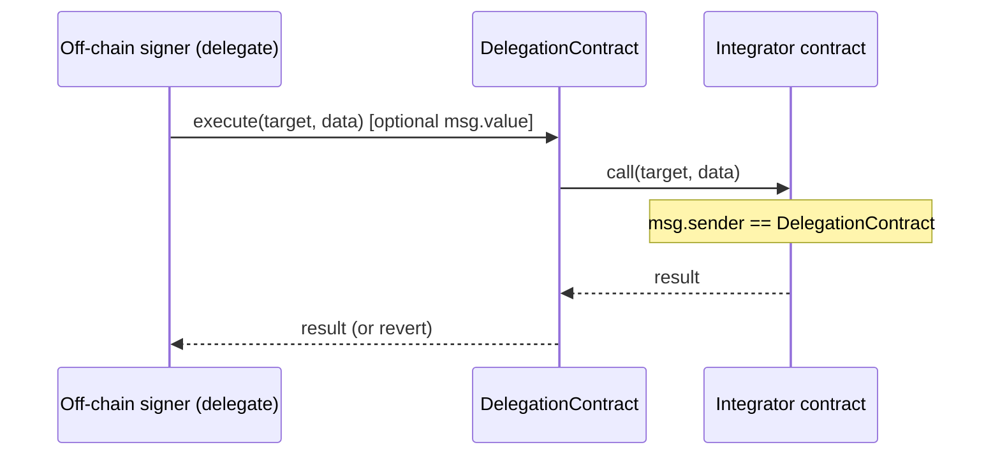
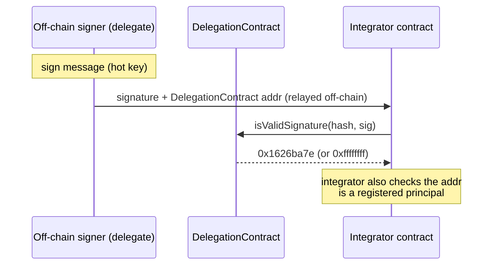

## Abstract

This standard defines `IDelegationContract` — an interface for a contract that holds execution authority for an on-chain role and routes it to a rotatable operational signing key. A `DelegationContract` sits between the integrator and an operator's hot key: the integrator grants the authority once to the contract address, and the contract's `owner` (a cold key or multisig) then chooses and rotates the active hot key (`delegate`) without any further action from the integrator.

An integrator consumes a Delegation Contract through two complementary integration models: a **push** model, where the delegate dispatches transactions through `execute()` so the target sees the contract as `msg.sender`; and a **pull** model, where the contract acts as an [ERC-1271](./eip-1271.md) signer and integrators verify relayed signatures via its `isValidSignature()`. A compromised hot key can be de-authorized immediately and replaced by owner to a new key without interaction with integrator.

The standard specifies the minimal interface and behavior a Delegation Contract must expose, and how integrators use each model. It builds on [ERC-1271](./eip-1271.md) and [ERC-5313](./eip-5313.md).

## Motivation

Operational compromise — leaked signing keys, compromised machines, and mishandled signers — is now a dominant cause of losses across the ecosystem, exceeding losses caused by smart-contract vulnerabilities. The largest and least-recoverable losses come from compromised signers.

Roles whose execution authority is exercised by an operator-held key are especially exposed. Such keys are frequently hot — they live on a machine that signs continuously — which makes them comparatively easy to compromise. Where rotating such a key requires a privileged on-chain operation by the integrator that granted the authority, two problems compound the risk: proactive rotation becomes too expensive to do regularly, so keys live longer than they should; and incident response is slow, because a replacement is authorized only once that operation executes.

This standard introduces a single delegation primitive that decouples the execution authority held on-chain from the key that exercises it. A standardized delegation contract can be used to:

- Rotate a hot key proactively as routine hygiene, with no on-chain action by the integrator and no service gap.
- De-authorize a suspected key and bring a replacement online.
- Let any role inherit the same rotation and revocation semantics, so monitoring can treat every delegated key uniformly.
- Migrate to a new signature scheme (e.g. post-quantum) without touching the integrator, because all signature verification lives inside the delegation contract and the integrator only performs a generic ERC-1271 check.

## Specification

The key words "MUST", "MUST NOT", "REQUIRED", "SHALL", "SHALL NOT", "SHOULD", "SHOULD NOT", "RECOMMENDED", "NOT RECOMMENDED", "MAY", and "OPTIONAL" in this document are to be interpreted as described in RFC 2119 and RFC 8174.

### Terms

- A **Delegation Contract** is a non-upgradeable smart contract that holds execution authority for a role and routes it to a single active signing key. It implements the `IDelegationContract` interface.
- An **Owner** is the address that controls a Delegation Contract's delegate lifecycle (assignment, revocation).
- A **Delegate** is the hot key — typically an EOA running in an off-chain bot — currently authorized to act through the Delegation Contract. There is at most one effective delegate at any time.
- An **Integrator** is the on-chain contract — a protocol, application, or any system — that grants execution authority to a Delegation Contract's address and checks that address when authorizing actions.
- The **push** model is integration via `execute()`: the delegate dispatches a call through the Delegation Contract, and the integrator sees the contract as `msg.sender`.
- The **pull** model is integration via [ERC-1271](./eip-1271.md): the integrator verifies a relayed signature by calling the Delegation Contract's `isValidSignature()`.

### Overview

A Delegation Contract has exactly one Owner and at most one effective Delegate. The Owner manages the Delegate over time (see [Rotation Flow](#rotation-flow)); the Delegate exercises the role through one of the two integration models below. An integrator selects the model that fits its verification approach — both MAY be supported by the same contract simultaneously.

#### Push Style — Transaction Execution via `execute()`

The delegate calls `execute(target, data)` on the Delegation Contract, which forwards the call to the target. From the target's perspective, `msg.sender` is the Delegation Contract address.



- `execute()` MUST be callable only by the current effective delegate.
- `execute()` MUST be `payable` and forward `msg.value` to the target, to support payable target functions that require ETH to be supplied at call time.
- If the target call reverts, `execute()` MUST revert atomically and return forwarded ETH to the delegate.
- After the target call returns, `execute()` MAY refund the unspent portion of `msg.value` — the amount the target did not consume — to the delegate (`msg.sender`).

Integrator requirements:

- The target contract MUST verify that `msg.sender` is a registered authority holder, i.e. equal to the Delegation Contract address.
- The delegate can call any target with any data; the contract does not restrict the target. The integrator MUST grant the Delegation Contract address only the narrowest authority required.

**When to use:** any integration where the delegate submits transactions that modify on-chain state and the target authorizes them by `msg.sender`.

#### Pull Style — ERC-1271 Signature Verification

The Delegation Contract is itself an [ERC-1271](./eip-1271.md) signer. The integrator treats the Delegation Contract address as the signing principal and verifies a relayed signature by calling that contract's `isValidSignature(hash, signature)`.



All delegation indirection lives inside `isValidSignature`: it resolves the current effective delegate via `getDelegate()` and validates the signature against it, keeping the integrator delegation-agnostic. The contract MUST fail closed — with no effective delegate (never assigned or revoked), `getDelegate()` is `address(0)` and `isValidSignature` MUST return the failure value `0xffffffff` rather than verify against `address(0)`. A key rotated or revoked after signing but before on-chain verification therefore causes `isValidSignature` to reject.

Integrator requirements:

- The integrator MUST treat the Delegation Contract address as the authorized principal: it MUST check both that the supplied address is a registered entity **and** that `isValidSignature` returns `0x1626ba7e`.
- The address MUST be relayed alongside the signature, and the signed message MUST bind that specific Delegation Contract address, so a signature cannot be replayed against a different contract that currently resolves to the same delegate.
- Any quorum or uniqueness logic over a set of such signatures MUST deduplicate on both the Delegation Contract address and the resolved delegate (`getDelegate()`); deduplicating on the contract address alone is insufficient, because two distinct contracts can share one delegate.

**When to use:** any integration where the integrator collects signatures off-chain and verifies them on-chain.

#### Rotation Flow

The Owner manages the delegate's lifecycle through assignment and revocation — neither of which requires any action from the integrator.

**Rotation — assignment.** The Owner calls `assignDelegate(newDelegate)` to replace the active delegate. The new delegate MAY become effective immediately, within the same transaction, or only after an implementation-defined cooldown; either way, the previously effective key (if any) MUST remain effective until the new one activates, so there is no interval lacking an active delegate. `assignDelegate` MUST revert if `delegate == owner` or if `delegate` is already the current effective delegate.

**Emergency revocation — hot-key compromise.** On any suspected or confirmed hot-key compromise the Owner calls `revokeDelegate()`, which MUST take effect immediately and clear the current delegate, leaving the contract with no effective delegate until a new one is assigned via `assignDelegate()`.

### Interfaces

A Delegation Contract MUST implement `IDelegationContract`.

#### `IDelegationContract.sol`

```solidity
interface IDelegationContract {
    // --- Owner controls ---

    /// @notice Assign (or reassign) the active delegate.
    ///         Only callable by owner.
    ///         Reverts if delegate == owner.
    ///         Reverts if delegate is already the current effective delegate.
    /// @param delegate Address of the incoming delegate.
    function assignDelegate(address delegate) external;

    /// @notice Immediately remove the current delegate.
    ///         Only callable by owner.
    function revokeDelegate() external;

    // --- Push integration ---

    /// @notice Execute an arbitrary non-delegate call on behalf of this contract.
    ///         Only callable by the current delegate.
    ///         Reverts if the target call reverts.
    ///         Forwards msg.value to the target to support payable targets.
    /// @param target  Address to call.
    /// @param data    Call data.
    /// @return result Return data from the call.
    function execute(address target, bytes calldata data)
        external
        payable
        returns (bytes memory result);

    // --- Pull integration (ERC-1271) ---

    /// @notice ERC-1271 signature validation. Returns the ERC-1271 magic value
    ///         (0x1626ba7e) if `signature` is a valid signature over `hash`
    ///         by the contract's current *effective* delegate; otherwise
    ///         returns 0xffffffff.
    ///         The delegate is resolved via getDelegate(), so validation
    ///         fails closed when there is no effective delegate (never
    ///         assigned or revoked → address(0)).
    ///
    ///         NOTE: unlike a raw ECDSA check, this result is state-dependent
    ///         and revocable — it can return valid at one block and invalid at
    ///         the next (e.g. after the delegate is rotated or revoked).
    /// @param hash      Message hash that was signed.
    /// @param signature Opaque signature bytes.
    function isValidSignature(bytes32 hash, bytes calldata signature)
        external
        view
        returns (bytes4 magicValue);

    // --- Views ---

    /// @notice The contract's owner (ERC-5313 ownership view).
    function owner() external view returns (address);

    /// @notice Returns the currently *effective* delegate, or address(0) when
    ///         there is no current delegate (never assigned, or revoked).
    function getDelegate() external view returns (address);

    // --- Events ---

    event DelegateAssigned(address indexed newDelegate);
    event DelegateRevoked(address indexed revokedDelegate);
}
```

## Rationale

The design is motivated by the need for a standardized, minimal, and structurally safe way to delegate the execution authority of a single role to a rotatable key. Several considerations were taken into account:

**Minimal, non-upgradeable surface.** A purpose-built contract makes the guarantees structural: the owner can never `execute()` or sign, there is exactly one active delegate, and revocation is always immediate. Keeping the audited surface small reduces both attack surface and the chance of misconfiguration, at the cost of flexibility this role does not need.

**Interoperability.** Reusing [ERC-1271](./eip-1271.md) for the pull model lets existing signature-verifying contracts and libraries treat a Delegation Contract as any other smart-contract signer, and [ERC-5313](./eip-5313.md) exposes the owner to generic tooling. No change to the integrator is required beyond registering the contract address as the principal.

**Assignment timing left to the implementation.** `revokeDelegate()` MUST always take effect immediately, since it is a safety action that must never be delayed. `assignDelegate()`, by contrast, MAY take effect immediately or only after an implementation-defined cooldown: immediate assignment keeps the contract's storage and behavior minimal, with no scheduling state to reason about, while a cooldown instead gives a still-trusted party a window to react to an unexpected assignment before it takes effect.

**Cryptographic agility kept outside the integrator.** Routing all signature verification through the contract's ERC-1271 method means a future change of signature scheme requires updating only the delegation layer (or the owner's signer), not every integrator, which remains agnostic to how a signature is produced.

### Relationship to existing delegation standards

[ERC-7710](./eip-7710.md) standardizes flexible, caveat-bounded capability sharing redeemed through a Delegation Manager, oriented toward smart-account sessions. This standard solves a narrower problem — operational rotation of a single hot key for a fixed role — and so deliberately omits scoped caveats, a manager indirection, and per-action policy in favor of a fixed contract with immediate revocation and assignment that is either immediate or cooldown-gated. The two are complementary: a role could be held by a `DelegationContract` under this standard while a separate account uses ERC-7710 for capability delegation.

## Backwards Compatibility

This EIP introduces a new interface and does not modify any existing standard or on-chain behavior. Adopting it requires no change to an integrator beyond registering a Delegation Contract's address as the authorized principal instead of an operator's key directly, so it does not introduce any backward incompatibilities.

## Reference Implementation

A production implementation exists as the `lidofinance/execution-delegation-framework` project. It is wider than this specification, adding a few extensions that implementations MAY find useful: [ERC-165](./eip-165.md) `supportsInterface`, explicit `getPendingDelegate()`/`getCooldown()` views for a cooldown-gated deployment, and an irreversible `terminate()` escape hatch for a suspected owner-key compromise.

## Security Considerations

- **Owner is the critical security boundary.** Because the owner controls the delegate's lifecycle, it SHOULD be a multisig or hardware-backed cold wallet, not a bare EOA. A compromised owner cannot directly act as the contract (it can neither `execute()` nor sign), but it can revoke the legitimate delegate and install one of its own choosing. If the implementation assigns immediately, the owner key is the sole safeguard against a malicious swap, since there is no on-chain reaction window. If it instead gates assignment behind a cooldown, that cooldown is the primary mitigation: a malicious assignment stays visible and reversible by a still-trusted party until it activates, and monitoring of `DelegateAssigned` and `DelegateRevoked` is REQUIRED for that mitigation to provide value. Integrators SHOULD understand which timing model a given Delegation Contract uses before relying on it.
- **Unrestricted `execute()` target.** The push model lets the delegate call any target with any data. The blast radius of a compromised delegate is therefore exactly the execution authority granted to the Delegation Contract address. The integrator MUST grant the narrowest authority required.
- **Signature binding in the pull model.** A relayed signature that doesn't bind the specific Delegation Contract address and chain it is meant for would validate for every contract that currently resolves to the same delegate, enabling cross-contract (and cross-chain) replay. Verifying that binding is the integrator's responsibility; this ERC does not regulate how a signed message is constructed or bound, only how the resulting signature is checked via `isValidSignature`.
- **State-dependent validity.** Unlike a raw ECDSA recovery, `isValidSignature` is revocable: it can return valid in one block and invalid in the next after a rotation or revocation. Integrators relying on a previously valid signature MUST re-check at the point of on-chain use and MUST treat a non-magic return as authoritative (fail closed).

## Copyright

Copyright and related rights waived via [CC0](../LICENSE.md).
