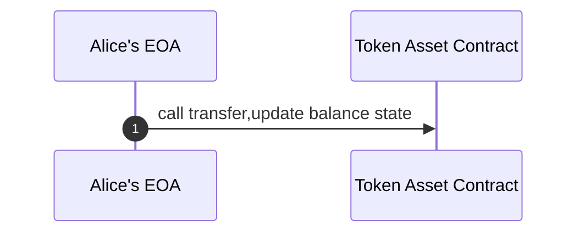
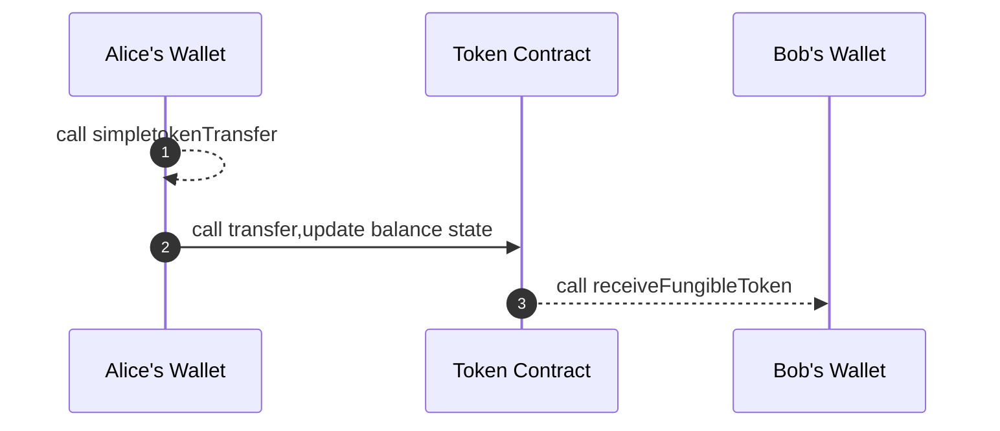
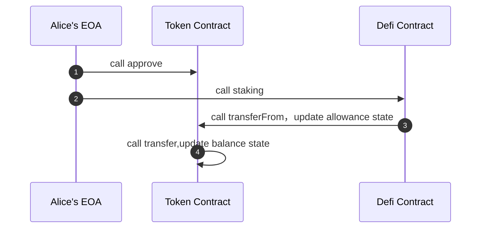
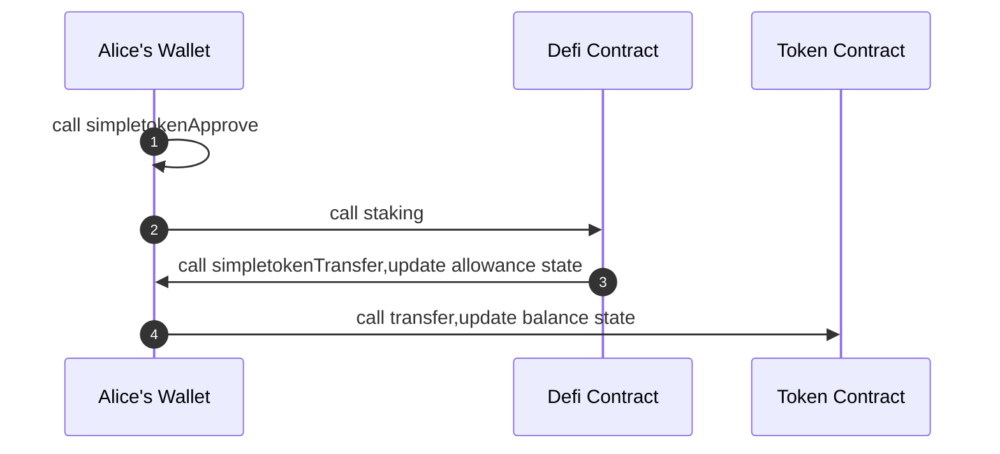

## Abstract

A proposal to manage simple tokens by the user's smart contract wallet, which provides a new way to manage assets, utilizes the programmability of the smart contract wallet, and also provides more playability.

## Motivation

An externally-owned account (EOA) wallet has no state and code storage, while the smart contract wallet does.

Account abstraction (AA) is a direction of the smart contract wallet, which works around abstract accounts. This ERC can also be an extension based on [ERC-4337](./eip-4337.md) or as a plug-in for wallets.

The smart contract wallet allows the user's own account to have state and code, bringing programmability to the wallet. We think there are more directions to expand. For example, token asset management, functional expansion of token transactions, etc.

The smart contract wallet interface of this ERC is for asset management and asset approval. It supports the simpletoken ERC-X, and [ERC-20](./eip-20.md) is backward compatible with ERC-X, so it can be compatible with the management of all fungible tokens in the existing market.

The proposal aims to achieve the following goals:

1. Assets are allocated and managed by the wallet itself, such as approve and allowance, which are configured by the user’s contract wallet, rather than controlled by the token asset contract, to avoid some existing ERC-20 contract risks.
2. Add the `simpletokenTransfer` function, the transaction initiated by the non-smart wallet itself or will verify the allowance amount
3. Add `simpletokenApprove`, `simpletokenAllowance`, `simpletokenApproveForAll`, `simpletokenIsApproveForAll` functions. The user wallet itself supports approve and provides approve 
 for single token assets and all token assets (simpletoken is forward compatible with [ERC-20](./eip-20.md)).
4. user wallet can choose batch approve and batch transfer. 
5. Users can choose to add hook function before and after their `simpletokenTransfer` to increase the user's more playability
6. The user can choose to implement the `simpletokenReceive` function


## Specification

The key words "MUST", "MUST NOT", "REQUIRED", "SHALL", "SHALL NOT", "SHOULD", "SHOULD NOT", "RECOMMENDED", "NOT RECOMMENDED", "MAY", and "OPTIONAL" in this document are to be interpreted as described in RFC 2119 and RFC 8174.

** Compliant contract must implement the [ERC-165](./erc-165) interfaces**

```solidity
/// @title ERC-7204 
/// @dev See https://eips.ethereum.org/EIPS/eip-7204
/// @dev Note: the ERC-165 identifier for this interface is 0xf73edcda
pragma solidity ^0.8.20;

interface IERC7204 /* is ERC165 */ {

    /**
     * @notice Used to notify listeners that owner has granted approval to the user to manage assets tokens.
     * @param asset Address of the simple token
     * @param owner Address of the account that has granted the approval for token‘s assets
     * @param spender Address of the spender
     * @param value The amount allowed to spend
     */
    event SimpletokenApproval(
        address indexed asset,
        address indexed owner, 
        address indexed spender, 
        uint256 value
    );

    /**
     * @notice Used to notify listeners that owner has granted approval to the spender to manage all token .
     * @param asset Address of the simple token
     * @param owner Address of the account that has granted the approval for token‘s assets
     * @param approved approve all token
     */
    event SimpletokenApprovalForAll(
        address indexed owner, 
        address indexed spender,
        bool approved
    );

    /**
     * @notice Approve simple token
     * @dev Allows spender address to withdraw from your account multiple times, up to the value amount.
     * @dev If this function is called again it overwrites the current allowance with value.
     * @dev Emits an {SimpletokenApproval} event.
     * @param asset Address of the simple token
     * @param spender Address of the spender
     * @param value The amount allowed to spend
     * @return success The bool value returns whether the approve is successful
     */
    function simpletokenApprove(address asset, address spender, uint256 value) 
        external 
        returns (bool success);

    /**
     * @notice read simple token allowance value
     * @param asset Address of the simple token
     * @param spender Address of the spender
     * @return remaining The asset amount which spender is still allowed to withdraw from owner.
     */
    function simpletokenAllowance(address asset, address spender) 
        external
        view
        returns (uint256 remaining);

    /**
     * @notice Approve all simple token
     * @dev Allows spender address to withdraw from your wallet all simple token.
     * @dev Emits an {SimpletokenApprovalForAll} event.
     * @param spender Address of the spender
     * @param approved Approved all tokens
     * @return success The bool value returns whether the approve is successful
     */
    function simpletokenApproveForAll(address spender, bool approved) 
        external 
        returns (bool success);

    /**
     * @notice read spender approved value
     * @param spender Address of the spender
     * @return approved Whether to approved spender all tokens
     */
    function simpletokenIsApproveForAll(address spender) 
        external
        view
        returns (bool approved);

    /**
     * @notice Transfer simple token
     * @dev must call asset.transfer() inside the function
     * @dev If the caller is not wallet self, must verify the allowance and update the allowance value
     * @param asset Address of the simple token
     * @param to Address of the receive
     * @param value The transaction amount
     * @return success The bool value returns whether the transfer is successful
     */
    function simpletokenTransfer(address asset, address to, uint256 value) 
        external 
        returns (bool success); 
}
```


## Rationale

Use the sequence diagram to compare the difference between using this interface to transfer tokens.

**Alice calls the transfer interface by herself**

The user does not use this ERC to call the transaction sequence diagram(transfer).



The user use this ERC to call the transaction sequence diagram (Alice's Wallet implements this ERC), dotted lines are optional.



**Other contract calls Alice’s asset transfer interface**

Sequence diagram of third party calling user transaction without using this ERC(transferForm).



Sequence diagram of third party calling user transaction using this ERC(simpletokenTransfer).




## Backwards Compatibility

This ERC can be used as an extension of [ERC-4337](./erc-4337.md) and is backward compatible with ERC-4337.

## Security Considerations

No security considerations were found.

## Copyright

Copyright and related rights waived via [CC0](../LICENSE.md).
