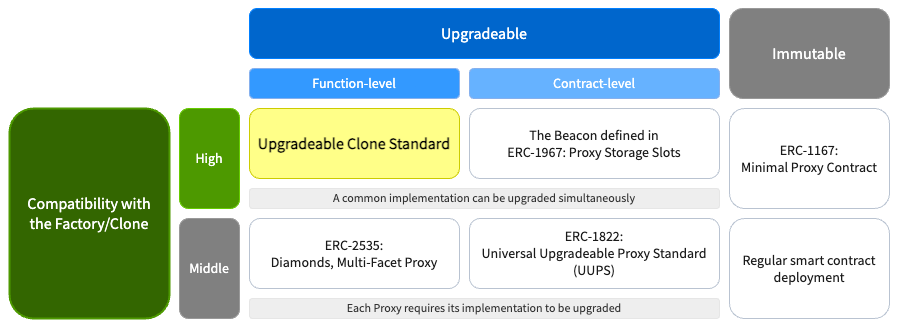
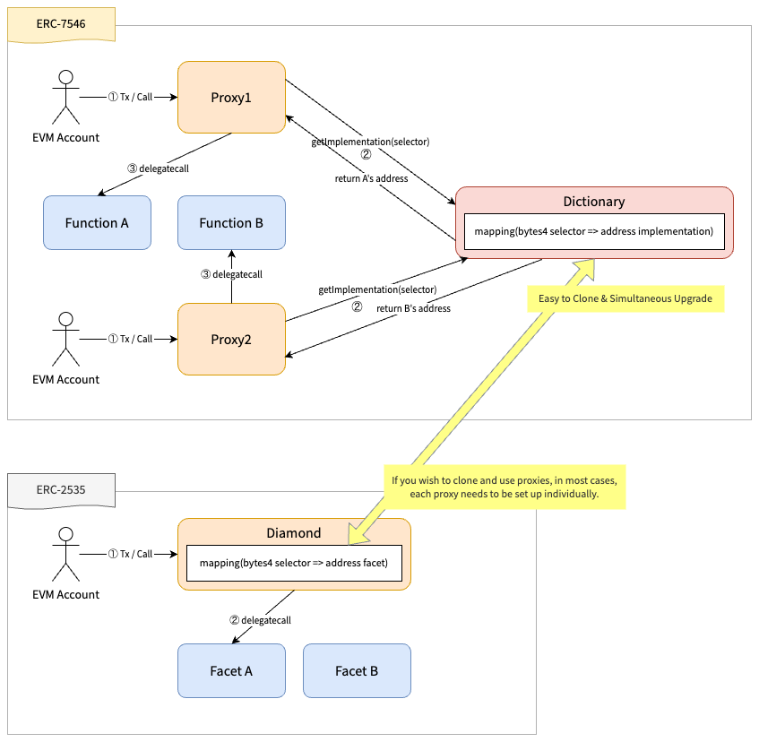
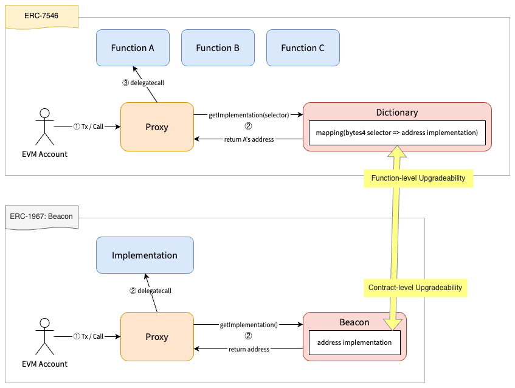

## Abstract
It has been a significant challenge for developers attempting to create cloneable and upgradeable contracts on the Ethereum Virtual Machine (EVM). While UUPS and the Diamond Standard offer partial solutions, a comprehensive answer has remained elusive. Our proposal addresses this gap through the introduction of two main features.

### Function-Level Upgradeability
In alignment with [ERC-2535](./erc-2535.md), this functionality permits the selective redirection of implementation contracts for individual function calls. This granular control over upgrades allows for modifications on a per-function basis. Moreover, segmenting implementation contracts by function helps mitigate the limitations posed by the contract size cap (24.576kB as of EVM version Shanghai or earlier).

### Factory/Clone-Friendly & Simultaneous Upgradeability
Drawing on the Beacon model from [ERC-1967](./erc-1967.md), our method aims to streamline the process of cloning and updating Proxy contracts simultaneously. This approach is designed to maintain consistent functionality across different instances, each with its own state. Typically, proxies are limited to basic upgradeability features or follow the [ERC-1167 Minimal Proxy](./erc-1167.md) standard. However, our solution combines both functionalities into a compact proxy, developed using the Huff language.

## Motivation
Smart contract development often encounters hurdles due to the inherent limitations of the Ethereum Virtual Machine (EVM), such as the contract size limit and stack depth. Additionally, addressing vulnerabilities in both the smart contract logic and its compiler are persistent issues. While there is a desire to minimize reliance on trusted third parties for upgradeability, introducing complex governance structures for upgrade management can significantly increase the workload for crypto DevOps, adding to the apprehension developers may feel towards advancing their projects. This apprehension can restrict the complexity and innovation within smart contract development. Our approach seeks to simplify smart contract programming, making it more accessible and enjoyable. It does so by clearly delineating DevOps concerns from business logic, thereby enhancing codebase clarity, facilitating audits, and allowing for more focused analysis through Language Model (LM) techniques, tailored to specific infrastructure and domain needs.

### Use Cases
Over time, various smart contract design patterns have been proposed and utilized. This *Upgradeable Clone Standard (UCS)* is intended for scenarios where these existing patterns may not suffice. To clarify it, we define some key terms:

- **Contract-Level Upgradeability**: One Proxy contract corresponds to one Implementation contract, responsible for all logic of the Proxy.
- **Function-Level Upgradeability**: One Proxy contract corresponds to multiple Implementation contracts, basically each responsible for a specific function.
- **Factory**: A contract that clones Proxies with a common Implementation(s). In the context of upgradeability, it allows for the simultaneous upgrade of these cloned Proxies.

Here are the use cases:

1. For basic needs without Upgradeability or a Factory, *Regular smart contract deployment* suffices.
2. When a Factory is needed without Upgradeability, [ERC-1167](./erc-1167.md) is suitable.
3. For Contract-Level Upgradeability without a Factory, [ERC-1822](./erc-1822.md) can be used.
4. For Contract-Level Upgradeability with a Factory, the Beacon from [ERC-1967](./erc-1967.md) is applicable.
5. For Function-Level Upgradeability without a Factory, [ERC-2535](./erc-2535.md) is available.
6. For Function-Level Upgradeability with a Factory, this ***Upgradeable Clone Standard*** is the ideal choice.




## Specification
> The key words "MUST", "MUST NOT", "REQUIRED", "SHALL", "SHALL NOT", "SHOULD", "SHOULD NOT", "RECOMMENDED", "NOT RECOMMENDED", "MAY", and "OPTIONAL" in this document are to be interpreted as described in RFC 2119 and RFC 8174.

In the EVM, contract accounts are characterized by four primary fields: *nonce*, *balance*, *code*, and *storage*. This ERC's architecture modularizes these functionalities into three distinct types of contracts, each serving a specific purpose when combined to represent a single account:

1. **Proxy Contract**: Maintains the state of the contract account, such as nonce, balance, and storage. This contract delegatecalls to the `Function Contract` as registered in the `Dictionary Contract`, ensuring the state and logic are separated but effectively integrated.
2. **Dictionary Contract**: Acts as a dispatcher that routes function calls based on their selectors to the appropriate `Function Contract`. It manages the dynamic aspects of contract behavior, facilitating function upgrades and dynamic addressing. By externalizing this contract from the `Proxy Contract`, it becomes factory/clone-friendly and supports simultaneous upgradeability.
3. **Function (Implementation) Contract**: Implements the executable logic for function calls. When delegatecalled by the `Proxy Contract`, it performs the actual computations or logic as defined in the contract's code.

This architecture not only aligns with the core attributes of an EVM contract account but also significantly enhances the modularity, upgradeability, and scalability of smart contracts by clarifying account state, function dispatching, and logic implementation.

### Proxy Contract
This contract requests the `Dictionary Contract` to retrieve the associated `Function Contract` address based on its function selector, and then delegatecall to it.

#### Storage & Events
This contract SHOULD store the `Dictionary Contract` address in the storage slot `0x267691be3525af8a813d30db0c9e2bad08f63baecf6dceb85e2cf3676cff56f4`, obtained as `bytes32(uint256(keccak256('erc7546.proxy.dictionary')) - 1)`, in accordance with the method defined in [ERC-1967](./erc-1967.md). This ensures that the address is stored in a secure and predictable slot.

Changes to the Dictionary address SHOULD be noticed:
```solidity
event DictionaryUpgraded(address indexed dictionary);
```

#### Functions
For every invocation made via `CALL` or `STATICCALL`, this contract MUST perform a delegatecall to the corresponding `Function Contract` address retrieved from the `Dictionary Contract` using the `getImplementation(bytes4 functionSelector)` function. This contract MUST also process the return value from this delegatecall to ensure the intended functionality is executed correctly. Furthermore, to avoid potential collisions with function selectors registered in the `Dictionary Contract`, the Proxy SHOULD NOT define any external functions.

### Dictionary Contract
This contract manages a mapping of function selectors to corresponding `Function Contract` addresses. It uses this mapping to handle requests from the `Proxy Contract`.

#### Storage & Events
The Dictionary MUST maintain a mapping of function selectors to `Function Contract` addresses.

Changes to this mapping SHOULD be communicated through an event (or log).

```solidity
event ImplementationUpgraded(bytes4 indexed functionSelector, address indexed implementation);
```

#### Functions
##### `getImplementation`
This contract MUST implement this function to return `Function Implementation Contract` addresses.

```solidity
function getImplementation(bytes4 functionSelector) external view returns (address);
```

##### `setImplementation`
This contract SHOULD implement this function to update or add new function selectors and their corresponding `Function Implementation Contract` addresses to the mapping.

```solidity
function setImplementation(bytes4 functionSelector, address implementation) external;
```

##### `supportsInterface`
This contract is RECOMMENDED to implement the `supportsInterface(bytes4 interfaceID)` function defined in [ERC-165](./erc-165.md) to indicate which interfaces are supported by the contracts referenced in the mapping.

##### `supportsInterfaces`
This contract is RECOMMENDED to implement the `supportsInterfaces()` to return a list of registered interfaceIDs.
```solidity
function supportsInterfaces() public view returns (bytes4[] memory);
```

### Function (Implementation) Contract
This contract acts as the logic implementation contract that the `Proxy Contract` delegatecalls and it's address is registered with the function selector in the `Dictionary Contract`.

#### Storage & Events
This contract SHOULD NOT use its storage but SHOULD store to the `Proxy Contract` through delegatecall.

The `Proxy Contract` shares storage layout with several `Function Contracts`. For example, using sequential slot allocation starting from slot 0, as is the default compiler option, can lead to storage conflicts.

In order to prevent storage conflict, this contract MUST manage the storage layout properly. The matter of storage management techniques has been a subject of debate for years, both at the ERC level and the language level. However, there is still no definitive standard. Therefore, this ERC does not go into the specifics of storage management techniques.

It is RECOMMENDED to choose the storage management method that is considered most appropriate at the time.

For instance, the storage is arranged according to useful storage layout patterns, such as ***[ERC-7201](./erc-7201.md)***.

#### Functions
This contract MUST have the same function selector registered in the `Dictionary Contract`. If not, the Proxy's delegatecall will fail. So it is RECOMMENDED for each `Function Contract` to implement ERC-165's `supportsInterface(bytes4 interfaceID)` to ensure that it correctly implements the function selector being registered when added to the Dictionary.


## Rationale
### Comparison with [ERC-2535](./erc-2535.md)
While both this ERC and ERC-2535 offer [Function-Level Upgradeability](#function-level-upgradeability), there is a key distinction in their approaches. ERC-2535 maintains a mapping of implementation contracts (referred to as Facets in ERC-2535) within the Proxy itself. In contrast, this ERC stores the mapping in an external `Dictionary Contract`. This externalization of the mapping facilitates another significant feature of this standard: [Factory/Clone-Friendly & Simultaneous Upgradeability](#factoryclone-friendly--simultaneous-upgradeability). By separating the mapping from the Proxy, this design allows for easier cloning of contracts and their simultaneous upgrade, which is not as straightforward in the ERC-2535 framework.



### Separating the Dictionary and Proxy contracts:
The separation of the Dictionary from the Proxy was driven by aligning with [Factory/Clone-Friendly & Simultaneous Upgradeability](#factoryclone-friendly--simultaneous-upgradeability).

To achieve this, the management functionality of `Function Implementation Contract` addresses were externalized as the `Dictionary Contract` instead of including them within the `Proxy Contract`, a concept akin to the Beacon Proxy approach.

If the functionality is within the `Proxy Contract`, each proxy requires its implementation to be upgraded.
By externalizing this, a common implementation can be cloned and upgraded simultaneously.



### Utilizing the mapping of function selectors and implementation addresses:
The utilization of the mapping of function selectors to corresponding `Function Implementation Contract` addresses of the `Dictionary Contract` by the `Proxy Contract`, followed by delegatecalling to the returned implementation address, aligns with [Function-Level Upgradeability](#function-level-upgradeability).

By adopting this approach, the Proxy emulates the behavior of possessing a set of `Function Implementation Contracts` registered within the `Dictionary Contract`. This specification closely resembles the pattern outlined in the Diamond Standard.


## Reference Implementation
There are reference implementations and tests as a foundry project.

It includes the following contents:
- Reference Implementations
  - [Proxy Contract](../assets/erc-7546/src/proxy/ERC7546Proxy.sol)
  - [Dictionary Contract](../assets/erc-7546/src/dictionary/Dictionary.sol)
- Tests
  - [Test suite](../assets/erc-7546/test/ERC7546Test.t.sol)


## Security Considerations
### Delegation of Implementation Management
This pattern of delegating all implementations for every call to the `Dictionary Contract` relies on the assumption that the `Dictionary Contract`'s admin acts in good faith and does not introduce vulnerabilities through negligence.

You should not connect your proxy with the `Dictionary Contract` provided by an untrusted admin. Moreover, providing an option to switch to another `Dictionary Contract` managed by a different (or potentially more trustworthy) admin is recommended.

While it is possible to store the `Dictionary Contract` address in the code area (e.g., using Solidity's immutable or constant), it SHOULD be designed with caution, considering the possibility that if the `Dictionary Contract`'s admin is not the same as the `Proxy Contract`'s admin, the ability to manipulate the implementation could be permanently lost.

### Storage Conflict
As mentioned in the above [Storage section](#storage--events-2). This design pattern involves multiple `Function Implementation Contracts` sharing a single `Proxy Contract` storage. Therefore, it's important to take care for preventing storage conflicts by using the storage management method that is considered most appropriate at the time.

### Mismatch Function Selector
The `Dictionary Contract` returns the `Function Implementation Contract` address based on the `Proxy Contract`'s invoked function selector.

If there is a mismatch between function selectors registered in the `Dictionary Contract` and those implemented in the `Function Implementation Contract`, the execution will fail. To prevent unexpected behavior, it's recommended to check that the `Function Implementation Contract` includes the function selector (interface) being registered during the process for setting implementation address to the `Dictionary Contract`.

### Handling of CALL and STATICCALL
The `Proxy Contract` is designed primarily to respond to `CALL` and `STATICCALL` opcodes. Should a `DELEGATECALL` be made to this `Proxy Contract`, it will attempt to request the `Dictionary Contract` for a corresponding implementation via the `getImplementation(bytes4 functionSelector)` function, using the stored `Dictionary Contract` address within its own storage. Although this action may not lead to the intended outcome if the calling contract's storage layout does not align with expectations, it does not constitute a direct threat to the `Proxy Contract` itself. Developers are cautioned that invoking this `Proxy Contract` via `DELEGATECALL` could result in unexpected and potentially non-functional outcomes, making it an unsuitable method for interaction.


## Copyright
Copyright and related rights waived via [CC0](../LICENSE.md).
