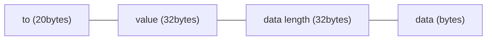

## Abstract
Batch Calls Encoding (BCE) outlines a solution for Smart Contract Account (SCA) wallets to consolidate multiple calls into a single call, encoding multiple parameters into bytes, compressing on-chain data, and saving gas. It can be used to implement atomic operations as well as non-atomic operations.

## Motivation
Typically, interactions between users and contracts involve a series of coherent operations, such as `approve`-`transferFrom`. While EOA wallets require users to confirm each operation sequentially, SCA wallets can confirm all operations with a single confirmation, completing all operations within a single call, thus achieving atomicity. If `approve` succeeds but `transferFrom` fails, it poses a security risk. The secure approach is to ensure that if one operation fails, all associated operations also fail, thereby ensuring atomicity. Therefore, we propose this encoding method to encode multiple parameters into bytes, compress on-chain data, and save gas. It can be used to implement both atomic and non-atomic operations.

In addition to the atomic operation of `approve`-`transferFrom` mentioned above, gas payment delegation can also be achieved. It involves users and bundlers signing a set of calls, where the content of the calls includes:

1. The user wishes to initiate multiple calls through his SCA.
2. The user transfers 10 USDT to the bundler as fee, included within the calls.
3. The bundler submits the calls, pay ETH gas and get the 10 USDT.

The user encodes the content of the calls, attaches their signature to ensure its integrity, and sends it to the bundler. If the bundler considers the gas payment insufficient, they may choose not to submit it. However, if they approve the content of the calls, the signed transaction can be submitted. After execution, the user obtains the desired operations, and the bundler receives the fee.

[EIP-4337](./eip-4337.md) also implements gas payment delegation. BCE and [EIP-4337](./eip-4337.md) are not mutually exclusive and can be implemented concurrently within an SCA.

Based on empirical testing, BCE is simpler and more gas-efficient compared to alternative methods.

## Specification
The key words "MUST", "MUST NOT", "REQUIRED", "SHALL", "SHALL NOT", "SHOULD", "SHOULD NOT", "RECOMMENDED", "NOT RECOMMENDED", "MAY", and "OPTIONAL" in this document are to be interpreted as described in RFC 2119 and RFC 8174.

This ERC **REQUIRED** SCA to be implemented in the contract, where the Dapp communicates with the SCA wallet extension to communicate the user's intentions to the wallet, which uses Batch Calls Encoding to send multiple calls as bytes to the user's SCA contract.

_Batch Calls_ comprises multiple `Call` bytes, each defined by the encoding of `to`\`value`\`data` as follows:



Let:
- `to`: The address of the called contract, corresponding to the Solidity address type, 20 bytes.
- `value`: The amount of ETH(in wei) sent to the contract, in wei, corresponding to the Solidity uint type, 32 bytes.
- `data length`: The length of the data(in bytes), corresponding to the Solidity uint type, 32 bytes.
- `data`: The encoded functionData sent to the contract, corresponding to the Solidity bytes type, with a length defined by `data length`.

Multiple `Call` units are concatenated to form an _Batch Calls_ sequence.


## Rationale
Each call encapsulates 3 parameters: `to`\`value`\`data`. The conventional approach involves packaging these 3 parameters into a struct and then placing multiple structs into an array. However, using a struct adds overhead as it also packages the types of `to`\`value`\`data`, increasing the size of the encoding. Since `to`\`value`\`data` have fixed types, this additional encoding can be omitted. In Solidity, reading data from `bytes calldata` using slice is a gas-efficient method. Considering these factors, _Batch Calls Encoding_ can compress on-chain data and save gas.

## Backwards Compatibility
This ERC does not change the consensus layer, so there are no backwards compatibility issues for Ethereum as a whole. 

This ERC does not change other ERC standards, so there are no backwards compatibility issues for Ethereum applications. 


## Reference Implementation
This proposal only specifies the encoding of _Batch Calls_, while the specific implementation and naming are left to the discretion of the project. Below is an example of an SCA contract utilizing _Batch Calls_ (referred to as `atomCallbytes`), where the user atomically signs multiple operations, enabling the bundler to pay gas on behalf of the user:

### `SmartWallet.sol`

```solidity
pragma solidity ^0.8.0;

import "@openzeppelin/contracts/utils/cryptography/ECDSA.sol";

contract SmartWallet {
    using ECDSA for bytes32;

    uint32 public valid = 1; //to make AtomSign invalid

    address private immutable original;
    address public owner;
    address public bundler;

    mapping(bytes32 => bool) public usedMsgHashes;

    modifier onlyBundler() {
        require(
            bundler == msg.sender,
            "onlyBundler: caller is not the bundler"
        );
        _;
    }

    modifier onlyOwnerAndOriginal() {
        require(
            owner == msg.sender || original == msg.sender,
            "onlyOwnerAndOriginal: caller is not the owner"
        );
        _;
    }

    constructor(address _bundler) {
        original = address(this);
        owner = msg.sender;
        bundler = _bundler;
    }

    function atomSignCall(
        bytes calldata atomCallbytes,
        uint32 deadline,
        bytes calldata signature
    ) external onlyBundler {
        require(deadline >= block.timestamp, "atomSignCall: Expired");
        bytes32 msgHash = keccak256(
            bytes.concat(
                msg.data[:msg.data.length - signature.length - 32],
                bytes32(block.chainid),
                bytes20(address(this)),
                bytes4(valid)
            )
        );
        require(!usedMsgHashes[msgHash], "atomSignCall: Used msgHash");
        require(
            owner == msgHash.toEthSignedMessageHash().recover(signature),
            "atomSignCall: Invalid Signature"
        );

        //do calls
        uint i;
        while(i < atomCallbytes.length) {
            address to = address(uint160(bytes20(atomCallbytes[i:i+20])));
            uint value = uint(bytes32(atomCallbytes[i+20:i+52]));
            uint len = uint(bytes32(atomCallbytes[i+52:i+84]));

            (bool success, bytes memory result) = to.call{value: value}(atomCallbytes[i+84:i+84+len]);
            if (!success) {
                assembly {
                    revert(add(result, 32), mload(result))
                }
            }

            i += 84 + len;
        }

        usedMsgHashes[msgHash] = true;
    }

    /**
     * if you signed something then regretted, make it invalid
     */
    function makeAtomSignInvalid() public onlyOwnerAndOriginal {
        valid = uint32(uint(blockhash(block.number)));
    }
}
```

### `Bundler.sol`

```solidity
pragma solidity ^0.8.0;

contract Bundler {

    address public owner;

    modifier onlyOwner() {
        require(
            owner == msg.sender,
            "onlyOwner: caller is not the owner"
        );
        _;
    }

    constructor() {
        owner = msg.sender;
    }

    function executeOperation(
        address wallet,
        bytes calldata data
    ) public onlyOwner {
        (bool success, bytes memory result) = _callTo.call{value: 0}(data);

        if (!success) {
            assembly {
                revert(add(result, 32), mload(result))
            }
        }
    }
}
```

## Security Considerations
This proposal introduces a data encoding scheme aimed at data compression. It solely concerns data compression and does not lead to data loss or concealment of private data.


## Copyright
Copyright and related rights waived via [CC0](../LICENSE.md).

