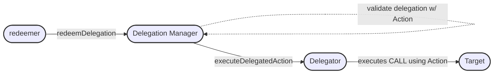

## Abstract

This proposal defines interfaces for smart contracts to delegate capabilities to other smart contracts,
smart contract accounts, or Externally Owned Accounts (EOAs). The delegating contract MUST
implement [ERC-1271](./erc-1271.md) along with the `IDelegator` interface. This framework empowers a
delegating contract with the ability to delegate any actions it has the authority to perform,
thereby enabling more flexible and scalable contract interactions. This standard outlines the
minimal interface necessary to facilitate such delegation.

Additionally, this proposal is compatible with [ERC-4337](./erc-4337.md), although its implementation does not
necessitate ERC-4337.

## Motivation

The development of smart contracts on Ethereum has led to a diverse array of decentralized applications (dApps)
that leverage composability to interact with one another in innovative ways. While current smart contracts are
indeed capable of working together, enabling these interactions, especially in the realm of sharing capabilities
or permissions, remains a tedious and often gas-expensive process, which lacks backwards compatibility.

Currently, for a smart contract to interact with or utilize the functionality of another, it typically requires
hardcoded permissions or the development of bespoke, intermediary contracts. This not only increases the complexity and
development time but also results in higher deployment and execution gas costs. Moreover, the rigid nature of these
interactions limits the ability to adapt to new requirements or to delegate specific, limited permissions in a dynamic
manner.

The proposed standard aims to simplify and standardize the process of delegation between contracts, reducing the
operational complexity and gas costs associated with shared capabilities. By establishing a common framework for
delegating permissions, we can streamline interactions within the Ethereum ecosystem, making contracts more flexible,
cost-effective, and adaptable to the needs of diverse applications. This opens up new possibilities for collaboration
and innovation, allowing dApps to leverage each other's strengths in a more seamless and efficient manner.

## Specification

The key words "MUST", "MUST NOT", "REQUIRED", "SHALL", "SHALL NOT", "SHOULD", "SHOULD NOT", "RECOMMENDED", "NOT
RECOMMENDED", "MAY", and "OPTIONAL" in this document are to be interpreted as described in RFC 2119 and RFC 8174.

### Terms

- A **Delegator** is a smart contract that can create a delegation. It implements the `IDelegator` interface, which
  implements ERC-1271.
- A **Delegation Manager** is a singleton smart contract that is responsible for validating delegation authority and
  calling on the *Delegator* to execute an action. It implements the `IDelegationManager` interface.
- A **delegation** is an authority given to another address to perform a specific action.
- A **delegate** is a smart contract, smart contract account, or EOA that has authority to redeem a delegation.
- A **redeemer** is a *delegate* that is using a delegation.

### Overview

#### Redeeming a Delegation

When a delegate wishes to redeem a delegation, they call the `redeemDelegation` function on the Delegation Manager and
pass in the Action they want to execute and the proof of authority (ie delegation) which they are executing on behalf
of. The Delegation Manager then verifies the delegation's validity and, if valid, calls the privileged function on the
Delegator which executes the specified capability on behalf of the Delegator.



### Interfaces

#### `IDelegator.sol`

To comply with this standard, a smart contract MUST implement this execution
interface to become a Delegator.

The `executeDelegatedAction` function SHOULD only allow calls from an approved Delegation Manager.

```solidity
pragma solidity 0.8.23;
/**
 * @notice Action struct is a basic Call struct.
 * @title Action
 * @notice This struct represents an action to be taken.
 * @dev It only includes the functional part of a transaction, allowing it to be
 * agnostic whether this was sent from a protocol-level tx or UserOperation.
 */
struct Action {
    address to;
    uint256 value;
    bytes data;
}

/**
 * @title IDelegator
 * @notice Interface for a Delegator that exposes the minimal functionality required.
 */
interface IDelegator is IERC1271 {
    /**
     * @notice executes a CALL using the data provided in the action
     * @dev SHOULD enforce calls coming from an approved DelegationManager address
     * @param _action the onchain action to perform
     */
    function executeDelegatedAction(Action calldata _action) external;
}
```

#### `IDelegationManager.sol`

The Delegation Manager MUST implement the `redeemDelegation` which will be responsible for validating the delegation
being invoked, and will then call the `executeDelegatedAction` on the delegating contract.

The bytes `_data` passed in as a parameter to the `redeemDelegation` function contains the authority to execute a
specific action on behalf of the delegating contract.

```solidity
pragma solidity 0.8.23;
/**
 * @title IDelegationManager
 * @notice Interface for Delegation Manager that exposes the redeemDelegation function.
 */
interface IDelegationManager {
    /**
     * @notice This method validates the provided data and executes the action if the caller has authority to do so.
     * @dev the structure of the _data bytes is determined by the specific Delegation Manager implementation
     * @param _data the data used to validate the authority given to execute the action.
     * @param _action the action to be executed
     */
    function redeemDelegation(bytes calldata _data, Action calldata _action) external;
}
```

## Rationale

The design of this ERC is motivated by the need to introduce standardized, secure, and efficient mechanisms for
delegation within the Ethereum ecosystem. Several considerations were taken into account:

**Security**: The delegation process must be secure, with safeguards against unauthorized actions. By tying the
delegation mechanism to ERC-1271, we ensure that delegations can only be created by contracts capable of demonstrating
ownership and control over their actions, thereby reducing the risk of malicious delegations.

**Flexibility and Scalability**: The proposed interfaces are designed to be minimal yet powerful, allowing contracts to
delegate a wide range of actions without imposing a heavy implementation burden. This balance aims to encourage
widespread adoption and innovation.

**Interoperability**: Compatibility with existing standards, such as ERC-1271 and ERC-4337, ensures that our proposal
can be seamlessly integrated into the current Ethereum infrastructure. This encourages adoption and leverages existing
security practices.

**Usability**: By enabling contracts to delegate specific actions to others, we open the door to more user-friendly
DApps that can perform a variety of tasks on behalf of users, reducing the need for constant user interaction and
enhancing the overall user experience.

This ERC represents a step towards a more interconnected and flexible Ethereum ecosystem, where smart contracts can more
effectively collaborate and adapt to users' needs.

## Security Considerations

The introduction of customizable authorization terms requires careful consideration of how authorization data is
structured and interpreted. Potential security risks include the misinterpretation of authorization terms and
unauthorized actions being taken if the interface is not properly implemented. It is recommended that applications
implementing this interface undergo thorough security audits to ensure that authorization terms are handled securely.

Needs discussion.

## Copyright

Copyright and related rights waived via [CC0](../LICENSE.md).
