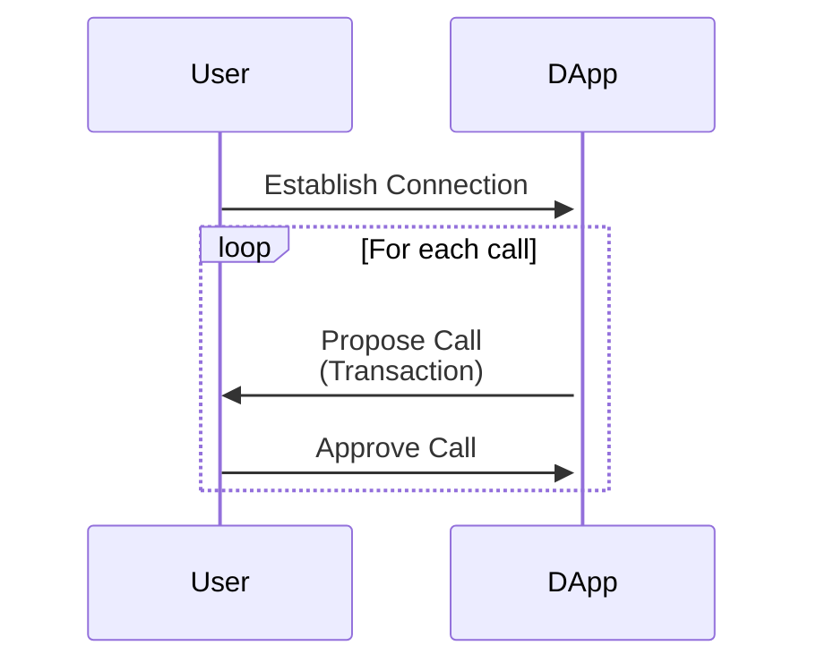
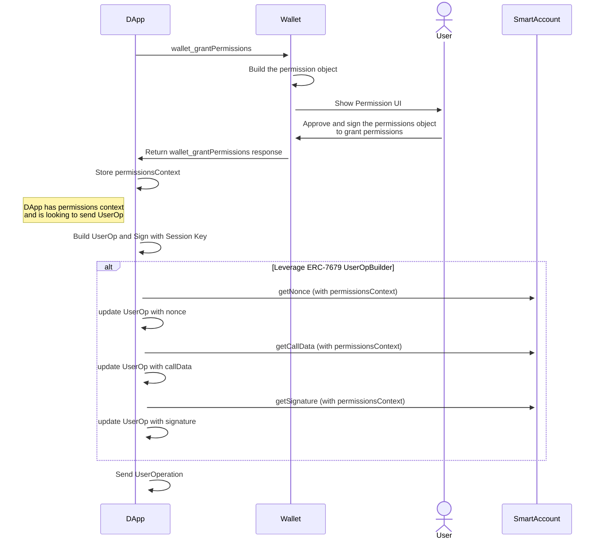

## Abstract

We define a new JSON-RPC method `wallet_grantPermissions` for DApp to request a Wallet to grant permissions in order to execute transactions on the user’s behalf. This enables two use cases:

- Executing transactions for users without a wallet connection.
- Executing transactions for users with a wallet connection that is scoped with permissions.

## Motivation

Currently most DApps implement a flow similar to the following:



Each interaction requires the user to sign a transaction with their wallet. The problems are:

- It can get tedious for the user to manually approve every transaction, especially in highly-interactive applications such as games.
- It’s impossible to send transactions for users without an active wallet connection. This invalidates use cases such as subscriptions, passive investments, limit orders, and more.

In the context of AA, there are multiple vendor-specific implementations of session keys, which are temporary keys imbued with specific permissions. However, since the implementations are vendor-specific, it’s impossible for DApps to “request” session keys from wallets in a unified way, regardless of the specific wallet implementations.

## Specification

The key words “MUST”, “MUST NOT”, “REQUIRED”, “SHALL”, “SHALL NOT”, “SHOULD”, “SHOULD NOT”, “RECOMMENDED”, “MAY”, and “OPTIONAL” in this document are to be interpreted as described in RFC 2119.

### `wallet_grantPermissions`

We introduce a `wallet_grantPermissions` method for the DApp to request the Wallet to grant permissions.

#### Permissions & Policies

Before we specify the JSON-RPC request and response it's important to clarify the relationship between permissions and policies.

Permissions represent a singular piece of authority that can be used by the application. The data restricts the scope of the ability authorized.
eg. ability to transfer a token, update an ENS domain, vote on a DAO, etc

Policies represent a generalized scope which can be attributed to any given permission. A policy without a permission could be excessively permissive.
eg. a token allowance, a gas limit, an access list, an ENS record, etc.

For each permission there will be a set of policies and for each policy there will be a set of properties which are specified as follows:

```typescript
interface Permission {
  type: name;
  policies: Policy[];
  required: boolean;
  data: any;
}

interface Policy {
  type: name;
  data: any;
}
```

#### Request Specification

```tsx
type GrantPermissionsRequestParams = {
  account?: `0x${string}`;

  chainId: number;

  signer: {
    type: string;
    data: any;
  };

  permissions: Permission[];

  expiry: number;
};
```

`account` is an optional field that identifies the account being targetted for this permissions request which is useful when a connection has been established and multiple accounts have been exposed.

`chainId` is field that identifies that chain with [EIP-155](./eip-155.md) which these permissions are contextual and all addressed can be found for the accounts and permissions.

`signer` is a field that identifies the key or account associated with the session or alternatively the wallet will manage the session. See the “Wallet-managed Sessions” section for details.

`permissions` is a list of permissions with determined policies. See “Policy Types” section for details.

Each permission can be either `required` or not. If a permission is `required`, the wallet MUST grant the permission if it approves the request. Otherwise, the wallet may reject the permission even if it approves the request (presumably because it grants other permissions).

`expiry` is a UNIX timestamp (in seconds) that specifies the time by which this session MUST expire.

Request example:

```tsx
{
  account: '0x...'

  chainId: 123,

  signer: {
    type: 'key',
    data: {
      id:'did:key:zQ3shokFTS3brHcDQrn82RUDfCZESWL1ZdCEJwekUDPQiYBme',
    }
  },

  permissions: [
    {
      type: 'native-token-transfer',
      policies: [
        {
          type: 'gas-limit',
          data: {
            limit: '0x...',
          },
        },
        {
          type: 'call-limit',
          data: {
            count: 1,
          },
        },
      ],
      required: true,
      data: {
        address: '0x...',
        allowance: '0x1DCD6500'
      }
    },
    {
      type: 'erc20-token-transfer',
      policies: [
        {
          type: 'gas-limit',
          data: {
            limit: '0x...',
          },
        }
      ],
      required: false,
      data: {
        address: '0x...',
        allowance: '0x77359400'
      }
    }
  ],

  expiry: 1577840461
}
```

#### Response Specification

```tsx
type GrantPermissionsResponse = {
  grantedPermissions: Permission[];

  expiry: number;

  signerMeta?: {
    userOpBuilder?: `0x${string}`;
    delegationManager?: `0x${string}`;
  };

  accountMeta?: {
    factory: `0x${string}`;
    factoryData: `0x${string}`;
  };

  permissionsContext: string;
};
```

- `grantedPermissions` is a list of permissions that were granted. The wallet MUST grant `required` permissions if the request was approved.
- `expiry` is the expiry time that was granted. The wallet MAY grant a different expiry time than the one that the DApp requested.
- `signerMeta` is dependent on the account type. If the signer type is `wallet` then it's not required. If the signer type is `key` or `keys` then `userOpBuilder` is required as defined in [ERC-7679](./eip-7679.md). If the signer type is `account` then `delegationManager` is required as defined in [ERC-7710](./eip-7710.md).
- `accountMeta` is optional but when present then fields for `factory` and `factoryData` are required as defined in [ERC-4337](./eip-4337.md). They are either both specified, or none. If the account has not yet been deployed, the wallet MUST return `accountMeta`, and the DApp MUST deploy the account by calling the `factory` contract with `factoryData` as the calldata.
- `permissionsContext` is an opaque string that identifies the session. It MAY be the `context` as defined in [ERC-7679](./eip-7679.md) and [ERC-7710](./eip-7710.md). See “Rationale” for details.

If the request is malformed or the wallet is unable/unwilling to grant permissions, wallet MUST return an error with a code as defined in [ERC-1193](./eip-1193.md).

`wallet_grantPermissions` response example:

```tsx
{
  grantedPermissions: [
    {
      type: 'native-token-transfer',
      policies: [
        {
          type: 'gas-limit',
          data: {
            limit: '0x...',
          },
        },
        {
          type: 'call-limit',
          data: {
            count: 1,
          },
        },
      ],
      required: true,
      data: {
        address: '0x...',
        allowance: '0x1DCD6500'
      }
    },
    {
      type: 'erc20-token-transfer',
      policies: [
        {
          type: 'gas-limit',
          data: {
            limit: '0x...',
          },
        }
      ],
      required: false,
      data: {
        address: '0x...',
        allowance: '0x3B9ACA00'
      }
    }
  ],

  expiry: 1577840461,

  permissionsContext: '0x...',
}
```

### `wallet_revokePermissions`

Permissions can be revoked by calling this method and the wallet will respond with an empty response when successful.

#### Request Specification

```tsx
type RevokePermissionsRequestParams = {
  permissionsContext: "0x{string}";
};
```

#### Response Specification

```tsx
type RevokePermissionsResponseResult = {};
```

### Signer & Permission/Policy Types

In this ERC, we specify a list of signers, permissions and policies that we expect to be commonly used.

This ERC does not specify an exhaustive list of signer, permission or policy types, since we expect more signer, permission and policy types to be developed as wallets get more advanced. A signer, permission or policy type is valid as long as both the DApp and the wallet are willing to support it.

However, if two signers or two permissions or policies share the same type name, a DApp could request with one type of signer, permission or policy while the wallet grants another. Therefore, it’s important that no two signers or two permissions or two policies share the same type. Therefore, new signer, permission or policy types should be specified in ERCs, either in this ERC as an amendment or in another ERC.

#### Signers

```tsx
// A wallet is the signer for these permissions
// `data` is not necessary for this signer type as the wallet is both the signer and grantor of these permissions
type WalletSigner = {
  type: "wallet";
  data: {};
};

// A signer representing a single key.
// `id` is a did:key identifier and can therefore represent both Secp256k1 or Secp256r1 keys, among other key types.
type KeySigner = {
  type: "key";
  data: {
    id: string;
  };
};

// A signer representing a multisig signer.
// Each element of `ids` is a did:key identifier just like the `key` signer.
type MultiKeySigner = {
  type: "keys";
  data: {
    ids: string[];
  };
};

// An account that can be granted with permissions as in ERC-7710.
type AccountSigner = {
  type: "account";
  data: {
    id: `0x${string}`;
  };
};
```

#### Permissions

```tsx
// Native token transfer, e.g. ETH on Ethereum
type NativeTokenTransferPermission = {
  type: 'native-token-transfer';
  policies: [...];
  data: {
    allowance: '0x...'; // hex value
  };
};

// ERC20 token transfer
type ERC20TokenTransferPermission = {
  type: 'erc20-token-transfer';
  policies: [...];
  data: {
    address: '0x...'; // erc20 contract
    allowance: '0x...'; // hex value
  };
};

// ERC721 token transfer
type ERC721TokenTransferPermission = {
  type: 'erc721-token-transfer';
  policies: [...];
  data: {
    address: '0x...'; // erc721 contract
    tokenIds: '0x...'[]; // hex value array
  };
};

// ERC1155 token transfer
type ERC1155TokenTransferPermission = {
  type: 'erc1155-token-transfer';
  policies: [...];
  data: {
    address: '0x...'; // erc1155 contract
    allowances: {
        [tokenId: string]: '0x...'; // hex value
    }
  };
};

```

#### Policies

```tsx
// The maximum gas limit spent in the session in total
type GasLimitPolicy = {
  type: "gas-limit";
  data: {
    limit: "0x..."; // hex value
  };
};

// The number of calls the session can make in total
type CallLimitPolicy = {
  type: "call-limit";
  data: {
    count: number;
  };
};

// The number of calls the session can make during each interval
type RateLimitPolicy = {
  type: "rate-limit";
  data: {
    count: number; // the number of times during each interval
    interval: number; // in seconds
  };
};

// The amount of Native Token that can be spent by a permission
type NativeTokenSpendLimitPolicy = {
  type: "spent-limit";
  data: {
    allowance: "0x..."; // hex value
  };
};
```

### Wallet-managed Sessions

If the signer is specified as `wallet`, then the wallet itself manages the session. If the wallet approves the request, it MUST accept [ERC-5792](./eip-5792.md)’s `wallet_sendCalls` with the `permissions` capability, which MAY include the session with a `permissionsContext`. For example:

```tsx
[
  {
    version: "1.0",
    chainId: "0x01",
    from: "0xd46e8dd67c5d32be8058bb8eb970870f07244567",
    calls: [
      {
        to: "0xd46e8dd67c5d32be8058bb8eb970870f07244567",
        value: "0x9184e72a",
        data: "0xd46e8dd67c5d32be8d46e8dd67c5d32be8058bb8eb970870f072445675058bb8eb970870f072445675",
      },
      {
        to: "0xd46e8dd67c5d32be8058bb8eb970870f07244567",
        value: "0x182183",
        data: "0xfbadbaf01",
      },
    ],
    capabilities: {
      permissions: {
        context: "<permissionsContext>",
      },
    },
  },
];
```

Upon receiving this request, the wallet MUST send the calls in accordance with the requested permissions. The wallet SHOULD NOT ask the user for further transaction confirmations.

### Capabilities

If the wallet supports [ERC-5792](./eip-5792.md), wallet SHOULD respond on **`wallet_getCapabilities`** request using the `permissions` key.

The wallet SHOULD include `signerTypes` (`string[]`), `permissionTypes` (`string[]`) and `policyTypes` (`string[]`) in the response, to specify the signer types and permission types it supports.
Example:

```json
{
  "0x123": {
    "permissions": {
      "supported": true,
      "signerTypes": ["keys", "account"],
      "permissionTypes": ["erc20-token-transfer", "erc721-token-transfer"],
      "policyTypes": ["rate-limit", "gas-limit"]
    }
  }
}
```

If the wallet is using CAIP-25 authorization, wallet SHOULD include `permissions` key in the CAIP-25 `sessionProperties` object. Additional keys to include are `permissionTypes` with the comma separated list of supported permission types and `signerTypes` with the comma separated list of supported signer types.

Example:

```json
{
  //...
  "sessionProperties": {
    "permissions": "true",
    "signerTypes": "keys,account",
    "permissionTypes": "erc20-token-transfer,erc721-token-transfer",
    "policyTypes": "rate-limit,gas-limit"
  }
}
```

### Sending transaction with a session

#### ERC-7679 with `Key` type signer

`wallet_grantPermissions` replies with `permissionsContext` and `userOpBuilder` address inside the `signerMeta` field. DApps can use that data with methods provided by [ERC-7679](./eip-7679.md) to build the [ERC-4337](./eip-4337.md) userOp.

[ERC-7679](./eip-7679.md) UserOp Builder contract defines `bytes calldata context` parameter in all of its methods. It’s equivalent to the`permissionsContext` returned by the `wallet_grantPermissions` call.

Example of formatting userOp signature using the [ERC-7679](./eip-7679.md) UserOp Builder

```jsx
const getSignature = async ({
  address,
  userOp,
  permissionsContext,
}: GetSignatureArgs) => {
  return readContract(config, {
    abi: BUILDER_CONTRACT_ABI,
    address: BUILDER_CONTRACT_ADDRESS,
    functionName: "getSignature",
    args: [address, userOp, permissionsContext],
  });
};
```

**Example of the entire flow:**



#### ERC-7710

When requesting permissions with a `type` of `account`, the returned data will be redeemable using the interfaces specified in ERC-7710. This allows the recipient of the permissions to use any account type (EOA or contract) to form a transaction or UserOp using whatever payment or relay infrastructure they prefer, by sending an internal message to the returned `permissions.signerMeta.delegationManager` and calling its `function redeemDelegation(bytes calldata _data, Action calldata _action) external;` function with the `_data` parameter set to the returned `permissions.permissionsContext`, and the `_action` data forming the message that the permissions recipient desires the user's account to emit, as defined by this struct:

```
struct Action {
    address to;
    uint256 value;
    bytes data;
}
```

A simple pseudocode example of using a permission in this way, given two ethers signers in the same context, where `alice` wants to request a permission from `bob` might be like this:

```
// Alice requests a permission from Bob
const permissionsResponse = await bob.request({
  method: 'wallet_grantPermissions',
  params: [{
    account: bob.address,
    chainId: 123,
    signer: {
      type: 'account',
      data: {
        id: alice.address
      }
    },
    permissions: [{
      type: 'native-token-transfer',
      policies: [{
        type: 'gas-limit',
        data: '0x0186A0'
      }]
      data: {
        allowance: '0x0DE0B6B3A7640000'
      },
      required: true
    }],
    expiry: Math.floor(Date.now() / 1000) + 3600 // 1 hour from now
  }]
});

// Extract the permissionsContext and delegationManager
const permissionsContext = permissionsResponse.permissionsContext;
const delegationManager = permissionsResponse.signerMeta.delegationManager;

// Alice forms the action she wants Bob's account to take
const action = {
  to: alice.address,
  value: '0x06F05B59D3B20000'
  data: '0x'
};

// Alice sends the transaction by calling redeemDelegation on Bob's account
const tx = await bob.sendTransaction({
  to: delegationManager,
  data: bob.interface.encodeFunctionData('redeemDelegation', [
    permissionsContext,
    action
  ])
});

```

## Rationale

The typical transaction flow of `suggesting transactions => approving transactions => sending transactions` is deeply limiting in several ways:

- Users must be online to send transactions. DApps cannot send transactions for users when they are offline, which makes use cases such as subscriptions or automated trading impossible.

- Users must manually approve every transaction, interrupting what could otherwise be a smooth user experience.

With this ERC, DApps can request Wallets to grant permissions and execute transactions on the user's behalf, therefore circumventing the issues above.

### `permissionsContext`

Since this ERC only specifies the interaction between the wallet and the DApp but not how the wallet enforces permissions, we need a flexible way for the wallet to pass along information to the DApp so that it can construct transactions that imbue the permissions.

The `permissionsContext` field is meant to be an opaque string that's maximally flexible and can encode arbitrary information for different permissions schemes. We specifically had three schemes in mind:

- If a DApp leverages [ERC-7679](./eip-7679.md), it could use `permissionsContext` as the `context` parameter when interacting with the UserOp builder.
- If a DApp leverages [ERC-7710](./eip-7710.md), it could use `permissionsContext` as the `_data` when interacting with the delegation manager.
- If a DApp leverages in-app sessions, it would use `permissionContext` as an identifier of the session when using `wallet_sendCalls`.

### Non-exhaustive list of signers and permissions

With the advancement in wallet technologies, we expect new types of signers and permissions to be developed. We considered mandating that each signer and permission must have a UUID in order to avoid collisions, but ultimately decided to stick with the simpler approach for now of simply mandating that these types be defined in ERCs.

## **Backwards Compatibility**

Wallets that don’t support `wallet_grantPermissions` SHOULD return an error message if the JSON-RPC method is called.

## **Security Considerations**

### **Limited Permission Scope**

DApps should only request the permissions they need, with a reasonable expiration time.

Wallets MUST correctly enforce permissions. Ultimately, users must trust that their wallet software is implemented correctly, and permissions should be considered a part of the wallet implementation.

### **Phishing Attacks**

Malicious DApps could pose as legitimate applications and trick users into granting broad permissions. Wallets MUST clearly display the permissions to users and warn them against granting dangerous permissions.

## Copyright

Copyright and related rights waived via [CC0](../LICENSE.md).
