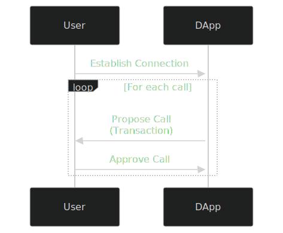
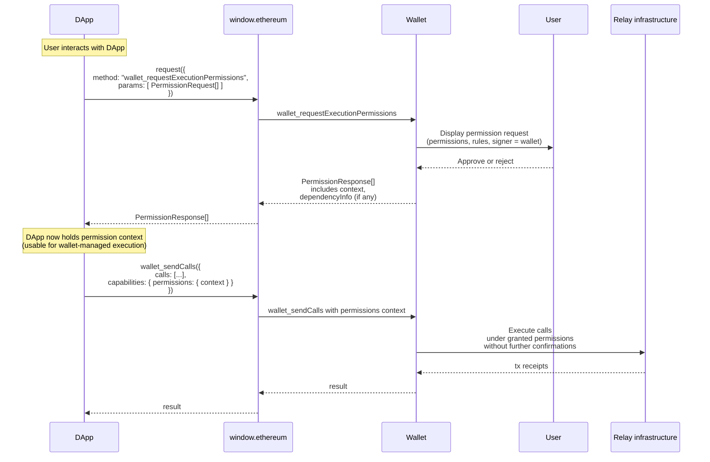
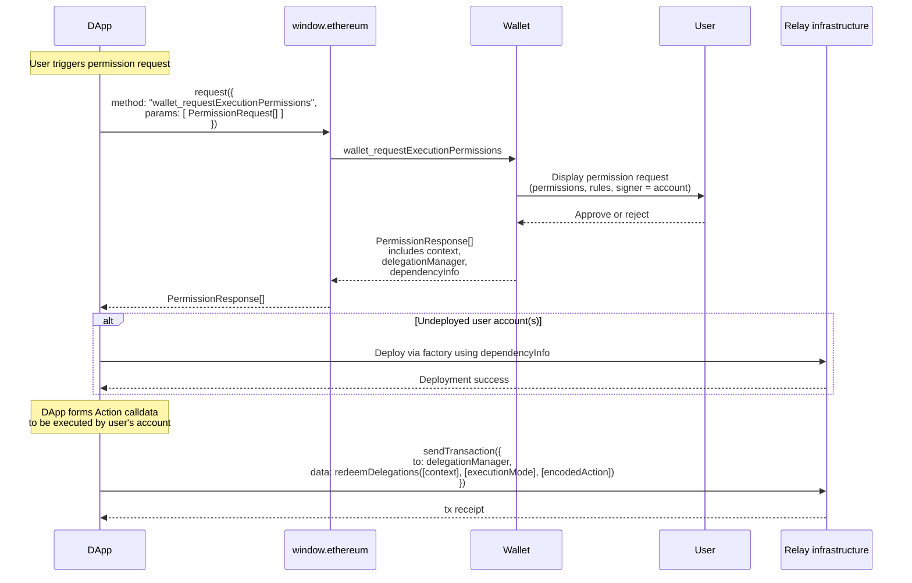

## Abstract

We define a new JSON-RPC method `wallet_requestExecutionPermissions` for DApp to request a Wallet to grant permissions in order to execute transactions on the user’s behalf. This enables two use cases:

- Executing transactions for users without a wallet connection.
- Executing transactions for users with a wallet connection that is scoped with permissions.

## Motivation

Currently most DApps implement a flow similar to the following:



Each interaction requires the user to sign a transaction with their wallet. The problems are:

- It can get tedious for the user to manually approve every transaction, especially in highly-interactive applications such as games.
- It’s impossible to send transactions for users without an active wallet connection. This invalidates use cases such as subscriptions, passive investments, limit orders, and more.

## Specification

The key words “MUST”, “MUST NOT”, “REQUIRED”, “SHALL”, “SHALL NOT”, “SHOULD”, “SHOULD NOT”, “RECOMMENDED”, “MAY”, and “OPTIONAL” in this document are to be interpreted as described in RFC 2119.

### Signer, Permission Types, Rule Types

In this ERC, we specify a list of signers, permission and rule types that we expect to be commonly used.

This ERC does not specify an exhaustive list of signer or permission types, since we expect more signer and permission types to be developed as wallets get more advanced. A signer, permission type, or rule type is valid as long as both the DApp and the wallet are willing to support it.

However, if two signers, two permissions or two rules share the same type name, a DApp could request with one type of signer, permission, or rule while the wallet grants another. Therefore, it’s important that no two signers, two permissions, or two rules share the same type. Therefore, new signer permission types or rule types should be specified in ERCs, either in this ERC as an amendment or in another ERC. In all cases, these new types MUST inherit from the `base permission` or `base rule`.

#### Signers

```tsx
// A wallet is the signer for these permissions
// `data` is not necessary for this signer type as the wallet is both the signer and grantor of these permissions
type WalletSigner = {
  type: "wallet";
  data: {};
};

// An account that can be granted with permissions as in ERC-7710.
type AccountSigner = {
  type: "account";
  data: {
    address: `0x${string}`;
  };
};
```

#### Permissions

`isAdjustmentAllowed` defines a boolean value that allows DApp to define whether the "permission" can be _attenuated_–adjusted to meet the user’s terms.

_For example, a DApp may require an allowance for a specific asset to complete a payment and does not want the user to adjust the requested allowance._

```tsx
type BasePermission = {
  type: string; // enum defined by ERCs
  isAdjustmentAllowed: boolean; // whether the permission can be adjusted
  data: Record<string, any>; // specific to the type, structure defined by ERCs
};
```

#### Rules

`isAdjustmentAllowed` defines a boolean value that allows DApp to define whether the "rule" can be _attenuated_–adjusted to meet the user’s terms.

```tsx
type BaseRule = {
  type: string; // enum defined by ERCs
  isAdjustmentAllowed: boolean; // whether the rule can be adjusted
  data: Record<string, any>; // specific to the type, structure defined by ERCs
};

// A DApp may want to enforce that a permission is only valid for a specific time period.
type ExpiryRule = BaseRule & {
  type: "expiry";
  isAdjustmentAllowed: true; // user can shorten the expiry if they want
  data: {
    timestamp: 1767484800; // unix timestamp
  };
};
```

### `wallet_requestExecutionPermissions`

We introduce a `wallet_requestExecutionPermissions` method for the DApp to request the Wallet to grant permissions.

#### Request Specification

```tsx
type PermissionRequest = {
  chainId: Hex; // hex-encoding of uint256
  address?: Address;
  signer: {
    type: string; // enum defined by ERCs
    data: Record<string, any>;
  };
  permission: {
    type: string; // enum defined by ERCs
    isAdjustmentAllowed: boolean; // whether the permission can be adjusted
    data: Record<string, any>; //specific to the type, structure defined by ERCs
  };
  rules?: {
    type: string; // enum defined by ERCs
    isAdjustmentAllowed: boolean; // whether the rule can be adjusted
    data: Record<string, any>; // specific to the type, structure defined by ERCs
  }[];
}[];
```

`chainId` defines the chain with [EIP-155](./eip-155.md) which applies to this permission request and all addresses can be found defined by other parameters.

`address` identifies the account being targetted for this permission request which is useful when a connection has been established and multiple accounts have been exposed. It is optional to let the user choose which account to grant permission for.

`signer` is a field that identifies the DApp session account associated with the permission or alternatively the wallet will manage the session. See the “Signers” section for details.

`permission` defines the allowed behavior the signer can do on behalf of the account. See the “Permission” section for details.

`rules` defined the restrictions or conditions that a signer MUST abide by when using a permission to act on behalf of an account. See the “Rule” section for details.

**Request example**:

An array of `PermissionRequest` objects is the final `params` field expected by the `wallet_requestExecutionPermissions` RPC.

```tsx
[
  {
    chainId: 123,
    address: '0x...'
    signer: {
      type: 'account',
      data: {
        address:'0x016562aA41A8697720ce0943F003141f5dEAe006',
      }
    },
    permission: {
      type: 'native-token-transfer',
      data: {
        allowance: '0x1DCD6500'
      }
    },
    rules: [
      {
        type: 'expiry';
        isAdjustmentAllowed: false,
        data: {
          timestamp: 1577840461
        },
      },
    ],
  }
]
```

#### Response Specification

```tsx
type PermissionResponse = PermissionRequest & {
  context: Hex;
  dependencyInfo: {
    factory: `0x${string}`;
    factoryData: `0x${string}`;
  }[];
  delegationManager?: `0x${string}`;
};
```

First note that the response contains all of the parameters of the original request and it is not guaranteed that the values received are equivalent to those requested.

`context` is a catch-all to identify a permission for revoking permissions or redeeming permissions, and can contain non-identifying data as well. The `context` is required as defined in [ERC-7710](./eip-7710.md). See “Rationale” for details.

`dependencyInfo` is an array of objects, each containing fields for `factory` and `factoryData` as defined in [ERC-4337](./eip-4337.md). Either both `factory` and `factoryData` must be specified in an entry, or neither. This array is used describe accounts that are not yet deployed but MUST be deployed in order for a permission to be successfully redeemed. If any of the involved accounts have not yet been deployed, the wallet MUST return the corresponding `dependencyInfo`. If all accounts have already been deployed, the wallet MUST return an empty `dependencyInfo` array. The DApp MUST deploy each account by calling the `factory` contract with `factoryData` as the calldata.

`delegationManager` is dependent on the `signer` type. If the signer type is `wallet` then it's not required. If the signer type is `account` then `delegationManager` is required as defined in [ERC-7710](./eip-7710.md).

If the request is malformed or the wallet is unable/unwilling to grant permissions, wallet MUST return an error with a code as defined in [ERC-1193](./eip-1193.md).

`wallet_requestExecutionPermissions` response example:

An array of `PermissionResponse` objects is the final `result` field expected by the `wallet_requestExecutionPermissions` RPC.

```tsx
[
  {
    // original request with modifications
    chainId: 123,
    address: '0x...'
    expiry: 1577850000
    signer: {
      type: 'account',
      data: {
        address:'0x016562aA41A8697720ce0943F003141f5dEAe006',
      }
    },
    permission: {
      type: 'native-token-transfer',
      isAdjustmentAllowed: true,
      data: {
        allowance: '0x1DCD65000000'
      }
    },
    // response-specific fields
    context: "0x0x016562aA41A8697720ce0943F003141f5dEAe0060000771577157715",
    dependencyInfo: [
      {
        factory: '0x...',
        factoryData: '0x...'
      }
    ],
    delegationManager: "0x..."
  }
]
```

### `wallet_revokeExecutionPermission`

Permissions can be revoked by calling this method and the wallet will respond with an empty response when successful.

#### Request Specification

```tsx
type RevokeExecutionPermissionRequestParams = {
  permissionContext: "0x{string}";
};
```

#### Response Specification

```tsx
type RevokeExecutionPermissionResponseResult = {};
```

### Capabilities

If the wallet supports [ERC-5792](./eip-5792.md), wallet SHOULD respond on **`wallet_getCapabilities`** request using the `permissions` key.

The wallet SHOULD include `signerTypes` (`string[]`), `permissionTypes` (`string[]`) and `ruleTypes` (`string[]`) in the response, to specify the signer types and permission types it supports.
Example:

```json
{
  "0x123": {
    "permissions": {
      "supported": true,
      "signerTypes": ["wallet", "account"],
      "permissionTypes": ["erc20-token-transfer", "erc721-token-transfer"],
      "rulesTypes": ["expiry", "rate-limit", "call-limit"]
    }
  }
}
```

If the wallet is using CAIP-25 authorization, wallet SHOULD include `permissions` key in the CAIP-25 `sessionProperties` object. Additional keys to include are `permissionTypes` with the comma separated list of supported permission types, `rulesTypes` with the comma separated list of supported rule types and `signerTypes` with the comma separated list of supported signer types.

Example:

```json
{
  //...
  "sessionProperties": {
    "permissions": "true",
    "signerTypes": "wallet,account",
    "permissionTypes": "erc20-token-transfer,erc721-token-transfer",
    "rulesTypes": "expiry,rate-limit,call-limit"
  }
}
```

### Sending transaction to redeem permissions

#### Wallet-managed Sessions

If the signer is specified as `wallet`, then the wallet itself manages the session. If the wallet approves the request, it MUST accept [ERC-5792](./eip-5792.md)’s `wallet_sendCalls` with the `permissions` capability, which MAY include the session with a `permissionsContext`. For example:

```tsx
[
  {
    version: "1.0",
    chainId: "0x01",
    from: "0xd46e8dd67c5d32be8058bb8eb970870f07244567",
    calls: [
      {
        to: "0xd46e8dd67c5d32be8058bb8eb970870f07244567",
        value: "0x9184e72a",
        data: "0xd46e8dd67c5d32be8d46e8dd67c5d32be8058bb8eb970870f072445675058bb8eb970870f072445675",
      },
      {
        to: "0xd46e8dd67c5d32be8058bb8eb970870f07244567",
        value: "0x182183",
        data: "0xfbadbaf01",
      },
    ],
    capabilities: {
      permissions: {
        context: "<permissionContext>",
      },
    },
  },
];
```

Upon receiving this request, the wallet MUST send the calls in accordance with the requested permissions. The wallet SHOULD NOT ask the user for further transaction confirmations.

**Example of the entire flow:**



#### DApp-managed Sessions

If the signer is specified as a `account`, the returned data will be redeemable using the interfaces specified in ERC-7710. This allows the recipient of the permissions to use any account type (EOA or contract) to form a transaction or UserOp using whatever payment or relay infrastructure they prefer, by sending an internal message to the returned `permissions.delegationManager` and calling its `function redeemDelegation(bytes[] calldata _permissionContexts, bytes32[] calldata _modes, bytes[] calldata _executionCallData) external;` function with the `_permissionContexts` parameter set to the returned `permissions.context`, and the `_executionCallData` data forming the message that the permissions recipient desires the user's account to emit, as defined by this struct:

```
struct Execution {
  address target;
  uint256 value;
  bytes callData;
}
```

A simple pseudocode example of using a permission in this way, where DApp wants to request a permission from `bob` might be like this:

```typescript
// Alice requests a permission from Bob
const permissionsResponse = await window.ethereum.request({
  method: 'wallet_requestExecutionPermissions',
  params: [{
    address: bob.address,
    chainId: 123,
    signer: {
      type: 'account',
      data: {
        address: '0x_dapp_session_account'
      }
    },
    permission: {
      type: 'native-token-transfer',
      isAdjustmentAllowed: true,
      data: {
        allowance: '0x0DE0B6B3A7640000'
      },
    },
    rules: [
      {
        type: 'expiry';
        isAdjustmentAllowed: false,
        data: {
          timestamp: Math.floor(Date.now() / 1000) + 3600 // 1 hour from now
        },
      },
    ],
  }]
});

// Extract the permissionsContext and delegationManager
const permissionsContext = permissionsResponse.context;
const delegationManager = permissionsResponse.delegationManager;

// DApp forms the execution they want Bob's account to take
const execution = {
  target: bob.address,
  value: '0x06F05B59D3B20000'
  callData: '0x'
};
const encodedExecutionCalldata = encodePacked(
  ['address', 'uint256', 'bytes'],
  [execution.target, execution.value, execution.callData],
);

// Chose execution mode (SingleDefault)
const executionMode = '0x0000000000000000000000000000000000000000000000000000000000000000';

// DApp sends the transaction by calling redeemDelegation on with encode execution on Bob's account
const tx = await dapp.sendTransaction({
  to: delegationManager,
  data: encodeFunctionData({
    abi: DelegationManager.abi,
    functionName: 'redeemDelegations',
    args: [
      [permissionsContext],
      [executionMode],
      [encodedExecutionCalldata],
    ],
  })
});

```

**Example of the entire flow:**



## Rationale

The typical transaction flow of `suggesting transactions => approving transactions => sending transactions` is deeply limiting in several ways:

- Users must be online to send transactions. DApps cannot send transactions for users when they are offline, which makes use cases such as subscriptions or automated trading impossible.

- Users must manually approve every transaction, interrupting what could otherwise be a smooth user experience.

With this ERC, DApps can request Wallets to grant permissions and execute transactions on the user's behalf, therefore circumventing the issues above.

### `permissionsContext`

Since this ERC only specifies the interaction between the wallet and the DApp but not how the wallet enforces permissions, we need a flexible way for the wallet to pass along information to the DApp so that it can construct transactions that imbue the permissions.

The `permissionsContext` field is meant to be an opaque string that's maximally flexible and can encode arbitrary information for different permissions schemes. We specifically had two schemes in mind:

- If a DApp specifies `account` as the `signer` type, it would use `permissionsContext` as the `_data` when interacting with the delegation manager.
- If a DApp specifies `wallet` as the `signer` type, it would use `permissionContext` as an identifier of the session when using `wallet_sendCalls`.

### Non-exhaustive list of signers and permissions

With the advancement in wallet technologies, we expect new types of signers and permissions to be developed. We considered mandating that each signer and permission must have a UUID in order to avoid collisions, but ultimately decided to stick with the simpler approach for now of simply mandating that these types be defined in ERCs.

## **Backwards Compatibility**

Wallets that don’t support `wallet_requestExecutionPermissions` SHOULD return an error message if the JSON-RPC method is called.

## **Security Considerations**

### **Limited Permission Scope**

DApps should only request the permissions they need, with a reasonable expiration time.

Wallets MUST correctly enforce permissions. Ultimately, users must trust that their wallet software is implemented correctly, and permissions should be considered a part of the wallet implementation.

### **Phishing Attacks**

Malicious DApps could pose as legitimate applications and trick users into granting broad permissions. Wallets MUST clearly display the permissions to users and warn them against granting dangerous permissions.

## Copyright

Copyright and related rights waived via [CC0](../LICENSE.md).
