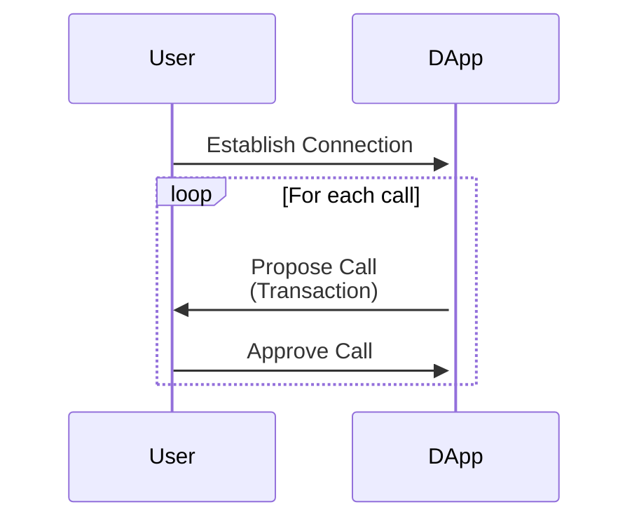
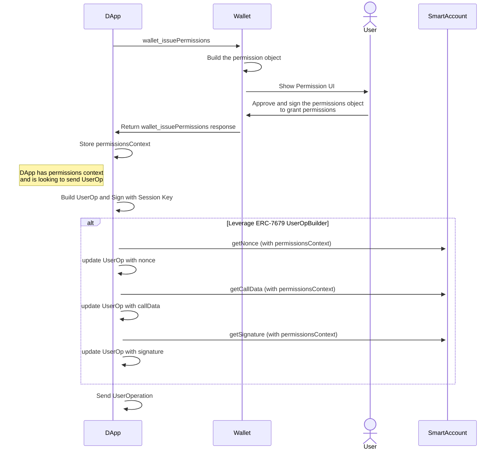

## Abstract

We define a new JSON-RPC method `wallet_issuePermissions` for DApp to request permissions from a wallet in order to execute transactions on users’s behalf.  This enables two use cases:

- Executing transactions for users without a wallet connection.
- Executing transactions for users with a wallet connection that is scoped with permissions.

##Motivation

Currently most DApps implement a flow similar to the following:



Each interaction requires the user to sign a transaction with their wallet.  The problems are:

- It can get tedious for the user to manually approve every transaction, especially in highly-interactive applications such as games.
- It’s impossible to send transactions for users without an active wallet connection.  This invalidates use cases such as subscriptions, passive investments, limit orders, and more.

In the context of AA, there are multiple vendor-specific implementations of session keys, which are temporary keys imbued with specific permissions.  However, since the implementations are vendor-specific, it’s impossible for DApps to “request” session keys from wallets in a unified way, regardless of the specific wallet implementations.

## Specification

The key words “MUST”, “MUST NOT”, “REQUIRED”, “SHALL”, “SHALL NOT”, “SHOULD”, “SHOULD NOT”, “RECOMMENDED”, “MAY”, and “OPTIONAL” in this document are to be interpreted as described in RFC 2119.

### `wallet_issuePermissions`

We introduce a `wallet_issuePermissions` method for the DApp to request permissions from the wallet.  We’d prefer `wallet_requestPermissions` but it’s already taken with [EIP-2255][EIP-2255].

#### Request Specification

```tsx
type IssuePermissionsRequestParams = {
  signer?: {
    type: string
    data: any
  }
 
  permissions: {
    type: string
    data: any
    required: boolean
  }[]
  
  expiry: number,
}
```

`signer` is an optional field that identifies the key or account associated with the session.  When not specified, it’s implied that the wallet will manage the session.  See the “Wallet-managed Sessions” section for details.

`permissions` is a list of permissions.  See “Permission Types” section for details.

Each permission can be either `required` or not.  If a permission is `required`, the wallet MUST grant the permission if it approves the request.  Otherwise, the wallet may reject the permission even if it approves the request (presumably because it grants other permissions).

`expiry` is a UNIX timestamp that specifies the time by which this session MUST expire.


Request example:

```tsx
{
	signer: {
		type: 'key',
		data: {
			id:'did:key:zQ3shokFTS3brHcDQrn82RUDfCZESWL1ZdCEJwekUDPQiYBme',
		}
	}
	
	permissions: [
		{
			type: 'erc20_spending_limit',
			data: {
				erc20Address: '0x...',
				limit: '0x...',
			}
			required: true
		},
		{
			type: 'gas_limit',
			data: {
				limit: '0x...',
			},
			required: false
		}
	],
	
	expiry: 1577840461
}
```

#### Response Specification

```tsx

type IssuePermissionsResponse = {
  grantedPermissions: {
    type: string
    data: any
  }[]
      
  expiry: number
  
  signerData: {
    userOpBuilder?: `0x${string}`
    submitToAddress?: `0x${string}`
  },
  
	factory?: `0x${string}`,
	factoryData?: string,
	
  permissionsContext: string
}
```

- `grantedPermissions` is a list of permissions that were granted.  The wallet MUST grant `required` permissions if the request was approved.
- `expiry` is the expiry time that was granted.  The wallet MAY grant a different expiry time than the one that the DApp requested.
- `factory` and `factoryData` are as defined in ERC-4337.  They are either both specified, or none.  If the account has not yet been deployed, the wallet MUST return `factory` and `factoryData`, and the DApp MUST deploy the account by calling the `factory` contract with `factoryData` as the calldata.
- `~~sessionId` is an optional field that identifies the session if no `signer` was specified in the request.  See “Wallet-managed Sessions” for details.~~
- `permissionsContext` is an opaque string that identifies the session. It MAY be the `context` as defined in ERC-7679 and ERC-7710.  See “Rationale” for details.

If the request is malformed or the wallet is unable/unwilling to issue permissions, wallet MUST return an error with a code as defined in [EIP-1193](https://eips.ethereum.org/EIPS/eip-1193#provider-errors).

`wallet_issuePermissions` response example:

```tsx
{
  grantedPermissions: [
    {
      type: 'erc20_spending_limit',
      data: {
        erc20Address:'0x...',
        limit: '0x...',
      },
    },
    {
		  type: 'gas_limit',
			data: {
			  limit: '0x...',
			},
			required: false
	  }
  ],
  
  expiry: 1577840461,
    
  permissionsContext: '0x...',
}
```

### Signer Types

This ERC does not specify an exhaustive list of signer types, since we expect more types of signers to be developed as wallets get more advanced.  A signer type is valid as long as both the DApp and the wallet are willing to support it.

However, if more than two signers use the same type name, a DApp could request with one type of signer while the wallet grants another type.  Therefore, it’s important that signer types are globally unique.

The object can be extended later to support additional fields, like a version, or expected type enforcement, to further ensure the host wallet is acting in the way the requesting application expects.

```tsx

type KeySigner = {
	type: 'key',
	data: {
		id: string,
	}
}

type MultiKeySigner = {
	type: 'keys',
	data: {
		ids: string[],
	}
}

type AccountSigner = {
	type: 'account',
	data: {
		id: `0x${string}`,
	}
}
```

### Permissions Types

This ERC does not specify an exhaustive list of permission types, since we expect more types of permissions to be developed as wallets get more advanced.  A permission type is valid as long as both the DApp and the wallet are willing to support it.

However, if more than two permissions use the same type name, a DApp could request one permission while the wallet grants another.  Therefore, it’s important that permission types are globally unique.

The object can be extended later to support additional fields, like a version, or expected type enforcement, to further ensure the host wallet is acting in the way the requesting application expects.

```tsx
// Native token spending limit, e.g. ETH on Ethereum
type NativeTokenLimitPermission = {
  type: 'native-token-limit',
  data: {
    amount: "0x...",  // wei in hex
  }
}

// ERC20 spending limit
type ERC20LimitPermission = {
  type: 'erc20-limit',
  data: {
    erc20Address: "0x..."  // ERC20 token address
    amount: "0x...",  // wei in hex
  }
}

// Gas spending limit
type GasLimitPermission = {
  type: 'gas-limit',
  data: {
    amount: "0x...",  // wei in hex
  }
}

// Allowlist of contract calls
type ContractCallPermission = {
  type: 'contract-call',
  data: {
    // TODO
  }
}

// The number of calls the session can make during each interval
type RateLimitPermission = {
  type: 'rate-limit',
  data: {
    count: number,  // the number of times during each interval
    interval: number,  // in seconds
  }
}
```

### Wallet-managed Sessions

If `signer` is not specified in the request, the wallet manages the session.  If the wallet approves the request, it MUST accept ERC-5792’s `wallet_sendCalls` with the `permissions` capability, which MAY include the `permissionsContext`.  For example:

```tsx
[
  {
    "version": "1.0",
    "chainId": "0x01",
    "from": "0xd46e8dd67c5d32be8058bb8eb970870f07244567",
    "calls": [
      {
        "to": "0xd46e8dd67c5d32be8058bb8eb970870f07244567",
        "value": "0x9184e72a",
        "data": "0xd46e8dd67c5d32be8d46e8dd67c5d32be8058bb8eb970870f072445675058bb8eb970870f072445675"
      },
      {
        "to": "0xd46e8dd67c5d32be8058bb8eb970870f07244567",
        "value": "0x182183",
        "data": "0xfbadbaf01"
      }
    ],
    "capabilities": {
      "permissions": {
        "context": "<permissionsContext>"
      }
    }
  }
]
```

Upon receiving this request, the wallet SHOULD send the calls in accordance with the requested permissions.  The wallet SHOULD NOT ask the user for further transaction confirmations.

### Capabilities

If the wallet supports [EIP-5792][EIP-5792], wallet SHOULD respond on **`wallet_getCapabilities`** request using the `permissions` key.

The wallet SHOULD include `signerTypes` (`string[]`) and `permissionTypes` (`string[]`) in the response, to specify the signer types and permission types it supports.
Example:

```json
{
  "0x123": {
    "permissions": {
      "supported": true,
      "signerTypes": ["keys", "account"],
      "permissionTypes": ["erc20-limit", "contract-call"]
    },
  },
}
```

If the wallet is using CAIP-25 authorization, wallet SHOULD include `permissions` key in the CAIP-25 `sessionProperties` object.  Additional keys to include are  `permissionTypes` with the comma separated list of supported permission types and `permissionsSignerTypes` with the comma separated list of supported signer types.

Example:

```json
{
	//...
	"sessionProperties": {
	     "permissions": "true",
	     "permissionsSignerTypes": "keys,account",
	     "permissionTypes": "erc20-limit,contract-call"
	} 
} 
```

### Sending transaction with a session

#### ERC-7679 with `Key` type signer

`wallet_issuePermissions`  replies with `permissionsContext` and `userOpBuilder` address inside the `accountMeta` field. DApps can use that data with methods provided by ERC-7679 to build the ERC-4337 userOp. 

ERC-7679 UserOp Builder contract defines `bytes calldata context` parameter in all of its methods. It’s equivalent to the`permissionsContext` returned by the `wallet_issuePermissions` call.

Example of formatting userOp signature using the ERC-7679 UserOp Builder

```jsx
const getSignature = async ({ address, userOp, permissionsContext }: GetSignatureArgs) => {
    return readContract(config, {
      abi: BUILDER_CONTRACT_ABI,
      address: BUILDER_CONTRACT_ADDRESS,
      functionName: 'getSignature',
      args: [address, userOp, permissionsContext]
    })
  }
```

**Example of the entire flow:**



#### ERC-7710

## Rationale

Frequent user approvals hinder DApp innovation. This EIP introduces `wallet_issuePermissions`, a method for DApps to request permission from wallets. By requesting permissions in advance, DApps can enable smoother user experiences for functionalities like subscriptions and automated trading. This approach simplifies user interaction and fosters the development of richer DApps, ultimately accelerating blockchain adoption and greatly improve user experience.

### PermissionsContext

The `permissionsContext` field serves a critical role in ensuring the security and validity of user operations (UserOps) constructed by DApps to leverage the permissions. It contains all the information that is required to properly build the userOp according to Smart Account vendor’s specific rules.

If DApp leverages ERC-7679, it should send `permissionsContext` as the `context` parameter for the methods of ERC-7679 compliant UserOp builder. UserOp builder will then use `permissionsContext` to format userOp. 

For example, `permissionsContext` will in most cases contain the signature issued by Smart Account owner over some Permission Object. UserOp builder will include this into userOp. Smart Account then uses this signature  during userOp validation to make sure the permissions were granted by an authorized party.

Wallets should include the minimal amount of data inside `permissionsContext` that will allow the DApp to build and verify the ERC-4337 UserOp in combination with signatures from the requested signers.

### Multiple Key Signers

This feature bolsters security by requiring consent from all designated parties and enables multi-party approval workflows for shared accounts or organizations. Ultimately, this flexibility in signer configuration caters to a wider range of security needs and use cases within the DApp ecosystem.

## **Backwards Compatibility**

Wallet that don’t support `wallet_issuePermissions` SHOULD return error message if the JSON-RPC method is called.

## **Security Considerations**

### **Limited Permission Scope**

Permissions are requested for specific purposes and have defined validity periods. This minimizes the window of vulnerability if a compromise were to occur.

### **Signer Verification**

The wallet enforces all requested signers to be present in the UserOp, ensuring that the all parties explicitly authorize the operation.

### **Phishing Attacks**

Malicious DApps could pose as legitimate applications and trick users into granting broad permissions. Wallets should always parse and display the requested permission set to the user before issuing permissions.

## Copyright

Copyright and related rights waived via [CC0](../LICENSE.md).

[EIP-2255]: https://eips.ethereum.org/EIPS/eip-2255
[EIP-5792]: https://eips.ethereum.org/EIPS/eip-5792
