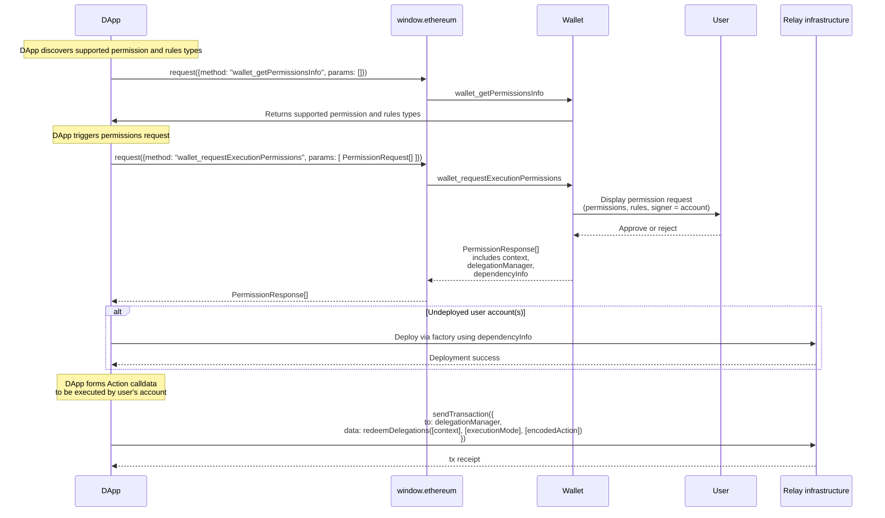

## Abstract

We define a new JSON-RPC method `wallet_requestExecutionPermissions` for DApp to request a Wallet to grant permissions in order to execute transactions on the user’s behalf. This enables two use cases:

- Executing transactions for users without a wallet connection.
- Executing transactions for users with a wallet connection that is scoped with permissions.

## Motivation

Currently most DApps implement a flow similar to the following:


Each interaction requires the user to sign a transaction with their wallet. The problems are:

- It can get tedious for the user to manually approve every transaction, especially in highly-interactive applications such as games.
- It’s impossible to send transactions for users without an active wallet connection. This invalidates use cases such as subscriptions, passive investments, limit orders, and more.

## Specification

The key words “MUST”, “MUST NOT”, “REQUIRED”, “SHALL”, “SHALL NOT”, “SHOULD”, “SHOULD NOT”, “RECOMMENDED”, “MAY”, and “OPTIONAL” in this document are to be interpreted as described in RFC 2119.

### Permission Types, Rule Types

In this ERC, we specify a list of permission and rule types that we expect to be commonly used.

This ERC does not specify an exhaustive list of rule or permission types, since we expect more rule and permission types to be developed as wallets get more advanced. A permission type, or rule type is valid as long as both the DApp and the wallet are willing to support it.

However, if two permissions or two rules share the same type name, a DApp could request with one type of permission, or rule while the wallet grants another. Therefore, it’s important that no two permissions, or two rules share the same type. Therefore, new permission types or rule types should be specified in ERCs, either in this ERC as an amendment or in another ERC. In all cases, these new types MUST inherit from the `base permission` or `base rule`.

#### Permissions

`isAdjustmentAllowed` defines a boolean value that allows DApp to define whether the Wallet MAY attenuate(reduce or increase) the authority of a "permission" to meet the user’s terms for approval.

_For example, a DApp may require an allowance for a specific asset to complete a payment and does not want the user to adjust the requested allowance._

```tsx
type BasePermission = {
  type: string; // enum defined by ERCs
  isAdjustmentAllowed: boolean; // whether the wallet MAY attenuate the permission
  data: Record<string, any>; // specific to the type, structure defined by ERCs
};

// Native token transfer, e.g. ETH on Ethereum
// Grants the signer the authority to transfer Native tokens bounded by a specified amount.
type NativeTokenTransferPermission = BasePermission & {
  type: "native-token-transfer";
  isAdjustmentAllowed: boolean;
  data: {
    allowance: string; // hex-encoded uint256
  };
};

// ERC20 token transfer
// Grants the signer the authority to transfer ERC20 tokens bounded by a specified amount.
type ERC20TokenTransferPermission = BasePermission & {
  type: "erc20-token-transfer";
  isAdjustmentAllowed: boolean;
  data: {
    tokenAddress: string; // erc20 contract
    allowance: string; // hex-encoded uint256
  };
};

// Native token stream, e.g. ETH on Ethereum
// Grants the signer a linearly accruing Native token allowance defined by a fixed rate and start time, bounded by a maximum allowed amount.
type NativeTokenStreamPermission = BasePermission & {
  type: "native-token-stream";
  isAdjustmentAllowed: boolean;
  data: {
    initialAmount?: string; // hex-encoded uint256; allowance available at startTime
    maxAmount?: string; // hex-encoded uint256; maximum total accumulable allowance
    timePeriod: number; // accrual period in seconds (e.g., 3600 for hourly)
    startTime: number; // unix timestamp in seconds at which accrual begins
    amountPerPeriod: string; // hex-encoded uint256; amount accrued every timePeriod seconds
  };
};

// ERC20 token stream
// Grants the signer a linearly accruing ERC20 token allowance defined by a fixed rate and start time, bounded by a maximum allowed amount.
type ERC20TokenStreamPermission = BasePermission & {
  type: "erc20-token-stream";
  isAdjustmentAllowed: boolean;
  data: {
    initialAmount?: string; // hex-encoded uint256; allowance available at startTime
    maxAmount?: string; // hex-encoded uint256; maximum total accumulable allowance
    timePeriod: number; // accrual period in seconds (e.g., 3600 for hourly)
    startTime: number; // unix timestamp in seconds at which accrual begins
    amountPerPeriod: string; // hex-encoded uint256; amount accrued every timePeriod seconds
    tokenAddress: string; // erc20 contract
  };
};

// Native token periodic, e.g. ETH on Ethereum
// Grants the signer the authority to transfer Native tokens periodically defined by period duration and start time, bounded by a maximum allowed amount per period.
type NativeTokenPeriodicPermission = BasePermission & {
  type: "native-token-periodic";
  isAdjustmentAllowed: boolean;
  data: {
    periodAmount: string; // hex-encoded uint256; amount eligible for transfer every periodDuration
    startTime: number; // unix timestamp in seconds at which periodic transfer begin
    periodDuration: string; // unix timestamp (e.g., 3600 for hourly)
  };
};

// ERC20 token periodic transfer
// Grants the signer the authority to transfer ERC20 tokens periodically defined by period duration and start time, bounded by a maximum allowed amount per period.
type ERC20TokenPeriodicPermission = BasePermission & {
  type: "erc20-token-periodic";
  isAdjustmentAllowed: boolean;
  data: {
    periodAmount: string; // hex-encoded uint256; amount eligible for transfer every periodDuration
    startTime: number; // unix timestamp in seconds at which periodic transfer begin
    periodDuration: string; // unix timestamp (e.g., 3600 for hourly)
    tokenAddress: string; // erc20 contract
  };
};
```

#### Rules

`isAdjustmentAllowed` defines a boolean value that allows DApp to define whether the Wallet MAY attenuate(reduce or increase) the constrains of "rule" to meet the user’s terms for approval.

```tsx
type BaseRule = {
  type: string; // enum defined by ERCs
  isAdjustmentAllowed: boolean; // whether the wallet MAY attenuate the rule
  data: Record<string, any>; // specific to the type, structure defined by ERCs
};

// Constrains a permission so that it is only valid until a specified timestamp.
type ExpiryRule = BaseRule & {
  type: "expiry";
  isAdjustmentAllowed: boolean; // true = wallet MAY shorten or extend the expiry
  data: {
    timestamp: number; // unix timestamp at which the permission becomes invalid
  };
};
```

### `wallet_requestExecutionPermissions`

We introduce a `wallet_requestExecutionPermissions` method for the DApp to request the Wallet to grant permissions.

#### Request Specification

```tsx
type PermissionRequest = {
  chainId: Hex; // hex-encoding of uint256
  address?: Address;
  signer: Address;
  permission: {
    type: string; // enum defined by ERCs
    isAdjustmentAllowed: boolean; // whether the permission can be adjusted
    data: Record<string, any>; //specific to the type, structure defined by ERCs
  };
  rules?: {
    type: string; // enum defined by ERCs
    isAdjustmentAllowed: boolean; // whether the rule can be adjusted
    data: Record<string, any>; // specific to the type, structure defined by ERCs
  }[];
}[];
```

`chainId` defines the chain with [EIP-155](./eip-155.md) which applies to this permission request and all addresses can be found defined by other parameters.

`address` identifies the account being targetted for this permission request which is useful when a connection has been established and multiple accounts have been exposed. It is optional to let the user choose which account to grant permission for.

`signer` is a field that identifies the DApp session account associated with the permission

`permission` defines the allowed behavior the signer can do on behalf of the account. See the “Permission” section for details.

`rules` define the restrictions or conditions that a signer MUST abide by when using a permission to act on behalf of an account. See the “Rule” section for details.

**Request example**:

An array of `PermissionRequest` objects is the final `params` field expected by the `wallet_requestExecutionPermissions` RPC.

```tsx
[
  {
    chainId: "0x01",
    address: "0x...",
    signer: "0x016562aA41A8697720ce0943F003141f5dEAe006",
    permission: {
      type: "native-token-transfer",
      isAdjustmentAllowed: false,
      data: {
        allowance: "0x1DCD6500",
      },
    },
    rules: [
      {
        type: "expiry",
        isAdjustmentAllowed: false,
        data: {
          timestamp: 1577840461,
        },
      },
    ],
  },
];
```

#### Response Specification

```tsx
type PermissionResponse = PermissionRequest & {
  context: Hex;
  dependencyInfo: {
    factory: `0x${string}`;
    factoryData: `0x${string}`;
  }[];
  delegationManager: `0x${string}`;
};
```

First note that the response contains all of the parameters of the original request and it is not guaranteed that the values received are equivalent to those requested.

`context` is a catch-all to identify a permission for revoking permissions or redeeming permissions, and can contain non-identifying data as well. The `context` is required as defined in [ERC-7710](./eip-7710.md). See “Rationale” for details.

`dependencyInfo` is an array of objects, each containing fields for `factory` and `factoryData` as defined in [ERC-4337](./eip-4337.md). Either both `factory` and `factoryData` must be specified in an entry, or neither. This array is used describe accounts that are not yet deployed but MUST be deployed in order for a permission to be successfully redeemed. If any of the involved accounts have not yet been deployed, the wallet MUST return the corresponding `dependencyInfo`. If all accounts have already been deployed, the wallet MUST return an empty `dependencyInfo` array. The DApp MUST deploy each account by calling the `factory` contract with `factoryData` as the calldata.

`delegationManager` is required as defined in [ERC-7710](./eip-7710.md).

If the request is malformed or the wallet is unable/unwilling to grant permissions, wallet MUST return an error with a code as defined in [ERC-1193](./eip-1193.md).

`wallet_requestExecutionPermissions` response example:

An array of `PermissionResponse` objects is the final `result` field expected by the `wallet_requestExecutionPermissions` RPC.

```tsx
[
  {
    // original request with modifications
    chainId: "0x01",
    address: "0x...",
    expiry: 1577850000,
    signer: "0x016562aA41A8697720ce0943F003141f5dEAe006",
    permission: {
      type: "native-token-transfer",
      isAdjustmentAllowed: true,
      data: {
        allowance: "0x1DCD65000000",
      },
    },
    // response-specific fields
    context: "0x0x016562aA41A8697720ce0943F003141f5dEAe0060000771577157715",
    dependencyInfo: [
      {
        factory: "0x...",
        factoryData: "0x...",
      },
    ],
    delegationManager: "0x...",
  },
];
```

### `wallet_revokeExecutionPermission`

Permissions can be revoked by calling this method and the wallet will respond with an empty response when successful.

#### Request Specification

```tsx
type RevokeExecutionPermissionRequestParams = {
  permissionContext: "0x{string}";
};
```

#### Response Specification

```tsx
type GetPermissionsInfoResultParams = {
  chainIds: `0x${string}`[];
};
```

### `wallet_getPermissionsInfo`

We introduce a `wallet_getPermissionsInfo` method for the Wallet to specify the permission types and rules types it supports.

#### Request Specification

DApp can provide an optional list of `chainIds` to filter the response object. If no chainIds are provided, the response object MUST include all chains the Wallet supports.

```tsx
// ChainIds, array of queried chain ids (optional)
type GetPermissionsInfoResultParams = {
  chainIds: `0x${string}`[];
};
```

**Request example**:

```tsx
// With no chainIds defined
window.ethereum.request({
  "method": "wallet_getPermissionsInfo",
  "params": []
}): Promise<GetPermissionsInfoResult>

// With chainIds defined
window.ethereum.request({
  "method": "wallet_getPermissionsInfo",
  "params": ["0x0", "0x2105"]
}): Promise<GetPermissionsInfoResult>
```

#### Response Specification

The wallet SHOULD include `permissionTypes` (`string[]`) and `ruleTypes` (`string[]`) in the response, to specify the permission types and rules types it supports.

```tsx
type PermissionsInfo = {
  permissionTypes: string[];
  ruleTypes: string[];
};

type GetPermissionsInfoResult = Record<`0x${string}`, PermissionsInfo>; // Hex chain id
```

Example:

```json
{
  "0x123": {
    "permissionTypes": [
      "native-token-transfer",
      "erc20-token-transfer",
      "erc721-token-transfer",
      "native-token-stream",
      "erc20-token-stream",
      "native-token-periodic",
      "erc20-token-periodic"
    ],
    "rulesTypes": ["expiry"]
  },
  "0x456": {
    "permissionTypes": ["native-token-transfer", "erc20-token-transfer"],
    "rulesTypes": []
  }
}
```

### Sending transaction to redeem permissions

The permission response data will be redeemable by the `account` defined in the `signer` field, using the interfaces specified in ERC-7710. This allows the recipient of the permissions to use any account type (EOA or contract) to form a transaction or UserOp using whatever payment or relay infrastructure they prefer, by sending an internal message to the returned `permissions.delegationManager` and calling its `function redeemDelegation(bytes[] calldata _permissionContexts, bytes32[] calldata _modes, bytes[] calldata _executionCallData) external;` function with the `_permissionContexts` parameter set to the returned `permissions.context`, and the `_executionCallData` data forming the message that the permissions recipient desires the user's account to emit, as defined by this struct:

```
struct Execution {
  address target;
  uint256 value;
  bytes callData;
}
```

A simple pseudocode example of using a permission in this way, where DApp wants to request a permission from `bob` might be like this:

```typescript
// Alice requests a permission from Bob
const permissionsResponse = await window.ethereum.request({
  method: 'wallet_requestExecutionPermissions',
  params: [{
    address: bob.address,
    chainId: "0x01",
    signer: '0x_dapp_session_account',
    permission: {
      type: 'native-token-transfer',
      isAdjustmentAllowed: true,
      data: {
        allowance: '0x0DE0B6B3A7640000'
      },
    },
    rules: [
      {
        type: 'expiry';
        isAdjustmentAllowed: false,
        data: {
          timestamp: Math.floor(Date.now() / 1000) + 3600 // 1 hour from now
        },
      },
    ],
  }]
});

// Extract the permissionsContext and delegationManager
const permissionsContext = permissionsResponse.context;
const delegationManager = permissionsResponse.delegationManager;

// DApp forms the execution they want Bob's account to take
const execution = {
  target: bob.address,
  value: '0x06F05B59D3B20000',
  callData: '0x'
};
const encodedExecutionCalldata = encodePacked(
  ['address', 'uint256', 'bytes'],
  [execution.target, execution.value, execution.callData],
);

// Chose execution mode (SingleDefault)
const executionMode = '0x0000000000000000000000000000000000000000000000000000000000000000';

// DApp sends the transaction by calling redeemDelegation on with encode execution on Bob's account
const tx = await dapp.sendTransaction({
  to: delegationManager,
  data: encodeFunctionData({
    abi: DelegationManager.abi,
    functionName: 'redeemDelegations',
    args: [
      [permissionsContext],
      [executionMode],
      [encodedExecutionCalldata],
    ],
  })
});

```

**Example of the entire flow:**



## Rationale

The typical transaction flow of `suggesting transactions => approving transactions => sending transactions` is deeply limiting in several ways:

- Users must be online to send transactions. DApps cannot send transactions for users when they are offline, which makes use cases such as subscriptions or automated trading impossible.

- Users must manually approve every transaction, interrupting what could otherwise be a smooth user experience.

With this ERC, DApps can request Wallets to grant permissions and execute transactions on the user's behalf, therefore circumventing the issues above.

### `permissionsContext`

Since this ERC only specifies the interaction between the wallet and the DApp but not how the wallet enforces permissions, we need a flexible way for the wallet to pass along information to the DApp so that it can construct transactions that imbue the permissions.

The `permissionsContext` field is meant to be an opaque string that's maximally flexible and can encode arbitrary information for different permissions schemes.

DApps must submit transactions with the `account` specified in the `signer` property, using the `permissionsContext` as the `_data` when interacting with the delegation manager.

### Non-exhaustive list of signers and permissions

With the advancement in wallet technologies, we expect new types of signers and permissions to be developed. We considered mandating that each signer and permission must have a UUID in order to avoid collisions, but ultimately decided to stick with the simpler approach for now of simply mandating that these types be defined in ERCs.

## **Backwards Compatibility**

Wallets that don’t support `wallet_requestExecutionPermissions` SHOULD return an error message if the JSON-RPC method is called.

## **Reference Implementation**

For a minimal reference implementation focusing on permission granting from a [EIP-1193](./eip-1193.md) Ethereum provider, please see [Example7715PermissionsRequestHandler](../assets/eip-7715/Example7715PermissionsRequestHandler.html).

For a complete reference implementation of a Permissions handler, see the MetaMask Permissions Snap, which includes features such as:

- Support for commonly used permission and rule types with ability to attenuate(reduce or increase) the requested capability to meet the user’s terms for approval.
  - permissions:
    - `native-token-transfer`
    - `erc20-token-transfer`
    - `native-token-stream`
    - `erc20-token-stream`
    - `native-token-periodic`
    - `erc20-token-periodic`
  - rules:
    - `expiry`
- User encrypted storage for all permissions granted through the Wallet handler to enable revocation mechanisms.

## **Security Considerations**

### **Limited Permission Scope**

DApps should only request the permissions they need, with a reasonable expiration time.

Wallets MUST correctly enforce permissions. Ultimately, users must trust that their wallet software is implemented correctly, and permissions should be considered a part of the wallet implementation.

### **Phishing Attacks**

Malicious DApps could pose as legitimate applications and trick users into granting broad permissions. Wallets MUST clearly display the permissions to users and warn them against granting dangerous permissions.

## Copyright

Copyright and related rights waived via [CC0](../LICENSE.md).
