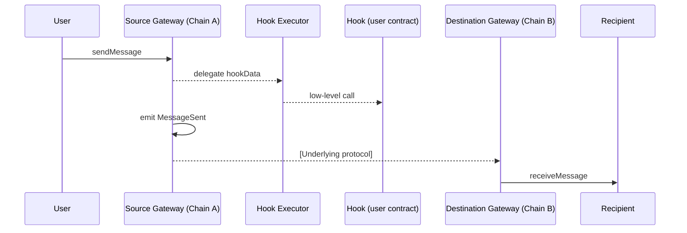

## Abstract

This proposal describes an interface, and the corresponding workflow, for smart contracts to send arbitrary data through cross-chain messaging protocols. The end goal of this proposal is to have all such messaging protocols accessible via this interface (natively or using "adapters") to improve their composability and interoperability. That would allow a new class of cross-chain native smart contracts to emerge while reducing vendor lock-in. This proposal is modular by design, allowing users to leverage bridge-specific features through extra data and custom logic using hooks while providing simple "universal" access to the simple feature of "just getting a simple message through".

## Motivation

Cross-chain messaging protocols (or bridges) allow communication between smart contracts deployed on different blockchains. There is a large diversity of such protocols with multiple degrees of decentralization, different architectures, implementing different interfaces, and providing different guarantees to users.

Because almost every protocol implements a different workflow using a specific interface, portability between bridges is currently basically impossible. This also prevents the development of generic contracts that rely on cross chain communication.

The objective of this ERC is to provide a standard interface, and a corresponding workflow, for performing cross-chain communication between contracts. Existing cross-chain communication protocols that do not natively implement this interface should be able to adopt it using adapter gateway contracts.

Compared to previous ERCs in this area, this ERC offers compatibility with chains outside of the Ethereum/EVM ecosystem, and it is extensible to support the different feature sets of various protocols while offering a shared core of standard functionality.

## Specification

The key words "MUST", "MUST NOT", "REQUIRED", "SHALL", "SHALL NOT", "SHOULD", "SHOULD NOT", "RECOMMENDED", "NOT RECOMMENDED", "MAY", and "OPTIONAL" in this document are to be interpreted as described in RFC 2119 and RFC 8174.

### Message Field Encoding

A cross-chain message consists of a sender, recipient, payload, optional extra data, and optional hooks.

### Sender and Recipient

The sender account (in the source chain) and receiver account (in the destination chain) MUST be input in an Interoperable Address binary format, specified in ERC-7930, which MUST be serialized according to CAIP-350. The recipient field MAY be omitted or zeroed (contain an Interoperable Address with all fields set to zero) to indicate an unspecified destination, such as when a broadcast mode is employed and the final recipients are determined by the protocol itself.

### Payload

The payload is an opaque `bytes` value.

### Extra Data

`extraData` is an opaque `bytes` value. This field is OPTIONAL and MUST be interpreted only on source. If unused, MUST be empty.

### Hook Data

The hook is a structure that invokes a low-level call in the source chain atomically after the message is sent.

If unused, MUST be empty. It is RECOMMENDED to standardize hooks as part of new ERCs. Gateways that implement hooks MUST delegate their execution to an immutable Hook Executor contract. Nevertheless, implementation details are outside the scope of the standard.

Gateways on other kinds of execution enviroments MAY omit hooks entirely to stay compliant with the standard.

### Sending Procedure

A **Source Gateway** is a contract that uses a messaging protocol to send a message to a receiver on another chain. MUST implement `IERC7786GatewaySource`.

```solidity
interface IERC7786GatewaySource {
  // Optional Hook data struct
  struct HookData {
    address hook;        // Native source chain address
    bytes hookPayload;   // Low-level call data: selector and parameters for the hook
    uint256 value;       // Optional, amount of native token forwarded to the hook 
  }
 
  // MessageSent event
  event MessageSent(
    bytes32 messageId, // Unique identifier
    bytes sender,      // Binary Interoperable Address
    bytes recipient,   // Binary Interoperable Address
    bytes payload,     // Message content
    bytes extraData,   // Optional encoded gateway metadata (leave empty if unused)
    HookData hookData  // Optional Hook data (leave empty if unused)
  );
  
  // sendMessage function
  function sendMessage(
      bytes calldata recipient,                   // Binary Interoperable Address 
      bytes calldata payload,                     // Message content
      bytes calldata extraData,                   // Optional encoded gateway metadata (leave empty if unused)
      HookData calldata hookData                  // Optional Hook data (leave empty if unused)
  ) external payable returns (bytes32 messageId); // Gateway-generated ID

  // Context getter
   function getTransientMessageContext()
        external
        view
        returns (
            bytes32 messageId,  // Gateway-generated ID
            bytes   sender,     // Binary Interoperable Address
            bytes   recipient,  // Binay Interoperable Address
            bytes   payload,    // Message content
            bytes   extraData   // Optional encoded gateway metadata (leave empty if unused)
        );
}
```

### `sendMessage`

Initiates the sending of a message.

Further action MAY be required by the gateway to make the sending of the message effective, such as providing payment for gas. See Post-processing.

When hooks are used, the Gateway MUST call its designated Hook Executor, and the executor MUST invoke the user-supplied hook. The hook MAY query the Gateway to obtain the context used in its execution logic. If the hook call returns false or reverts, `sendMessage` MUST revert. Gateways that support hooks MUST expose a `getTransientMessageContext` view that returns the context of the message currently being processed by `sendMessage`. This context MUST be available only while a hook is executing; at any other time the function SHOULD return all-zero values.

SHOULD revert if it executes supplying `extraData` bytes that the underlying protocol does not support. 

MAY accept call value (native token) to be sent with the message. MUST revert if the call value is included, but it is not a feature supported by the gateway. It is unspecified how this value is represented on the destination.

MUST generate and return a unique non‑zero `messageId`. It MUST be exposed after the call.

MUST emit a `MessageSent` event.

### `MessageSent`

This event signals that a would-be sender has requested a message to be sent.

### Post-processing through Hooks

After a sender has invoked `sendMessage`, further action MAY be required by the gateways to make the message effective. This is called *post-processing*. For example, some payment is typically required to cover the cost of executing the message at the destination.

The exact interface for any such action is out of this ERC’s scope. If post-processing hooks are expected, such actions MUST be restricted to the specified account.

### Reception Procedure

A **Destination Gateway** is a contract implementing a protocol to validate messages sent on other chains. The interface of the destination gateway and how it is invoked are out of scope of this ERC.

The protocol MUST ensure delivery of a sent message to the **recipient** using the `IERC7786Recipient` interface (specified below), which the recipient MUST implement.

Once the message can be safely delivered (see Properties), the gateway MUST invoke `receiveMessage` with the message identifier and contents, unless the sender or the receiver explicitly requested otherwise.

The `messageId` MUST be unique (for the calling gateway) to the message being relayed. The format of this identifier is not specified, and the gateway can use it at its own discretion. For example it can be an identifier of the `MessageSent` event that created the message.

The gateway MUST verify that `receiveMessage` returns the correct value, and MUST revert otherwise.

```solidity
interface IERC7786Recipient {
    function receiveMessage(
        bytes32 messageId,  // Unique ID supplied by the destination gateway
        bytes sender,       // Binary Interoperable Address representation
        bytes payload       // Message content
    ) external payable;
}
```

### `receiveMessage`

Delivery of a message sent from another chain.

The receiver MUST validate that the caller of this function is a **known gateway**, i.e., one whose underlying cross-chain messaging protocol it trusts.

### Interaction Diagram



### Properties

The protocol underlying a pair of gateways is expected to guarantee a series of properties. For a detailed definition and discussion, we refer to XChain Research’s *Cross-chain Interoperability Report*.

- The protocol MUST guarantee Safety: A message is delivered at the destination if and only if it was sent at the source. The delivery process must ensure a message is only delivered once the sending transaction is finalized, and not delivered more than once. Note that there can be multiple messages with identical parameters that must be delivered separately.
- The protocol MUST guarantee Liveness: A sent message is eventually delivered to the destination, assuming Liveness and censorship-resistance of the source and destination chains.
- The protocol SHOULD guarantee Timeliness: A sent message is delivered at the destination within a bounded delivery time, which should be documented.
- The above properties SHOULD NOT rely on trust in some centralized actor. For example, safety should be guaranteed by some trustless mechanism such as a light client proof or attestations by an open, decentralized validator set. Relaying should be decentralized or permissionless to ensure liveness; a centralized relayer can fail and thus halt the protocol.

## Rationale

**Separation of concerns**

The interface keeps a single, predictable entry point and lets every bridge expose its peculiarities through two completely generic fields:

- `extraData` : an opaque blob the gateway consumes internally.
- `hookData`: an optional low-level call executed on the source chain after the `sendMessage` logic.

This follows the separation‑of‑concerns principle: gateway‑specific parameters are surfaced through extraData, while application‑level logic is injected via hooks. Both mechanisms extend the core messaging primitive in a complementary, independent way.

An application can swap one gateway address for another in storage and emit the same messages. That portability guards the app against a gateway being paused, deprecated, or simply breaking. It also enables *bridge layering*: a “meta‑gateway” can relay the same opaque message through two or more underlying bridges, choosing the combination that gives the desired blend of liveness and safety.

**On Extra Data**

Some bridges need specific parameters provided by the sender. Those parameters are specified on the `extraData` parameter. If the sender leaves `extraData empty`, the gateway forwards the message without supplying any protocol‑specific metadata to the underlying bridge. Any additional information injected by other components is outside the gateway flow and therefore outside the scope.

Gateways MAY provide a view that returns a human‑readable decoding of extraData for off‑chain use. The exact name and signature of such a helper are left out of this ERC and can be standardised separately.

**On Hooks**

Hooks keep the core interface minimal while giving developers a plug‑and‑play extension point for post-processing, all without bloating the gateway or forcing the entire ecosystem to agree on new parameters. One example is payment for relayers to deliver the message in the destination. The flow might be:

1. `hook` points to the relayers payment contract address.
2. `hookData` encodes the call to pay the gas fee (`payForGas(gasAmount, refundAddress, gateway)`).
3. `value` includes the ETH (or native token) payment amount.

Suppose a “`RelayerPaymentsContract`” exposes the function:

```solidity
function payForGas(uint256 gasAmount, address refundAddress, address gateway)
  external payable {
  // This value is stored transiently by the gateway and available only during execution.
  (bytes32 messageId, , , , ) = IERC7786GatewaySource(gateway).getTransientMessageContext();

...

  // Implementation code consume the messageId or any other parameters from the context
}

```

The `hookData` passed to `sendMessage` would be:

```solidity
HookData({
  hook: address(RelayerPaymentsContract),
  hookPayload: abi.encodeCall(
    RelayerPaymentsContract.payForGas,
    (300_000, userAddress, gatewayAddress)
  ),
  value: 0.02 ether
});
```

Since the low-level call could derive itself into other subsequent calls, hooks MAY call other hooks or have their conditional logic for sequential calls.

## Backwards Compatibility

Existing cross-chain messaging protocols implement proprietary interfaces. We recommend that protocols natively implement the standard interface defined here, and propose the development of standard adapters for those that don't.

## Security Considerations

**Handling addresses**

Interoperable Addresses (ERC‑7930) rely on CAIP‑350 serialization. Using non‑canonical encodings can lead to silent delivery failures. Gateways SHOULD reject non‑canonical encodings and MAY normalize them before emission.

**`ExtraData` parsing**

Because `extraData` is opaque to the interface, each gateway SHOULD validate its format and gracefully revert with an explicit error (e.g., `UnsupportedExtraData()`) if the blob cannot be decoded.  Never assume well‑formed input. It is RECOMMENDED to include a view function for this purpose.

**Hook Execution**

The Gateway should never call a non-trusted hook directly, as Gateways must be deployed together with a Hook Executor wich stay as an immutable address stored in the Gateway. It is up to the protocol or integrators to ensure the Hook Executor is the expected one.

## Copyright

Copyright and related rights waived via [CC0](../LICENSE.md).
