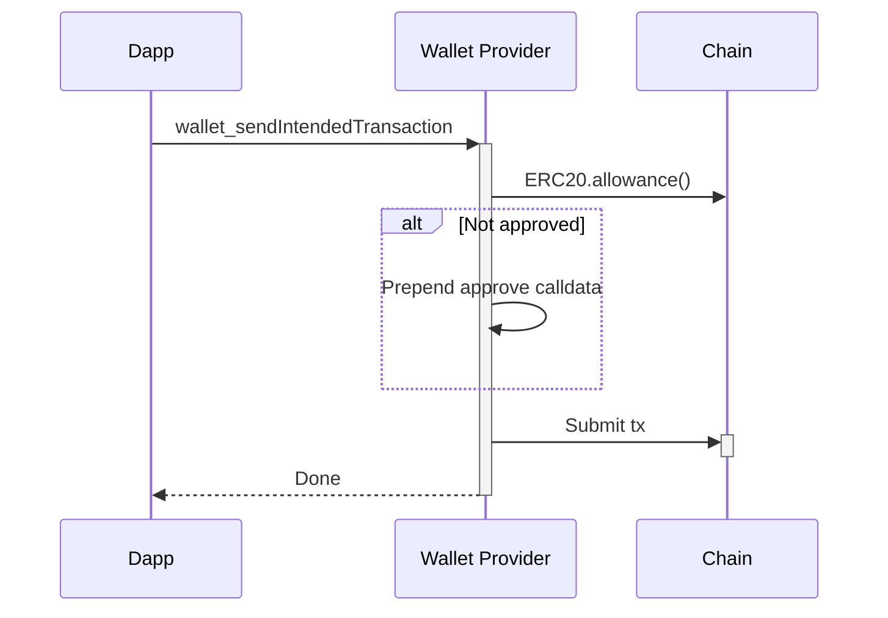
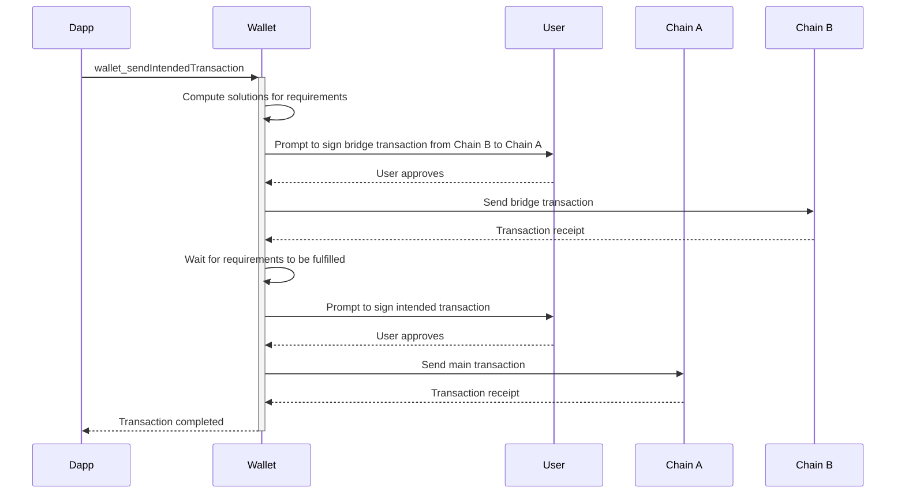
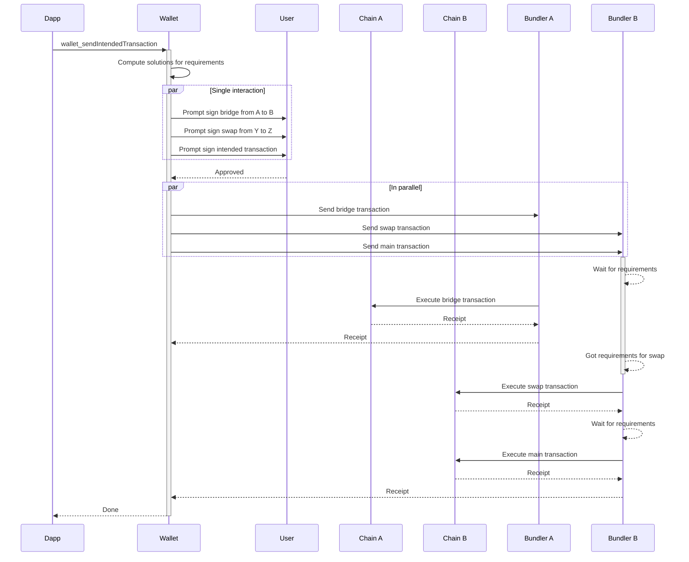

## Abstract

This ERC addresses the lack of communication channels between the dapp and smart contract wallets. Wallets are tasked with sending transactions on behalf of the user, but dapps craft these transactions. The challenge is that dapps don't have a way of communicating the prerequisites for these transactions, so wallets can't fulfill them.

To solve this issue, an additional optional field is included in the transaction request. This field is a list of "requirements" that the wallet has to fulfill for the requested transactions to be considered "ready."

Wallets can use this list of requirements, alongside their knowledge about the addresses of the user, to decide how to act next. Depending on the availability of funds and the list of requirements, the options could be: send the transaction right away, send the transaction with a prefix that fulfills the requirements, or ask the user to select a path to fulfill the requirements.

Wallets would be tasked with finding all possible paths to fulfill these requirements, while dapps SHOULD NOT attempt to check the requirements themselves, letting the wallet handle scenarios like "low balance" or "low allowance."

## Motivation

It is fairly common for dapps to reside only on one network, but this comes at the cost of shrinking the direct liquidity that these dapps can access. This happens because most users only have funds on a limited number of networks. As the number of networks grows, the likelihood of intersection between the networks chosen by the dapp and the user decreases.

Given that dapps don't have a way of communicating with the wallet about their "final intent," they can only use `eth_sendTransaction` to communicate the last action that the user should take. However, it is up to the user to "guess" what prior actions need to be executed to fulfill the prerequisites of that final action.

This guessing may involve consolidating funds into a single network or exchanging assets into another asset accepted by the dapp. This is a cumbersome process for the user and results in a highly degraded UX.

## Specification

The key words "MUST", "MUST NOT", "REQUIRED", "SHALL", "SHALL NOT", "SHOULD", "SHOULD NOT", "RECOMMENDED", "NOT RECOMMENDED", "MAY", and "OPTIONAL" in this document are to be interpreted as described in RFC 2119 and RFC 8174.

A new JSON-RPC method called `wallet_sendIntendedTransaction` is defined. This method takes the same object parameters as `eth_sendTransaction` (`from`, `to`, `gas`, `gasPrice`, `value`, `data`, `maxFeePerGas`, `maxPriorityFeePerGas`), and additionally defines a new `requirements` field.

The `requirements` field MUST contain a list of "prerequisites" that an address must have before the transaction is considered valid. Wallets MUST ensure that these `requirements` are met before attempting to send the transaction, which is expected to fail otherwise.

Any number of `requirements` MAY be passed with `wallet_sendIntendedTransaction`. The JSON schema for any requirement is:

```json
{
  "$schema": "http://json-schema.org/draft-07/schema#",
  "type": "object",
  "properties": {
    "type": {
      "type": "string",
      "description": "A string representing the type of the requirement payload. For example, it could denote the category or classification of the requirement."
    },
    "version": {
      "type": "number",
      "description": "A number indicating the version of this type of requirement. Useful for handling different versions of the same payload type."
    },
    "payload": {
      "type": "object",
      "description": "An object defining the specifics of the requirement. The structure of this object depends on the 'type' and 'version' fields."
    }
  },
  "required": ["type", "version", "payload"],
  "additionalProperties": false
}
```

Example:

```json
{
  "type": "ERC20_MIN_BALANCE",
  "version": 1,
  "payload": {
    // See below...
  }
}
```

### Requirement Types

This document specifies an initial set of requirement types. The initial set includes requirements for common uses of [ERC-20](./eip-20.md), [ERC-721](./eip-721.md), and [ERC-1155](./eip-1155.md). The standard supports updating these requirements or adding new kinds of requirements.

Updates and new requirements will be added in supplementary ERCs. Wallets SHOULD support the latest versions of each requirement type, but MAY choose to support older versions as well. Wallets MAY choose to support only a subset of the requirement types.

Wallets MAY support custom requirement types that are not part of the standard. These custom requirement types MUST NOT conflict with the standard requirement types.

Versions MAY NOT be backwards compatible. Dapps and wallets MUST check the `version` field to determine how to handle the payload.

#### ERC-20 Minimum Balance

Requires that a given address MUST have a minimum balance of an [ERC-20](./eip-20.md) token.

* Type: `ERC20_MIN_BALANCE`
* Version: `1`
* Schema:

```json
{
  "$schema": "http://json-schema.org/draft-07/schema#",
  "type": "object",
  "properties": {
    "owner": {
      "type": "string",
      "pattern": "^0x[a-fA-F0-9]{40}$",
      "description": "The Ethereum address of the account that must meet the minimum token amount."
    },
    "token": {
      "type": "string",
      "pattern": "^0x[a-fA-F0-9]{40}$",
      "description": "The Ethereum address of the ERC20 token contract. For example, the USDC token address: 0xA0b86991C6218b36c1d19D4a2e9EB0cE3606eB48."
    },
    "minAmount": {
      "type": "string",
      "pattern": "^[0-9]+$",
      "description": "The minimum number of ERC20 tokens (as a string) that the address must hold."
    }
  },
  "required": ["owner", "token", "minAmount"],
  "additionalProperties": false
}
```

Example:

```json
{
	"type": "ERC20_MIN_BALANCE",
	"version": 1,
	"payload": {
		"owner": "0x1234567890abcdef1234567890abcdef12345678",
		"token": "0xA0b86991C6218b36c1d19D4a2e9EB0cE3606eB48",
		"minAmount": "1000"
	}
}
```

#### ERC-20 Minimum Allowance

Requires that a given address MUST have a minimum allowance of an [ERC-20](./eip-20.md) token for a specified spender.

* Type: `ERC20_MIN_ALLOWANCE`
* Version: `1`
* Schema:

```json
{
  "$schema": "http://json-schema.org/draft-07/schema#",
  "type": "object",
  "properties": {
    "token": {
      "type": "string",
      "pattern": "^0x[a-fA-F0-9]{40}$",
      "description": "The Ethereum address of the ERC20 token contract."
    },
    "owner": {
      "type": "string",
      "pattern": "^0x[a-fA-F0-9]{40}$",
      "description": "The Ethereum address of the wallet that owns the tokens."
    },
    "spender": {
      "type": "string",
      "pattern": "^0x[a-fA-F0-9]{40}$",
      "description": "The Ethereum address allowed to spend the tokens."
    },
    "minAllowance": {
      "type": "string",
      "pattern": "^[0-9]+$",
      "description": "The minimum required allowance as a string."
    }
  },
  "required": ["token", "owner", "spender", "minAllowance"],
  "additionalProperties": false
}
```

Example:

```json
{
  "type": "ERC20_MIN_ALLOWANCE",
  "version": 1,
  "payload": {
    "token": "0xA0b86991C6218b36c1d19D4a2e9EB0cE3606eB48",
    "owner": "0x1234567890abcdef1234567890abcdef12345678",
    "spender": "0xabcdefabcdefabcdefabcdefabcdefabcdefabcd",
    "minAllowance": "1000"
  }
}
```

#### ERC-721 Ownership

Requires that a given address MUST own a specific [ERC-721](./eip-721.md) token.

* Type: `ERC721_OWNERSHIP`
* Version: `1`
* Schema:

```json
{
  "$schema": "http://json-schema.org/draft-07/schema#",
  "type": "object",
  "properties": {
    "token": {
      "type": "string",
      "pattern": "^0x[a-fA-F0-9]{40}$",
      "description": "The Ethereum address of the ERC721 token contract."
    },
    "owner": {
      "type": "string",
      "pattern": "^0x[a-fA-F0-9]{40}$",
      "description": "The Ethereum address of the wallet that should own the token."
    },
    "tokenId": {
      "type": "string",
      "pattern": "^[0-9]+$",
      "description": "The ID of the token that must be owned."
    }
  },
  "required": ["token", "owner", "tokenId"],
  "additionalProperties": false
}
```

Example:

```json
{
  "type": "ERC721_OWNERSHIP",
  "version": 1,
  "payload": {
    "token": "0x1234567890abcdef1234567890abcdef12345678",
    "owner": "0xabcdefabcdefabcdefabcdefabcdefabcdefabcd",
    "tokenId": "1"
  }
}
```

#### ERC-721 Approval

Requires that a given address MUST have an [ERC-721](./eip-721.md) token approved for a specified spender.

* Type: `ERC721_APPROVAL`
* Version: `1`
* Schema:

```json
{
  "$schema": "http://json-schema.org/draft-07/schema#",
  "type": "object",
  "properties": {
    "token": {
      "type": "string",
      "pattern": "^0x[a-fA-F0-9]{40}$",
      "description": "The Ethereum address of the ERC721 token contract."
    },
    "owner": {
      "type": "string",
      "pattern": "^0x[a-fA-F0-9]{40}$",
      "description": "The Ethereum address of the wallet that owns the token."
    },
    "spender": {
      "type": "string",
      "pattern": "^0x[a-fA-F0-9]{40}$",
      "description": "The Ethereum address that should have approval."
    },
    "tokenId": {
      "type": "string",
      "pattern": "^[0-9]+$",
      "description": "The ID of the token that must be approved."
    }
  },
  "required": ["token", "owner", "spender", "tokenId"],
  "additionalProperties": false
}
```

Example:

```json
{
  "type": "ERC721_APPROVAL",
  "version": 1,
  "payload": {
    "token": "0x1234567890abcdef1234567890abcdef12345678",
    "owner": "0xabcdefabcdefabcdefabcdefabcdefabcdefabcd",
    "spender": "0xabcdefabcdefabcdefabcdefabcdefabcdefabcd",
    "tokenId": "1"
  }
}
```

#### ERC-1155 Minimum Balance

Requires that a given address MUST have a minimum balance of an [ERC-1155](./eip-1155.md) token.

* Type: `ERC1155_MIN_BALANCE`
* Version: `1`
* Schema:

```json
{
  "$schema": "http://json-schema.org/draft-07/schema#",
  "type": "object",
  "properties": {
    "token": {
      "type": "string",
      "pattern": "^0x[a-fA-F0-9]{40}$",
      "description": "The Ethereum address of the ERC1155 token contract."
    },
    "owner": {
      "type": "string",
      "pattern": "^0x[a-fA-F0-9]{40}$",
      "description": "The Ethereum address of the wallet that should own the token."
    },
    "tokenId": {
      "type": "string",
      "pattern": "^[0-9]+$",
      "description": "The ID of the token that must be owned."
    },
    "minBalance": {
      "type": "string",
      "pattern": "^[0-9]+$",
      "description": "The minimum balance required."
    }
  },
  "required": ["token", "owner", "tokenId", "minBalance"],
  "additionalProperties": false
}
```

Example:

```json
{
  "type": "ERC1155_MIN_BALANCE",
  "version": 1,
  "payload": {
    "token": "0xabcdefabcdefabcdefabcdefabcdefabcdefabcd",
    "owner": "0x1234567890abcdef1234567890abcdef12345678",
    "tokenId": "2",
    "minBalance": "10"
  }
}
```

#### ERC-1155 Approval

Requires that a given address MUST have an [ERC-1155](./eip-1155.md) token approved for a specified operator.

* Type: `ERC1155_APPROVAL`
* Version: `1`
* Schema:

```json
{
  "$schema": "http://json-schema.org/draft-07/schema#",
  "type": "object",
  "properties": {
    "token": {
      "type": "string",
      "pattern": "^0x[a-fA-F0-9]{40}$",
      "description": "The Ethereum address of the ERC1155 token contract."
    },
    "owner": {
      "type": "string",
      "pattern": "^0x[a-fA-F0-9]{40}$",
      "description": "The Ethereum address of the wallet that owns the tokens."
    },
    "operator": {
      "type": "string",
      "pattern": "^0x[a-fA-F0-9]{40}$",
      "description": "The Ethereum address that should have operator approval."
    }
  },
  "required": ["token", "owner", "operator"],
  "additionalProperties": false
}
```

Example:

```json
{
  "type": "ERC1155_APPROVAL",
  "version": 1,
  "payload": {
    "token": "0xabcdefabcdefabcdefabcdefabcdefabcdefabcd",
    "owner": "0x1234567890abcdef1234567890abcdef12345678",
    "operator": "0xabcdefabcdefabcdefabcdefabcdefabcdefabcd"
  }
}
```

### Capabilities Discovery

To enable dapps to use the `wallet_sendIntendedTransaction` method effectively, they need to understand which requirement types and versions the wallet supports. A new JSON-RPC method called `wallet_intentCapabilities` JSON-RPC is defined to address this by allowing dapps to query the wallet’s supported requirement types and versions, ensuring compatibility.

The `wallet_intentCapabilities` method takes no parameters and returns an object detailing the supported requirement types and versions. This helps dapps construct valid transaction requests and avoid potential incompatibilities.

The response is a JSON object structured as follows:

* `requirementTypes`: An array of objects, each representing a supported requirement type.
  * `type`: A string specifying the requirement type (e.g., `ERC20_MIN_BALANCE`, `ERC721_OWNERSHIP`).
  * `versions`: An array of numbers indicating the versions of this requirement type supported by the wallet.

Example response:

```json
{
  "requirementTypes": [
    {
      "type": "ERC20_MIN_BALANCE",
      "versions": [1]
    },
    {
      "type": "ERC20_MIN_ALLOWANCE",
      "versions": [1]
    },
    {
      "type": "ERC721_OWNERSHIP",
      "versions": [1]
    },
    {
      "type": "ERC721_APPROVAL",
      "versions": [1]
    },
    {
      "type": "ERC1155_MIN_BALANCE",
      "versions": [1]
    },
    {
      "type": "ERC1155_APPROVAL",
      "versions": [1]
    }
  ]
}
```

Dapps SHOULD call `wallet_intentCapabilities` before sending an `wallet_sendIntendedTransaction` request to identify the requirement types and versions supported by the wallet.

A wallet that does not support the `wallet_intentCapabilities` method MUST be assumed lack any support for the `wallet_sendIntendedTransaction` method.

A wallet MAY choose to extend the `wallet_intentCapabilities` result with capabilities specific to the wallet implementation. These additional capabilities MAY NOT be standardized and are intended for wallet specific features.

## Rationale

### Requirement Types

The initial set of requirement types was chosen to cover the most common prerequisites for transactions. These requirements are based on the most common token standards ([ERC-20](./eip-20.md), [ERC-721](./eip-721.md), and [ERC-1155](./eip-1155.md)) and their most common use cases.

The use of the `type` and `version` fields allows for future extensibility. New requirement types can be added without breaking compatibility with existing wallets. Wallets can choose to support new requirement types and versions as they see fit.

This solution is preferrable over a single requirement type with a complex payload, as it allows wallets to support only the requirement types they are interested in. This reduces the complexity of the implementation and the risk of errors.

### Capabilities Discovery

Dapps can use the `wallet_intentCapabilities` method to query the wallet's supported requirement types and versions before sending an `wallet_sendIntendedTransaction` request. This allows dapps to adjust their behavior based on the wallet's capabilities.

Allowing wallets to extend the `wallet_intentCapabilities` response with additional capabilities specific to the wallet implementation enables wallets to communicate additional information to dapps. For dapps that are tightly integrated with a specific wallet, this can provide additional feature support and optimizations.

## Backwards Compatibility

No backward compatibility issues found.

## Reference Implementation

A high level sample flow of how an transaction with an `ERC20_MIN_ALLOWANCE` requirement could be handled:



Note that implementation details will vary between wallets. The wallet MAY require user interaction to approve the altered transaction, or MAY automatically approve the transaction if the requirements are met.

For more complex requirements, the flow may involve multiple steps, such as consolidating funds or exchanging assets. Wallets are expected to handle these scenarios and provide a seamless experience to the user.

## Security Considerations

This ERC does not introduce any new security risks or trust assumptions.

Users already trust their wallet provider to craft, manipulate and send transactions on their behalf. This ERC only adds a new field to the transaction request, which the wallet can use to make more informed decisions about transaction construction.

Dapps may opt out of using this feature if they wish to handle requirement fulfillment themselves.

## Examples

This ERC serves as a foundational component for building user experiences that rely on cross-chain actions. It can be leveraged in various ways, depending on the combination of use cases and wallet implementations.

### Marketplace Interaction with Bridge Using an EOA Wallet

A user wants to purchase ERC-721 tokens on **Chain A** but only has funds on **Chain B**. The user employs an Externally Owned Account (EOA) based wallet. The dApp requests an intended transaction using `wallet_sendIntendedTransaction`, which includes the marketplace transaction alongside the requirement of owning funds on Chain A.

In this scenario, the wallet **MAY** prompt the user to sign the necessary transactions to fulfill the requirements before proceeding with the main transaction. The wallet **SHOULD** compute possible solutions to meet the requirements and **MUST** ensure that these prerequisites are met prior to executing the main transaction.



### Bridge, Swap, and Payment Using a Smart Contract Wallet

A dApp requests a payment from a user, which **MUST** be made in **Token Z** on **Chain B**, but the user holds **Token Y** on **Chain A**. The dApp requests an intended transaction using `wallet_sendIntendedTransaction`, including the payment transaction alongside the requirement of having enough Token Z on Chain B.

In this scenario, the Smart Contract Wallet **MAY** prompt the user to sign all the necessary transactions at once, executing them in the appropriate order. The wallet **SHOULD** compute solutions to fulfill the requirements and **MUST** ensure that all prerequisites are satisfied before proceeding with the main transaction.

The signed transactions **MAY** be sent simultaneously to bundlers, who execute them as they become available, allowing the operation to complete even if the wallet disconnects.



These examples demonstrate how this ERC enables communication between dApps and wallets, making complex cross-chain interactions possible. Wallets **MAY** implement and execute these operations in any way they see fit, including using solver networks or manually sending the transactions. By leveraging the `wallet_sendIntendedTransaction` method, wallets and dApps **CAN** provide a seamless user experience for complex transactions that involve multiple steps across different chains.## Examples

This ERC serves as a foundational component for building user experiences that rely on cross-chain actions. It can be leveraged in various ways, depending on the combination of use cases and wallet implementations.


## Copyright

Copyright and related rights waived via [CC0](../LICENSE.md).
