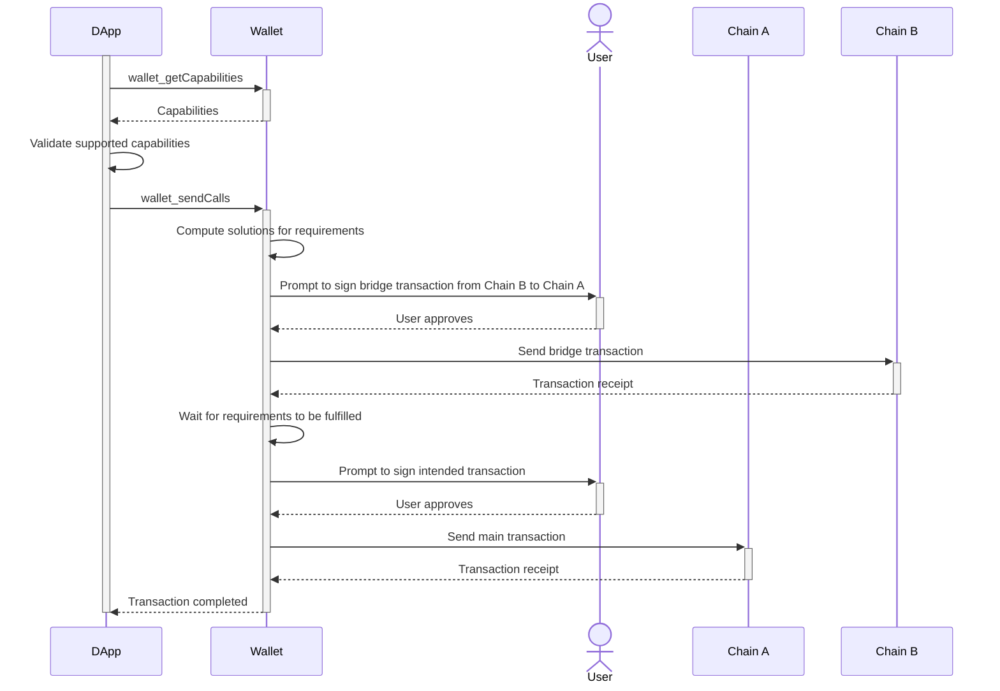
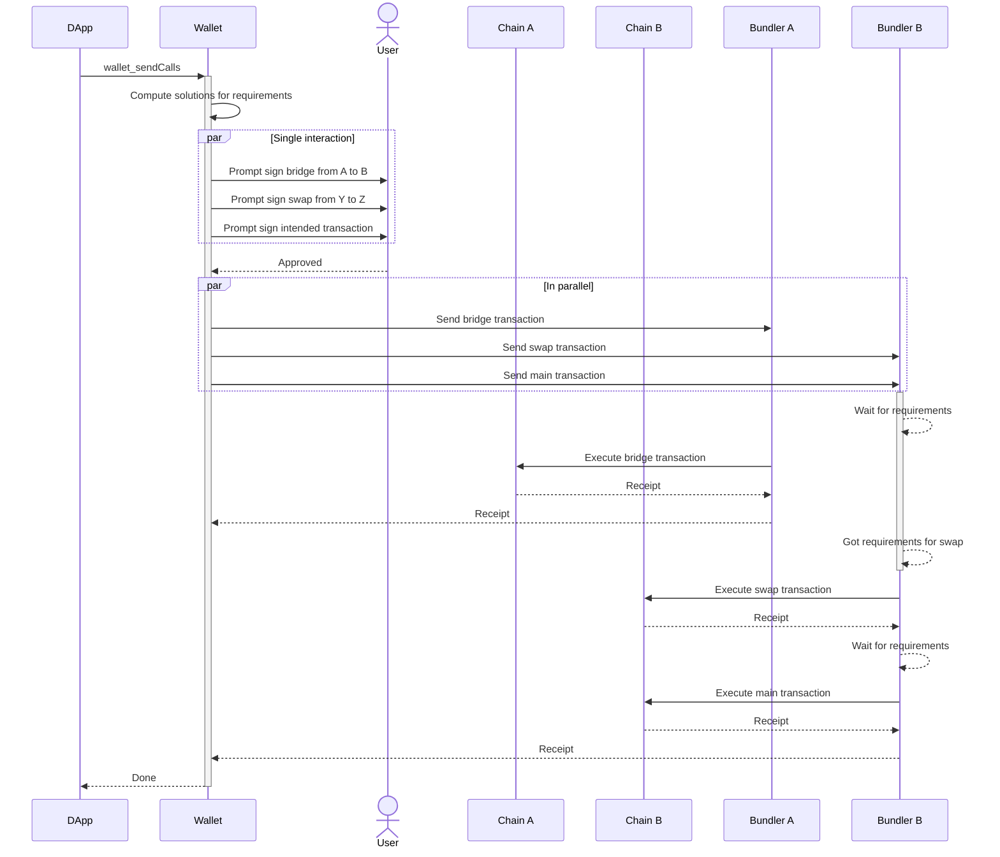

## Abstract

This ERC extends [EIP-5792](./eip-5792.md) by defining capabilities that allow dApps to specify common token prerequisites for transactions, such as having certain ERC-20, ERC-721, or ERC-1155 tokens. Wallets can then help users meet these requirements before executing the transactions.

## Motivation

It is fairly common for dApps to reside only on one network, but this comes at the cost of shrinking the direct liquidity that these dApps can access. This happens because most users only have funds on a limited number of networks. As the number of networks grows, the likelihood of intersection between the networks chosen by the dApp and the user decreases.

Given that dApps don't have a way of communicating with the wallet about their "final intent", they can only use transaction requests to communicate the last action that the user should take. However, it is up to the user to "guess" what prior actions need to be executed to fulfill the prerequisites of that final action.

This guessing may involve consolidating funds into a single network or exchanging assets into another asset accepted by the dApp. This is a cumbersome process for the user and results in a highly degraded UX.

## Specification

The key words "MUST", "MUST NOT", "REQUIRED", "SHALL", "SHALL NOT", "SHOULD", "SHOULD NOT", "RECOMMENDED", "NOT RECOMMENDED", "MAY", and "OPTIONAL" in this document are to be interpreted as described in RFC 2119 and RFC 8174.

This ERC extends [EIP-5792](./eip-5792.md) by adding new capabilities that can be used with the `wallet_sendCalls` and `wallet_getCapabilities` methods. These capabilities allow specifying different types of transaction requirements for common token standards that wallets can handle.

### ERC-20 Minimum Balance Capability

A dApp can use the `erc20MinBalance` capability in a `wallet_sendCalls` request to request that a wallet ensure the owner has a minimum balance of a specified ERC-20 token.

#### `wallet_getCapabilities` Response

Schema:

```typescript
type Erc20MinBalanceCapability = {
  supported: boolean;
  versions: string[];
}
```

Example:

```json
{
  "0x1": {
    "erc20MinBalance": {
      "supported": true,
      "versions": ["1.0"]
    }
  }
}
```

#### `wallet_sendCalls` Request

Version 1.0 Schema:

```typescript
type Erc20MinBalanceParams = {
  version: string;
  chainId: `0x${string}`; // Hex chain id
  owner: `0x${string}`; // Address
  token: `0x${string}`; // Address
  minAmount: `0x${string}`; // Hex value
};
```

This capability requests that the `owner` address **MUST** have a balance of at least `minAmount` of `token` on `chainId` before the transaction is executed.

Example:

```json
[
  {
    "version": "1.0",
    "from": "0xd46e8dd67c5d32be8058bb8eb970870f07244567",
    "calls": [
      {
        "to": "0xd46e8dd67c5d32be8058bb8eb970870f07244567",
        "value": "0x00",
        "data": "0x...",
        "chainId": "0x01",
      }
    ],
    "capabilities": {
      "erc20MinBalance": {
        "version": "1.0",
        "chainId": "0x01",
        "owner": "0xd46e8dd67c5d32be8058bb8eb970870f07244567",
        "token": "0xa0b86991c6218b36c1d19d4a2e9eb0ce3606eb48",
        "minAmount": "0x0f4240"
      }
    }
  }
]
```

### ERC-20 Minimum Allowance Capability

A dApp can use the `erc20MinAllowance` capability in a `wallet_sendCalls` request to request that a wallet ensure the owner has a minimum allowance of a specified ERC-20 token.
Note this capability does not imply that the owner has a balance of the token, only that the allowance is equal to or greater than the specified amount.

#### `wallet_getCapabilities` Response

Schema:

```typescript
type Erc20MinAllowanceCapability = {
  supported: boolean;
  versions: string[];
}
```

Example:

```json
{
  "0x1": {
    "erc20MinAllowance": {
      "supported": true,
      "versions": ["1.0"]
    }
  }
}
```

#### `wallet_sendCalls` Request

Version 1.0 Schema:

```typescript
type Erc20MinAllowanceParams = {
  version: string;
  chainId: `0x${string}`; // Hex chain id
  owner: `0x${string}`; // Address
  operator: `0x${string}`; // Address
  token: `0x${string}`; // Address
  minAmount: `0x${string}`; // Hex value
};
```

This capability requests that the `owner` address **MUST** have an allowance of at least `minAmount` of `token` for `operator` on `chainId` before the transaction is executed.

Example:

```json
[
  {
    "version": "1.0",
    "from": "0xd46e8dd67c5d32be8058bb8eb970870f07244567",
    "calls": [
      {
        "to": "0xd46e8dd67c5d32be8058bb8eb970870f07244567",
        "value": "0x00",
        "data": "0x...",
        "chainId": "0x01",
      }
    ],
    "capabilities": {
      "erc20MinAllowance": {
        "version": "1.0",
        "chainId": "0x01",
        "owner": "0xd46e8dd67c5d32be8058bb8eb970870f07244567",
        "token": "0xa0b86991c6218b36c1d19d4a2e9eb0ce3606eb48",
        "operator": "0xd46e8dd67c5d32be8058bb8eb970870f07244567",
        "minAmount": "0x0f4240"
      }
    }
  }
]
```

### ERC-721 Ownership Capability

A dApp can use the `erc721Ownership` capability in a `wallet_sendCalls` request to request that a wallet ensure the owner has ownership of a specified ERC-721 token.

#### `wallet_getCapabilities` Response

Schema:

```typescript
type Erc721OwnershipCapability = {
  supported: boolean;
  versions: string[];
}
```

Example:

```json
{
  "0x1": {
    "erc721Ownership": {
      "supported": true,
      "versions": ["1.0"]
    }
  }
}
```

#### `wallet_sendCalls` Request

Version 1.0 Schema:

```typescript
type Erc721OwnershipParams = {
  version: string;
  chainId: `0x${string}`; // Hex chain id
  owner: `0x${string}`; // Address
  token: `0x${string}`; // Address
  tokenId: `0x${string}`; // Hex value
};
```

This capability requests that the `owner` address **MUST** have ownership of `tokenId` of `token` on `chainId` before the transaction is executed.

Example:

```json
[
  {
    "version": "1.0",
    "from": "0xd46e8dd67c5d32be8058bb8eb970870f07244567",
    "calls": [
      {
        "to": "0xbc4ca0eda7647a8ab7c2061c2e118a18a936f13d",
        "value": "0x00",
        "data": "0x...",
        "chainId": "0x01",
      }
    ],
    "capabilities": {
      "erc721Ownership": {
        "version": "1.0",
        "chainId": "0x01",
        "owner": "0xd46e8dd67c5d32be8058bb8eb970870f07244567",
        "token": "0xbc4ca0eda7647a8ab7c2061c2e118a18a936f13d",
        "tokenId": "0x10"
      }
    }
  }
]
```

### ERC-721 Approval Capability

A dApp can use the `erc721Approval` capability in a `wallet_sendCalls` request to request that a wallet ensure the owner has approved a specified ERC-721 token.
Note this capability does not imply that the owner has a balance of the token, only that the allowance is equal to or greater than the specified amount.

#### `wallet_getCapabilities` Response

Schema:

```typescript
type Erc721ApprovalCapability = {
  supported: boolean;
  versions: string[];
}
```

Example:

```json
{
  "0x1": {
    "erc721Approval": {
      "supported": true,
      "versions": ["1.0"]
    }
  }
}
```

#### `wallet_sendCalls` Request

Version 1.0 Schema:

```typescript
type Erc721ApprovalParams = {
  version: string;
  chainId: `0x${string}`; // Hex chain id
  owner: `0x${string}`; // Address
  operator: `0x${string}`; // Address
  token: `0x${string}`; // Address
  tokenId: `0x${string}`; // Hex value
};
```

This capability requests that the `owner` address **MUST** have approved `operator` to transfer `tokenId` of `token` on `chainId` before the transaction is executed.

Example:

```json
[
  {
    "version": "1.0",
    "from": "0xd46e8dd67c5d32be8058bb8eb970870f07244567",
    "calls": [
      {
        "to": "0xbc4ca0eda7647a8ab7c2061c2e118a18a936f13d",
        "value": "0x00",
        "data": "0x...",
        "chainId": "0x01",
      }
    ],
    "capabilities": {
      "erc721Approval": {
        "version": "1.0",
        "chainId": "0x01",
        "owner": "0xd46e8dd67c5d32be8058bb8eb970870f07244567",
        "operator": "0xbc4ca0eda7647a8ab7c2061c2e118a18a936f13d",
        "token": "0xbc4ca0eda7647a8ab7c2061c2e118a18a936f13d",
        "tokenId": "0x10"
      }
    }
  }
]
```

### ERC-1155 Minimum Balance Capability

A dApp can use the `erc1155MinBalance` capability in a `wallet_sendCalls` request to request that a wallet ensure the owner has a minimum balance of a specified ERC-1155 token.

#### `wallet_getCapabilities` Response

Schema:

```typescript
type Erc1155MinBalanceCapability = {
  supported: boolean;
  versions: string[];
}
```

Example:

```json
{
  "0x1": {
    "erc1155MinBalance": {
      "supported": true,
      "versions": ["1.0"]
    }
  }
}
```

#### `wallet_sendCalls` Request

Version 1.0 Schema:

```typescript
type Erc1155MinBalanceParams = {
  version: string;
  chainId: `0x${string}`; // Hex chain id
  owner: `0x${string}`; // Address
  token: `0x${string}`; // Address
  tokenId: `0x${string}`; // Hex value
  minAmount: `0x${string}`; // Hex value
};
```

This capability requests that the `owner` address **MUST** have a balance of at least `minAmount` of `tokenId` of `token` on `chainId` before the transaction is executed.

Example:

```json
[
  {
    "version": "1.0",
    "from": "0xd46e8dd67c5d32be8058bb8eb970870f07244567",
    "calls": [
      {
        "to": "0x631998e91476da5b870d741192fc5cbc55f5a52e",
        "value": "0x00",
        "data": "0x...",
        "chainId": "0x01",
      }
    ],
    "capabilities": {
      "erc1155MinBalance": {
        "version": "1.0",
        "chainId": "0x01",
        "owner": "0xd46e8dd67c5d32be8058bb8eb970870f07244567",
        "token": "0x631998e91476da5b870d741192fc5cbc55f5a52e",
        "tokenId": "0x10",
        "minAmount": "0x0f4240"
      }
    }
  }
]
```

### ERC-1155 Minimum Allowance Capability

A dApp can use the `erc1155MinAllowance` capability in a `wallet_sendCalls` request to request that a wallet ensure the owner has a minimum allowance of a specified ERC-1155 token.
Note this capability does not imply that the owner has a balance of the token, only that the allowance is equal to or greater than the specified amount.

#### `wallet_getCapabilities` Response

Schema:

```typescript
type Erc1155MinAllowanceCapability = {
  supported: boolean;
  versions: string[];
}
```

Example:

```json
{
  "0x1": {
    "erc1155MinAllowance": {
      "supported": true,
      "versions": ["1.0"]
    }
  }
}
```

#### `wallet_sendCalls` Request

Version 1.0 Schema:

```typescript
type Erc1155MinAllowanceParams = {
  version: string;
  chainId: `0x${string}`; // Hex chain id
  owner: `0x${string}`; // Address
  operator: `0x${string}`; // Address
  token: `0x${string}`; // Address
  tokenId: `0x${string}`; // Hex value
  minAmount: `0x${string}`; // Hex value
};
```

This capability requests that the `owner` address **MUST** have an allowance of at least `minAmount` of `tokenId` of `token` for `operator` on `chainId` before the transaction is executed.

Example:

```json
[
  {
    "version": "1.0",
    "from": "0xd46e8dd67c5d32be8058bb8eb970870f07244567",
    "calls": [
      {
        "to": "0x631998e91476da5b870d741192fc5cbc55f5a52e",
        "value": "0x00",
        "data": "0x...",
        "chainId": "0x01",
      }
    ],
    "capabilities": {
      "erc1155MinAllowance": {
        "version": "1.0",
        "chainId": "0x01",
        "owner": "0xd46e8dd67c5d32be8058bb8eb970870f07244567",
        "operator": "0xbc4ca0eda7647a8ab7c2061c2e118a18a936f13d",
        "token": "0x631998e91476da5b870d741192fc5cbc55f5a52e",
        "tokenId": "0x10",
        "minAmount": "0x0f4240"
      }
    }
  }
]
```

## Rationale

This ERC extends [EIP-5792](./eip-5792.md) rather than defining new RPC methods because:

1. **Consistency**: Leverages existing capability discovery mechanism
2. **Composability**: Requirements can be combined with other [EIP-5792](./eip-5792.md) capabilities
3. **Flexibility**: Wallets can implement only the requirements they support
4. **Extensibility**: New requirement types can be added as additional capabilities

The decision to split requirements into individual capabilities rather than a single capability type allows:

1. Granular support by wallets
2. Clear capability discovery
3. Independent versioning of requirement types
4. Simpler implementation for basic wallets

## Security Considerations

This ERC does not introduce any new security risks or trust assumptions.

Users already trust their wallet provider to craft, manipulate and send transactions on their behalf. This ERC only adds a new field to the transaction request, which the wallet can use to make more informed decisions about transaction construction.

DApps **MAY** opt out of using this feature if they wish to handle requirement fulfillment themselves.

## Examples

This ERC serves as a foundational component for building user experiences that rely on cross-chain actions. It can be leveraged in various ways, depending on the combination of use cases and wallet implementations.

Not shown in the examples below are the `wallet_getCallsStatus` and `wallet_showCallsStatus` methods, which are used to query the status of a call bundle and display it to the user. The dApp **MAY** use these methods to provide a better user experience while waiting for the transactions to be fulfilled. More information can be found in the [EIP-5792](./eip-5792.md) specification.

### Marketplace Interaction with Bridge Using an EOA Wallet

A user wants to purchase ERC-721 tokens on **Chain A** but only has funds on **Chain B**. The user employs an Externally Owned Account (EOA) based wallet. The dApp requests an intended transaction using `wallet_sendCalls`, which includes the marketplace transaction alongside the requirement of owning funds on Chain A.

In this scenario, the wallet **MAY** prompt the user to sign the necessary transactions to fulfill the requirements before proceeding with the main transaction. The wallet **SHOULD** compute possible solutions to meet the requirements and **MUST** ensure that these prerequisites are met prior to executing the main transaction.



### Bridge, Swap, and Payment Using a Smart Contract Wallet

A dApp requests a payment from a user, which **MUST** be made in **Token Z** on **Chain B**, but the user holds **Token Y** on **Chain A**. The dApp requests an intended transaction using `wallet_sendCalls`, including the payment transaction alongside the requirement of having enough Token Z on Chain B.

In this scenario, the Smart Contract Wallet **MAY** prompt the user to sign all the necessary transactions at once, executing them in the appropriate order. The wallet **SHOULD** compute solutions to fulfill the requirements and **MUST** ensure that all prerequisites are satisfied before proceeding with the main transaction.

The signed transactions **MAY** be sent simultaneously to bundlers, who execute them as they become available, allowing the operation to complete even if the wallet disconnects.



These examples demonstrate how this ERC enables communication between dApps and wallets, making complex cross-chain interactions possible. Wallets **MAY** implement and execute these operations in any way they see fit, including using solver networks or manually sending the transactions. By leveraging the `wallet_sendCalls` method, wallets and dApps can provide a seamless user experience for complex transactions that involve multiple steps across different chains.

## Copyright

Copyright and related rights waived via [CC0](../LICENSE.md).
