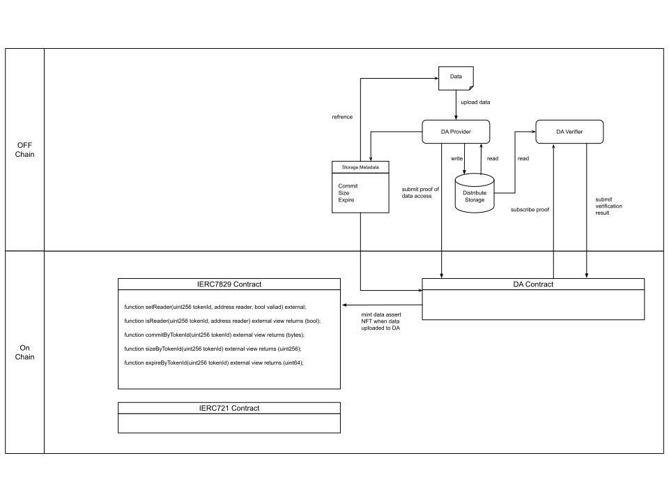

## Abstract

This proposal extends the [ERC-721](./eip-721.md) standard to support Data Assets which refers to digital products created by creators.

This proposal introduces a modular Data Availability (DA) layer that safeguards on-chain data integrity, preventing value discrepancies caused by off-chain data loss, tampering, or expiration. Furthermore, this proposal introduces a new role, Reader, where a single token can have multiple Readers. This solution reflects the inherent replicability of Data Assets, namely that each piece of data can be replicated multiple times and accessed by multiple users, thus amplifying the value of the Data Assets.

## Motivation

ERC-721 proposed NFTs to represent the ownership of digital or physical assets. Currently, the NFT metadata is considered the NFT content, and its scarcity determines the value of the NFT. NFT owners can convert the content value of NFTs into revenue by transferring the ownership of NFTs. However, due to the high transaction fees, storage costs, and other expenses, NFTs are currently only able to represent the ownership of high-value assets, which limits the range of assets that NFTs can represent. This is especially true for Data Assets, which refers to digital products created by creators, such as online blogs, videos, small games or music. Therefore, the value of Data Assets depends on their quality, whether the creator is famous, whether it is hyped and so on.

Furthermore, to reduce storage costs, the NFT content is generally stored off-chain or using cross-chain storage, and the link of NFT content is saved on-chain. Off-chain users can access the NFT content by visiting the link. However, on-chain contracts can not access the link to determine the status of the data, such as data loss, data tampering, or data expiration. These situations can lead to the data deviating from its actual value, but the NFT still exists on the chain, and the underlying copyright is still being sold in the market.

This proposal introduces Data Asset NFTs, which solve the dilemma of on-chain Data Assets by combining a modular data layer--Data Availability (DA).

### Related Work

There are Existing proposals to NFT integrity, but each proposal contains at least one of these limitations:

- Storing NFT content on-chain, which requires the underlying data asset to possess inherent speculative value to justify prohibitive storage costs.
- Requiring attestations from a trusted third party, while introduces centralized trust issue.

## Specification

### Terms

In this proposal, we divide data assets into three parts:

- Storage Metadata: Includes commitment, size, expire, and uploader's address. Stored and maintained by storage contracts on the blockchain.
- Permission Metadata: Includes information on ownership and reading rights, as well as which addresses can modify this information. Stored and maintained by permission contracts on the blockchain.
- Data Content: Data uploaded by users to the storage system. Data content is stored in off-chain storage nodes.

**Every compliant data permission contract must implement the Interface**:

The data permission contract is an extension of ERC-721, adding the reader role, where a single data asset can correspond to multiple readers.

```solidity
interface IERC7829 is IERC721 {
    event UpdateReader(uint256 indexed tokenId, address indexed reader, bool valid);
    
    function setReader(uint256 tokenId, address reader, bool valid) external;
    
    function isReader(uint256 tokenId, address reader) external view returns (bool);
    
    function commitByTokenId(uint256 tokenId) external view returns (bytes);
    
    function sizeByTokenId(uint256 tokenId) external view returns (uint256);
    
    function expireByTokenId(uint256 tokenId) external view returns (uint64);
}
```

The metadata JSON schema for Data Asset NFTs is as follows:

```json
{
  "title": "Data Asset Metadata",
  "type": "object",
  "properties": {
    "name": {
      "type": "string",
      "description": "Identifies the asset to which this NFT represents"
    },
    "description": {
      "type": "string",
      "description": "Describes the asset to which this NFT represents"
    },
    "commit": {
      "type": "string",
      "description": "A commit pointing to the data resource"
    },
    "size": {
        "type": "integer",
        "description": "The size of the data resource"
    },
    "expire": {
        "type": "integer",
        "description": "The expire time of the data resource",
    }
  }
}
```

The Reader role should not involve changes in permissions, meaning that Readers cannot call functions such as `transfer`, `approve`, `setApprovalForAll`, and `setReader`.

When Alice calls the `transfer` function to transfer one of Alice's Data Asset NFTs to Bob:

- The owner address is set to Bob's address;
- The approved address is set to 0.
- However, all readers are retained.

### Extension: Storage Contract

This proposal extends the metadata information of NFTs. Metadata information is uploaded by users and requires relevant certificates, which can be the storage node's signature on the NFT's metadata information. This proposal specify that the NFT metadata should at least include commitment, size, expire, and uploader's address.

The implementer of this proposal selects a trusted storage system and a trusted modular data layer DA, or deploys the modular storage layer DA themselves.

When the Owner or Approved Operator calls the `transfer`, `approve`, or `setReader` functions, they must additionally check whether the current time `block.timestamp` is greater than the expiration time `expire` before making the call. If the current time `block.timestamp` is less than the expiration time `expire`, then proceed with subsequent operations; if the current time `block.timestamp` is greater than the expiration time `expire`, then interrupt subsequent operations and return an exception message.

### Extension: Storage Proof

This proposal uses storage proof to prove the availability of data content, thereby proving the correctness of NFT metadata, especially the `expire` of the NFT.

This proposal does not limit the proof scheme used, but recommends the use of KZG polynomial commitment technology. KZG polynomial commitment technology can generate two generator elements $g_1$ and $g_2$ during initialization. It also generates a corresponding commitment C based on the data content and uploads it as the unique identifier of the data when uploading metadata. When generating proof, the verifier generates a random number $z$, and the prover generates proof $P=(y, π)$ based on the data content and random number $z$, verifying $e(π, yg_1-zg_2) = e(C - y*g_1, g_2)$.

In addition, KZG polynomial commitment technology can aggregate multiple proofs into a single proof, and two-step verification can verify the correctness of all proofs, including summing all commitments to get the aggregated commitment $C_n$, and verifying the aggregated proof $P_n=(y_n, π_n)$ by verifying $e(π_n, y_ng_1-zg_2) = e(C_n - y_n*g_1, g_2)$.

To avoid long proof generation times, random sampling can be used to randomly select data to be challenged. Therefore, the contract needs to provide a secure pseudo-random number generation function for randomly selecting challenged data, which can also be used as the random number $z$ for KZG.

During the verification process, summing all commitments to get the aggregated commitment requires a large amount of gas fees. This proposal recommends using optimistic proof, which assumes that the aggregated commitment is correct and only verifies $e(π_n, y_ng_1-zg_2) = e(C_n - y_n*g_1, g_2)$ during verification. After verifying the aggregated proof, the availability of the data cannot be proven, so a certain period of challenging is required. During the challenging period, anyone can challenge the commitment proof $C_n$. If the challenge is successful, the challenger gets a reward and the prover is punished; if the challenge fails, the challenger is punished and the prover gets additional benefits.

## Rationale



### Data Asset NFT Integrity

The DA Layer is responsible for off-chain storage of Data Content and on-chain storage of Storage Metadata, and ensures the integrity of Data Assets through periodically submiting and verifing **storage proofs**.

To optimize gas costs, we adopt an **optimistic proof approach**, significantly reducing verification expenses.

**Proof Cycle Workflow**:

1. **Proof Generation & Aggregation**:
   - The **DA Provider** generates storage proofs for sampled data content, aggregates them into a single **aggregated proof**, and submits it to the **DA Contract**.
   - The **DA Contract** verifies the correctness of the aggregated proof.
2. **Fraud Proof Mechanism**:
   - The **DA Verifier** performs off-chain validation to confirm whether the aggregated proof was correctly derived from the selected data.
   - If the proof is invalid, the verifier **challenges** it by submitting a fraud proof to the DA Contract.

### Reader

This proposal enables a **single data asset NFT** to have **multiple Readers**, each granted access to the off-chain data content. This design aligns with the inherent properties of data assets:

- **Replicability**: Data can be copied and distributed without degradation.
- **Value Amplification**: By allowing resale or multi-party access, the asset’s utility and market value increase.

## Backwards Compatibility

This proposal combines the existing ERC-721 extension and is backward compatible with the ERC-721 standard.

## Security Considerations

The security of Data Asset NFTs depends not only on the blockchain but also on the modular data layer DA. Therefore, the implementer of this proposal needs to carefully select the modular data layer DA.

## Copyright

Copyright and related rights waived via [CC0](../LICENSE.md).
