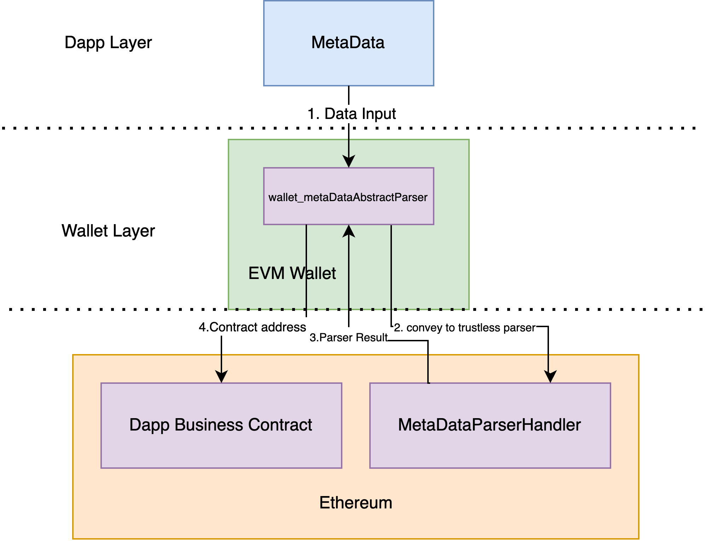

## Abstract

This proposal defines a standardized interface for parsing on-chain metadata (MetaData) relevant to Wallets. The standard consists of two core components:

- **1.Wallet-level parser interface:** wallet_metaDataAbstractParser
  A universal entry point that Wallets can use to request metadata parsing.
- **2.Smart contract-level parsing logic:** parserHandler and parserData
  Smart contracts that handle specific parsing logic, receiving parameters from Wallets and returning readable metadata.

The aim of this proposal is to establish a general-purpose, trustless, and decentralized metadata parsing standard that enhances user experience, security, and the readability of Ethereum ecosystem metadata.

## Motivation

Wallets serve as the primary interface between users and the Ethereum ecosystem. To improve user experience and security, Wallets need to parse various types of on-chain metadata, such as:

- ENS mappings to addresses.
- Standard assert's readable label (eg. [ERC-20](./erc-20.md), [ERC-721](./erc-721.md))
- On-chain content (e.g., resources like eth.limo).
- Cross Chain intentions standard like [EIP-7683](./eip-7683.md)
- Other human-readable on-chain information.

Currently, Wallets lack a standardized way of parsing metadata, leading to several challenges:

- **1.Inconvenience:** Different Wallets implement metadata parsing differently, resulting in inconsistent user experiences.
- **2.Security Risks:** Scattered parsing logic increases the attack surface for malicious actors.
- **3.Low Readability:** On-chain data is often difficult for users to understand without additional processing.

This proposal aims to solve these problems by creating a standardized, secure, and user-friendly way for Wallets to parse on-chain metadata.

## Specification

The key words "MUST", "MUST NOT", "REQUIRED", "SHALL", "SHALL NOT", "SHOULD", "SHOULD NOT", "RECOMMENDED", "NOT RECOMMENDED", "MAY", and "OPTIONAL" in this document are to be interpreted as described in RFC 2119 and RFC 8174.

### Work Flow



### 1. Wallet-Level Entry Point: wallet_metaDataAbstractParser

`wallet_metaDataAbstractParser` is a universal interface that Wallets can use to request metadata parsing. It accepts the following parameters:

- `parserHandler:` The address of the smart contract that implements the parsing logic.
- `parserData:` The raw metadata parameters to be parsed (of type bytes).

```typescript
export interface IWalletMetaDataAbstractParser {
  /**
   * Universal interface for parsing on-chain metadata
   * @param parserHandler Address of the smart contract handling metadata parsing
   * @param parserData Raw metadata parameters to be parsed
   * @returns A promise that resolves to the parsed metadata of generic type T
   */
  wallet_metaDataAbstractParser<T>(
    parserHandler: string, // Address of the smart contract
    parserData: Uint8Array // Raw metadata parameters as bytes
  ): Promise<T>; // The return type is a generic type T
}
```

### 2. Smart Contract-Level Parsing Logic: parserHandler and parserData

`parserHandler` is a smart contract deployed on-chain that implements the actual parsing logic. It receives parameters from Wallets and returns parsed, human-readable metadata.

Interface Definition:

```solidity
interface IMetaDataParserHandler {
    /**
     * @dev Logic for parsing metadata
     * @param parserData Raw metadata parameters to be parsed
     * @return parsedData Parsed metadata in bytes format
     */
    function parse(bytes calldata parserData) external view returns (bytes memory parsedData);
}
```

### Example Implementation

Below is an example implementation for parsing ENS-to-address mappings.

#### 1. ENS Metadata Parsing Contract

```solidity
interface ENSRegistry {
    function resolver(bytes32 node) external view returns (address);
}

interface Resolver {
    function addr(bytes32 node) external view returns (address);
}

contract ENSParserHandler is IMetaDataParserHandler {
    /**
     * @dev Example parsing logic: Resolving ENS name to address
     * @param parserData Raw ENS name (encoded in bytes)
     * @return parsedData Resolved address encoded in bytes format
     */
    function parse(bytes calldata parserData) external view override returns (bytes memory parsedData) {
        // Decode the raw parserData into a string (ENS name)
        string memory ensName = abi.decode(parserData, (string));

        address constant ENS_REGISTRY_ADDRESS = 0x00000000000C2E074eC69A0dFb2997BA6C7d2e1e;

        ENSRegistry ensRegistry = ENSRegistry(ENS_REGISTRY_ADDRESS);

        bytes32 node = namehash(name);

        address resolverAddress = ensRegistry.resolver(node);
        require(resolverAddress != address(0), "Resolver not found for this name");

        Resolver resolver = Resolver(resolverAddress);
        addr = resolver.addr(node);
        return abi.encodePacked(addr);
    }
}
```

#### 2. Wallet Usage Example

Below is an example of how a Wallet can use the wallet_metaDataAbstractParser interface.

```typescript
const ENSParserHandler_ADDRESS = "0x_YourDeployedParserContractAddress";

// The ABI of the ENSParserHandler contract
const ENSParserHandler_ABI = [
  {
    inputs: [{ internalType: "bytes", name: "parserData", type: "bytes" }],
    name: "parse",
    outputs: [{ internalType: "bytes", name: "parsedData", type: "bytes" }],
    stateMutability: "view",
    type: "function",
  },
];

// Implementation of the interface
export class WalletENSParser implements IWalletMetaDataAbstractParser {
  private provider: ethers.JsonRpcProvider;

  constructor(rpcUrl: string) {
    // Initialize the provider
    this.provider = new ethers.JsonRpcProvider(rpcUrl);
  }

  /**
   * Implementation of wallet_metaDataAbstractParser
   * @param parserHandler Address of the `ENSParserHandler` smart contract
   * @param parserData Raw ENS name encoded as bytes
   * @returns Parsed metadata (resolved Ethereum address)
   */
  async wallet_metaDataAbstractParser<T>(
    parserHandler: string,
    parserData: Uint8Array
  ): Promise<T> {
    // Get the contract instance
    const contract = new ethers.Contract(
      parserHandler,
      ENSParserHandler_ABI,
      this.provider
    );

    try {
      // Call the `parse` method to resolve the ENS name
      const parsedData: string = await contract.parse(parserData);

      // Decode the result into an Ethereum address (if the result is an address)
      const decodedResult = ethers.utils.defaultAbiCoder.decode(
        ["address"],
        parsedData
      )[0];

      // Return the parsed result, with the type as generic T
      return decodedResult as T;
    } catch (error) {
      console.error("Failed to parse metadata:", error);
      throw error;
    }
  }
}
```

## Rationale

### **1. Generalization:**

The interface is simple and adaptable to different types of metadata parsing logic (e.g., ENS resolution, on-chain content parsing).

### **2. Decentralization:**

Parsing logic is implemented by on-chain smart contracts, ensuring transparency and avoiding centralized points of failure.

### **3.Extensibility:**

New parsing logic can be added by deploying new smart contracts without requiring changes to Wallet core logic.

### **4.Security:**

Wallets only need to trust the parsing contract address, reducing complexity and vulnerability.

## Backwards Compatibility

This proposal introduces new functionality and does not affect existing Wallets or smart contracts. Wallets that do not implement this standard will continue to function as usual.

## Test Cases

### Test Case: ENS Name Resolution

- Input:
  - parserHandler: Address of the ENS parsing contract.
  - parserData: "vitalik.eth" (encoded as bytes).
- Output:
  "0xd8dA6BF26964aF9D7eEd9e03E53415D37aA96045".

### Test Case: Unknown ENS Name

- Input:
  - parserHandler: Address of the ENS parsing contract.
  - parserData: "unknown.eth" (encoded as bytes).
- Output:
  - "Address not found".

## Security Considerations

### Parsing Logic Security:

- Parsing contracts should be audited to prevent potential vulnerabilities or malicious behavior.

### User Privacy:

- Wallets must ensure that user data is handled securely and not leaked during parsing.

### Trust Minimization:

- Users should be allowed to specify the address of the parsing contract, avoiding reliance on centralized services.

## Copyright

Copyright and related rights waived via [CC0](../LICENSE.md).
