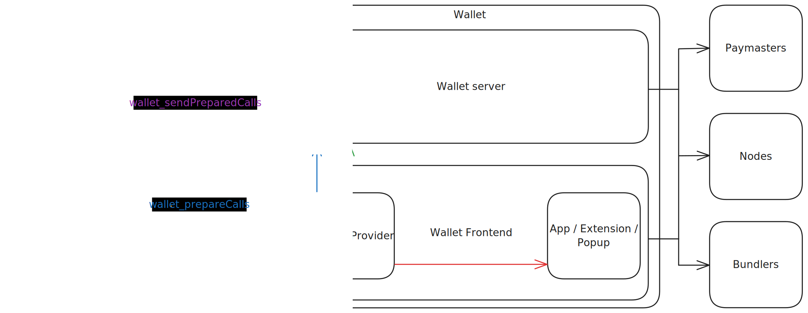

## Abstract

This proposal defines complementary JSON-RPC methods to [EIP-5792](./eip-5792.md)'s `wallet_sendCalls`. While `wallet_sendCalls` is used for an app to submit `calls` to be signed and submitted in a wallet's interface, the methods in this proposal are for an application to request prepared calls (where "prepared" depends on the wallet implementation) to be signed and submitted by the application itself.

## Motivation

With more recent developments in account abstraction and session keys, there is an increasing need for applications to be able to sign and submit operations without switching to a wallet interface (e.g. browser extension). This can be tricky because different account implementations might have different call data encoding, signature formats, etc. To remedy this, we need a way for apps to know how to submit an operation for any account implementation.

## Specification

Two new JSON-RPC methods are defined. If the user is interacting with an application on the browser, they can be used by sending the requests to the wallet's [EIP-1193](./eip-1193.md) provider. However, this proposal also describes how an application might interact with a "wallet server" for background processes.

### `wallet_prepareCalls`

Accepts an EIP-5792 `wallet_sendCalls` request, and returns the prepared calls according to the account's implementation.

#### Parameters

```typescript!
type PrepareCallsParams = [{
  version: string
  from: `0x${string}`
  chainId: `0x${string}`
  calls: {
    to: `0x${string}`
    data: `0x${string}`
    value: `0x${string}`
  }[];
  capabilities: Record<string, any>
}]
```

##### Example Parameters

```typescript!
wallet_prepareCalls([{
  version: '1.0',
  from: '0x...',
  chainId: '0x...',
  calls: [{
    to: '0x...'
    data: '0x...'
    value: '0x...'
  }],
  capabilities: {
    paymasterService: {
      url: 'https://...'
    }
  }
}])
```

#### Return Value

```typescript!
type PrepareCallsReturnValue = [{
  type: string
  preparedCalls: {
    data: any
    chainId: `0x${string}`
    signatureRequest: {
      type: string
      hash: `0x${string}`
    }
  }[]
  preparedCapabilities: Record<string, any>
}]
```

##### Example Return Value

```typescript!
[{
  type: 'user-operation-v06',
  preparedCalls: {
    data: {
      sender: '0x...',
      ...
    },
    chainId: '0x01',
    signatureRequest: {
      type: 'secp256k1',
      hash: '0x...'
    }
  },
  preparedCapabilities: {
    paymasterService: {
      sponsor: 'My app'
    }
  }
}]
```

After calling `wallet_prepareCalls`, app developers are expected to sign the hash provided in the `signatureRequest` field and submit the prepared and signed calls back to the wallet (either via its [EIP-1193](./eip-1193.md) provider or to its server counterpart) using the second RPC method, `wallet_sendPreparedCalls`.

### `wallet_sendPreparedCalls`

Accepts prepared calls from the response to a `wallet_prepareCalls` request along with a signature, and returns an EIP-5792 call bundle ID.

#### Parameters

```typescript!
type SendPreparedCallsParams = [{
  version: string
  type: string
  preparedCalls: {
    data: any
    chainId: `0x${string}`
    signature: {
      type: string
      data: `0x${string}`
    }
  }[]
}]
```

##### Example Parameters

```typescript!
wallet_sendPreparedCalls([{
  version: '1.0',
  type: 'user-operation-v06',
  preparedCalls: [{
    data: {
      sender: '0x...',
      ...
    },
    chainId: '0x01',
    signature: {
      type: 'secp256k1',
      data: '0x...'
    }
  }]
}])
```

#### Return Value

```typescript!
type SendPreparedCallsReturnValue = {
  preparedCallIds: string[]
}
```

##### Example Return Value

```typescript!
['0x...']
```

The `wallet_sendPreparedCalls` RPC responds with EIP-5792 call bundle identifiers, so apps that already use `wallet_sendCalls` to submit calls to the wallet can continue to use `wallet_getCallsStatus` to get the status of submitted calls.

## Rationale

## The Wallet Server Model

Many session key use cases involve submitting operations on users' behalves. One example is an application that automates a user's DEX trading. In these cases, the wallet may provide a "wallet server" URL for the app to submit JSON-RPC requests to outside of the context of a browser.

It is not in the scope of this EIP, but someone could define a `walletServer` [EIP-5792](./eip-5792.md) capability that declares a public wallet server URL.

```json
{
  "0x2105": {
    "walletServer": {
      "supported": true,
      "url": "https://.../0x2105"
    }
  },
  "0x14A34": {
    "walletServer": {
      "supported": true,
      "url": "https://.../0x14A34"
    }
  }
}
```

If a wallet's [EIP-1193](./eip-1193.md) provider receives these requests, it might choose to reroute the request to its own wallet server. Alternatively, the [EIP-1193](./eip-1193.md) provider can handle the requests directly.



## Backwards Compatibility

TBD

## Security Considerations

Needs discussion.

## Copyright

Copyright and related rights waived via [CC0](../LICENSE.md).
