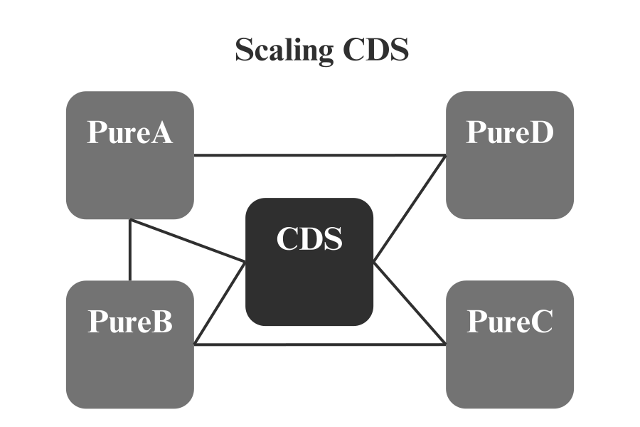
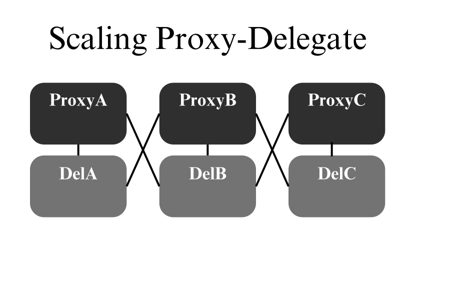
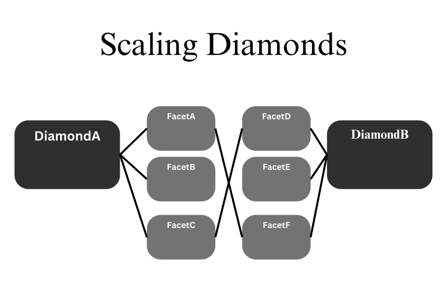

## Abstract  

While Diamond Storage and Proxy-Delegate patterns offer time-tested upgradeability solutions, they introduce clear constraints: bloated contract structures, rigid storage alignment requirements, and complex integrations for new logic that become increasingly cumbersome as project scope expands.  

**Consolidated Dynamic Storage (CDS)** introduces a flexible, gas-efficient system that supports **post-deployment creation and extension** of both **mapped struct layouts** and their corresponding **segregated storage spaces**, enabling seamless storage evolution through a unified, centralized layer shared by linked pure contracts.

CDS achieves this by combining two core features:

- **Extendable Structs**: Struct members can be dynamically appended to existing mapped structures using a compact `[bitCount(128), type(64), size(64)]` format.
- **Modular Storage Spaces**: Configurable, logically-separated namespaces that support dynamic mappings-of-structs and in-place extensions.

This architecture centralizes storage management, enabling seamless storage-level integration for new contracts.  By eliminating slot collisions, streamlining upgrades, and enabling dynamic state transparency, CDS is ideal for evolving systems like **DeFi protocols, DAOs**, and **modular frameworks** requiring frequent upgrades.

## Motivation  



The Ethereum ecosystem relies heavily on upgradeable smart contract patterns to enable flexibility in evolving protocols and systems. Contemporary solutions such as **Proxy-Delegate** patterns and [ERC-2535](./eip-2535.md)'s **Diamond Standard** have proven their utility but suffer from significant limitations:

1. **Rigid Storage Layouts**:
    - Proxy-based models and the Diamond Standard require **predefined storage layouts**. Developers must "reserve space" for potential future fields, which complicates upgrades and wastes storage.
    
	    **Example**: In a DAO framework managing a dynamic treasury, adding a new struct member (e.g., `lastClaimedReward`) to an existing `mapping(address => UserInfo)` would require redefining the contract logic or migrating state—both cumbersome processes.
    
2. **Storage Collision Risks**:
    - Manually managing storage slots in proxy models or Diamond facets risks **overlapping storage slots**, leading to corruption of critical state data. This requires extreme diligence during development and audits.
    
3.  **Structural Inefficiency**:
    - Proxy-delegate models require a one-to-one mapping between pure contracts and their storage, creating a *spiderweb pattern* of linked contracts.  This introduces higher gas costs and added complexity.  Additionally, cross-contract calls introduce clear convolution: for instance, a single cross-contract call would invoke: ProxyA, DelegateA, ProxyB, DelegateB.  Diamonds can introduce similar convolution: while routing calls through diamonds introduces a consistent entry point, it also creates a bottleneck for growing systems.  As more diamonds are introduced, a similar spiderweb pattern takes shape emerge.
    


	
4. **Lack of In-Place Solutions**
    - Existing solutions present a clear lack of contract-level control over the storage space.  In the case of proxy-delegate models, an equivalent to *upgradeable structs* is technically achievable, but requires upgrading and swapping out contracts.  For Diamond facets, the situation is more dire, as the storage layout is completely rigid unless paired with a proxy-delegate model.  
    
    - Introducing fine-grained, system-wide control over storage simplifies this process. Developers can dynamically add storage fields through a simple function invocation, reducing complexity and audit costs.  Critically, this functionality does not need to be applied at a blanket level -- basic permission management systems and governance solutions can re-instate spotless decentralization while the capability remains intact.  
      
5. **Complex Integrations** 
	 
	- Integrating legacy contracts with new logic typically requires the re-deployment of *both contracts,* significantly increasing the effort required.  By linking them at the storage layer, we streamline upgrades by reducing unnecessary separation between logic and storage, eliminating the need for dual redeployments.  For example, integrating a new rewards system into an existing contract could easily require redeploying both the rewards logic and the main contract, along with manual state migration. This process adds significant effort and complexity.
	

**Consolidated Dynamic Storage (CDS)** comprehensively addresses these limitations by introducing a **flexible and gas-efficient storage model** that enables post-deployment of expansion and creation of dynamic mapping-of-structs without redeployment.   
Specifically:  
- Dynamic Structs allow new fields to be added efficiently in a standardized, collision-free manner.
- Segregated storage spaces synergize with dynamic structs to enable in-place growth *to infinity.*
- Leveraging a single all-encompassing storage layer, and without relying on it as a call router, allows us to minimize the spiderweb pattern to its most innocuous form.  
- While centralization of the storage layer seems risky on the surface level, it is actually a responsible approach: with CDS, the potential for data issues is limited to the scope a single contract.  Additionally, simple permissions systems can effectively block all direct access by non-autonomous agents, leaving the burden of risk solely on the connected pure contracts.
- Collision-Free Storage ensures logical separation of storage spaces via hashed namespaces and configurable offsets.
- Optional Batch Operations significantly reduce gas costs for high-throughput systems by minimizing external calls.
- State Transparency provides query functions that allow developers to dynamically inspect storage layouts and interact with stored data.

By solving these limitations, CDS simplifies upgradeability, reduces gas costs, and eliminates storage layout constraints, empowering developers to build evolving systems like DeFi protocols, modular frameworks, and DAOs with greater flexibility and confidence.

### CDS In Clear Terms
Consolidated Dynamic Storage (CDS) is a single, centralized contract designed to act as the storage layer for a dynamic collection of linked contracts. CDS provides a unified storage space where data is managed, structured, and shared across multiple contracts. This central storage layer supports fully dynamic, in-place extendibility, allowing developers to add new fields, update structures, and evolve their storage needs without redeployment or migration. By decoupling data storage from individual contracts and securing it with permission management, CDS simplifies interoperability, enhances scalability, and streamlines upgrades, making it an efficient and future-proof solution for Ethereum-based systems.


### Why Use CDS When Diamond Storage Exists?
The **Diamond Standard ([ERC-2535](./erc-2535.md))** modularizes smart 
contract logic elegantly, but retains a rigid storage model. 
While facets can be upgraded post-deployment, **the storage layout itself remains static**. 
To mirror the capabilities of CDS, a Diamond storage layer would require its own proxy-delegate 
solution up-front.  Developers would need to swap the diamond delegate, then 
re-connect all of its linked contracts.  *In a production environment, 
this process represents time, cost, and risk.*  Additionally, this approach 
further exacerbates the *spiderweb contract structure*.

## Specification 

The keywords “MUST”, “MUST NOT”, “REQUIRED”, “SHALL”, “SHALL NOT”, “SHOULD”, “SHOULD NOT”, “RECOMMENDED”, “MAY” and “OPTIONAL” in this document are to be interpreted as described in RFC 2119.

### Extendable Structs and Storage Spaces
- Extendable structs MUST leverage dynamic mappings with deterministic field hashes (`keccak256`).  
- The base struct and its additions MUST remain immutable, while fields MUST be dynamically appendable.
- Storage spaces MUST equate to a simple extension of the hashing structure, segmenting both struct-defining and active data.

Each struct member MUST be defined using the following compact metadata structures:

| **Field**  | **Bits** | **Description**                          |
| ---------- | -------- | ---------------------------------------- |
| `bitCount` | 128      | Starting bit offset for the member.      |
| `size`     | 64       | Size of the member in bits.              |
| `type`     | 64       | Type ID (e.g., `uint256`, `bool`, etc.). |

### Type IDs:

| **Type**                   | **ID** | **Size**     |
| -------------------------- | ------ | ------------ |
| `uint`                     | 1      | 8...256 bits |
| `int`                      | 2      | 8...256 bits |
| `bool`                     | 3      | 8 bits       |
| `address`                  | 4      | 160 bits     |
| `bytes32 (optional)`       | 5      | 256 bits     |
| `string (≡ bytes)`         | 6      | Dynamic      |

*For arrays, developers MAY define unpacking logic to treat `string` or `bytes` fields as indexed collections of dynamic elements.*

### Hash Structure:
There are three main segments that MUST include separate hashing structures to resolve any potential for collisions, meta-segmented by their particular storage spaces.  These are: storage space state data and member-specific data, storage space live data, and storage space dynamic data. 

There are two special values that MUST be included: a `safeIndex` and a `stringIndex`.  Both are expounded upon in detail below.

Developers SHOULD include a unique hash offset for each space, as this simplifies the development and audit process considerably, and thereby greatly reduces the risk of improper implementation.

A storageSpace `offset` value MUST be included.  This is explicitly marked in the below section for clarity.  

*MEMBERS_LIM* refers to the total max quantity of struct members permitted within a single extendible struct.  

*ENTRIES_LIM* refers to the max amount of entries in a storage space, and serves as the upper limit for *push* and *pushMany*.  

A,B,C hash offset structure not only allows CDS to functionally guarantee safety from collisions, but also aid in debugging by 
allowing maintainers to instantly track the high-level objective of complex storage operations.

**Metadata Root:**  
`offset := shl(176, mul(storageSpaces, MEMBERS_LIM))`  
`mstore(0x0, offset)`  
`ROOT_SLOT := keccak256(0x0, 0xA)`  

**Storage Space State Data:**  
`sload(ROOT_SLOT)` -> {`members(64), entries(64), stringIndex(64), safeIndex (64)`}  

**Storage Space Member-Specific Data:**  
`sload(add(ROOT_SLOT, add(1, memberIndex)))` -> {`bitCount(128), size(64), type(64)`}   
*String*: `sload(add(ROOT_SLOT, add(1, memberIndex)))` -> {`stringIndex(128), type(128)`}  


**Live Data:**  
`mstore(0x0, shl(168, add(entryIndex, mul(ENTRIES_LIM, storageSpace))))`  
`INDEXED_DATA_ROOT_IN_STORAGE_SPACE = keccak256(0x0, 0xB)` -> {`packed slot`}    
Use bitCount and size (in member-specific data) to derive the location of a  
desired struct member in an indexed storage space.  


**Storage Space Dynamic Data:**  
`[strindex (32)][entryIndex (32)][storageSpace (32)]`  
```solidity
        mstore(
            0x0,
            or(
                or(shl(224, entryStrindex), shl(192, entryIndex)),
                shl(160, and(storageSpace, 0xFFFFFFFF))
            )
        )
        ENTRY_SLOT := keccak256(0x0, 0xC)
```

**Storage Space Dynamic Data Length:**  

```solidity
	root := sload(ENTRY_SLOT)
	len := shr(224, sload(ENTRY_SLOT))
```  
The length of strings (which functionally double as arrays) is stored in the root slot, with data stored afterwards.  We use this layout becuase it simplifies storage operations and conversion to the native string type.


**entryIndex, memberIndex**:  
*entryIndex* MUST refer to a mapped index.  Note that CDS operates with sequential indexing: 0, 1, 2, 3, etc.  
*memberIndex* MUST refer to a particular struct member.  

**High-level Solidity equivalent (memberIndex, entryIndex):**

```solidity
	struct Dog
	{
		string furColor;    //memberIndex 0
		string eyeColor;    //memberIndex 1
		uint128 toothCount; //memberIndex 2
		uint128 legsCount;  //memberIndex 3
	}

	mapping(uint256 => Dog) dogs;
	dogs[6 /*entryIndex*/].furColor /*memberIndex 0*/ = 'brown';
```

For example, a *put* invocation MUST look like: *put(data, memberIndex, entryIndex, storageSpace)*. 

stringIndex, safeIndex:
String index MUST be utilized to separate strings in the contract storage space.  Given that strings MUST have a dynamic size, they do not use `bitCount`.  Hence, we MUST fill their `bitCount` with `stringIndex` instead in member data.

However, this raises a problem when implementing extendable structs: *if the last member is a string, we might reference back to its `memberIndex`, tricking the system into believing the `stringIndex` is a `bitCount`.* Hence, we MUST leverage `safeIndex`, which records the most recent valid `memberIndex` we can use to derive `bitCount`.  Critically, if `safeIndex` is zero, we are still safe from complications, because a zero `strindex` doubles as a valid `bitCount` in that instance: there are zero preceding bits.

Example Implementation:
```solidity
function insert_new_member(
	uint256 valType,
	uint256 valSize,
	uint256 storageSpace
) external
{
	verify type and size
	retrieve memberData
	
	if(type not string)
	{
		get safeIndex
		assign bitCount := prev bitCount + sizeof previous
		verify size
		get storage page
		verify we will not overflow
		if overflow, push to next page (update bitCount to head of next page)
		pack memberData
		store memberData
		update safeIndex, members in state data for storage space
	}
	if(type is string)
	{
		get stringIndex
		pack with type
		store packed metadata in memberData
		increment stringIndex, members
		store updated state data for storage sapce
	}

}
```

**Permission Management:**  
Developers MUST include a permission management scheme for their CDS model.  They MAY utilize the following basic structure:  

| **Permission Holder**      | **ID** | **Significance**      |
| -------------------------- | ------ | --------------------- |
| `User`                     | 1      | View Permissions      |
| `User`                     | 2      | Permission Management |
| `User`                     | 3      | Full Permissions      |
| `Contract`                 | 4      | View Permissions      |
| `Contract`                 | 5      | Permission Management |
| `Contract`                 | 5      | Full Permissions      |


### Interfaces
```solidity
    function init_create(
    uint256[] memory types, 
    uint256[] memory sizes
) external;

    function insert_new_member(
    uint256 valType, 
    uint256 size, 
    uint256 storageSpace
) external;

function push(
	uint256 storageSpace
) external;

function pushMany(
    uint256 amount, 
    uint256 storageSpace
) external;

function put(
    uint256 data, 
    uint256 memberIndex, 
    uint256 entryIndex, 
    uint256 storageSpace
) external;

function put_string(
	string memory data, 
	uint256 memberIndex, 
	uint256 entryIndex, 
	uint256 storageSpace
) external;

function get(
    uint256 memberIndex, 
    uint256 entryIndex, 
    uint256 storageSpace
) external view returns(uint256);

function get_string(
    uint256 memberIndex, 
    uint256 entryIndex, 
    uint256 storageSpace
) external view returns(string memory returnValue);

function set_permissions(
	uint256 level,
	address recipient
) external;

function get_storage_space_state_data(
    uint256 storageSpace
) external view returns(
	uint256 members, 
	uint256 entries,
	uint256 stringIndex,
	uint256 safeIndex
);

function total_members(
    uint256 storageSpace
) external view returns(uint256);

/**
* For string, bitCount->stringIndex, size param is extraneous.
*/
function get_member_data(
	uint256 memberIndex,
	uint256 storageSpace
) external view returns(
	uint256 bitCount, 
	uint256 valSize,
	uint256 valType, 
);

function get_permission_level(
	address target
) external view returns(uint256);

```

### Optional Interface Members
```solidity 
function put_batch(
   uint256[] memory values, 
   uint256[] memory members, 
   uint256 entryIndex, 
   uint256 storageSpace
) external;

function get_batch(
    uint256[] memory members, 
    uint256 entryIndex, 
    uint256 storageSpace
) external view returns(uint256[] memory result);

function get_index_from_address(
	address indexAddress,
	uint256 memberIndex,
	uint256 storageSpace
) external view returns(uint256 entryIndex);

function map_address_to_index(
	address indexAddress,
	uint256 storageSpace,
	uint256 targetIndex
) internal;

function put_with_address(
	address indexAddress,
	uint256 storageSpace,
) external;

function _get_root_slot(
	uint256 storageSpace
) internal view returns(uint256);

```
### Initialization


  
The `init_create` function MUST handle storage space creation in both an initialization and live extension setting.  The function MUST take an array of types and sizes as input, which MUST conform to the above specifications, and be equivalent in length when input.  Developers MUST include length equivalency validation for `types` and `sizes`.

```solidity
function init_create(
	uint256[] memory types,
	uint256[] memory sizes,
)
{
	/*
		Recommended:
		storageSpaces += 1;
		ROOT_SLOT = _get_root_slot(storageSpaces - 1);
	*/
	for(i in range sizes)
	{
		if(types[i] in [1..5])
		{
			validate size given type
			calculate bitCount for new entry
			pack {bitCount, types, sizes}
			store the packed value in the member data of the storage space
			bitCount := bitCount + size
			increase safeIndex
		}
		if(types[i] is 6)
		{
			create packed value {stringIndex, 6}
			store the packed value in the member data of the storage space
			increment stringIndex
		}
	}
	pack storage space data: {members, entries, stringIndex, safeIndex}
	store storage space data
	storageSpaces += 1
}
```

## Rationale  

**Undeniably Radical** Consolidated Dynamic Storage (CDS) is clearly a complex solution—but complexity does not preclude utility: in this case, it is a necessary tradeoff.  For high-performance and cutting-edge systems, CDS solves **real, tangible problems** that contemporary upgradeability solutions cannot address in equal stride:

- **In-Place Storage Growth**: CDS introduces two-tiered extendable storage, eliminating the need for migrations or pre-reserved slots.  This dramatically simplifies upgrades and reduces gas costs.
- **Streamlined Development and Audits**: While CDS demands rigorous upfront effort, its benefits compound post-deployment by minimizing changes, reducing audit overhead, and mitigating upgrade vulnerabilities.
- **Proven Feasibility**: Working, robust models of CDS already exist.  The EVM’s mature auditing ecosystem ensures that well-designed implementations can be secure and reliable.
- **Launchpad for Plug-and-Play Infra Solutions**  CDS’s centralized storage layer, paired with its low-level access, forms a robust foundation for further system-level enhancements.  Frameworks like the *HoneyBadger Framework* demonstrate CDS’s real-world feasibility, leveraging its flexibility and low-level access to include additional features such as permission management, optimized storage operations, governance, and dynamic modules.

In short, CDS trades initial complexity for **long-term efficiency, safety, and flexibility**—a tradeoff that is more than justified for systems requiring cutting-edge upgradeability. As audited, plug-and-play implementations become available, CDS will become an **accessible and powerful tool** for developers building systems that demand efficiency and capabilities beyond what is currently accessible.

### Example Use Cases  
**Critical Use Case 1:** Interoperability Enabled by the Central Storage Layer  
*Scenario:*  
Imagine a DeFi ecosystem where multiple protocols interact—an AMM, a lending platform, and a yield aggregator. Each protocol requires access to shared user data, such as balances, positions, and historical transaction information. Traditionally, this interoperability would require either duplicated storage structures or complex adapters, introducing inefficiencies and fragmentation.  

**How CDS Solves This:**
CDS centralizes storage in a single, permission-managed layer accessible by all linked contracts. For example, the AMM, lending, and yield aggregator protocols can all query the same storage space for a user’s token balances or transaction history, rather than maintaining redundant mappings in each contract, or fielding re-deployments to implement adapters.  

With CDS, shared data becomes a single source of truth, eliminating the need for redundant storage or synchronization mechanisms. Developers define a common extendible struct, such as:

```solidity
struct UserData {
    uint256 tokenBalance;
    uint256 loanAmount;
    uint256 stakedAmount;
}
```

This struct can be dynamically extended (e.g., adding "rewardsEarned") without breaking the interoperability between systems.

**Why CDS a Great Solution:**
Traditional strategies like proxy-delegate or diamonds require contracts to manage their own storage mappings, creating silos. Sharing data across contracts necessitates building bespoke adapters, adding gas costs and operational complexity. By contrast, CDS provides seamless compatibility across contracts, ensuring storage integrity and reducing the attack surface. This is particularly critical for systems that require high modularity and constant data flow between components, such as DeFi protocols.

**Critical Use Case 2:** Storage Fluidity  
*Scenario:*
Consider a gaming platform on Ethereum where users own and upgrade in-game assets like weapons, armor, or collectibles. Initially, the storage structure tracks simple properties, such as:

```solidity
struct ItemData {
    string name;
    uint256 attackPower;
    uint256 defensePower;
}
```

As the game evolves, new features are introduced: durability, rarity levels, and elemental attributes. With traditional storage methods, introducing these changes would require contract redeployments at a minimum, or manual data migration, which is costly, lossy, time-consuming, and error-prone.

**How CDS Solves This:**
With CDS, you can dynamically extend the storage structure in-place. For instance, the storage space can evolve as follows:

Start with the base ItemData struct.
Later, add new members like durability or rarityLevel via insert_new_member().  

```solidity
insert_new_member(ItemDataSpace, "durability", uint256);
insert_new_member(ItemDataSpace, "rarityLevel", uint256);
```
No redeployment or migration is needed, and the new fields are instantly usable across linked contracts.

**Why CDS is a Great Solution:**
Traditional approaches rely on proxies or diamonds, which require redeployment or extending the logic to accommodate new storage needs. These strategies not only increase gas costs but also make systems structurally more complex. CDS bypasses these challenges by providing fluid, in-place extendibility of storage. Developers focus on new features, not low-level storage updates, enabling faster iterations and significantly reducing operational risks.

## Backwards Compatibility  

This ERC introduces a new design pattern and does not interfere with existing Solidity implementations.  CDS *does* *not* implicitly interfere with common libraries such as those provided by OpenZeppelin, but is not supported explicitly. Library-imposed global data within CDS-linked contracts can be a burden if it is not refactored to link to your CDS layer.

## **Test Cases**

### **1. Core Functionality**

- **Initialization**
    - Input: `types = [1, 3, 6], sizes = [32, 8, 128]`.
    	- Expected: Storage space initialized with 3 members.
- **Insert New Members**
    - Input: `insert_new_member(1, 128, storageSpace = 0)`.
    	- Expected: New `uint128` member added with correct `bitCount`.
- **Data Storage and Retrieval**
    - Input: `put(42, memberIndex = 0, entryIndex = 0, storageSpace = 0)` → `get(0, 0, 0)`.
    	- Expected: `42`.

### **2. Edge Cases**

- **String Handling**
    - Input: Insert five strings consecutively.
    	- Expected: No collisions; strings retrieved accurately.
    
    - Input: insert two dynamic strings, then one uint256
		- Expected: uint256 is properly configured with:
				`bitCount == 0` 
			because: 
				`safeIndex == 0` maps to the dynamic string with index 0.  This zero value fills both decoded `{type, size}` slots in the standard type construction logic.  Hence, we begin with a valid bitCount of 0.
		    
- **Entry Creation**
    - Input: Add 10,000 entries to a storage space with `pushMany`.
    	- Expected: System can store to  any of these entry indices.
    
- **Invalid Input**
    - Input: `put(42, memberIndex = 1, storageSpace = 0)`.
    	- Expected: Reverts with error.
    
	* Input: `put("42", memberIndex = 1, entryIndex = 0, storageSpace = 0)`.
    	- Expected: Reverts with error.
    
	- Input: `put_string(42, memberIndex = 1, entryIndex = 0, storageSpace = 0)`.
    	- Expected: Reverts with error.

### Gas Benchmarks

* This section assumes that storage operations interact with pre-populated slots.  
* These values are derived from the optimized HoneyBadger model and serve as good targets for efficiency.  
* Displayed values reference *execution* cost.  

	`init_create([1], [256]):` 93,860 gas  
	`init_create([1,1,1], [8,256,256]):` 140,024 gas  
	`insert_new_member:` 40,653 gas  
	`push:` 10,316 gas  
	`put:` 15,543 gas  
	`put_batch([20, 20], [0, 1], 0, 0):` 22,895 gas  
	`get`: 9374 gas  

## Reference Implementation

Refer to [CDS Minimal Example](../assets/erc-7844/CDSMinimal.sol)

### Notable Downsides and Mitigating Solutions

While CDS represents a definite step of progress towards efficient, unfettered scalability, 
it does bring about challenges beyond the relative difficulty of implementing a working model.

### Address Indexing
**Impact:** The standard CDS model is locked to uint indexing, which is restrictive for numerous usecases.

**Solution:** The core system does not natively support address indexing (ie; *mapping(address => uint256)*), as this inclusion would excessively bloat implementation overhead if included in the baseline model. 

However, CDS can be implemented with a *mapping(uint256 => mapping(address => uint256))*, 
-- representing storageSpace -> address index -> entryIndex -- and an additional mapping 
from *uint256* to *bool* that flags storage spaces as address-indexed.  Contract calls to 
address-indexed storage spaces should first resolve the entryIndex by invoking *get_index_from_address* before interacting with the system as normal.  

To ensure that address-indexed storage spaces are properly populated with addresses, 
it is recommended to leverage the *put_with_address* function when populating 
the storage space. 

While this approach is cumbersome, it effectively introduces address indexing without 
requiring significant additional effort.  

To support other non-uint-indexing capabilities, it is recommended to leverage the same pattern as is used for address indexing. 

### Rigidity of CDS Itself
**Impact:** Standard CDS models are unable to accomodate logical extensions, which can restrict autonomy in a production setting.

**Solution:** As the above example demonstrates, there are cases where extending the baseline CDS implementation is desirable.  Accomplishing this simply requires leveraging the proxy-delegate model for your CDS implementation.

### Non-Descriptive Syntax
**Impact:** It can be unreasonably difficult to maintain and even build CDS systems, especially in a collaborative setting.  Additionally, it is reasonable to expect more expensive audits on a line-by-line basis.

**Solution:** One of the most common complaints about CDS is that it effectively masks operations behind a non-descriptive syntax (ie; *put(1200, 0, 0, 2)).*  This is a valid concern, and it undeniably represents a concrete drawback of the model.  *The best way to mitigate this issue is to pair the non-descriptive syntax with descriptive comments*.  It is recommended to define storage spaces just like a typical struct within a master docstring at the top of CDS-linked contracts.  By including the equivalent operation in a comment above CDS storage and retrieval operations, developers can drastically improve the maintainability of CDS systems.

### Storage Space Permanence
**Impact:** Mistakes in defining storage space members are permanent.

**Solution:** While this seems like a significant problem at face-value, it is actually relatively benign because *CDS is leveraged by linked contracts, not users.*  Hence, mistaken struct members can simply be denoted as "inert" within the master docstring and removed from linked contracts.  

## Security Considerations

While a CDS implementation imposes considerable overhead in terms of up-front effort, comprehensively addressing security risks is relatively straightforward.

### Hash Structure and Masking 
Validate your hash structure and masks stringently.  It is recommended to manually verify each operation at least once, using an external document to track verified operations.  Fuzzing key operations is also highly-advised.  While the widespread utilization of complex assembly operations seems daunting, this process is more tedious than it is complicated.  The key is to be diligent - it will either work, or it won't.  If it doesn't work, unit tests and fuzzing will demonstrate that.  While the system is complex under the hood, errors are easy to identify in practice, and they generally arise from improper assembly-level operations.

### Access Control 
It is highly recommended to fully lock the system with a permission management scheme.  The most basic example would be to use a `mapping(address -> boolean) hasPerms` with a related modifier.  Users who lack authorization should never have direct access to the system, including view functions.  In the case of views, we prevent access because there is no need for non-users to have insight into your storage space scheme.  It is recommended to use an abstraction layer via an additional contract to ensure that this information is abstracted away, and that users can't pry into data they shouldn't have access to.

### Types and Sizes 
Types and sizes also represent an important vulnerability point.  It is crucial to verify that types are within bounds, and to thoroughly verify that entries conform to expected size(s).  It is best practice to revert when encountering an incorrect size (ie; boolean, size 16) rather than correcting it in-place.

## Copyright

Copyright and related rights waived via [CC0](../LICENSE.md).
