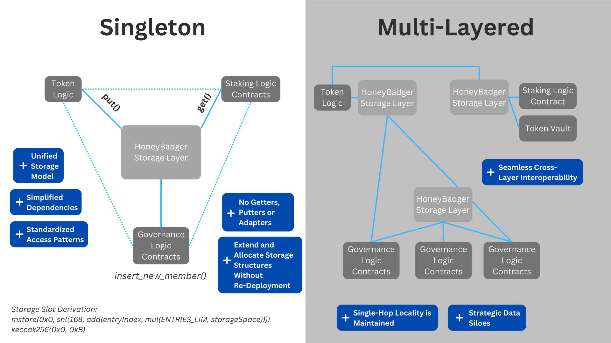

## Abstract  

Consolidated Dynamic Storage (CDS) is a standalone contract primitive for safer, more powerful, and developer-friendly storage management. It enables schema-safe, in-place upgrades of structured storage without slot collisions, redeployments, or ABI mismatches.

CDS organizes data into permissioned storage spaces composed of dynamically extendible structs. Contracts can introduce new storage spaces and define, access, and evolve structured entries over time: all without breaking compatibility or introducing manual slot management. Internally, deterministic hashing ensures safe access to both fixed and dynamic fields across storage regions.

By standardizing access patterns and embedding role-based permissions, CDS simplifies upgrade paths, improves auditability, and enables long-lived systems to scale safely. It is particularly well-suited for DAOs, modular protocols, and governance-driven applications.



## Motivation  
Established patterns succeed in enabling post-deployment upgradeability.  However, the growing complexity of modern projects, coupled with cross-organizational coordination challenges, beckon for a safer and more complete solution designed to support advanced upgradeability without requiring risky low-level storage changes.  CDS prioritizes safety, ease-of-use, and freedom above the complexity of its own implementation, enabling unfettered in-place vertical and horizontal upgradeability.  It's built around the question: what would be the ideal way to manage storage and upgradeability in production?

### Storage Abstraction: Why?
In CDS, storage abstraction means eliminating the need for manual storage management. Developers don’t calculate slot offsets, pack structs by hand, or plan upgrade-safe layouts—instead, they interact with structured storage through simple function calls. Schema evolution and access patterns are managed internally and consistently, eliminating the need for low-level storage management.

Even considering best practices, evolving contract storage is tedious and error-prone. Developers must manage reserved fields, coordinate upgrades, and reason carefully about layout across contracts. These problems become particularly acute in modular or cross-organizational systems, where safety depends on tight coordination and consistency.

CDS resolves this by introducing function-level access to structured, extendible storage spaces, backed by deterministic hashing and internal metadata tracking. Developers can add fields, insert data, or evolve schemas without risking collisions or breaking compatibility.

This abstraction also enables consolidation: rather than spreading state across isolated contracts or redeploying logic to extend storage, CDS allows protocols to define shared, upgrade-safe storage layers. This improves auditability, reduces overhead, and makes upgrades easier to reason about across teams, modules, and governance environments.

### Understanding the Meaning of "Holistic Storage Management"
The contemporary Ethereum development landscape has reached an interesting place: many core problems and pain points have been identified and resolved by patterns defined in individual ERC proposals, where most proposals address a specific problem and leave it to developers to integrate and maintain them in production.  However, implementing, cohesively coordinating, and effectively leveraging several distinct patterns can be burdensome, especially as protocols evolve.  

Some proposals address niche, application-specific issues: most protocols don't have any use for them, but they have a significant impact when they are relevant.  However, others follow a different paradigm, providing solid approaches to issues with high prevalence, where the only real downside is only the effort to implement and coordinate the solution. More clearly, almost *any* protocol would likely benefit from leveraging the pattern, because it addresses a fundamental inefficiency.  Following this thread, the fact that every large project isn't using patterns such as the [Dependency Registry](./erc-6224.md) highlights the problem addressed by taking broader strokes: awareness of each pattern isn't universal, and it *does* take effort to understand and cohesively coordinate disparate solutions in production.  

This context helps clarify the unique role CDS plays in the broader standards landscape. Unlike a lightweight design pattern or a reusable snippet, a CDS layer is a fully deployable, standalone contract that offers a standardized interface for structured storage. Developers don't need to tinker with slot math or create custom getter/setter layers—once deployed, a CDS instance provides a stable, extendable foundation for storing and retrieving structured data.

In doing so, CDS consolidates proven best practices from a wide range of proposals into a unified, composable primitive. Today, many storage and upgradeability issues are addressed by isolated patterns that require custom integration. As a result, even experienced developers face avoidable risks—struct upgrades that change function selectors, ABI decoding mismatches, and subtle inconsistencies across contract boundaries.

By externalizing structured storage into a dedicated, permissioned layer, CDS reduces this complexity and eliminates the most fragile parts of upgradeable system design. Holistic storage management isn't just a design ideal—it’s a necessary evolution for protocols that aim to scale safely, interoperate seamlessly, and remain adaptable without incurring long-term technical debt.

### Why Standardize CDS With an ERC Proposal?
CDS introduces a foundational storage primitive: a deployable contract that provides structured, upgrade-safe storage with consistent access patterns. It offers a modular alternative to inline Solidity mappings and structs, while eliminating the need for manual slot management or custom getter/setter logic.

Because CDS is intended to be used across contracts and organizations, standardization is essential. In many cases, one protocol may grant another permission to write to a specific storage field within a shared CDS layer. If the underlying implementation diverges—using different hashing rules or layout logic—these integrations become fragile or unsafe, potentially leading to silent data corruption.

An ERC standard ensures that CDS layers remain interoperable, verifiable, and consistent across deployments. With a shared interface and behavior, developers can safely compose contracts across organizational boundaries, rely on predictable storage behavior, and coordinate upgrades without introducing technical debt.

### Harmonizing Upgradeability, Control, and Decentralization
While storage abstraction is the primary narrative around CDS, it was originally conceived as a way to reconcile upgradeability with concrete decentralization.

Our answer lies in governance-aware upgrade paths. CDS mandates a built-in RBAC (Role-Based Access Control) system, enabling fine-grained control over who can mutate storage structures, insert data, or modify permissions. This ensures that upgradeability doesn’t require centralized trust. Instead, authority can be fully delegated to a DAO or on-chain governance layer, maintaining decentralization while preserving advanced adaptability.

In most systems today, developers are forced to choose between safety and flexibility—often omitting upgrade paths altogether due to the risk of misuse. CDS eliminates this tradeoff by embedding safe, enforceable, and revocable upgrade permissions directly into the storage layer.

In practice, this means a protocol can remain static while retaining the option for evolution, gated behind provable governance. As a result, CDS supports teams that prioritize immutability and those who need adaptability—without forcing either to adopt sub-optimal compromises.

### Why This Matters: Real-World Problems CDS Solves
**Fractured Cross-Contract Links**  
Adding new fields to existing struct types can cause a variety of complications in the domain of cross-contract interoperability.  

- *Function Selector Changes*  
If a function takes a struct as a parameter, changes to the struct layout will change its function selector. External calls to the now-deprecated selector will route to the fallback function (or simply fail) until those contracts are re-deployed. Coordinating re-deployments for all dependent contracts can be challenging, especially in cross-organizational settings.

- *Broken Return Data Encoding*  
If a function returns a struct—even if it’s not passed as an argument—changes to its structure invalidate the expected return data encoding. Any function expecting the old layout will receive extra bytes, causing the ABI decoder to revert the transaction.

- *Calldata Decoding Failures*  
Struct modifications also affect how externally supplied calldata is parsed. Functions that rely on ABI encoding to decode struct parameters will break if the expected data structure changes, leading to silent failures or unexpected execution paths. This is particularly problematic for modular contract ecosystems, where various contracts interact via cross-contract calls and must interpret the same struct definitions consistently.

**Compulsory Redeployments**  
Updating storage structures typically requires contract redeployments—even in Proxy-Delegate architectures. While storage can sometimes be extended without changing bytecode, functional updates (e.g., new getters or logic) nearly always require redeployment.

This imposes direct costs in both gas and operational complexity. Additionally, modifying existing contract logic can raise security concerns among users who rely on the protocol’s integrity. For protocols governed by decentralized mechanisms, complexities—including coordinating upgrades across disparate governance layers—can introduce further friction, making even minor storage modifications a potentially time-consuming and costly process.

**Lack of Standardization in Access Routines**  
Storage lacks a universal querying system, and contracts frequently rely on fragile workarounds such as:  

- **Hard-coded storage slot references** – Introduce fragility when upgrades modify slot positions.  
- **Mirrored state variables** – Duplicate data inefficiently and increase gas costs.  
- **Custom getter/setter functions** – Raise deployment costs and require integrators to implement protocol-specific logic.  
- **Unstable access patterns** – Integrations may break when underlying storage structures are updated, requiring maintenance across versions.

**Manual Storage Management**  
Storage updates are inherently high-risk due to Solidity’s strict alignment rules. Even when following best practices, upgradeable storage requires precise layout management. Misaligned struct modifications or incorrect slot allocations can cause irrecoverable state corruption. Proxy-Delegate and Diamond models require explicit tracking of layout, and any miscalculation in slot offsets or initializations can lead to irreversible state overwrites.  

**Siloed Storage**   
On-chain storage is often tied to individual contracts rather than a unified data management layer. This leads to complex linked structures and multi-hop access patterns, where operations require data aggregated from multiple external dependencies. This added indirection increases complexity and computational overhead—costs that can be avoided by leveraging dedicated storage layers with cross-contract scope, as is often seen in the Diamond pattern.

**Long-Term Technical Debt and Maintainability**  
Long-term technical debt compounds as protocols grow. Adapters, multi-hop access, and complex interdependencies increase upgrade complexity, audit cost, and the likelihood of production bugs. CDS minimizes these vectors by consolidating state and reducing unnecessary logic layers.

## Specification 


The keywords “MUST”, “MUST NOT”, “REQUIRED”, “SHALL”, “SHALL NOT”, “SHOULD”, “SHOULD NOT”, “RECOMMENDED”, “MAY” and “OPTIONAL” in this document are to be interpreted as described in RFC 2119.

### Extendable Structs and Storage Spaces
- Extendable structs **MUST** leverage dynamic mappings with deterministic field hashes (`keccak256`).  
- The base struct and its additions **MUST** remain immutable, while fields **MUST** be dynamically appendable.
- Storage spaces **MUST** equate to a simple extension of the hashing structure, segmenting both struct-defining and active data.

Each struct member **MUST** be defined using the following compact metadata structures:

| **Field**  | **Bits** | **Description**                          |
| ---------- | -------- | ---------------------------------------- |
| `bitCount` | 128      | Starting bit offset for the member.      |
| `size`     | 64       | Size of the member in bits.              |
| `type`     | 64       | Type ID (e.g., `uint256`, `bool`, etc.). |

### Type IDs

| **Type**                   | **ID** | **Size**     |
| -------------------------- | ------ | ------------ |
| `uint`                     | 1      | 8...256 bits |
| `int`                      | 2      | 8...256 bits |
| `bool`                     | 3      | 8 bits       |
| `address`                  | 4      | 160 bits     |
| `bytes32 (optional)`       | 5      | 256 bits     |
| `string (≡ bytes)`         | 6      | Dynamic      |

*For arrays, developers **MAY** define unpacking logic to treat `string` or `bytes` fields as indexed collections of dynamic elements.*

### Hash Structure
There are three main segments that **MUST** include separate hashing structures to resolve any potential for collisions, meta-segmented by their particular storage spaces.  These are: storage space state data and member-specific data, storage space live data, and storage space dynamic data. 

There are two special values that **MUST** be included: a `safeIndex` and a `stringIndex`.  Both are expounded upon in detail below.

Developers **SHOULD** include a unique hash offset for each space, as this simplifies the development and audit process considerably, and thereby greatly reduces the risk of improper implementation.

A `storageSpace` `offset` value **MUST** be included.  This is explicitly marked in the below section for clarity.  

*MEMBERS_LIM* refers to the total max quantity of struct members permitted within a single extendible struct.  
*ENTRIES_LIM* refers to the max amount of entries in a storage space, and serves as the upper limit for *push* and *pushMany*.  

`A`, `B`, `C` hash offset structure not only allows CDS to functionally guarantee safety from collisions, but also aid in debugging by 
allowing maintainers to instantly track the high-level objective of complex storage operations.

**Metadata Root:**  
`offset := shl(176, mul(storageSpaces, MEMBERS_LIM))`  
`mstore(0x0, offset)`  
`ROOT_SLOT := keccak256(0x0, 0xA)`  

**Storage Space State Data:**  
`sload(ROOT_SLOT)` → {`members(64), entries(64), stringIndex(64), safeIndex (64)`}  

**Storage Space Member-Specific Data:**  
`sload(add(ROOT_SLOT, add(1, memberIndex)))` → {`bitCount(128), size(64), type(64)`}   
*String*: `sload(add(ROOT_SLOT, add(1, memberIndex)))` → {`stringIndex(128), type(128)`}  


**Live Data:**  
`mstore(0x0, shl(168, add(entryIndex, mul(ENTRIES_LIM, storageSpace))))`  
`INDEXED_DATA_ROOT_IN_STORAGE_SPACE = keccak256(0x0, 0xB)` → {`packed slot`}    
Use `bitCount` and size (in member-specific data) to derive the location of a  
desired struct member in an indexed storage space.  


**Storage Space Dynamic Data:**  
`[strindex (32)][entryIndex (32)][storageSpace (32)]`  
```solidity
        mstore(
            0x0,
            or(
                or(shl(224, entryStrindex), shl(192, entryIndex)),
                shl(160, and(storageSpace, 0xFFFFFFFF))
            )
        )
        ENTRY_SLOT := keccak256(0x0, 0xC)
```

**Storage Space Dynamic Data Length:**  

```solidity
	root := sload(ENTRY_SLOT)
	len := shr(224, sload(ENTRY_SLOT))
```  
The length of strings (which functionally double as arrays) is stored in the root slot, with data stored afterwards.  We use this layout because it simplifies storage operations and conversion to the native string type.


**entryIndex, memberIndex**:  
*entryIndex* **MUST** refer to a mapped index.  Note that CDS operates with sequential indexing: 0, 1, 2, 3, etc.  
*memberIndex* **MUST** refer to a particular struct member.  

**High-level Solidity equivalent (memberIndex, entryIndex):**

```solidity
	struct Dog
	{
		string furColor;    //memberIndex 0
		string eyeColor;    //memberIndex 1
		uint128 toothCount; //memberIndex 2
		uint128 legsCount;  //memberIndex 3
	}

	mapping(uint256 => Dog) dogs;
	dogs[6 /*entryIndex*/].furColor /*memberIndex 0*/ = 'brown';
```

For example, a *put* invocation **MUST** look like: *put(data, memberIndex, entryIndex, storageSpace)*. 

*stringIndex, safeIndex*:
String index **MUST** be utilized to separate strings in the contract storage space.  Given that strings MUST have a dynamic size, they do not use `bitCount`.  Hence, we MUST fill their `bitCount` with `stringIndex` instead in member data.

However, this raises a problem when implementing extendable structs: *if the last member is a string, we might reference back to its `memberIndex`, tricking the system into believing the `stringIndex` is a `bitCount`.* Hence, we **MUST** leverage `safeIndex`, which records the most recent valid `memberIndex` we can use to derive `bitCount`.  Critically, if `safeIndex` is zero, we are still safe from complications, because a zero `strindex` doubles as a valid `bitCount` in that instance: there are zero preceding bits.

Example Implementation:
```solidity
function insert_new_member(
	uint256 valType,
	uint256 valSize,
	uint256 storageSpace
) external
{
	verify type and size
	retrieve memberData
	
	if(type not string)
	{
		get safeIndex
		assign bitCount := prev bitCount + sizeof previous
		verify size
		get storage page
		verify we will not overflow
		if overflow, push to next page (update bitCount to head of next page)
		pack memberData
		store memberData
		update safeIndex, members in state data for storage space
	}
	if(type is string)
	{
		get stringIndex
		pack with type
		store packed metadata in memberData
		increment stringIndex, members
		store updated state data for storage space
	}

}
```

**Permission Management:**  
Developers **MUST** include a permission management scheme for their CDS model.  They **MAY** utilize the following basic structure:  

| **Scope**                  | **Level** | **Significance**               |
| -------------------------- | ------    | ------------------------------ |
| `User`                     | 1         | Permission Management          |
| `User`                     | 2         | Modify Data                    |
| `User`                     | 3         | Modify Storage Structures      |
| `Contract`                 | 4         | Permission Management          |
| `Contract`                 | 5         | Modify Data                    |
| `Contract`                 | 6         | Modify Storage Structures      |
| `Universal`                | 7         | Full Access                    |


### Interfaces
```solidity
    function init_create(
    uint256[] memory types, 
    uint256[] memory sizes
) external;

    function insert_new_member(
    uint256 valType, 
    uint256 size, 
    uint256 storageSpace
) external;

function push(
	uint256 storageSpace
) external;

function pushMany(
    uint256 amount, 
    uint256 storageSpace
) external;

function put(
    uint256 data, 
    uint256 memberIndex, 
    uint256 entryIndex, 
    uint256 storageSpace
) external;

function put_string(
	string memory data, 
	uint256 memberIndex, 
	uint256 entryIndex, 
	uint256 storageSpace
) external;

function get(
    uint256 memberIndex, 
    uint256 entryIndex, 
    uint256 storageSpace
) external view returns(uint256);

function get_string(
    uint256 memberIndex, 
    uint256 entryIndex, 
    uint256 storageSpace
) external view returns(string memory returnValue);

function set_permissions(
	uint256 level,
	address recipient
) external;

function get_storage_space_state_data(
    uint256 storageSpace
) external view returns(
	uint256 members, 
	uint256 entries,
	uint256 stringIndex,
	uint256 safeIndex
);

function total_members(
    uint256 storageSpace
) external view returns(uint256);

/**
* For string, bitCount->stringIndex, size param is extraneous.
*/
function get_member_data(
	uint256 memberIndex,
	uint256 storageSpace
) external view returns(
	uint256 bitCount, 
	uint256 valSize,
	uint256 valType, 
);

function get_permission_level(
	address target
) external view returns(uint256);

```

### Optional Interface Members
```solidity 
function put_batch(
   uint256[] memory values, 
   uint256[] memory members, 
   uint256 entryIndex, 
   uint256 storageSpace
) external;

function get_batch(
    uint256[] memory members, 
    uint256 entryIndex, 
    uint256 storageSpace
) external view returns(uint256[] memory result);

function get_index_from_address(
	address indexAddress,
	uint256 memberIndex,
	uint256 storageSpace
) external view returns(uint256 entryIndex);

function map_address_to_index(
	address indexAddress,
	uint256 storageSpace,
	uint256 targetIndex
) internal;

function put_with_address(
	address indexAddress,
	uint256 storageSpace,
) external;

function _get_root_slot(
	uint256 storageSpace
) internal view returns(uint256);

```
### Initialization


  
The `init_create` function **MUST** handle storage space creation in both an initialization and live extension setting.  The function **MUST** take an array of types and sizes as input, which **MUST** conform to the above specifications, and be equivalent in length when input.  Developers **MUST** include length equivalency validation for `types` and `sizes`.

```solidity
function init_create(
	uint256[] memory types,
	uint256[] memory sizes
)
{
	/*
		Recommended:
		storageSpaces += 1;
		ROOT_SLOT = _get_root_slot(storageSpaces - 1);
	*/
	for(i in range sizes)
	{
		if(types[i] in [1..5])
		{
			validate size given type
			calculate bitCount for new entry
			pack {bitCount, types, sizes}
			store the packed value in the member data of the storage space
			bitCount := bitCount + size
			increase safeIndex
		}
		if(types[i] is 6)
		{
			create packed value {stringIndex, 6}
			store the packed value in the member data of the storage space
			increment stringIndex
		}
	}
	pack storage space data: {members, entries, stringIndex, safeIndex}
	store storage space data
	storageSpaces += 1
}
```

## Rationale  
Proxy-Delegate and Diamond Storage architectures have long been the industry standard for upgradeable smart contracts, providing critical mechanisms for separating logic from state. These approaches have enabled modular contract upgrades, mitigated contract size limitations, and allowed systems to evolve over time. However, as protocols scale, new challenges emerge—managing storage across multiple contracts, coordinating upgrades, and ensuring compatibility without introducing technical debt or unnecessary redeployments.

CDS builds upon these established patterns by introducing a dedicated, structured storage layer that eliminates many of the complexities inherent in Proxy-Delegate and Diamond architectures. In traditional models, storage modifications require careful slot management, pre-planning reserved fields, or governance-heavy migrations to maintain compatibility. These constraints impose operational overhead and increase the risk of misalignment between logic and storage. CDS removes these limitations by enabling in-place schema evolution, ensuring that storage structures expand deterministically without slot corruption, ABI misalignment, or redundant redeployments.

One of the key improvements CDS introduces is standardized storage access across contracts. Whereas Proxy-Delegate and Diamond models require each contract to define its own storage mappings, CDS provides a shared, structured interface that multiple contracts can access consistently. This reduces cross-contract storage fragmentation, simplifies state synchronization, and eliminates the inefficiencies of multi-hop storage dependencies and redundant mappings.

Furthermore, CDS is designed with long-term system maintainability in mind. As protocols expand, managing state across interdependent contracts becomes increasingly complex. CDS mitigates these risks by externalizing structured storage into a permissioned, extendable layer, ensuring that high-throughput contract interactions remain efficient even as ecosystems grow in scale and complexity.

Proxy-Delegate and Diamond architectures remain valuable for many upgradeable contract designs, offering modularity and logic flexibility. However, for protocols requiring sustainable long-term upgradeability, efficient cross-contract storage, and deterministic schema evolution, CDS provides a more scalable and future-proof alternative. By eliminating migration risks and reducing upgrade complexity, CDS ensures storage integrity, seamless interoperability, and efficient state management—empowering developers to focus on core logic rather than maintenance overhead.

## Backwards Compatibility  

This ERC introduces a new design pattern and does not interfere with existing Solidity implementations. CDS *does* *not* implicitly interfere with common libraries such as those provided by OpenZeppelin, but is not supported explicitly. Library-imposed global data within CDS-linked contracts can be a burden if it is not refactored to link to your CDS layer.

## **Test Cases**

### **1. Core Functionality**

- **Initialization**
    - Input: `types = [1, 3, 6], sizes = [32, 8, 128]`.
    	- Expected: Storage space initialized with 3 members.
- **Insert New Members**
    - Input: `insert_new_member(1, 128, storageSpace = 0)`.
    	- Expected: New `uint128` member added with correct `bitCount`.
- **Data Storage and Retrieval**
    - Input: `put(42, memberIndex = 0, entryIndex = 0, storageSpace = 0)` → `get(0, 0, 0)`.
    	- Expected: `42`.

### **2. Edge Cases**

- **String Handling**
    - Input: Insert five strings consecutively.
    	- Expected: No collisions; strings retrieved accurately.
    
    - Input: insert two dynamic strings, then one uint256
		- Expected: uint256 is properly configured with:
				`bitCount == 0` 
			because: 
				`safeIndex == 0` maps to the dynamic string with index `0`.  This zero value fills both decoded `{type, size}` slots in the standard type construction logic.  Hence, we begin with a valid `bitCount` of `0`.
		    
- **Entry Creation**
    - Input: Add `10,000` entries to a storage space with `pushMany`.
    	- Expected: System can store to any of these entry indices.
    
- **Invalid Input**
    - Input: `put(42, memberIndex = 1, storageSpace = 0)`.
    	- Expected: Reverts with error.
    
	* Input: `put("42", memberIndex = 1, entryIndex = 0, storageSpace = 0)`.
    	- Expected: Reverts with error.
    
	- Input: `put_string(42, memberIndex = 1, entryIndex = 0, storageSpace = 0)`.
    	- Expected: Reverts with error.

### Gas Benchmarks

* This section assumes that storage operations interact with pre-populated slots.  
* These values are derived from the optimized HoneyBadger model and serve as good targets for efficiency.  
* Displayed values reference *execution* cost.  

	`init_create([1], [256]):` 93,860 gas  
	`init_create([1,1,1], [8,256,256]):` 140,024 gas  
	`insert_new_member:` 40,653 gas  
	`push:` 10,316 gas  
	`put:` 15,543 gas  
	`put_batch([20, 20], [0, 1], 0, 0):` 22,895 gas  
	`get`: 9374 gas  

## Reference Implementation

Refer to [CDS Minimal Example](../assets/erc-7844/CDSMinimal.sol)

### Notable Downsides and Mitigating Solutions

While CDS represents a definite step of progress towards efficient, unfettered scalability, 
it does bring about challenges beyond the relative difficulty of implementing a working model.

### Address Indexing
**Impact:** The standard CDS model is locked to uint indexing, which is restrictive for numerous usecases.

**Solution:** The core model does not natively support address indexing (i.e.; *mapping(address => uint256)*), as this inclusion would excessively bloat implementation overhead if included in the baseline model. 

However, CDS can be implemented with a *mapping(uint256 => mapping(address => uint256))*, 
-- representing storageSpace -> address index -> entryIndex -- and an additional mapping 
from *uint256* to *bool* that flags storage spaces as address-indexed.  Contract calls to 
address-indexed storage spaces should first resolve the entryIndex by invoking *get_index_from_address* before interacting with the system as normal.  

To ensure that address-indexed storage spaces are properly populated with addresses, 
it is recommended to leverage the *put_with_address* function when populating 
the storage space. 

While this approach is cumbersome, it effectively introduces address indexing without 
requiring significant additional effort.  

To support other non-uint-indexing capabilities, it is recommended to leverage the same pattern as is used for address indexing. 

### Rigidity of CDS Itself
**Impact:** Standard CDS models are unable to accommodate logical extensions, which can restrict autonomy in a production setting.

**Solution:** As the above example demonstrates, there are cases where extending the baseline CDS implementation is desirable.  Accomplishing this simply requires leveraging the proxy-delegate model for your CDS implementation.

### Non-Descriptive Syntax
**Impact:** One of the most common complaints about CDS is that it effectively masks operations behind a non-descriptive syntax (i.e.; *put(1200, 0, 0, 2)).*  

**Solution:** The best way to mitigate this issue is to pair the non-descriptive syntax with descriptive comments and liberal use of Enums.  

By defining an Enum to name the members of an extendible struct, and another to encode storage spaces, we can significantly enhance the readability of our CDS syntax with little effort.

**Without Enums:** *put(123, 0,0, 1);*  
**With Enums:** *put(123, Globals.TotalBottles, 0, StorageSpaces.Globals);*  


### Storage Space Permanence
**Impact:** Mistakes in defining storage space members are permanent.

**Solution:** While this seems like a significant problem at face-value, it is actually relatively benign because *CDS is leveraged by linked contracts, not users.*  Hence, mistaken struct members can simply be denoted as "inert" within the master docstring and removed from linked contracts.  

## Security Considerations

While a CDS implementation imposes considerable overhead in terms of up-front effort, comprehensively addressing security risks is relatively straightforward.

### Hash Structure and Masking 
Validate your hash structure and masks stringently.  It is recommended to manually verify each operation at least once, using an external document to track verified operations.  Fuzzing key operations is also highly-advised.  While the widespread utilization of complex assembly operations seems daunting, this process is more tedious than it is complicated.  The key is to be diligent - it will either work, or it won't.  If it doesn't work, unit tests and fuzzing will demonstrate that.  While the system is complex under the hood, errors are easy to identify in practice, and they generally arise from improper assembly-level operations.

### Access Control 
It is highly recommended to fully lock the system with a permission management scheme.  The most basic example would be to use a `mapping(address => boolean) hasPerms` with a related modifier.  Users who lack authorization should never have direct access to the system, including view functions.  In the case of views, we prevent access because there is no need for non-users to have insight into your storage space scheme.  It is recommended to use an abstraction layer via an additional contract to ensure that this information is abstracted away, and that users can't pry into data they shouldn't have access to.

### Types and Sizes 
Types and sizes also represent an important vulnerability point.  It is crucial to verify that types are within bounds, and to thoroughly verify that entries conform to expected size(s).  It is best practice to revert when encountering an incorrect size (i.e.; boolean, size 16) rather than correcting it in-place.

## Copyright

Copyright and related rights waived via [CC0](../LICENSE.md).
