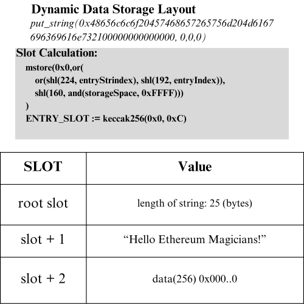

## Abstract  

Consolidated Dynamic Storage (CDS) is a standalone contract primitive for safer, more powerful, and developer-friendly storage management and live schema evolution. It enables schema-safe, in-place upgrades of structured storage without slot collisions, redeployments, or ABI mismatches.

CDS organizes data into permissioned storage spaces composed of dynamically extendible structs. Contracts can introduce new storage spaces and define, access, and evolve structured entries over time: all without breaking compatibility or introducing manual slot management. Internally, deterministic hashing ensures safe access to both fixed and dynamic fields across storage regions.

By standardizing access patterns and embedding role-based permissions, CDS simplifies upgrade paths, improves auditability, and enables long-lived systems to scale safely. The ability to extend mapped structs and even create new storage spaces in-place removes the potential for errors tied to manual storage management and reduces friction by removing the need for storage-centric redeployments.  It is particularly well-suited for DAOs, modular protocols, and governance-driven applications.


## Motivation  
Established patterns succeed in enabling post-deployment upgradeability.  However, the growing complexity of modern projects, coupled with cross-organizational coordination challenges, beckon for a safer and more complete solution designed to support advanced upgradeability without requiring risky low-level storage changes.  CDS prioritizes consistency, ease-of-use, and developer freedom above the complexity of its own implementation, enabling unfettered in-place vertical and horizontal upgradeability.  It's built around the question: what would be the ideal way to manage storage and upgradeability in production?

### Why This Matters: Real-World Problems CDS Solves

- **ABI-Coupled Layouts Break Compatibility Silently**  
  Struct layout is tightly coupled to ABI encoding. Changing a struct — even by adding a field — can alter function selectors (if passed as a parameter), break ABI decoders (if returned), or misinterpret calldata (if supplied externally). These issues are silent, rarely caught by the compiler, and typically demand cascading redeployments, which can be especially problematic in cross-organizational settings, where close collaboration can be more difficult.

- **Manual Layout Management Risks Irreversible State Corruption**  
  Developers must manage slot offsets, storage gaps, and inheritance alignment by hand. A single miscalculation can overwrite live state permanently. Contemporary patterns defer layout responsibility to the developer, while the CDS protocol removes it entirely by automating and abstracting layout resolution.

- **Schema Evolution Often Requires Redeployment**  
  In traditional systems, adding fields or exposing new accessors often requires redeploying contracts — even with proxy infrastructure — to avoid layout conflicts or ABI mismatches. This slows iteration, increases governance complexity, and often undermines user trust. CDS allows in-place schema evolution without breaking compatibility.

- **Lack of Standards for Shared Cross-Contract Storage**  
  There is no reliable way for contracts maintained by different teams (or DAOs) to coordinate on shared structured storage. Teams must duplicate layouts, hardcode slot references, or expose custom getter/setter logic. CDS introduces a deterministic, standardized schema layer that any contract can safely read or write to.

- **Fragmented Permissioning Increases Audit Complexity**  
  Upgradeability today relies on scattered access control logic — sometimes in proxies, sometimes in logic contracts, sometimes undocumented. CDS embeds permission boundaries directly at the storage layer, enabling fine-grained, verifiable, and governance-compatible control over schema evolution and field-level access.

> CDS eliminates these issues by externalizing storage into a shared, deterministic layer — enabling safe, in-place schema evolution across contracts, modules, and governance boundaries without slot math, ABI rewrites, or contract redeployments.

### Why Standardize CDS With an ERC Proposal?

CDS introduces a new type of shared infrastructure: a deployable contract that provides structured, upgrade-safe storage across contracts, modules, and organizational boundaries. Its value comes not just from functionality, but from consistency — and that consistency can only be guaranteed through standardization.

In typical smart contract systems, storage is internal: isolated per contract and defined at compile time. But CDS flips this model by externalizing storage into a shared layer. That means different contracts — possibly owned by different teams or governed by separate DAOs — may all write to the same storage space, referencing the same schema by index.

This only works if every participant resolves field layouts, hashing logic, and permissions in the exact same way.

Without standardization, one implementation of CDS may encode metadata differently, hash fields with different offsets, or manage permissions with slightly altered rules. These divergences don’t fail loudly — they fail *silently*, corrupting state, creating invisible breakages, and undermining the very cross-contract composability CDS is meant to enable.

Standardization ensures that:

- All CDS-compatible contracts follow the same deterministic storage layout resolution  
- Metadata, permission logic, and field interfaces are uniform and verifiable  
- Systems can safely rely on shared storage across modules, versions, or even external protocols without runtime coordination  

In short, the point of CDS is to **remove the need for internal slot management** and **make storage infrastructure composable**. But composability only works when everyone plays by the same rules — and an ERC is how those rules are defined, enforced, and trusted.

### Harmonizing Upgradeability, Control, and Decentralization
While storage abstraction is the primary narrative around CDS, it was originally conceived as a way to reconcile upgradeability with concrete decentralization.

Our answer lies in governance-aware upgrade paths. CDS mandates a built-in role-based access controls (RBAC) system, enabling fine-grained configurability dictating who can mutate storage structures, insert data, or modify permissions. This ensures that upgradeability doesn’t require centralized trust. Instead, authority can be fully delegated to a DAO or on-chain governance layer, maintaining decentralization while preserving advanced adaptability.

In most systems today, developers are forced to choose between safety and flexibility—often omitting upgrade paths altogether due to the risk of misuse. CDS eliminates this tradeoff by embedding safe, enforceable, and revocable upgrade permissions directly into the storage layer.

In practice, this means a protocol can remain static while retaining the option for evolution, gated behind provable governance. As a result, CDS supports teams that prioritize immutability and those who need adaptability—without forcing either to adopt sub-optimal compromises.

## Specification 


The keywords “MUST”, “MUST NOT”, “REQUIRED”, “SHALL”, “SHALL NOT”, “SHOULD”, “SHOULD NOT”, “RECOMMENDED”, “MAY” and “OPTIONAL” in this document are to be interpreted as described in RFC 2119.

### Extendable Structs and Storage Spaces
- Extendable structs **MUST** leverage dynamic mappings with deterministic field hashes (`keccak256`).  
- The base struct and its additions **MUST** remain immutable, while fields **MUST** be dynamically appendable.
- Storage spaces **MUST** equate to a simple extension of the hashing structure, segmenting both struct-defining and active data.

Each struct member **MUST** be defined using the following compact metadata structures:

| **Field**  | **Bits** | **Description**                          |
| ---------- | -------- | ---------------------------------------- |
| `bitCount` | 128      | Starting bit offset for the member.      |
| `size`     | 64       | Size of the member in bits.              |
| `type`     | 64       | Type ID (e.g., `uint256`, `bool`, etc.). |

### Type IDs

| **Type**                   | **ID** | **Size**     |
| -------------------------- | ------ | ------------ |
| `uint`                     | 1      | 8...256 bits |
| `int`                      | 2      | 8...256 bits |
| `bool`                     | 3      | 8 bits       |
| `address`                  | 4      | 160 bits     |
| `bytes32 (optional)`       | 5      | 256 bits     |
| `string (≡ bytes)`         | 6      | Dynamic      |

*For arrays, developers **MAY** define unpacking logic to treat `string` or `bytes` fields as indexed collections of dynamic elements.*

### Hash Structure
There are three main segments that **MUST** include separate hashing structures to resolve any potential for collisions, meta-segmented by their particular storage spaces.  These are: storage space state data and member-specific data, storage space live data, and storage space dynamic data. 

There are two special values that **MUST** be included: a `safeIndex` and a `stringIndex`.  Both are expounded upon in detail below.

Developers **SHOULD** include a unique hash offset for each space, as this simplifies the development and audit process considerably, and thereby greatly reduces the risk of improper implementation.

A `storageSpace` `offset` value **MUST** be included.  This is explicitly marked in the below section for clarity.  

*MEMBERS_LIM* refers to the total max quantity of struct members permitted within a single extendible struct.  
*ENTRIES_LIM* refers to the max amount of entries in a storage space, and serves as the upper limit for *push* and *pushMany*.  

`A`, `B`, `C` hash offset structure not only allows CDS to functionally guarantee safety from collisions, but also aid in debugging by 
allowing maintainers to instantly track the high-level objective of complex storage operations.

**Metadata Root:**  
`offset := shl(176, mul(storageSpaces, MEMBERS_LIM))`  
`mstore(0x0, offset)`  
`ROOT_SLOT := keccak256(0x0, 0xA)`  

**Storage Space State Data:**  
`sload(ROOT_SLOT)` → {`members(64), entries(64), stringIndex(64), safeIndex (64)`}  

**Storage Space Member-Specific Data:**  
`sload(add(ROOT_SLOT, add(1, memberIndex)))` → {`bitCount(128), size(64), type(64)`}   
*String*: `sload(add(ROOT_SLOT, add(1, memberIndex)))` → {`stringIndex(128), type(128)`}  


**Live Data:**  
`mstore(0x0, shl(168, add(entryIndex, mul(ENTRIES_LIM, storageSpace))))`  
`INDEXED_DATA_ROOT_IN_STORAGE_SPACE = keccak256(0x0, 0xB)` → {`packed slot`}    
Use `bitCount` and size (in member-specific data) to derive the location of a  
desired struct member in an indexed storage space.  


**Storage Space Dynamic Data:**  
`[strindex (32)][entryIndex (32)][storageSpace (32)]`  
```solidity
        mstore(
            0x0,
            or(
                or(shl(224, entryStrindex), shl(192, entryIndex)),
                shl(160, and(storageSpace, 0xFFFFFFFF))
            )
        )
        ENTRY_SLOT := keccak256(0x0, 0xC)
```

**Storage Space Dynamic Data Length:**  

```solidity
	root := sload(ENTRY_SLOT)
	len := shr(224, sload(ENTRY_SLOT))
```  
The length of strings (which functionally double as arrays) is stored in the root slot, with data stored afterwards.  We use this layout because it simplifies storage operations and conversion to the native string type.


**entryIndex, memberIndex**:  
*entryIndex* **MUST** refer to a mapped index.  Note that CDS operates with sequential indexing: 0, 1, 2, 3, etc.  
*memberIndex* **MUST** refer to a particular struct member.  

**High-level Solidity equivalent (memberIndex, entryIndex):**

```solidity
	struct Dog
	{
		string furColor;    //memberIndex 0
		string eyeColor;    //memberIndex 1
		uint128 toothCount; //memberIndex 2
		uint128 legsCount;  //memberIndex 3
	}

	mapping(uint256 => Dog) dogs;
	dogs[6 /*entryIndex*/].furColor /*memberIndex 0*/ = 'brown';
```

For example, a *put* invocation **MUST** look like: *put(data, memberIndex, entryIndex, storageSpace)*. 

*stringIndex, safeIndex*:
String index **MUST** be utilized to separate strings in the contract storage space.  Given that strings MUST have a dynamic size, they do not use `bitCount`.  Hence, we MUST fill their `bitCount` with `stringIndex` instead in member data.

However, this raises a problem when implementing extendable structs: *if the last member is a string, we might reference back to its `memberIndex`, tricking the system into believing the `stringIndex` is a `bitCount`.* Hence, we **MUST** leverage `safeIndex`, which records the most recent valid `memberIndex` we can use to derive `bitCount`.  Critically, if `safeIndex` is zero, we are still safe from complications, because a zero `strindex` doubles as a valid `bitCount` in that instance: there are zero preceding bits.

High-Level Pseudocode Implementation:
```solidity
function insert_new_member(
	uint256 valType,
	uint256 valSize,
	uint256 storageSpace
) external
{
	verify type and size
	retrieve memberData
	
	if(type not string)
	{
		get safeIndex
		assign bitCount := prev bitCount + sizeof previous
		verify size
		get storage page
		verify we will not overflow
		if overflow, push to next page (update bitCount to head of next page)
		pack memberData
		store memberData
		update safeIndex, members in state data for storage space
	}
	if(type is string)
	{
		get stringIndex
		pack with type
		store packed metadata in memberData
		increment stringIndex, members
		store updated state data for storage space
	}

}
```

**Permission Management:**  
Developers **MUST** include a permission management scheme for their CDS model.  They **MUST** utilize the following basic structure:  

| **Scope**                  | **Level** | **Significance**               |
| -------------------------- | ------    | ------------------------------ |
| `User`                     | 1         | Permission Management          |
| `User`                     | 2         | Modify Data                    |
| `User`                     | 3         | Modify Storage Structures      |
| `Contract`                 | 4         | Permission Management          |
| `Contract`                 | 5         | Modify Data                    |
| `Contract`                 | 6         | Modify Storage Structures      |
| `Universal`                | 7         | Full Access                    |

Developers **MAY** introduce additional levels, particularly for view controls.  While eth.getStorageAt() effectively makes the entire storage space transparent, the hashing scheme ensures that unauthorized view breaches would at least require a non-negligible degree of effort. 

### Interfaces
```solidity

//Initialization and upkeep
function init_create(
    uint256[] memory types, 
    uint256[] memory sizes
) external;

function insert_new_member(
    uint256 valType, 
    uint256 size, 
    uint256 storageSpace
) external;

function push(
	uint256 storageSpace
) external;

function pushMany(
    uint256 amount, 
    uint256 storageSpace
) external;

//Modify data
function put(
    uint256 data, 
    uint256 memberIndex, 
    uint256 entryIndex, 
    uint256 storageSpace
) external;

function put_string(
	string memory data, 
	uint256 memberIndex, 
	uint256 entryIndex, 
	uint256 storageSpace
) external;

//Retrieve data
function get(
    uint256 memberIndex, 
    uint256 entryIndex, 
    uint256 storageSpace
) external view returns(uint256);

function get_string(
    uint256 memberIndex, 
    uint256 entryIndex, 
    uint256 storageSpace
) external view returns(string memory returnValue);

//Role-based access controls
function set_permissions(
	uint256 level,
	address recipient
) external;

function get_storage_space_state_data(
    uint256 storageSpace
) external view returns(
	uint256 members, 
	uint256 entries,
	uint256 stringIndex,
	uint256 safeIndex
);

//View metadata
function total_members(
    uint256 storageSpace
) external view returns(uint256);

/**
* For string, bitCount->stringIndex, size param is extraneous.
*/
function get_member_data(
	uint256 memberIndex,
	uint256 storageSpace
) external view returns(
	uint256 bitCount, 
	uint256 valSize,
	uint256 valType, 
);

function get_permission_level(
	address target
) external view returns(uint256);

```

### Optional Interface Members
```solidity 
function put_batch(
   uint256[] memory values, 
   uint256[] memory members, 
   uint256 entryIndex, 
   uint256 storageSpace
) external;

function get_batch(
    uint256[] memory members, 
    uint256 entryIndex, 
    uint256 storageSpace
) external view returns(uint256[] memory result);

function get_index_from_address(
	address indexAddress,
	uint256 memberIndex,
	uint256 storageSpace
) external view returns(uint256 entryIndex);

function map_address_to_index(
	address indexAddress,
	uint256 storageSpace,
	uint256 targetIndex
) internal;

function put_with_address(
	address indexAddress,
	uint256 storageSpace,
) external;

function _get_root_slot(
	uint256 storageSpace
) internal view returns(uint256);

```
### Initialization


  
The `init_create` function **MUST** handle storage space creation in both an initialization and live extension setting.  The function **MUST** take an array of types and sizes as input, which **MUST** conform to the above specifications, and be equivalent in length when input.  Developers **MUST** include length equivalency validation for `types` and `sizes`.

```solidity
function init_create(
	uint256[] memory types,
	uint256[] memory sizes
)
{
	/*
		Recommended:
		storageSpaces += 1;
		ROOT_SLOT = _get_root_slot(storageSpaces - 1);
	*/
	for(i in range sizes)
	{
		if(types[i] in [1..5])
		{
			validate size given type
			calculate bitCount for new entry
			pack {bitCount, types, sizes}
			store the packed value in the member data of the storage space
			bitCount := bitCount + size
			increase safeIndex
		}
		if(types[i] is 6)
		{
			create packed value {stringIndex, 6}
			store the packed value in the member data of the storage space
			increment stringIndex
		}
	}
	pack storage space data: {members, entries, stringIndex, safeIndex}
	store storage space data
	storageSpaces += 1
}
```

## Rationale  
CDS is structured around a foundational design decision: separating data from logic at the schema level, and doing so in a way that is modular, deterministic, permissioned, and upgrade-safe.

Rather than approaching upgradeability as an application-specific pattern (e.g., via Proxy-Delegate architectures), CDS treats storage management itself as a first-class concern. The rationale behind this is grounded in recurring problems observed in complex systems: cross-contract storage collisions, unsafe layout changes, siloed data models, and the lack of standardized schema evolution mechanisms.

To address these challenges, CDS makes the following architectural choices:

- **Dedicated Storage Layer**  
CDS externalizes structured storage into a standalone contract. This allows multiple logic contracts to read and write to a shared schema without risking layout collisions or requiring manual coordination. It also introduces a formal boundary between logic and data, improving composability and minimizing duplication.  
    >*Key Idea*: Storage should be modular in the same way contract logic is modular — not hardcoded into every contract.

- **Dynamic Struct Definitions**  
Rather than relying on static Solidity structs, CDS defines and extends storage layouts dynamically using metadata-backed field declarations. This allows for safe schema evolution without introducing layout corruption or requiring slot reservations.
    >*Key Idea*: Developers should be able to add a new field to a struct without risking the entire system.

- **Deterministic Hashing for Layout Resolution**  
All storage locations are derived from a combination of struct metadata and deterministic keccak256 hashing. This guarantees collision resistance, avoids fixed-slot fragility, and enables modularity at the field, struct, and storage-space level.
    >*Key Idea*: Systems with dynamic components must resolve storage deterministically to ensure long-term safety.

- **Embedded Role-Based Permissions**  
CDS includes a built-in RBAC system to control who can modify schemas, write data, or assign permissions. This allows protocols to delegate upgrade authority to DAOs, other contracts, or modules while preserving safety and auditability.
    >*Key Idea*: Upgradeability is only safe when access control is part of the storage layer — not bolted on later.

- **Bit-Level Metadata** 
Each field in a CDS struct includes metadata for its type, size, and position (bitCount). This enables compact packing, self-describing schemas, and efficient runtime decoding.
    >*Key Idea*: Smart contract data should be tightly packed, self-verifying, and queryable — like a typed struct in memory.

- **Storage Spaces as First-Class Units**
Instead of one global data region, CDS segments storage into isolated, appendable “storage spaces”, each with its own schema, entries, and permissions. This makes it possible to scale systems horizontally across teams, modules, or subsystems, without entangling storage responsibilities.
    >*Key Idea*: Shared infrastructure demands clean boundaries without introducing silos.

- **Function-Based Interface**
CDS operations are exposed through a clean interface (put, get, insert_new_member, etc.) rather than inline slot access or contract-specific storage declarations. This makes the system accessible across languages, tooling environments, and governance layers.
    >*Key Idea*: A standardized storage layer should feel like a protocol, not a pattern.

In short, CDS is designed not to patch around Solidity’s storage limitations, but to redefine how smart contracts manage state. Every aspect of its architecture — from hashing logic to permission tiers — reflects a deliberate attempt to make storage more modular, evolvable, and secure across long-lived systems.

## Backwards Compatibility  

This ERC introduces a new design pattern and does not interfere with existing Solidity implementations. CDS *does* *not* implicitly interfere with common libraries such as those provided by OpenZeppelin, but is not supported explicitly. Library-imposed global data within CDS-linked contracts can be a burden if it is not refactored to link to your CDS layer.

## **Test Cases**

### **1. Core Functionality**

- **Initialization**
    - Input: `types = [1, 3, 6], sizes = [32, 8, 128]`.
    	- Expected: Storage space initialized with 3 members.
- **Insert New Members**
    - Input: `insert_new_member(1, 128, storageSpace = 0)`.
    	- Expected: New `uint128` member added with correct `bitCount`.
- **Data Storage and Retrieval**
    - Input: `put(42, memberIndex = 0, entryIndex = 0, storageSpace = 0)` → `get(0, 0, 0)`.
    	- Expected: `42`.

### **2. Edge Cases**

- **String Handling**
    - Input: Insert five strings consecutively.
    	- Expected: No collisions; strings retrieved accurately.
    
    - Input: insert two dynamic strings, then one uint256
		- Expected: uint256 is properly configured with:
				`bitCount == 0` 
			because: 
				`safeIndex == 0` maps to the dynamic string with index `0`.  This zero value fills both decoded `{type, size}` slots in the standard type construction logic.  Hence, we begin with a valid `bitCount` of `0`.
		    
- **Entry Creation**
    - Input: Add `10,000` entries to a storage space with `pushMany`.
    	- Expected: System can store to any of these entry indices.
    
- **Invalid Input**
    - Input: `put(42, memberIndex = 1, storageSpace = 0)`.
    	- Expected: Reverts with error.
    
	* Input: `put("42", memberIndex = 1, entryIndex = 0, storageSpace = 0)`.
    	- Expected: Reverts with error.
    
	- Input: `put_string(42, memberIndex = 1, entryIndex = 0, storageSpace = 0)`.
    	- Expected: Reverts with error.

### Gas Benchmarks

* This section assumes that storage operations interact with pre-populated slots.  
* These values are derived from the optimized HoneyBadger model and serve as good targets for efficiency.  
* Displayed values reference *execution* cost.  

	`init_create([1], [256]):` 93,860 gas  
	`init_create([1,1,1], [8,256,256]):` 140,024 gas  
	`insert_new_member:` 40,653 gas  
	`push:` 10,316 gas  
	`put:` 15,543 gas  
	`put_batch([20, 20], [0, 1], 0, 0):` 22,895 gas  
	`get`: 9374 gas  

## Reference Implementation

Refer to [CDS Minimal Example](../assets/erc-7844/CDSMinimal.sol)
For a full, working implementation, reference [HoneyBadgerBaseV1](../assets/erc-7844/full_implementation/HoneyBadgerBaseV1.sol)
For a full, working interface, reference [IHoneyBadgerBaseV1](../assets/erc-7844/full_implementation/IHoneyBadgerBaseV1.sol)

### Notable Downsides and Mitigating Solutions

While CDS represents a definite step of progress towards efficient, unfettered scalability, 
it does bring about challenges beyond the relative difficulty of implementing a working model.

### Address Indexing
**Impact:** The standard CDS model is locked to uint indexing, which is restrictive for numerous usecases.

**Solution:** The core model does not natively support address indexing (i.e.; *mapping(address => uint256)*), as this inclusion would excessively bloat implementation overhead if included in the baseline model. 

However, CDS can be implemented with a *mapping(uint256 => mapping(address => uint256))*, 
-- representing storageSpace -> address index -> entryIndex -- and an additional mapping 
from *uint256* to *bool* that flags storage spaces as address-indexed.  Contract calls to 
address-indexed storage spaces should first resolve the entryIndex by invoking *get_index_from_address* before interacting with the system as normal.  

To ensure that address-indexed storage spaces are properly populated with addresses, 
it is recommended to leverage the *put_with_address* function when populating 
the storage space. 

While this approach is cumbersome, it effectively introduces address indexing without 
requiring significant additional effort.  

To support other non-uint-indexing capabilities, it is recommended to leverage the same pattern as is used for address indexing. 

### Rigidity of CDS Itself
**Impact:** Standard CDS models are unable to accommodate logical extensions, which can restrict autonomy in a production setting.

**Solution:** As the above example demonstrates, there are cases where extending the baseline CDS implementation is desirable.  Accomplishing this simply requires leveraging the proxy-delegate model for your CDS implementation.

### Non-Descriptive Syntax
**Impact:** One of the most common complaints about CDS is that it effectively masks operations behind a non-descriptive syntax (i.e.; *put(1200, 0, 0, 2)).*  

**Solution:** The best way to mitigate this issue is to pair the non-descriptive syntax with descriptive comments and liberal use of Enums.  

By defining an Enum to name the members of an extendible struct, and another to encode storage spaces, we can significantly enhance the readability of our CDS syntax with little effort.

**Without Enums:** *put(123, 0,0, 1);*  
**With Enums:** *put(123, Globals.TotalBottles, 0, StorageSpaces.Globals);*  


### Storage Space Permanence
**Impact:** Mistakes in defining storage space members are permanent.

**Solution:** While this seems like a significant problem at face-value, it is actually relatively benign because *CDS is leveraged by linked contracts, not users.*  Hence, mistaken struct members can simply be denoted as "inert" within the master docstring and removed from linked contracts.  

## Security Considerations

While a CDS implementation imposes considerable overhead in terms of up-front effort, comprehensively addressing security risks is relatively straightforward.

### Hash Structure and Masking 
Validate your hash structure and masks stringently.  It is recommended to manually verify each operation at least once, using an external document to track verified operations.  Fuzzing key operations is also highly-advised.  While the widespread utilization of complex assembly operations seems daunting, this process is more tedious than it is complicated.  The key is to be diligent - it will either work, or it won't.  If it doesn't work, unit tests and fuzzing will demonstrate that.  While the system is complex under the hood, errors are easy to identify in practice, and they generally arise from improper assembly-level operations.

### Access Control 
It is highly recommended to fully lock the system with a permission management scheme.  The most basic example would be to use a `mapping(address => boolean) hasPerms` with a related modifier.  Users who lack authorization should never have direct access to the system, including view functions.  In the case of views, we prevent access because there is no need for non-users to have insight into your storage space scheme.  It is recommended to use an abstraction layer via an additional contract to ensure that this information is abstracted away, and that users can't pry into data they shouldn't have access to.

### Types and Sizes 
Types and sizes also represent an important vulnerability point.  It is crucial to verify that types are within bounds, and to thoroughly verify that entries conform to expected size(s).  It is best practice to revert when encountering an incorrect size (i.e.; boolean, size 16) rather than correcting it in-place.

## Copyright

Copyright and related rights waived via [CC0-1.0](../LICENSE.md).
