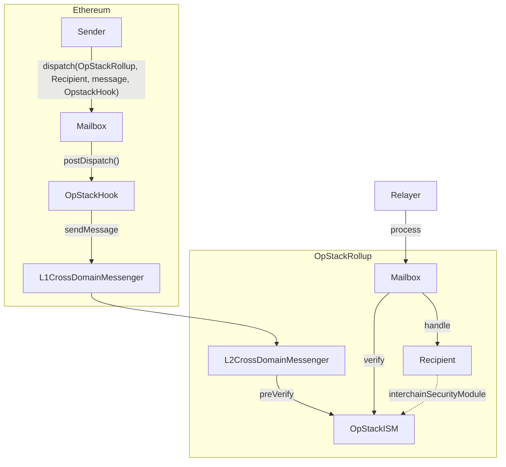
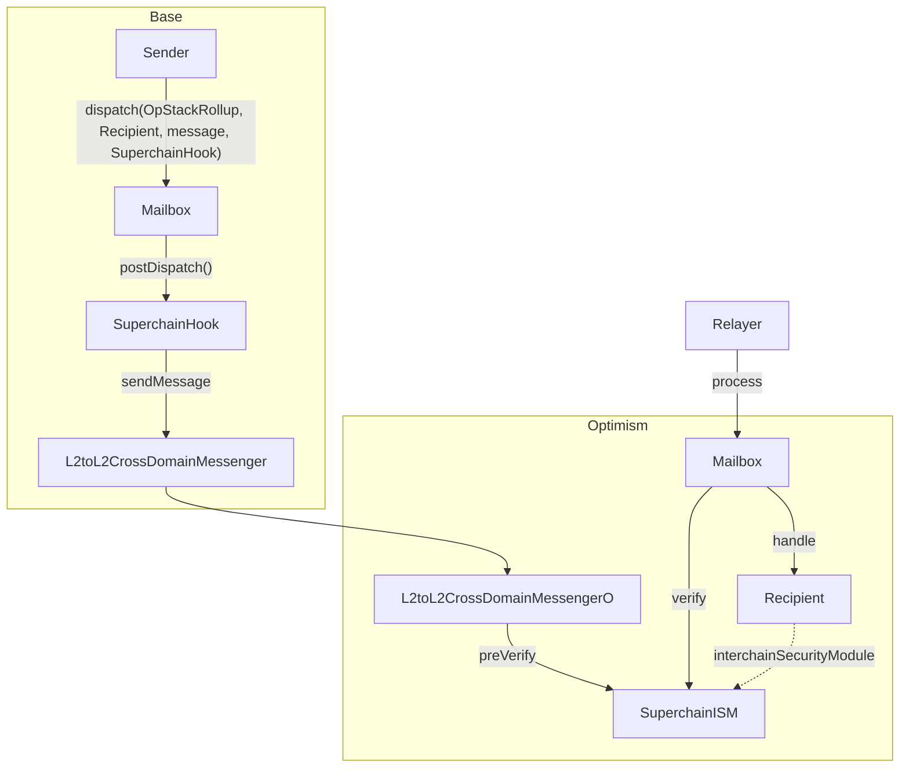
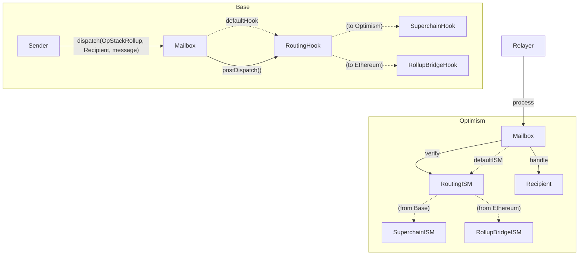

## Abstract

This ERC specifies an API for sending messages across chains to enable interoperability in the greater Ethereum ecosystem (but is flexible enough to encompass alternate VMs). It specifically is capable of sending messages via arbitrary transport and verifying them via diverse mechanisms. At the same time, it aims to provide enough standardization with a modular relaying mechanism to provide a consistent developer experience. As such, it allows for a clean separation of high level abstractions to be built by “application developers” like cross-chain tokens and account abstraction, while allowing for innovation at the verification and transport layer.

## Motivation

Rollups are being created as planned by the rollup centric roadmap. This roadmap allowed for a lot of innovation on different kind of blockspace as well as how it settles down to Ethereum. However, it created a lot of fragmentation as both every rollup bridge has a different interface for L1 → L2 and L2 → L1 messages (and soon for L2 ↔ L2 with efforts like Superchain), both in terms of literal contract interfaces, but also for different relaying semantics. Developers who are seeking to “just get interoperability” often resorted to alternate, more monolithic, but unified and consistent interoperability protocols instead. However, these tend to have very different trust assumptions for verification. The motivation for this ERC is the specification of an API that allows developers to get the ergonomics of these unified interop projects, but with the ability to leverage “native trust assumptions” for interoperability where available.

## Specification

The specification primarily consists of three components:

1. Mailbox - default entrypoint for developers sending/receiving messages on every chain and indexing events
2. Interchain Security Modules (ISM) - API on the destination chain for overriding verification
3. Post-Dispatch Hooks - API on the origin chain to override transport and relaying semantics

### Mailbox

To send and receive messages, smart contracts interact with a `Mailbox` smart contract that is deployed on every chain. To send a message, smart contracts call the `dispatch` function:

```solidity
function dispatch(
	  uint32 destinationDomain,
	  bytes32 recipientAddress,
	  bytes calldata body,
	  bytes calldata customHookMetadata,
	  IPostDispatchHook customHook
) external payable returns (bytes32 messageId);
```

To receive messages, anybody can call the `process` function on the `Mailbox`

```solidity
function process(
    bytes calldata _metadata,
    bytes calldata _message
) external payable;
```

which will call the recipient smart contract with the following signature:

```solidity
interface IMessageRecipient {
	function handle(
	    uint32 _origin,
	    bytes32 _sender,
	    bytes calldata _message
	) external payable;
}
```

The message is represented by the following struct (or its ABI-encoded equivalent):

```solidity
struct Message {
    // The version of the origin and destination Mailboxes
    uint8 version,
    // A nonce to uniquely identify the message on its origin Mailbox
    uint32 nonce,
    // Domain of origin chain
    uint32 origin,
    // Address of sender on origin chain
    bytes32 sender,
    // Domain of destination chain
    uint32 destination,
    // Address of recipient on destination chain
    bytes32 recipient,
    // Raw bytes of message body
    bytes body
}
```

The `Mailbox` SHALL allow the `handle` call to only succeed at most once (i.e. do replay protection). The `Mailbox` SHALL only make this call after verifying the validity of the message with an `Interchain Security Module (ISM)` . The `Mailbox` owner can set a default `ISM`, but message recipients can specify their own `ISM` by implementing the following signature:

```solidity
interface ISpecifiesInterchainSecurityModule {
    function interchainSecurityModule()
        external
        view
        returns (IInterchainSecurityModule);
}
```

The `Mailbox` SHALL use the specified `ISM` by the recipient, otherwise fallback to using the default `ISM`.

### Interchain Security Module (ISM)

ISMs encapsulate the verification logic that determine whether a message is valid. Typically, ISMs will require specific metadata for such determination (i.e. validator signatures, rollup bridge merkle proofs), thus `ISM` types exist to encode different encoding of the metadata that is passed as part of the interface. Relayers (any party that wants to process a message) are able to construct a tree of ISMs and their types. While ISM types are technically not strictly required for a protocol like this, they act as an API between ISM developers/users and relayers for automatic relaying support.

```solidity
interface IInterchainSecurityModule {
    enum Types {
        UNUSED,
        ROUTING,
        AGGREGATION,
        LEGACY_MULTISIG
        ... // more but excluded for brevity
    }

    /**
     * @notice Returns an enum that represents the type of security model
     * encoded by this ISM.
     * @dev Relayers infer how to fetch and format metadata.
     */
    function moduleType() external view returns (uint8);

    /**
     * @notice Defines a security model responsible for verifying interchain
     * messages based on the provided metadata.
     * @param _metadata Off-chain metadata provided by a relayer, specific to
     * the security model encoded by the module (e.g. validator signatures)
     * @param _message Hyperlane encoded interchain message
     * @return True if the message was verified
     */
    function verify(
        bytes calldata _metadata,
        bytes calldata _message
    ) external returns (bool);
}
```

**ISM Types**

- Routing ISM Type
    
    An ISM of the `Routing` type SHALL implement the following interface
    
    ```solidity
    interface IRoutingIsm is IInterchainSecurityModule {
        function route(
            bytes calldata _message
        ) external view returns (IInterchainSecurityModule);
    }
    ```
    
    To process a message, a relayer should query for the intended ISM for this message with the message itself. The Routing ISM SHALL pass the `message` and `metadata` to the specified ISM in its `verify` implementation.
    
- Aggregation ISM Type
    
    An ISM of the `Aggregation` type SHALL implement the following interface
    
    ```solidity
    interface IAggregationIsm is IInterchainSecurityModule {
        function modulesAndThreshold(
            bytes calldata _message
        ) external view returns (address[] memory modules, uint8 threshold);
    }
    ```
    
    To process a message, a relayer should query for the listed ISMs for this message with the message itself. The Aggregation ISM SHALL only return `true` in its `verify` implementation if at least `threshold` of the `modules` are returning `true`.  The `verify` function thus has to accept the concatenation of all the module’s `metadata`.
    
- Message ID Multisig Type
    
    An ISM of the `MESSAGE_ID_MULTISIG` type SHALL implement the following interface
    
    To process a message, a relayer should query for the validator addresses and fetch the validator signatures from the Validator’s CheckpointSyncers (see under Addendum). The ISM SHALL only return true if at least `threshold` signatures are included in the `metadata`.
    
    ```solidity
    interface IMultisigIsm is IInterchainSecurityModule {
        function validatorsAndThreshold(
            bytes calldata _message
        ) external view returns (address[] memory validators, uint8 threshold);
    }
    ```
    
- Other Types
    
    Other types include wrapping existing transport and verification mechanisms like
    
    - Rollup bridges (Op Stack, Orbit, zkSync, etc.)
    - Verification Networks (Axelar, Wormhole, etc.)
    - Light clients (Succinct’s SP1 Helios, etc.)
    
    Ultimately, it can be anything.
    

### Post-dispatch Hooks

Post-dispatch hooks allow developers to configure additional origin chain behavior with message content dispatched via the Mailbox. They implement the following interface:

```solidity
interface IPostDispatchHook {
    enum Types {
        UNUSED,
        ROUTING,
        AGGREGATION,
        MERKLE_TREE,
        INTERCHAIN_GAS_PAYMASTER,
        // more, but left out for brevity
    }

    /**
     * @notice Returns an enum that represents the type of hook
     */
    function hookType() external view returns (uint8);

    /**
     * @notice Post action after a message is dispatched via the Mailbox
     * @param metadata The metadata required for the hook
     * @param message The message passed from the Mailbox.dispatch() call
     */
    function postDispatch(
        bytes calldata metadata,
        bytes calldata message
    ) external payable;

    /**
     * @notice Compute the payment required by the postDispatch call
     * @param metadata The metadata required for the hook
     * @param message The message passed from the Mailbox.dispatch() call
     * @return Quoted payment for the postDispatch call
     */
    function quoteDispatch(
        bytes calldata metadata,
        bytes calldata message
    ) external view returns (uint256);
}
```

The `Mailbox` has both a required hook and a default hook (which is set by the `Mailbox` owner). Message senders can use the the overloaded `dispatch` function signatures to override the default hook and metadata. The `Mailbox` calls `quoteDispatch` on the required and default (or overridden) hook to SHALL pass the quoted `msg.value` to the  `postDispatch` of both hooks to execute the specified logic. While the Hook types are not strictly required for a protocol like this, they allow for easier introspection. 

**Hook Types**

- Routing Hook Type
    
    Hooks of type `Routing` allow different hooks to be configured depending on the destination domain of a message.
    
- Aggregation Hook Type
    
    Hooks of type `Aggregation` allow multiple hooks to be executed.
    
- MerkleTree Hook Type
    
    Hooks of type `MERKLE_TREE` allow messages to be committed to in an incremental merkle tree in storage that can be used by storage based ISMs as well as a source of truth for fraud proofs.
    
- InterchainGasPaymaster Type
    
    Hooks of type `INTERCHAIN_GAS_PAYMASTER` allow relayers to specify oracles to quote and take payment for relaying services.
    

## Rationale

The objective of the specified interface is to create a unified messaging API that is modular enough to encapsulate most, if not all verification and transport mechanisms, while cohesive enough to provide a comparable developer experience to more monolithic designs. The ISM and Hook interfaces accomplish that goal giving developers a simple configuration mechanism to customize by simply pointing to a singular contract address on both chains.

Both Hook and ISM interfaces are design to allow for maximum composability by passing through the full message. That allows for higher-level abstractions like Routing Hook/ISMs that can route depending on a message’s origin/destination, but also message content (like value transferred).

For developers, it is a consistent API that does not require them to have their own branching/special casing logic per “adapter”. 

### Opinionated Relaying Semantics

A key design consideration is the ergonomics of the relaying, i.e. processing a origin-dispatched message on the destination chain. Developers and users alike prefer not to deal with the requirements for message processing like holding native gas inventory and generating the ISM/proof metadata. The Post-Dispatch Hook API allows for relayers to charge for such a service in origin chain tokens (which the developer of message sender contract can easily pass to the user), and the ISM interface is flexible enough to allow relayers to deterministically generate proof metadata and not have other stakeholder require gas inventory management (like validators). A successful verification-independent messaging standard needs to allow developers innovating on verification to not have to reinvent relaying and able to reuse as much infrastructure as possible. Thus a the API should incentivize the creation of a relayer marketplace.

### Interchain Gas Paymaster

To accomplish a relaying experience compared to vendored alternatives, having a default relayer payment system that relayers can charge for their services is important. While the initial specification of such a system exists, this can be iterated over time within the Post-Dispatch Hooks API.

### Default values and allow override vs. Adapter Entrypoints

To accomplish similar developer experience to vendored alternatives, having a configuration-light starting experience is critical. Other ERCs ([ERC-7786](https://github.com/ethereum/ERCs/pull/673), [EIP-5164](https://eips.ethereum.org/EIPS/eip-5164)) and other protocols (often because they start without modular considerations) end up with an adapter pattern where message senders/recipients manage different verification methods by calling/permissioning calls on different contracts. While both patterns are fundamentally the same level of expressiveness, singular entrypoint contracts are an easier integration point especially for newer developers. 

Singular entrypoints also make auxiliary tooling like test harnesses or explorers easier to develop and maintain. Mailboxes can be easily expressed as adapters by simply deploying multiple instances on a given chain, which take away the main concern with singleton entrypoints.

## (Backwards) Compatibility

This section expands on how the specified interface is compatible with both existing and future verification mechanisms. The general mechanism is to send a commitment of the Mailbox message (message hash) via the origin-chain contract of a verification mechanism and then pass in the full message via the transport layer (Relayer or the verification layer itself)

### L1 → L2 OpStack Rollup Bridge

A developer who wants to send a message via this API with the native OpStack rollup bridge trust assumptions can simply specify the [`OpStackHook`](https://github.com/hyperlane-xyz/hyperlane-monorepo/blob/f26453ee55a444b4ee1a1ac948ebebc92be26ac5/solidity/contracts/hooks/OPStackHook.sol#L2)  on Ethereum and the [`OpStackIsm`](https://github.com/hyperlane-xyz/hyperlane-monorepo/blob/f26453ee55a444b4ee1a1ac948ebebc92be26ac5/solidity/contracts/isms/hook/OPStackIsm.sol#L31) on the OpStack chain



### Superchain

A developer who wants to send a message via this API with the native Superchain trust assumptions can simply specify the [SuperchainHook](https://github.com/hyperlane-xyz/hyperlane-monorepo/blob/nambrot/superchain-ism/solidity/contracts/hooks/SuperchainHook.sol) on Base and the [SuperchainISM](https://github.com/hyperlane-xyz/hyperlane-monorepo/blob/nambrot/superchain-ism/solidity/contracts/isms/hook/SuperchainIsm.sol) on the Optimism.



### Composing via the API

To even further help developers, you could encode this kind of routing in a dedicated Hook/ISM and/or as the default on the `Mailbox` itself



## Security Considerations

<!--
All EIPs must contain a section that discusses the security implications/considerations relevant to the proposed change. Include information that might be important for security discussions, surfaces risks and can be used throughout the life cycle of the proposal. For example, include security-relevant design decisions, concerns, important discussions, implementation-specific guidance and pitfalls, an outline of threats and risks and how they are being addressed. EIP submissions missing the "Security Considerations" section will be rejected. An EIP cannot proceed to status "Final" without a Security Considerations discussion deemed sufficient by the reviewers.

The current placeholder is acceptable for a draft.

TODO: Remove this comment before submitting
-->


## Copyright

Copyright and related rights waived via [CC0](../LICENSE.md).
