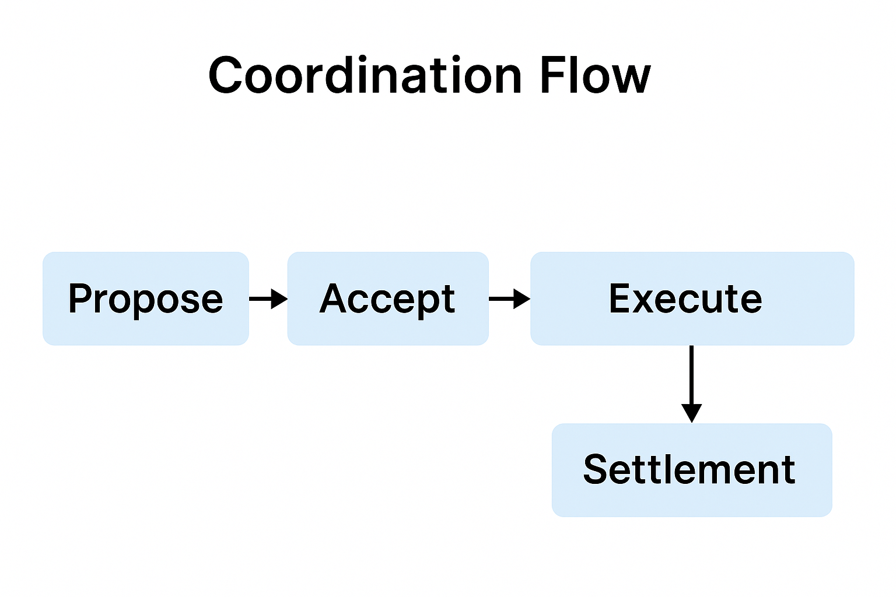
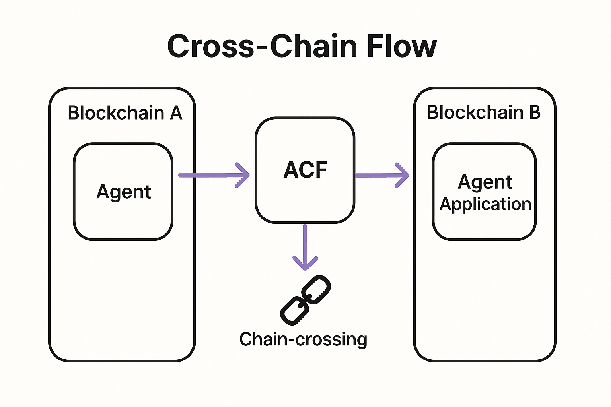

## Abstract

This proposal builds on [EIP-712](./eip-712.md) and complements [ERC-7683](./eip-7683.md) and [ERC-7521](./eip-7521.md).
[ERC-8001](./erc-8001.md) defines a modular framework for direct agent to agent coordination...

## Motivation

Autonomous agents in DeFi, MEV search, cross chain arbitrage, and market making need a standard way to coordinate without trusted intermediaries. Existing proposals like [ERC-7683](./eip-7683.md) and [ERC-7521](./eip-7521.md) focus on user initiated flows or transfer focused intents. ERC-8001 targets agent to agent coordination, with explicit privacy, reputation, and multi party acceptance.

## Specification

The key words MUST, MUST NOT, REQUIRED, SHALL, SHOULD, and MAY are to be interpreted as in RFC 2119 and RFC 8174.

## Rationale

The specification is split into a minimal Core and optional modules to maximise adoption while keeping the base surface area small.
The Core focuses on intent semantics (hashing, participants, acceptance, execution) and EIP-712 compatibility so wallets and agents can integrate quickly.
Privacy, cross-chain atomicity, batching, and discovery are isolated because they vary widely in trust models and gas costs across networks.
This separation reduces fragmentation (a common ERC concern) by ensuring every ERC-8001 implementation shares the same Core interface and hashing, with modules layered consistently.

### Part 1. Core Specification (mandatory)

#### Data structures

```solidity
struct AgentIntent {
    bytes32 payloadHash;
    uint64  expiry;
    uint64  nonce;
    uint32  chainId;
    address agentId;
    bytes32 coordinationType;
    uint256 maxGasCost;
    uint8   priority;
    bytes32 dependencyHash;
    uint8   securityLevel;
    address[] participants;
    uint256 coordinationValue;
}

struct CoordinationPayload {
    bytes32 version;
    bytes32 coordinationType;
    bytes   coordinationData;
    bytes32 conditionsHash;
    uint256 timestamp;
    bytes   metadata;
}
```

#### Core interface

```solidity
interface IAgentCoordinationCore {
    event CoordinationProposed(bytes32 indexed intentHash, address indexed proposer, bytes32 coordinationType);
    event CoordinationAccepted(bytes32 indexed intentHash, address indexed participant, bytes32 acceptanceHash);
    event CoordinationExecuted(bytes32 indexed intentHash, address indexed executor, bool success, uint256 gasUsed);
    event CoordinationCancelled(bytes32 indexed intentHash, address indexed canceller, string reason);

    function proposeCoordination(
        AgentIntent calldata intent,
        bytes calldata signature,
        CoordinationPayload calldata payload
    ) external returns (bytes32 intentHash);

    function acceptCoordination(bytes32 intentHash, bytes calldata acceptanceSignature) external returns (bool);
    function executeCoordination(bytes32 intentHash, CoordinationPayload calldata payload, bytes calldata executionData)
        external returns (bool success, bytes memory result);
    function cancelCoordination(bytes32 intentHash, string calldata reason) external;
    function getCoordinationStatus(bytes32 intentHash) external view returns (uint8 status, address[] memory acceptedBy);
}
```

### Part 2. Optional Modules (summaries)

- Security Module: standardises confidentiality levels (BASIC, STANDARD, ENHANCED, MAXIMUM).
- Cross chain Module: atomic multi chain execution with proofs and rollback.
- Batch Module: parallel or sequential execution of multiple intents.
- Discovery Module: agent registry, capability discovery, and reputation.

## Reference Implementation

See assets in this repository:

- [AgentCoordinationFramework.sol](../assets/erc-8001/AgentCoordinationFramework.sol)
- [Security Module](../assets/erc-8001/AgentCoordinationSecurityModule.sol)
- [Cross Chain Module](../assets/erc-8001/CrossChainCoordinationModule.sol)
- [Batch Module](../assets/erc-8001/BatchCoordinationModule.sol)
- [Discovery Module](../assets/erc-8001/AgentDiscoveryModule.sol)
- [Foundry tests](../assets/erc-8001/tests/)

Diagrams:

- 
- 

## Security Considerations

Bind signatures to [EIP-712](./eip-712.md) domains. Use nonces and expiries. For confidentiality, use authenticated encryption. Cross chain atomicity depends on proof validity; document the trust model.

## Copyright

Copyright and related rights waived via [CC0](./LICENSE.md).
