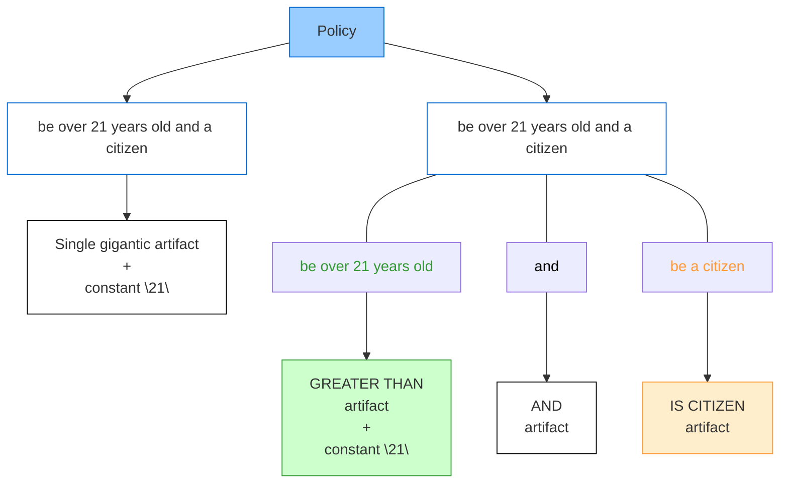

## Table of Contents

- [Abstract](#abstract)
- [Motivation](#motivation)
  - [Current State of Smart Contract Rule Implementation](#current-state-of-smart-contract-rule-implementation)
  - [The Validation Challenge in Decentralized Applications](#the-validation-challenge-in-decentralized-applications)
  - [Problems Faced by Developers](#problems-faced-by-developers)
  - [Proposed Solution](#proposed-solution)
  - [Key Benefits](#key-benefits)
  - [Delegated Security Model](#delegated-security-model)
  - [Outcome](#outcome)
- [Specification](#specification)
  - [Definitions](#definitions)
  - [Artifact Interfaces](#artifact-interfaces)
  - [Policy Handler](#policy-handler)
- [Rationale](#rationale)
  - [All bytes](#all-bytes)
  - [Artifact dataflow traits](#artifact-dataflow-traits)
  - [External compliance traits](#external-compliance-traits)
  - [Handler Architecture Considerations](#handler-architecture-considerations)
- [Test Cases](#test-cases)
- [Backwards Compatibility](#backwards-compatibility)
- [Reference Implementation](#reference-implementation)
  - [Satellite Functionality](#satellite-functionality)
- [Security Considerations](#security-considerations)
- [Copyright](#copyright)

## Abstract

Smart contract systems face significant challenges implementing sophisticated, adaptable compliance rules that can evolve with changing regulatory requirements. This proposal presents an efficient on-chain policy engine approach. Policies are decomposed into simple rules, called artifacts, and represented as interconnected entities forming logical structures. In a recommended implementation, these entities can be organized as a directed acyclic graph (DAG), where each node is an instance of an artifact. The evaluation begins with a top-tier artifact (root node) and processes through the connected structure, with the result serving as the final policy evaluation outcome.

The standard's universality stems from its preservation of artifact connectivity across different contexts, establishing a meta-layer of compliance requirements applicable to any new or existing (yet upgradable) decentralized application. It defines approaches, interfaces, and conventional traits that facilitate elegant interoperability between policies and artifacts for common usage scenarios, enabling seamless implementation and consumption of any compliance scenario.

## Motivation

### Current State of Smart Contract Rule Implementation

Many software systems rely on smart contracts, ranging from simple vaults to decentralized exchanges and oracles. All such systems require regulation in various forms - limiting administrative privileges, restricting allowed methods, capping withdrawal amounts. Restrictions, rules, and prohibitions constitute essential components of any financial (or other) system.

Current smart contract programming approaches allow for the creation of simple rules through algorithmic constraints and modifiers. However, more complex rules - dynamic, composite, or conditional - become increasingly difficult to implement as the number of inputs grows. Moreover, certain problems, such as interactive composition of simple rules, cannot be addressed with current methods due to the lack of reflection capabilities in smart contract platforms. Reusing complex rules, modifying them dynamically, and hierarchical organization are similarly challenging.

### The Validation Challenge in Decentralized Applications

Every decentralized application requires validation logic. Any action or state change involves various checks:
- Authentication verifications (such as onlyOwner)
- Balance validations
- Allowance confirmations
- Custom business logic validation

The absence of proper validations indicates non-compliance with business requirements, rendering the application essentially useless. These validations may need to be strengthened or relaxed over time as requirements evolve. In non-upgradeable contracts, validation changes become impossible after deployment. Even in upgradeable contracts, such modifications are costly and vulnerable to errors during and after the upgrade process.

### Problems Faced by Developers

When developing compliance conditions, developers face several important challenges:

1. **Code Complexity**: Beyond simple value thresholds, compliance logic becomes increasingly complex. This complexity makes codebases significantly harder to maintain, understand, and audit effectively. The intricate nature of compliance requirements often results in convoluted implementations that obscure the underlying business logic.

2. **Security Vulnerabilities**: Flaws in rule implementation pose serious risks to system integrity and user assets. Poor implementations can enable unauthorized access to restricted functionality, lead to direct loss of user funds through exploits, and potentially violate regulatory requirements that the rules were meant to enforce. These vulnerabilities often stem from the inherent complexity of compliance logic and the challenges of properly implementing intricate rule systems.

3. **Integration Difficulties**: Adding new compliance logic to existing codebases often requires:
   - Extensive changes
   - Code duplication through copy-paste approaches
   - Separate integration work for each implementation

4. **Redundant Implementation**: Many compliance patterns appear across different projects but lack standard interfaces, forcing developers to repeatedly implement similar functionality.

5. **Costly Updates**: As regulatory requirements change, contracts need updates, requiring the entire development process again - writing, testing, auditing, and deploying - increasing costs and error potential.

### Proposed Solution

This proposal establishes a standard enabling simplicity, reusability, and comprehensive compliance capabilities without requiring network layer modifications. The standard addresses these challenges through:

- **Simplified Integration**: Standardized interfaces reduce the complexity of incorporating policies into applications
- **Security Responsibility Assignment**: Artifact developers focus on security within their specific components
- **Complexity Containment**: Rule complexity is isolated within artifacts
- **Pattern Reusability**: Common patterns can be implemented once and reused across multiple policies
- **Incremental Updates**: Regulatory changes can be addressed by adding or replacing specific artifacts rather than rebuilding entire applications

The approach significantly reduces codebase complexity by delegating policy enforcement to dedicated handler contracts. Each artifact's complexity is managed by its specific developer, creating a clear separation of concerns. Integration into both new and existing upgradable applications becomes straightforward, as everything in the artifact lifecycle is handled within standard methods on the policy handler - once the handler is added to the application codebase, no further deep integration is needed.

### Key Benefits

This standard provides several important benefits:

- **Application Augmentation**: Smart contracts can augment decentralized applications with any compliance mechanism
- **Fast Integration**: Simple, standardized interfaces enable quick adoption
- **Simplified Reusability**: Artifacts can be easily shared and reused
- **Development Focus**: By eliminating regular complexities from compliance implementation, developers can focus on business logic
- **Accelerated Lifecycles**: Standardized conventions accelerate both initial development and upgrade processes
- **Resource Efficiency**: Dramatically reduces the time and resources needed to adapt to changing regulations

### Delegated Security Model

Security responsibilities are effectively delegated to artifact developers, who should conduct thorough security audits before making artifacts publicly available. This modular approach enables:

1. **Component Reusability**: Quick and simple reuse of artifacts across multiple applications
2. **Flexible Policy Evolution**: Easy addition or replacement of artifacts within policy handlers
3. **Rapid Rule Updates**: When compliance requirements change, only targeted modifications are needed
4. **Reduced Development Overhead**: Instead of complete development lifecycles, only new feature implementation is required

When there's a need to implement additional compliance rules, developers can simply implement new artifacts (or use existing community-developed ones) and update the existing policy via the policy handler.

### Outcome

This approach enables sophisticated compliance systems that were previously impractical to implement, unlocking new possibilities for on-chain governance and regulatory compliance.

## Specification

The key words "MUST", "MUST NOT", "REQUIRED", "SHALL", "SHALL NOT", "SHOULD", "SHOULD NOT", "RECOMMENDED", "NOT RECOMMENDED", "MAY", and "OPTIONAL" in this document are to be interpreted as described in RFC 2119 and RFC 8174.

### Definitions

**Policy** - A rule or set of rules combined to form one coherent rule. A policy is defined in relation to the action to which it applies. For example, a bank transfer must comply with the bank's policy for that specific transfer type. This policy may be a single rule or a composite of several rules. Furthermore, a policy may be composed of several other policies, which in this context are treated as rules.
To summarize, a policy is a rule governing a specific transaction, regardless of its complexity.

In this standard, the *rule, fundamental component* of a policy, is called an **artifact**. An artifact is atomic within the policy context. Internally, an artifact can be as simple or complex as its creator requires.

For example, a policy stating "be over 21 years old and a citizen" comprises two artifacts: "be over 21 years old" and "be a citizen". While one could define a single artifact encompassing both requirements, it is generally recommended to maintain granularity that reflects natural divisions of logic. This granular approach enables policies to be constructed from simple, reusable building blocks, tackling the challenge of complex rule composition.

Artifacts in this proposal are implemented as smart contracts, allowing them to represent not only rules but also arbitrary operations across any context - on-chain transactions, off-chain actions, administrative workflows, or any other decision point requiring policy enforcement. Consequently, logical operators like "and" are also implemented as artifacts.

This construction system - which allows for modifying components and dynamically supplying them with data - is defined by this standard.



### Artifact Interfaces

Artifacts may implement any logic but MUST adhere to a standard interface that allows the policy controller to integrate them correctly and ensure consistent data flow:

```solidity
interface IArbitraryDataArtifact {
    function exec(bytes[] memory data) external returns (bytes memory);

    function init(bytes memory data) external;

    function getExecDescriptor()
        external
        pure
        returns (string[] memory argsNames, string[] memory argsTypes, string memory returnType);

    function getInitDescriptor()
        external
        pure
        returns (string[] memory argsNames, string[] memory argsTypes);

    function description() external pure returns (string memory desc);
}
```

This standardized interface creates clear interaction patterns that simplify the incorporation of policies into both new and existing applications, reducing integration complexity.

Other interfaces are more implicit, following conventions and approaches explained in the Rationale section.

### Policy Handler

The policy handler serves as the orchestration component for artifact execution. While implementations may vary, this standard RECOMMENDS a Directed Acyclic Graph (DAG) approach as the most efficient architecture (see [reference implementation](../assets/erc-8006/contracts/inheritance/DAGWithPolicyMetadata.sol)).

During **policy initialization**, the handler: 
1. Constructs a DAG from the specified artifacts and their configurations
2. Receives the Root node identifier (referencing the starting artifact instance in the policy)
3. Each artifact instance is initialized as needed during this phase, ensuring proper setup before policy evaluation

When **policy evaluation** is requested, the handler:
1. Collects the necessary variables for evaluation
2. Initiates a recursive *traversal* of the graph

For each node during the *traversal*, the handler:
1. Calls the target artifact using the standard interface
2. Supplies it with the appropriate variables and/or results from previously evaluated(calculated) nodes that the current node depends on
3. Collects the result for use by subsequent nodes
4. Finishes the traversal once all nodes have been evaluated

This orchestration allows artifacts to exchange data without direct knowledge of each other. After the traversal is complete, the **root node** contains the result of the entire policy **evaluation result**, which represents the **final outcome** of the policy check.
This design provides a structured mechanism for rule interaction, addressing the challenge of composing complex rules from simpler components.


To facilitate interaction with off-chain systems, the handler SHOULD provide a method to retrieve information about all variables used by all artifacts in the policy:

```solidity
function getVariablesList() public view returns (NamedTypedVariables[] memory) {
    return Utils.getVariablesListInternal(graph.getNodes());
}
```

This feature enables seamless data flow across boundaries, bridging the gap between on-chain and off-chain systems.

## Rationale

Since rules often require heterogeneous data (both on-chain and off-chain), the system must facilitate integration from both sources. This integration is achieved through the artifacts (nodes) handler architecture, which properly organizes artifacts and data to compute policies correctly. Essentially, an instance of the handler represents an instance of the policy.

### All bytes

Artifacts, being contracts, require clearly typed method arguments. However, the handler cannot process all types uniformly. To avoid extensive ad hoc duplications, all types SHOULD be encoded into bytes before being supplied to and returned from artifacts.

This approach allows each variable or result of an artifact to be processed as bytes by both the handler and off-chain code, significantly simplifying implementation. The "all bytes" approach provides a unified method for data transfer regardless of the underlying type, resolving heterogeneous data handling challenges.

### Artifact dataflow traits

Artifacts have two primary methods: `init` and `exec`.

The `init` method is called once during policy initialization by the policy handler. Some artifacts can be reused across multiple policies in a **stateless** manner, while others require a **stateful** approach. A *stateful* design is useful when a particular artifact needs to maintain its own state variables. Therefore, in the case of *stateful* artifacts, a separate copy must be created for each one using a suitable copying strategy (e.g., [ERC-1167](./erc-1167.md)). This ensures that each stateful artifact instance maintains a clean and independent state.

Both `init` and `exec` methods accept arguments (with `exec` also returning a value). Following the "all bytes" approach, these arguments are encoded as bytes. However, their serialization differs: `exec` arguments are an array of byte-encoded values, while `init` arguments are directly byte-encoded values:

```
exec args = [abi.encode(uint256), abi.encode(string)]
init args = abi.encode(uint256, string)
```

These values SHOULD be decoded accordingly:

```solidity
function exec(bytes[] memory data) external pure override returns (bytes memory) {
    uint256 argA = abi.decode(data[0], (uint256));
    string memory argB = abi.decode(data[1], (string));

    return abi.encode(doSomething(argA, argB));
} 
```

```solidity
function init(bytes memory data) external override {
    (bool init1, address init2, bytes memory init3, uint256 init4, string memory init5) = abi
        .decode(data, (bool, address, bytes, uint256, string));
}
```

This clear separation between initialization and execution enhances reusability, allowing artifacts to be configured once and then executed multiple times with different inputs.

### External compliance traits

Artifacts SHOULD be self-descriptive to facilitate integration.

The `description` method returns a human-readable string describing the artifact's logic - its purpose, state characteristics, applicable contexts, and other relevant information. While not strictly formatted, this description helps developers and users understand the artifact's behavior and intended use:

```solidity
function description() external pure override returns (string memory desc) {
    desc = "Stateful artifact used to validate signatures from a predefined list of approvers. Requires a quorum of valid signatures to approve. First parameter - messageHash packed as bytes, second one - signatures packed as bytes array. Returns bool representing whether enough valid signatures were provided.";
}
```

In contrast, the `getExecDescriptor` and `getInitDescriptor` methods are designed for automated systems that need to encode arguments for policy computation. These methods provide structured metadata about parameter names, types, and return values in a machine-readable format:

```solidity
function getExecDescriptor()
    public
    pure
    override
    returns (string[] memory argsNames, string[] memory argsTypes, string memory returnType)
{
    uint256 argsLength = 2;
    argsNames = new string[](argsLength);
    argsNames[0] = "argA";
    argsNames[1] = "argB";
    argsTypes = new string[](argsLength);
    argsTypes[0] = "uint256";
    argsTypes[1] = "uint256";
    returnType = "bool";
}
```

This separation of concerns allows both human users and automated systems to properly interact with artifacts, supporting both manual integration and programmatic composition of policies. These descriptive capabilities make policies more transparent and easier to work with, solving discoverability and comprehension challenges.

### Handler Architecture Considerations

The graph-based approach is optimal for artifact orchestration, offering elegant recursive traversal capabilities, memory efficiency, and support for dynamic modifications. Artifacts function naturally as node logic within this structure, with the handler defining additional node properties and relationships.

A key responsibility of the handler is parameter management. The handler determines:
- Which parameters are constant within the policy
- Which parameters are supplied as external variables
- Which parameters derive from the computation results of other nodes

These determinations are made during policy creation and dynamically managed by the handler during execution. Implementation details regarding interface extensions and argument formatting remain at the discretion of the handler developer.

The graph-based architecture imposes several important constraints:

1. **Acyclicity requirement**: Policies MUST NOT contain cycles. Nodes cannot refer to each other cyclically in any form, including self-references and transitive references.

2. **EVM call stack limitations**: Since each node traversal involves a contract call to an artifact, policy size is bounded by Ethereum Virtual Machine call stack limits.

3. **Connectivity requirement**: Only nodes connected (directly or indirectly) to the root node will be traversed during evaluation. Graphs with disconnected nodes or subgraphs will be rejected during policy creation stage.

These architectural considerations provide a structured approach to policy definition while clearly communicating implementation constraints, making complex, composable rules more manageable.

## Test Cases

Test cases for this standard are included in the [reference implementation repository](https://github.com/GuardianLabs/policy-sdk/tree/dev/packages). They demonstrate:

1. Creation and initialization of artifacts
2. Construction of policies from multiple artifacts
3. DAG structure defining relationships between artifacts
4. Basic mathematical operations implemented as graph nodes orchestrated by the policy handler
5. Preparation of execution parameters in off-chain environments
6. Preparation of execution parameters in on-chain contexts
7. Evaluation of policies with various input data
8. Reuse of artifacts across different policies
9. Implementation of common policy patterns and composite structures

The test suite provides comprehensive examples of how to implement, configure, and utilize the policy engine in various scenarios, serving as both verification of the standard and a learning resource for implementers. These tests demonstrate practical solutions to real-world compliance needs.

## Backwards Compatibility

No backward compatibility issues have been identified.

This standard may appear associated with [ERC-2746](./erc-2746.md), but they are not intended as replacements for each other. While ERC-2746 describes a similar concept of rule perception, the current standard presents a fundamentally different approach to implementing a rule engine on-chain, with entirely distinct interfaces and mechanisms, while being simpler to apply and more powerful in usage.

Separately, the graph-based composition may evoke the Rete family of rule engines. This resemblance is only structural: the standard specifies a pull-driven, acyclic one-shot evaluation of contract "artifacts", not an incremental fact-matching network with working memories, agendas, or conflict resolution. Consequently, Rete-based systems (e.g., Jess, CLIPS, Drools) will not run natively against policies defined here without an adapter or compilation layer.

Main distinctive features of this standard include:

1. **Distributed Architecture**: A modular approach where independent artifacts can be composed to form policies, enabling clean separation of concerns and facilitating independent development of rule components.

2. **Unlimited Extensibility**: The ability to create and integrate any type of compliance logic through custom artifacts, without being constrained by predetermined rule types.

3. **Flexible Integration Options**: Support for embedding policies within existing applications or implementing them as standalone enforcement mechanisms, adaptable to various application architectures.

4. **Explicit State Management**: Clear mechanisms for maintaining isolated state for rule components, ensuring that artifact instances have clean, independent state when used across different policies.

5. **Graph-Based Composition**: A sophisticated approach to policy composition, allowing for complex control flows and data sharing between rule components through a structured graph representation.

These architectural features make this standard particularly suited for dynamic compliance requirements in evolving regulatory environments, where policies need to adapt over time without requiring extensive redevelopment of the underlying applications.

## Reference Implementation

A reference implementation of policy handler is available [here](../assets/erc-8006/contracts/PolicyHandler.sol).

Full SDK implementing auxillary helpers for variables population, off- and on-chain evaluation, DSL and compiler for policy definition is public in [this repository](https://github.com/GuardianLabs/policy-sdk/tree/dev).

The reference implementation includes:
- Core artifact interfaces
- Base artifact implementations
- Policy handler contract
- Example artifacts for common use cases
- Test suite demonstrating policy composition and evaluation

The implementation demonstrates how to construct robust policies from individual artifacts and how the handler seamlessly evaluates these policies within a transaction context. This reference implementation offers a proven, efficient solution for policy integration and composition, functioning as a layer of compliance requirements that can be applied to any compatible decentralized application.

### Satellite Functionality 

The computational capabilities of the proposed system are inherently Turing-complete, as it is built on a Turing-complete runtime environment. This allows for extensive flexibility in policy definition and execution. The primary limitations relate to:

1. Integration with off-chain systems
2. Policy logic definition
3. Efficient variable supply mechanisms

The reference implementation addresses these challenges by providing several additional components:

- Variable mapping utilities that facilitate conversion between off-chain variables and their on-chain artifact parameter representations
- Comprehensive examples of fully on-chain policy implementations
- A domain-specific language (DSL) and accompanying compiler for intuitive policy composition using existing artifacts
- An intermediate representation parser that enables custom policy definition approaches beyond the provided DSL
- Client-side implementations facilitating seamless integration between off-chain systems and on-chain policies

These components demonstrate how the standard can be extended to support various implementation needs while maintaining compatibility with the core specification. The approach enables significant enhancement of decentralized application capabilities, allowing both native dApps and traditional Web2 applications to leverage on-chain policy enforcement. These satellite functionalities provide complete solutions rather than just interface definitions, solving integration and implementation challenges.

## Security Considerations

Since this standard defines a protocol for contract interactions with a main orchestrator (processor), the standard itself does not introduce inherent security vulnerabilities. Each implementation must independently validate its security properties. However, several common security considerations apply to most implementations:

1. **Untrusted artifacts**: If any component rule within a policy is unreliable, the entire policy becomes vulnerable and may be exploited to generate false authorizations. An unreliable artifact might involve updated logic (via proxy), unknown or unaudited code, or code vulnerable to known attack vectors.

2. **State initialization errors**: Stateful artifacts require clean state isolation between different policy instances. To achieve this, the Policy Handler must create new, isolated instances for each stateful artifact using approaches like minimal proxies (e.g., [ERC-1167](./erc-1167.md)). Improper implementation of this state isolation mechanism can lead to unexpected behavior - developers may encounter empty storage slots where data was expected or slots containing data from other policies when they should be empty. While developers may implement their own approach for state isolation, it is strongly recommended to use established patterns like ERC-1167 to avoid such corruption. The reference implementation uses minimal proxies with delegatecall functionality, which requires careful handling to avoid security issues.

3. **Handler vulnerabilities**: If the policy graph handler implementation contains vulnerabilities, an attacker might replace a legitimate policy with a malicious one that always returns true. Therefore, implementations must enforce strict authorization controls on handler operations.

Implementers should consider these issues and conduct thorough security audits before deploying policy-based systems in production environments.

## Copyright

Copyright and related rights waived via [CC0](../LICENSE.md).
