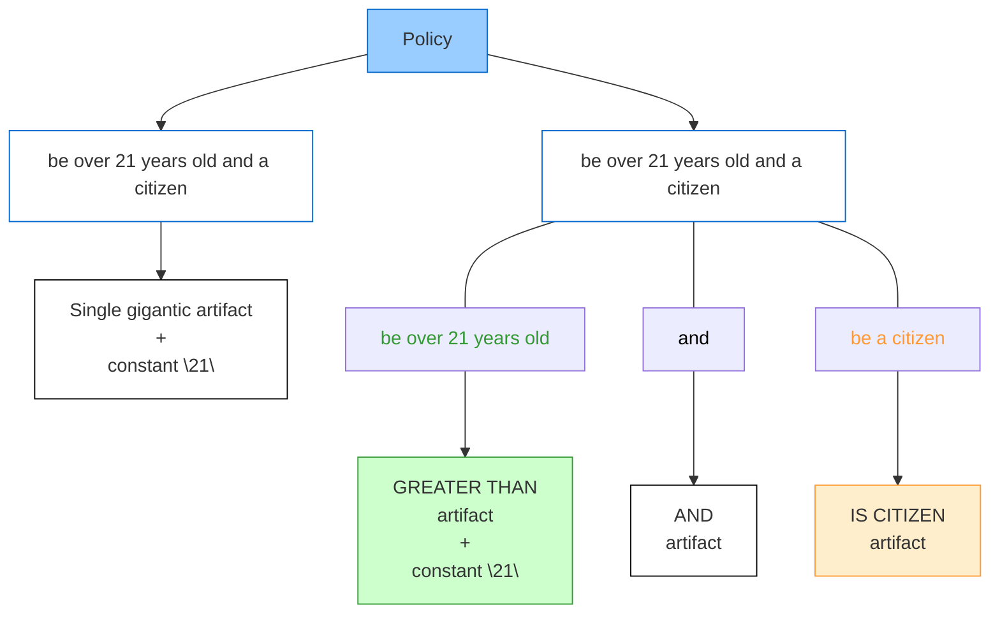
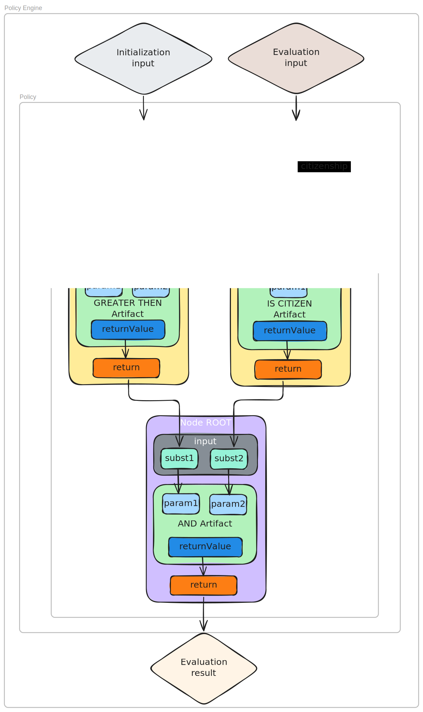

## Abstract

Smart contract applications often need configurable and reusable compliance logic. This standard defines an on-chain policy engine that composes rule "artifacts" and evaluates the final check result based on them through a specialized rule processor called the Policy Handler.

A **Directed Acyclic Graph (DAG)** is the RECOMMENDED approach for composition and evaluation in Policy Handler. Artifacts implement a minimal interface and exchange input params / output params of the main interface methods as `bytes` or `bytes[]` (see [Interfaces section](#interfaces)), allowing heterogeneous data and on/off-chain variable supply.

When a DAG is used, the Policy Handler traverses the graph from a designated **Root** node and eventually returns the output of the root node (root artifact). This output is policy's final result. The standard also specifies self-descriptive methods for artifacts to support programmatic composition and external tooling.

## Motivation

For many smart contract software systems, compliance – and the validations it relies on – is an essential and often mandatory component. From the simplest vaults to decentralised exchanges, oracles, and smart accounts, all require **restrictions**, **requirements**, **prohibitions**, and **custom validation rules** – for example, limiting administrative privileges, restricting access to public methods, capping withdrawal amounts, and more – with the ability to modify these rules when necessary, especially considering ongoing regulatory developments across the globe.

### Current State of Smart Contract Rule Implementation Capabilities

Current smart contract approaches allow for the creation of simple validation rules through algorithmic constraints and modifiers. However, more complex rules – such as dynamic, composite, or conditional ones – while still possible, become increasingly difficult to implement as the number of inputs and conditions grows over time.

Moreover, certain problems, such as interactive composition of simple rules, cannot be addressed with current methods due to the lack of reflection capabilities in smart contract platforms. Reusing complex rules, modifying them dynamically, and hierarchical organization are similarly challenging.

### Compliance Problems Faced by Developers

When implementing compliance conditions, developers face several important challenges:

1. **Code Complexity**: Beyond simple value thresholds, compliance logic becomes increasingly complex. This complexity makes codebases significantly harder to maintain, understand, and audit effectively. The intricate nature of compliance requirements often results in convoluted implementations that obscure the underlying business logic.

2. **Security Vulnerabilities**: Flaws in rule implementation pose serious risks to system integrity and user assets. Poor implementations can enable unauthorized access to restricted functionality, lead to direct loss of user funds through exploits, and potentially violate regulatory requirements that the rules were meant to enforce.

3. **Integration Difficulties**: Adding new compliance logic to existing codebases often requires:
   - Extensive codebase changes
   - Separate integration work for each compliance rule implementation
   - The need of carefully conducted contract upgrade process (which is error-prone)

4. **Redundant Implementation**: Many compliance patterns appear across different projects but lack standard interfaces, forcing developers to repeatedly implement similar functionality.

5. **Costly Updates**: As regulatory requirements change, contracts need updates, requiring the entire development process again - writing, testing, auditing, and deploying - increasing costs and error potential.

## Specification

The key words "MUST", "MUST NOT", "REQUIRED", "SHALL", "SHALL NOT", "SHOULD", "SHOULD NOT", "RECOMMENDED", "NOT RECOMMENDED", "MAY", and "OPTIONAL" in this document are to be interpreted as described in RFC 2119 and RFC 8174.

### Definitions

**Policy** - A rule or set of rules combined to form one coherent rule. A policy is defined in relation to the action to which it applies. For example, a bank transfer must comply with the bank's policy for that specific transfer type. This policy may be a single rule or a composite of several rules. Furthermore, a policy may be composed of several other policies, which in this context are treated as rules.

To summarize, a policy is a rule governing a specific on-chain action, regardless of its complexity.

In this standard, the *rule, fundamental component* of a policy, is called an **artifact**. An artifact is atomic within the policy context. Internally, an artifact can be as simple or complex as its creator requires.

For example, a policy stating "be over 21 years old and a citizen" comprises two artifacts: "be over 21 years old" and "be a citizen". While one could define a single artifact encompassing both requirements, it is generally recommended to maintain granularity that reflects natural divisions of logic. This granular approach enables policies to be constructed from simple, reusable building blocks, tackling the challenge of complex rule composition.

Artifacts in this proposal are implemented as smart contracts, allowing them to represent not only rules but also arbitrary operations across any context - on-chain transactions, off-chain actions, administrative workflows, or any other decision point requiring policy enforcement. Consequently, logical operators like "and" are also implemented as artifacts.

There are two types of artifact designs: **stateless** and **stateful**. Stateless artifacts can be reused across multiple policies in a stateless manner, while stateful artifacts are used in a single policy in a stateful manner. A *stateful* design is helpful when a particular artifact is sensitive to the policy it is attached to and needs to maintain its own state variables.

This construction system - which allows for modifying policy components and dynamically supplying them with data - is defined by this standard.



### Interfaces

#### Artifact Interfaces

Artifacts may implement any logic but MUST adhere to a standard interface that allows the policy controller to integrate them correctly and ensure consistent data flow:

```solidity
interface IArbitraryDataArtifact {
    function exec(bytes[] memory data) external returns (bytes memory);

    function init(bytes memory data) external;

    function getExecDescriptor()
        external
        pure
        returns (string[] memory argsNames, string[] memory argsTypes, string memory returnType);

    function getInitDescriptor()
        external
        pure
        returns (string[] memory argsNames, string[] memory argsTypes);

    function description() external pure returns (string memory desc);
}
```


Other interfaces are more implicit, following conventions and approaches explained in the Rationale section.

### Policy Handler

The Policy Handler orchestrates artifact execution. While implementations may vary, this standard RECOMMENDS a **Directed Acyclic Graph (DAG)** as the reference architecture (see [reference implementation](../assets/erc-8006/contracts/inheritance/DAGWithPolicyMetadata.sol) and [Policy Handler](../assets/erc-8006/contracts/PolicyHandler.sol)).

During **policy initialization**, the handler: 
1. Constructs a DAG from the specified artifacts and their configurations
2. Receives the **Root** node identifier (referencing the starting artifact instance in the policy)
3. Each stateful artifact instance is initialized as needed during this phase, ensuring proper setup before policy evaluation

When **policy evaluation** is requested, the handler:
1. Collects the necessary variables for evaluation
2. Initiates a recursive *traversal* of the graph

For each node during the **traversal**, the handler:
1. Calls the target artifact using the standard interface
2. Supplies it with the appropriate variables and/or results from previously evaluated (calculated) nodes that the current node depends on
3. Collects the output values of the artifacts for use by parent nodes
4. Finishes the traversal once all nodes have been visited and evaluated

In summary, the handler passes outputs from child nodes as inputs to parent nodes; artifacts do not invoke each other directly. After the traversal completes, the root node’s output value represents the policy’s final result. This design provides a structured mechanism for rule interaction, addressing the challenge of composing complex rules from simpler components.



The handler SHOULD provide a method to retrieve information about all variables used by all artifacts in the policy:

```solidity
function getVariablesList() public view returns (ExecVarsMetadata[] memory list) {
    require(isInitialized, POLICY_NOT_INITIALIZED_ERR);

    list = Utils.getVarsDesriptionList(dag.getNodes());
}
```

The scheme suggested by this standard is application-agnostic. By preserving artifact connectivity across contexts, a policy definition acts as a meta-layer of compliance that can be attached to new or existing (upgradeable) contracts. This approach provides interfaces and conventional traits that make artifacts interchangeable and interoperable.

## Rationale

At a high level, policies must be able to be composed and reused across common scenarios without deep reintegration into each application.

Since rules often require heterogeneous data (both on-chain and off-chain), the system must facilitate integration from both sources. This integration is achieved through the artifacts (nodes) handler architecture, which SHOULD organize artifacts and data in a way to compute policies correctly.
Essentially, an instance of the handler represents an instance of the policy.

### Benefits and Trade-offs

**Benefits**

- **Reduced integration complexity**: Standardized, minimal interfaces provide clear interaction patterns between policies and artifacts, shortening integration paths and reducing integration complexity.
- **Reuse and modularity**: Policies are assembled from interchangeable artifacts, enabling teams to reuse audited components, plug them into new contexts, and evolve requirements without redeploying core application logic.
- **Development focus**: Clear separation of concerns lets application code focus on business logic, while the Policy Handler orchestrates policy enforcement (i.e. the evaluation of policy check result). This approach accelerates initial development and upgrades and reduces the time and effort required to react to changing compliance requirements.

**Trade-offs**

- **Acyclicity**: When DAG is used policies must be acyclic; cycles (including self- and transitive references) are disallowed.
- **Graph size and depth limits**: Practical policy size is bounded by gas budgets and EVM call stack limits.
- **Encoding overhead**: The all-`bytes` transport simplifies heterogeneous data flow but adds encode/decode overhead.
- **Supply-chain risk**: Overall safety depends on the quality and audit status of third-party artifacts; policy owners should curate artifact supply chains, prefer pinned and audited implementations, and apply strict authorization and validation in handlers.

### All-Bytes Mechanism & Artifact Initialization and Execution

#### All-Bytes

Artifacts, being contracts, require clearly typed method arguments. However, the Policy Handler cannot process all types uniformly. To avoid extensive ad hoc duplications, all input / output parameters SHOULD be encoded as `bytes` type before being supplied to and returned from artifacts.

This approach allows each variable (artifact input) or result (artifact output) to be processed as bytes by both the Policy Handler and off-chain code, thereby significantly simplifying implementation. The «all-bytes» mechanism provides a unified method for data transfer regardless of the underlying type, resolving challenges related to heterogeneous data handling.

#### Initialization and Execution

Artifacts have two primary methods: `init` and `exec`.

As declared in [Specification](#specification) section, stateful artifacts maintain a clean and independent storage state. Therefore, the `init` method must be called once for each stateful artifact during policy initialization by the Policy Handler. As result, a separate copy of the artifact must be created. This standard recommends a gas-optmized and suitable copying strategy [ERC-1167](./erc-1167.md).

Stateless artifacts do not require calling `init` method.

Both `init` and `exec` methods accept arguments (with `exec` also returning a value). Following the «all-bytes» mechanism, these arguments are encoded as bytes. However, their serialization differs: `exec` arguments are an array of byte-encoded values, while `init` arguments are directly byte-encoded values:

```
const execArgs = [abi.encode(uint256), abi.encode(string)]
const initArgs = abi.encode(uint256, string)
```

These values SHOULD be decoded accordingly:

```solidity
function exec(bytes[] memory data) external pure override returns (bytes memory) {
    uint256 argA = abi.decode(data[0], (uint256));
    string memory argB = abi.decode(data[1], (string));

    return abi.encode(doSomething(argA, argB));
} 
```

```solidity
function init(bytes memory data) external override {
    (bool init1, address init2, bytes memory init3, uint256 init4, string memory init5) = abi
        .decode(data, (bool, address, bytes, uint256, string));
}
```

This clear distinction between initialization and execution enhances reusability, allowing artifacts to be configured once and then executed multiple times with different inputs.

### External Compliance Traits

Artifacts SHOULD be self-descriptive to facilitate integration.

The `description` method returns a human-readable string describing the artifact's logic - its purpose, state characteristics, applicable contexts, and other relevant information. While not strictly formatted, this description helps developers and users understand the artifact's behavior and intended use:

```solidity
function description() external pure override returns (string memory desc) {
    desc = "Stateful artifact used to validate signatures from a predefined list of approvers. Requires a quorum of valid signatures to approve. First parameter - messageHash packed as bytes, second one - signatures packed as bytes array. Returns bool representing whether enough valid signatures were provided.";
}
```

In contrast, the `getExecDescriptor` and `getInitDescriptor` methods are intended for use by automated systems that need to encode arguments for policy computation. These methods provide structured metadata about input / output parameter names and types in a machine-readable format:

```solidity
function getExecDescriptor()
    public
    pure
    override
    returns (string[] memory argsNames, string[] memory argsTypes, string memory returnType)
{
    uint256 argsLength = 2;
    argsNames = new string[](argsLength);
    argsNames[0] = "argA";
    argsNames[1] = "argB";
    argsTypes = new string[](argsLength);
    argsTypes[0] = "uint256";
    argsTypes[1] = "uint256";
    returnType = "bool";
}
```

This separation of concerns allows both human users and automated systems to properly interact with artifacts, supporting both manual integration and programmatic composition of policies. These descriptive capabilities make policies more transparent and easier to work with, solving discoverability and comprehension challenges.

### Policy Handler Architecture Considerations

The graph-based approach is optimal for artifact orchestration, offering elegant recursive traversal capabilities, memory efficiency, and support for dynamic modifications. Artifacts function naturally as node logic within this structure, with the handler defining additional node properties and relationships.

Another notable architecture decision is a public **variables-list** getter method exposed on the handler. It improves off-chain orchestration and automation – for example, by enabling the precomputation of inputs and the wiring UI forms or client pipelines.

A key responsibility of the Policy Handler is an artifact parameters management. The handler determines:
- Which artifact parameters are configured as constant at policy creation step
- Which artifact parameters are supplied as external variables at policy execution step
- Which artifact parameters derive from the computation results of other nodes (artifacts) at policy execution step

Implementation details of Policy Handler regarding interface extensions and argument formatting remain at the discretion of the handler developer.

The graph-based architecture imposes several important constraints:

1. **Acyclicity requirement**: Policies MUST NOT contain cycles. Nodes cannot refer to each other cyclically in any form, including self-references and transitive references.

2. **EVM call stack limitations**: Since each node traversal involves a contract call to an artifact, policy size is bounded by Ethereum Virtual Machine call stack limits.

3. **Connectivity requirement**: Only nodes connected (directly as children nodes or indirectly as decendant nodes) to the root node will be traversed during evaluation. It is RECOMMENDED that graphs with disconnected nodes or subgraphs MUST be rejected during policy creation stage.

These architectural considerations provide a structured approach to policy definition while clearly communicating implementation constraints, making complex, composable rules more manageable, tractable, and explicit.

### Note on Rete Algorithm

The graph-based composition may evoke the Rete family of rule engines. This resemblance is only structural: the standard specifies a pull-driven, acyclic one-shot evaluation of contract "artifacts", not an incremental fact-matching network with working memories, agendas, or conflict resolution, as is typical of the Rete family.
Consequently, Rete-based systems (e.g., Jess, CLIPS, Drools) will not run natively against policies defined here without an adapter or compilation layer.

Distinction from Rete family of rule engines include:

1. **Distributed Architecture**: A modular approach where independent artifacts can be composed to form policies, enabling clean separation of concerns and facilitating independent development of rule components.

2. **Unlimited Extensibility**: The ability to create and integrate any type of compliance logic through custom artifacts, without being constrained by predetermined rule types.

3. **Flexible Integration Options**: Support for embedding policies within existing applications or implementing them as standalone enforcement mechanisms, adaptable to various application architectures.

4. **Explicit State Management**: Clear mechanisms for maintaining isolated state for rule components, ensuring that artifact instances have clean, independent state when used across different policies.

5. **Graph-Based Composition**: A sophisticated approach to policy composition, allowing for complex control flows and data sharing between rule components through a structured graph representation.

These architectural features make this standard particularly suited for dynamic compliance requirements in evolving regulatory environments, where policies need to adapt over time without requiring extensive redevelopment of the underlying applications.

### Gas Considerations

Unlike calls to regular contract methods, the Ethereum transaction cost of invoking the **PolicyHandler.evaluate** method is more dynamic. It depends on factors such as the graph depth, the relationships between graph nodes (edges), and which node is selected as the root node.
Additionally, a Policy is subject to updates, meaning the number of nodes may change after an update.

Policy with the same conditions can also be implemented at different levels of granularity, resulting in a greater or smaller number of graph nodes for same policy variants. The chosen granularity level is determined by the Policy Handler developer.

Therefore, the cost of invoking **evaluate** may vary from a minimum cost threshold to a maximum cost (bounded by Ethereum Virtual Machine call stack limits), depending on the current graph state. To manage this, a special utility or dry-run method could be implemented for the **evaluate** function to estimate and report the potential cost range before actual execution.

## Backwards Compatibility

No backward compatibility issues have been identified.policy engine in various scenarios, serving as both verification of the standard and a learning resource for implementers.

## Reference Implementation

A reference implementation of Policy Handler is available [here](../assets/erc-8006/contracts/PolicyHandler.sol).
The reference implementation includes the following features:
- Core Artifact Interfaces in accordance with this standard
- Policy Handler contract based on graph structure

## Security Considerations

### Delegated Security

This standard introduces and encourages the use of a **Delegated Security Model**, in which security responsibilities are distributed across multiple roles. Such an approach decouples security logic from a single core codebase, simplifying the overall policy lifecycle including development, creation, upgrades.

Expected roles and responsibilities:
- **Policy Owner**: Responsible for curating, pinning, and updating approved artifact sets for off-chain or on-chain consumption during policy creation.
- **Policy Handler Developer**: Responsible for enforcing acyclicity, authorization, and correct initialization of both the handler and its associated nodes.
- **Artifact Developer**: Responsible for developing, conducting security audits, and maintaining their artifacts before making them publicly available. Unvetted or upgradable artifacts can introduce risks; see notes on *untrusted artifacts* and *statefull initialization problem* below.

### Common Recommendations

1. **Untrusted Artifacts**: If any component rule within a policy is unreliable, the entire policy becomes unreliable and may be subject to exploitation, potentially resulting in false-positive or false-negative policy check results.
Such an unreliable artifact contract might contain unknown or unaudited code, code vulnerable to known attack vectors, or even modified logic (for example, introduced through an unauthorized call to an upgradable proxy, if artifact implemented as one).

2. **Statefull Artifact Initialization Problem**: Stateful artifacts require clean state isolation between different policy instances. To achieve this, the Policy Handler must create new, isolated instances for each stateful artifact using approaches like minimal proxies (e.g., [ERC-1167](./erc-1167.md)). Improper implementation of this state isolation mechanism can lead to unexpected behavior – developers may encounter un-initialized artifacts or empty storage slots where data was expected or slots containing data from other policies when they should be empty. While developers may implement their own approach for state isolation, it is strongly recommended to use established patterns like ERC-1167 to avoid such corruption. The reference implementation uses minimal proxies with delegatecall functionality.

3. **Policy Handler Vulnerabilities**: If the Policy Handler implementation contains vulnerabilities, an attacker could replace a legitimate policy with a malicious one that falsely indicates an action is compliant (or noncompliant). Even replacing a single node in the policy graph might be sufficient to install malicious code.
Therefore, Policy Handler implementations must enforce strict authorization controls on all handler operations.

4. **Delayed Upgrade Mechanism in the Policy Handler Method**: As an additional security measure, a delayed upgrade may be implemented in the Policy Handler. This process will record the new rules and emit the corresponding event, but the rules will only be activated 12–24 hours after the upgrade is applied. Although the `upgrade` method must still enforce authorization controls, this delay provides sufficient time for authorized parties to perform off-chain analysis of the newly proposed rules as an additional verification step, which may be useful in certain cases.

5. **Security Audit**: Since this standard defines a protocol for contract interactions with a main orchestrator (the Policy Handler), the standard itself does not introduce any inherent security vulnerabilities.
However, considering the powerful set of capabilities and resulting complexity described by this standard, implementers must still independently validate their system security properties by conducting thorough security audits of the final policy build (including, but not limited to, the handler and artifacts), before deploying policy-based systems in production environments.

## Copyright

Copyright and related rights waived via [CC0](../LICENSE.md).
