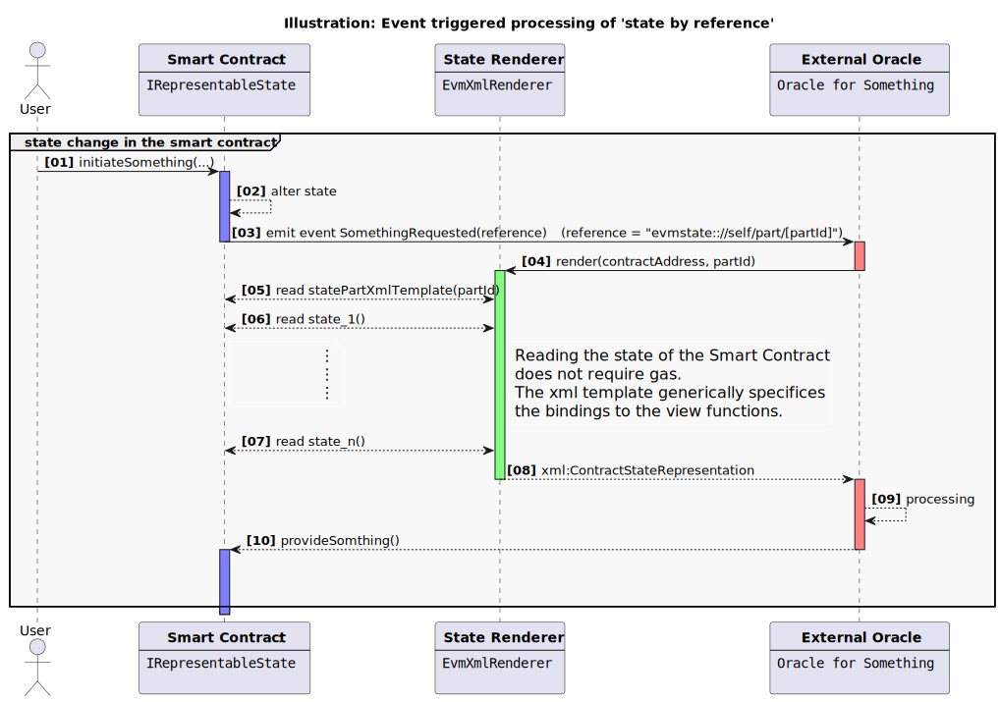

## Abstract

This ERC introduces `IXMLRepresentableState`, a standard interface and XML binding schema that allows an EVM smart contract to define a static XML template with machine-readable bindings to its state and view functions. Off-chain renderers use this template to build a canonical XML representation of the contract's state at a specific block, without incurring any on-chain gas cost. In this ERC, "canonical" refers to the semantic content defined by the rendering rules; byte-for-byte identical XML output across renderers is not required.

This ERC defines the notion of an *XML-complete* contract (see Specification). Informally, an XML-complete contract exposes, via bindings in its XML template, all mutable state that the author considers semantically relevant for future behaviour at a given (chain-id, address, block-number).

Additionally, this ERC defines an optional interface `IXMLRepresentableStatePart` for contracts that expose one or more partial XML templates representing selected views of their state (for example, a settlement context), without changing the semantics of the canonical full representation.

## Motivation

Smart contracts can efficiently orchestrate and process the life-cycle of a financial (derivative) product to an extent that they finally represent *the* financial product itself.

At the same time, many applications require a human-readable, machine-parseable representation of that product and its state: valuation oracles need inputs for settlements, smart bonds and other tokenized instruments need legal terms, term sheets or regulatory reports, and on-chain registries, governance modules or vaults benefit from a stable "document view" of their state.

In the traditional off-chain world, such needs are addressed by standards like FpML, the ISDA Common Domain Model, or the ICMA Bond Data Taxonomy. A common pattern is to treat an XML (or similar) document as the definitive source defining the financial product and then generate code to interact with the corresponding data. When a process modifies or updates properties of the product, developers must synchronize the smart contract's internal state with the off-chain XML representation. Today, each project typically invents its own set of view functions and off-chain conventions, so clients need bespoke code to map contract state into XML, JSON, or PDF. This makes interoperability, independent auditing, and reuse of tooling harder.

This ERC inverts that pattern by putting the smart contract at the centre. A contract declares that it implements `IXMLRepresentableState` and defines an interface of representable state. Off-chain renderers can then derive a canonical XML representation that reflects the semantically relevant state of the contract at a given (chain-id, address, block-number), using only `eth_call` and a standardized XML binding schema. Rendering happens entirely off-chain and does not change state, so there is no gas cost, yet the resulting XML remains cryptographically anchored to the chain.

Typical use cases include:

- Smart derivative contracts that must present their current state to a valuation oracle or settlement engine.
- Smart bonds and other tokenized financial instruments that must generate legal terms, term sheets, or regulatory and supervisory reports.
- On-chain registries, governance modules, and vaults that want a reproducible, auditable document-style snapshot of their state.

By standardizing the Solidity interface and the XML attribute schema, this ERC allows generic tools to consume any compliant contract without project-specific adapters, and to plug directly into existing XML-based workflows in finance and beyond.

## Specification

The keywords “MUST”, “MUST NOT”, “REQUIRED”, “SHALL”, “SHALL NOT”, “SHOULD”, “SHOULD NOT”, “RECOMMENDED”, “MAY”, and “OPTIONAL” in this document are to be interpreted as described in RFC 2119 and RFC 8174.

### Terminology

- **XML template**: A well-formed XML document, returned as a UTF-8 string by the contract, that contains placeholder bindings in the `evmstate` namespace.
- **Binding**: An `evmstate:*` attribute on an XML element that instructs a renderer to fetch a value from the contract (or from chain context) and insert it into the document.
- **XML representation**: The final XML document obtained by evaluating all bindings of the XML template against the contract at a specific (chain-id, address, block-number). Renderers MAY remove all `evmstate:*` attributes from the output after evaluation.
- **Canonical XML representation**: The semantic content of an XML representation at a given (chain-id, address, block-number), as defined by this ERC. This ERC does not require byte-for-byte identical XML serialization across renderers; for example, renderers may differ in optional removal of `evmstate:*` attributes or in insignificant trailing zeros when rendering `decimal` numbers.
- **XML-complete contract**: A contract that implements `IXMLRepresentableState` and whose XML representation encodes all semantically relevant mutable state. Informally, if two contracts are bytecode-identical and their canonical XML representations (as defined above) are equal at some block, their externally observable behaviour MUST be the same from that block onward.
- **Partial XML template**: A well-formed XML document returned by `statePartXmlTemplate(partId)` on a contract implementing `IXMLRepresentableStatePart`. It uses the same `evmstate` bindings as the full template but is intended to represent only a selected view or projection of the contract state.
- **Partial XML view**: The XML document obtained by rendering a partial XML template against a contract at a specific (chain-id, address, block-number). Partial XML views are not required to be XML-complete and MAY omit state that is present in the full XML representation.

### Interface

The base interface is:

```solidity
// SPDX-License-Identifier: CC0-1.0
pragma solidity ^0.8.19;

/**
 * @title XML Representable State interface
 * @notice Contracts implementing this interface expose an XML template that can be rendered
 *         into a canonical XML representation of the contract state at a given block.
 * @dev The XML binding schema and version are defined inside the XML itself (e.g. via
 *      namespaces or attributes). Snapshot consistency is achieved off-chain by evaluating
 *      all view calls against a single fixed block.
 */
interface IXMLRepresentableState {
    /**
     * @notice Returns the XML template string, using a dedicated namespace for bindings.
     * @dev must return a well-formed XML 1.0 (or 1.1) document in UTF-8 encoding.
     *      Implementations SHOULD make this string independent of mutable contract state
     *      and environment variables, i.e., effectively constant.
     */
    function stateXmlTemplate() external view returns (string memory);
}
```

For contracts that want stronger off-chain tooling support (caching and integrity checks), optional extended interfaces are defined.

#### Versioned extension

```solidity
/**
 * @title Representable State (versioned) interface
 * @notice Adds a monotonically increasing version of the representable state. This optional
 *         extension allows off-chain tools to cheaply detect whether the representation-relevant
 *         state has changed.
 */
interface IRepresentableStateVersioned {
    /**
     * @notice Monotonically increasing version of the representable state.
     * @dev Implementations SHOULD increment this whenever any mutable state that participates
     *      in the representation changes. It MAY start at 0.
     *
     *      Off-chain tools MAY use this to:
     *        - cache rendered XML and skip recomputation if the version is unchanged;
     *        - provide a simple ordering of state changes.
     */
    function stateVersion() external view returns (uint256);
}
```

#### Hashed extension

```solidity
/**
 * @title Representable State (hashed) interface
 * @notice Exposes a hash of a canonical state tuple used for the representation.
 *         This optional extension allows off-chain tools to verify integrity of an
 *         externally provided representation against on-chain state.
 */
interface IRepresentableStateHashed {
    /**
     * @notice Hash of the canonical state tuple used for the representation.
     * @dev Implementations MAY choose their own canonical encoding of state (e.g.,
     *      abi.encode of a tuple of all fields that are represented).
     *
     *      This function is intended for off-chain integrity checks, for example:
     *        - parties can sign (chainId, contract, blockNumber, stateHash);
     *        - renderers can recompute the same hash from the values they used.
     *
     *      It is RECOMMENDED that stateHash() is implemented as a pure/view
     *      function that computes the hash on the fly, instead of storing it in
     *      contract storage and updating it on every change.
     */
    function stateHash() external view returns (bytes32);
}
```

#### Combined convenience extension

```solidity
/**
 * @title XML Representable State (versioned) interface
 * @notice Convenience interface combining XML template and versioned state.
 */
interface IXMLRepresentableStateVersioned is IXMLRepresentableState, IRepresentableStateVersioned {}

/**
 * @title XML Representable State (hashed) interface
 * @notice Convenience interface combining XML template and hashed state.
 */
interface IXMLRepresentableStateHashed is IXMLRepresentableState, IRepresentableStateHashed {}

/**
 * @title XML Representable State (versioned + hashed) convenience interface
 * @notice Convenience interface combining XML template and versioned/hashed state.
 */
interface IXMLRepresentableStateVersionedHashed is IXMLRepresentableState, IRepresentableStateVersioned, IRepresentableStateHashed {}
```

A contract that implements any of these extended interfaces is also considered an implementation of `IXMLRepresentableState`.

#### Partial XML state views (optional)

Some applications benefit from specialised views of the contract state (for example, a settlement
context for a smart derivative contract) without needing to process the full XML representation.

To support such use cases, this ERC defines an optional interface that allows contracts to expose
one or more partial XML templates keyed by an application-defined identifier:

```solidity
/**
 * @title XML Representable State (partial) interface
 * @notice Optional extension exposing partial XML templates for selected views of the state.
 * @dev The meaning of partId is contract-specific or defined by higher-level standards
 *      (e.g. "settlement context" for an ERC-6123 implementation). Implementations of this
 *      interface alone are NOT required to be XML-complete.
 */
interface IXMLRepresentableStatePart {
    /**
     * @notice Returns the XML template string for a particular partial state view.
     * @param partId Contract-specific identifier of the partial view.
     * @dev must return a well-formed XML 1.0 (or 1.1) document in UTF-8 encoding and MUST
     *      follow the same binding rules as `stateXmlTemplate()`.
     */
    function statePartXmlTemplate(uint256 partId) external view returns (string memory);
}
```

Contracts that implement both `IXMLRepresentableState` and `IXMLRepresentableStatePart` may optionally
declare a convenience interface:

```solidity
/**
 * @title XML Representable State (full + parts) interface
 * @notice Convenience interface for contracts that provide a canonical full representation
 *         and one or more partial views.
 */
interface IXMLRepresentableStateWithParts is IXMLRepresentableState, IXMLRepresentableStatePart {}
```

Higher-level standards MAY reserve specific `partId` values for well-known views. Implementations
that define their own `partId` mapping SHOULD document it in their contract documentation or
off-chain specification.

#### Representable Contract State referenced in Events

Emitting events is an on-chain operation that MUST be paid for by the transaction sender.
If an event is intended to trigger external processing of a contract’s state, it is tempting to
publish all required information as event arguments. However, logging large portions of static
or slowly changing data can be expensive.

When a contract also exposes a representable contract state (e.g. via `IXMLRepresentableState`
and/or `IXMLRepresentableStatePart`), it is natural to treat events primarily as *triggers* and
to use them to carry compact *references* into that representable state instead of full
*by-value* snapshots.

In other words, the event transports state **by reference** rather than **by value**: the event
payload contains just enough information for an off-chain consumer to locate and render the
relevant view of the contract state at the block in which the event was emitted.

##### Example: Settlement Data by Reference

Consider an external settlement process is triggered by the `SettlementRequested` event:

```solidity
event SettlementRequested(address initiator, string tradeData, string lastSettlementData);
```

A straightforward interpretation of this event signature is that the full set of data required to
perform a settlement is passed as part of the event parameters:

- `tradeData` encodes the information required to value the underlying trade.
- `lastSettlementData` encodes the information required to compute the valuation margin using
  the previous settlement as alignment point.

In many realistic deployments, large parts of `tradeData` and `lastSettlementData` are static or
slowly changing. Logging such data in every settlement request can therefore lead to unnecessary
gas consumption.

Contracts that implement both, the above event and a *representable contract state* interface (for example,
an XML-based representation exposed via read-only functions) should treat settlement events as
compact references to the on-chain state rather than as self-contained data blobs.

##### Reference URI Scheme

When events carry references into a representable contract state, those references SHOULD be
expressed in a machine-readable URI format. This ERC does not mandate a single URI scheme, but
defines a simple RECOMMENDED pattern that is sufficient for most use cases.

For events that refer to the *same* contract that emitted the event (the most common case),
the chain, contract address, and block number are already known from the log context. A
reference into the representable state only needs to identify:

- which **view** is requested (for example, a particular `partId` for `statePartXmlTemplate`), and
- optionally, which **version** or **instance** of that view (for example, an index into a list of
  settlements).

This ERC RECOMMENDS the following minimal scheme for references to partial XML views:

```text
evmstate://self/part/<partId>[?key=<application-specific-key>]
```

where

- `self` indicates that the reference points to the contract that emitted the event;
- `<partId>` is the decimal or hexadecimal string representation of the `uint256 partId`
  argument that would be passed to `statePartXmlTemplate(partId)`; and
- `key` is an optional application-specific discriminator (e.g. a settlement index or timestamp).

Higher-level standards MAY define additional URI forms if they need to reference views on
different contracts or chains (for example,
`evmstate://<chain-id>/<contract-address>/part/<partId>`), but cross-contract references are
intentionally out of scope for this ERC.

The `partId` used in the URI is always a `uint256` and corresponds directly to the `partId`
parameter of `statePartXmlTemplate(uint256 partId)`. Standards that wish to define globally
unique part identifiers MAY define their `partId` constants as `uint256` values derived from
a namespaced string, for example:

```solidity
uint256 constant XML_PART_SETTLEMENT_CTX =
    uint256(keccak256("XML:SETTLEMENT-CONTEXT:v1"));
```

In that case the URI would still carry the numeric identifier, e.g.

```text
evmstate://self/part/281092189917326349...
```

This ERC deliberately keeps the on-chain type as `uint256` for simplicity and ABI compatibility.
Tools are free to expose more human-friendly labels (such as `"settlement-context"`) in their
user interfaces, as long as those labels map unambiguously to the `uint256 partId` used on-chain.

##### Informative sequence diagram

The following figure illustrates a typical event-triggered rendering flow. This figure is informative
and does not introduce additional requirements beyond this specification.



### XML namespace

This ERC defines the XML namespace URI:

- Namespace URI: `urn:evm:state:1.0`
- Recommended prefix: `evmstate`

The XML template MUST declare this namespace, for example:

```xml
<Contract xmlns="urn:example:instrument"
          xmlns:evmstate="urn:evm:state:1.0">
    ...
</Contract>
```

### Bindings

Bindings are expressed as attributes in the `evmstate` namespace on XML elements.

A binding element is any XML element that has one or more attributes in the `evmstate` namespace.

#### Function binding

To bind an element or attribute to a contract view function, the template MUST use either:

1. **Signature form (preferred)**

```xml
<Notional
        evmstate:call="notional()(uint256)"
        evmstate:format="decimal" />
```

- `evmstate:call` is a Solidity function signature string of the form
  `functionName(inputTypes...)(outputTypes...)`, with no spaces.
- The renderer MUST:
    - Compute the function selector as `keccak256("notional()")[0:4]`.
    - Use the declared output type `(uint256)` to decode the return data.

2. **Selector form (low-level)**

```xml
<Notional
        evmstate:selector="0x70a08231"
        evmstate:returns="uint256"
        evmstate:format="decimal" />
```

- `evmstate:selector` is a 4-byte hex selector as a string with a `0x` prefix.
- `evmstate:returns` is an ABI type string describing the return type.
- The renderer MUST call the contract using the provided selector and decode using the given type.

If both `evmstate:call` and `evmstate:selector` are present, the renderer MUST prefer `evmstate:call` and MAY treat `evmstate:selector` as an error.

For the **core profile** of this ERC, the output type of a binding MUST be a single, non-array ABI type (e.g. `uint256`, `int256`, `address`, `bool`, `string`, etc.). Implementations MAY additionally support the optional *array binding profile* defined in this specification, which allows array and array-of-tuple return types to be used as inputs for repeated XML elements. An implementation that does not support the array binding profile MUST treat any binding whose declared output type is an array (e.g. `uint256[]`, `tuple(uint256,uint256)[]`) as an error.

#### Target location (single binding)

A single binding can either target the element's text content or one of its attributes:

- If `evmstate:target` is **absent** or empty, the renderer MUST replace the element's text content
  with the rendered value.

##### Example:

```xml
<Notional evmstate:call="notional()(uint256)"
          evmstate:format="decimal"
          evmstate:scale="2" />
```

might render to:

```xml
<Notional>1000000.00</Notional>
```

- If `evmstate:target` is present and non-empty, its value is the local name of an attribute to be
  populated.

##### Example:

```xml
<Party evmstate:call="partyALEI()(string)"
       evmstate:target="id" />
```

might render to:

```xml
<Party id="LEI-of-Party-A" />
```

The renderer MUST create or overwrite the attribute with that name on the element. It MUST NOT change the element's text content in this case.

Bindings MUST NOT be attached directly to attributes (XML does not allow attributes on attributes); all `evmstate:*` attributes are always attached to elements.

#### Multiple bindings per element

A single XML element can have one or more bindings associated with it.

- **Single-binding attributes** (no semicolons, exactly one binding):
    - `evmstate:call`
    - `evmstate:selector`
    - `evmstate:returns`
    - `evmstate:format`
    - `evmstate:scale`
    - `evmstate:target`

- **Multi-binding attributes** (semicolon-separated lists, interpreted positionally):
    - `evmstate:calls`
    - `evmstate:selectors`
    - `evmstate:returnsList`
    - `evmstate:formats`
    - `evmstate:scales`
    - `evmstate:targets`

When any of the plural attributes (`evmstate:calls`, `evmstate:selectors`, …) are present, the element
is in **multi-binding mode**:

- Each list is split on `';'`, and each part is trimmed of leading and trailing whitespace.
- The lists are interpreted positionally. For index `i`:
    - `calls[i]` is the i-th function signature (optional).
    - `selectors[i]` is the i-th selector (optional).
    - `returnsList[i]` is the i-th explicit return type (optional).
    - `formats[i]` is the i-th format specifier (optional).
    - `scales[i]` is the i-th decimal scale (optional).
    - `targets[i]` is the i-th target specifier (optional).

Bindings are resolved in order `i = 0..N-1`, where `N` is the length of the `evmstate:calls` list. If both `calls[i]` and `selectors[i]` are empty for a given index, that index MUST be ignored. If a list is shorter than `N`, missing entries MUST be treated as empty strings.

For each binding index `i`, `targets[i]` determines whether the value is written to the element's text content or to an attribute:

- If `targets[i]` is empty or missing (after trimming), the renderer MUST replace the element's text content with the rendered value for that binding. If multiple bindings for the same element write text, they MUST be applied in index order; later writes overwrite earlier ones.

- If `targets[i]` is a non-empty string, the renderer MUST set (create or overwrite) an attribute on the element with that local name and the rendered value as its value. It MUST NOT change the element's text content because of this binding.

When only the singular attributes are present (no `evmstate:calls`/`formats`/…), the element is in **single-binding mode**, and the renderer MUST treat `evmstate:call`/`selector`/`returns`/`format`/`scale`/`target` as describing exactly one binding.

For the array binding profile defined below, array-valued return types MUST NOT be used in multi-binding mode. Implementations that support the array binding profile MUST treat a binding in multi-binding mode whose declared output type is an array as an error. Array handling in this ERC is restricted to single-binding mode on the array container and to single-binding nodes inside the template row.

#### Example with a single binding to the element's text:

```xml
<Notional evmstate:call="notional()(uint256)"
          evmstate:format="decimal"
          evmstate:scale="2" />
```

might render to:

```xml
<Notional>1000000.00</Notional>
```

Example with two bindings: the notional as element text and the currency as an attribute, using the multi-binding attributes:

```xml
<Amount
    evmstate:calls="notional()(uint256); currency()(string)"
    evmstate:formats="decimal; string"
    evmstate:scales="2; "
    evmstate:targets="; currency" />
```

After rendering, the renderer MUST:

- set the element's text content to the rendered value of binding index `0`, because `targets[0]` is empty; and
- set (create or overwrite) the attribute `currency` to the rendered value of binding index `1`, because `targets[1]` is `"currency"` (after trimming).

Example rendered output (illustrative):

```xml
<Amount currency="EUR">1000000.00</Amount>
```

#### Formatting

The optional attribute `evmstate:format` describes how to convert the decoded ABI value into a text string. If `evmstate:format` is absent or empty, a type-specific default is used.

When `evmstate:formats` is used, each entry `formats[i]` applies to the i-th binding in multi-binding mode as described above. Similarly, when `evmstate:scale` or `evmstate:scales` are present, `scale`/`scales[i]` apply to the corresponding binding; a missing or empty entry is treated as scale 0.

Implementations of this ERC MUST support at least the following combinations:

- For unsigned integers (`uint*`) and signed integers (`int*`):
    - Default → same as `"decimal"`.
    - `"decimal"` → base-10 representation, optionally with scaling as described below.
    - `"hex"` → lower-case hex with `0x` prefix.
    - `"iso8601-date"` → interpret the integer as a UNIX timestamp in seconds since epoch and render a UTC calendar date in ISO 8601 form `YYYY-MM-DD`.
    - `"iso8601-datetime"` → interpret the integer as a UNIX timestamp in seconds since epoch and render a UTC timestamp in ISO 8601 form (e.g. `2025-01-02T00:00:00Z`).

- For `address`:
    - Default same as `"address"`.
    - `"address"` → hex with `0x` prefix and [ERC-55](./eip-55.md)  checksum.

- For `bool`:
    - Default same as `"boolean"`.
    - `"boolean"` → `"true"` or `"false"`.

- For `bytes` and `bytesN`:
    - Default same as `"hex"`.
    - `"hex"` → hex with `0x` prefix.
    - `"base64"` → base64 representation.

- For `string`:
    - Default `"string"`.
    - `"string"` → UTF-8 text as returned.

##### Decimal lexical form and numeric equivalence

When rendering integer types with default / `"decimal"` formatting, the renderer MUST output a base-10 decimal string using:

- an optional leading `-` for negative values;
- an optional fractional part separated by a single `'.'` (the fractional part MUST contain at least one digit if present);
- no leading or trailing whitespace, digit group separators, or exponent notation.

If a binding specifies `scale = S` (where `S` is a non-negative integer), the rendered string MUST represent the exact numeric value `raw * 10^(-S)`, where `raw` is the decoded ABI integer value.

The renderer MAY include any number of trailing zeros in the fractional part. Consuming tools MUST treat trailing zeros in the fractional part as insignificant. For example, `10`, `10.0`, and `10.00` all represent the same numeric value.

Renderers SHOULD emit exactly `S` digits after the decimal point when `scale` is present, to maximize compatibility with downstream XML schemas and tooling.

Implementations MAY support additional formats. If the renderer encounters an unknown `evmstate:format`,
it SHOULD treat this as an error.

Optionally, an `evmstate:scale` / `evmstate:scales` attribute MAY be used for decimal-like integers:

```xml
<Amount evmstate:call="notional()(uint256)"
        evmstate:format="decimal"
        evmstate:scale="2" />
```

This means that the raw integer is scaled by 10^(-scale) before rendering, e.g. `12345` with `scale="2"` becomes `"123.45"`.

#### Array binding profile (optional, Mode B)

This section defines an **optional array binding profile** that implementations MAY support. It allows a binding whose output type is an array or array-of-tuples to be rendered as a sequence of repeated child elements. Other array-shaped representations (e.g., inline lists) are intentionally left to off-chain post-processing such as XSLT.

An implementation that supports this profile MUST implement the rules in this section. An implementation that does not support this profile MUST treat any use of `evmstate:item-element` or `evmstate:item-field` as an error.

##### Supported array output types

The array binding profile supports bindings whose declared output type is one of:

- `T[]` or `T[M]`, where `T` is any scalar ABI type supported by the core profile.
- `tuple(T0,...,Tn-1)[]` or `tuple(T0,...,Tn-1)[M]`, where each `Ti` is a scalar ABI type.

Nested arrays (e.g. `uint256[][]`, `tuple(uint256[],uint256)[]`) are out of scope for this profile. A renderer that implements this profile MUST treat such types as an error.

##### Array containers and template rows

An XML element `E` is an **array container** if all of the following hold:

- It is in single-binding mode and has a binding via `evmstate:call` or `evmstate:selector` / `evmstate:returns`.
- The declared output type of that binding is an array type supported by this profile.
- The element has an attribute `evmstate:item-element` whose value is a non-empty XML local name, denoted `N`.

Within an array container `E`, the renderer MUST locate the **template row** as follows:

- It MUST search among the direct children of `E` for the first element whose local name is exactly `N`.
- If such a child exists, that element is the template row `T*`.
- If no such child exists, the renderer SHOULD treat this as an error.

Before inserting any rendered rows, the renderer MUST remove the template row `T*` from the document. If rendering produces zero rows, `E` will have no child corresponding to the template.

The `evmstate:item-element` attribute is only meaningful on array containers and MUST NOT be used elsewhere.

##### Evaluation semantics

Given chain-id `C`, contract address `A`, block-number `B`, and an array container `E`:

1. Evaluate the array-valued binding of `E` at block `B`, using the normal function-binding rules, yielding a sequence `items[0..N-1]`.

    - If the element type is scalar `T`, each `items[i]` is a scalar value.
    - If the element type is `tuple(T0,...,Tn-1)`, each `items[i]` is decoded as a tuple `(v0,...,v{n-1})`.

2. For each index `i` from `0` to `N-1`:

    - Deep-clone the template row `T*` (including its descendants and attributes) to a new element `R`.
    - Within `R` and its descendants, process any `evmstate:item-field` attributes as described below, using `items[i]` as the current row value.
    - Insert `R` as a child of `E`, after any previously inserted rows, preserving the original document order of other children of `E`.

3. If `N = 0`, the renderer MUST remove `T*` and MUST NOT insert any rows derived from it.

Array-valued bindings MUST NOT be used in multi-binding mode (`evmstate:calls`, `evmstate:selectors`, etc.) in this profile.

##### Item-field bindings

Inside the subtree rooted at the template row `T*`, elements MAY carry an attribute:

```xml
evmstate:item-field="k"
```

where `k` is a non-negative integer index into the array element.

Let the ABI array element type be:

- scalar `T` (e.g. `uint256[]`), OR
- tuple `tuple(T0,...,Tn-1)` (e.g. `tuple(int256,uint256)[]`).

For a given row index `i` and a node `X` inside the cloned row `R` that has `evmstate:item-field="k"`:

1. Determine `value = items[i]`.

2. Determine the selected component `v`:

    - If the element type is scalar `T`, `value` is a single scalar. For this profile, it is treated as a tuple `(v0)` of length 1. The only valid index is `k = 0`. If `k != 0`, this is an error.

    - If the element type is a tuple `tuple(T0,...,Tn-1)`, then `value = (v0,...,v{n-1})`. The index `k` MUST satisfy `0 <= k < n`, and `v = vk`. Otherwise this is an error.

3. Render `v` to a string using the existing scalar formatting rules on `X` (`evmstate:format`, `evmstate:scale`). If `evmstate:format` is absent on `X`, the default for the ABI type of `v` is used.

4. Place the rendered string:

    - If `X` has an attribute `evmstate:target="attrName"`, the renderer MUST set (create or overwrite) an attribute `attrName` on `X` with the rendered string as its value and MUST NOT change `X`’s text content because of this binding.

    - If `X` has no `evmstate:target` attribute, the renderer MUST replace the text content of `X` with the rendered string.

The `evmstate:item-field` attribute is only meaningful inside the subtree of a template row in an array container. Implementations SHOULD treat its use elsewhere as an error.

Within a node that carries `evmstate:item-field`, only single-binding mode is allowed. It MUST NOT be combined with the multi-binding attributes (`evmstate:calls`, `evmstate:selectors`, etc.) in this profile.

##### Example: scalar array

Consider a contract function:

```solidity
function couponAmounts() external view returns (int256[] memory);
```

A template that renders each coupon amount as a separate element can be written as:

```xml
<Coupons
    xmlns:evmstate="urn:evm:state:1.0"
    evmstate:call="couponAmounts()(int256[])"
    evmstate:item-element="Coupon">

  <!-- Template row, cloned once per array element -->
  <Coupon
      evmstate:item-field="0"
      evmstate:format="decimal"
      evmstate:scale="2" />
</Coupons>
```

If the function returns three amounts, the rendered XML might be:

```xml
<Coupons>
  <Coupon>1000000.00</Coupon>
  <Coupon>1000000.00</Coupon>
  <Coupon>1000000.00</Coupon>
</Coupons>
```

##### Example: array of tuples (payment schedule)

Consider a contract function:

```solidity
struct Cashflow {
    int256 amount;      // 18-decimal
    uint256 payDate;    // unix timestamp
}

function cashflows() external view returns (Cashflow[] memory);
```

ABI return type is `tuple(int256,uint256)[]`. A template that renders a payment schedule can be written as:

```xml
<PaymentSchedule
    xmlns:evmstate="urn:evm:state:1.0"
    evmstate:call="cashflows()(tuple(int256,uint256)[])"
    evmstate:item-element="Payment">

  <!-- Template row, cloned once per cashflow -->
  <Payment>
    <PaymentDate
        evmstate:item-field="1"
        evmstate:format="iso8601-date" />
    <Amount
        evmstate:item-field="0"
        evmstate:format="decimal"
        evmstate:scale="2" />
  </Payment>

</PaymentSchedule>
```

The rendered XML might be:

```xml
<PaymentSchedule>
  <Payment>
    <PaymentDate>2026-01-02</PaymentDate>
    <Amount>1000000.00</Amount>
  </Payment>
  <Payment>
    <PaymentDate>2026-04-02</PaymentDate>
    <Amount>1000000.00</Amount>
  </Payment>
  <!-- ... -->
</PaymentSchedule>
```

More complex document shapes (e.g. inline lists, grouped summaries) can be derived from this repeated-element representation using standard XML transformation tools such as XSLT, and are intentionally out of scope for this array profile.

### Chain and contract identification

The XML representation MUST identify the chain, contract, and block that it represents.

This ERC reserves the following attributes in the `evmstate` namespace on the root element:

- `evmstate:chain-id`
- `evmstate:contract-address`
- `evmstate:block-number`

Example root element in the template:

```xml
<Contract xmlns="urn:example:instrument"
          xmlns:evmstate="urn:evm:state:1.0"
          evmstate:chain-id=""
          evmstate:contract-address=""
          evmstate:block-number="">
    ...
</Contract>
```

These attributes are **context bindings**:

- The renderer MUST set `evmstate:chain-id` to the [EIP-155](./eip-155.md) chain ID, as a base-10 string.
- The renderer MUST set `evmstate:contract-address` to the contract address, as a checksummed hex address.
- The renderer MUST set `evmstate:block-number` to the block number at which the representation was evaluated, as a base-10 string.

These fields are filled based on the RPC context (chain id, contract address, and block tag) and do not correspond to actual contract calls.

After rendering, the root element in the final XML might look like:

```xml
<Contract xmlns="urn:example:instrument"
          xmlns:evmstate="urn:evm:state:1.0"
          evmstate:chain-id="1337"
          evmstate:contract-address="0x588d26a62d55c18cd6edc7f41ec59fcd4331e227"
          evmstate:block-number="37356">
    ...
</Contract>
```

The renderer SHOULD set these attributes in the evmstate namespace (e.g. `evmstate:chain-id`, `evmstate:contract-address`, `evmstate:block-number`) to avoid collisions with existing attributes defined by the business XML schema. Implementations MAY additionally provide non-namespaced duplicates if required by downstream tooling.

### XML representation and XML-complete contracts

For a given chain-id `C`, contract address `A`, and block-number `B`, and for a contract that implements
`IXMLRepresentableState`, the **XML representation at (C, A, B)** is defined as follows:

1. Choose a JSON-RPC provider for chain `C`.
2. Call `eth_getBlockByNumber` (or equivalent) to obtain block `B` and its number, or use an externally provided `B`.
3. Perform all `eth_call` invocations (for `stateXmlTemplate()` and for all bound functions) with `blockTag = B`.
4. Start from the XML template returned by `stateXmlTemplate()`.
5. Resolve all bindings as specified above and insert the resolved values.
6. Fill `evmstate:chain-id`, `evmstate:contract-address`, and `evmstate:block-number` on the root element.
7. Optionally remove all `evmstate:*` attributes from the document.

A contract is **XML-complete** if, for every block `B` at which its code matches this ERC's interface,
the following holds:

> Given the XML representation at (C, A, B), one can reconstruct all semantically relevant mutable
> state that influences the contract's future behaviour (up to isomorphism).

This is a semantic property that cannot be enforced by the EVM itself, but it can be audited and
tested. Authors of contracts that claim to implement `IXMLRepresentableState` MUST ensure that:

- Every mutable storage variable that influences behaviour is either:
    - directly bound via an `evmstate:call` / `evmstate:selector`, or
    - deterministically derivable from bound values via a public algorithm.
- Adding new mutable state requires adding corresponding bindings to the template.

In practice, contracts MAY also expose a separate "state descriptor" view function that lists all
bound fields, but this is out of scope for this minimal ERC.

Contracts that implement `IXMLRepresentableStatePart` MAY define additional partial XML templates
via `statePartXmlTemplate(partId)`. Rendering of such partial templates follows the same binding
rules and snapshot semantics as `stateXmlTemplate()`, but no XML-completeness claim is made for any
individual `partId`. When a contract also implements `IXMLRepresentableState` and claims to be
XML-complete, the XML representation defined above remains the canonical representation; partial
views SHOULD be consistent with it and MUST NOT contradict the state that would be observed via
the full representation.

### Race conditions and consistent snapshots

#### Problem

If a renderer naively uses `eth_call` with `blockTag = "latest"` for each individual binding, state
may change between calls when new blocks are mined. In that case, different bindings might see
different blocks, and the resulting XML would not correspond to a single consistent contract state.

#### Required behaviour for renderers

To avoid this race condition, renderers MUST:

1. Determine a single block-number `B` at the start of rendering, e.g. by calling
   `eth_getBlockByNumber("latest")`.
2. Use `blockTag = B` for:
    - the call to `stateXmlTemplate()`, and
    - all subsequent function calls required by the bindings inside the template.

Under normal node behaviour, this guarantees that all view calls see the same state snapshot.

If the contract implements `IRepresentableStateVersioned`, the renderer MAY additionally use
`stateVersion()` for caching or sanity checks, but the basic snapshot algorithm using a fixed
`blockTag` is mandatory for all conforming renderers.

#### Race conditions

There would be a race condition if bindings were evaluated against moving `"latest"` state.
This specification resolves it by requiring all calls to be evaluated against a single fixed
block-number `B`. Optional on-chain state version counters can be used for additional checks, but
are not required for snapshot consistency.

## Rationale

- **Why XML, not JSON?**  
  XML remains widely used in financial and regulatory infrastructures, with mature schema tooling (XSD), XSLT, and document transformation pipelines. Many smart financial instruments and SDC-like products already use XML representations internally. This ERC does not preclude a future JSON analogue.

- **Why templates on-chain rather than hard-coded off-chain?**  
  Putting the template (and its bindings) on-chain makes it part of the contract's immutable code and governance. Auditors and counterparties can verify that the representation is aligned with the contract logic, rather than trusting arbitrary off-chain conventions.

- **Why a separate namespace (`evmstate`)?**  
  Using a dedicated namespace keeps the templating mechanism explicit and avoids collisions with business XML schemas. It also aligns with existing XML templating patterns that use XML namespaces for processing instructions.

- **Why both `call` and `selector` forms?**  
  The signature form is human-readable and self-describing. The selector form accommodates low-level or obfuscated contracts and allows decoupling of the template from function names.

- **Why not enforce XML-completeness on-chain?**  
  The EVM cannot introspect storage layout or reason about "semantically relevant" variables in a general way. XML-completeness is therefore specified as a semantic, auditable property rather than a mechanically enforced one.

- **Why arrays as repeated child elements only?**  
  The array binding profile maps array-valued outputs to repeated child elements, a shape that is easy to validate with XSD and to transform with XSLT. Inline list or aggregated representations can be derived in a post-processing step without increasing the complexity of the on-chain binding schema.

- **Why partial XML state views?**  
  Many real-world use cases (such as settlement or margining for smart financial contracts) only require a specific projection of the state, not the entire representation. Partial XML templates allow contracts to expose such specialised views (for example, "settlement context" or "risk summary") without duplicating or bloating the full XML template, and without weakening the semantics of the canonical XML-complete representation.

## Backwards Compatibility

This ERC is purely additive:

- It introduces a new interface and does not change any existing standard.
- Existing contracts remain unaffected.
- Contracts can implement this interface alongside [ERC-20](./eip-20.md), [ERC-721](./eip-721.md), [ERC-1155](./eip-1155.md), or any other existing standard.

Contracts and renderers that do not implement the array binding profile remain fully compliant with the core profile of this ERC; they simply treat array-valued bindings and the corresponding attributes as errors.

Contracts and tools that do not support `IXMLRepresentableStatePart` remain fully compliant with this ERC; they simply ignore the optional partial state extension.

## Reference Implementation

#### `IRepresentableState.sol`

```solidity
// SPDX-License-Identifier: CC0-1.0
pragma solidity ^0.8.19;

/**
 * @title XML Representable State interface
 * @notice Contracts implementing this interface expose an XML template that can be rendered
 *         into a canonical XML representation of the contract state at a given block.
 * @dev The XML binding schema and version are defined inside the XML itself (e.g. via
 *      namespaces or attributes). Snapshot consistency is achieved off-chain by evaluating
 *      all view calls against a single fixed block.
 */
interface IXMLRepresentableState {
    function stateXmlTemplate() external view returns (string memory);
}

/**
 * @title Representable State (versioned) interface
 * @notice Adds a monotonically increasing version of the representable state.
 */
interface IRepresentableStateVersioned {
    function stateVersion() external view returns (uint256);
}

/**
 * @title Representable State (hashed) interface
 * @notice Exposes a hash of a canonical state tuple used for the representation.
 */
interface IRepresentableStateHashed {
    function stateHash() external view returns (bytes32);
}

/**
 * @title XML Representable State (versioned) interface
 * @notice Convenience interface combining XML template and versioned state.
 */
interface IXMLRepresentableStateVersioned is IXMLRepresentableState, IRepresentableStateVersioned {}

/**
 * @title XML Representable State (hashed) interface
 * @notice Convenience interface combining XML template and hashed state.
 */
interface IXMLRepresentableStateHashed is IXMLRepresentableState, IRepresentableStateHashed {}

/**
 * @title XML Representable State (versioned + hashed) convenience interface
 * @notice Convenience interface combining XML template and versioned/hashed state.
 */
interface IXMLRepresentableStateVersionedHashed is
    IXMLRepresentableState,
    IRepresentableStateVersioned,
    IRepresentableStateHashed
{}
```

#### Example contract

```solidity
// SPDX-License-Identifier: CC0-1.0
pragma solidity ^0.8.19;

import "./IRepresentableState.sol";

/**
 * @title Example XML-representable contract
 * @notice Simple "instrument" with state fields owner, notional, currency, maturity, and active flag and
 *         an XML representation of its internal state using the generic IXMLRepresentableState
 *         schema.
 */
contract MinimalInstrument is IXMLRepresentableStateVersionedHashed {
    address public owner;

    uint256 public notional;
    string  public currency;
    uint256 public maturityDate;
    bool    public active;

    uint256 private _stateVersion;

    event Updated(address indexed updater, uint256 newNotional, uint256 newMaturity, bool newActive);

    constructor(address _owner, uint256 _notional, uint256 _maturityDate) {
        owner = _owner;
        notional = _notional;
        currency = "EUR";
        maturityDate = _maturityDate;
        active = true;
        _stateVersion = 1;
    }

    function update(uint256 _notional, uint256 _maturityDate, bool _active) external {
        require(msg.sender == owner, "not owner");
        notional = _notional;
        maturityDate = _maturityDate;
        active = _active;
        _stateVersion += 1;
        emit Updated(msg.sender, _notional, _maturityDate, _active);
    }

    /// @inheritdoc IXMLRepresentableState
    function stateXmlTemplate() external pure override returns (string memory) {
        // Notional as text, currency as attribute via multi-binding attributes.
        return
                    "<Instrument xmlns='urn:example:instrument'"
                    " xmlns:evmstate='urn:evm:state:1.0'"
                    " evmstate:chain-id=''"
                    " evmstate:contract-address=''"
                    " evmstate:block-number=''>"
                    "<Owner evmstate:call='owner()(address)' evmstate:format='address'/>"
                    "<Notional"
                    " evmstate:calls='notional()(uint256);currency()(string)'"
                    " evmstate:formats='decimal;string'"
                    " evmstate:scales='2;'"       // 2 decimals for notional, no scaling for currency
                    " evmstate:targets=';currency'/>"
                    "<MaturityDate evmstate:call='maturityDate()(uint256)' evmstate:format='iso8601-date'/>"
                    "<Active evmstate:call='active()(bool)' evmstate:format='boolean'/>"
                    "</Instrument>";
    }

    /// @inheritdoc IRepresentableStateVersioned
    function stateVersion() external view override returns (uint256) {
        return _stateVersion;
    }

    /// @inheritdoc IRepresentableStateHashed
    function stateHash() external view override returns (bytes32) {
        // Canonical encoding of the state relevant to the XML representation.
        return keccak256(abi.encode(owner, notional, currency, maturityDate, active));
    }
}
```

## Security Considerations

- **Non-pure view functions**: If a contract uses `view` functions that depend on non-deterministic environment variables (e.g., `block.timestamp`, `block.number`) or external calls, the XML representation at a given block may not be stable. Implementations are strongly encouraged to restrict bindings to pure or effectively pure getters (i.e., view functions whose result is stable when evaluated against a fixed block).

- **Template size and complexity**: Large XML templates or a very high number of bindings may result in expensive `eth_call` operations or timeouts, especially on public RPC endpoints. Implementations are encouraged to keep templates reasonably small and to avoid unnecessary bindings to reduce RPC load and renderer complexity.
  
- **Misrepresentation**: This ERC cannot prevent a malicious contract from claiming to be XML-complete while omitting relevant state from its XML representation. Users and auditors should not rely on the XML alone for safety. They should review the contract code and, where applicable, the `stateHash()` encoding if provided.
  
- **Renderer correctness**: The security and correctness of the final XML representation depend on the correctness of the off-chain renderer. Independent implementations and tests are recommended.

## Copyright

Copyright and related rights waived via [CC0](../LICENSE.md).
