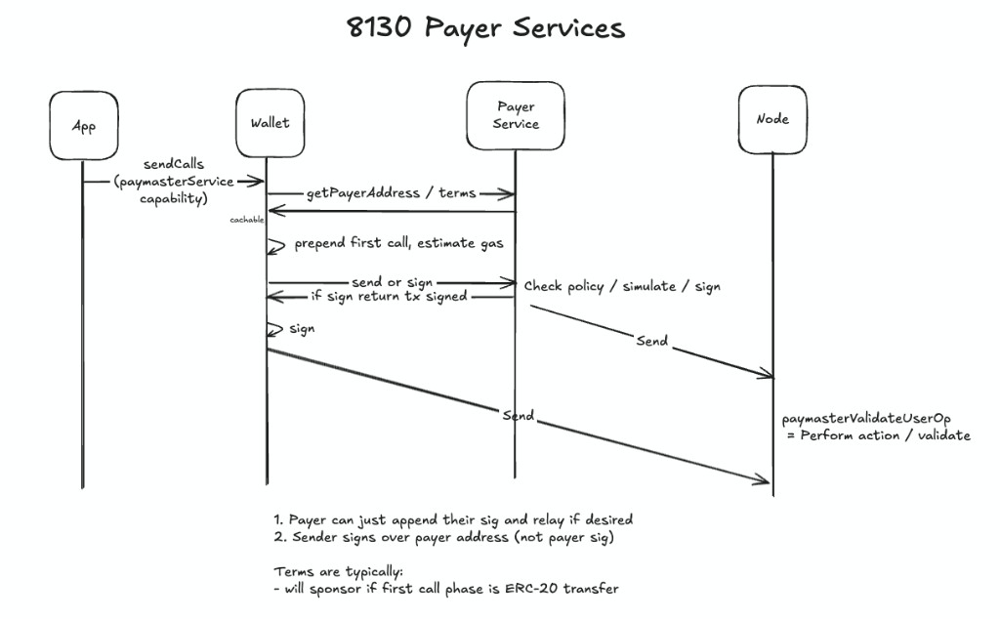

## Abstract

[ERC-7677](./eip-7677.md) defines the `paymasterService` capability for [EIP-5792](./eip-5792.md), allowing apps to direct wallets to a sponsorship web service. This proposal extends that capability to [EIP-8130](./eip-8130.md) by defining `payer_*` RPC methods that wallets use when constructing [EIP-8130](./eip-8130.md) transactions. Apps pass the same `paymasterService` URL they already use; the wallet selects the appropriate RPC methods based on the transaction type it is constructing. This proposal additionally defines sponsorship **balances**, so a wallet can read how much sponsorship budget or prepaid credit a sender has remaining (e.g., a subscription gas allowance) and fall back to token payment when it is exhausted.

## Motivation

[EIP-8130](./eip-8130.md) introduces native account abstraction where payers are first-class protocol participants that co-sign the transaction using the same `authenticator || data` authentication model as senders, validated with PAYER scope. This is fundamentally different from the [ERC-4337](./eip-4337.md) paymaster model:

- There is no EntryPoint contract or paymaster field injection flow.
- No stub-data/final-data two-phase dance is required; the payer simply co-signs.
- The payer signs the same transaction object that lands onchain.
- The payer can relay the transaction directly to the chain, reducing hops.
- [EIP-8130](./eip-8130.md) transactions have a native `expiry` field, enabling time-bounded sponsorship commitments enforced at the protocol level.

[ERC-7677](./eip-7677.md) defines the `pm_*` RPC methods for [ERC-4337](./eip-4337.md) user operations. Those methods do not apply to [EIP-8130](./eip-8130.md) because the two-phase `pm_getPaymasterStubData` / `pm_getPaymasterData` flow addresses concerns that do not exist in the [EIP-8130](./eip-8130.md) payer model. From an app's perspective, however, the intent is identical: "here is a sponsorship service URL." By extending [ERC-7677](./eip-7677.md)'s `paymasterService` capability rather than defining a new one, apps gain [EIP-8130](./eip-8130.md) support with zero code changes; the wallet selects the correct RPC methods based on the transaction type it is constructing.

One further need motivates this extension: **sponsorship is increasingly budgeted.** Apps and payers grant a sender a *finite* amount of free gas: a monthly allowance, a per-campaign cap, or prepaid credit. Wallets need to read the remaining balance to display it to the user and fall back gracefully once it is exhausted. This proposal adds a `balance` to the terms response and an OPTIONAL `payer_getBalance` method so a wallet can surface and act on that allowance.

## Specification

The key words "MUST", "MUST NOT", "REQUIRED", "SHALL", "SHALL NOT", "SHOULD", "SHOULD NOT", "RECOMMENDED", "NOT RECOMMENDED", "MAY", and "OPTIONAL" in this document are to be interpreted as described in RFC 2119 and RFC 8174.

### Payer Web Service Interface

Three core JSON-RPC methods (`payer_getTerms`, `payer_sendTransaction`, `payer_signTransaction`) and four OPTIONAL methods (`payer_fillTransaction`, `payer_getOptions`, `payer_getCapabilities`, `payer_getBalance`).

These methods are **transport-agnostic**: the `payer_*` prefix denotes the *role* of the responder (acting as a payer), not a specific transport. They MAY be served over an app- or wallet-provided HTTPS endpoint, or directly by a node's JSON-RPC when the node itself acts as payer (see [Sequencer / Builder-Native Gas Payment](#sequencer--builder-native-gas-payment)). No payer implements every method: a responder advertises exactly which it supports via the `methods` array of `payer_getCapabilities`, and wallets MUST only invoke advertised methods. For example, a co-sign-only service MAY expose `payer_signTransaction` but not `payer_sendTransaction`, and a sequencer acting as payer exposes only the read methods, with submission handled by `eth_sendRawTransaction`.

#### `payer_getTerms`

Returns sponsorship or token-payment terms for a transaction intent. Called *before* the sender signs. Payer services SHOULD validate the transaction intent at this stage and reject if they would not sponsor or accept payment.

##### `payer_getTerms` RPC Specification

```typescript
// [params]
type GetTermsParams = {
  chainId: `0x${string}`;
  from: `0x${string}`;
  calls: {
    to: `0x${string}`;
    value?: `0x${string}`;
    data?: `0x${string}`;
  }[];
  gasLimit?: `0x${string}`;
  preferredTokens?: `0x${string}`[];
  context?: Record<string, any>; // opaque app context (e.g. policyId) from the paymasterService capability
};

type GetTermsResult = {
  sponsored: boolean;
  expiry: number; // relative, seconds from current time
  ttl: number; // lifetime in seconds from time of response
  gasEstimate?: {
    gasLimit: `0x${string}`;
    maxFeePerGas: `0x${string}`;
    maxPriorityFeePerGas: `0x${string}`;
    overhead: `0x${string}`; // flat gas added on top of gasLimit to cover payer_auth_cost and payer operational overhead; included in reimbursement
  };
  tokenOptions?: {
    token: `0x${string}`;
    symbol: string;
    decimals: number;
    paymentAmount: `0x${string}`; // token amount the wallet transfers to `payer` in phase 0, quoted at the gas cap incl. overhead
    rate: {
      numerator: `0x${string}`; // token atomic units
      denominator: `0x${string}`; // per this many native wei
    };
    usdRate?: `0x${string}`; // optional: native token price in USD, 6 decimal fixed-point (e.g. "0x75BCD15" ≈ $1234.56); allows wallets to display the cost in USD without a separate price feed
    rateDisplay?: string; // optional human-readable form, e.g. "2050 USDC/ETH"
    rateExpiry: number; // relative, seconds from current time
    refund?: RefundPolicy;
  }[];
  requiredCalls?: {
    to: `0x${string}`;
    value?: `0x${string}`;
    data?: `0x${string}`;
  }[];
  recipient?: `0x${string}`;
  balance?: PayerBalance; // remaining sponsorship budget or prepaid credit for `from`
  conditions?: {
    maxExpiry?: number; // relative, seconds from current time
    minExpiry?: number; // relative, seconds from current time
    maxGasLimit?: `0x${string}`;
  };
  payer: `0x${string}`;
  endpoint: string;
  sponsor?: {
    name: string;
    icon?: string;
  };
};
```

`PayerBalance` is shared by `payer_getTerms` and `payer_getBalance`:

```typescript
type PayerBalance = {
  kind: "sponsorship" | "credit";
  available: string; // remaining amount, atomic units of `asset`
  limit?: string; // total budget or cap, atomic units
  spent?: string; // total lifetime spent (if tracked), atomic units
  asset: string; // token contract address, "native", or ISO-4217 code
  symbol?: string;
  decimals?: number;
  resetAt?: number; // when a periodic sponsorship budget next refills (seconds)
  expiry?: number; // when the balance/credit expires (seconds)
  // Source attribution: REQUIRED when returned by an aggregator fronting
  // multiple services, so the wallet can tell which service holds the balance.
  payer?: `0x${string}`; // the payer/service address this balance is held with
  endpoint?: string; // that service's endpoint URL
  name?: string; // human-readable service name, e.g. "Coinbase One"
};
```

`RefundPolicy` describes when unused gas is returned to `from`, shared by `tokenOptions` and `payer_getCapabilities`. Its **presence** means refunds are offered; its absence means none are:

```typescript
type RefundPolicy = {
  settlement: "in_block" | "deferred"; // when the refund is delivered
  window?: number; // deferred only: upper bound in seconds until settled (e.g. 86400 ≈ next day)
};
```

`settlement: "in_block"` is a refund a block builder settles in a block epilogue in the same block it includes the transaction (see [Sequencer / Builder-Native Gas Payment](#sequencer--builder-native-gas-payment)); it is same-block and deterministic. `settlement: "deferred"` is a refund the payer issues later (out-of-band or in a subsequent transfer) within `window` seconds.

##### Field Notes

**`gasEstimate`**: Wallets SHOULD treat this as authoritative for [EIP-8130](./eip-8130.md) transactions. On a supporting node, `eth_estimateGas` called with the unsigned 8130 transaction (`payer_auth` left empty) accurately estimates the sender's required `gas_limit`; `payer_auth_cost` is metered separately by the payer outside `gas_limit` and does not need to be present for estimation. On a non-8130-aware node, estimating the user's calls as a legacy transaction omits the sender-side 8130 intrinsic additions: `AA_BASE_COST`, `sender_auth_cost`, `account_changes` processing, and `auto_delegation_cost`. The payer's `gasEstimate` is the recommended source because the payer constructs the exact transaction shape it will co-sign and its `conditions.maxGasLimit` is the binding constraint. A wallet that estimates directly on a supporting node MAY do so as long as it satisfies `conditions.maxGasLimit`. `overhead` is a flat gas figure the payer adds on top of `gasLimit` to cover its own `payer_auth_cost` and operational overhead; reimbursement is sized at `(gasLimit + overhead) × maxFeePerGas`. `overhead` is part of the *reimbursement* basis only and is not added to the transaction's `gas_limit` field, which remains the sender-side estimate constrained by `conditions.maxGasLimit`.

**`tokenOptions`**: Accepted tokens and pricing for gas payment when not fully sponsoring, or as a fallback when a `balance` is exhausted. `paymentAmount` is the token amount the wallet transfers to `payer` in phase 0, quoted at the gas cap including `gasEstimate.overhead`; transferring `paymentAmount` always covers the transaction while terms are valid. `rate` is the cacheable primitive for re-pricing across multiple transactions (see [Terms Expiry and Caching](#terms-expiry-and-caching)). `usdRate` is the native token price in USD as a 6-decimal fixed-point hex integer (e.g. `0x75BCD15` ≈ `$1234.56`); when present, wallets can display the gas cost in USD without sourcing a separate ETH/USD price feed. `usdRate` shares the same `rateExpiry` as the token rate and MUST NOT be used after that time.

**`refund`**: When present, the payer refunds the difference between `paymentAmount` (quoted at the gas cap) and the transaction's actual gas cost after it lands, settling `paymentAmount − (gas_used × effective_gas_price + overhead)`, priced back through `rate`, to `from`. `settlement` says when: in the same block (`"in_block"`) or later within `window` seconds (`"deferred"`). When `refund` is absent, `paymentAmount` is final and the wallet MUST present it as the charged amount with no refund expectation. The phase 0 transfer itself is never partial; refunds are always a separate settlement.

**`requiredCalls`**: Calls the wallet MUST prepend to phase 0 as a condition of sponsorship, for example a commitment to a privacy pool or a required protocol interaction. The payer validates their presence in `payer_sendTransaction` / `payer_signTransaction` and MUST reject if missing or altered.

**`recipient`**: An address the payer requires to receive value from execution. The payer MUST verify this condition (via simulation, static analysis, or proof) before co-signing, and MUST reject in `payer_sendTransaction` / `payer_signTransaction` if it is not satisfied. Enables solver-style payers that sponsor transactions they profit from (e.g., a DEX aggregator that only sponsors trades routed through its contract).

**`balance`**: Remaining sponsorship budget or prepaid credit for `from`. `kind: "sponsorship"` is a free budget the payer covers on the sender's behalf; `kind: "credit"` is spendable prepaid value. `available`, `limit`, and `spent` let the wallet render progress (e.g., "$5 of $10 used"). A `balance` is **advisory**: a snapshot at response time, not a spend commitment. The binding decision is always made in `payer_getTerms` / `payer_sendTransaction`. The `balance.payer` and `balance.endpoint` source-attribution fields are intended for aggregator responses where the inline balance may belong to a downstream service distinct from the terms `payer`; non-aggregator payers SHOULD omit them since the top-level `payer` and `endpoint` already identify the service.

**`expiry`**: The recommended transaction `expiry` the wallet SHOULD set on the EIP-8130 transaction constructed with these terms, expressed as a relative duration in seconds from the current time. The wallet calculates the absolute on-chain expiry as `current_time + expiry`. The payer's co-signing commitment is bounded by this value; it will not co-sign a transaction whose absolute `expiry` exceeds `current_time + conditions.maxExpiry`. Subject to `conditions.maxExpiry` / `conditions.minExpiry`. This is distinct from `ttl`: a payer may quote a 30-second transaction expiry while the rate itself is cacheable for an hour.

**`ttl`**: How long this quote may be cached and reused, in seconds. Wallets MAY cache and reuse terms for `ttl` seconds, recomputing the phase 0 amount from the cached `rate` (`amount = ceil((gas_limit + overhead) × max_fee_per_gas × rate.numerator / rate.denominator)`) rather than calling `payer_getTerms` again. `ttl` is independent of `expiry`: for example, a payer may allow a rate to be cached for one hour while requiring each transaction to have a 30-second `expiry`. Re-request once `ttl` elapses or the selected option's `rateExpiry` passes, whichever is sooner.

**`payer` / `endpoint`**: The payer address the wallet MUST set in the EIP-8130 transaction, and the endpoint URL to use for `payer_sendTransaction` / `payer_signTransaction`. When called directly, `endpoint` echoes the URL being used. When called through an aggregator, `endpoint` identifies the *downstream* payer service that will co-sign; the wallet uses this URL for follow-up calls rather than the aggregator's URL.

**`conditions`**: Constraints the wallet MUST satisfy. `maxGasLimit` is the binding gas cap; `maxExpiry` / `minExpiry` constrain the transaction's onchain `expiry` field (the allowed range around the `expiry` value recommended at the top level of the terms response, expressed as relative durations in seconds).

**`sponsor`**: Optional display info for the sponsoring party. `icon` MUST be a data URI (RFC-2397), minimum 96×96px. Wallets MUST render SVG icons via `` to prevent untrusted JavaScript execution.

##### Terms Expiry and Caching

`ttl` bounds how long the full terms response is valid for caching, including the `payer` address, `gasEstimate`, token `rate`s, and `conditions`. Wallets MAY cache and reuse terms across multiple transactions for `ttl` seconds, recomputing the phase 0 amount from `rate` rather than calling `payer_getTerms` again. Token-specific `paymentAmount` values are exact only for the quoted gas parameters; `rate` is the cacheable primitive for re-pricing. The wallet MUST re-request once `ttl` elapses or the selected option's `rateExpiry` (whichever is sooner) has passed.

`expiry`, `maxExpiry`, and `minExpiry` are expressed as relative durations in seconds to enable caching. When a wallet constructs a transaction using cached terms, it computes the absolute on-chain expiry as `current_time + expiry` (or another value within `current_time + minExpiry` and `current_time + maxExpiry`). This allows a payer to cache a rate for an hour (`ttl: 3600`) while still requiring each individual transaction to expire in 30 seconds (`expiry: 30`).

##### `payer_getTerms` Example Parameters

```json
{
  "chainId": "0x2105",
  "from": "0xAaAaAaAaAaAaAaAaAaAaAaAaAaAaAaAaAaAaAaAa",
  "calls": [
    {
      "to": "0x833589fCD6eDb6E08f4c7C32D4f71b54bdA02913",
      "data": "0xa9059cbb..."
    }
  ],
  "gasLimit": "0xC350",
  "preferredTokens": ["0x833589fCD6eDb6E08f4c7C32D4f71b54bdA02913"]
}
```

##### `payer_getTerms` Example Return Value (Full Sponsorship)

```json
{
  "sponsored": true,
  "expiry": 30,
  "ttl": 300,
  "gasEstimate": {
    "gasLimit": "0xC350",
    "maxFeePerGas": "0x59682F00",
    "maxPriorityFeePerGas": "0x59682F00",
    "overhead": "0x2710"
  },
  "conditions": {
    "maxExpiry": 60
  },
  "payer": "0xCcCcCcCcCcCcCcCcCcCcCcCcCcCcCcCcCcCcCcCc",
  "endpoint": "https://payer.example.com/v1",
  "sponsor": {
    "name": "My App"
  }
}
```

##### `payer_getTerms` Example Return Value (Token Payment)

```json
{
  "sponsored": false,
  "expiry": 30,
  "ttl": 300,
  "gasEstimate": {
    "gasLimit": "0xC350",
    "maxFeePerGas": "0x59682F00",
    "maxPriorityFeePerGas": "0x59682F00",
    "overhead": "0x2710"
  },
  "tokenOptions": [
    {
      "token": "0x833589fCD6eDb6E08f4c7C32D4f71b54bdA02913",
      "symbol": "USDC",
      "decimals": 6,
      "paymentAmount": "0x30D40",
      "rate": {
        "numerator": "0x7A308480",
        "denominator": "0xDE0B6B3A7640000"
      },
      "rateDisplay": "2050 USDC/ETH",
      "rateExpiry": 300,
      "refund": {
        "settlement": "deferred",
        "window": 86400
      }
    }
  ],
  "conditions": {
    "maxExpiry": 60
  },
  "payer": "0xCcCcCcCcCcCcCcCcCcCcCcCcCcCcCcCcCcCcCcCc",
  "endpoint": "https://payer.example.com/v1"
}
```

##### `payer_getTerms` Example Return Value (Budgeted Sponsorship with Token Fallback)

The sender is enrolled in a subscription that grants free gas on the network. The payer sponsors and reports the remaining allowance ($5 of a $10 monthly budget), and also offers token payment as a fallback for when the budget is exhausted.

```json
{
  "sponsored": true,
  "expiry": 30,
  "ttl": 300,
  "gasEstimate": {
    "gasLimit": "0xC350",
    "maxFeePerGas": "0x59682F00",
    "maxPriorityFeePerGas": "0x59682F00",
    "overhead": "0x2710"
  },
  "balance": {
    "kind": "sponsorship",
    "available": "5000000",
    "limit": "10000000",
    "spent": "5000000",
    "asset": "0x833589fCD6eDb6E08f4c7C32D4f71b54bdA02913",
    "symbol": "USDC",
    "decimals": 6,
    "resetAt": 1738368000
  },
  "tokenOptions": [
    {
      "token": "0x833589fCD6eDb6E08f4c7C32D4f71b54bdA02913",
      "symbol": "USDC",
      "decimals": 6,
      "paymentAmount": "0x30D40",
      "rate": {
        "numerator": "0x7A308480",
        "denominator": "0xDE0B6B3A7640000"
      },
      "rateDisplay": "2050 USDC/ETH",
      "rateExpiry": 300
    }
  ],
  "conditions": {
    "maxExpiry": 60
  },
  "payer": "0xCcCcCcCcCcCcCcCcCcCcCcCcCcCcCcCcCcCcCcCc",
  "endpoint": "https://payer.example.com/v1",
  "sponsor": {
    "name": "Coinbase One"
  }
}
```

#### `payer_sendTransaction`

Accepts a sender-signed [EIP-8130](./eip-8130.md) transaction, co-signs it, and submits it onchain. Returns the transaction hash. The transaction MUST have the `payer` field set to the payer's address and `payer_auth` left empty; the payer service fills in `payer_auth` with `authenticator || data` after validating the transaction. Payers MUST NOT mutate any sender-signed fields. If the payer cannot accept the transaction as-is (e.g., gas limit too low), it MUST reject and SHOULD return actionable error data.

##### `payer_sendTransaction` RPC Specification

```typescript
type SendTransactionParams = {
  signedTransaction: `0x${string}`;
  context?: Record<string, any>;
};

type SendTransactionResult = {
  transactionHash: `0x${string}`;
  tokenCharged?: {
    token: `0x${string}`;
    amount: `0x${string}`;
  };
};
```

##### `payer_sendTransaction` Example Parameters

```json
{
  "signedTransaction": "0x...",
  "context": {
    "appId": "my-app"
  }
}
```

##### `payer_sendTransaction` Example Return Value

```json
{
  "transactionHash": "0x1234abcd..."
}
```

##### `payer_sendTransaction` Example Return Value (Token Payment)

```json
{
  "transactionHash": "0x1234abcd...",
  "tokenCharged": {
    "token": "0x833589fCD6eDb6E08f4c7C32D4f71b54bdA02913",
    "amount": "0x30D40"
  }
}
```

#### `payer_signTransaction`

Accepts a sender-signed [EIP-8130](./eip-8130.md) transaction, co-signs it, and returns the fully-signed transaction without submitting. The wallet is responsible for submission. Same transaction format and constraints as `payer_sendTransaction`.

##### `payer_signTransaction` RPC Specification

```typescript
type SignTransactionParams = {
  signedTransaction: `0x${string}`;
  context?: Record<string, any>;
};

type SignTransactionResult = {
  signedTransaction: `0x${string}`;
  tokenCharged?: {
    token: `0x${string}`;
    amount: `0x${string}`;
  };
};
```

##### `payer_signTransaction` Example Parameters

```json
{
  "signedTransaction": "0x...",
  "context": {
    "appId": "my-app"
  }
}
```

##### `payer_signTransaction` Example Return Value

```json
{
  "signedTransaction": "0x..."
}
```

#### `payer_fillTransaction` (OPTIONAL)

Accepts a transaction intent and returns a **filled, unsigned** [EIP-8130](./eip-8130.md) transaction together with the terms it was filled against. It is the construction-side sibling of `payer_signTransaction` (co-sign, no submit) and `payer_sendTransaction` (co-sign and submit), mirroring `eth_fillTransaction`: partial intent in, complete unsigned transaction out. The payer does not sign (`payer_auth` is left empty) and does not submit.

This is a convenience for wallets that would otherwise re-implement the [Transaction Construction](#transaction-construction) phase table. The payer, which knows its own phase 0 requirements (token transfer, `requiredCalls`, recipient), assembles them, sets the `payer` field, fills gas parameters from its own estimate, and chooses an `expiry` within its conditions. The wallet then signs `sender_auth` over the returned transaction and calls `payer_sendTransaction` or `payer_signTransaction`.

The returned transaction is **not** a commitment and MUST NOT be signed blindly. The wallet MUST verify the filled transaction against the returned `terms` and its own intent before signing, in particular that phase 1 contains exactly the user's calls, that any phase 0 calls match `terms.requiredCalls` and the quoted token transfer, and that `gas_limit` and `expiry` are within bounds. The wallet remains authoritative for `nonce_key` / `nonce_sequence`: it MAY pass them in `params`, and the payer MUST use the supplied values when present rather than reading or inventing a nonce. Where realizing a call's `value` requires the account's own wallet bytecode (see [Transaction Construction](#transaction-construction)), the wallet supplies the already-encoded `calls`; the payer MUST NOT rewrite sender call data beyond prepending its own phase 0.

##### `payer_fillTransaction` RPC Specification

```typescript
type FillTransactionParams = {
  chainId: `0x${string}`;
  from: `0x${string}`;
  calls: {
    to: `0x${string}`;
    value?: `0x${string}`;
    data?: `0x${string}`;
  }[];
  paymentToken?: `0x${string}`; // omit to request full sponsorship; set to pay gas in this token
  nonceKey?: `0x${string}`; // wallet-selected parallel-nonce lane; payer MUST honor if present
  nonceSequence?: `0x${string}`; // wallet-selected sequence; payer MUST honor if present
  gasLimit?: `0x${string}`;
  context?: Record<string, any>; // opaque app context from the paymasterService capability
};

type FillTransactionResult = {
  unsignedTransaction: `0x${string}`; // EIP-8130 tx with `payer` set, phases built, `payer_auth` empty
  terms: GetTermsResult; // the terms this transaction was filled against, for wallet verification
};
```

##### `payer_fillTransaction` Example Parameters

```json
{
  "chainId": "0x2105",
  "from": "0xAaAaAaAaAaAaAaAaAaAaAaAaAaAaAaAaAaAaAaAa",
  "calls": [
    {
      "to": "0x833589fCD6eDb6E08f4c7C32D4f71b54bdA02913",
      "data": "0xa9059cbb..."
    }
  ],
  "paymentToken": "0x833589fCD6eDb6E08f4c7C32D4f71b54bdA02913"
}
```

##### `payer_fillTransaction` Example Return Value

```json
{
  "unsignedTransaction": "0x...",
  "terms": {
    "sponsored": false,
    "expiry": 30,
    "ttl": 300,
    "gasEstimate": {
      "gasLimit": "0xC350",
      "maxFeePerGas": "0x59682F00",
      "maxPriorityFeePerGas": "0x59682F00",
      "overhead": "0x2710"
    },
    "tokenOptions": [
      {
        "token": "0x833589fCD6eDb6E08f4c7C32D4f71b54bdA02913",
        "symbol": "USDC",
        "decimals": 6,
        "paymentAmount": "0x30D40",
        "rate": {
          "numerator": "0x7A308480",
          "denominator": "0xDE0B6B3A7640000"
        },
        "rateExpiry": 300
      }
    ],
    "payer": "0xCcCcCcCcCcCcCcCcCcCcCcCcCcCcCcCcCcCcCcCc",
    "endpoint": "https://payer.example.com/v1"
  }
}
```

#### `payer_getBalance` (OPTIONAL)

Returns a sender's **standing** balances (budgeted sponsorship allowances and prepaid credit) held with the payer, **without** a transaction intent. Wallets use it to show users how much free gas or credit they have and to decide whether to attempt sponsorship or fall back to payment before assembling an intent.

This method returns only **intent-independent** balances: a `sponsorship` allowance (e.g., a subscription's monthly free-gas budget) or a `credit` balance the sender holds. It MUST NOT attempt to enumerate intent-based full sponsorship; whether a payer will sponsor a *specific* transaction is evaluated per intent in `payer_getTerms`. When an intent is available, use `payer_getTerms` instead; the applicable balance is returned inline via the `balance` field on the terms result. A payer with no standing balance for `from` returns an empty `balances` array.

When the endpoint is an aggregator fronting multiple services, each returned balance MUST carry source attribution (`payer`, `endpoint`, and SHOULD carry `name`) so the wallet can tell which service holds it. To target a single service, set `payer` (the service's address) or `endpoint` (its URL) in params; the aggregator returns only that service's balances. Service identities are discoverable via `payer_getCapabilities`. A payer MAY return multiple balances (e.g., a `sponsorship` allowance and a `credit` balance). When invoked through an app-provided `paymasterService`, the caller MAY pass the capability's `context` to scope the result to an app- or policy-specific allowance.

##### `payer_getBalance` RPC Specification

```typescript
type GetBalanceParams = {
  from: `0x${string}`;
  chainId?: `0x${string}`; // optional execution-chain filter
  payer?: `0x${string}`; // aggregator: scope to a single service by address
  endpoint?: string; // aggregator: scope to a single service by endpoint URL
  kind?: ("sponsorship" | "credit")[]; // filter; e.g. ["credit"] to list only credit
  context?: Record<string, any>; // opaque app context (e.g. policyId) to scope the balance
};

type GetBalanceResult = {
  balances: PayerBalance[];
  ttl: number; // how long this snapshot may be cached, in seconds
};
```

##### `payer_getBalance` Example (Aggregator: Two Services)

Two services are fronted by the aggregator: a subscription with a monthly sponsorship allowance, and a gas-market service where the user holds prepaid credit.

```json
{
  "balances": [
    {
      "kind": "sponsorship",
      "available": "3200000",
      "limit": "5000000",
      "spent": "1800000",
      "asset": "0x833589fCD6eDb6E08f4c7C32D4f71b54bdA02913",
      "symbol": "USDC",
      "decimals": 6,
      "resetAt": 1738368000,
      "payer": "0xCcCcCcCcCcCcCcCcCcCcCcCcCcCcCcCcCcCcCcCc",
      "endpoint": "https://payer.coinbase.com/v1",
      "name": "Coinbase One"
    },
    {
      "kind": "credit",
      "available": "12500000",
      "asset": "0xaf88d065e77c8cC2239327C5EDb3A432268e5831",
      "symbol": "USDC",
      "decimals": 6,
      "payer": "0xDdDdDdDdDdDdDdDdDdDdDdDdDdDdDdDdDdDdDdDd",
      "endpoint": "https://gas.market/v1",
      "name": "Gas Market"
    }
  ],
  "ttl": 30
}
```

#### `payer_getOptions` (OPTIONAL)

Returns a ranked list of payer options for a transaction intent. Options are either `sponsored` (payer covers gas unconditionally) or `conditional` (payer covers gas subject to a requirement: token payment, required calls, or execution profit to a recipient). MAY be implemented by individual payers or aggregator services.

Note: `tokenPayment.estimatedAmount` is an approximation for display purposes; it is not a firm quote. The binding payment amount is `paymentAmount` returned in `tokenOptions` by `payer_getTerms` after the wallet selects a payer from this list.

##### `payer_getOptions` RPC Specification

```typescript
type GetOptionsParams = {
  chainId: `0x${string}`;
  from: `0x${string}`;
  calls: {
    to: `0x${string}`;
    value?: `0x${string}`;
    data?: `0x${string}`;
  }[];
  paymentToken?: `0x${string}`;
  gasLimit?: `0x${string}`;
  context?: Record<string, any>; // opaque app context from the paymasterService capability
};

type PayerOption = {
  type: "sponsored" | "conditional";
  payer: `0x${string}`;
  endpoint: string;
  sponsor?: {
    name: string;
    icon?: string;
    reason?: string;
  };
  tokenPayment?: {
    token: `0x${string}`;
    symbol: string;
    decimals: number;
    estimatedAmount: `0x${string}`;
    rate: {
      numerator: `0x${string}`;
      denominator: `0x${string}`;
    };
    usdRate?: `0x${string}`; // optional: native token price in USD, 6 decimal fixed-point
    rateDisplay?: string;
    rateExpiry: number; // relative, seconds from current time
  };
  conditions?: {
    maxExpiry?: number; // relative, seconds from current time
    minExpiry?: number; // relative, seconds from current time
    maxGasLimit?: `0x${string}`;
  };
  priority?: number;
};

type GetOptionsResult = {
  options: PayerOption[];
};
```

##### `payer_getOptions` Example Return Value

```json
{
  "options": [
    {
      "type": "sponsored",
      "payer": "0xabc...",
      "endpoint": "https://sponsor.example.com/v1",
      "sponsor": {
        "name": "Circle",
        "reason": "USDC transfers are sponsored"
      },
      "priority": 0
    },
    {
      "type": "conditional",
      "payer": "0xdef...",
      "endpoint": "https://gas.market/v1",
      "tokenPayment": {
        "token": "0x833589fCD6eDb6E08f4c7C32D4f71b54bdA02913",
        "symbol": "USDC",
        "decimals": 6,
        "estimatedAmount": "0x1F4",
        "rate": {
          "numerator": "0x773D3520",
          "denominator": "0xDE0B6B3A7640000"
        },
        "rateDisplay": "2000.50 USDC/ETH",
        "rateExpiry": 300
      },
      "conditions": {
        "maxExpiry": 60
      },
      "priority": 1
    }
  ]
}
```

#### `payer_getCapabilities` (OPTIONAL)

Returns a static, **intent-free** description of what a payer accepts: which chains it serves, which tokens it accepts for gas payment, whether it offers full sponsorship, and its standing conditions. Takes no `from` and no `calls`: it answers "what does this payer support?" rather than "what are the terms for this transaction?".

Wallets and aggregators use this for discovery without a probe transaction, for example to populate a token picker before a user builds an intent. Because the descriptor is independent of any transaction, it is a portable payer profile: a payer configures what it accepts once and any aggregator can ingest and list it. The result's `ttl` indicates how long it may be cached; capabilities change infrequently so wallets SHOULD cache and refresh on `ttl` expiry rather than per transaction. A payer MAY filter the response to a single chain when `chainId` is supplied.

This method is discovery only, not a commitment. A payer MAY still reject a specific transaction in `payer_getTerms` / `payer_sendTransaction` for policy, balance, or allowlist reasons.

The `methods` array is authoritative: it lists exactly the `payer_*` methods the responder implements, and wallets MUST NOT invoke a method absent from it. It also tells the wallet which submission path to take. Payers vary in which they support; a co-sign-only service MAY list `payer_signTransaction` but not `payer_sendTransaction`. When `methods` lists neither co-sign method, the payer does not co-sign over RPC: the wallet submits via `eth_sendRawTransaction` with `payer_auth` left empty, and inclusion by the recognized sentinel `payer` is the authorization (see [Sequencer / Builder-Native Gas Payment](#sequencer--builder-native-gas-payment)).

##### `payer_getCapabilities` RPC Specification

```typescript
// [params]
type GetCapabilitiesParams = {
  chainId?: `0x${string}`; // optional filter; omit to list all supported chains
};

type PayerChainCapabilities = {
  chainId: `0x${string}`;
  payer: `0x${string}`;
  endpoint?: string; // omitted when served by a node acting as payer (the node's own RPC is the endpoint)
  feeRecipient?: `0x${string}`; // phase 0 token destination; defaults to `payer`
  fullSponsorship: boolean; // offers unconditional gas sponsorship, subject to policy
  acceptedTokens: {
    token: `0x${string}`;
    symbol: string;
    decimals: number;
  }[];
  methods: string[]; // authoritative list of payer_* methods this responder implements; wallets MUST only invoke listed methods
  refund?: RefundPolicy; // refund policy for token payment, if any
  conditions?: {
    maxGasLimit?: `0x${string}`;
    minExpiry?: number; // relative, seconds from current time
    maxExpiry?: number; // relative, seconds from current time
  };
  sponsor?: {
    name: string;
    icon?: string;
  };
};

type GetCapabilitiesResult = {
  chains: PayerChainCapabilities[];
  ttl: number; // lifetime of this descriptor in seconds
};
```

##### `payer_getCapabilities` Example Return Value

```json
{
  "chains": [
    {
      "chainId": "0x2105",
      "payer": "0xCcCcCcCcCcCcCcCcCcCcCcCcCcCcCcCcCcCcCcCc",
      "endpoint": "https://payer.example.com/v1",
      "fullSponsorship": true,
      "acceptedTokens": [
        {
          "token": "0x833589fCD6eDb6E08f4c7C32D4f71b54bdA02913",
          "symbol": "USDC",
          "decimals": 6
        },
        {
          "token": "0xcbB7C0000aB88B473b1f5aFd9ef808440eed33Bf",
          "symbol": "cbBTC",
          "decimals": 8
        }
      ],
      "methods": [
        "payer_getCapabilities",
        "payer_getTerms",
        "payer_fillTransaction",
        "payer_sendTransaction",
        "payer_signTransaction",
        "payer_getBalance"
      ],
      "conditions": {
        "maxGasLimit": "0x1C9C380"
      },
      "sponsor": {
        "name": "My Payer"
      }
    }
  ],
  "ttl": 3600
}
```

### Error Codes

Payer services MUST use the following error codes when rejecting requests. Error responses SHOULD include a `data` field with actionable details (e.g., suggested gas limit, updated terms). These codes occupy the `-32000` to `-32099` range JSON-RPC 2.0 reserves for implementation-defined server errors; they MUST NOT reuse the codes JSON-RPC reserves for protocol errors (`-32600` Invalid Request, `-32601` Method not found, `-32602` Invalid params, `-32603` Internal error, `-32700` Parse error), which payers continue to use with their standard meanings.

| Code | Message | Description |
|------|---------|-------------|
| -32001 | `INVALID_TRANSACTION` | Malformed or invalid [EIP-8130](./eip-8130.md) transaction |
| -32002 | `UNSUPPORTED_TOKEN` | Token in the phase 0 transfer not accepted by this payer |
| -32003 | `RATE_EXPIRED` | Terms from `payer_getTerms` have expired; re-request |
| -32004 | `PAYMENT_INSUFFICIENT` | Token transfer amount in phase 0 is below the required cost |
| -32005 | `EXPIRY_OUT_OF_BOUNDS` | Transaction expiry does not satisfy payer conditions |
| -32006 | `POLICY_REJECTED` | Payer policy rejected this transaction |
| -32007 | `PAYER_BALANCE_INSUFFICIENT` | Payer lacks ETH to cover gas |
| -32008 | `SENDER_BLOCKLISTED` | Sender is blocklisted for the specified token |
| -32009 | `BALANCE_EXHAUSTED` | Sender's sponsorship budget or prepaid credit is depleted |

### `paymasterService` Capability

This proposal reuses the `paymasterService` capability defined in [ERC-7677](./eip-7677.md). The app-side interface is identical: apps pass a URL and optional context. The wallet determines which RPC methods to call based on the transaction type it is constructing.

#### App Implementation

Apps provide wallets with a service URL using the `paymasterService` capability as part of an [EIP-5792](./eip-5792.md) `wallet_sendCalls` or [ERC-7836](./eip-7836.md) `wallet_prepareCalls` call, exactly as specified in [ERC-7677](./eip-7677.md).

```json
[
  {
    "version": "1.0",
    "chainId": "0x2105",
    "from": "0xd46e8dd67c5d32be8058bb8eb970870f07244567",
    "calls": [
      {
        "to": "0x833589fCD6eDb6E08f4c7C32D4f71b54bdA02913",
        "data": "0xa9059cbb..."
      }
    ],
    "capabilities": {
      "paymasterService": {
        "url": "https://payer.example.com/v1",
        "context": {
          "policyId": "962b252c-a726-4a37-8d86-333ce0a07299"
        }
      }
    }
  }
]
```

For [EIP-8130](./eip-8130.md) transactions, the wallet uses the `payer_*` methods defined in this specification. For [ERC-4337](./eip-4337.md) user operations, the wallet uses the `pm_*` methods from [ERC-7677](./eip-7677.md). The wallet MUST forward the capability's `context` object to `payer_getTerms` so the payer can apply the app's policy when quoting, and to `payer_sendTransaction` / `payer_signTransaction` at co-sign time. The `context` is opaque to the wallet.

#### Wallet Implementation

To conform to this specification, wallets constructing [EIP-8130](./eip-8130.md) transactions that wish to leverage payer-sponsored transactions:

1. MUST indicate support for the `paymasterService` capability in their response to an [EIP-5792](./eip-5792.md) `wallet_getCapabilities` call.
2. MUST call the `payer_*` methods defined in this specification (not the `pm_*` methods from [ERC-7677](./eip-7677.md)) when constructing [EIP-8130](./eip-8130.md) transactions.
3. SHOULD make calls to and use the values returned by the payer service. Since the app-provided payer may not ultimately be used (due to service failure or user selection), applications MUST NOT assume that the payer provided to a wallet is the entity that pays for transaction fees.

```json
{
  "0x2105": {
    "paymasterService": {
      "supported": true
    }
  }
}
```

#### `wallet_sendCalls` Flow

When `wallet_sendCalls` is called with the `paymasterService` capability and the wallet is constructing an [EIP-8130](./eip-8130.md) transaction:

1. Wallet OPTIONALLY calls `payer_getTerms` at the provided URL.
2. Wallet constructs the [EIP-8130](./eip-8130.md) transaction with call phases, the `payer` field set to the payer's address, and `payer_auth` empty (see [Transaction Construction](#transaction-construction)).
3. Wallet signs the transaction (`sender_auth`).
4. Wallet calls `payer_sendTransaction` (relay) or `payer_signTransaction` (co-sign only) at the payer endpoint.
5. Payer validates the transaction, fills in `payer_auth`, and submits or returns the co-signed transaction.

A wallet MAY replace steps 1–2 with a single `payer_fillTransaction` call, then continue from step 3 after verifying the returned transaction against the accompanying `terms`.

Below is a diagram illustrating the full flow.



#### `wallet_prepareCalls` Flow (ERC-7836)

When `wallet_prepareCalls` is called with the `paymasterService` capability and the wallet is constructing an [EIP-8130](./eip-8130.md) transaction:

1. Wallet OPTIONALLY calls `payer_getTerms` to negotiate payment terms.
2. Wallet constructs the unsigned [EIP-8130](./eip-8130.md) transaction incorporating negotiated terms with the `payer` field set to the payer's address.
3. Wallet computes the transaction digest and returns it to the app.
4. App signs the digest (e.g., with a session key) and calls `wallet_sendPreparedCalls`.
5. Wallet assembles the signed transaction and calls `payer_sendTransaction` or `payer_signTransaction`.

This enables apps to use session keys ([ERC-7836](./eip-7836.md)) while leveraging external payers for gas sponsorship or token payment, without the app needing to implement the payer RPC protocol.

### Wallet-Selected Payers

The `paymasterService` capability covers the case where an *app* directs the wallet to a service. It is not the only source of a payer. A wallet that wants its users to pay gas in a token, with no app involvement, selects a payer itself and uses the same `payer_*` methods.

Typical wallet-configured payers:

- a payer service the wallet operator runs or contracts with, configured per chain;
- the chain's block builder (L2 sequencer or L1 proposer) acting as payer directly (see [Sequencer / Builder-Native Gas Payment](#sequencer--builder-native-gas-payment)); or
- an option the user picks from a `payer_getOptions` result.

To populate a token picker before any transaction is built, the wallet SHOULD call `payer_getCapabilities` on its configured payers and cache the result for `ttl`. The per-token `rate` is fetched from `payer_getTerms` once the user has chosen.

When both an app-provided `paymasterService` and a wallet-default payer are available, the wallet decides which to use, for example preferring app sponsorship when offered and falling back to its default token-payment payer otherwise. Because `sender_auth` binds the chosen `payer`, the user always signs the exact payer that will be used.

### Transaction Construction

The [EIP-8130](./eip-8130.md) AA transaction wire format is:

```
AA_TX_TYPE || rlp([
  chain_id, sender, nonce_key, nonce_sequence, expiry,
  max_priority_fee_per_gas, max_fee_per_gas, gas_limit,
  account_changes, calls,
  payer, sender_auth, payer_auth
])
```

`calls` is a two-level array of phases: `[[call, ...], [call, ...]]` where each `call` is `[to, data]`. Phases execute in order; each phase is atomic (all-or-nothing), but completed phases persist independently.

Note on `value`: [EIP-8130](./eip-8130.md) calls carry no protocol value; each on-chain `call` is `[to, data]` with `msg.value == 0`. The wallet realizes any non-zero intent `value` through the account's wallet bytecode (e.g., an `executeBatch` call that performs the value-bearing CALL). An intent call whose `value` is `0` or omitted is encoded directly as `[to, data]`.

#### Constructing the Transaction

Given terms from `payer_getTerms`, the wallet constructs the transaction as follows:

1. **Set `payer`** to the `payer` address from the terms response.
2. **Set `nonce_key` and `nonce_sequence`**: select a `nonce_key` (a parallel-nonce lane; `0` for sequential ordering) and read the next `nonce_sequence` for `(sender, nonce_key)` via `eth_getTransactionCount`.
3. **Set `expiry`** to `terms.expiry` (the value recommended by the payer). The wallet MUST verify it satisfies `conditions.maxExpiry` / `conditions.minExpiry` if those bounds are present.
4. **Set gas parameters** (`max_fee_per_gas`, `max_priority_fee_per_gas`, `gas_limit`) from the payer's `gasEstimate` (recommended) or the wallet's own [EIP-8130](./eip-8130.md)-aware estimation, respecting `conditions.maxGasLimit`.
5. **Construct `calls`** using call phases:

| Payer Model | Phase 0 | Phase 1 |
|---|---|---|
| Full sponsorship | — | `[user_calls]` |
| Token payment | `[token.transfer(payer, paymentAmount)]` | `[user_calls]` |
| Required calls | `[required_calls]` | `[user_calls]` |
| Token + required | `[token_transfer, required_calls]` | `[user_calls]` |

For token payment, the transfer amount is the selected option's `paymentAmount`; a wallet reusing cached terms recomputes it from `rate`. For full sponsorship with no phase 0 requirements, the wallet MAY use a single phase: `[[user_calls]]`.

**Balance-funded sponsorship** (a `sponsorship` allowance or prepaid `credit`) uses the full-sponsorship construction with no phase 0 transfer. The payer is reimbursed off-chain from the sender's budget when it co-signs.

6. **Leave `payer_auth` empty**: the payer fills this in after receiving the sender-signed transaction.
7. **Sign**: compute `sender_signature_hash` over all fields through `payer` (excluding `sender_auth` and `payer_auth`) and produce `sender_auth`.

#### Token Payment via Call Phases

[EIP-8130](./eip-8130.md) calls carry no ETH value; token transfers are executed through contract calls. For token payment, the wallet constructs a phase 0 call that transfers tokens from the sender to the payer:

```
phase_0 = [
  [token_address, abi.encodeCall(IERC20.transfer, (payer_address, paymentAmount))]
]
```

This uses `IERC20.transfer` — a push from the sender — rather than `transferFrom`. **No token approval is required.** This is a significant simplification over [ERC-4337](./eip-4337.md) paymaster flows, which require the sender to pre-approve the paymaster contract (or inject an `approve()` call into the UserOperation's calldata) before the paymaster can pull payment in `postOp`.

Transferring `paymentAmount` is always sufficient while terms are valid. Phase 0 commits independently, so the payer receives tokens regardless of whether the user's calls in phase 1 succeed or revert; this is how the payer is compensated.

#### Payer Co-Signing

The payer receives the sender-signed transaction (with `payer_auth` empty), validates it against its terms, computes `payer_signature_hash` using `AA_PAYER_TYPE` (see [EIP-8130](./eip-8130.md) Signature Payload), and fills in `payer_auth` with `authenticator || data`. The payer's actor MUST have PAYER scope in its `actor_config` on the payer account.

A payer service MAY delegate co-signing to a separate **signing service** that custodies the PAYER-scoped key, for example to separate pricing and policy logic from key management and submission. The `payer` field always identifies the account whose actor signs, so `sender_auth` binds the transaction to that account regardless of which operator runs the endpoint.

#### Token Cost Transparency

Because the token cost is fixed before the sender signs, wallets can display it precisely. The displayed fee is the phase 0 transfer amount: `paymentAmount` rendered with the option's `decimals` and `symbol`. A wallet pricing from cached terms derives the amount as `ceil((gas_limit + overhead) × max_fee_per_gas × rate.numerator / rate.denominator)` and may show `rateDisplay` as supporting context. When `usdRate` is present, the wallet can additionally display an approximate USD cost as `paymentAmount × usdRate / (10^decimals × 10^6)`. When no `refund` is offered, this is the final charge; when a `refund` policy is present, it is an upper bound and the wallet MAY indicate that unused gas is refunded. The quote is valid until `rateExpiry`; after that the wallet MUST re-request terms.

### Sequencer / Builder-Native Gas Payment

A block builder (an L2 sequencer or L1 proposer) can act as payer directly, served from the node's own JSON-RPC rather than a separate web service. The chain recognizes the builder's sentinel `payer` address, so `payer_auth` is left empty and **inclusion is itself the builder's authorization**. The builder advertises this by listing only the read methods in `payer_getCapabilities.methods`, with no co-sign method. No co-sign round trip is needed: the wallet submits the sender-signed transaction with `eth_sendRawTransaction`, and the recognized `payer` field is the in-band signal that the builder sponsors it. (Where a chain does *not* recognize a sentinel payer, a builder can still act as an ordinary payer and co-sign like any other.)

The same `payer_*` read methods describe the builder. A node-served payer advertises `payer_getCapabilities` (and optionally `payer_getTerms` for an exact quote) and omits the co-sign methods:

```json
{
  "chains": [
    {
      "chainId": "0x2105",
      "payer": "0x5e5e5e5e5e5e5e5e5e5e5e5e5e5e5e5e5e5e5e5e",
      "feeRecipient": "0xFee0000000000000000000000000000000000000",
      "fullSponsorship": false,
      "acceptedTokens": [
        { "token": "0x833589fCD6eDb6E08f4c7C32D4f71b54bdA02913", "symbol": "USDC", "decimals": 6 }
      ],
      "methods": ["payer_getCapabilities", "payer_getTerms"],
      "refund": { "settlement": "in_block" },
      "conditions": { "maxGasLimit": "0x1C9C380" }
    }
  ],
  "ttl": 3600
}
```

#### Flow

```mermaid
sequenceDiagram
    participant U as Wallet
    participant N as Sequencer node (RPC + builder)
    participant C as Chain

    Note over U,N: A. Discovery (cached for ttl)
    U->>N: payer_getCapabilities(chainId)
    N-->>U: { payer (sentinel), feeRecipient, acceptedTokens,<br/>methods: [read only], refund: "in_block", maxGasLimit }

    Note over U: B. Construct 8130 tx locally
    Note over U: payer = sentinel; phase0 = [USDC.transfer(feeRecipient, paymentAmount@cap)];<br/>phase1 = [user calls]; payer_auth EMPTY; sign sender_auth

    U->>N: eth_sendRawTransaction(signedTx)
    N-->>U: transactionHash

    Note over N,C: C. Inclusion (builder validates off-chain)
    N->>C: phase0: sender → feeRecipient (paymentAmount); phase1: user calls; builder pays native gas

    Note over N,C: D. Bottom-of-block settlement
    N->>C: epilogue refund = paymentAmount − (gas_used × eff_price + overhead) × rate, feeRecipient → sender
```

1. **Discovery (cacheable).** The wallet calls `payer_getCapabilities` on the node to learn the sentinel `payer`, `feeRecipient`, accepted tokens, the read-only `methods` set (no co-sign method), `refund`, and `conditions`. Optionally it calls `payer_getTerms` for an exact `paymentAmount`; otherwise it prices from a cached `rate`.
2. **Construct.** The wallet sets `payer` to the sentinel address, builds phase 0 `token.transfer(feeRecipient, paymentAmount)` priced at the gas cap `(gas_limit + overhead) × max_fee_per_gas × rate`, phase 1 = user calls, leaves `payer_auth` empty, and signs `sender_auth`.
3. **Submit.** The wallet calls `eth_sendRawTransaction`, not `payer_sendTransaction`. The node accepts the empty `payer_auth` precisely because `payer` is its recognized sentinel.
4. **Inclusion.** Before including, the builder validates off-chain that the phase 0 token is accepted, the amount covers `(gas_limit + overhead) × max_fee_per_gas × rate`, and the sender holds the balance. A builder never includes a transaction that would not reimburse it. Phase 0 pays `feeRecipient`; phase 1 runs the user's calls; the builder's native gas is reimbursed by the phase 0 transfer.
5. **Bottom-of-block refund.** When `refund.settlement` is `"in_block"`, the builder knows actual `gas_used` at block construction and issues `refund = paymentAmount − (gas_used × effective_gas_price + overhead) × rate` from `feeRecipient` back to `sender` in a block epilogue. Because the builder controls block production, this refund is same-block and deterministic, strictly stronger than an off-chain `sla`.

#### Validity and Dropping

Nodes and builders MAY drop a transaction when:

- the phase 0 transfer **underpays** (its amount no longer covers `(gas_limit + overhead) × max_fee_per_gas × rate` at the current rate), or
- the sender's token **balance no longer covers** the phase 0 transfer amount.

This mirrors ordinary insufficient-fee and insufficient-balance handling: the transaction becomes non-includable rather than failing on-chain.

### Endpoint Versioning

Payer service endpoints MUST use path-based major versioning (e.g., `/v1`, `/v2`). Method names remain stable across versions. Breaking changes (new required fields, changed semantics) require a new major path version. Additive optional fields in request or response are backwards-compatible within the same version. Clients MUST ignore unknown fields. Payers MUST NOT require new optional fields within an existing version.

## Rationale

### Why `payer_getTerms` Is Optional

For known payers (e.g., an app's own backend), the wallet can skip `payer_getTerms` and call `payer_sendTransaction` or `payer_signTransaction` directly. The payer rejects with an actionable error code if terms are not met. This optimistic path reduces round trips for the common case. Payer services MUST return sufficient error detail (e.g., `RATE_EXPIRED` with updated terms in error `data`) to enable recovery without a separate terms call.

### Why New RPC Methods

While the `paymasterService` capability is shared, the RPC methods must differ. [ERC-7677](./eip-7677.md)'s two-phase `pm_getPaymasterStubData` / `pm_getPaymasterData` flow exists because [ERC-4337](./eip-4337.md) paymasters inject data into the UserOperation before gas estimation, and the stub data must produce consistent code paths and byte lengths. In [EIP-8130](./eip-8130.md), the payer simply co-signs the complete transaction; there is no paymaster data injection, no stub values, and no code path consistency concern. The `payer_*` methods reflect this simpler model. Service providers that support both wallet types SHOULD implement both method sets at the same endpoint URL.

### `payer_sendTransaction` vs `payer_signTransaction`

Two separate methods rather than a mode parameter, mirroring the `eth_sendTransaction` / `eth_signTransaction` convention:

- **`payer_sendTransaction`** minimizes hops: the payer co-signs and submits in one step. This is the common case for app-sponsored transactions.
- **`payer_signTransaction`** gives the wallet submission control, useful for high-value transactions, MEV-sensitive paths, or when the wallet wants to use private mempools.

Payer services SHOULD implement both where applicable, but MAY implement only one; for example, a co-sign-only service that does not want submission liability exposes `payer_signTransaction` alone, and a sequencer exposes neither (the wallet submits via `eth_sendRawTransaction`). The wallet MUST consult the `methods` array from `payer_getCapabilities` to learn the supported submission path, then chooses which to call; the choice is the wallet's, not the app's.

### `payer_fillTransaction` and the `eth_fill` Analogy

`payer_sendTransaction` and `payer_signTransaction` deliberately mirror `eth_sendTransaction` / `eth_signTransaction`. That family has a third member, `eth_fillTransaction`, which takes a partial transaction, fills the missing fields, and returns a complete *unsigned* transaction without signing or broadcasting. `payer_fillTransaction` is that member: it lets the payer, rather than every wallet, own the [EIP-8130](./eip-8130.md) construction logic (phase assembly, the phase 0 token transfer, `requiredCalls`, gas, `payer` field), returning a transaction the wallet need only sign.

It is OPTIONAL, not a replacement for `payer_getTerms`, for two reasons. First, a wallet cannot blindly sign a transaction assembled by a remote service; it MUST still verify the filled transaction against the returned `terms`, so the abstract-terms contract remains the source of truth for what the wallet must enforce. Second, the wallet, not the payer, owns nonce selection and any value-realization through the account's own bytecode; `payer_fillTransaction` therefore honors wallet-supplied nonce fields and never rewrites sender call data. The method trades a round trip and centralizes construction for wallets that want it, while `payer_getTerms` remains available for wallets that construct transactions themselves.

### Gas Estimation

On a supporting node, `eth_estimateGas` called with the unsigned 8130 transaction (`payer_auth` left empty) accurately estimates the sender's `gas_limit`; `payer_auth_cost` is metered separately by the payer outside `gas_limit` and does not factor into estimation. On a non-8130-aware node, estimating the user's calls as a legacy transaction omits the sender-side intrinsic additions: `AA_BASE_COST`, `sender_auth_cost`, `account_changes` processing, and `auto_delegation_cost`. The payer's `gasEstimate` is the recommended source because the payer constructs the exact transaction shape it will co-sign and `conditions.maxGasLimit` is the binding constraint; a wallet that estimates directly on a supporting node MAY do so as long as it satisfies the payer's conditions.

### Intent-Free Capability Descriptor

`payer_getTerms` and `payer_getOptions` require a sender and concrete calls because they return a *quote* for that transaction. That shape is wrong for two common needs: populating a token picker before a user has assembled a transaction (requiring a probe transaction just to show payment options is awkward and leaks intent), and aggregators listing payers without sending speculative quote requests to every service.

`payer_getCapabilities` answers the static question of what this payer supports, separately from the per-transaction question. It deliberately omits pricing: a `rate` is only meaningful against a specific gas cost and freshness window, so it stays in `payer_getTerms`. Keeping the descriptor pricing-free also lets it be cached aggressively and published as a portable payer profile: a payer declares what it accepts once, and any aggregator can ingest and list it.

**Pre-intent token pricing.** Wallets that want to show indicative token rates before a user has assembled an intent — for example, to render a token picker with "~2.05 USDC for gas" — have two options: (1) reuse a `rate` cached from a recent `payer_getTerms` response for the same payer, valid until `rateExpiry`; or (2) call `payer_getTerms` with a minimal representative intent (e.g. a small native transfer) to obtain a fresh rate, then cache it. Option (1) is preferred when the wallet has transacted recently. This is the practical equivalent of vendor-specific intent-free rate endpoints the `usdRate` field on `tokenOptions` further reduces the need for a separate price feed in the common case.

### Expiry as a Sponsorship Primitive

[EIP-8130](./eip-8130.md) transactions have a native `expiry` field enforced at the protocol level. Payers express time-bounded commitments via `conditions.maxExpiry`; the protocol guarantees the transaction cannot land after that time. This is strictly stronger than [ERC-4337](./eip-4337.md), where paymasters must encode and validate time bounds in their own data during execution.

### Sponsorship Balance

Budgeted sponsorship is increasingly common (e.g., subscription products that bundle gas). Surfacing the remaining `balance` lets a wallet show the user what they have left and route accordingly: use the free allowance while it lasts, then fall back to token payment or another payer.

`payer_getBalance` is scoped to **standing, intent-independent** balances only; whether a payer will fully sponsor *this specific* transaction cannot be answered without the calls and is left to `payer_getTerms`. The `balance` is advisory rather than a commitment: policy and concurrency can change what the payer accepts at co-sign time, so wallets MUST handle `BALANCE_EXHAUSTED` and other rejections regardless of an earlier balance response. Payers MUST enforce the actual budget server-side and MUST NOT rely on the wallet honoring the advertised balance.

## Backwards Compatibility

This proposal extends the `paymasterService` capability defined in [ERC-7677](./eip-7677.md) with new RPC methods for [EIP-8130](./eip-8130.md) transactions. Existing [ERC-4337](./eip-4337.md) wallets are unaffected and continue using the `pm_*` methods. Apps that already pass a `paymasterService` capability require no changes to support [EIP-8130](./eip-8130.md) wallets, provided their service endpoint implements the `payer_*` methods defined here.

## Security Considerations

**API key exposure**: Payer service URLs commonly contain API keys. App developers SHOULD proxy payer requests through their own backend to keep keys secret, identical to the recommendation in [ERC-7677](./eip-7677.md). Payer services SHOULD support scoped API keys restricted to specific methods.

**Relay trust**: In relay mode, the wallet trusts the payer to submit the transaction. The transaction's `expiry` field bounds this exposure; if the payer does not submit before expiry, the transaction is dead. Wallets concerned about relay trust SHOULD use cosign mode and submit themselves.

**Rate commitment**: Once a payer returns terms with a `rateExpiry`, the payer SHOULD honor those terms until expiry. Because `paymentAmount` is quoted at the gas cap, transferring it already absorbs normal gas movement; wallets pricing from a cached `rate` can add a small buffer and use short expiry windows to stay includable.

**Balances are advisory**: A returned `balance` MUST NOT be treated as a spend guarantee. Wallets MUST handle `BALANCE_EXHAUSTED` and other rejections at co-sign time, since concurrent transactions or policy may invalidate a stale balance snapshot. Payers MUST enforce the actual budget server-side and MUST NOT rely on the wallet honoring the advertised balance.

## Copyright

Copyright and related rights waived via [CC0](../LICENSE.md).
