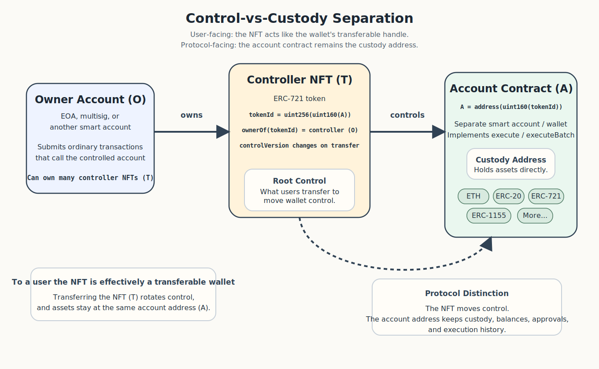
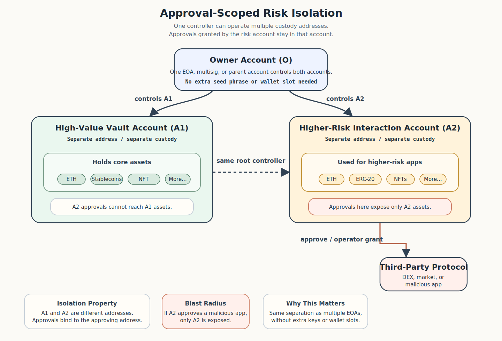
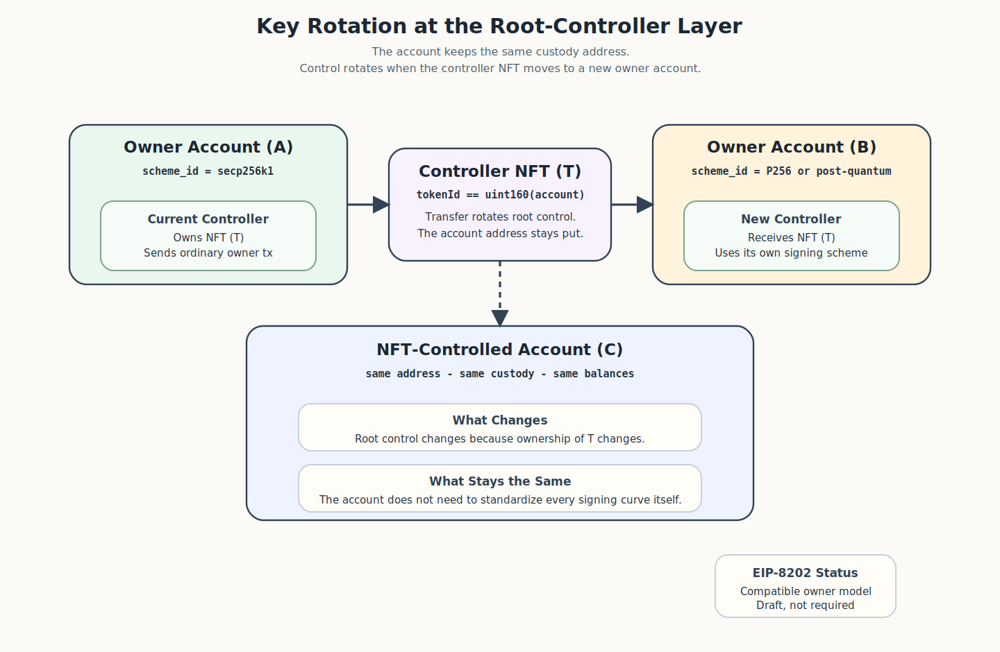
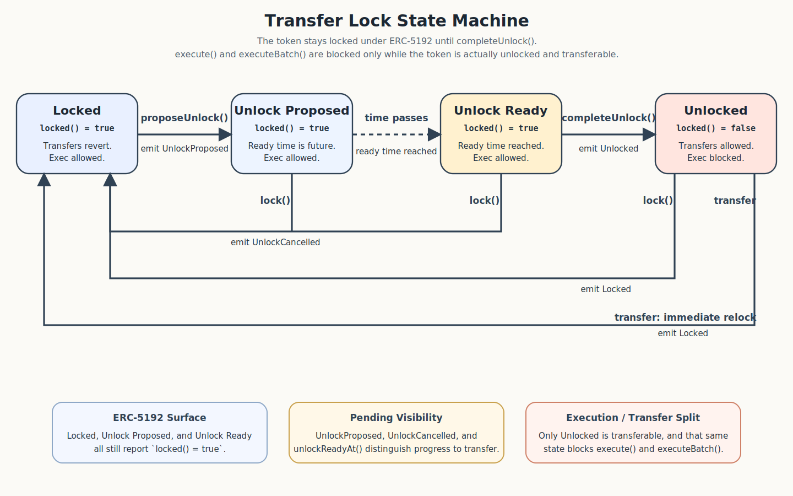
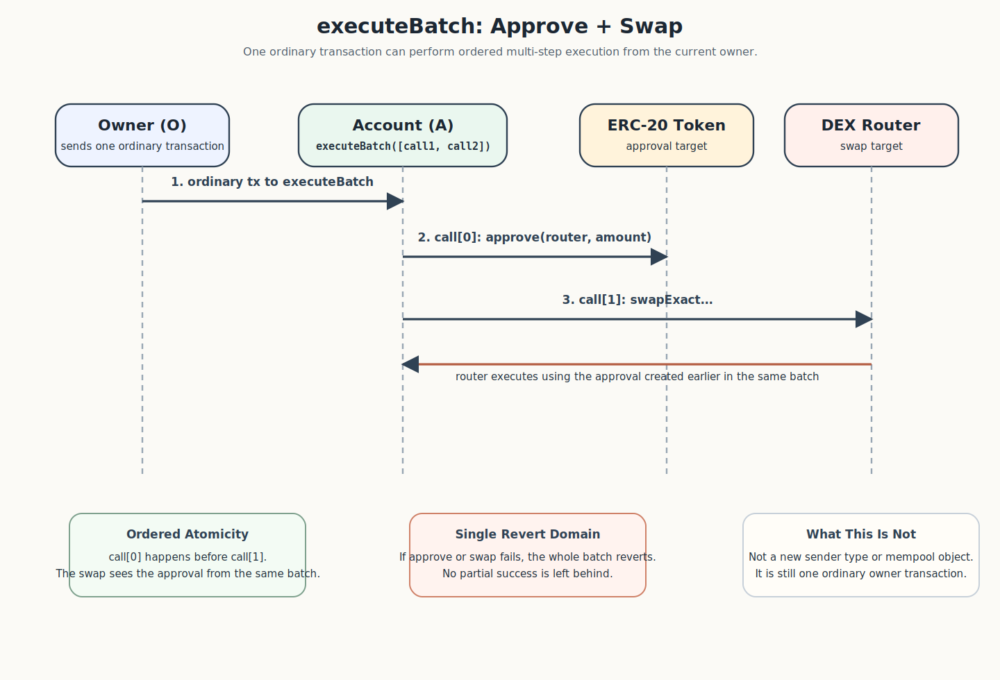

## Abstract

This ERC achieves account abstraction (AA) through NFT-controlled smart accounts. The controlling NFT functions as a title instrument: its utility is the practical ability to operate the corresponding account, making it a transferable control credential rather than a collectible, membership, or claim.

Using existing standards and ordinary transactions, without new consensus changes, it provides:

- **Programmable wallets** - smart-contract accounts holding assets directly.
- **Key rotation** - transfer the NFT to rotate control without moving assets or sharing keys.
- **Alternative signing** - at the owner-account layer (including post-quantum via Scheme-Agile Transactions[^4]) and through delegated validators (passkeys, multisig, zk-based, [ERC-7913](./eip-7913.md)).
- **Social recovery** - guardian-initiated recovery culminating in NFT transfer.
- **Batching** - atomic multi-call execution in a single transaction.
- **Signer-account separation** - if Contract Payer Transaction[^6] is adopted, the account at `tx.to` pays gas for direct execution, achieving true separation of signer and account on-chain. The EOA is purely a signing key; the smart account is the wallet, identity, address, and gas payer.
- **Gas sponsorship** - optional signed execution path where any third party relays the controller's signed request as an ordinary transaction, without [ERC-4337](./eip-4337.md) infrastructure.
- **FOCIL censorship resistance** - both direct and signed execution are ordinary protocol transactions visible to [EIP-7805](./eip-7805.md) inclusion-list builders.
- **VOPS statelessness** - no account-specific state required for mempool validation; nodes validate by sender or relayer nonce and balance only.
- **Privacy-pool withdrawal** - atomic deployment and sponsored execution without prior on-chain ownership disclosure.

Because the control object is a standard [ERC-721](./eip-721.md) token and the account is a separate smart contract, the design also enables capabilities beyond conventional AA.

These include transferable account sales and organisational handoffs through a single NFT transfer; hierarchical account trees for corporate, fund, and departmental structures; approval-scoped risk isolation across accounts under unified control; digital inheritance via a dead-man's switch or multisig holders; escrow and vesting without custodians; and account-level collateralisation where a lending protocol can assess and liquidate an entire account rather than individual tokens.

It defines smart contract accounts whose root control is determined by ownership of a dedicated [ERC-721](./eip-721.md) token. For each compliant controlling token `tokenId`, the corresponding account address is `address(uint160(tokenId))`.

From the user's perspective, the controller NFT is a transferable wallet. At the protocol level, the account contract remains the wallet and custody address, while the NFT is the root-control object.

Ownership of the controlling NFT defines root control over the corresponding account. Transferring the NFT rotates control to the new holder without moving assets and without exposing the previous controller's keys. This enables full account transfer, including sale, gift, or organizational handoff, through a standard NFT transfer rather than key sharing or signer-storage migration.

Because the account holds its assets directly, transferring the controlling NFT transfers root execution authority over the whole account in one atomic operation rather than through individual asset transfers. Token-level approvals ([ERC-20](./eip-20.md) `approve`, [ERC-721](./eip-721.md) `setApprovalForAll`, [ERC-1155](./eip-1155.md) operator approvals) previously granted by the account survive transfer and must be managed separately by the new controller. The account MAY hold ETH, [ERC-20](./eip-20.md), [ERC-721](./eip-721.md), [ERC-1155](./eip-1155.md), and other assets, and MUST support arbitrary execution and atomic batch execution.

A single owner address MAY hold multiple controlling NFTs and therefore control multiple distinct NFT-controlled accounts. Because a compliant account MAY itself hold [ERC-721](./eip-721.md) assets, including controlling NFTs, an NFT-controlled account MAY itself control child NFT-controlled accounts. This permits hierarchical account trees.

This ERC does not standardize any wallet UI or "folder" semantics for such hierarchies.

The ERC also defines deterministic deployment, transfer-aware authorization invalidation through a token-side control version, compatibility with [ERC-1271](./eip-1271.md), and an optional validator mechanism for delegated signature validation. It is intended to deliver batching, programmable execution, and alternative root-controller account models using existing standards rather than new consensus changes. [EIP-7702](./eip-7702.md) provides an EOA-code path, and Scheme-Agile Transactions[^4] proposes scheme-agile transactions for EOAs, enabling post-quantum key migration by transferring the controlling NFT to an owner account that uses a post-quantum signature scheme.

The ERC also defines an optional signed execution path: the controller signs an [EIP-712](./eip-712.md) execution request and any third party submits it as an ordinary transaction, paying gas on the controller's behalf. When implemented, this provides gas-sponsored and relayed execution without requiring [ERC-4337](./eip-4337.md) infrastructure, an EntryPoint singleton, a bundler network, or a paymaster protocol. The account MAY additionally implement [ERC-4337](./eip-4337.md) when integration with the bundler marketplace, paymaster ecosystem, or tooling is desired.

Direct owner execution remains an ordinary execution-payload transaction, so it is compatible with public-mempool inclusion mechanisms such as [EIP-7805](./eip-7805.md) and aligns with the local-validation goals described in "Validity-Only Partial Statelessness" (VOPS)[^3]. Signed execution preserves that property because the relayer's transaction is also an ordinary execution-payload transaction. This does not automatically extend to individual [ERC-4337](./eip-4337.md) `UserOperation`s, which remain off-protocol mempool objects.

## Motivation

This ERC separates control from custody so that users hold final authority over their accounts without surrendering it to intermediaries, custodians, or infrastructure operators. To users, holding the controller NFT feels like holding the wallet because transferring it transfers control. At the protocol level, custody stays with the account contract at address `A`, while root control is an [ERC-721](./eip-721.md) token whose `tokenId` encodes `A`. A user MAY hold that NFT in an EOA, a multisig, another smart account, or a scheme-agile owner account if the chain environment supports it. The controlled account remains a separate contract account.



### Hierarchical control

Control is not limited to one account. Any address MAY own multiple controller NFTs and therefore control multiple accounts. Because a compliant account MAY itself hold [ERC-721](./eip-721.md) tokens, including controller NFTs, it MAY also control child NFT-controlled accounts. This yields nested account trees that map cleanly to organizations: a treasury or DAO can control subsidiary accounts for different functions, each with its own approval surface and risk profile, and divestiture is a single transfer of the subsidiary's controller NFT while its assets, positions, and history remain intact. Fund structures work the same way: a parent account can hold child-account controller NFTs for different strategies or asset classes, and transferring the parent's controller token transfers the whole fund. Wallets and applications MAY present these hierarchies as folders, subaccounts, vaults, or some other navigation metaphor, but this ERC standardizes only the control and execution semantics, not the UI.


Nesting matters because it combines transferability with isolated custody. An account that holds controller NFTs for child accounts has hierarchical control over isolated accounts with separate custody, approval surfaces, and execution histories. Transfer of a child's controller NFT is a divestiture. Transfer of the parent's controller NFT transfers the entire tree. The parent can rebalance across children atomically via `executeBatch`. Each child is its own blast-radius boundary. The nesting depth is configurable via `maxNestingDepth()`. The result is on-chain organizational structure with subsidiaries, delegation, isolation, and transfer - enforced by the EVM.

The controller-NFT ownership chain is the organizational structure:

```
HoldCo (root account)
  +-- Treasury (child)
  +-- Operations (child)
  |     +-- Engineering (grandchild)
  |     +-- Marketing (grandchild)
  +-- Investments (child)
        +-- Fund A (grandchild)
        +-- Fund B (grandchild)
```

Each node is a separate custody address with its own balances, approvals, and execution history. Transferring the `Operations` controller NFT to a new parent is a restructuring. Transferring `HoldCo`'s controller NFT is an acquisition. The structure is not an overlay on the contracts; it is the ownership graph. Auditors can verify it on-chain by walking the controller-token ownership chain. Aggregate balance sheets are computable by enumerating child accounts via [ERC-721](./eip-721.md) Enumerable. Governance voting power can follow the same hierarchy. Each restructuring, divestiture, or acquisition is a single NFT transfer with an on-chain audit trail.

### Risk isolation and delegation

Multiple accounts under one controller provide approval-scoped risk isolation without requiring multiple keys. Because each account is a separate contract at a separate address, token-level approvals ([ERC-20](./eip-20.md) `approve`, [ERC-721](./eip-721.md) `setApprovalForAll`, [ERC-1155](./eip-1155.md) operator approvals) granted by one account do not affect any other. A user MAY hold high-value assets in one account and interact with higher-risk protocols from another, both controlled by the same EOA or parent account. An unlimited approval granted to a compromised or malicious contract from the higher-risk account cannot reach assets held by the other. This is the same isolation that used to require separate seed phrases or hardware-wallet slots for distinct EOAs, achieved here through separate custody addresses under unified root control.

This also complements session-key schemes. Session keys limit what a delegated signer may do; child accounts limit what there is to lose. A user can fund a purpose-specific child account with only the assets needed for the task. If the child is compromised, the loss is bounded by its balance rather than by the expressiveness of a permission policy. A delegated signer (hot key, agent, or session validator) is still needed on the child for unattended operation, but the blast radius of that delegation is capped by the child's account boundary rather than by policy design alone.

The combination of NFT ownership and delegated validators also supports organizational signing structures. An organization holds the controller NFT as root control, then installs validators that authorize staff, departments, or external parties such as a bank providing a credit facility to sign on the account, analogous to a corporate card where the company owns the account and employees spend within policy limits. The organization can revoke any individual validator or call `resetDelegations(tokenId)` to invalidate all delegated authority at once, without transferring the NFT. Combined with child accounts, this extends to departmental budgets: a parent account controlled by the organization holds child-account controller NFTs, and each child is operated by a department head through a programmable parent that enforces spending limits and contract whitelists.


### Signer-account separation

Under signed execution, the controller's EOA already needs no ETH — a relayer pays gas and is reimbursed from the account's balance. But the controller still needs ETH for direct execution, where it calls the account directly. This ties the signer to the account financially: the EOA must hold ETH, which makes it more than a pure signing key.

A proposed protocol-level mechanism — Contract Payer Transaction[^6] — would eliminate this last dependency by introducing a new transaction type where the account at `tx.to` pays gas when the sender is registered in a canonical payer registry. If adopted, the controller EOA would need no ETH at all: the account's own ETH covers gas for both direct and signed execution. The EOA becomes purely a signing key — it holds no assets, pays no gas, and has no on-chain footprint beyond its signature. The smart account is the wallet, the identity, the address, and the gas payer. The separation is complete: signers sign, accounts hold.


The mechanism, its integration with this ERC's lock-state machine, and the gas-drain vector it must address during the unlock window are discussed in the Gasless controller operation section of the Rationale.

### Gas sponsorship

Gas sponsorship is handled through an optional signed execution path rather than external infrastructure alone. The controller signs an [EIP-712](./eip-712.md) execution request offline, and any third party submits it as an ordinary transaction. The submitter pays gas; the controller never sends a transaction. This provides relayed and sponsored execution without an [ERC-4337](./eip-4337.md) EntryPoint, bundler network, or paymaster protocol. Any address with enough ETH can act as a relayer: a friend, a dapp backend, a sponsor, or an automated service. No intermediary is structurally required, and no intermediary extracts rent as a condition of participation. Because the relayer submits an ordinary transaction, the signed execution path preserves the same public-mempool and [EIP-7805](./eip-7805.md) FOCIL compatibility as direct owner execution. Nodes can track, propagate, and inclusion-list it without account-specific mempool validation logic. An account MAY additionally implement [ERC-4337](./eip-4337.md) for access to the bundler marketplace, paymaster ecosystem, and tooling, but [ERC-4337](./eip-4337.md) is not required for gas sponsorship.

When implemented, signed execution also provides a standardized execution entrypoint for delegated signers. A session-key validator can authorize signed execution natively: the session key signs an execution request, a relayer or the session key holder submits it, the account's signature validation cascade reaches the session-key validator, and execution proceeds. This makes validator-driven execution a first-class capability without requiring [ERC-4337](./eip-4337.md) or a bespoke execution interface for each delegated-signer use case.



### Key rotation without identity loss

Today, changing who controls an account usually means changing the account's address. ENS names, governance voting history, Aave health factors, protocol allowlist memberships, and on-chain reputation are address-bound. Rotating keys therefore means abandoning identity. Users who want to move from a hot wallet to a cold storage multisig, or from an EOA to a post-quantum signature scheme, face a choice between security and continuity. This ERC removes that tradeoff. Transfer of the controlling NFT rotates root control while the account address, and everything bound to it, stays fixed. The recipient gains full control without ever knowing the previous controller's keys. Aave positions, Uniswap LP, Maker vaults, ENS names, governance history, protocol allowlists, and every other address-based relationship remain at the same address under a different security model. The account address is the identity; the controller NFT is the control mechanism. The NFT can be held by an EOA, a multisig, a scheme-agile account, a governance contract, or any other supported owner model, and moving it changes the security model without changing the identity.

### Account transfer, inheritance, and escrow

This also makes account transfer a first-class operation. An account with its position history, token balances, protocol memberships, and address-based reputation can be sold, gifted, or handed off through a single NFT transfer. For example, when a DAO changes its treasury management committee, the outgoing committee transfers the controller NFT to the new multisig. The treasury address, its protocol positions, its allowlists, and its on-chain reputation all persist, avoiding the multi-transaction, multi-governance-vote migration that would otherwise be needed. Because assets remain at the account address, one control rotation replaces what would otherwise require individual transfers of each balance and position, avoiding the gas cost, complexity, and failure risk of moving assets one by one.

The same mechanism supports digital inheritance: the controller NFT can be held by a dead man's switch contract or a multisig with designated heirs, so that a user's entire on-chain estate - assets, positions, memberships, and address-based identity - transfers to a successor through one NFT transfer rather than shared seed phrases or centralized custodians. More generally, because the controller NFT is a standard [ERC-721](./eip-721.md) token, any contract can hold it: a vesting contract that releases control after a schedule completes, an escrow that releases on payment confirmation, or a governance contract that executes account operations only after a vote passes. A vesting position can also be sold by transferring the beneficiary's claim without early release or key sharing, while the assets remain locked in the account.


Control transfer does not automatically revoke token-level approvals ([ERC-20](./eip-20.md) `approve`, [ERC-721](./eip-721.md) `setApprovalForAll`, [ERC-1155](./eip-1155.md) operator approvals) previously granted by the account to third-party contracts. Those approvals live on the token contracts and are not aware of controller-token transfer. ETH held by the account is not subject to this limitation: ETH has no approval mechanism, so the account's ETH balance transfers cleanly under the new controller's authority with no residual third-party access. [ERC-1271](./eip-1271.md) signatures issued under the previous control version are also automatically invalidated by the control-version increment. The operational consequences of surviving token approvals are discussed in Security Considerations.

### Public mempool and censorship resistance

The design aims to provide practical account-abstraction properties without a new consensus transaction format for the account itself, preserving the property that no gatekeeper can selectively prevent an account from operating.

[EIP-8141](./eip-8141.md) pursues related transaction-layer goals, including canonical paymaster handling and atomic batching. This ERC does not try to reproduce [EIP-8141](./eip-8141.md) as a protocol change. Instead, it standardizes an account model that can reach similar end-user outcomes through native smart-account execution.

Compatibility with public-mempool censorship-resistance mechanisms is deliberate. [EIP-7805](./eip-7805.md): Fork-choice enforced Inclusion Lists (FOCIL) builds inclusion lists from transactions pending in the public mempool, and its execution-layer omission check asks whether any missing inclusion-listed transaction could still be validly included by checking remaining gas together with the sender's nonce and balance after block execution. VOPS[^3] argues that nodes should retain just enough account data to validate pending transactions locally so they can maintain a public mempool and participate in FOCIL.


This ERC's direct-owner path preserves that shape. The user submits an ordinary transaction whose sender is the current NFT owner, or whatever transaction flow ultimately causes the current owner contract to call the account. Signed execution preserves it as well: a relayer submits an ordinary transaction carrying the controller's [EIP-712](./eip-712.md) signature; the relayer is the protocol-level sender, and signature verification happens during normal EVM execution. In both cases, the NFT-controlled account is the destination of execution, not a new sender type. In that respect, both paths are more naturally aligned with VOPS than [EIP-8141](./eip-8141.md)'s general frame-transaction model, whose public-mempool rules require nodes to simulate a validation prefix until `payer_approved = true`, enforce a bounded `MAX_VERIFY_GAS`, and reject prefixes that read disallowed state or use banned opcodes. The distinction is developed further in "Frame Transactions Through a Statelessness Lens"[^1] and "Mempool Strategies for EIP-8141"[^2]. This does not mean every [EIP-8141](./eip-8141.md) sender mode is incompatible with VOPS. It means this ERC does not require a new mempool-side EVM validation model for its direct-owner or signed execution paths.

### Alternative signing schemes

Alternative signing is handled primarily at the root-controller layer rather than only inside account validators. Scheme-Agile Transactions[^4] proposes a typed transaction whose `scheme_id` selects the signature algorithm, with initial schemes including secp256k1, P256/secp256r1, and post-quantum. Under this ERC, moving to a different root signing scheme can be as simple as transferring the controlling NFT to an owner account that uses that scheme. Because Scheme-Agile Transactions is still a draft pull request, this ERC treats it as a compatible owner model, not a hard dependency.



Validators remain useful, but for a narrower reason. They provide delegated signature validation for off-chain authorization flows and signer models that do not naturally map to an Ethereum address. [ERC-1271](./eip-1271.md) already permits arbitrary contract-side signature validation, including multisig and alternative signature schemes, and [ERC-7913](./eip-7913.md) is designed for signers that do not have their own Ethereum address.

## Specification

The key words "MUST", "MUST NOT", "REQUIRED", "SHALL", "SHALL NOT", "SHOULD", "SHOULD NOT", "RECOMMENDED", "NOT RECOMMENDED", "MAY", and "OPTIONAL" in this document are to be interpreted as described in RFC 2119 and RFC 8174 when, and only when, they appear in all capitals, as shown here.

### Core invariant

For each compliant controlling NFT `T` in canonical controller token contract `C`, there is exactly one corresponding smart contract account `A`, and `uint256(uint160(A)) == tokenId(T)`. From a user perspective, `T` functions as the wallet's transferable handle. At the protocol level, the account `A` is the wallet and custody address, and the NFT `T` is the control object. Transfer of `T` rotates root control over `A` without moving assets held by `A`.

The proposal distinguishes the following concepts:

- **NFT ownership** - `ownerOf(tokenId)` on the canonical controller token.
- **Account control** - the root right to operate the account or delegate limited authority.
- **Execution authorization** - the concrete mechanism by which a specific call is allowed.
- **Asset custody** - ETH and tokens are held by the account contract, not by the NFT.
- **Deployment state** - the account address is deterministic before deployment, but the NFT and runtime code come into existence only through the atomic deployment flow defined by this ERC.
- **Authentication method** - the cryptographic scheme used by the current NFT owner or by an authorized validator.

A compliant account is controlled by the current holder of the canonical controlling NFT, and all valid execution authority for that account is either exercised directly by that holder or delegated by that holder under the current control version. Recovery rotates control by transferring the controlling NFT and MUST NOT bypass NFT ownership as the root control source.

### Definitions

For the purposes of this ERC:

- **Controller token** means the canonical [ERC-721](./eip-721.md) contract implementing this ERC's token-side extension.
- **Controller tokenId** means the [ERC-721](./eip-721.md) tokenId that encodes the account address.
- **Account** means the smart contract wallet whose address is encoded in the tokenId.
- **Controller** means `ownerOf(tokenId)` on the canonical controller token contract.
- **Control version** means the monotonically increasing value returned by `controlVersionOf(tokenId)`.
- **Validator** means a contract authorized by the current controller for the current control version to validate delegated signatures or equivalent off-chain authorization proofs for the account.
- **Transfer approval version** means a per-token monotonically increasing counter used internally to invalidate stale [ERC-721](./eip-721.md) single-token approvals on the controller token.
- **Pending unlock delay change** means a requested reduction in `unlockDelayOf(tokenId)` that has been scheduled via `setUnlockDelay` but has not yet taken effect. Increases to the unlock delay take effect immediately and never produce a pending change. A pending change is surfaced by the `UnlockDelayChangePending` event and the `pendingUnlockDelayOf` view.
- **Deployed account** means an account whose controller token has been minted and whose runtime code has been deployed at the encoded address.
- **Execution hook** means a contract installed by the current controller that intercepts execution before and after each call for policy enforcement. Hooks are version-scoped and may be scoped to direct execution, signed execution, or both.
- **Signed execution** means an execution request authorized by the controller's [EIP-712](./eip-712.md) signature and submitted by a third-party relayer, rather than by a direct transaction from the controller.
- **Execution nonce** means a per-account monotonically increasing counter that provides replay protection for signed execution requests.

### Token model

The controlling token MUST be [ERC-721](./eip-721.md) compliant, MUST implement [EIP-165](./eip-165.md), and MUST implement [EIP-5192](./eip-5192.md). The controlling token SHOULD implement [ERC-721](./eip-721.md) Enumerable (`totalSupply`, `tokenByIndex`, `tokenOfOwnerByIndex`). The controlling token MUST also implement the extension interface defined in this ERC.

The root controller of the account encoded by `tokenId` MUST be `ownerOf(tokenId)` on the canonical controller token contract.

Neither [ERC-721](./eip-721.md) single-token approval nor any attempted operator approval MUST, by itself, grant account execution authority. An approved address is not a controller under this ERC.

#### Transfer approval version

A compliant controller token MUST maintain a per-token transfer approval version counter. All [ERC-721](./eip-721.md) single-token approvals (`approve`) MUST be recorded together with the current transfer approval version. When checking whether an address is approved to transfer a token, the controller token MUST verify that the approval was granted under the current transfer approval version; approvals granted under any prior version MUST be treated as non-existent.

A compliant controller token MUST revert any call to `setApprovalForAll`. Bulk operator approval is forbidden for the controller token because it would create a root-access vector over every account controlled by the approved operator.

A compliant controller token MUST increment the transfer approval version:

- on every successful transfer that emits `Transfer`,
- when `proposeUnlock(tokenId)` is called, and
- when `lock(tokenId)` is called.

This ensures that all prior single-token transfer approvals are automatically invalidated whenever the lock state changes or the token transfers. An attacker who obtained an approval before the token was locked cannot use that stale approval to transfer the token when the owner later unlocks it. Invalidation is signalled by the existing `Transfer` event and the [EIP-5192](./eip-5192.md) `Locked` and `Unlocked` events respectively; no additional lock-status event is required.

A compliant controller token MUST initialize `controlVersionOf(tokenId)` to `1` on mint and MUST increment `controlVersionOf(tokenId)` on every successful transfer that emits `Transfer`.

A compliant controller token MUST NOT allow burning of a controlling token.

The current `ownerOf(tokenId)` MAY call `resetDelegations(tokenId)` to invalidate delegated authority without transferring the controlling NFT. `resetDelegations` MUST increment `controlVersionOf(tokenId)` and MUST emit `ControlVersionChanged(tokenId, newVersion)`. Only the current `ownerOf(tokenId)` MAY call `resetDelegations`.

A compliant controller token MUST NOT allow transfer to the zero address or to `address(uint160(tokenId))` (the account controlled by the token). Transfers that would create self-ownership MUST revert.

#### Execution-active transfer guard

Before completing any transfer, the controller token MUST verify that the corresponding account has deployed code and is not currently executing. If either check fails, the transfer MUST revert. A transfer of a controller token with no corresponding runtime code is a fault state under this ERC's atomic deployment model, and a transfer during active execution would allow mid-execution control rotation.

The controller token MUST call `isExecutionActive()` on `address(uint160(tokenId))`. If `isExecutionActive()` returns `true`, the transfer MUST revert.

The RECOMMENDED mechanism for the code-presence check is `EXTCODEHASH`: revert if the hash is `keccak256("")` (existing account with no code) or `0x0` (non-existent account per [EIP-1052](./eip-1052.md)). Other mechanisms that reliably distinguish deployed accounts from codeless or non-existent addresses are compliant.

This prevents mid-execution control rotation without requiring per-subcall cross-contract authorization re-checks. The account maintains an execution-active flag (RECOMMENDED: a reference count in transient storage via `TSTORE`) that is set during `execute` and `executeBatch`. The controller token reads it via `STATICCALL` only on transfer. The cost is borne by transfers (rare) rather than by subcalls (frequent).

Wrapped, bridged, mirrored, fractionalized, or derivative representations of the controller token are not controllers under this ERC unless the derivative contract itself is the canonical controller token contract.

#### Transfer lock

A controller token MUST be minted in the locked state. While locked, all transfer functions (`transferFrom`, `safeTransferFrom`) MUST revert.

The controller token MUST use [EIP-5192](./eip-5192.md) as the canonical binary lock interface for marketplaces and other generic integrators. `locked(tokenId)` MUST return `true` whenever the token is not currently transferable and `false` only when the token is currently transferable. This ERC does not define a second standardized lock-status view or parallel lock/unlock events.

The controller token MUST support a configurable `unlockDelay` for each token. `unlockDelayOf(tokenId)` returns the currently configured delay. The default or initial `unlockDelay` for any token that supports transfer MUST be `3600` (one hour). The owner MAY reduce `unlockDelay` to a floor of `1` via `setUnlockDelay`, subject to the asymmetric meta-timelock on decreases. `unlockDelayOf(tokenId)` MUST never be `0`. A floor of `1` ensures that `proposeUnlock` and `completeUnlock` cannot occur in the same block, which guarantees that execution and transfer are never simultaneously available within a single block's ordering window. If `unlockDelayOf` were `0`, a seller could `proposeUnlock`, `completeUnlock`, and drain via `execute` in the same block - or even the same transaction - defeating the mutual exclusion between the execution and transfer states. The RECOMMENDED minimum floor for `unlockDelay` is `2 * expectedBlockTime` for the target chain - for example, `24` on Ethereum mainnet (two 12-second slots). This ensures that `proposeUnlock` and `completeUnlock` are separated by at least two blocks, giving monitoring systems a meaningful observation window rather than a single-block gap. Implementations SHOULD expose the minimum floor as a configurable parameter so that deployments on chains with different block times (L2s with sub-second blocks, sidechains, future changes to mainnet slot timing) can set an appropriate value. The MUST floor of `1` remains the absolute minimum for compliance, but implementations that use `1` on chains with fast block times provide minimal practical protection.

The one-hour default ensures that counterparties, marketplaces, and off-chain monitoring systems have a meaningful window to observe account state before a transfer can complete. Owners who need faster transfers for programmatic use cases MAY reduce the delay toward the floor, but the meta-timelock ensures any reduction is itself observable for the duration of the current delay.

The risk is transaction ordering around sale or transfer of the controlling NFT. Without a real delay between "owner can still execute" and "NFT can be transferred," a seller can prepare a sale, then in the same block or immediately adjacent ordering window submit `execute` or `executeBatch` calls that drain assets before the buyer's transfer settles. Per-transaction guards do not solve this because the drain and the transfer can occur in different transactions. A strictly positive `unlockDelay` creates a visible freeze window: once the owner wants transferability, they must stop executing, wait through the delay, and only then complete the unlock. That delay is what gives counterparties, marketplaces, and off-chain systems a meaningful separation between sale preparation and custody handoff. If `unlockDelay == 0` were compliant, `proposeUnlock()` and `completeUnlock()` could be collapsed into an effectively immediate handoff, and the standard would no longer guarantee that separation.

The current `ownerOf(tokenId)` MAY call `proposeUnlock(tokenId)` to begin the unlock process. `proposeUnlock` MUST revert if `unlockDelayOf(tokenId) == 0`. Otherwise it MUST increment the transfer approval version, record `unlockReadyAt(tokenId) = block.timestamp + unlockDelayOf(tokenId)`, emit `UnlockProposed(tokenId, unlockReadyAt(tokenId))`, and MUST NOT by itself make the token transferable or emit [EIP-5192](./eip-5192.md) `Unlocked`.

The current `ownerOf(tokenId)` MAY call `completeUnlock(tokenId)` after `unlockReadyAt(tokenId) <= block.timestamp`. `completeUnlock` MUST make the token transferable, MUST emit [EIP-5192](./eip-5192.md) `Unlocked(tokenId)`, and MUST NOT increment the transfer approval version.

The current `ownerOf(tokenId)` MAY call `lock(tokenId)` to return the token to the locked state or cancel a proposed unlock. `lock` MUST clear any pending or ready-but-not-completed unlock, MUST make the token non-transferable immediately, and MUST increment the transfer approval version. If the token was transferable immediately before the call, `lock` MUST emit [EIP-5192](./eip-5192.md) `Locked(tokenId)`. If the token was still locked under [EIP-5192](./eip-5192.md) immediately before the call but had a pending or ready-but-not-completed unlock, `lock` MUST emit `UnlockCancelled(tokenId)`.

The controller MAY reconfigure `unlockDelay` via `setUnlockDelay(tokenId, newDelay)`. Only the current `ownerOf(tokenId)` MAY call it, and `setUnlockDelay(tokenId, 0)` MUST revert for tokens that remain transferable under this ERC.

Let `currentDelay = unlockDelayOf(tokenId)` read at call time, before any state change. This value already reflects any previously pending decrease whose `effectiveAt` has been reached. Changes are asymmetric:

- **Increase (`newDelay >= currentDelay`).** The change MUST take effect immediately. The controller token MUST set `unlockDelayOf(tokenId)` to `newDelay`, MUST clear any pending decrease, and MUST emit `UnlockDelayChanged(tokenId, newDelay)`.
- **Decrease (`newDelay < currentDelay`).** The change MUST be recorded as pending, with `effectiveAt = block.timestamp + currentDelay`. `unlockDelayOf(tokenId)` MUST continue to return the old value until `block.timestamp >= effectiveAt`, at which point it MUST return `newDelay`. The auto-transition is silent: the controller token MUST NOT emit `UnlockDelayChanged` when it happens. The controller token MUST emit `UnlockDelayChangePending(tokenId, newDelay, effectiveAt)` at the time of the call. If a decrease is already pending, it MUST be replaced; the new `effectiveAt` MUST be computed from the `currentDelay` observed on the new call, not from the old pending value.

A pending unlock delay decrease is independent of the binary lock state and of any in-progress unlock. `lock(tokenId)` MUST NOT clear or alter a pending unlock delay decrease; the meta-timelock timer is orthogonal to the unlock flow. Correspondingly, a pending decrease MUST NOT affect the `unlockReadyAt` of any unlock proposal that was already pending when the decrease was scheduled; an in-progress `unlockReadyAt` is fixed at `proposeUnlock` time and MUST NOT be recomputed.

A pending unlock delay decrease MUST survive a successful transfer of the controller token. The new owner MAY cancel a pending decrease by calling `setUnlockDelay(tokenId, currentDelay)` (or any value `>= currentDelay`), which under the increase branch takes effect immediately and clears the pending decrease.

`pendingUnlockDelayOf(tokenId)` MUST return `(newDelay, effectiveAt)` while a decrease is pending and its `effectiveAt` has not been reached, and `(0, 0)` otherwise (including after the pending decrease has auto-transitioned into effect).

This meta-timelock guarantees that at any moment, `unlockDelayOf(tokenId)` has held its current value for at least that many seconds. Without the pending-decrease rule, an owner could configure a long `unlockDelay` while accumulating buyer trust and then collapse it to a single second in one transaction immediately before `proposeUnlock`, defeating the required separation between sale preparation and custody handoff.


`unlockReadyAt(tokenId)` MUST return `0` when no unlock is pending and otherwise the earliest timestamp at which `completeUnlock(tokenId)` may succeed. While an unlock is pending or ready but not completed, `locked(tokenId)` MUST still return `true`.

After any successful transfer, the token MUST be locked immediately. If the token was transferable immediately before the transfer, the controller token MUST emit [EIP-5192](./eip-5192.md) `Locked(tokenId)` as part of the transfer transaction.

Whenever the [EIP-5192](./eip-5192.md) binary lock status changes, the controller token MUST emit the corresponding [EIP-5192](./eip-5192.md) `Locked(tokenId)` or `Unlocked(tokenId)` event on the transaction that performs the binary state change. `UnlockDelayChanged`, `UnlockDelayChangePending`, `UnlockProposed`, and `UnlockCancelled` remain available for pending-state visibility, but implementations MUST NOT define a second standardized lock-status event or a duplicate `isLocked`-style view.

While any unlock proposal exists for the controlling token - pending, ready-but-not-completed, or completed and transferable - the controlled account MUST reject both `execute` and `executeBatch`. Execution is permitted only when the token is fully locked with no outstanding unlock proposal, i.e. when `locked(tokenId) == true` and `unlockReadyAt(tokenId) == 0`. A controller that wishes to execute after calling `proposeUnlock()` MUST first call `lock(tokenId)` to cancel the pending unlock; `lock(tokenId)` increments the transfer approval version and thereby invalidates any single-token transfer approvals granted under the proposed-unlock version. This separation depends on a strictly positive `unlockDelay`; zero-delay unlocks would make the transfer window effectively immediate and reintroduce same-block sell-and-drain risk.

By construction, "a marketplace approval is valid for transfer" and "the account is permitted to execute" are mutually exclusive across every sale-preparation state. A seller cannot drain the account during the unlock-delay window while a buyer's marketplace approval remains valid, because any drain path requires first canceling the pending unlock via `lock(tokenId)`, which invalidates the approval the buyer would rely on. Freezing execution only at `completeUnlock()` is insufficient: the pending-unlock window is otherwise a drain window in which the seller can empty the account while an already-granted marketplace approval under the proposed-unlock transfer approval version remains valid through to sale.



#### Cycle detection on transfer

A compliant controller token MUST perform a cycle check on every transfer (`transferFrom`, `safeTransferFrom`). The controller token MUST expose `maxNestingDepth()` returning the maximum supported hierarchy depth. A `maxNestingDepth` of `4` is a reasonable default for most deployments. The check MUST follow the controller-token ownership chain starting from the recipient and walk up to `maxNestingDepth()` hops:

1. Let `current = recipient`.
2. Compute `candidateTokenId = uint256(uint160(current))`. If a controller token with `candidateTokenId` does not exist (has not been minted), the chain has terminated at a non-controlled address (e.g. an EOA or an unrelated contract). This is the normal safe exit: no cycle is possible, and the transfer MUST proceed.
3. If the controller token `candidateTokenId` exists, read `next = ownerOf(candidateTokenId)` with a bounded gas stipend. The stipend MUST be sufficient for a single `ownerOf` lookup on the controller token (30,000 gas is a reasonable starting point under current gas schedules). If the call fails (reverts or runs out of gas), the transfer MUST revert, because the ownership chain cannot be verified.
4. If `next == address(uint160(tokenId))` where `tokenId` is the token being transferred, a cycle would be created. The transfer MUST revert.
5. Set `current = next` and repeat from step 2. If the depth exceeds `maxNestingDepth()` hops without terminating, the transfer MUST revert.

This caps the maximum nesting depth of hierarchical account trees and guarantees exhaustive cycle prevention within that bound. Transfers to EOAs and non-controlled-account contracts terminate at step 2 on the first iteration with zero `ownerOf` calls. The gas cost of the check is bounded and predictable (at most `maxNestingDepth()` existence checks and `maxNestingDepth()` gas-capped ownership lookups per transfer).

### tokenId/address derivation

The mapping is exact:

- `account = address(uint160(tokenId))`
- `tokenId = uint256(uint160(account))`

Valid controller tokenIds MUST satisfy:

- `tokenId != 0`
- `tokenId <= type(uint160).max`

The upper 96 bits of a valid controller tokenId MUST be zero.

Every nonzero 20-byte address is representable as a valid tokenId.

A compliant controller token MUST expose reverse lookup and MUST return `uint256(uint160(account))` for `tokenIdOf(account)` when `account != address(0)`.

### Deployment semantics

Deployment is deterministic and atomic. A compliant system MUST include a `CREATE2`-based factory.

#### Counterfactual addresses

Before deployment, the future account address is deterministic and can be predicted from the factory, deployer, and selected salt mode. However, that predictability is counterfactual only: no controller token exists and no account runtime code exists until the atomic deployment transaction completes successfully.

The factory MUST support two salt derivation modes:

- **Nonce-based (default):** The `CREATE2` salt MUST be `keccak256(abi.encode(msg.sender, nonceMap[msg.sender]))`, where `nonceMap` is a per-caller monotonically increasing counter maintained by the factory. The factory MUST increment `nonceMap[msg.sender]` on each successful deployment.
- **User-salt:** The `CREATE2` salt MUST be `keccak256(abi.encode(msg.sender, salt))`, where `salt` is a caller-provided `bytes32`. This is the only mode that this ERC treats as cross-chain-stable: the same deployer, salt, factory address, and account implementation produce the same account address on every chain. It also allows address pre-computation without reading on-chain nonce state.

Nonce-based mode provides no cross-chain address guarantee and is intended only for fresh per-chain addresses.

Both modes are front-running resistant because the salt includes the caller's address.

The factory MUST, in a single atomic operation:

1. compute the `CREATE2` salt from `msg.sender` and either the caller's current nonce or the caller-provided salt,
2. deploy the account using `CREATE2`,
3. derive `tokenId = uint256(uint160(deployedAccount))`,
4. validate that minting to `initialOwner` would not violate the control-graph invariants: `initialOwner` MUST NOT be `deployedAccount` (self-ownership), minting MUST NOT create a cycle in the ownership chain, and minting MUST NOT place the new token below a parent that is already at maximum nesting depth. The factory MUST enforce the same self-ownership, cycle-detection, and max-depth rules that the controller token enforces on transfer,
5. mint the controller token to the requested initial owner,
6. emit `AccountDeployed`.

If `CREATE2` fails (e.g. code already exists at the target address), or if minting to `initialOwner` would create a control graph that transfer would reject, the entire transaction reverts and no controller token is minted.

Sponsored deployment is achieved by having the deployer (e.g. a paymaster, relayer, or bundler) call `deployAccount` with the intended recipient as `initialOwner`. The deployer pays gas; the recipient receives the controlling NFT and full root control directly. Account sale and organizational handoff are achieved by the current controller transferring the controlling NFT after deployment.

When account setup requires initialization (e.g. installing validators), the factory MUST support an atomic configured-deployment path. `deployAccountConfigured(initialOwner, initCalls)` and `deployAccountConfiguredWithSalt(initialOwner, salt, initCalls)` MUST, in a single atomic operation: deploy the account, validate the control-graph invariants, mint the controller token directly to `initialOwner`, and then execute `initCalls` as a batch on the newly deployed account under the recipient's control version. Because the token is minted to `initialOwner` before the initialization batch runs, all validators, recovery configuration, and other setup installed during `initCalls` are scoped to the recipient's control version and survive without a subsequent transfer.

The configured-deployment functions (`deployAccountConfigured` and `deployAccountConfiguredWithSalt`) MUST be permissioned. The factory MUST restrict these functions to callers authorized by the factory operator. The unpermissioned `deployAccount` and `deployAccountWithSalt` functions remain open to any caller because they deploy bare accounts with no initialization and the recipient configures their own account post-deployment via `execute` or `executeBatch`. The distinction is security-critical: `initCalls` execute under the recipient's control version and can install validators, recovery state, approvals, or any other persistent configuration. An untrusted caller with access to the configured-deployment path could deploy an account to an unsuspecting recipient pre-seeded with backdoor validators or malicious recovery settings that persist as if the recipient had configured them. Permissioning ensures that only trusted deployers - the project's own relayer, a vetted onboarding contract, or an equivalent authorized caller - can use the configured-deployment path.

The `initCalls` batch MUST be executed with the same effect as if `initialOwner` had called `executeBatch` directly. The authorization mechanism for this one-time initialization MUST satisfy the following constraints:

- The factory MUST be able to call `executeBatch` on the newly deployed account during the deployment transaction.
- This authority MUST be exhausted after the `initCalls` batch completes. No persistent factory privilege may remain.
- The authority MUST NOT be usable outside the atomic deployment transaction.

The RECOMMENDED mechanism is a one-time initialization flag in the account: the account is deployed with an `initialized` flag set to `false`. While `initialized` is `false`, the account accepts `executeBatch` from the factory address (which is immutably known to the account, since the factory deployed it via `CREATE2`). The `initCalls` batch sets `initialized` to `true` as its final step, or the account sets it automatically when the batch completes. Once `initialized` is `true`, the factory has no execution authority and the normal `msg.sender == ownerOf(tokenId)` check governs all execution. Other mechanisms that provide the same one-time, same-transaction, no-persistent-authority guarantee are compliant.

If any call in `initCalls` fails, the entire deployment MUST revert.

This enables preconfigured account packages: an authorized deployer can deploy a fully configured account - with validators, child-account structure, protocol integrations, and app-specific approvals - and the recipient receives it ready to use with all configuration intact under their control version.


### Ownership/control linkage

The account contract is the wallet and custody address. The NFT is the control object. An EOA MAY hold the NFT, but the controlled account is a separate smart contract account.

Root control is resolved dynamically:

- `controller = controllerToken.ownerOf(tokenId)`
- `controlVersion = controllerToken.controlVersionOf(tokenId)`

The account MUST NOT rely on a stale internal cache as the authoritative controller or authoritative control version.

A compliant account MUST authorize direct execution when `msg.sender == ownerOf(tokenId)` on the canonical controller token contract.

This rule applies regardless of whether the current owner is:

- a conventional EOA,
- a multisig or other contract account,
- an account using [EIP-7702](./eip-7702.md)-compatible code,
- an account using a scheme-agile owner model such as Scheme-Agile Transactions[^4].

The NFT-controlled account does not inspect the cryptographic scheme that produced the owner's transaction for ordinary direct execution. It only relies on the EVM-visible caller address.

What changes immediately at transfer time:

- the root controller changes to the new `ownerOf(tokenId)`,
- `controlVersionOf(tokenId)` changes,
- prior-version delegated validator authority becomes inactive,
- any authorization bound to the previous control version becomes invalid.

Delegated validation exists only through validators installed by the current controller for the current control version.


### Multiple-account control and nesting

A single address MAY own any number of controlling NFTs. If an address owns multiple controlling NFTs, it is the root controller of each corresponding account.

Because a compliant account MAY hold [ERC-721](./eip-721.md) assets, a compliant account MAY itself hold controlling NFTs for other compliant accounts. In that case, the parent account is the root controller of each corresponding child account whose controlling NFT it owns.

This ERC therefore permits nested control relationships and account trees. It does not standardize how wallets or applications present those relationships; those presentation semantics are out of scope.

Child accounts remain separate custody addresses with their own balances, validators, recovery settings, and execution history.

Self-ownership is forbidden: a transfer to `address(uint160(tokenId))` MUST revert. Cyclic control graphs are prevented by the cycle check defined in the transfer section, which rejects any transfer that would create a cycle or exceed `maxNestingDepth()` levels of nesting.

### Token receiver interfaces

A compliant account MUST implement the following receiver interfaces so that it can accept token transfers:

- [ERC-721](./eip-721.md) `ERC721TokenReceiver` (`onERC721Received`)
- [ERC-1155](./eip-1155.md) `ERC1155TokenReceiver` (`onERC1155Received`, `onERC1155BatchReceived`)

A compliant account MUST also accept ETH via `receive()`.

### Execution interface

A compliant account MUST implement arbitrary call execution and atomic batch execution.

`execute(target, value, data)` MUST:

- be callable by the current controller through an ordinary transaction,
- revert unless `locked(tokenId)` on the controller token is `true` AND `unlockReadyAt(tokenId)` on the controller token is `0`,
- ensure `isExecutionActive()` returns `true` for the duration of the call,
- perform a single `CALL` to `target` with `value` and `data`,
- return the raw return data on success,
- bubble callee revert data exactly on failure.

`executeBatch(calls)` MUST:

- be callable by the current controller through an ordinary transaction,
- revert unless `locked(tokenId)` on the controller token is `true` AND `unlockReadyAt(tokenId)` on the controller token is `0`,
- ensure `isExecutionActive()` returns `true` for the duration of the batch,
- execute calls in order,
- be atomic,
- return ordered raw return data on success,
- revert the entire batch if any call fails.

`isExecutionActive()` MUST return `true` whenever the account has an `execute`, `executeBatch`, signed execution (`executeWithSignature`, `executeBatchWithSignature` if implemented), or revocation call in progress, and `false` otherwise. The implementation MUST correctly handle nested and reentrant execution so that the flag remains active until all active frames have exited successfully or reverted.

The RECOMMENDED implementation is a reference-counted flag in transient storage (`TSTORE`/`TLOAD`): increment on entry, decrement on successful exit, and rely on EVM revert semantics to roll back transient-storage writes on failure without an explicit decrement on the revert path. Other mechanisms that provide the same behavioral guarantee - `isExecutionActive()` returns `true` during execution, `false` otherwise, correctly across nesting and revert - are compliant.




A user MUST be able to perform `approve + swap`, `approve + call`, `withdraw + settle + transfer`, or similar ordered actions as one ordinary transaction from the current NFT owner to `executeBatch`.

### Signed execution

A compliant account SHOULD implement signed execution for both single calls and batches. Signed execution allows any third party to submit an execution request authorized by the controller's [EIP-712](./eip-712.md) signature. The submitter pays gas; the controller never sends a transaction.

Signed execution adds one key AA (account-abstraction) capability that direct owner execution does not provide alone:

- **Gas sponsorship without infrastructure.** Any address with ETH can relay a signed execution request as an ordinary transaction. No EntryPoint singleton, bundler network, or paymaster protocol is required. This makes gas sponsorship accessible for onboarding, single-operation sponsorship, mobile-to-backend relay, and any context where full [ERC-4337](./eip-4337.md) infrastructure is disproportionate.

Unlike [ERC-4337](./eip-4337.md), signed execution preserves the same protocol-level properties as direct owner execution. [ERC-4337](./eip-4337.md) `UserOperation`s are off-protocol mempool objects whose validation requires simulating account-specific verification code. Signed execution avoids this because the relayer submits an ordinary protocol transaction. That distinction produces three advantages over [ERC-4337](./eip-4337.md):

1. **Censorship resistance via FOCIL compatibility.** [EIP-7805](./eip-7805.md) FOCIL builds inclusion lists from transactions pending in the public mempool and checks omitted transactions on the execution layer by verifying that the missing transaction could still be validly included based on remaining gas and the sender's nonce and balance. Because the relayer submits an ordinary protocol transaction, the signed execution request is a regular mempool object that inclusion-list builders can observe and that the execution-layer omission check can verify - identically to direct owner execution.
2. **Statelessness via VOPS compatibility.** VOPS[^3] argues that nodes should retain just enough account data to validate pending transactions locally so they can maintain a public mempool and participate in FOCIL. For signed execution, the only validation-critical state is the relayer's nonce and balance - the same sender-account data nodes already maintain for any ordinary transaction. No account-specific validation logic, no banned-opcode checks, no `MAX_VERIFY_GAS` simulation, no reading of the controlled account's state during mempool admission. [ERC-4337](./eip-4337.md) `UserOperation` validation requires reading validation-critical account state, which is the additional dependency that VOPS seeks to avoid. Signed execution is therefore the only gas-sponsored execution path under this ERC that preserves VOPS compatibility.
3. **Standardized validator-driven execution.** Without signed execution, validators installed on the account can validate signatures ([ERC-1271](./eip-1271.md)) but have no standard way to authorize execution. Signed execution closes that gap: a session-key validator, automated-strategy validator, or delegated signer approves the signed execution request through the same `isValidSignatureForAccount` interface it already implements, and the account proceeds to execute. This makes delegated execution a native capability without requiring [ERC-4337](./eip-4337.md) `validateUserOp` or a non-standard execution entrypoint.

Accounts that are operated exclusively through direct owner execution (for example, child accounts in a hierarchy that are always called by their parent) MAY omit signed execution. Accounts that intend to support gas sponsorship, relayed execution, or validator-driven execution (session keys, automated strategies, delegated signers) SHOULD implement signed execution as defined in this section rather than inventing a non-standard execution interface.


If an account implements signed execution, the following requirements apply. Within this section, "MUST" refers to requirements on implementations that include signed execution.

The account MUST maintain a per-account execution nonce that starts at `0` and increments by `1` on each successful signed execution. `executionNonceOf()` MUST return the current nonce value.

The account MUST define the following [EIP-712](./eip-712.md) type hashes for signed execution, using the account's [ERC-5267](./eip-5267.md) domain:

```
ExecuteRequest(address target,uint256 value,bytes data,uint256 nonce,uint256 deadline)
```

```
ExecuteBatchRequest(Call[] calls,uint256 nonce,uint256 deadline)Call(address target,uint256 value,bytes data)
```

The `Call` struct type MUST be included in the `ExecuteBatchRequest` type encoding as a referenced type per [EIP-712](./eip-712.md) section on referencing other structs.

Because the account's [ERC-5267](./eip-5267.md) domain `salt` includes the current `controlVersion`, all signed execution requests are automatically invalidated when the controlling NFT transfers or when `resetDelegations` is called. No additional version field is needed in the signed message.

`executeWithSignature(target, value, data, nonce, deadline, signature)` MUST:

- be callable by any address,
- revert if `block.timestamp > deadline`,
- revert if `nonce != executionNonceOf()`,
- revert unless `locked(tokenId)` on the controller token is `true` AND `unlockReadyAt(tokenId)` on the controller token is `0`,
- compute the [EIP-712](./eip-712.md) struct hash of an `ExecuteRequest` with the provided parameters using the account's [ERC-5267](./eip-5267.md) domain,
- validate the signature against the resulting digest using the signature validation cascade defined below,
- revert if signature validation fails,
- increment the execution nonce,
- ensure `isExecutionActive()` returns `true` for the duration of the call,
- perform a single `CALL` to `target` with `value` and `data`,
- return the raw return data on success,
- bubble callee revert data exactly on failure.

`executeBatchWithSignature(calls, nonce, deadline, signature)` MUST satisfy the same preconditions as `executeWithSignature` (callable by any address, deadline check, nonce check, unlock-freeze check, [EIP-712](./eip-712.md) signature validation via the cascade defined below, nonce increment, and `isExecutionActive()` guard), except that the [EIP-712](./eip-712.md) struct hash MUST be computed from an `ExecuteBatchRequest`. Additionally it MUST:

- execute calls in order,
- be atomic,
- return ordered raw return data on success,
- revert the entire batch if any call fails.

Both functions MUST accept `msg.value` forwarded by the relayer. ETH sent by the relayer is available for calls within the execution. If `msg.value` exceeds the total value consumed by the execution, the excess remains in the account.

#### Signature validation cascade for signed execution

The account MUST validate signatures for signed execution using the following cascade, applied to the [EIP-712](./eip-712.md) digest computed from the execution request:

1. **EOA controller.** If the current `ownerOf(tokenId)` is an EOA, attempt `ecrecover` on the digest. If recovery yields the controller address, the signature is valid.
2. **Contract controller.** If the current `ownerOf(tokenId)` is a contract that implements [ERC-1271](./eip-1271.md), forward the digest and signature to the controller's `isValidSignature`. If the controller returns the [ERC-1271](./eip-1271.md) magic value, the signature is valid.
3. **Active validators.** If steps 1 and 2 do not produce a valid result, the account MUST iterate over active validators for the current control version. For each active validator, call `isValidSignatureForAccount(address(this), digest, signature)`. If any validator returns the expected magic value, the signature is valid.
4. **Failure.** If no step produces a valid result, the signed execution MUST revert.

This cascade is identical in structure to the [ERC-1271](./eip-1271.md) validation path defined in this ERC. The difference is that a successful result authorizes execution rather than confirming a message signature.


#### Replay protection

The sequential execution nonce provides replay protection within a single control version. The control-version binding in the [ERC-5267](./eip-5267.md) domain `salt` provides replay protection across control versions: a signed execution request prepared under control version `N` produces a different [EIP-712](./eip-712.md) digest under control version `N+1` even if the nonce, deadline, and call parameters are identical. Together, these two mechanisms ensure that no signed execution request can be replayed.

The execution nonce MUST NOT be shared with or affected by direct owner execution via `execute` or `executeBatch`. Direct execution uses the sender's protocol-level nonce; signed execution uses the account-level execution nonce. The two are independent.

The execution nonce MUST be reset to `0` when `controlVersionOf(tokenId)` increments. Because the domain `salt` changes on every control-version increment, all previously signed requests are already structurally invalid regardless of nonce value. Resetting the nonce avoids requiring the new controller to discover and skip an arbitrary nonce left by the previous controller.

### Approval revocation interface

A compliant account MUST implement approval revocation functions that are callable by the current controller regardless of the unlock state. Unlike `execute` and `executeBatch`, these functions MUST NOT require `locked(tokenId) == true` or `unlockReadyAt(tokenId) == 0`. They are permitted during any unlock proposal state, including the fully unlocked transferable state.

Each revocation function MUST make exactly one external call with hardcoded zero-approval calldata. The account MUST NOT allow the caller to supply arbitrary calldata, value, or approval amounts through these functions.

`revokeERC20Approval(address token, address spender)` MUST call `token.approve(spender, 0)`.

`revokeERC721Approval(address token, uint256 tokenId)` MUST call `token.approve(address(0), tokenId)`.

`revokeOperatorApproval(address token, address operator)` MUST call `token.setApprovalForAll(operator, false)`. This works for both [ERC-721](./eip-721.md) and [ERC-1155](./eip-1155.md) operator approvals.

`batchRevokeERC20Approvals(ERC20Revocation[] calldata)`, `batchRevokeERC721Approvals(ERC721Revocation[] calldata)`, and `batchRevokeOperatorApprovals(OperatorRevocation[] calldata)` MUST execute the corresponding revocations in order and revert the entire batch if any call fails.

All revocation functions MUST increment the transient execution-active reference count on entry and decrement it on successful exit, identical to `execute` and `executeBatch`, so that the controller token's transfer guard covers revocation calls.

All revocation functions MUST be callable only by the current `ownerOf(tokenId)`.

### Nonce requirements and replay protection

#### Direct ordinary transactions

For direct ordinary transactions from the current owner, this ERC does not require a separate account-level execution nonce. Authorization is by `msg.sender == ownerOf(tokenId)` in a normal state-changing transaction.

Replay protection for such ordinary transactions is provided by the replay model of the owner account itself.

If the current owner is a scheme-agile owner account under a model such as Scheme-Agile Transactions[^4], replay handling for the owner's transaction belongs to that owner-account transaction type, not to this ERC. The NFT-controlled account only sees the resulting caller address.

#### Signed execution

Replay protection for signed execution is provided by the account-level execution nonce defined in the Signed execution section. The execution nonce is independent of the sender's protocol-level nonce and independent of any [ERC-4337](./eip-4337.md) nonce. The control-version binding in the [ERC-5267](./eip-5267.md) domain `salt` ensures that signed requests prepared under a previous control version cannot be replayed after a transfer or `resetDelegations` call, even if the execution nonce has been reset. The `deadline` parameter provides time-bounded validity so that a signed request does not remain valid indefinitely within the current control version.

#### ERC-4337 compatibility

A compliant account MAY additionally implement [ERC-4337](./eip-4337.md) for integration with the bundler marketplace, paymaster ecosystem, and [ERC-4337](./eip-4337.md) tooling. Accounts that implement signed execution do not require [ERC-4337](./eip-4337.md) for gas-sponsored or relayed execution. If an account implements [ERC-4337](./eip-4337.md), authorization MUST be bound to the current control version so that a transfer of the controlling NFT invalidates any pending `UserOperation`s signed under the previous version. All other [ERC-4337](./eip-4337.md) semantics (nonces, EntryPoint, paymasters, bundler rules) are defined by [ERC-4337](./eip-4337.md) itself and are not redefined here.

#### ERC-1271 message validation

A compliant account SHOULD implement [ERC-1271](./eip-1271.md) `isValidSignature(bytes32 hash, bytes signature)`. It is needed only when off-chain message signing or dapp-level signature verification is desired.

If an account implements `isValidSignature`, it MUST also implement [ERC-5267](./eip-5267.md) `eip712Domain()` and use [EIP-712](./eip-712.md) domain-separated hashing for its canonical structured-data signature path.

For this ERC, the account's [ERC-5267](./eip-5267.md) domain MUST describe the account-specific verification domain used for [ERC-1271](./eip-1271.md) validation and MUST use:

- `name = "erc.8221"`
- `version = "1"`
- `chainId = block.chainid`
- `verifyingContract = address(this)`
- `salt = keccak256(abi.encode(controllerToken(), controllerTokenId(), controlVersion()))`
- `extensions = []`

Accordingly, the `fields` bitmap returned by `eip712Domain()` MUST indicate that `name`, `version`, `chainId`, `verifyingContract`, and `salt` are present.

The canonical structured-data validation workflow for `isValidSignature` MUST be [ERC-7739](./eip-7739.md)'s `TypedDataSign` defensive rehashing workflow using the account's [ERC-5267](./eip-5267.md) domain above. The `hash` passed into `isValidSignature` MUST be the original [EIP-712](./eip-712.md) digest produced by the application, and the `signature` bytes MUST use [ERC-7739](./eip-7739.md)'s `TypedDataSign` encoding. The account MUST verify the signature against the [ERC-7739](./eip-7739.md) final hash derived from that original digest and the account's own domain.

Applications SHOULD include their own message nonce or deadline semantics inside the original signed payload when needed.

An account that implements the [ERC-7739](./eip-7739.md) typed-signature workflow SHOULD return `bytes4(0x77390001)` for `isValidSignature(0x7739773977397739773977397739773977397739773977397739773977397739, "")` to signal support for that workflow.

An account that implements `isValidSignature` MUST support at minimum EOA controllers via `ecrecover` and [ERC-1271](./eip-1271.md)-compliant contract controllers via forwarded `isValidSignature` over the account-bound final hash. For controllers that do not expose an on-chain signature verification interface, the account MUST delegate validation to an active validator. If no active validator exists and the controller's signature cannot be verified, `isValidSignature` MUST return failure.

Because [ERC-7739](./eip-7739.md) defensive rehashing is not recursively composable across multiple signers of the same kind, a signature chain breaks when Account A is controlled by Account B and both are compliant accounts using [ERC-7739](./eip-7739.md): Account A wraps the digest with its own domain, forwards to Account B's `isValidSignature`, and Account B attempts to wrap again with its domain, but [ERC-7739](./eip-7739.md) does not support nested wrapping. The workaround is installing a validator on Account A that handles the forwarding without the double-wrap.

The scope of this limitation is narrow. It affects only [ERC-1271](./eip-1271.md) off-chain signature validation and signed execution when the controller is itself a compliant account. It does **not** affect:

- **Direct execution** - the primary path for hierarchical account trees. A parent account calls `execute` or `executeBatch` on a child account. Authorization is `msg.sender == ownerOf(tokenId)`. No signatures are involved and no [ERC-7739](./eip-7739.md) wrapping occurs. This is the normal operational mode for nested accounts.
- **Signed execution with an EOA controller** - `ecrecover` resolves the signature directly. No [ERC-1271](./eip-1271.md) forwarding.
- **Signed execution with a non-compliant contract controller** (e.g. a Safe or multisig) - the controller's `isValidSignature` uses its own validation logic, not [ERC-7739](./eip-7739.md) wrapping on the child's behalf.

In practice, hierarchical account trees are operated through direct execution from the root: the root controller (typically an EOA or multisig) signs a transaction that calls the parent, which calls children via `executeBatch`. The [ERC-7739](./eip-7739.md) recursion issue never arises on this path. It arises only when a dapp asks a child account for an [ERC-1271](./eip-1271.md) signature and the child's controller is another compliant account - a case that requires a one-time validator installation on the child. This is a configuration cost, not an architectural limitation.

### Authentication and extensibility

This ERC does not mandate one cryptographic scheme for root control.

Root control is defined by NFT ownership. The cryptographic scheme of the root controller is whatever scheme the current owner account natively uses for ordinary transactions.

That means:

- if the owner is an EOA, ordinary direct execution is authorized by `msg.sender`
- if the owner is a contract, ordinary direct execution is authorized by `msg.sender`, and that owner contract decides its own internal signature or governance rules
- if the owner is a scheme-agile owner account such as one contemplated by Scheme-Agile Transactions[^4], the scheme choice is handled at the owner-account layer, not by the NFT-controlled account
- if the owner is an [EIP-7702](./eip-7702.md) account, the owner-side code model is likewise external to this ERC

All of these owner types are fully supported for direct execution via `msg.sender`. Controllers that require [ERC-1271](./eip-1271.md) message signing or other delegated validation flows MUST install a validator to service those paths.

Validators are OPTIONAL and exist for delegated signature validation, not to define root control.

A compliant account MUST support validator installation and removal by the current controller.

A validator installation MUST be scoped to the current control version at installation time.

A validator MUST be considered active only while its recorded activation version equals the current `controlVersionOf(tokenId)`.

Validators MAY implement:

- multisig or threshold validation,
- passkeys or secp256r1 flows,
- zk-based validation,
- social-recovery preparation flows for off-chain approvals,
- [ERC-7913](./eip-7913.md)-style address-less signer descriptions or verifier-based key models.

Validators are privileged for the signature-validation paths they service. If the account implements signed execution, validators also participate in the signature validation cascade for `executeWithSignature` and `executeBatchWithSignature`, meaning a validator that approves a signed execution request is authorizing account execution, not merely confirming a message signature. Validator installation SHOULD therefore be treated as a sensitive delegation for the active control version. When signed execution is implemented, session-key validators, automated-strategy validators, and other delegated-signer models can authorize execution through the signed execution path without requiring [ERC-4337](./eip-4337.md) or a non-standard execution interface.

### Execution hooks (OPTIONAL)

A compliant account MAY support execution hooks for policy enforcement. Hooks allow the current controller to install modules that intercept execution before and after each call without modifying the account implementation. Use cases include spending limits, approved-contract whitelists, time-based restrictions, and rate limiting.

If an account supports execution hooks, the following requirements apply. Within this section, "MUST" refers to requirements on implementations that include execution hooks.

#### Hook scope

Each hook installation MUST specify a scope that determines which execution paths trigger the hook:

- **Direct** (`scope = 1`) - the hook fires only on direct owner execution (`execute`, `executeBatch`).
- **Signed** (`scope = 2`) - the hook fires only on signed execution (`executeWithSignature`, `executeBatchWithSignature`), if implemented.
- **All** (`scope = 3`) - the hook fires on both paths.

The scope distinction allows a controller to impose policy on delegated signers without constraining their own direct execution. For example, a controller MAY install a spending-limit hook scoped to signed execution so that session-key validators are rate-limited while the controller's own direct transactions are unrestricted.

#### Installation and lifecycle

The current `ownerOf(tokenId)` MAY call `installHook(hook, scope, data)` to install a hook for the current control version. Multiple hooks MAY be installed; they execute in installation order. `data` is passed to the hook's `onInstall` callback.

A hook installation MUST be scoped to the current control version at installation time. A hook MUST be considered active only while its recorded activation version equals the current `controlVersionOf(tokenId)`. Transfer of the controlling NFT or a call to `resetDelegations` therefore invalidates all installed hooks, identically to validators.

The current `ownerOf(tokenId)` MAY call `uninstallHook(hook, data)` to remove a specific hook. `data` is passed to the hook's `onUninstall` callback. Only hooks installed under the current control version can be uninstalled.

`isHookActive(hook)` MUST return `true` if the hook is installed and its activation version equals the current `controlVersionOf(tokenId)`, and `false` otherwise.

#### Execution semantics

For each individual call within `execute`, `executeBatch`, `executeWithSignature`, or `executeBatchWithSignature`, the account MUST invoke active hooks whose scope matches the execution path:

1. **Before execution.** For each active matching hook in installation order, call `beforeExecute(caller, submitter, target, value, data)` on the hook. `caller` MUST be `msg.sender` for direct execution and the recovered or validated signer address for signed execution. `submitter` MUST be `msg.sender` on the account's execution function - for direct execution this equals `caller`; for signed execution this is the relayer's address. If any hook reverts or returns a value other than the `beforeExecute` selector (`IERC8221ExecutionHook.beforeExecute.selector`), the entire execution MUST revert.
2. **Execute the call.** Perform the `CALL` to `target` with `value` and `data`.
3. **After execution.** For each active matching hook in installation order, call `afterExecute(caller, submitter, target, value, data, result)` on the hook. If any hook reverts, the entire execution MUST revert.

For batch execution, hooks fire per call within the batch, not once for the entire batch. This allows hooks to track cumulative state (e.g. running spending totals) across calls within a single batch.


Hooks MUST NOT fire for approval revocation functions. Revocation functions are safe-by-construction (hardcoded zero-approval calls) and must remain callable during the unlock freeze without hook interference.

#### Hook events

If execution hooks are implemented, the account MUST emit:

```solidity
event HookInstalled(
    address indexed hook,
    uint8 scope,
    uint256 indexed controlVersion
);

event HookRemoved(
    address indexed hook,
    uint256 indexed controlVersion
);
```

### Public mempool, FOCIL, and VOPS considerations

A compliant account MUST preserve the direct-owner ordinary-transaction execution path defined above. That path is the canonical public-mempool-visible execution path for this ERC. If an account implements signed execution, that path is also public-mempool-visible.

For [EIP-7805](./eip-7805.md), the relevant object is the outer protocol transaction that ultimately reaches the account, not an internal `CALL` into the account. For direct owner execution, the outer transaction is the controller's own transaction (or whatever transaction flow causes the controller to call the account). For signed execution, the outer transaction is the relayer's transaction. In both cases, the outer transaction is an ordinary protocol transaction. This ERC does not define a new protocol transaction type.

This ERC does not require public-mempool nodes to execute account-specific validation logic merely to determine whether a direct-owner or signed-execution transaction belongs in the public mempool. For direct owner execution, the account's control check occurs during ordinary EVM execution. For signed execution, signature verification also occurs during ordinary EVM execution after the relayer's transaction has been included. Public-mempool admissibility for both paths is therefore governed by the underlying transaction type (specifically the relayer's sender nonce and balance for signed execution) rather than by an ERC-specific validation prefix.

This property is intentional. [EIP-7805](./eip-7805.md) inclusion lists are built from the public mempool, and omitted transactions are checked on the execution layer by asking whether the missing transaction would still be validly includable based on remaining gas and the sender's nonce and balance. VOPS argues that nodes should keep enough account data to validate pending transactions locally so they can maintain the public mempool and participate in FOCIL. The direct-owner path fits that model because the sender is the controller. When signed execution is implemented, it also fits: the sender is the relayer, whose nonce and balance are sufficient for local validation.

If an account additionally implements [ERC-4337](./eip-4337.md), individual `UserOperation`s are not protocol transactions and do not automatically receive the same public-mempool properties. The strongest FOCIL compatibility of this ERC is through its direct-owner path and, when implemented, its signed execution path.

### Recovery

Recovery is OPTIONAL.

If recovery is implemented, it MUST preserve the core invariant:

- the account MUST remain controlled by the current owner of the controlling NFT,
- recovery MUST culminate in transfer of the controlling NFT,
- guardians or recovery actors MUST NOT directly become account controllers while NFT ownership remains unchanged.

A recovery extension MAY be implemented:

- on the controller token contract itself, or
- in a separate recovery manager that has defined authority over the controller token.

A compliant recovery extension SHOULD include:

- configurable delay,
- cancellation path,
- clear guardian update rules,
- transparent events.

Social recovery under this ERC is root control rotation by NFT transfer. It does not bypass the NFT.


### Privacy-pool withdrawal flow

This ERC does not standardize privacy-pool circuits, note formats, nullifiers, relayer APIs, sponsor APIs, or anonymity sets.

A compliant account MUST NOT require on-chain controller-token ownership disclosure as a precondition for receiving a withdrawal. The `deployAccountConfigured` path satisfies this: deployment, minting, and the withdrawal batch are atomic, so no account state is observable before the batch completes.

A compliant account MAY be used in privacy-pool withdrawal flows. When so used, `executeBatch` MUST NOT special-case the call target or calldata, and MUST NOT emit account-level events beyond `BatchExecuted` for these operations.

Privacy properties depend on the external privacy protocol and on operational details including sponsorship, timing, controller-token ownership visibility, and downstream transfer patterns.

### Contracts and interfaces

The baseline architecture uses separate contracts for:

- controller token,
- account implementation,
- factory/registry,
- optional validators,
- optional recovery manager.

Interface sketches:

```solidity
pragma solidity ^0.8.20;

interface IERC8221ControllerToken {
    function ownerOf(uint256 tokenId) external view returns (address);
    function accountOf(uint256 tokenId) external pure returns (address);
    function tokenIdOf(address account) external pure returns (uint256);
    function controlVersionOf(uint256 tokenId) external view returns (uint256);
    function factory() external view returns (address);
    function maxNestingDepth() external view returns (uint256);

    function locked(uint256 tokenId) external view returns (bool);
    function unlockDelayOf(uint256 tokenId) external view returns (uint256);
    function pendingUnlockDelayOf(uint256 tokenId) external view returns (uint256 newDelay, uint256 effectiveAt);
    function unlockReadyAt(uint256 tokenId) external view returns (uint256);
    function proposeUnlock(uint256 tokenId) external;
    function completeUnlock(uint256 tokenId) external;
    function lock(uint256 tokenId) external;
    function resetDelegations(uint256 tokenId) external;
    function setUnlockDelay(uint256 tokenId, uint256 newDelay) external;
}
```

```solidity
pragma solidity ^0.8.20;

interface IERC8221Factory {
    function controllerToken() external view returns (address);
    function accountImplementation() external view returns (address);

    function deployAccount(
        address initialOwner
    ) external returns (uint256 tokenId, address account);

    function deployAccountWithSalt(
        address initialOwner,
        bytes32 salt
    ) external returns (uint256 tokenId, address account);

    // Permissioned: both configured-deployment functions MUST be restricted to callers authorized by the factory operator.
    function deployAccountConfigured(
        address initialOwner,
        Call[] calldata initCalls
    ) external returns (uint256 tokenId, address account);

    function deployAccountConfiguredWithSalt(
        address initialOwner,
        bytes32 salt,
        Call[] calldata initCalls
    ) external returns (uint256 tokenId, address account);

    function nonceOf(address deployer) external view returns (uint256);
    function predictAddress(address deployer, uint256 nonce) external view returns (address);
    function predictAddressWithSalt(address deployer, bytes32 salt) external view returns (address);
    function isDeployed(uint256 tokenId) external view returns (bool);
}
```

```solidity
pragma solidity ^0.8.20;

struct Call {
    address target;
    uint256 value;
    bytes data;
}

interface IERC8221Account {
    function controllerToken() external view returns (address);
    function controllerTokenId() external view returns (uint256);
    function controller() external view returns (address);
    function controlVersion() external view returns (uint256);
    function eip712Domain() external view returns (
        bytes1 fields,
        string memory name,
        string memory version,
        uint256 chainId,
        address verifyingContract,
        bytes32 salt,
        uint256[] memory extensions
    );

    function execute(
        address target,
        uint256 value,
        bytes calldata data
    ) external payable returns (bytes memory result);

    function executeBatch(
        Call[] calldata calls
    ) external payable returns (bytes[] memory results);

    function isExecutionActive() external view returns (bool);

    // Signed execution (OPTIONAL) - SHOULD be implemented for gas sponsorship, relayed, or validator-driven execution.
    function executeWithSignature(
        address target,
        uint256 value,
        bytes calldata data,
        uint256 nonce,
        uint256 deadline,
        bytes calldata signature
    ) external payable returns (bytes memory result);

    function executeBatchWithSignature(
        Call[] calldata calls,
        uint256 nonce,
        uint256 deadline,
        bytes calldata signature
    ) external payable returns (bytes[] memory results);

    function executionNonceOf() external view returns (uint256);

    // Approval revocation - callable during unlock freeze.
    struct ERC20Revocation { address token; address spender; }
    struct ERC721Revocation { address token; uint256 tokenId; }
    struct OperatorRevocation { address token; address operator; }

    function revokeERC20Approval(address token, address spender) external;
    function revokeERC721Approval(address token, uint256 tokenId) external;
    function revokeOperatorApproval(address token, address operator) external;
    function batchRevokeERC20Approvals(ERC20Revocation[] calldata) external;
    function batchRevokeERC721Approvals(ERC721Revocation[] calldata) external;
    function batchRevokeOperatorApprovals(OperatorRevocation[] calldata) external;

    function installValidator(address validator, bytes calldata data) external;
    function uninstallValidator(address validator, bytes calldata data) external;
    function isValidatorActive(address validator) external view returns (bool);

    // Execution hooks (OPTIONAL) - policy enforcement on direct and/or signed execution.
    function installHook(address hook, uint8 scope, bytes calldata data) external;
    function uninstallHook(address hook, bytes calldata data) external;
    function isHookActive(address hook) external view returns (bool);

    function onERC721Received(
        address operator,
        address from,
        uint256 tokenId,
        bytes calldata data
    ) external returns (bytes4);

    function onERC1155Received(
        address operator,
        address from,
        uint256 id,
        uint256 value,
        bytes calldata data
    ) external returns (bytes4);

    function onERC1155BatchReceived(
        address operator,
        address from,
        uint256[] calldata ids,
        uint256[] calldata values,
        bytes calldata data
    ) external returns (bytes4);

    // A compliant account MUST also accept ETH via a Solidity `receive()` function.
    // `receive() external payable` cannot be declared in an interface but MUST be
    // present in the implementing contract.
}
```

```solidity
pragma solidity ^0.8.20;

interface IERC8221Validator {
    function onInstall(address account, bytes calldata data) external;
    function onUninstall(address account, bytes calldata data) external;

    function isValidSignatureForAccount(
        address account,
        bytes32 boundMessageHash,
        bytes calldata authData
    ) external view returns (bytes4 magicValue);
}
```

```solidity
pragma solidity ^0.8.20;

/// @dev Execution hook interface (OPTIONAL).
interface IERC8221ExecutionHook {
    function onInstall(address account, bytes calldata data) external;
    function onUninstall(address account, bytes calldata data) external;

    /// @dev Called before each individual call. MUST return this function's selector to approve.
    function beforeExecute(
        address caller,
        address submitter,
        address target,
        uint256 value,
        bytes calldata data
    ) external returns (bytes4);

    /// @dev Called after each individual call with the result.
    function afterExecute(
        address caller,
        address submitter,
        address target,
        uint256 value,
        bytes calldata data,
        bytes memory result
    ) external;
}
```

A compliant account SHOULD also implement [ERC-1271](./eip-1271.md) when off-chain signature verification is desired. The `isValidSignatureForAccount` function on validators services [ERC-1271](./eip-1271.md) message validation and, if signed execution is implemented, also the signed execution path: in the former case a successful result confirms a message signature, in the latter it authorizes account execution. Accounts that additionally implement [ERC-4337](./eip-4337.md) MAY extend the validator interface with `validateUserOp` or equivalent methods as needed.

### Events

The following events are REQUIRED:

```solidity
event AccountDeployed(
    uint256 indexed tokenId,
    address indexed account,
    address indexed initialOwner
);

event Executed(
    address indexed caller,
    address indexed target,
    bytes4 indexed selector,
    uint256 value,
    bytes32 dataHash,
    bytes32 resultHash
);

event BatchExecuted(
    address indexed caller,
    bytes32 indexed batchHash
);

event ValidatorInstalled(
    address indexed validator,
    uint256 indexed controlVersion
);

event ValidatorRemoved(
    address indexed validator,
    uint256 indexed controlVersion
);

event ControlVersionChanged(
    uint256 indexed tokenId,
    uint256 indexed newVersion
);

// ERC-5192
event Locked(
    uint256 indexed tokenId
);

// ERC-5192
event Unlocked(
    uint256 indexed tokenId
);

event UnlockProposed(
    uint256 indexed tokenId,
    uint256 unlockReadyAt
);

event UnlockCancelled(
    uint256 indexed tokenId
);

event UnlockDelayChanged(
    uint256 indexed tokenId,
    uint256 unlockDelay
);

event UnlockDelayChangePending(
    uint256 indexed tokenId,
    uint256 newDelay,
    uint256 effectiveAt
);
```

Implementations SHOULD consider using [ERC-6093](./eip-6093.md)-style custom errors where appropriate, especially for controller-token operations that naturally map to standardized token failure modes such as invalid sender, invalid receiver, insufficient approval, or unauthorized transfer attempts. This ERC does not require [ERC-6093](./eip-6093.md) support, but aligning revert surfaces with that error vocabulary improves interoperability with tooling and integrators.

`caller` in the `Executed` and `BatchExecuted` events MUST be `msg.sender` for direct execution (`execute`, `executeBatch`) and the recovered or validated signer address for signed execution (`executeWithSignature`, `executeBatchWithSignature`). For signed execution, this is the address that authorized the operation, not the relayer that submitted the transaction. This allows indexers and downstream contracts to attribute execution to the authorized party.

`selector` MUST be the first four bytes of `data` (the function selector), or `bytes4(0)` if `data` is empty (plain ETH transfer). Because `selector` is an indexed topic, it enables event-based filtering by operation type without requiring transaction trace access.

`dataHash` MUST be `keccak256(data)` where `data` is the calldata passed to the target. `resultHash` MUST be `keccak256(result)` where `result` is the raw return data from the call. For empty calldata or empty return data, the hash MUST be `keccak256("")`. Full calldata and return data are available through transaction traces and are not duplicated in event logs to avoid per-byte log gas costs that scale linearly with payload size.

`batchHash` MUST be `keccak256(abi.encode(calls))` where `calls` is the `Call[]` array passed to `executeBatch`, using standard Solidity ABI encoding of the dynamic array.

The controller token MUST emit `ControlVersionChanged(tokenId, newVersion)` whenever `controlVersionOf(tokenId)` increments. This is in addition to the [ERC-721](./eip-721.md) `Transfer` event. The dedicated event allows indexers and tooling to track control-version changes directly without parsing `Transfer` events and inferring version increments.

The controller token MUST use the [EIP-5192](./eip-5192.md) `Locked` and `Unlocked` events as the only standardized binary lock-status events. Implementations MAY emit additional non-standard diagnostic events for pending unlock state, but they MUST NOT define a second ERC-local lock-status event that duplicates [EIP-5192](./eip-5192.md).

If a non-core upgradeability extension is implemented, it SHOULD emit:

```solidity
event Upgraded(
    address indexed oldImplementation,
    address indexed newImplementation
);
```

### Controller token metadata (OPTIONAL)

A compliant controller token MAY implement [ERC-721](./eip-721.md) Metadata (`tokenURI`). If metadata is supported, the controller token SHOULD support the following account-driven metadata features.

Without metadata customization, controller tokens are visually indistinguishable in wallet UIs. This extension allows users to give each account a name and a visual identity by assigning an NFT the account holds as the controller token's avatar. The assigned image follows the underlying NFT's metadata dynamically, so if the original art updates the wallet image reflects it immediately.

The current controller MAY assign an [ERC-721](./eip-721.md) token held by the controlled account as the metadata source for the controller token by calling `setTokenImage(tokenId, imageToken, imageTokenId)` on the controller token, where `imageToken` is the [ERC-721](./eip-721.md) contract and `imageTokenId` is the token to use. Only the current `ownerOf(tokenId)` MAY set the image.

When `tokenURI(tokenId)` is called on the controller token, if an image NFT is assigned, the controller token MUST first verify that the controlled account (`address(uint160(tokenId))`) still holds the assigned NFT by calling `ownerOf(imageTokenId)` on `imageToken`. If the account still holds it, the controller token MUST `STATICCALL` the assigned NFT's `tokenURI(imageTokenId)` and forward the return value. If the account no longer holds the assigned NFT, the controller token MUST return default metadata as if no image were assigned. The controller token MUST NOT copy or cache the metadata - it MUST resolve it dynamically on each call.

The current controller MAY set a display name for the controller token by calling `setTokenName(tokenId, name)` on the controller token. Only the current `ownerOf(tokenId)` MAY set the name. The name is stored directly on the controller token.

When the image assignment or name is changed, the controller token MUST emit [ERC-4906](./eip-4906.md) `MetadataUpdate(tokenId)`. The controller token MUST also emit `MetadataUpdate(tokenId)` on every successful transfer, because transfer can change name- or owner-sensitive metadata and can invalidate a previously assigned image link if the controlled account no longer holds the referenced NFT after the transfer-driven account activity. Implementations SHOULD use `MetadataUpdate` for metadata changes such as name changes, image assignment changes, or transfer-triggered `tokenURI` changes, but SHOULD NOT emit `MetadataUpdate` merely for [EIP-5192](./eip-5192.md) `Locked` or `Unlocked` transitions when those lock-status events already convey the relevant state change and no additional metadata refresh value is added.

```solidity
interface IERC8221ControllerTokenMetadata {
    function setTokenImage(uint256 tokenId, address imageToken, uint256 imageTokenId) external;
    function setTokenName(uint256 tokenId, string calldata name) external;
    function tokenImage(uint256 tokenId) external view returns (address imageToken, uint256 imageTokenId);
    function tokenDisplayName(uint256 tokenId) external view returns (string memory name);
}
```

### Example flows

#### Deploy account

1. Alice calls `deployAccount(initialOwner = Alice)`.
2. The factory computes the `CREATE2` salt from Alice's address and nonce, deploys account `A`, mints controller token `T` to Alice where `tokenId(T) = uint256(uint160(A))`, and emits `AccountDeployed`.
3. Alice now has root control over `A`. She MAY configure validators, recovery, or other settings via `execute` or `executeBatch`.

#### Sponsored deployment

1. A paymaster or relayer calls `deployAccount(initialOwner = Alice)` and pays the deployment gas.
2. The factory deploys account `A` and mints controller token `T` to Alice.
3. Alice receives root control without spending gas.

#### Transfer NFT to rotate control (or transfer the account)

1. Alice owns `T`. The token is locked by default.
2. Account `A` already holds assets.
3. Alice calls `proposeUnlock(T)`. This starts the unlock timer and invalidates prior [ERC-721](./eip-721.md) approvals on `T`.
4. After `unlockReadyAt(T)` is reached, Alice calls `completeUnlock(T)`. The token becomes transferable and emits [EIP-5192](./eip-5192.md) `Unlocked(T)`.
5. Alice transfers `T` to Bob. Bob does not need access to Alice's keys.
6. `ownerOf(T)` becomes Bob.
7. `controlVersionOf(T)` increments and the transfer approval version increments, invalidating any prior [ERC-721](./eip-721.md) approvals on `T`.
8. The token is locked immediately as part of the transfer and emits [EIP-5192](./eip-5192.md) `Locked(T)`.
9. Bob now has root control over `A`, including all assets, protocol positions, and address-based relationships held by `A`.
10. Assets held by `A` remain at `A`. No individual token transfers are needed.
11. Pending prior-version delegated authorizations fail.

This flow applies equally to key rotation, account sale, gift, or organizational handoff. The new controller receives full account control through the NFT transfer alone. Because assets remain at the account address, a single control rotation replaces what would otherwise require individual transfers of each balance, position, and relationship. Outstanding token-level approvals granted by the account to third parties survive the transfer. The new controller SHOULD review and batch-revoke any unwanted approvals via `executeBatch`.

#### Configure or use multisig / social recovery

1. Bob MAY hold `T` directly in a multisig contract, making the multisig the root controller.
2. Alternatively, Bob MAY personally own `T` and install a multisig validator for the current control version.
3. Bob MAY register guardians in an optional recovery extension.
4. If recovery is finalized, the recovery system transfers `T` to a replacement owner.
5. `controlVersionOf(T)` increments and prior-version validator authority ends.

#### Execute a direct owner batched transaction

1. Bob owns `T`.
2. Bob submits one ordinary transaction from the current owner account to `A.executeBatch(...)`.
3. The batch performs `approve(token, router, amount)` and then `swap(...)`.
4. The account authorizes because `msg.sender == ownerOf(T)`.
5. The batch executes atomically.
6. If broadcast through the public mempool, the outer transaction is visible to [EIP-7805](./eip-7805.md) inclusion-list builders.

#### Signed execution with gas sponsorship

1. Bob owns `T` and controls account `A`.
2. Bob signs an [EIP-712](./eip-712.md) `ExecuteBatchRequest` containing an `approve + swap` batch, with the current execution nonce and a deadline 5 minutes in the future.
3. Bob sends the signed request to a relayer (a dapp backend, a friend, or any willing third party).
4. The relayer submits an ordinary transaction to `A.executeBatchWithSignature(...)`, paying gas.
5. The account computes the [EIP-712](./eip-712.md) digest, recovers Bob's address via `ecrecover`, and confirms it matches `ownerOf(T)`.
6. The execution nonce increments and the batch executes atomically.
7. The relayer's transaction is a regular protocol transaction, visible to [EIP-7805](./eip-7805.md) inclusion-list builders.
8. Bob never sent a transaction or paid gas.

#### Stablecoin gas repayment (sponsored deployment)

1. A sponsor deploys Bob's account via `deployAccountConfigured(initialOwner = Bob, initCalls)`. The `initCalls` batch installs a gas-repayment hook scoped to signed execution (`scope = 2`). The sponsor pays deployment gas; Bob receives the controller NFT and a fully configured account. No standing USDC approval is granted at deployment.
2. Bob receives USDC from any source. Account `A` holds USDC but no ETH.
3. Bob signs an `ExecuteBatchRequest`: first `approve(USDC, gasRepaymentHook, exactRepaymentAmount)`, then the intended operations (e.g. `approve + swap`). The USDC approval is exact - only the amount needed for this transaction's gas repayment, not an unlimited standing approval.
4. The relayer submits the signed request to `A.executeBatchWithSignature(...)`, paying ETH gas.
5. The hook fires for each call. It receives both `caller` (Bob - the signer) and `submitter` (the relayer who paid gas).
6. On the final `afterExecute`, the hook calls `USDC.transferFrom(account, submitter, repaymentAmount)` using the exact approval from call 1. The approval is fully consumed; no residual allowance remains.
7. The relayer receives USDC. Bob operated his account without ever holding ETH and without leaving a standing approval on the hook contract.

#### Stablecoin gas repayment (self-bootstrapping)

1. Bob's account `A` is already deployed (by any means) but has no hook installed. `A` holds USDC but no ETH.
2. Bob signs an `ExecuteBatchRequest` containing calls in order: `installHook(gasRepaymentHook, scope=2, config)`, `approve(USDC, gasRepaymentHook, exactRepaymentAmount)`, then the intended operations (e.g. `approve + swap`).
3. A relayer submits the signed request to `A.executeBatchWithSignature(...)`, paying ETH gas.
4. Call 1 installs the gas-repayment hook. The hook is now active for all subsequent calls in this batch.
5. Call 2 grants the hook an exact USDC approval - only the amount needed for this transaction's repayment. The hook fires for this call but does not yet reimburse.
6. Remaining calls are the intended operations. The hook fires for each.
7. On the final `afterExecute`, the hook calls `USDC.transferFrom(account, submitter, repaymentAmount)`. The exact approval is fully consumed; no residual allowance remains.
8. Optionally, if Bob does not want the hook to persist, the batch can end with `uninstallHook(gasRepaymentHook, data)` after the repayment call. The hook is used for exactly one transaction and then removed.
9. Bob installed a gas-repayment hook, approved it for a single use, executed operations, reimbursed the relayer, and optionally uninstalled the hook - all in one signed batch, without ever holding ETH or sending a transaction. If the hook persists, each future batch includes its own exact USDC approval.


#### Signed execution via session-key validator

1. Bob owns `T` and controls account `A`.
2. Bob installs a session-key validator on `A` for the current control version, authorizing a hot key `H` to execute swaps on a specific DEX router up to a daily spending limit.
3. The session-key holder signs an [EIP-712](./eip-712.md) `ExecuteRequest` targeting the DEX router.
4. A relayer (or the session-key holder directly) submits the signed request to `A.executeWithSignature(...)`.
5. The account's signature validation cascade fails `ecrecover` (the signer is `H`, not Bob) and fails the contract-controller check, then reaches the session-key validator.
6. The validator verifies the signature against `H`, checks the target, value, and spending limit, and returns the magic value.
7. The execution proceeds. Bob's root key was never involved.


#### Create a hierarchical asset tree

1. Alice controls parent account `P` through controlling token `T_P`.
2. `P` acquires controlling tokens `T_C1` and `T_C2` for child accounts `C1` and `C2`.
3. Because `ownerOf(T_C1) == P` and `ownerOf(T_C2) == P`, `P` is the root controller of both child accounts.
4. Alice can cause `P` to execute calls to `C1` and `C2` under `P`'s control.
5. Because `P` controls both child accounts, Alice can settle obligations across `C1` and `C2` atomically via `executeBatch` on `P` - netting positions, rebalancing assets, or sweeping funds between child accounts in a single transaction.
6. A wallet might display `P` as a folder-like parent containing child accounts and their assets, but `C1` and `C2` remain separate custody addresses.
7. The hierarchy MAY be extended further by having `C1` or `C2` own additional controlling NFTs for deeper descendants.


#### Capability decomposition through child accounts

1. An organization controls parent account `P` through controller token `T_P`.
2. The organization deploys purpose-specific child accounts: `Trading` for DeFi positions, `Governance` for DAO voting and delegation, `Payroll` for employee payments, `IP` for on-chain intellectual property and licensing, `Subscriptions` for recurring protocol fees.
3. `P` holds the controller NFTs for all five child accounts. Each child is a separate custody address with its own balances, approvals, and execution history.
4. Each child can be independently operated: a trading desk runs `Trading` via a session-key validator, HR operates `Payroll` through a different validator with spending-limit hooks, and `Governance` is operated directly by the board through `P`.
5. Each child is independently transferable. The organization can divest its trading operation by transferring `T_Trading` to an acquirer - the trading positions, LP tokens, and protocol relationships remain at `Trading`'s address. The other four child accounts are unaffected.
6. Each child is independently revocable. If the trading desk's session key is compromised, `resetDelegations` on `T_Trading` invalidates that authority without touching the other four accounts.
7. The root deed (`T_P`) is all-or-nothing for `P`'s own assets, but the child deed structure decomposes that control into transferable, delegable, revocable capability containers - each one a self-contained operational unit that can be sold, handed off, frozen, or escrowed independently.

#### Withdraw from a privacy pool with sponsored gas

1. A sponsor or relayer calls `deployAccount(initialOwner = Bob)` to deploy account `A` and mint controller token `T` to Bob.
2. Bob has a valid withdrawal note or proof for an external privacy protocol.
3. Bob signs an `ExecuteBatchRequest` containing the withdrawal call and any downstream operations. The sponsor or relayer submits the signed request via `executeBatchWithSignature` on `A`.
4. The batch includes the withdrawal call, settlement, and any downstream transfer.
5. Privacy depends on the privacy protocol and operational context, not on this ERC alone.

#### Divestiture of a subsidiary account

1. Organization `Org` controls parent account `P` through controller token `T_P`.
2. `P` holds controller tokens `T_S1`, `T_S2`, `T_S3` for subsidiary accounts `S1`, `S2`, `S3`.
3. `Org` decides to divest `S2`. `S2` holds its own assets, protocol positions, ENS name, and approval history at its own address.
4. `Org` causes `P` to propose unlock on `T_S2`, waits through the delay, completes the unlock, and transfers `T_S2` to the acquiring entity's multisig `M`.
5. `ownerOf(T_S2)` becomes `M`. `S2`'s address, assets, positions, allowlists, and on-chain history are unchanged.
6. `Org` retains control of `P`, `S1`, and `S3`. The acquiring entity operates `S2` independently.
7. The divestiture is a single NFT transfer. No multi-transaction asset migration, no protocol-by-protocol address updates.

#### Strategy compartments for automated agents

1. Alice controls parent account `P` through controller token `T_P`.
2. Alice deploys three child accounts `C1`, `C2`, `C3` via the factory. `P` holds their controller NFTs.
3. Alice funds each child with a limited budget: `C1` for yield farming, `C2` for DEX arbitrage, `C3` for governance voting.
4. Alice installs a different session-key validator on each child, authorizing a different automation agent (`H1`, `H2`, `H3`) to operate each child via signed execution.
5. If `H2` is compromised, the attacker can only reach assets in `C2`. `C1` and `C3` are separate custody addresses with separate approval surfaces.
6. Alice can revoke `H2`'s authority by calling `resetDelegations` on `C2`'s controller token, or sweep remaining assets from `C2` to `P` via `P`'s `executeBatch`.
7. If Alice installs execution hooks scoped to signed execution on each child, the hooks enforce per-agent spending limits, approved-target whitelists, or rate limits - without constraining Alice's own direct execution through `P`.

#### AI agent account with hard spending cap

1. Alice controls parent account `P` through controller token `T_P`.
2. Alice deploys a child account `Agent` via the factory. `P` holds `T_Agent`.
3. Alice funds `Agent` with 5 ETH - the budget for the agent's task.
4. Alice installs a session-key validator on `Agent` authorizing the AI agent's hot key `K` for the current control version.
5. The agent operates `Agent` via signed execution: `K` signs execution requests, and the agent (or a relayer) submits them.
6. The agent can call any contract, approve any token, execute any strategy - but it cannot spend more than `Agent` holds. The spending cap is not a policy check that the agent's code must respect. It is the account's balance, enforced by the EVM. The agent literally cannot transfer more ETH or tokens than `Agent` possesses, regardless of what its code attempts.
7. Alice's parent account `P` and all other assets under `P` are unreachable from `Agent`. The agent has no path to `P`'s execution interface.
8. If Alice wants to top up the budget, she causes `P` to send additional funds to `Agent`. If she wants to stop the agent, she calls `resetDelegations` on `T_Agent` to invalidate `K`.


Alternatively, `T_Agent` can be held by a multisig where the agent's hot key is one signer and Alice holds the remaining keys. The agent can execute autonomously below a per-transaction spending limit, a cumulative spending cap, or a rate limit within a rolling time window configured on the multisig, while transactions that exceed the policy require Alice's co-signature. This provides human oversight without validators or hooks, and if the agent's key is compromised Alice removes it from the multisig without touching the account or its assets.

#### Subscription and scoped delegation

1. Alice controls parent account `P` through controller token `T_P`.
2. Alice deploys a child account `Sub` via the factory. `P` holds `T_Sub`.
3. Alice funds `Sub` with a monthly budget (e.g. 100 USDC). This balance is the hard cap on what the subscription can cost — enforced by the EVM, not by policy.
4. Alice installs a session-key validator on `Sub` authorizing the service provider's signing key `S` for the current control version. The validator is configured to accept only calls to the subscription contract and only the `pay()` function selector.
5. Alice installs execution hooks scoped to signed execution (`scope = 2`) on `Sub`: a spending-limit hook enforcing a periodic cap (e.g. 50 USDC per 30-day period) and a target-whitelist hook restricting callable addresses to the subscription contract.
6. Each billing cycle, the service provider signs an `ExecuteRequest` via `S` and submits it through `executeWithSignature` on `Sub` to pull the subscription fee.
7. The validator verifies the signature against `S` and confirms the target matches the allowed contract. The spending-limit hook enforces the periodic cap; the whitelist hook confirms the target. If the provider attempts to exceed the periodic limit, call an unauthorized contract, or invoke an unauthorized function, the transaction reverts.
8. Alice's parent account `P` and all other assets are unreachable from `Sub`. The worst case is loss of `Sub`'s funded balance, which Alice controls the size of.
9. Alice can revoke the subscription at any time by calling `resetDelegations` on `T_Sub`, which invalidates `S` by incrementing the control version. She can sweep remaining funds back to `P` via `P`'s `executeBatch`.


No new primitives are involved. The validator restricts who can act, the hooks restrict what they can do and how much they can spend per period, and the child account's funded balance hard-caps total exposure at the EVM level. Subscription and scoped delegation fall out naturally from the same composition of validators, hooks, and child accounts used for any other delegated-authority pattern.

#### Escrowed control handoff

1. Alice controls account `A` through controller token `T`.
2. Alice and Bob agree to a sale of account `A` for a fixed price, mediated by escrow contract `E`.
3. Alice proposes unlock on `T`, waits through the delay, completes the unlock, and transfers `T` to `E`. Execution on `A` is frozen during the unlock window.
4. `E` holds `T`. Neither Alice nor Bob can execute on `A` while `E` holds the NFT (only `ownerOf(T)` can execute, and `E` is a contract with no execute path on `A`).
5. Bob sends payment to `E`. `E` verifies receipt and transfers `T` to Bob.
6. Bob now controls `A` with all its assets, positions, and address-based relationships intact.
7. If Bob fails to pay within a deadline, `E` returns `T` to Alice.
8. The same pattern applies to court-ordered asset freezes (a court-appointed contract holds `T`), vesting (a vesting contract releases `T` on schedule), and settlement workflows.


#### Composable account package as a product

1. A developer builds a "DeFi starter pack" deployer contract that calls `deployAccountConfigured` with a predefined `initCalls` batch.
2. The `initCalls` batch atomically: deploys three child accounts (`Yield`, `Trading`, `Savings`) via the factory, installs a session-key validator on `Trading` for a pre-approved automation service, calls `approve` on `Yield` for specific yield-aggregator routers, and installs execution hooks on `Trading` with a daily spending limit.
3. A new user calls the deployer. In a single transaction, they receive a parent account with three purpose-specific child accounts, pre-configured validators, pre-approved protocol integrations, and pre-installed risk controls - all under their control version.
4. The user has a fully operational financial structure on day one. No manual setup, no per-protocol approval dance, no security configuration.
5. The deployer (or a sponsor) pays gas. The user receives the controller NFT and full root control.
6. Different deployers can offer different account packages: a DAO treasury template, a fund management structure, a personal DeFi setup, an agent-operated trading desk. The product is the account configuration.

## Rationale

### Design tradeoffs

Compared with EOAs, this design is stronger at programmable execution, transfer-based control rotation without moving assets, and explicit separation of custody from root control. It is worse in simplicity and UX. Users will naturally experience the controller NFT as the wallet's transferable handle, but custody, balances, approvals, and execution history remain at the account address even though control moves via the NFT.

### Relationship to [ERC-173](./eip-173.md)

This design builds on [ERC-173](./eip-173.md): the account still resolves to a single owner address. The difference is that ownership is determined by an external [ERC-721](./eip-721.md) token rather than an internal storage slot. That indirection makes the ownership credential transferable: it can be held by a multisig, locked in a vesting contract, or nested inside another controlled account, which a mutable storage slot cannot achieve.

### Compared with conventional smart contract wallets

Compared with conventional smart contract wallets, this design makes root control portable by moving an [ERC-721](./eip-721.md) token rather than editing signer storage inside the wallet. The new controller never needs the previous controller's keys, which makes account sale, gift, and organizational handoff possible without key sharing. Because the account holds its own assets, a single control rotation replaces what would otherwise require individual asset transfers. That is better when transferable control is a core feature. It is worse when the account should remain identity-bound rather than transfer-bound.

[ERC-721](./eip-721.md) transfers also have a mature UX surface: users already know how to send, receive, approve, and list NFTs, and wallets, marketplaces, and block explorers already present those flows clearly. Signer-storage rotation in conventional smart contract wallets has no comparable standard UX. The operation varies by implementation, wallets do not present it consistently, and users have no stable mental model for "change the owner of a smart account." By encoding control rotation as an [ERC-721](./eip-721.md) transfer, this ERC reuses that existing UX instead of requiring each wallet to invent its own signer-management flow.

### Compared with generic smart-account standards

Compared with generic smart-account standards, this design imposes a specific root-control source. That is better when the system wants transferability and address-encoded discoverability. It is worse when applications want maximum freedom in root authorization schemes or when transferability of root control is undesirable.

### Signed execution and the relationship to ERC-4337

This ERC defines signed execution as a native gas-sponsorship mechanism rather than deferring entirely to [ERC-4337](./eip-4337.md). The rationale is that [ERC-4337](./eip-4337.md) bundles two separable concerns: (1) someone else pays gas for my operation, and (2) a competitive marketplace of bundlers and paymasters handles that sponsorship at scale. Concern (1) is simple: a controller signs an [EIP-712](./eip-712.md) execution request, anyone submits it, and the account verifies the signature during normal EVM execution. Concern (2) needs the EntryPoint singleton, bundler validation rules, paymaster settlement protocol, banned opcode lists, and the rest of the [ERC-4337](./eip-4337.md) stack. This ERC solves (1) natively and leaves (2) as an optional integration for accounts that need it. The resulting advantages, including gas sponsorship without infrastructure, FOCIL compatibility, VOPS compatibility, and standardized validator-driven execution, are described in the Signed execution section of the Specification.

[ERC-4337](./eip-4337.md) remains valuable when an account wants the bundler marketplace for competitive relay pricing, the paymaster protocol for on-chain gas-sponsorship settlement, aggregated signatures for throughput, or integration with existing [ERC-4337](./eip-4337.md) tooling and SDKs. The account MAY implement [ERC-4337](./eip-4337.md) alongside signed execution; the two paths are not mutually exclusive. The design choice is that basic gas sponsorship should not require external infrastructure, while advanced relay economics remain available through [ERC-4337](./eip-4337.md) integration.

### Gasless controller operation

Under direct execution, `msg.sender` must equal `ownerOf(tokenId)`, so the controller EOA must send the transaction and pay gas from its own ETH balance. The smart account's ETH cannot fund the controller's gas. This creates a vestigial gas requirement on the controller: it must maintain an ETH balance purely for gas, even though the user's wallet — the smart account — holds the funds. Three protocol constraints make this inherent. Mempool transaction acceptance requires the sender's nonce and balance. [EIP-7805](./eip-7805.md) FOCIL inclusion-list omission checks depend on the sender's nonce and balance. VOPS[^3] requires that mempool validation depend only on sender-account data, not on executing contract-specific verification logic.

Signed execution, defined in this ERC, resolves the vestigial-gas problem for relay-based scenarios. The controller signs an [EIP-712](./eip-712.md) execution request, any third party submits it as an ordinary transaction, and a gas-repayment execution hook reimburses the submitter from the account's balance in ETH or stablecoins. The controller's EOA never sends a transaction and needs no ETH. The relayer's transaction is an ordinary protocol transaction, so FOCIL and VOPS properties are preserved. This is the primary in-scope answer. The relayer can be a dapp backend, a public relay network, or the user's own minimally-funded hot address. The dependency is on relay infrastructure, not on a trusted third party, because the relayer is economically incentivized by the repayment hook.

For direct execution — where the controller calls `execute` or `executeBatch` on the account directly — the controller remains the transaction sender and must pay gas. No in-ERC mechanism can change this because the constraint is at the protocol's transaction-validity layer, not at the smart-contract layer.

A proposed protocol-level approach described by Contract Payer Transaction[^6] would introduce a new transaction type where gas is charged to the contract at `tx.to` rather than to the transaction sender. Authorization would be mediated by a canonical payer registry deployed as a system contract at a precompile-range address: the target contract explicitly registers `tx.sender` as its authorized sender by calling the registry. Transaction validation would require no EVM code execution — only one storage read from the registry at a known system address and one balance check on the payer contract. The payer's ETH would be escrowed before execution begins, preventing undercollateralization if the contract spends its own balance during the call. This is the same class of protocol-recognized system-contract state used by [EIP-4788](./eip-4788.md) for beacon roots and [EIP-2935](./eip-2935.md) for block hashes, and it extends the VOPS validation surface by a single bounded storage read from one known address rather than by arbitrary contract-code execution.

If such a mechanism were adopted, accounts compliant with this ERC would be naturally positioned to integrate with it. The account would maintain its payer registry authorization in sync with the existing lock-state machine. On deployment (minted locked) or when `lock(tokenId)` is called (re-locking after transfer or cancelling an unlock), the account would call the registry to authorize the current `controller()` as the sender eligible for sponsored transactions. This is the normal operating state: the controller is stable, execution is permitted, and sponsored transactions targeting the account are safe. When `proposeUnlock(tokenId)` is called, the account would clear its registry authorization. This is necessary because a Contract Payer Transaction[^6] charges gas to `tx.to` at the protocol level before execution begins — the payer's ETH is escrowed regardless of whether the inner call succeeds or reverts. Even though `execute` is already frozen during the unlock window by the `locked == true && unlockReadyAt == 0` precondition, a still-registered controller could submit sponsored transactions that revert at the account level but still burn the account's ETH on gas at the protocol level. Deregistering at `proposeUnlock` closes this vector. On transfer, the token is automatically locked with the new controller, and the account would update the registry to authorize the new `controller()`. This is atomic with the NFT transfer and `controlVersion` increment. The one-to-one payer-beneficiary binding matches ERC-8221's model naturally: each account has exactly one controller at a time, and `tx.to` binding is inherent because calling the account IS calling the payer.

The gas-drain vector during the unlock window deserves emphasis. This ERC already freezes `execute` and `executeBatch` when `unlockReadyAt > 0`, so no account-level execution can occur during the unlock delay. But protocol-level gas escrow under a Contract Payer Transaction[^6] would happen before execution, at the transaction-validity layer. A sponsored transaction whose inner call reverts still charges gas to the payer. Without deregistration at `proposeUnlock`, the departing controller could submit many reverted sponsored calls during the unlock window, draining the account's ETH balance through gas charges alone. Tying registration to lock state — register on lock, deregister on `proposeUnlock`, re-register with new controller on transfer — mirrors the existing execution-freeze lifecycle and extends it to the protocol layer.

Contract Payer Transaction[^6] requires consensus changes — a new transaction type and a new system contract — and is not part of this ERC's specification. It is referenced here because the mechanism directly addresses a limitation of direct execution that signed execution does not share, and because this ERC's control model — single controller resolved from NFT ownership, atomic control rotation, account-as-call-target, and a lock-state machine that already governs when execution is permitted — makes it a natural integration point if such a mechanism is adopted. Until then, signed execution with optional gas-repayment hooks remains the complete in-scope answer for gasless controller operation.

### Partial authority around the root deed

Root control via the controller NFT is all-or-nothing by design: whoever holds the deed can execute anything the account can do. Real deployments will still want limited-purpose authority: "this key can do X but not Y, up to Z per day." This ERC does not standardize a permission schema for that because permission models are application-specific and premature standardization would constrain the design space. Instead, it standardizes three composable extension points that support layered partial authority:

**Validators answer "who can act."** A validator installed on the account authorizes a specific signer or signer set for the current control version. Through the signed execution path, it can authorize execution by a session key, an automated agent, a department head, or any other delegated signer. It decides whether a given signature is acceptable. What it cannot do alone is restrict *what* that signer may execute once authorized: a validator that returns the magic value approves the entire execution request.

**Execution hooks answer "what is allowed."** A hook installed on the account intercepts each call before and after execution. A spending-limit hook can track cumulative value and revert at a threshold. A whitelist hook can restrict callable targets. A time-based hook can enforce operating hours. Because hooks are scoped to direct execution, signed execution, or both, the controller can impose policy on delegated signers without constraining direct transactions. Hooks compose: a spending-limit hook and a whitelist hook installed together enforce both policies independently.

**Child accounts answer "how much is at risk."** A child account funded with a limited balance hard-caps the blast radius of any authority delegated on that child. If a session key, hook, or validator on the child is compromised or misconfigured, the loss is bounded by the child's balance rather than by the expressiveness of a permission policy. The parent holds the child's controller NFT, so it can sweep remaining assets or revoke all delegated authority at any time.

The three mechanisms layer naturally. A typical delegated setup is: deploy a child account, fund it with a task-specific budget, install a session-key validator on the child, and install execution hooks scoped to signed execution on the child. The session key can then operate the child via signed execution, subject to the hook policies, and the worst-case loss is the child's balance. The parent retains root control over the child through the controller NFT and can revoke everything via `resetDelegations`. This same composition covers recurring payments and subscriptions: the validator authorizes a service provider's key, the hooks enforce periodic spending limits and target whitelists, and the child account's balance hard-caps the total exposure — no protocol-level permission type required.

This ERC standardizes the extension points, validators, hooks, and the hierarchical account model, so the ecosystem can develop, audit, and compose permission models without modifying the base account implementation. A spending-limit hook from one team can be installed alongside a whitelist hook from another. A third-party session-key validator can authorize execution through both hooks. The permission models are modular; the root deed is not.

### Composable execution via Smart Batching[^5]

This ERC's `executeBatch` is a static batch: every target, value, and calldata byte must be known when the owner signs. Smart Batching[^5] extends this with `executeComposable`, where parameters can be resolved from live on-chain state at execution time and validated against inline constraints before each call proceeds. That is useful for multi-step DeFi flows where intermediate values depend on pool state, such as swap-then-deposit where the deposit amount depends on swap output. Smart Batching is compatible with this ERC's security model: the same `msg.sender == ownerOf(tokenId)` authorization, the same execution-active transient guard, and the same unlock-freeze rules apply. An account MAY support Smart Batching either as a native method alongside `execute` and `executeBatch`, or as an [ERC-7579](./eip-7579.md) executor module. The resolution and constraint semantics are defined by Smart Batching and are not redefined here.

### Relationship to EIP-8141 and public mempool compatibility

Relative to [EIP-8141](./eip-8141.md), this ERC deliberately keeps its baseline execution path on ordinary transaction validity. [EIP-8141](./eip-8141.md) moves authorization into a programmable validation prefix and requires public-mempool nodes to simulate that prefix until `payer_approved = true`, under gas, opcode, and state-access rules. The "Mempool Strategies for EIP-8141" note[^2] and "Frame Transactions Through a Statelessness Lens"[^1] explain that this can shift mempool validation from a simple sender-account lookup to executing verification code and depending on additional validation-critical state.

That is the sense in which this ERC is more compatible with VOPS[^3] than [EIP-8141](./eip-8141.md): both the direct-owner path and the signed execution path keep the public-mempool object as a regular transaction, so a node that maintains account data for local transaction validity can still track, propagate, and inclusion-list those transactions under [EIP-7805](./eip-7805.md). Signed execution extends this property to gas-sponsored operations because the relayer's transaction is validated by the relayer's nonce and balance, not by account-specific validation logic. The claim is limited. It does not mean every [ERC-4337](./eip-4337.md) flow or every [EIP-8141](./eip-8141.md) sender mode automatically receives the same property. It means the native execution paths of this ERC, direct and signed, do not require a new mempool-side EVM validation model.

### Operational NFT

Compared with NFTs that represent claims, metadata, or social meaning only, this ERC makes the NFT operational. The NFT is the root control object for a separate contract wallet that actually holds assets.

### Hierarchical accounts and on-chain discovery

The standard deliberately allows one controller to own multiple controller NFTs, and it allows compliant accounts to own controller NFTs themselves. That makes compositional hierarchies possible: a parent account can own child account controllers while also holding regular assets, and child accounts can in turn own deeper descendants. The benefit is explicit folder-like structuring without merging custody addresses, along with the approval-scoped risk isolation described in the Motivation section. Self-ownership is prohibited and cyclic graphs are prevented by an on-transfer check that walks the ownership chain up to `maxNestingDepth()` hops. The default of 4 is justified by gas cost (4 hops × ~30,000 gas stipend = ~120,000 gas worst case on transfer, acceptable for a rare operation) and practical organizational depth (parent → subsidiary → department → project covers most real-world hierarchies). Implementations that need deeper trees MAY increase `maxNestingDepth()`, and the view is exposed so wallets and tooling can discover the supported depth before users attempt to build deeper structures.

[ERC-721](./eip-721.md) Enumerable is recommended on the controller token because an address that controls multiple accounts needs to discover which accounts it controls, and wallets rendering hierarchical account trees need to enumerate children. Without Enumerable, this requires off-chain event indexing. Unlike most NFT collections, where enumeration is a convenience, controller tokens represent active account-control relationships, making on-chain discoverability directly useful for wallets, block explorers, and organizational tooling.

### Alternative signing and validators

Alternative signing is positioned primarily at the owner-account layer. Scheme-Agile Transactions[^4] proposes scheme-agile owner transactions with explicit `scheme_id`; this makes alternative root signing a natural consequence of transferring the NFT to an owner account that uses the desired scheme. That is cleaner than forcing the NFT-controlled account itself to standardize every signing curve as root control logic. Validators remain useful mainly for delegated signature-validation flows and for signers that do not map naturally to an address, as contemplated by [ERC-7913](./eip-7913.md).

### Recovery

Recovery is defined as NFT transfer because anything else would blur the distinction between NFT ownership, account control, and execution authorization. That distinction is the core of the standard.

### Approval revocation during transfer freeze

The approval revocation interface exists because the execution freeze and pre-transfer cleanup are in tension. The freeze from `proposeUnlock()` onwards prevents sell-and-drain attacks by making "execution allowed" and "marketplace approval valid for transfer" mutually exclusive. But it also prevents the seller from revoking outstanding token-level approvals during the transfer-preparation window, which is exactly when cleanup is most useful. Revoking an approval by setting it to zero is always safe from the buyer's perspective: it removes a drain vector and cannot create one. Because each revocation function makes exactly one external call with hardcoded zero-value calldata, the revocation interface cannot be used as a general execution path. The account cannot grant new approvals, transfer assets, or perform arbitrary calls through those functions. This allows a practical marketplace flow: the seller proposes unlock, batch-revokes outstanding approvals during the freeze, and the buyer receives a cleaner account without reopening the drain window the freeze was designed to close.

### Relationship to [ERC-6551](./eip-6551.md)

[ERC-6551](./eip-6551.md) is the closest prior art, but it solves a different problem. [ERC-6551](./eip-6551.md) says an arbitrary NFT can have an account. This ERC says a dedicated NFT is the canonical root-control object for one specific account.

| Aspect | [ERC-6551](./eip-6551.md) | This ERC |
|---|---|---|
| Account identity | Registry-derived; multiple accounts per NFT are possible. | Canonical; exactly one account per controller token. |
| Control model | Account authorization is implementation-defined. | Root control is `ownerOf(tokenId)`, with required `controlVersion` invalidation on transfer. |
| Transfer semantics | Inherited from the underlying NFT collection. | Transfer is a first-class control-rotation operation with lock, approval invalidation, and cycle checks. |
| Discovery | Registry-centric. | `tokenId == uint256(uint160(account))`; no registry lookup. |

This is therefore not just a constrained [ERC-6551](./eip-6551.md) profile. The novelty is the canonical one-token/one-account mapping plus standardized transfer-aware control semantics.

Unlike [ERC-6551](./eip-6551.md), this ERC has no central registry, no singleton contracts, no approved authorities, and no required coordination between implementations. The standard defines interfaces and invariants, not a shared deployment. Multiple independent compliant controller-token and factory implementations MAY coexist; the `tokenId == uint256(uint160(account))` derivation is computable by anyone without querying a shared contract. The ecosystem decides which implementations to adopt based on audit quality, feature set, and trust, just as multiple [ERC-20](./eip-20.md) or [ERC-721](./eip-721.md) implementations coexist. No single contract is a systemic dependency of the standard. This makes the system maximally decentralised: anyone can deploy a compliant controller token and factory without permission, registration, or dependency on any other deployment. Users are never required to trust a specific operator, and no operator can be compelled to deny service to a specific user, because the user can always use a different implementation or deploy their own.

Migration is not automatic. An [ERC-6551](./eip-6551.md) account does not become compliant with this ERC without redeployment, because the derivation rules and control model differ. However, an [ERC-6551](./eip-6551.md) account MAY hold a controller NFT under this ERC and act as the owner.

## Backwards Compatibility

This ERC is partially backward compatible with [ERC-721](./eip-721.md) tooling because the controlling token is still an [ERC-721](./eip-721.md) token. Existing wallet and custody systems can hold and transfer it. However, generic NFT tooling MAY not understand that approving or transferring the token changes control of a separate smart account. [ERC-721](./eip-721.md) tooling compatibility is therefore mechanical, not semantic.

This ERC is compatible with [ERC-1271](./eip-1271.md)-aware applications when an account implements that interface. Accounts that additionally implement [ERC-4337](./eip-4337.md) are compatible with existing smart-account tooling. If signed execution is implemented, it is compatible with any system that can submit an ordinary Ethereum transaction; no [ERC-4337](./eip-4337.md) bundler or EntryPoint is required for gas-sponsored execution.

This ERC is also compatible with [EIP-7805](./eip-7805.md): direct owner execution is an ordinary public-mempool transaction that can be observed by inclusion-list builders. When signed execution is implemented, relayer transactions are likewise ordinary public-mempool transactions with the same property.

This ERC does not require [EIP-7702](./eip-7702.md) or Scheme-Agile Transactions[^4], but it is compatible with owner accounts using those models.

This ERC is not intended to be backward compatible with [ERC-6551](./eip-6551.md) registries by default because the derivation rules, control semantics, and one-account-per-token assumptions differ.

Cross-chain control is out of scope for this ERC. User-salt stabilizes deployment address only; it does not synchronize controller ownership, delegated authority, or recovery semantics across chains. Where the destination chain supports it, keyless deployment or deterministic factory predeploy patterns such as [EIP-7997](./eip-7997.md) MAY help bootstrap matching factory addresses, but cross-chain authority remains chain-local unless defined by an external protocol.

## Reference Implementation

A reference implementation SHOULD:

- use a non-burnable [ERC-721](./eip-721.md) controller token,
- maintain per-token `controlVersion` starting at `1`,
- increment control version on every successful transfer,
- expose pure `accountOf` and `tokenIdOf` casts,
- use `CREATE2` with immutable account implementation,
- permission `deployAccountConfigured` and `deployAccountConfiguredWithSalt` to authorized callers only, keeping `deployAccount` and `deployAccountWithSalt` unpermissioned,
- prefer immutable or minimally upgradeable account logic,
- revert `setApprovalForAll` on the controller token,
- expose `unlockDelayOf`, `pendingUnlockDelayOf`, and `unlockReadyAt` so wallets can surface pending unlock state and any pending meta-timelocked decrease of the unlock delay,
- authorize direct execution by exact comparison of `msg.sender` with current `ownerOf(tokenId)`,
- reject direct execution whenever an unlock proposal exists for the controller token, including pending, ready-but-not-completed, and fully unlocked transferable states (i.e. unless `locked(tokenId) == true` AND `unlockReadyAt(tokenId) == 0`),
- document or surface when an account owns multiple controlling NFTs or is itself controlled by another compliant account,
- preserve a direct-owner path that remains an ordinary transaction and does not require ERC-specific public-mempool prevalidation,
- implement [ERC-5267](./eip-5267.md) `eip712Domain()` for the account and use it as the canonical [EIP-712](./eip-712.md) verification domain,
- use [ERC-7739](./eip-7739.md) `TypedDataSign` defensive rehashing as the canonical typed-signature workflow for [ERC-1271](./eip-1271.md),
- version-scope validators,
- keep validation gas bounded,
- bubble revert data exactly from `execute`,
- make `executeBatch` fully atomic,
- rely on EVM transient-storage revert semantics rather than manually decrementing transient execution depth on the revert path,
- avoid `SELFDESTRUCT` in the account implementation,
- avoid transfer hooks from the controller token into the account,
- implement signed execution (`executeWithSignature`, `executeBatchWithSignature`) when the account intends to support gas sponsorship, relayed execution, or validator-driven execution (session keys, automated strategies, delegated signers),
- use the same signature validation cascade for signed execution and [ERC-1271](./eip-1271.md): `ecrecover` → contract-controller `isValidSignature` → active validators,
- apply the same unlock-freeze, execution-active, and control-version checks to signed execution as to direct execution,
- reset the execution nonce to `0` atomically with every control-version increment,
- default to short deadlines (minutes) in wallet UIs for signed execution requests,
- expose `executionNonceOf()` so relayers can query the current nonce before submission,
- if execution hooks are implemented, version-scope them identically to validators, fire them per call within batches, pass the authorized caller (not the relayer) as the `caller` parameter, and bound the maximum number of active hooks.

Implementations SHOULD verify root-controller signatures (for [ERC-1271](./eip-1271.md) and, if implemented, signed execution) by first attempting `ecrecover` against the controller address, then forwarding the digest to the controller's `isValidSignature` if it is an [ERC-1271](./eip-1271.md) contract, and finally delegating to active validators. If the root controller uses a scheme-agile transaction type rather than a contract-signature interface, or if recursive [ERC-7739](./eip-7739.md) wrapping would prevent contract-signature chaining, a validator MUST be installed for [ERC-1271](./eip-1271.md) and signed execution paths to function.

Implementations that support [ERC-6492](./eip-6492.md) SHOULD ensure the wrapper invokes the factory's `deployAccount` with the intended `initialOwner`.

Implementations that support [EIP-7702](./eip-7702.md)-aware or Scheme-Agile Transactions-aware owners SHOULD document that those owner-account models affect the root controller's execution environment, while the custody wallet under this ERC remains the separate contract account. In particular, [EIP-7702](./eip-7702.md)-delegated EOAs SHOULD be described to users as programmable owner accounts, not as ordinary EOAs with unchanged trust assumptions.

Implementations that additionally support [ERC-4337](./eip-4337.md) SHOULD bind `UserOperation` authorization to the current control version so that NFT transfers invalidate pending operations. [ERC-4337](./eip-4337.md) is not required for gas sponsorship when signed execution is implemented, but remains useful for bundler marketplace integration, paymaster settlement, and aggregated signature support. When [ERC-4337](./eip-4337.md) account setup requires initialization, the deployer MAY atomically deploy with itself as `initialOwner`, perform setup via `execute` or `executeBatch`, and transfer the controlling NFT to the intended recipient, all within a single transaction.

## Security Considerations

Theft of the controlling NFT is account takeover. The controller token MUST be treated as a root credential.

Risk isolation between multiple accounts under a single controller does not protect against compromise or loss of the controller itself. If the EOA or owner account holding the controller NFTs is compromised, the attacker gains root control over every account whose controller token it holds. If the owner's keys are lost and no recovery mechanism has been configured, all controlled accounts become permanently inaccessible. The approval-scoped isolation described in this ERC protects accounts from each other's token-level approvals; it does not protect them from a shared root-control failure. Users who need stronger isolation at the root-control layer SHOULD hold controller tokens in separate owner accounts, use a multisig or threshold scheme as the owner, or configure social recovery before it is needed.

### EIP-7702 delegation risk

[EIP-7702](./eip-7702.md) delegation applies generally to any EOA; for threat-model purposes, a 7702-delegated EOA SHOULD be treated as a mutable contract owner rather than a plain key-held EOA. The following risks are specific to NFT-controlled accounts under this ERC:

**No control-version increment on delegation change.** `controlVersionOf(tokenId)` does not change when the owner's 7702 delegation changes. Validators installed by malicious delegated code remain active until `resetDelegations(tokenId)` is explicitly called. Unlike a controller-NFT transfer, which automatically invalidates all delegated authority, a delegation change is invisible to the controlled account's authorization model.

**Persistent backdoors specific to this ERC.** Malicious delegated code can install validators, which persist because the control version does not change, initiate a pending `setUnlockDelay` reduction to the minimum subject to the meta-timelock, and grant token approvals from the controlled account. Revoking the 7702 delegation does not undo any of these. Users recovering from an unwanted delegation SHOULD treat revocation as only the first step. They SHOULD also call `resetDelegations(tokenId)`, revoke standing approvals via the revocation interface, verify the configured `unlockDelay`, and cancel any pending unlock-delay decrease.

**Correlated multi-account compromise.** This ERC makes it natural for one EOA to hold multiple controller NFTs. A single delegation compromise therefore exposes every controlled account at once. Approval-scoped isolation between accounts does not protect against a shared root-control failure at the owner level.

**Transfer lock protects the NFT but not the assets.** The unlock delay prevents atomic NFT theft, and execution is frozen from `proposeUnlock()` onwards. But delegated code can drain assets via `execute()` and `executeBatch()` while the token is in its normal locked state without touching the transfer lock.

Security-sensitive implementations MAY choose stricter owner-environment policies. For example, an implementation MAY reject execution when `ownerOf(tokenId)` is a 7702-delegated EOA (detectable via `EXTCODESIZE == 23`), or MAY pin an expected `EXTCODEHASH` for the owner at the current control version and reject execution when it changes unexpectedly. For high-value accounts, a contract owner (multisig, Safe, or purpose-built controller) is materially safer than a raw EOA, because contract accounts cannot be 7702-delegated.

The transfer lock mechanism mitigates accidental or unauthorized control rotation. Controller tokens are minted locked, require an explicit `proposeUnlock` plus `completeUnlock` flow before they become transferable, and immediately re-lock on transfer. [ERC-721](./eip-721.md) single-token approvals therefore cannot by themselves trigger a transfer, and `setApprovalForAll` is forbidden. The transfer approval version increments on every `proposeUnlock`, `lock`, and successful transfer, automatically invalidating all prior single-token approvals. This eliminates the risk of stale approvals becoming active when the owner prepares the token for transfer: any approval granted before the unlock proposal is no longer recognized. The owner must explicitly re-approve after initiating unlock if delegated transfer is desired.

The asymmetric `setUnlockDelay` semantics (defined in the Transfer lock section) are load-bearing for the sell-and-drain mitigation. Counterparties who inspect `pendingUnlockDelayOf(tokenId)` and recent `UnlockDelayChangePending` logs before purchase MAY rely on the current effective `unlockDelay` as a commitment that has held for at least that many seconds, because a decrease cannot take effect faster than the old delay and a pending decrease is observable on-chain from the moment it is scheduled. Wallets and marketplaces SHOULD display `pendingUnlockDelayOf(tokenId)` alongside `unlockDelayOf(tokenId)` so that a scheduled decrease is visible to buyers during the pending window.

The transfer lock mechanism also closes the sell-and-drain attack surface on NFT-mediated account sales. The mutual exclusion between execution and transfer - execution is frozen from `proposeUnlock()` onwards, and cancelling the unlock via `lock(tokenId)` invalidates marketplace approvals - is defined in the Transfer lock section of the Specification. The security-relevant consequence is that a seller who drains the account must restart the unlock flow from scratch, giving counterparties a visible interval in which to observe the drained state before any subsequent sale.

Execution sets a transient execution-active flag via `TSTORE` at entry. The controller token checks this flag before completing any transfer. If the controlled account has active execution in progress, the transfer reverts. This prevents mid-execution control rotation at the transfer layer rather than detecting it after the fact. The cost is borne by transfers (one `STATICCALL` to the account per transfer) rather than by subcalls (zero overhead). The transfer lock makes this scenario unlikely in normal operation, but the execution-active guard makes mid-call control rotation impossible rather than merely detectable.

Front-running around transfer and execution is ordering-sensitive. If a direct owner call is included before the NFT transfer, it MAY succeed. If the transfer lands first, later operations tied to the old controller or old control version MUST fail. This ERC cannot eliminate ordering risk between two valid transactions, but it can make post-transfer authorization invalid deterministically.

[EIP-7805](./eip-7805.md) and similar inclusion mechanisms are inclusion guarantees, not success guarantees. Because [EIP-7805](./eip-7805.md) omission checks are based on sender nonce and balance rather than on whether the NFT-controlled account will later authorize the call, a direct-owner transaction prepared before controller rotation can remain a valid ordinary transaction and still be inclusion-listed after the NFT has been transferred, even though the account's `msg.sender == ownerOf(tokenId)` check will now revert. Former controllers SHOULD replace or cancel stale pending transactions when possible. Wallets SHOULD warn users that transfer does not by itself purge prior direct-owner transactions from public mempools or inclusion lists.

Race conditions between transfer and signed relayed operations are why `controlVersionOf(tokenId)` is mandatory. Without a transfer-aware version, transfer-away-and-back or ordinary transfer would not reliably invalidate previously prepared signatures. Implementations that omit control-version binding are non-compliant and materially weaker.

Replay attacks remain important. [ERC-1271](./eip-1271.md) permits arbitrary validation logic, but arbitrary does not imply safe. This ERC therefore requires account-bound, controller-token-bound, tokenId-bound, and control-version-bound digests for contract-message validation. [EIP-712](./eip-712.md) alone is insufficient because it standardizes hashing and signing format, not replay policy.

For interoperable structured-data signatures, this ERC uses [ERC-7739](./eip-7739.md) over an [ERC-5267](./eip-5267.md)-discoverable account domain rather than an implementation-defined bound-hash format. The account domain's `salt` binds the controller token, tokenId, and current control version; `verifyingContract` binds the account address; and `chainId` binds the chain. This is the canonical [ERC-1271](./eip-1271.md) typed-signature path for this ERC.

Signature malleability matters wherever ECDSA is used. Implementations MUST reject malleable signatures and invalid recovery parameters. Validator implementations for other schemes MUST enforce the corresponding anti-malleability or canonical-encoding rules for their scheme.

### Signed execution security

Signed execution introduces a public-facing execution entrypoint callable by any address. The following risks are specific to this path:

**Relayer front-running.** A relayer who observes a signed execution request in the public mempool can extract it and resubmit it from a different relayer address. This does not harm the controller: the nonce prevents replay, the deadline bounds validity, and the intended operation executes regardless of who submits it. The relayer who originally received the request loses the gas refund or fee they expected, but the controller's assets and intent are unaffected. If relayer-identity binding is needed, for example for fee attribution, the controller can include a relayer-specific call in the batch or use a private relay channel.

**Sequential nonce serialization.** The sequential execution nonce means signed execution requests must be submitted in order. Two concurrent signed requests with nonces `N` and `N+1` must land in that order; if `N+1` is submitted first, it reverts. This is a deliberate simplicity tradeoff: a sequential nonce is cheap to verify with one SLOAD, easy to reason about, and sufficient for the common case where signed execution requests are prepared one at a time. Use cases requiring concurrent non-ordered signed operations MAY use [ERC-4337](./eip-4337.md), whose 2D nonce model supports parallel non-conflicting operations.

**Deadline-free signatures.** If a controller sets `deadline = type(uint256).max`, the signed request is valid for the entire lifetime of the current control version. This is not a vulnerability because the controller chose it, but it means the request can be submitted at any future time, possibly under market conditions the controller did not anticipate. Wallets SHOULD default to short deadlines, minutes rather than hours, and SHOULD warn users who set very long deadlines.

**Validator-authorized execution.** When a validator approves a signed execution request, it authorizes arbitrary execution on the account, not merely a signature confirmation. A malicious or buggy validator can therefore authorize account-draining operations through the signed execution path. This risk already exists for [ERC-1271](./eip-1271.md) validators in off-chain contexts, but signed execution makes it directly exploitable on-chain. Validator installation remains a sensitive operation and SHOULD be treated as root-level delegation.

**Execution nonce reset on transfer.** The execution nonce resets to `0` when `controlVersionOf(tokenId)` increments. This is safe because the domain `salt` changes, structurally invalidating all prior signed requests regardless of nonce. However, implementations MUST ensure that the nonce reset and the domain-salt change are atomic with respect to the control-version increment. A window in which the nonce has reset but the old domain salt is still readable would allow replay of a previous version's nonce-0 request.

**`msg.value` forwarding.** Signed execution functions are `payable`, allowing relayers to forward ETH. If `msg.value` exceeds the total value consumed by calls in the execution, the excess remains in the account; it does not return to the relayer. Relayers SHOULD calculate the exact value needed. Controllers SHOULD be aware that a relayer can send unexpected ETH to the account through this path, though this is equivalent to anyone sending ETH to the account's `receive()` function.

If execution hooks are implemented, a malicious or buggy hook can deny service by always reverting in `beforeExecute`, effectively bricking execution for the scoped path. Because hooks are version-scoped, `resetDelegations` invalidates all hooks and restores execution. A hook installed with scope `All` that reverts unconditionally blocks both direct and signed execution until the controller calls `resetDelegations`. Controllers SHOULD test hooks before installing them with scope `All`. Hooks also add gas overhead to every call in their scope; implementations SHOULD bound the number of active hooks to prevent unbounded gas growth.

Reentrancy risk is inherent in arbitrary execution. `execute` and `executeBatch` call arbitrary targets. Implementations SHOULD ensure that sensitive state transitions, such as validator installation state, hook installation state, or recovery-related state, cannot be corrupted by reentrant execution.

Batching hazards are substantial. Atomicity avoids partially completed multi-step workflows, but the content of the batch can still create risky approval-before-use patterns, downstream callback surfaces, and hidden ordering assumptions. An `approve + swap` batch is safer than two transactions in some respects, but it still requires careful target and amount selection.

Upgradeability adds trust assumptions. It is not core to this ERC. If implemented, upgrade authority can change execution, validation, or asset-handling logic and therefore can seize or brick the wallet. Implementations SHOULD prefer immutable logic or clearly disclosed upgrade paths.

Validator misuse remains a delegated-auth risk. Even though the base ERC defines validators for signature validation rather than arbitrary execution, a malicious validator can still approve messages or off-chain flows contrary to user expectations. Version-scoping validators to the current control version is mandatory so they do not silently persist across controller change.

Compliant accounts MUST NOT include a reachable `SELFDESTRUCT` path. Because deployment is atomic and the controller token is non-burnable, an existing controller token with empty code at its corresponding account address indicates a fault state rather than an undeployed account. Controller-token transfers MUST fail in that condition until canonical redeployment or an explicit recovery process restores a compliant runtime.

FOCIL coverage applies to the direct-owner execution path. Direct owner transactions are public-mempool objects and can participate in [EIP-7805](./eip-7805.md) inclusion lists.

Social recovery abuse remains possible. Guardians can collude, coerce, or exploit poor delay and threshold settings. Because compliant recovery ends in NFT transfer, compromise of recovery is functionally equivalent to theft of the controlling NFT. Recovery systems SHOULD include delay, cancellation, and high-visibility events.

Because deployment is atomic (mint and `CREATE2` in one transaction), there is no window in which a controller token exists without a deployed account. Assets sent to an address before deployment land at a codeless address with no controller token; the deployer who later creates an account at that address receives those assets under their control. Users SHOULD NOT send assets to predicted addresses before deployment unless they trust the deployer.

The configured-deployment path (`deployAccountConfigured`, `deployAccountConfiguredWithSalt`) is permissioned precisely because `initCalls` execute under the recipient's control version and can install arbitrary persistent state - validators, recovery guardians, token approvals, or child-account structures - that the recipient may not have requested or reviewed. An unpermissioned configured-deployment endpoint would allow an untrusted caller to deploy an account to any `initialOwner` pre-seeded with backdoor validators or malicious recovery configurations. The recipient would receive a controller NFT for an account that appears normal but contains attacker-installed delegation authority under the recipient's own control version. Permissioning collapses this trust boundary to the factory operator, which is already an implicit trust dependency since the factory deploys the account implementation code. The unpermissioned `deployAccount` and `deployAccountWithSalt` paths remain safe because they deploy bare accounts with no initialization; the recipient configures their own account post-deployment under their own authority.

Privacy-pool withdrawal flows can leak information outside the privacy protocol. The controller token is public. The account address is public. Sponsorship, deployment timing, relayer identity, and downstream transfers MAY all create metadata links. This ERC does not confer privacy merely because it can participate in a privacy-protocol flow.

### Wallet and UX guidance

Wallet UX hazards are unusually severe because control and custody are separate. Users MAY transfer the NFT expecting the assets to move. Users MAY approve the NFT as if it were a collectible. Users MAY inspect the wrong address when checking balances. Implementers SHOULD treat these as security problems.

Wallets and other implementers SHOULD surface the distinction between owning a child account's controlling NFT and directly holding the child account's assets. Nested accounts can be presented as folders, subaccounts, or similar hierarchy, but the child accounts remain separate custody addresses with separate balances, validators, recovery settings, and execution history.

Outstanding token-level approvals survive control transfer. [ERC-20](./eip-20.md) allowances, [ERC-721](./eip-721.md) approvals and operators, and [ERC-1155](./eip-1155.md) operator approvals granted by the account to third-party contracts are stored on the individual token contracts and are not invalidated when the controlling NFT transfers. A previous controller who granted unlimited approvals to a DeFi protocol has effectively granted those approvals indefinitely unless the new controller explicitly revokes them. [ERC-1271](./eip-1271.md) signatures are invalidated by the control-version increment, but token-level approvals are not. The approval revocation interface (`revokeERC20Approval`, `revokeERC721Approval`, `revokeOperatorApproval` and batch variants) lets the current controller revoke known approvals even during the unlock freeze, providing a cleanup path before transfer. However, the account cannot automatically enumerate which approvals it has granted. Approvals are stored on external token contracts, and there is no on-chain enumeration mechanism. Approval events (`Approval`, `ApprovalForAll`) are indexed by block explorers and off-chain services, so outstanding approvals are discoverable through off-chain tooling, but this requires active due diligence. Wallets and marketplaces SHOULD surface outstanding approvals for the account address during or before control transfer. The risk is highest when accounts are sold or transferred to untrusted parties, as the new controller may not know about all existing approvals.

Users SHOULD prefer exact-amount approvals combined with their target operation in a single `executeBatch`, for example `approve + swap`, rather than granting unlimited standing approvals, because this limits the exposure window.

Self-ownership is prohibited at the protocol level: transfers to the account encoded by the tokenId always revert. Cyclic control graphs are prevented by the cycle check on every transfer, which walks the ownership chain up to `maxNestingDepth()` hops (default 4). The check distinguishes between addresses that are not controlled accounts (no minted controller token - safe, chain terminates) and addresses that are controlled accounts whose ownership chain must be followed. Transfers to EOAs and non-controlled-account contracts incur no `ownerOf` calls. Only transfers into the controlled-account hierarchy trigger the bounded chain walk.

### Regulatory considerations

The controller token is a title instrument whose utility is the practical ability to operate the corresponding account. Economic reality, not labels, determines the legal characterization of a particular deployment. This ERC is intended as account-control infrastructure, not as a pooled investment vehicle, fund, or collective investment scheme. Each account is individually controlled by a single owner at all times. Transfer of control is a bilateral operation, not a contribution to a shared pool. The account holds assets for one controller, not for multiple investors. No central party manages the account on behalf of token holders, and the controller token does not generate passive yield or convey rights to future income, profits, or assets of any business enterprise.

Fractionalization of a controller token, or any arrangement that enables multiple persons to acquire fractional interests in a single controller token, may change the regulatory characterization of those fractional interests. This ERC does not standardize fractionalization and implementers considering such arrangements should evaluate them independently under applicable law.

Likewise, marketing or deploying this standard as a managed product, investment wrapper, curated portfolio, or similar offering could change the analysis under applicable law. Implementers considering such arrangements should obtain legal advice rather than assuming that the base ERC's control-transfer design determines the outcome.

### Privacy

This ERC does not hide:

- controller-token ownership,
- account address,
- account balances,
- validator installation,
- recovery configuration,
- execution history.

Root control rotation is publicly visible through [ERC-721](./eip-721.md) transfer history.

Using privacy protocols with this ERC does not hide the controller-token relationship or account metadata. It only means the privacy protocol MAY hide some provenance or linkage within its own system. The surrounding account, sponsorship, deployment, and ownership metadata remain public.

[ERC-6492](./eip-6492.md)-style predeploy signatures can also reveal deployment intent or factory metadata depending on verifier and relayer behavior. [ERC-6492](./eip-6492.md) is useful for counterfactual verification, not for anonymity.

[^1]: Carlos Perez, "Frame Transactions Through a Statelessness Lens," *Ethereum Research* (Execution Layer Research), March 29, 2026.

[^2]: lightclient, "Mempool Strategies for EIP-8141," *HackMD* note, available at `https://hackmd.io/@matt/frame-mempool`.

[^3]: soispoke, "A pragmatic path towards Validity-Only Partial Statelessness (VOPS)," *Ethereum Research* (Execution Layer Research), April 29, 2025, available at `https://ethresear.ch/t/a-pragmatic-path-towards-validity-only-partial-statelessness-vops/22236`.

[^4]: "Scheme-Agile Transactions" (draft), available at `https://github.com/ethereum/EIPs/pull/11438`.

[^5]: "Smart Batching" (draft), available at `https://github.com/ethereum/ERCs/pull/1638`.

[^6]: "Contract Payer Transaction" (draft), available at `https://github.com/ethereum/EIPs/pull/11509`.

## Copyright

Copyright and related rights waived via [CC0](../LICENSE.md).
