## Abstract

This standard defines a consent grant in which three principals are distinguished: a **subject** who
consents, a **grantee** who receives access, and an optional **agent** that acts on the grantee's
behalf. The subject is not the beneficiary. The grant is bound to a declared purpose drawn from a
versioned code registry, carries a validity window and a usage cap, may be attenuated into sub-grants
that can never exceed their parent, and can be revoked either in whole by the subject or in part by
terminating only the agent leg. Grants are minted against an existing asset token so that consent
appears in that asset's provenance.

The on-chain record is a **status anchor**, not the instrument. The instrument, the human-readable
authorization the subject actually assented to, remains off-chain and is referenced by hash. What the
chain contributes is public, non-repudiation, consensus-ordered revocation, and the ability to prove
that a grant existed before a given access.

## Motivation

Delegated access to regulated data is now routinely exercised by software agents acting for a human
principal. Existing standards cannot express this safely, for three reasons.

A datum about a person is rarely a single object. It is a chain of derived artifacts, each produced
by a different custodian and each further from the person than the last. A biological sample is the
clearest case:

```mermaid
flowchart LR
  subgraph Person["The person"]
    Sample["Biosample"]
  end
  subgraph Lab["Sequencing laboratory"]
    FASTQ["FASTQ"]
    VCF["VCF"]
  end
  subgraph Annot["Annotation service"]
    AVCF["Annotated VCF"]
    Store["Queryable record"]
  end
  subgraph Model["Model provider"]
    Extract["Training extract"]
    Vectors["Embeddings"]
    Weights["Model weights"]
  end
  Sample -- "sequencing" --> FASTQ
  FASTQ -- "variant calling" --> VCF
  VCF -- "annotation" --> AVCF
  AVCF -- "indexing" --> Store
  Store -- "extraction" --> Extract
  Extract -- "embedding" --> Vectors
  Vectors -- "training" --> Weights
```



One consent decision at the left governs seven transformations across four custodians, and the person
is asked again at none of them. Two properties follow, and no existing standard provides either. The
permission must compose along the chain, narrowing at each hop and never widening. And withdrawal
must run the chain in reverse, which it can do until it reaches model weights, where deletion is not
available and only measurement and accounting remain.

**Every existing delegation standard is two-party.** In [ERC-4907](./eip-4907.md) and [ERC-5006](./eip-5006.md) a token owner grants a
time-boxed `user` role over their own token. In [ERC-8226](./eip-8226.md) a principal delegates scoped, capped
authority to an agent over the principal's own asset, with the mandate keyed `(agent, principal)`.
In every case the party who consents is the party who benefits, and the party at risk is the party
who signed. The case this standard addresses is structurally different: a subject consents to a
grantee's access to data *about the subject*, and the harm from an unauthorized act falls on someone
who is not a party to the transaction at all.

Other standards do model a subject. [ERC-8328](./eip-8328.md) defines `subjectId`, `ROLE_SUBJECT`
and `ROLE_BENEFICIARY`; W3C VC 2.0 separates `credentialSubject` from `holder` and `issuer`. What
neither does is make that non-party subject's withdrawal **operative for a relying party at
access time**. ERC-8328 says so itself: it "does not define compliance policy... transfer
restrictions", and its `OUTCOME_REVOKED` is a recorded assertion that nothing consults. That is the
gap this specification closes, and it is the whole of the claim.

**The agent cannot be revoked separately from the human.** Where an agent is modeled, it is modeled
as an extension of the principal. There is no way to say "this researcher retains access, but the
tool they were using does not," which is precisely the action an incident response requires when a
model provider, an `MCP` server, or a session key is compromised.

**Purpose is not enforced anywhere.** Regulated-data authorizations are purpose-limited by
construction, and no EIP enforces purpose at all. Every regulatory-compliance ERC to date
([ERC-3643](./eip-3643.md), [ERC-7518](./eip-7518.md), [ERC-8106](./eip-8106.md), ERC-8226, [ERC-8320](./eip-8320.md)) encodes securities and real-world-asset
vocabulary: accreditation, jurisdiction blocks, AML flags, transfer caps. A fund unit has no purpose
limitation, so the vocabulary was never needed. Data has one.

There is also a concrete gap in the incumbent non-blockchain practice this standard is meant to
interoperate with rather than replace. The `GA4GH` Authentication and Authorization Infrastructure
profile, the incumbent mechanism for credentialed access to controlled `genomic` datasets, states that a Visa Issuer
"MAY provide tokens of this type without any revocation process"; it defines `exp` as explicitly not
a hard cutoff, noting that access "is NOT necessarily removed by the `exp` timestamp"; and it
rate-limits the only active validity check, requiring that polling "MUST NOT be done more than once
per hour per Passport Clearinghouse." There is no revocation list and no push mechanism. Worst-case
propagation of a withdrawn consent is therefore bounded only by token lifetime and an hourly poll.

A withdrawal that takes an hour to propagate is a poor fit for legal regimes whose operative triggers
are knowledge and ease. This standard's contribution is to make the revocation itself public,
timestamped, non-repudiation, and immediately readable by any relying party, without moving the
authorization document, the identity, or the data on-chain.

## Specification

The key words "MUST", "MUST NOT", "REQUIRED", "SHALL", "SHALL NOT", "SHOULD", "SHOULD NOT",
"RECOMMENDED", "MAY", and "OPTIONAL" in this document are to be interpreted as described in RFC 2119
and RFC 8174.

### Definitions

- **Subject**: the natural or legal person whose data the grant concerns, and whose assent the grant
  records. The subject is not required to be the owner of the asset token.
- **Grantee**: the party authorized to exercise the grant.
- **Agent**: an optional principal that exercises the grant on the grantee's behalf.
- **Instrument**: the off-chain authorization document the subject assented to, referenced on-chain
  by `termsRef` and never stored on-chain.
- **Agent operator**: the party accountable for the agent, typically the organization running the
  software the agent is. Named separately from the agent because containing a compromised agent must
  not require the agent itself to cooperate.

### Data model

```solidity
enum Status {
    NONE,                  // 0  unset
    ACTIVE,                // 1
    REVOKED_BY_SUBJECT,    // 2  withdrawal by the subject
    RENOUNCED_BY_GRANTEE,  // 3  handed back by the grantee
    TERMINATED_BY_ISSUER,  // 4  programme or study closed
    SUSPENDED,             // 5  temporary hold; resume is the only non-terminal return to ACTIVE
    EXHAUSTED,             // 6  usesMax reached
    SUPERSEDED             // 7  replaced by a later grant
}

enum AgentKind {
    NONE,                  // 0  no agent leg
    SESSION_KEY,           // 1  ephemeral key, proves control by signature
    EXTERNAL_REGISTRY,     // 2  reference into an agent identity registry (e.g. ERC-8004)
    TOKEN_BOUND_ACCOUNT,   // 3  ERC-6551 account
    ASSERTED_UNVERIFIED    // 4  claimed by the grantee, NOT proven
}
```

A conforming implementation MUST store, for each grant:

```solidity
struct ConsentGrant {
    // slot 0
    bytes32 scopeRef;           // resource identifier hash, or Merkle root if FLAG_SCOPE_IS_ROOT
    // slot 1
    bytes32 purposeProfileRef;  // hash of the canonical purpose profile document
    // slot 2
    bytes32 termsRef;           // hash of the VERSIONED TEMPLATE instrument, never a per-subject copy
    // slot 3
    bytes32 parentGrantId;      // 0 for a root grant
    // slot 4
    uint256 assetTokenId;       // the asset this grant is recorded against
    // slot 5
    bytes32 subjectCommit;      // commitment to a per-grant subject key; never an address
    // slot 6
    address grantee;
    uint48  notBefore;
    uint48  expiresAt;
    // slot 7
    address agent;
    uint32  ops;                // permission bitmask
    uint32  purposeCode;        // index into the purpose registry
    uint8   status;             // Status
    uint8   flags;
    uint16  depth;              // delegation depth, 0 for a root grant
    // slot 8
    uint8   agentKind;          // AgentKind
    uint8   agentStatus;        // revocable independently of `status`
    uint48  lastUsedAt;
    uint16  useCount;
    uint16  usesMax;            // 0 means unlimited
}
```

Field order is RECOMMENDED rather than required; the layout above occupies eight storage slots, and
reordering costs gas on every grant without changing behaviour.

**Calldata encoding is an implementation choice, and a constrained one.** The storage layout above is
normative; how a grant is passed into `grant` and `subGrant` is not. Implementers should be aware that
a struct of this width in an external function signature generates an ABI decoder that exceeds the EVM
stack, and does not compile, even with the IR pipeline enabled. The reference implementation therefore
accepts a narrower input struct in which the seven small scalars (`notBefore`, `expiresAt`, `ops`,
`purposeCode`, `usesMax`, `agentKind`, `flags`) are packed into a single word, with `encodePolicy` and
`decodePolicy` helpers giving named access. Any encoding that yields the normative storage layout
conforms. An input struct MUST NOT expose the contract-controlled fields (`status`, `depth`,
`parentGrantId`, `agentStatus`, `useCount`, `lastUsedAt`): a caller able to set its own `status` could
forge an active grant, and one able to set `depth` could escape the delegation bound.

`flags` bits: `FLAG_SCOPE_IS_ROOT = 0x01`, `FLAG_DELEGABLE = 0x02`,
`FLAG_DESTROY_DERIVATIVES = 0x04`. Bits `0x08` through `0x80` are reserved and MUST be zero.

`ops` bits, normative. Without fixed values, two parties assign different meanings to the same
bit position: a grant minted to permit evaluation is read by the data holder as permitting export,
and the failure direction is disclosure:

| bit | name | meaning |
|---|---|---|
| `0x01` | `READ` | retrieve the resource |
| `0x02` | `QUERY` | evaluate over it without retrieving it |
| `0x04` | `DERIVE` | produce a new artifact from it |
| `0x08` | `EXPORT` | move it outside the enforcing boundary |
| `0x10` | `TRAIN` | use it to fit model parameters |

Bits `0x20` and above are reserved. **An unrecognized bit MUST NOT be treated as granting
anything.** Implementations MAY additionally expose these as [ERC-6617](./eip-6617.md) permissions;
the values are fixed here because a grant minted by one party is evaluated by another, and indices
assigned independently collide.

### Interface

```solidity
interface IConsentGrant /* is IERC165 */ {

    event ConsentGranted(
        bytes32 indexed grantId, uint256 indexed assetTokenId,
        address indexed grantee, uint32 purposeCode, uint48 expiresAt);
    event ConsentSubGranted(bytes32 indexed grantId, bytes32 indexed parentGrantId, uint16 depth);
    event ConsentRevoked(bytes32 indexed grantId, bytes32 indexed by, uint8 status, bytes32 reasonCode);
    event AgentRevoked(bytes32 indexed grantId, address indexed agent, bytes32 reasonCode);
    event ScopeLeafRevoked(bytes32 indexed grantId, bytes32 leaf);
    event UsageCommitted(bytes32 indexed grantId, uint64 epoch, bytes32 headHash, uint32 count);

    function grant(ConsentGrant calldata g, bytes calldata subjectSig)
        external returns (bytes32 grantId);

    function subGrant(bytes32 parentGrantId, ConsentGrant calldata g, bytes32[] calldata scopeProof)
        external returns (bytes32 grantId);

    function revokeBySubject(bytes32 grantId, bytes32 reasonCode) external;
    // Authenticates the caller against `subjectCommit`. A subject holding no account
    // uses `revokeBySubjectWithSig`, which requires neither a wallet nor gas.
    function renounceByGrantee(bytes32 grantId) external;
    function revokeAgent(bytes32 grantId, bytes32 reasonCode) external;
    function revokeScopeLeaf(bytes32 grantId, bytes32 leaf) external;

    // Relayed equivalents. A subject holding no fee token MUST still be able to withdraw,
    // so every subject-authored act has a signed path a third party can submit.
    function revokeBySubjectWithSig(bytes32 grantId, bytes32 reasonCode, bytes calldata subjectSig)
        external;
    function revokeScopeLeafWithSig(bytes32 grantId, bytes32 leaf, bytes calldata subjectSig)
        external;

    /// Incident-response hold. Only the grantee or agent operator. See Status transitions.
    function suspend(bytes32 grantId, bytes32 reasonCode) external;
    /// Clears SUSPENDED back to ACTIVE. Only the party that suspended, never an operator undoing
    /// a subject withdrawal.
    function resume(bytes32 grantId) external;
    /// Programme or study closure. Only an issuer role defined by the implementation.
    function terminateByIssuer(bytes32 grantId, bytes32 reasonCode) external;

    function checkAccess(
        bytes32 grantId, uint32 purposeCode, uint32 op,
        bytes32 resourceHash, bytes32[] calldata proof
    ) external view returns (bool);

    function isGrantActive(bytes32 grantId) external view returns (bool);

    /// The status to DISPLAY: this grant's own, or the first terminal status inherited
    /// from an ancestor. Companion to lazy cascade; `isGrantActive` remains the
    /// authorization answer.
    function effectiveStatus(bytes32 grantId) external view returns (uint8);

    /// Monotonic per-subject signature nonce. Without it a relayed grant or revocation is
    /// replayable against the same contract.
    function subjectOf(bytes32 grantId) external view returns (bytes32 subjectCommit);

    function nonces(bytes32 subjectCommit) external view returns (uint256);

    function revocationEpoch() external view returns (uint256);

    function commitUsage(bytes32 grantId, uint64 epoch, bytes32 headHash, uint32 count) external;
}
```

### Required behaviour

**Subject commitment.** `subjectCommit` is the only on-chain reference to the subject. It MUST
be formed as:

```
subjectCommit = keccak256(abi.encode(subjectSalt, subjectKey))
```

where `subjectSalt` is drawn from at least 128 bits of entropy, is unique to the grant, and is
**never written on-chain**, and `subjectKey` is the address whose signatures authorize every
subject-authored act for that grant (an EOA recovered from the signature, or an [ERC-1271](./eip-1271.md)
contract that validated it). A bare `keccak256(subjectKey)` without a salt MUST NOT be used: an
address space is enumerable, and Privacy rule 2 forbids unsalted hashes over enumerable spaces. A
fresh `subjectKey` SHOULD be generated per grant so that a long-lived wallet address is not the
opening.

**Authorship of consent.** `grant` MUST require either (a) `msg.sender == subjectKey` for an
opening of `g.subjectCommit`, or (b) a valid [EIP-712](./eip-712.md) signature by `subjectKey`,
verified with ERC-1271 support for contract accounts, over the normative typed data below. An
implementation MUST NOT permit an operator, issuer, or minter to create a grant on a subject's
behalf without such authorship. Call paths that accept `subjectSalt` as a parameter MUST treat that
parameter as authentication material, not as chain state.

The signed payload is normative, because a signature that is not portable across implementations
defeats the purpose of naming EIP-712 at all. The domain is `name: "ConsentGrant"`, `version: "1"`,
with the chain id and the verifying contract address. The struct is:

```
Grant(bytes32 scopeRef,bytes32 purposeProfileRef,bytes32 termsRef,uint256 assetTokenId,
      bytes32 subjectCommit,address grantee,address agent,uint256 policy,uint256 nonce)
```

`policy` packs the seven small scalars, and its layout is normative here even though the
calldata encoding is not. A signed payload that referenced an implementation-defined encoding
would produce a different digest per implementation, which is the portability failure this
paragraph exists to prevent:

| bits | field | type |
|---|---|---|
| 0 to 47 | `notBefore` | `uint48` |
| 48 to 95 | `expiresAt` | `uint48` |
| 96 to 127 | `ops` | `uint32` |
| 128 to 159 | `purposeCode` | `uint32` |
| 160 to 175 | `usesMax` | `uint16` |
| 176 to 183 | `agentKind` | `uint8` |
| 184 to 191 | `flags` | `uint8` |

Bits 192 and above are reserved and MUST be zero. A known limitation: a wallet cannot render
seven packed fields to the person being asked to consent, which is the harm EIP-712 exists to
prevent. An implementation MAY instead sign the seven scalars as named fields, and a future
revision of this specification may require it.

**Replay.** Domain separation alone stops cross-chain and cross-contract replay and does nothing
about replay against the same contract. Without a nonce a relayer holding one `subjectSig` can call
`grant` again after the subject has revoked, minting a fresh identical ACTIVE grant. That is
reinstatement by another name, and it defeats two MUSTs in this document. Implementations therefore
MUST maintain a monotonic per-subject nonce keyed by `subjectCommit`, MUST expose it as
`nonces(bytes32)`, and MUST consume it
whenever a signature is accepted. The same applies to every signed revocation path.

**Grant identifiers.** `grant` MUST revert if the identifier already exists. Without that rule an
implementation whose derivation collides silently overwrites a live grant's `status`, which is a back
door around no-reinstatement. This specification does not mandate a particular preimage.

**Relayed withdrawal.** An implementation MUST accept a subject-signed revocation submitted by a
third party (`revokeBySubjectWithSig`, `revokeScopeLeafWithSig`), so that a subject holding no fee
token can withdraw. A design where granting accepts a relayed signature and withdrawal does not is
non-conforming, because it makes withdrawal strictly harder than granting.

**Attenuation.** `subGrant` MUST be called by the parent's `grantee`, and MUST revert unless the
parent has `FLAG_DELEGABLE` set and all of the following hold: child `subjectCommit` equals
parent `subjectCommit`; child `ops` is a subset of parent `ops`; child `expiresAt` is not later than
the parent's; child `notBefore` is not earlier than the parent's; child `usesMax` does not exceed the
parent's (where 0 means unlimited); child `purposeCode` is the parent's or a registered narrowing of
it; and `depth` does not exceed the implementation's `maxDepth`.

**Scope containment MUST be proven, not assumed.** Subtree membership is not decidable from two
32-byte roots, so an implementation cannot satisfy "child scope is within parent scope" by inspection.
Either the child names the same `scopeRef` as the parent, or the parent is root-scoped, the child is
leaf-scoped, and `scopeProof` proves the child's `scopeRef` is a leaf under the parent's root. An
implementation MUST reject a child whose membership is neither of those. Accepting an unproven child
scope voids attenuation entirely for Merkle-scoped grants: the grantee can mint a child naming any
resource at all, and a later `checkAccess` on that child consults only the child's own `scopeRef`.

**Agent verification.** `checkAccess` MUST verify that `msg.sender` is the agent, or the grantee when
`agentKind == NONE`. An implementation MUST NOT accept a caller-supplied agent identity as
satisfying an agent constraint. `agentKind == ASSERTED_UNVERIFIED` MUST NOT satisfy an agent
constraint; it is recorded for audit only.

**`checkAccess` authenticates only an on-chain caller.** The function reads `msg.sender`. An
off-chain relying party that invokes it through `eth_call` (or any eth_call equivalent) supplies
`from` itself and obtains **no authentication whatsoever**: a client can set `from` to the agent
address and receive `true` for a grant that agent was never authorized to exercise from that client.
For off-chain enforcement, a relying party MUST NOT treat a lone `checkAccess` eth_call as proof of
caller identity. It MUST combine `isGrantActive` / `effectiveStatus` (which do not depend on
`msg.sender`) with an independent authentication of the agent or grantee (for example a signature
over the access request, an [ERC-8004](./eip-8004.md) agent session, or a transport-level credential).
On-chain callers that gate a resource behind `checkAccess` in the same transaction remain sound,
because `msg.sender` is then the EVM caller.

**Scope proof.** When `FLAG_SCOPE_IS_ROOT` is set, `checkAccess` MUST verify `proof` as a Merkle
inclusion proof of `resourceHash` under `scopeRef`, and MUST return false if `resourceHash` has been
withdrawn via `revokeScopeLeaf` on **this grant or any ancestor**. When the flag is clear, `scopeRef`
MUST equal `resourceHash`.

**Merkle construction is normative.** Without a fixed leaf and pair rule, two conforming
implementations can disagree on whether a proof is valid. Implementations MUST use:

1. **Leaf.** `leaf = keccak256(bytes.concat(keccak256(resourceId)))`, where `resourceId` is the
   canonical byte encoding of the resource identifier agreed off-chain for that asset. Double-hashing
   matches the OpenZeppelin `MerkleProof` / StandardMerkleTree leaf form and blocks second-preimage
   attacks on interior nodes presented as leaves.
2. **Interior node.** `parent = keccak256(bytes.concat(min(a, b), max(a, b)))` over the two
   32-byte children, i.e. **sorted-pair** hashing. Proof elements are sibling hashes from leaf to
   root; at each level the implementation sorts the current hash with the sibling before hashing.
3. **Empty proof.** A single-leaf tree has `scopeRef == leaf` and an empty `proof` array.

`revokeScopeLeaf` withdrawals MUST be consulted on every ancestor when evaluating a descendant.
A per-datum withdrawal that stops at the grant that recorded it does not survive one delegation hop,
and would let a grantee recover a withdrawn leaf by minting a child that re-lists it.

**Purpose registry.** `purposeCode` indexes a registry that maps a code to an ontology term and pins
the ontology release, so a code's meaning cannot drift. An implementation MUST expose
`purposeRegistry()` returning its registry address, and the registry MUST implement:

```solidity
interface IPurposeRegistry {
    function isNarrowing(uint32 childCode, uint32 parentCode) external view returns (bool);
}
```

Where `purposeRegistry()` returns the zero address, `subGrant` MUST require exact purpose equality;
that is, an unset registry MUST fail closed. On-chain purpose matching is equality over registered
codes. Ontology subsumption reasoning, where a broad permitted use implies a narrower one, is
explicitly OUT OF SCOPE and is performed off-chain by the relying party.

**Revocation authority.**

| Action | Authorized caller | Resulting status |
|---|---|---|
| `revokeBySubject` | the subject only | `REVOKED_BY_SUBJECT` |
| `renounceByGrantee` | the grantee | `RENOUNCED_BY_GRANTEE` |
| `revokeAgent` | grantee, agent, or agent operator | `agentStatus` only; grant survives |
| `revokeScopeLeaf` | the subject | grant survives, leaf withdrawn |

`revokeBySubject` MUST be unconditional, MUST take effect immediately, MUST NOT be blocked by the
grantee, the issuer, or the contract operator, and MUST cause `isGrantActive` to return false for
every descendant grant. It MUST NOT require unbounded work in the revoking transaction; lazy
evaluation is permitted and RECOMMENDED. An eager per-descendant write lets a grantee mint enough
sub-grants to push the subject's withdrawal past the block gas limit, which makes the withdrawal
permanently impossible to execute and defeats the "MUST NOT be blocked" rule in the same sentence that
states it.

**Status transitions.** Every non-`NONE` value MUST have exactly one writing path. Values with no
path are dead weight and invite non-conforming custom setters.

| From | To | Writer | Notes |
|---|---|---|---|
| `NONE` | `ACTIVE` | `grant` / `subGrant` | only mint path |
| `ACTIVE` | `REVOKED_BY_SUBJECT` | `revokeBySubject` / `WithSig` | terminal |
| `ACTIVE` | `RENOUNCED_BY_GRANTEE` | `renounceByGrantee` | terminal |
| `ACTIVE` | `TERMINATED_BY_ISSUER` | `terminateByIssuer` | terminal; issuer role is implementation-defined |
| `ACTIVE` | `SUSPENDED` | `suspend` | grantee or agent operator only |
| `SUSPENDED` | `ACTIVE` | `resume` | only the party that called `suspend` |
| `SUSPENDED` | `REVOKED_BY_SUBJECT` | `revokeBySubject` / `WithSig` | subject always wins |
| `ACTIVE` or `SUSPENDED` | `EXHAUSTED` | `commitUsage` | when cumulative uses reach `usesMax != 0` |
| `ACTIVE` | `SUPERSEDED` | implementation supersede path | MUST mint the replacement in the same transaction |

`REVOKED_BY_SUBJECT`, `RENOUNCED_BY_GRANTEE`, `TERMINATED_BY_ISSUER`, `EXHAUSTED`, and `SUPERSEDED`
are **terminal**. An implementation MUST NOT provide any function that returns a terminal grant to
`ACTIVE`. Re-granting MUST mint a new grant with a new identifier. The sole exception to
no-reinstatement is `resume` of `SUSPENDED` → `ACTIVE`, and it exists only so incident response can
lift a temporary hold without erasing a later subject withdrawal. `resume` MUST revert if the
caller is not the party that suspended, and MUST revert if status is anything other than
`SUSPENDED`.

**Interface detection.** A conforming implementation MUST return true from
[ERC-165](./eip-165.md) `supportsInterface` for the identifier of `IConsentGrant`. `grant` and
`subGrant` are deliberately excluded from that interface: their selectors depend on the calldata
encoding of the input struct, which this specification leaves to the implementation, so including
them would make the identifier vary between conforming implementations.

**Activity.** `isGrantActive` MUST evaluate the grant and every ancestor up to `maxDepth`, and MUST
return false if any is not `ACTIVE`, if the current time is outside `[notBefore, expiresAt)`, or if
`usesMax != 0 && useCount >= usesMax`.

**Revocation epoch.** `revocationEpoch` MUST increase on every revocation of any kind. Relying
parties that cache authorization decisions SHOULD re-validate when it changes; this bounds revocation
latency without requiring per-access reads.

**Usage accounting.** Implementations MUST NOT emit a per-access event. Usage is recorded off-chain
as an append-only hash chain whose head is committed periodically via `commitUsage`. The chain is
normative so that two parties can recompute the same head:

1. **Hash function.** `H` is `keccak256`. `h_0 = bytes32(0)`.
2. **Step.** `h_i = keccak256(abi.encodePacked(h_{i-1}, record_i))` for `i = 1..n`.
3. **Record.** Each `record_i` is 32 bytes: `record_i = keccak256(abi.encode(
   bytes32 grantId, uint64 accessedAt, uint32 op, bytes32 resourceHash, bytes32 requestId))`.
   `accessedAt` is Unix seconds; `requestId` is a caller-chosen unique id for the access so that two
   identical accesses do not collide into one record. Fields finer than needed for enforcement
   (identity of a human user, session tokens) MUST NOT appear in `record_i`.
4. **Commitment.** `commitUsage(grantId, epoch, headHash, count)` asserts that after `count`
   records in `epoch`, the chain head is `headHash`. `count` MUST be at least the previously
   committed count for that grant and epoch (monotonic). When `usesMax != 0` and `count >= usesMax`,
   status MUST become `EXHAUSTED` and MUST NOT overwrite a terminal subject or issuer status.

**`usesMax` is not a cryptographic bound.** Only the grantee or agent can advance the off-chain chain
and call `commitUsage`, so the party constrained by `usesMax` is also the party that reports use.
The field is a **contractual** ceiling with on-chain accounting the constrained party self-declares.
A relying party that needs a bound the grantee cannot under-report MUST meter access outside this
mechanism (for example by serving bytes only through a gate that increments its own counter, or by
requiring a third-party notary to call `commitUsage`). Implementations MUST document this honesty
assumption wherever they surface `usesMax` to a subject.

What the chain provides is tamper-evidence and ordering over the records that were appended. It does
**not** provide completeness: a party that declines to append a record leaves no gap a third party
can detect from the head alone. See Privacy Considerations.

### Content Credentials profile

This subsection is OPTIONAL. It is not a separate standard. A deployment MAY bind a grant, or a
subject-less authorship claim, to a [C2PA](https://c2pa.org) Content Credential so that a viewer can
establish who committed to a piece of content and, when the content carries someone's data, whether
that person's consent still stands. A conforming core implementation need not implement it, and an
implementation that does implement it remains a conforming ERC-8356 implementation.

**Two graphs stay two graphs.** A C2PA manifest already carries an ingredient graph: the assets a
derivative was made from. This ERC carries a consent graph: `parentGrantId` attenuation and `scopeRef`
leaves. The profile MUST NOT collapse one into the other. Revoking a parent asset orphans its
derivatives through the C2PA ingredient chain and `FLAG_DESTROY_DERIVATIVES`; revoking a grant does not
rewrite any C2PA manifest. Withdrawal of consent is not erasure of authorship, and the two graphs
answer different questions.

**Content commitment.** The content is committed as
`keccak256(abi.encodePacked(salt, sha256(content)))`, where `salt` is a fresh 32-byte value and
`sha256(content)` is the SHA-256 of the exact bytes. `abi.encodePacked` of two `bytes32` values is
their concatenation, so this is `keccak256(salt || sha256(content))`. The salt is off-chain content,
not on-chain state; it MUST carry at least 128 bits of entropy (Privacy rule 7) and MUST NOT be
published on chain. A manifest commitment over the finalized C2PA bytes is formed the same way,
`keccak256(salt || sha256(manifest))`, with an independent salt.

**Binding ceremony.** The order is normative. Bind is an on-chain attestation *of* the sealed C2PA
claim, not a field inside it. Putting Bind inside the hashed claim would make `manifestCommitment`
unknowable at signing time and would let a relayer swap the sealed bytes after the author has
signed. A C2PA X.509 author assertion or a CAWG identity assertion, if present, is a separate
signature and is not this `Bind`.

1. The attestor computes `contentCommitment` as above.
2. The C2PA claim is assembled (content hash, ingredients, subject, grant pointer, `biocid`) without
   the EIP-712 `Bind`, and the claim generator produces its X.509 signature over those finalized
   bytes.
3. The `manifestCommitment` is computed over those finalized bytes, `keccak256(salt || sha256(manifest))`,
   with an independent salt.
4. The author (for a public work) or the subject (for a work carrying their data) signs the EIP-712
   `Bind` typed data below. The signature covers the `contentCommitment`, the `manifestCommitment`,
   the `biocid`, the `revocable` flag, the C2PA `ingredientsRoot`, the `subjectCommit`, and the
   50-SNP `snpBloom`, so none of those can change after signing without invalidating the signature.
   The lab's X.509 claim is separate: Bind is always authored by the subject or the public author.
5. For a work carrying a subject's data, `grant` is called with `scopeRef` equal to the
   `contentCommitment` (or a Merkle root containing it), and `bindContent` records the binding against
   that grant. For a public work, no grant is created (see Permanence, below).

**The `Bind` typed data.** The profile reuses this ERC's EIP-712 domain (`name: "ConsentGrant"`,
`version: "1"`, with the chain id and verifying contract). It introduces no EIP-191 scheme. The domain
already carries the chain id and verifying contract, so the message carries only the content and policy
tuple:

```
Bind(bytes32 contentCommitment,bytes32 manifestCommitment,string biocid,bool revocable,bytes32 ingredientsRoot,bytes32 subjectCommit,bytes32 snpBloom,uint256 nonce)
```

`manifestCommitment` is inside Bind so a relayer cannot substitute a different sealed C2PA after the
author has signed. `biocid` is a `string`, so EIP-712 includes `keccak256(bytes(biocid))` in the
digest. That is what stops an attestor from swapping the URI after the author has signed. The raw
URI, which in a GenoBank.io deployment embeds the owner's wallet address, is never stored on chain,
satisfying Privacy rules 1 and 2. `snpBloom` is a 50-SNP authorship commitment (zero if the work is
not DNA-bound); it is a commitment, never the raw calls. For a public work `revocable` is `false`
and `subjectCommit` is zero (the zero-subject profile). For a work carrying a subject's data
`revocable` is `true` and `subjectCommit` is the grant's `subjectCommit`.

An implementation MUST verify the Bind signature with [ERC-1271](./eip-1271.md) support
(`SignatureChecker` or equivalent) against an explicit `attestor` address, so a smart-account
subject can author Bind and a signature over different fields cannot bind as a recovered
stranger. For a grant-bound work the attestor MUST open `subjectCommit`. Bind nonces MUST be
independent of the grant/revoke nonce, because Bind may be signed before `grant` consumes that
counter. `bindContent` MUST reject a zero `manifestCommitment`.

**On-chain binding.** A conforming binding implementation SHOULD expose:

- `bindContent(bytes32 contentCommitment, bytes32 manifestCommitment, bytes32 ingredientsRoot, bytes32 subjectCommit, bytes32 snpBloom, bool revocable, string calldata biocid, uint256 nonce, address attestor, bytes calldata bindSig, bytes32 grantId, bytes32[] calldata scopeProof, bytes32 subjectSalt)`.
  It MUST accept the Bind signature via ERC-1271 against `attestor`, MUST consume a Bind-specific
  nonce, MUST reject a commitment that is already bound, and MUST, when `grantId` is non-zero, require
  the grant be active, its `subjectCommit` match, the attestor open that commitment, and
  `contentCommitment` be the grant's scope leaf (equality for a single-leaf grant; the same Merkle
  inclusion `checkAccess` uses for a root-scoped grant). When `grantId` is zero it MUST require
  `revocable` be `false`.
- `verifyContentDisclosure(bytes32 salt, bytes32 contentSha256, bytes32 contentCommitment) view` and
  `verifyManifestDisclosure(bytes32 contentCommitment, bytes32 salt, bytes32 manifestSha256) view`,
  which recompute the commitment from a disclosed salt and hash.
- `isBindingActive(bytes32 contentCommitment) view`, which returns true for a bound public work and,
  for a bound clinical work, the result of `isGrantActive` on its grant.

The binding stores commitments only. It MUST NOT store the `biocid`, the salt, the raw content hash,
or any storage URL. Following Privacy rule 5, the binding does not store the C2PA bytes; those are
resolved off chain through the `manifestCommitment`.

**URI profile.** In the Content Credentials profile the manifest URI MUST be a `biocid://` URI (in a
GenoBank.io deployment) or another access-controlled resolver under the owner's authority. It MUST NOT
be a raw `gs://` path, an `https://storage.googleapis.com/...` URL, or any signed or presigned URL. A
signed URL is an ungated, unrevocable, unaudited bearer capability that survives consent withdrawal and
cannot be erased, which contradicts this ERC's revocability and erasure guarantees.

**Verifier requirements.** A conforming verifier, given content, the disclosed salts, the manifest, and
an optional grant, MUST treat the failure of any of the following as no valid provenance claim:

1. if the binding references a grant, `isGrantActive(grantId)` is true; for a public work with no
   grant, this check is skipped;
2. `verifyContentDisclosure` and `verifyManifestDisclosure` both return true;
3. the C2PA hard binding matches the content, and the X.509 signature validates against the verifier's
   trust list, including certificate revocation;
4. the binding recovers to the recorded attestor over the `Bind` digest for this content, chain, and
   verifying contract.

The on-chain status and the X.509 result combine restrictive-wins. This lattice is normative in
this ERC. It is not a companion note. A verifier that implements the profile MUST apply it:

| On-chain status | X.509 / C2PA result | Verifier output |
| --- | --- | --- |
| `ACTIVE`, or no grant (public work) | valid | valid provenance |
| `ACTIVE`, or no grant | untrusted, revoked, or expired | no valid claim |
| `REVOKED_BY_SUBJECT` / `RENOUNCED_BY_GRANTEE` / `TERMINATED_BY_ISSUER` / `EXHAUSTED` / `SUPERSEDED` | valid | no valid claim |
| any terminal status | untrusted, revoked, or expired | no valid claim |

`SUPERSEDED` is as restrictive as `REVOKED_BY_SUBJECT`. Untrusted and revoked are both invalid for this
lattice. A public work has no on-chain row; only the X.509 and disclosure checks apply, and its claim
is permanent.

**Permanence.** A `Revocability.None` policy on a grant would contradict this ERC, whose premise is that
the subject can always withdraw. So a permanent work is expressed by the absence of a grant, not by a
grant that cannot be revoked. A public paper, blog post, or EIP carries a `Bind` signed with
`revocable = false` and a zero subject and mints no grant; a work carrying a subject's data always
carries a revocable grant. The zero-subject profile already defined in this specification is the vehicle
for the first case.

**Relation to prior work.** [ERC-7053](./eip-7053.md) indexes content provenance and
[EAS](https://attest.org) attests arbitrary claims, but neither carries a revocable consent that a
verifier is required to honor restrictive-wins, and neither reuses a purpose-bound consent domain as
the authorship domain. The C2PA and CAWG identity-assertion work carries an author identity into a
manifest but has no on-chain revocation a verifier must observe. The novelty this profile adds over
that body of work is narrow and specific: a mutual, salted, joint content-and-consent binding whose
runtime validity is the restrictive-wins combination of an X.509 credential and a revocable on-chain
status.

## Rationale

**Why the token is a status anchor and not the instrument.** A signature proves control of a key, not
that a particular human assented. Whether an authorization is valid also turns on facts a contract
cannot observe, including whether the signer had authority to act for the subject and whether any
material representation in the instrument was false. Adjacent work reached the same conclusion:
ERC-8328 states that its stored records are "attributable assertions, not proof that the reported
action occurred or was lawful," and ERC-8226 marks its own legal-text pointer as non-normative
"since its content is not verifiable on-chain." This standard therefore claims weight as evidence
and ordering, not legal operative effect, with one exception: revocation status, which relying parties
read directly and which is operative for them.

**Why not a profile of ERC-8226.** ERC-8226 is a two-party delegation keyed `(agent, principal)`, in
which the principal owns the asset and the caps are denominated in transfer quantity. This standard
is irreducibly three-party, and its subject holds no asset and signs no transaction at exercise time.
ERC-8226 also checks compliance at grant time only, accepting a race window between revocation and
enforcement mitigated by an out-of-band freeze relay; for an irreversible disclosure, and under
regimes whose triggers are knowledge and ease of withdrawal, a grant-time-only check is not
sufficient. Finally, ERC-8226's `metadata` field is expressly non-normative, so the one place a
purpose or an instrument could live is disclaimed by its own text. The two compose: an agent may hold
an ERC-8226 mandate over a payment asset and a grant under this standard over a data asset.

**Why not simply a Verifiable Credential with a status list.** For the instrument itself, a W3C
Verifiable Credential is the better carrier, and this standard says so. `termsRef` MUST hash the
**versioned template** referenced from the credential's `termsOfUse`, never the per-subject
credential instance: hashing the instance would be a commitment to personal data and is forbidden by
Privacy rule 5. What a VC status list cannot provide is a revocation that is public,
consensus-ordered, and not retractable by the issuer. A `Bitstring` Status List is fetched from an
issuer-controlled endpoint that can be rewritten or taken offline. The on-chain revocation is the
part that must not be under the issuer's unilateral control, and it is the only part this standard
puts on-chain.

**Why purpose is a registry code and not a free hash.** Purpose vocabularies used in practice are
classification systems with parent and child terms, so equality over a hash produces false denials: a grant for
a broad permitted use will not match a request labelled with a narrower one that the ontology says it
permits. This standard therefore specifies coarse equality over registered codes on-chain, with
hierarchy reasoning performed off-chain by the relying party, and requires the registry entry to pin
the ontology release so a code's meaning cannot drift. `purposeProfileRef` carries the hash of the
full canonical profile, including any parameters, because several widely used modifiers are
parameterized (a disease-specific permission needs a disease, a geographic restriction needs a
region, a time limit needs a duration) and no published vocabulary specifies how the parameter
attaches. This standard specifies it: the profile document is a JSON object canonical per
RFC 8785 (JSON Canonicalization Scheme), containing an array of `{term, value}` pairs where `term`
is an ontology `IRI` and `value` is absent or an `IRI` or literal. RFC 8785 does **not** reorder
array elements, so two profiles with the same pairs in different array orders would hash
differently. Implementations MUST sort the array by `term` ascending as UTF-8 byte order before
canonicalization, and MUST reject profiles whose array is not so sorted. That is a choice made here,
not a convention inherited from elsewhere.

**Why grants are `soulbound`.** A transferable consent grant is a right of access that can be sold to a
person's data. Consent runs to a named recipient; non-assignment is the property, not a
limitation. Delegation is expressed by attenuated `subGrant`, which cannot exceed its parent and
cascades on revocation.

**Why no per-access event.** See Privacy Considerations.

### Prior Art

- **[ERC-5006](./eip-5006.md)** (Final) gives an [ERC-1155](./eip-1155.md) token a time-bounded `user` role. Two-party:
  the owner grants over their own token. This specification adds the third principal and the purpose.
- **[ERC-4907](./eip-4907.md)** (Final) is the [ERC-721](./eip-721.md) sibling of the above.
- **[ERC-8226](./eip-8226.md)** (Draft) delegates scoped, time-bounded, financially capped authority
  to an agent, keyed `(agent, principal)`. Its caps are denominated in transfer quantity and its
  `metadata` field is expressly non-normative, so it has no place to put an instrument or a purpose.
- **[ERC-8328](./eip-8328.md)** (Review) logs subject-linked compliance events and models a subject,
  a beneficiary and an actor. It is a reporting interface: its records are "attributable assertions,
  not proof that the reported action occurred or was lawful", and nothing consults its outcomes.
- **`Entriken` and `Uribe` (2020), "`Biosample` permission token with non-fungible tokens"** set out the
  `permitter`, `permitee` and permit model this specification builds on, using ERC-721 to publish permit
  status and to resolve a permit recursively back to the property owner. It establishes the
  three-role framing and the public-status requirement. What it does not do is bind a permit to a
  declared purpose, give the agent an independently revocable leg, or make the `permitter`'s
  withdrawal operative for a relying party at access time.
- **[ERC-8004](./eip-8004.md)** (Draft) supplies agent identity. Its `agentId` is an ERC-721 token id
  and `agentWallet` is a reserved, signature-verified field. Implementations SHOULD resolve an
  `EXTERNAL_REGISTRY` agent through it rather than defining a parallel agent model.
- **[ERC-6617](./eip-6617.md)** (Review) defines bit-based permissions. The `ops` values here are
  fixed rather than delegated to it because a grant minted by one party is evaluated by another.
- **W3C Verifiable Credentials 2.0** (Recommendation, 2025-05-15) is the better carrier for the
  instrument itself, and this specification treats it as such: `termsRef` and `purposeProfileRef` are
  hashes of the **versioned templates** referenced from a credential's normative `termsOfUse`, not
  hashes of the per-subject credential and not replacements for it. Only revocation status is placed
  on-chain, because only revocation must be outside the issuer's unilateral control. A status list is
  fetched from an issuer-controlled endpoint that can be rewritten or taken offline; a
  consensus-ordered revocation cannot.

## Backwards Compatibility

This standard introduces no changes to existing token behaviour. It is asset-standard agnostic:
`assetTokenId` may reference an ERC-721 or ERC-1155 token, and implementations MAY additionally
represent grants as `soulbound` ERC-1155 tokens in a reserved identifier range. Where they do, the
grant token MUST be minted to the grantee only. A subject-side mint MUST NOT be performed, because
it would write the subject's account address into transfer state and events and so republish exactly
the identifier that `subjectCommit` exists to keep off-chain. Where a time-boxed user
role over an ERC-1155 asset is all that is required, ERC-5006 is sufficient and this standard is
unnecessary. Where an agent identity and payment account are required, an implementation SHOULD
resolve `agent` through an [ERC-8004](./eip-8004.md) identity registry rather than defining a parallel agent model.

## Security Considerations

**Enforcement is advisory unless the caller is verified.** `checkAccess` is only as strong as the
implementation's verification of `msg.sender`. An implementation that accepts an agent address as a
parameter provides no agent authorization at all. The same failure mode appears off-chain: an
`eth_call` with a client-chosen `from` does not authenticate the agent. This is stated as a
normative requirement above because it is the most likely implementation error, and it is the
deployment shape the Motivation describes (a data holder checking a grant before release).

**A claimed agent identity is not an authenticated one.** `ASSERTED_UNVERIFIED` exists so that an
unproven claim can be recorded honestly rather than disguised as a principal. Implementations MUST
NOT treat it as satisfying an agent constraint.

**Compromised session keys.** Where `agentKind == SESSION_KEY`, the key authenticates a session, not
the software behind it. `revokeAgent` is the containment primitive, and it is deliberately callable
by the agent and its operator as well as the grantee so that containment does not require the
grantee to be reachable.

**Unbounded delegation.** `maxDepth` and the attenuation invariants exist because a delegation chain
without them is privilege escalation. Implementations SHOULD keep `maxDepth` small enough that
`isGrantActive` remains cheap.

**No reinstatement.** A function that flips a revoked grant back to active destroys the property that
a revocation is final, and would let an operator undo a withdrawal. Re-granting mints a new
identifier so that the history distinguishes the two.

### Privacy and Data Protection

The requirements in this section bind an implementation exactly as the rest of the Specification
does. They are set out separately because violating them harms the data subject rather than the
protocol: an implementation may satisfy every other requirement, function correctly, and still place
its operator in breach of data protection law.

**The chain records authorization state, never facts about the person.** Anything that describes the
subject rather than the permission belongs off-chain.

The following MUST NOT be written to chain state or events:

1. Any identifier that carries meaning outside this protocol, in any form, **including hashed and
   including encrypted**. This covers an account address, a name, a medical record number, a date of
   birth, an email address and a biological sequence. A hash of such an identifier remains personal
   data, and encryption does not remove that status. The single permitted exception is the subject
   commitment of rule 7, which is generated for one grant and denotes nothing outside it.
2. An unsalted hash of any identifier drawn from an enumerable space. An address space is enumerable,
   so a bare hash of an address can be reversed by brute force and yields a pseudonym at best.
3. Data from which the underlying record can be reconstructed, including partial or aggregate
   derivatives where the population is small.
4. Date elements finer than a year, and geography finer than a coarse region.
5. The plain-language instrument text. `termsRef` MUST hash a **versioned template** shared across
   many subjects, never a per-subject executed document, which would be a commitment to personal data.
6. Free-text purpose or condition strings. Use registered codes and the profile hash.
7. A stable subject identifier reused across grants. The subject MUST be referenced on-chain only as
   `subjectCommit`, a commitment to a subject key that is generated for that grant, drawn from at
   least 128 bits of entropy, and derived from no pre-existing identifier. A fresh key MUST be used
   for each grant, so that two grants concerning the same person are not linkable by an observer.
   This is a pseudonym and nothing stronger: it remains personal data while it can be linked to a
   person, and the erasure argument rests on destroying the key, not on the commitment being
   free of linkage.
8. Session identifiers or other behavioral identifiers. A session identifier has no on-chain
   enforcement value, because a contract cannot verify that a session existed, and publishing one
   makes an individual's interactions linkable.

**Per-access events are prohibited for this reason.** An event stream keyed to a subject publishes an
access-pattern timeline. Access frequency and timing are themselves revealing, and on a `permissioned`
chain with a known participant set they are attributable. The hash-chain-plus-commitment design
preserves tamper-evidence and ordering over the records that were appended, while publishing only a
periodic head and a count. It does not prove that every access was recorded.

**Deployment.** Implementations SHOULD deploy on a `permissioned` network with an identifiable
operator, because it permits a clear allocation of controller responsibility. On a `permissionless`
network there is a live argument that validators become joint controllers of the personal data in the
state and logs they process, which is a materially worse position for the subject and for the
operator.

**The governing constraint.** If a deployment cannot render every on-chain artifact anonymous by
deleting off-chain material, then consent may not be an available lawful basis for it in some
jurisdictions. Implementers SHOULD verify that this holds before relying on consent, rather than
after.

`subjectCommit` is retained in state so subject-authored acts can be authorized without publishing an
account address. Implementations that support a zero-subject profile (no on-chain subject
authentication, revocation only by an off-chain process) MAY leave `subjectCommit` as zero and MUST
then reject every on-chain subject-signed path for that grant. The zero-subject profile is buildable
because `subjectOf(grantId)` is published.

## Copyright

Copyright and related rights waived via [CC0](../LICENSE.md).
