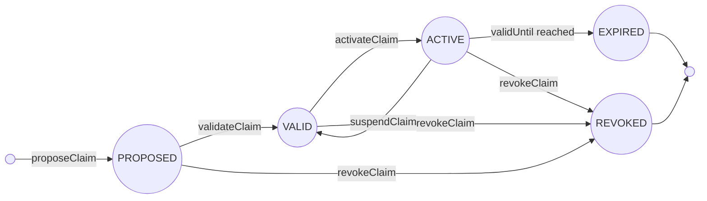

## Abstract

This standard defines a registry interface for signed, versioned claims about on-chain assets. A claim says what an asset is, what it is worth, what a fund will allocate to, who may hold it, or what backs it. Each claim is published by an authorized author, then validated and activated by separate parties.

The registry stores claims for many assets, keyed by `assetId`. If an asset implements `IRegistryAnchor`, consumers should rely only on claims from registries approved by that asset. If it does not, trust comes from the registry and its admin.

## Motivation

Markets cannot coordinate when assets and capital cannot find or evaluate one another. An asset's defining facts, and a fund's intent, live where a machine cannot read or verify them, so every match needs a human and every integration is built from scratch.

Existing standards solved the mechanics, not the description. [ERC-4626](./eip-4626.md), [ERC-7575](./eip-7575.md) and [ERC-7540](./eip-7540.md) define how value is held, split, and settled. [ERC-7943](./eip-7943.md) and [ERC-3643](./eip-3643.md) define how a regulated asset transfers and who may hold it. They define how an asset behaves. None define what it is, what it is worth, or what a fund intends, in a form a machine can verify and trust.

This standard fills that gap with a simple claim registry. Assets and funds can publish signed claims through a registry, and consumers can read the active claims, verify the signer and role, and check that the asset approves the registry. This makes assets and capital easier to discover, verify, and match.

## Specification

The key words "MUST", "MUST NOT", "REQUIRED", "SHALL", "SHALL NOT", "SHOULD", "SHOULD NOT", "RECOMMENDED", "NOT RECOMMENDED", "MAY", and "OPTIONAL" in this document are to be interpreted as described in [RFC 2119](https://www.rfc-editor.org/rfc/rfc2119) and [RFC 8174](https://www.rfc-editor.org/rfc/rfc8174). All implementations MUST support [ERC-165](./eip-165.md).

### Types

```solidity
enum ClaimType   { IDENTITY, VALUATION, MANDATE, TERMS, COMPLIANCE, BACKING, EVENT, RISK }
enum ClaimState  { PROPOSED, VALID, ACTIVE, EXPIRED, REVOKED }
enum RoleKind    { AUTHOR, VALIDATOR, ACTIVATOR }
```

### Claim

```solidity
struct RegulatedAssetClaim {
    bytes32    assetId;      // keccak256(chainId, contract, subAssetId)
    ClaimType  claimType;    // topic of the claim
    bytes32    schemaId;     // off-chain schema the payload follows
    bytes32    schemaHash;   // hash of the exact schema definition
    uint64     version;      // monotonic per (assetId, claimType)
    uint64     validFrom;    // effective from
    uint64     validUntil;   // effective until, 0 = no expiry
    ClaimState claimState;   // PROPOSED, VALID, ACTIVE, EXPIRED, or REVOKED
    bytes32[]  tags;         // public, indexable labels
    bytes32    contentHash;  // hash of the off-chain payload
    address    author;       // signer (EOA or ERC-1271 contract)
    string     uri;          // payload location
}
```

### Interface

```solidity
/// @notice Registry for signed, versioned claims about regulated assets.
interface IRegulatedAssetClaimRegistry is IERC165 {

    // Authority
    /// @notice Grants a role for an asset and claim type.
    /// @param assetId Asset registry key.
    /// @param t Claim type.
    /// @param kind Role kind to grant.
    /// @param who Address receiving the role.
    function grantRoleToClaimType(bytes32 assetId, ClaimType t, RoleKind kind, address who) external;

    /// @notice Revokes a role for an asset and claim type.
    /// @param assetId Asset registry key.
    /// @param t Claim type.
    /// @param kind Role kind to revoke.
    /// @param who Address losing the role.
    function revokeRoleToClaimType(bytes32 assetId, ClaimType t, RoleKind kind, address who) external;

    /// @notice Checks whether an account holds a role.
    /// @param assetId Asset registry key.
    /// @param t Claim type.
    /// @param kind Role kind to check.
    /// @param who Address to check.
    /// @return True if `who` holds `kind` for the asset and claim type.
    function isAuthorized(bytes32 assetId, ClaimType t, RoleKind kind, address who)
        external view returns (bool);

    // Claim lifecycle
    /// @notice Publishes a new proposed claim.
    /// @param claim Claim data being proposed.
    /// @param nonce Expected nonce of `claim.author`.
    /// @param deadline Last timestamp at which the signature is valid.
    /// @param signature Signature from `claim.author`.
    function proposeClaim(RegulatedAssetClaim calldata claim, uint256 nonce, uint64 deadline, bytes calldata signature) external;

    /// @notice Moves a proposed claim to valid.
    /// @param assetId Asset registry key.
    /// @param t Claim type.
    /// @param version Claim version.
    /// @param signer Validator address.
    /// @param nonce Expected nonce of `signer`.
    /// @param deadline Last timestamp at which the signature is valid.
    /// @param signature Signature from `signer`.
    function validateClaim(bytes32 assetId, ClaimType t, uint64 version, address signer, uint256 nonce, uint64 deadline, bytes calldata signature) external;

    /// @notice Moves a valid claim to active.
    /// @param assetId Asset registry key.
    /// @param t Claim type.
    /// @param version Claim version.
    /// @param signer Activator address.
    /// @param nonce Expected nonce of `signer`.
    /// @param deadline Last timestamp at which the signature is valid.
    /// @param signature Signature from `signer`.
    function activateClaim(bytes32 assetId, ClaimType t, uint64 version, address signer, uint256 nonce, uint64 deadline, bytes calldata signature) external;

    /// @notice Moves an active claim back to valid.
    /// @param assetId Asset registry key.
    /// @param t Claim type.
    /// @param version Claim version.
    /// @param signer Activator address.
    /// @param nonce Expected nonce of `signer`.
    /// @param deadline Last timestamp at which the signature is valid.
    /// @param signature Signature from `signer`.
    function suspendClaim(bytes32 assetId, ClaimType t, uint64 version, address signer, uint256 nonce, uint64 deadline, bytes calldata signature) external;

    /// @notice Moves a claim to revoked.
    /// @param assetId Asset registry key.
    /// @param t Claim type.
    /// @param version Claim version.
    /// @param signer Validator address.
    /// @param nonce Expected nonce of `signer`.
    /// @param deadline Last timestamp at which the signature is valid.
    /// @param signature Signature from `signer`.
    function revokeClaim(bytes32 assetId, ClaimType t, uint64 version, address signer, uint256 nonce, uint64 deadline, bytes calldata signature) external;

    // Reads
    /// @notice Returns active claims for an asset and claim type.
    /// @param assetId Asset registry key.
    /// @param t Claim type.
    /// @return activeClaims Claims currently active and live for the asset and claim type.
    function getActiveClaims(bytes32 assetId, ClaimType t) external view returns (RegulatedAssetClaim[] memory activeClaims);

    /// @notice Returns one claim by exact asset, claim type, and version.
    /// @param assetId Asset registry key.
    /// @param t Claim type.
    /// @param version Claim version.
    /// @return The requested claim.
    function getClaim(bytes32 assetId, ClaimType t, uint64 version) external view returns (RegulatedAssetClaim memory);

    /// @notice Returns the next expected nonce for a signer.
    /// @param signer Signer address.
    /// @return Next nonce expected in a signature from `signer`.
    function nonces(address signer) external view returns (uint256);

    // Resolution
    /// @notice Registers an asset reference in the registry.
    /// @param contractAddr Asset contract address, or zero for off-chain assets.
    /// @param subAssetId Asset-specific sub-identifier.
    /// @param chainId Chain where the asset reference exists.
    /// @return assetId The registry key derived from the asset reference.
    function registerAsset(address contractAddr, uint256 subAssetId, uint256 chainId) external returns (bytes32 assetId);

    /// @notice Marks an asset inactive while keeping its reference and claim history.
    /// @param assetId Asset registry key.
    function removeAsset(bytes32 assetId) external;

    /// @notice Checks whether the registry accepts new claim changes for an asset.
    /// @param assetId Asset registry key.
    /// @return True if the asset is active in this registry.
    function isAssetActive(bytes32 assetId) external view returns (bool);

    /// @notice Computes the asset id for an asset reference.
    /// @param contractAddr Asset contract address, or zero for off-chain assets.
    /// @param subAssetId Asset-specific sub-identifier.
    /// @param chainId Chain where the asset reference exists.
    /// @return Asset registry key.
    function getAssetId(address contractAddr, uint256 subAssetId, uint256 chainId) external pure returns (bytes32);

    /// @notice Resolves an asset id to its registered asset reference.
    /// @param assetId Asset registry key.
    /// @return contractAddr Asset contract address, or zero for off-chain assets.
    /// @return subAssetId Asset-specific sub-identifier.
    /// @return chainId Chain where the asset reference exists.
    function getAssetReference(bytes32 assetId) external view returns (address contractAddr, uint256 subAssetId, uint256 chainId);

    // Events emitted by claim lifecycle, role, and asset registration changes.
    /// @notice Emitted by `proposeClaim`.
    /// @param assetId Asset registry key.
    /// @param claimType Claim type.
    /// @param version Claim version.
    /// @param author Claim author.
    event ClaimProposed(bytes32 indexed assetId, ClaimType indexed claimType, uint64 version, address indexed author);
    /// @notice Emitted by `validateClaim`.
    /// @param assetId Asset registry key.
    /// @param claimType Claim type.
    /// @param version Claim version.
    /// @param validator Validator signer.
    event ClaimValidated(bytes32 indexed assetId, ClaimType indexed claimType, uint64 version, address indexed validator);
    /// @notice Emitted by `activateClaim`.
    /// @param assetId Asset registry key.
    /// @param claimType Claim type.
    /// @param version Claim version.
    /// @param activator Activator signer.
    event ClaimActivated(bytes32 indexed assetId, ClaimType indexed claimType, uint64 version, address indexed activator);
    /// @notice Emitted by `suspendClaim`.
    /// @param assetId Asset registry key.
    /// @param claimType Claim type.
    /// @param version Claim version.
    /// @param activator Activator signer.
    event ClaimSuspended(bytes32 indexed assetId, ClaimType indexed claimType, uint64 version, address indexed activator);
    /// @notice Emitted by `revokeClaim`.
    /// @param assetId Asset registry key.
    /// @param claimType Claim type.
    /// @param version Claim version.
    /// @param revoker Validator signer.
    event ClaimRevoked(bytes32 indexed assetId, ClaimType indexed claimType, uint64 version, address indexed revoker);
    /// @notice Emitted by `grantRoleToClaimType`.
    /// @param assetId Asset registry key.
    /// @param claimType Claim type.
    /// @param kind Role kind granted.
    /// @param who Address receiving the role.
    event RoleGrantedToClaimType(bytes32 indexed assetId, ClaimType claimType, RoleKind kind, address indexed who);
    /// @notice Emitted by `revokeRoleToClaimType`.
    /// @param assetId Asset registry key.
    /// @param claimType Claim type.
    /// @param kind Role kind revoked.
    /// @param who Address losing the role.
    event RoleRevokedFromClaimType(bytes32 indexed assetId, ClaimType claimType, RoleKind kind, address indexed who);
    /// @notice Emitted by `registerAsset`.
    /// @param assetId Asset registry key.
    /// @param contractAddr Asset contract address, or zero for off-chain assets.
    /// @param subAssetId Asset-specific sub-identifier.
    /// @param chainId Chain where the asset reference exists.
    /// @param registrant Registry admin that registered the asset.
    event AssetRegistered(bytes32 indexed assetId, address indexed contractAddr, uint256 subAssetId, uint256 chainId, address indexed registrant);
    /// @notice Emitted by `removeAsset`.
    /// @param assetId Asset registry key.
    /// @param admin Registry admin that removed the asset.
    event AssetRemoved(bytes32 indexed assetId, address indexed admin);
}
```

An asset contract MAY also implement `IRegistryAnchor` to approve registries that hold claims for it:

```solidity
interface IRegistryAnchor is IERC165 {
    /// @notice Approves or removes a registry for this asset.
    /// @param registry Registry address.
    /// @param approved Whether the registry is approved.
    function setRegistry(address registry, bool approved) external;

    /// @notice Returns registries known by this asset.
    /// @return Registry addresses known by this asset.
    function getRegistries() external view returns (address[] memory);

    /// @notice Checks whether this asset approves a registry.
    /// @param registry Registry address.
    /// @return True if `registry` is approved by this asset.
    function isRegistryApproved(address registry) external view returns (bool);

    /// @notice Emitted by `setRegistry`.
    /// @param registry Registry address.
    /// @param asset Asset contract address.
    /// @param approved Whether the registry is approved.
    event RegistrySet(address indexed registry, address indexed asset, bool approved);
}
```

### ERC-165

An implementation MUST return true from `supportsInterface` for the interface id of `IRegulatedAssetClaimRegistry`. An asset implementing `IRegistryAnchor` MUST return true for its interface id.

### Asset ID

`assetId` identifies the asset a claim is about. It is `keccak256(chainId, contract, subAssetId)`, where `subAssetId` distinguishes assets sharing one contract such as tranches or share classes.

`getAssetId` MUST compute `assetId` from (`contractAddr`, `subAssetId`, `chainId`).

`registerAsset` takes (`contractAddr`, `subAssetId`, `chainId`) as the asset reference. It MUST revert unless the caller is the registry admin. It MUST compute `assetId`, store the reference, set the asset active, emit `AssetRegistered`, and return `assetId`. It MUST revert if an asset reference already exists for that `assetId`.

`removeAsset` takes `assetId` as the asset to deactivate. It MUST revert unless the caller is the registry admin. It MUST set the asset inactive and emit `AssetRemoved`. It MUST NOT delete the asset reference or claim history. It MUST revert if no asset reference exists for `assetId`.

`getAssetReference` MUST resolve any asset with a stored reference and MUST revert when no reference exists.

`isAssetActive` MUST return whether the registry accepts new claims and state changes for the asset. Business status, such as open, paused, locked, completed, failed, or closed, belongs in the schema-defined payload and is anchored by `contentHash`.

### Claim Types

A claim type is a topic. Each has a distinct author, cadence, and question.

| Type | Answers | Typical author |
|---|---|---|
| IDENTITY | What is this asset, who issued it | Issuer |
| VALUATION | What is it worth (NAV, price) | Administrator |
| MANDATE | What this capital will allocate to | Manager |
| TERMS | Subscription, redemption, fee terms | Manager |
| COMPLIANCE | Who may hold or transact | Compliance provider |
| BACKING | Reserves or collateral behind it | Auditor |
| EVENT | Corporate actions, distributions, notices | Issuer or manager |
| RISK | What risk framework or risk profile applies | Risk manager |

### Payload

The payload at `uri` is the claim's content: facts for an asset, rules for a fund. `contentHash` covers the entire file. The standard anchors and verifies the payload envelope; canonical schemas define the payload fields.

Payloads SHOULD be stored on content-addressed systems, so the `uri` stays resolvable for the asset's required retention period. A mutable `uri` can leave a valid claim with an unreadable payload.

### Payload Envelope

Every claim payload MUST include a common envelope with these fields:

- `schemaId`: schema name or id
- `schemaVersion`: schema version
- `claimVariant`: specific kind within the claim type
- `assetId`: asset id matching the on-chain claim
- `claimVersion`: version matching the on-chain claim
- `attestorProfile`: signer capacity, descriptive only
- `authoredAt`: when the payload was authored
- `dataAppliesAt`: date the data refers to
- `accessClassification`: PUBLIC_DISCOVERY, PERMISSIONED_DISCLOSURE, RESTRICTED_EXECUTION, or PRIVATE
- `data`: schema-specific content

Envelope `assetId`, `schemaId`, and `claimVersion` MUST match the on-chain claim.

### Canonical Schemas

Each payload MUST conform to the canonical schema referenced by `schemaId`; the on-chain `schemaHash` is the hash of that exact schema.

### Roles and Authority

Authority is granted per (`assetId`, `claimType`, `kind`). There are three claim roles:

AUTHOR proposes claims of a type.
VALIDATOR validates a proposed claim, or revokes a claim.
ACTIVATOR activates a validated claim, or suspends an active one.

The registry admin is the only authority that grants and revokes claim roles. `grantRoleToClaimType` gives `who` the `kind` role for the given (`assetId`, `claimType`). `revokeRoleToClaimType` removes that role from `who`. Both functions MUST revert unless the caller is the registry admin. They MUST change only AUTHOR, VALIDATOR, or ACTIVATOR for the given (`assetId`, `claimType`).

`grantRoleToClaimType` MUST emit `RoleGrantedToClaimType`. `revokeRoleToClaimType` MUST emit `RoleRevokedFromClaimType`.

`isAuthorized` MUST return whether `who` holds `kind` for the exact (`assetId`, `claimType`).

How the registry administrator is assigned or changed is implementation-defined.

A signer's capacity is defined by the grants it holds, not by a stored label. Whoever holds AUTHOR for VALUATION is the asset's administrator; e.g. whoever holds AUTHOR for BACKING ClaimType is its auditor. The service-provider roster is the grant table. An address may be an EOA or a contract; a multisig validator gives multi-party approval through [ERC-1271](./eip-1271.md).

`validateClaim` and `revokeClaim` require VALIDATOR for that exact claim type. `activateClaim` and `suspendClaim` require ACTIVATOR for it. A signer holding only VALIDATOR cannot activate or suspend; a signer holding only ACTIVATOR cannot validate or revoke. An address authorized for one claim type cannot act on another.

### Claim Lifecycle

A claim moves through these states. This is the maker-checker (four-eyes) control: the party that proposes is never the party that validates.

- `proposeClaim` submits a claim. It enters PROPOSED.
- `validateClaim` moves it PROPOSED to VALID.
- `activateClaim` moves it VALID to ACTIVE. A VALID claim is verified but not yet live; an ACTIVE claim is live and discoverable.
- `suspendClaim` moves it ACTIVE back to VALID. It stays valid but is no longer live.
- `revokeClaim` moves a PROPOSED, VALID, or ACTIVE claim to REVOKED. A revoked claim is disregarded.

A claim is live only while `now >= validFrom` and (`validUntil == 0` or `now < validUntil`). If `validUntil` is nonzero, once `now >= validUntil` a VALID or ACTIVE claim is EXPIRED and no longer live. EXPIRED is time-derived and MUST be checked before any read or lifecycle action uses the claim. It does not require a state-changing transaction. A `validUntil` of 0 means no expiry.

Multiple claims MAY be ACTIVE for the same (`assetId`, `claimType`); each is identified by its `version`. The validator and activator curate which claims are valid and active. `getActiveClaims` returns the active set for a topic, and a consumer selects among them. History is retained and readable through `getClaim`.

`getActiveClaims` MUST return only claims that are ACTIVE, `now >= validFrom`, and (`validUntil == 0` or `now < validUntil`). `getClaim` MUST return the exact (`assetId`, `claimType`, `version`) claim, report derived EXPIRED when applicable, and MUST revert if it does not exist.



### Asset Activity

Asset activity is a registry flag. An active asset accepts new claims and state changes. An inactive asset keeps its reference and history readable, but new claims are disabled.

Implementations MUST reject `proposeClaim`, `validateClaim`, and `activateClaim` for assets that are not active. Reads, suspension, and revocation remain available for inactive assets in a given registry.

### Publication and Signatures

proposeClaim MUST verify the signature against `claim.author`. validateClaim, activateClaim, suspendClaim, and revokeClaim MUST verify the signature against the `signer` argument. Verification is over the [EIP-712](./eip-712.md) typed hash, equivalent to `SignatureChecker.isValidSignatureNow(signer, digest, signature)`: ECDSA for EOAs, [ERC-1271](./eip-1271.md) for contracts. Invalid signatures MUST revert. Each function MUST require that the signer holds the matching role for the claim's exact (`assetId`, `claimType`). Each signature binds its signer to the act.

Each signed digest MUST include `nonce` and `deadline`. Implementations MUST reject signatures when `block.timestamp > deadline`. The signed `nonce` MUST equal `nonces(signer)`. A successful signature use MUST increment `nonces(signer)` by one.

`nonces` MUST return the next expected nonce for `signer`.

Signing follows [EIP-712](./eip-712.md) over the domain `EIP712Domain(string name, string version, uint256 chainId, address verifyingContract)`, with `name = "RegulatedAssetClaimRegistry"`, `version = "1"`, the registry's `chainId`, and `verifyingContract` set to the registry. This binds each signature to one registry and chain. The signed structures are:

```solidity
bytes32 constant PROPOSE_TYPEHASH = keccak256(
  "Propose(bytes32 assetId,uint8 claimType,bytes32 schemaId,bytes32 schemaHash,uint64 version,uint64 validFrom,uint64 validUntil,uint8 claimState,bytes32[] tags,bytes32 contentHash,address author,string uri,uint256 nonce,uint64 deadline)");

bytes32 constant VALIDATE_TYPEHASH = keccak256(
  "Validate(bytes32 assetId,uint8 claimType,uint64 version,uint8 targetState,uint256 nonce,uint64 deadline)");

bytes32 constant ACTIVATE_TYPEHASH = keccak256(
  "Activate(bytes32 assetId,uint8 claimType,uint64 version,uint8 targetState,uint256 nonce,uint64 deadline)");

bytes32 constant SUSPEND_TYPEHASH = keccak256(
  "Suspend(bytes32 assetId,uint8 claimType,uint64 version,uint8 targetState,uint256 nonce,uint64 deadline)");

bytes32 constant REVOKE_TYPEHASH = keccak256(
  "Revoke(bytes32 assetId,uint8 claimType,uint64 version,uint8 targetState,uint256 nonce,uint64 deadline)");
```

Enum fields encode as `uint8`. Dynamic fields (`tags`, `uri`) are hashed per EIP-712.

Implementations MUST derive `targetState` internally from the called function when building the lifecycle signature digest, rather than accepting it as caller input: VALID for `validateClaim`, ACTIVE for `activateClaim`, VALID for `suspendClaim`, and REVOKED for `revokeClaim`.

- `proposeClaim` MUST require the signer to hold (`assetId`, `claimType`, `RoleKind.AUTHOR`) role, `claimState` to be PROPOSED, and `version` to be strictly greater than the prior version for (`assetId`, `claimType`).
- `validateClaim` MUST require the signer to hold (`assetId`, `claimType`, `RoleKind.VALIDATOR`) role, the signer to differ from the author, the current state to be PROPOSED, and `targetState` to be VALID.
- `activateClaim` MUST require the signer to hold (`assetId`, `claimType`, `RoleKind.ACTIVATOR`) role, the current state to be VALID, and `targetState` to be ACTIVE.
- `suspendClaim` MUST require the signer to hold (`assetId`, `claimType`, `RoleKind.ACTIVATOR`) role, the current state to be ACTIVE, and `targetState` to be VALID.
- `revokeClaim` MUST require the signer to hold (`assetId`, `claimType`, `RoleKind.VALIDATOR`) role, the current state to be PROPOSED, VALID, or ACTIVE, and `targetState` to be REVOKED.

Each successful lifecycle function MUST emit its matching event.

### Discovery

Claims are discoverable from event history. ClaimProposed and ClaimActivated carry the indexed `assetId` and `claimType` so an indexer can build the market view without calling each contract. `tags` are coarse public labels for filtering and MUST NOT be treated as binding. The events are the discovery layer.

A consumer reaches an asset's claims from either side. From a registry, it finds an `assetId` and calls `getAssetReference` to resolve the asset's contract. If the asset implements `IRegistryAnchor`, the consumer can call `getRegistries` to find approved registries, derive the key with `assetId`, then read claims there.

### Exposure

Claims live in a registry that implements `IRegulatedAssetClaimRegistry` and holds claims for many assets keyed by `assetId`.

An asset contract MAY implement `IRegistryAnchor` to approve the registries it recognizes. `setRegistry` takes `registry` and `approved`, and sets whether that registry is approved for the asset. It MUST revert unless the caller is the asset contract's owner or administrator, as defined by the implementing contract, and MUST emit `RegistrySet`. `getRegistries` MUST return registries known by the asset. `isRegistryApproved` MUST return whether a registry is approved.

If an asset implements `IRegistryAnchor`, a consumer MUST rely on a registry's claim for that asset only if `isRegistryApproved(registry)` returns true on the asset. A registry that the asset has not approved MUST be ignored.

If an asset does not implement `IRegistryAnchor`, or is off-chain or immutable, there is no asset-side registry approval. In that case, `registerAsset` only states that the registry covers the asset. Consumers SHOULD rely on those claims only if they trust the registry and its administrator.

### Reading and Trust

The content at `uri` MAY be public or access-restricted; this is an implementation choice signaled off-chain. A signed valuation proves who attested it and that they were authorized, not that the number is correct.

## Rationale

The claim carries only what the chain must guarantee: the anchor, the topic, the schema reference and hash, the version, the claim state, the signer, and the content hash. The payload itself lives off-chain. Three links form one chain: the signature binds the author to the claim, the hash binds the claim to the content, the `uri` is only transport.

Authority is granted by the registry admin per asset and claim type as author, validator, or activator, so a signer's capacity is what it is authorized to do, not a fixed label. This is the maker-checker control of regulated finance, enforced on-chain.

Business asset status lives in the schema-defined payload, so different claim types do not compete over one on-chain status field. The registry tracks only whether an asset is supported, not its lifecycle: an asset that has ended is not removed, and its final state stays readable through its claims. Multiple active claims of one topic can coexist; a consumer selects among them by author and schema, and history is kept for audit.

## Backwards Compatibility

No backward compatibility issues. This standard adds new interfaces and does not change existing ones. A registry adopts it by implementing `IRegulatedAssetClaimRegistry`. An asset adopts the asset-side interface by implementing `IRegistryAnchor`, or by being described through a shared registry. Non-upgradeable and off-chain assets are supported through the registry without re-issuance.

## Reference Implementation

To be provided.

## Security Considerations

A claim is attributable, versioned, authorized, and tamper-evident. It is not trustless proof of its content. Consumers must verify fetched content against `contentHash` and must not treat a claim as proof of its payload.

Trust in a claim is trust in the registry admin and the asset's grant table. If the asset implements `IRegistryAnchor`, consumers must also verify that the asset approves the registry. The registry admin appoints authors, validators, and activators for each asset and claim type. Consumers should verify the registry admin and grant table before relying on a claim.

`tags` are non-binding labels; integrators must verify against the hashed content before relying on them. Mutable URIs can serve different bytes over time; only `contentHash` is authoritative.

## Copyright

Copyright and related rights waived via [CC0](../LICENSE.md).