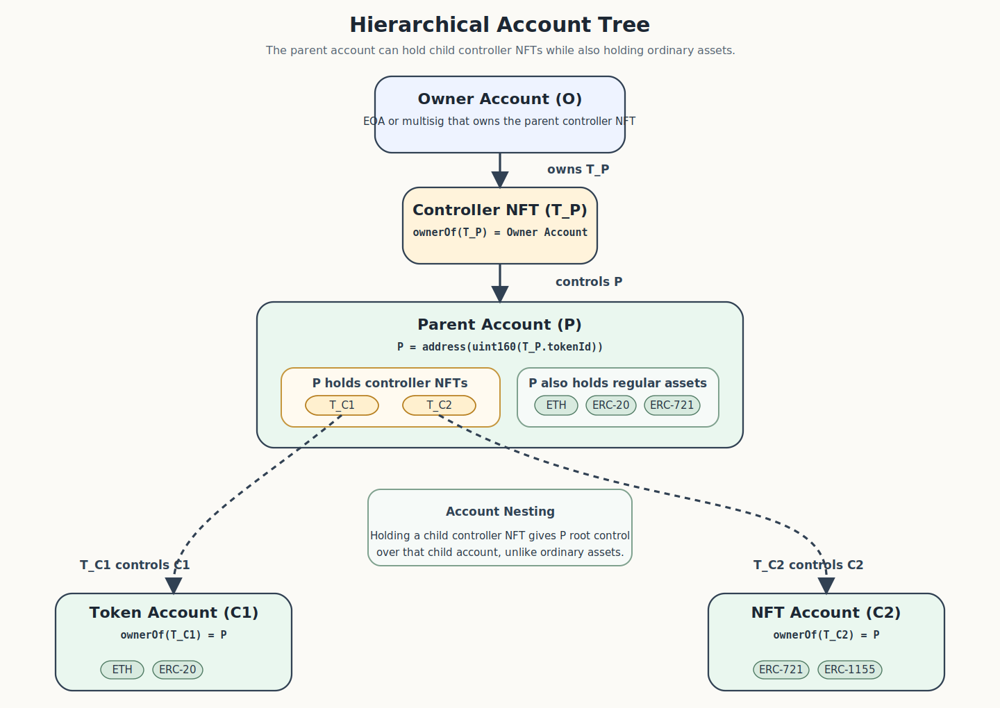
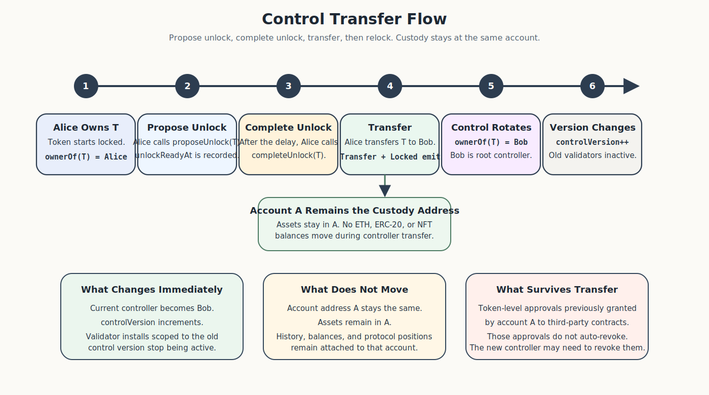
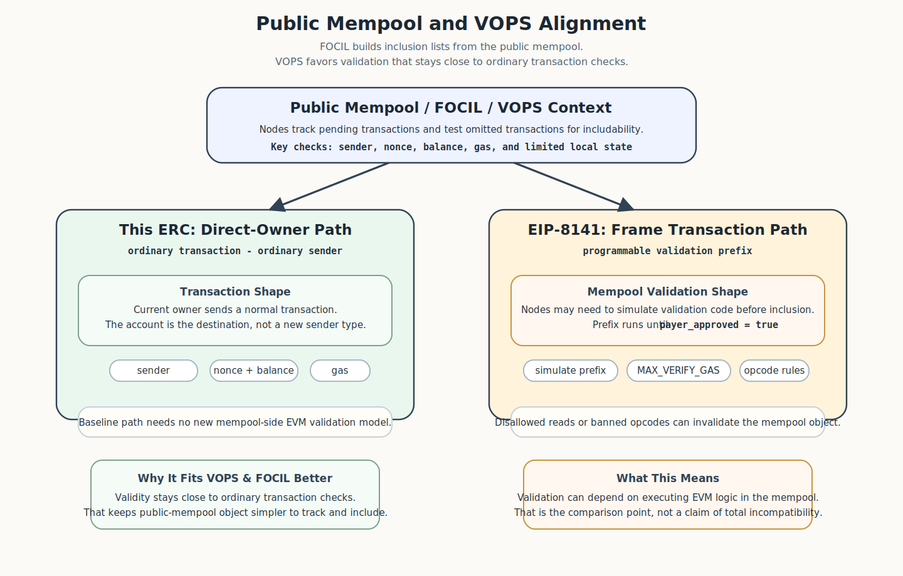
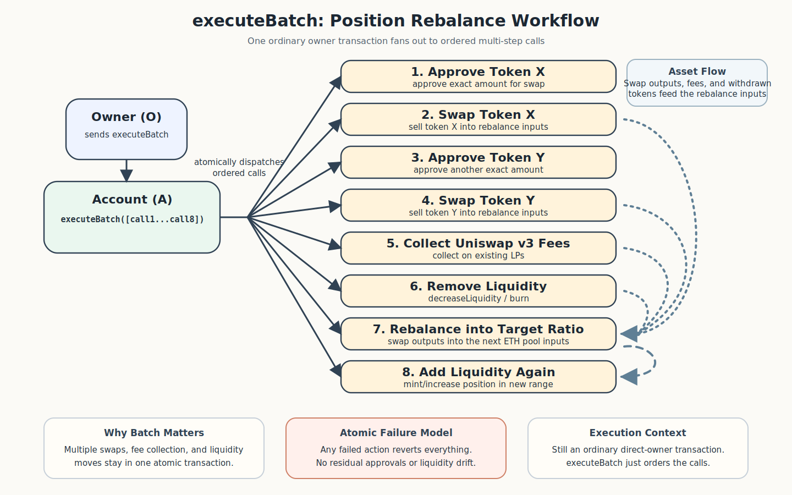

## Abstract

This ERC specifies an NFT-controlled smart account standard. The controlling NFT functions as a title instrument: its utility is the practical ability to operate the corresponding account, making it a transferable control credential rather than a collectible, membership, or claim.

It defines smart contract accounts whose root control is determined by ownership of a dedicated [ERC-721](./eip-721) token. For each compliant controlling token `tokenId`, the corresponding account address is `address(uint160(tokenId))`. 

From a user perspective, the controller NFT functions as a transferable wallet. At the protocol level, the account contract remains the wallet and custody address, while the NFT is the root-control object.

Ownership of the controlling NFT defines root control over the corresponding account. Transfer of the NFT rotates control to the new holder without moving assets held by the account and without the new holder needing access to the previous controller's keys. This enables full account transfer - including sale, gift, or organizational handoff - through a standard NFT transfer rather than through key sharing or signer-storage migration.

As the account holds its assets directly, transferring the controlling NFT also transfers effective control of all assets in the account as a single atomic operation, rather than requiring individual transfers of each token, position, or balance. The account MAY hold ETH, [ERC-20](./eip-20), [ERC-721](./eip-721), [ERC-1155](./eip-1155), and other assets, and MUST support arbitrary execution and atomic batch execution.

A single owner address MAY hold multiple controlling NFTs and therefore control multiple distinct NFT-controlled accounts. Because a compliant account MAY itself hold [ERC-721](./eip-721) assets, including controlling NFTs, an NFT-controlled account MAY itself control child NFT-controlled accounts. This permits hierarchical account trees.

This ERC does not standardize any wallet UI or "folder" semantics for such hierarchies.

This ERC also defines deterministic deployment semantics, transfer-aware authorization invalidation through a token-side control version, compatibility with [ERC-1271](./eip-1271), and an optional validator mechanism for delegated signature validation. The proposal is intended to deliver smart-account functionality including batching, programmable execution, and alternative root-controller account models using existing standards rather than new consensus changes. [EIP-7702](./eip-7702) provides an EOA-code path, and [EIP-8202](./eip-8202) proposes scheme-agile transactions for EOAs - enabling post-quantum key migration by transferring the controlling NFT to an owner account that uses a post-quantum signature scheme. The account MAY additionally implement [ERC-4337](./eip-4337) for sponsored or relayed execution.

As direct owner execution remains an ordinary execution-payload transaction, that path is also compatible with public-mempool inclusion mechanisms such as [EIP-7805](./eip-7805) and aligns with the local-validation goals described in "Validity-Only Partial Statelessness" (VOPS)[^3]. This does not automatically extend to individual [ERC-4337](./eip-4337) `UserOperation`s, which remain off-protocol mempool objects.

## Motivation

This ERC separates control from custody. From a user perspective, holding the controller NFT feels like holding the wallet because transferring that NFT transfers control. At the protocol level, the custody object is the account contract at address `A`, and the root control object is an [ERC-721](./eip-721) token whose `tokenId` encodes `A`. A user MAY hold that NFT in an EOA, in a multisig, in another smart account, or in a scheme-agile owner account if such a model is supported by the underlying chain environment. The controlled account remains a separate contract account.


Control is not limited to one account. Any address MAY own multiple controller NFTs and therefore control multiple corresponding accounts. Because a compliant account MAY itself hold [ERC-721](./eip-721) tokens, including controller NFTs, one NFT-controlled account MAY itself become the controller of other NFT-controlled accounts. This enables nested account trees. Wallets and applications MAY present such hierarchies as folders, subaccounts, vaults, or another navigation metaphor, but this ERC standardizes only the control and execution semantics, not the UI metaphor.



Multiple accounts under a single controller also provide approval-scoped risk isolation without requiring multiple keys. Because each account is a separate contract at a separate address, token-level approvals ([ERC-20](./eip-20) `approve`, [ERC-721](./eip-721) `setApprovalForAll`, [ERC-1155](./eip-1155) operator approvals) granted by one account do not affect any other account. A user MAY hold high-value assets in one account and interact with higher-risk protocols from a different account, both controlled by the same EOA or parent account. An unlimited approval granted to a compromised or malicious contract from the higher-risk account cannot reach assets held by the other. This is the same isolation that previously required managing separate seed phrases or hardware wallet slots for distinct EOAs, achieved here through separate custody addresses under unified root control.


The separation is intentional. Transfer of the NFT rotates root control without moving assets held by the account; and thus "key-rotation" of a smart-account occurs via simply transferring the NFT to a new owner. The recipient gains full control without ever knowing or sharing the previous owner's keys. This also enables account transfer as a first-class operation: an account with its full position history, token balances, protocol memberships, and address-based reputation can be sold, gifted, or handed off to a new controller through a single NFT transfer. Because assets remain at the account address, a single control rotation replaces what would otherwise require individual transfers of each balance and position, avoiding the gas cost, complexity, and failure risk of moving assets one by one.



Control transfer does not automatically revoke token-level approvals ([ERC-20](./eip-20) `approve`, [ERC-721](./eip-721) `setApprovalForAll`, [ERC-1155](./eip-1155) operator approvals) that the account previously granted to third-party contracts. These approvals are stored on the individual token contracts and are not aware of the controller-token transfer. However, any [ERC-1271](./eip-1271) signatures issued under the previous control version are automatically invalidated by the control-version increment. The operational consequences of surviving token approvals are discussed in Security Considerations.

The design is intended to obtain practical account-abstraction properties without requiring a new consensus transaction format for the account itself.

[EIP-8141](./eip-8141) pursues related transaction-layer goals, including canonical paymaster handling and atomic batching. This ERC does not attempt to reproduce [EIP-8141](./eip-8141) as a protocol change. Instead, it standardizes an account model that can achieve similar end-user outcomes through native smart-account execution.

Compatibility with public-mempool censorship-resistance mechanisms is deliberate. [EIP-7805](./eip-7805): Fork-choice enforced Inclusion Lists (FOCIL) builds inclusion lists from transactions pending in the public mempool, and its execution-layer omission check asks whether any missing inclusion-listed transaction could still be validly included by checking remaining gas together with the sender's nonce and balance after block execution. VOPS[^3] argues that nodes should retain just enough account data to validate pending transactions locally so they can maintain a public mempool and participate in FOCIL.



This ERC's direct owner path preserves that shape. The user submits an ordinary transaction whose sender is the current NFT owner or whatever transaction flow ultimately causes the current owner contract to call the account. The NFT-controlled account is the destination of execution, not a new protocol-level sender type. In that respect, the direct owner path is more naturally aligned with VOPS than [EIP-8141](./eip-8141)'s general frame-transaction model, whose public mempool rules require nodes to simulate a validation prefix until `payer_approved = true`, enforce a bounded `MAX_VERIFY_GAS`, and reject prefixes that read disallowed state or use banned opcodes. The distinction is explained in more detail in "Frame Transactions Through a Statelessness Lens"[^1] and "Mempool Strategies for EIP-8141"[^2]. This does not mean that every [EIP-8141](./eip-8141) sender mode is incompatible with VOPS. It means this ERC does not require a new mempool-side EVM validation model for its ordinary direct-owner path.

Alternative signing is addressed primarily at the root-controller layer rather than only inside account validators. [EIP-8202](./eip-8202) proposes a typed transaction whose `scheme_id` selects the signature algorithm, with initial schemes including secp256k1, P256/secp256r1, and post-quantum. Under this ERC, moving to a different root signing scheme or key-rotation can be as simple as transferring the controlling NFT to a different owner account that uses that scheme. Because the [EIP-8202](./eip-8202) text is still a draft pull request, this ERC treats it as a compatible owner model, not as a hard dependency.


Validators remain useful, but for a narrower reason. They provide delegated signature validation for off-chain authorization flows and signer models that do not naturally map to an Ethereum address. [ERC-1271](./eip-1271) already permits arbitrary contract-side signature validation, including multisig and alternative signature schemes, and [ERC-7913](./eip-7913) is designed for signers that do not have their own Ethereum address.

## Specification

### Core invariant

For each compliant controlling NFT `T` in canonical controller token contract `C`, there is exactly one corresponding smart contract account `A`, and `uint256(uint160(A)) == tokenId(T)`. From a user perspective, `T` functions as the wallet's transferable handle. At the protocol level, the account `A` is the wallet and custody address, and the NFT `T` is the control object. Transfer of `T` rotates root control over `A` without moving assets held by `A`.

The proposal distinguishes the following concepts:

- **NFT ownership** - `ownerOf(tokenId)` on the canonical controller token.
- **Account control** - the root right to operate the account or delegate limited authority.
- **Execution authorization** - the concrete mechanism by which a specific call is allowed.
- **Asset custody** - ETH and tokens are held by the account contract, not by the NFT.
- **Deployment state** - the account address is deterministic before deployment, but the NFT and runtime code come into existence only through the atomic deployment flow defined by this ERC.
- **Authentication method** - the cryptographic scheme used by the current NFT owner or by an authorized validator.

A compliant account is controlled by the current holder of the canonical controlling NFT, and all valid execution authority for that account is either exercised directly by that holder or delegated by that holder under the current control version. Recovery rotates control by transferring the controlling NFT and MUST NOT bypass NFT ownership as the root control source.

### Definitions

For the purposes of this ERC:

- **Controller token** means the canonical [ERC-721](./eip-721) contract implementing this ERC's token-side extension.
- **Controller tokenId** means the [ERC-721](./eip-721) tokenId that encodes the account address.
- **Account** means the smart contract wallet whose address is encoded in the tokenId.
- **Controller** means `ownerOf(tokenId)` on the canonical controller token contract.
- **Control version** means the monotonically increasing value returned by `controlVersionOf(tokenId)`.
- **Validator** means a contract authorized by the current controller for the current control version to validate delegated signatures or equivalent off-chain authorization proofs for the account.
- **Transfer approval version** means a per-token monotonically increasing counter used internally to invalidate stale [ERC-721](./eip-721) single-token approvals on the controller token.
- **Deployed account** means an account whose controller token has been minted and whose runtime code has been deployed at the encoded address.

### Token model

The controlling token MUST be [ERC-721](./eip-721) compliant, MUST implement [EIP-165](./eip-165), and MUST implement [EIP-5192](./eip-5192). The controlling token MUST also implement the extension interface defined in this ERC.

The root controller of the account encoded by `tokenId` MUST be `ownerOf(tokenId)` on the canonical controller token contract.

Neither [ERC-721](./eip-721) single-token approval nor any attempted operator approval SHALL, by itself, grant account execution authority. An approved address is not a controller under this ERC.

#### Transfer approval version

A compliant controller token MUST maintain a per-token transfer approval version counter. All [ERC-721](./eip-721) single-token approvals (`approve`) MUST be recorded together with the current transfer approval version. When checking whether an address is approved to transfer a token, the controller token MUST verify that the approval was granted under the current transfer approval version; approvals granted under any prior version MUST be treated as non-existent.

A compliant controller token MUST revert any call to `setApprovalForAll`. Bulk operator approval is forbidden for the controller token because it would create a root-access vector over every account controlled by the approved operator.

A compliant controller token MUST increment the transfer approval version:

- on every successful transfer that emits `Transfer`,
- when `proposeUnlock(tokenId)` is called, and
- when `lock(tokenId)` is called.

This ensures that all prior single-token transfer approvals are automatically invalidated whenever the lock state changes or the token transfers. An attacker who obtained an approval before the token was locked cannot use that stale approval to transfer the token when the owner later unlocks it. Invalidation is signalled by the existing `Transfer` event and the [EIP-5192](./eip-5192) `Locked` and `Unlocked` events respectively; no additional lock-status event is required.

A compliant controller token MUST increment `controlVersionOf(tokenId)`:

- when the token is minted, and
- on every successful transfer that emits `Transfer`.

A compliant controller token MUST NOT allow burning of a controlling token.

The current `ownerOf(tokenId)` MAY call `resetDelegations(tokenId)` to invalidate delegated authority without transferring the controlling NFT. `resetDelegations` MUST increment `controlVersionOf(tokenId)` and MUST emit `ControlVersionChanged(tokenId, newVersion)`. Only the current `ownerOf(tokenId)` MAY call `resetDelegations`.

A compliant controller token MUST NOT allow transfer to the zero address or to `address(uint160(tokenId))` (the account controlled by the token). Transfers that would create self-ownership MUST revert.

#### Execution-active transfer guard

Before completing any transfer, the controller token MUST check the `EXTCODEHASH` of `address(uint160(tokenId))`. If the hash is `keccak256("")` (existing account with no code) or `0x0` (non-existent account per [EIP-1052](./eip-1052)), the transfer MUST revert, because a transferable controller token with no corresponding runtime code is a fault state under this ERC's atomic deployment model. If the account has code deployed (i.e., `EXTCODEHASH` is neither `keccak256("")` nor `0x0`), the controller token MUST call `isExecutionActive()` on `address(uint160(tokenId))`. If `isExecutionActive()` returns `true`, the transfer MUST revert.

This prevents mid-execution control rotation without requiring per-subcall cross-contract authorization re-checks. The account sets a transient execution-active flag via `TSTORE` at `execute` and `executeBatch` entry. The controller token reads it via `STATICCALL` only on transfer. The cost is borne by transfers (rare) rather than by subcalls (frequent).

Wrapped, bridged, mirrored, fractionalized, or derivative representations of the controller token are not controllers under this ERC unless the derivative contract itself is the canonical controller token contract.

#### Transfer lock

A controller token MUST be minted in the locked state. While locked, all transfer functions (`transferFrom`, `safeTransferFrom`) MUST revert.

The controller token MUST use [EIP-5192](./eip-5192) as the canonical binary lock interface for marketplaces and other generic integrators. `locked(tokenId)` MUST return `true` whenever the token is not currently transferable and `false` only when the token is currently transferable. This ERC does not define a second standardized lock-status view or parallel lock/unlock events.


The controller token MUST support a configurable `unlockDelay` for each token. `unlockDelayOf(tokenId)` returns the currently configured delay. The default or initial `unlockDelay` for any token that supports transfer MUST be greater than or equal to `1`, and `unlockDelayOf(tokenId)` for such a token MUST never be `0`; zero-delay unlocks are not a compliant transferable mode because they collapse the required separation between execution and transfer.

The risk is transaction ordering around sale or transfer of the controlling NFT. Without a real delay between "owner can still execute" and "NFT can be transferred," a seller can prepare a sale, then in the same block or immediately adjacent ordering window submit `execute` or `executeBatch` calls that drain assets before the buyer's transfer settles. Per-transaction guards do not solve this because the drain and the transfer can occur in different transactions. A strictly positive `unlockDelay` creates a visible freeze window: once the owner wants transferability, they must stop executing, wait through the delay, and only then complete the unlock. That delay is what gives counterparties, marketplaces, and off-chain systems a meaningful separation between sale preparation and custody handoff. If `unlockDelay == 0` were compliant, `proposeUnlock()` and `completeUnlock()` could be collapsed into an effectively immediate handoff, and the standard would no longer guarantee that separation.

The current `ownerOf(tokenId)` MAY call `proposeUnlock(tokenId)` to begin the unlock process. `proposeUnlock` MUST revert if `unlockDelayOf(tokenId) == 0`. Otherwise it MUST increment the transfer approval version, record `unlockReadyAt(tokenId) = block.timestamp + unlockDelayOf(tokenId)`, emit `UnlockProposed(tokenId, unlockReadyAt(tokenId))`, and MUST NOT by itself make the token transferable or emit [EIP-5192](./eip-5192) `Unlocked`.

The current `ownerOf(tokenId)` MAY call `completeUnlock(tokenId)` after `unlockReadyAt(tokenId) <= block.timestamp`. `completeUnlock` MUST make the token transferable, MUST emit [EIP-5192](./eip-5192) `Unlocked(tokenId)`, and MUST NOT increment the transfer approval version.

The current `ownerOf(tokenId)` MAY call `lock(tokenId)` to return the token to the locked state or cancel a proposed unlock. `lock` MUST clear any pending or ready-but-not-completed unlock, MUST make the token non-transferable immediately, and MUST increment the transfer approval version. If the token was transferable immediately before the call, `lock` MUST emit [EIP-5192](./eip-5192) `Locked(tokenId)`. If the token was still locked under [EIP-5192](./eip-5192) immediately before the call but had a pending or ready-but-not-completed unlock, `lock` MUST emit `UnlockCancelled(tokenId)`.

The controller MAY configure `unlockDelay` via `setUnlockDelay(tokenId, unlockDelay)`. Only the current `ownerOf(tokenId)` MAY change it. `setUnlockDelay(tokenId, 0)` MUST revert for tokens that remain transferable under this ERC.

`unlockReadyAt(tokenId)` MUST return `0` when no unlock is pending and otherwise the earliest timestamp at which `completeUnlock(tokenId)` may succeed. While an unlock is pending or ready but not completed, `locked(tokenId)` MUST still return `true`.

After any successful transfer, the token MUST be locked immediately. If the token was transferable immediately before the transfer, the controller token MUST emit [EIP-5192](./eip-5192) `Locked(tokenId)` as part of the transfer transaction.

Whenever the [EIP-5192](./eip-5192) binary lock status changes, the controller token MUST emit the corresponding [EIP-5192](./eip-5192) `Locked(tokenId)` or `Unlocked(tokenId)` event on the transaction that performs the binary state change. `UnlockDelayChanged`, `UnlockProposed`, and `UnlockCancelled` remain available for pending-state visibility, but implementations MUST NOT define a second standardized lock-status event or a duplicate `isLocked`-style view.

While the controller token is in the unlocked transferable state, the controlled account MUST reject both `execute` and `executeBatch`. Execution remains allowed while the token is still locked under [EIP-5192](./eip-5192), including pending or ready-but-not-completed unlock states. Execution and transfer are intentionally separated: a controller that wishes to execute after preparing for transfer MUST do so before `completeUnlock()` or after re-locking. This separation depends on a strictly positive `unlockDelay`; zero-delay unlocks would make the transfer window effectively immediate and reintroduce same-block sell-and-drain risk.

#### Cycle detection on transfer

A compliant controller token MUST perform a cycle check on every transfer (`transferFrom`, `safeTransferFrom`). The check MUST follow the controller-token ownership chain starting from the recipient and walk up to a maximum depth of 4 hops:

1. Let `current = recipient`.
2. Compute `candidateTokenId = uint256(uint160(current))`. If a controller token with `candidateTokenId` does not exist (has not been minted), the chain has terminated at a non-controlled address (e.g. an EOA or an unrelated contract). This is the normal safe exit: no cycle is possible, and the transfer MUST proceed.
3. If the controller token `candidateTokenId` exists, read `next = ownerOf(candidateTokenId)` with a bounded gas stipend (RECOMMENDED: 30,000 gas). If the call fails (reverts or runs out of gas), the transfer MUST revert, because the ownership chain cannot be verified.
4. If `next == address(uint160(tokenId))` where `tokenId` is the token being transferred, a cycle would be created. The transfer MUST revert.
5. Set `current = next` and repeat from step 2. If the depth exceeds 4 hops without terminating, the transfer MUST revert.

This caps the maximum nesting depth of hierarchical account trees to 4 levels and guarantees exhaustive cycle prevention within that bound. Transfers to EOAs and non-controlled-account contracts terminate at step 2 on the first iteration with zero `ownerOf` calls. The gas cost of the check is bounded and predictable (at most 4 existence checks and 4 gas-capped ownership lookups per transfer).

### tokenId/address derivation

The mapping is exact:

- `account = address(uint160(tokenId))`
- `tokenId = uint256(uint160(account))`

Valid controller tokenIds MUST satisfy:

- `tokenId != 0`
- `tokenId <= type(uint160).max`

The upper 96 bits of a valid controller tokenId MUST be zero.

Every nonzero 20-byte address is representable as a valid tokenId.

A compliant controller token MUST expose reverse lookup and MUST return `uint256(uint160(account))` for `tokenIdOf(account)` when `account != address(0)`.

### Deployment semantics

Deployment is deterministic and atomic. A compliant system MUST include a `CREATE2`-based factory.

#### Counterfactual addresses

Before deployment, the future account address is deterministic and can be predicted from the factory, deployer, and selected salt mode. However, that predictability is counterfactual only: no controller token exists and no account runtime code exists until the atomic deployment transaction completes successfully.

The factory MUST support two salt derivation modes:

- **Nonce-based (default):** The `CREATE2` salt MUST be `keccak256(abi.encode(msg.sender, nonceMap[msg.sender]))`, where `nonceMap` is a per-caller monotonically increasing counter maintained by the factory. The factory MUST increment `nonceMap[msg.sender]` on each successful deployment.
- **User-salt:** The `CREATE2` salt MUST be `keccak256(abi.encode(msg.sender, salt))`, where `salt` is a caller-provided `bytes32`. This is the only mode that this ERC treats as cross-chain-stable: the same deployer, salt, factory address, and account implementation produce the same account address on every chain. It also allows address pre-computation without reading on-chain nonce state.

Nonce-based mode provides no cross-chain address guarantee and is intended only for fresh per-chain addresses.

Both modes are front-running resistant because the salt includes the caller's address.

The factory MUST, in a single atomic operation:

1. compute the `CREATE2` salt from `msg.sender` and either the caller's current nonce or the caller-provided salt,
2. deploy the account using `CREATE2`,
3. derive `tokenId = uint256(uint160(deployedAccount))`,
4. mint the controller token to the requested initial owner,
5. emit `AccountDeployed`.

If `CREATE2` fails (e.g. code already exists at the target address), the entire transaction reverts and no controller token is minted.

Sponsored deployment is achieved by having the deployer (e.g. a paymaster, relayer, or bundler) call `deployAccount` with the intended recipient as `initialOwner`. The deployer pays gas; the recipient receives the controlling NFT and full root control directly. Account sale and organizational handoff are achieved by the current controller transferring the controlling NFT after deployment.

When account setup requires initialization (e.g. installing validators), the deployer MAY atomically deploy with itself as `initialOwner`, perform setup via `execute` or `executeBatch`, and transfer the controlling NFT to the intended recipient, all within a single transaction.

### Ownership/control linkage

The account contract is the wallet and custody address. The NFT is the control object. An EOA MAY hold the NFT, but the controlled account is a separate smart contract account.

Root control is resolved dynamically:

- `controller = controllerToken.ownerOf(tokenId)`
- `controlVersion = controllerToken.controlVersionOf(tokenId)`

The account MUST NOT rely on a stale internal cache as the authoritative controller or authoritative control version.

A compliant account MUST authorize direct execution when `msg.sender == ownerOf(tokenId)` on the canonical controller token contract.

This rule applies regardless of whether the current owner is:

- a conventional EOA,
- a multisig or other contract account,
- an account using [EIP-7702](./eip-7702)-compatible code,
- an account using a scheme-agile owner model such as [EIP-8202](./eip-8202).

The NFT-controlled account does not inspect the cryptographic scheme that produced the owner's transaction for ordinary direct execution. It only relies on the EVM-visible caller address.

What changes immediately at transfer time:

- the root controller changes to the new `ownerOf(tokenId)`,
- `controlVersionOf(tokenId)` changes,
- prior-version delegated validator authority becomes inactive,
- any authorization bound to the previous control version becomes invalid.

Delegated validation exists only through validators installed by the current controller for the current control version.

### Multiple-account control and nesting

A single address MAY own any number of controlling NFTs. If an address owns multiple controlling NFTs, it is the root controller of each corresponding account.

Because a compliant account MAY hold [ERC-721](./eip-721) assets, a compliant account MAY itself hold controlling NFTs for other compliant accounts. In that case, the parent account is the root controller of each corresponding child account whose controlling NFT it owns.

This ERC therefore permits nested control relationships and account trees. It does not standardize how wallets or applications present those relationships; those presentation semantics are out of scope.

Child accounts remain separate custody addresses with their own balances, validators, recovery settings, and execution history.

Self-ownership is forbidden: a transfer to `address(uint160(tokenId))` MUST revert. Cyclic control graphs are prevented by the cycle check defined in the transfer section, which rejects any transfer that would create a cycle or exceed 4 levels of nesting.

### Token receiver interfaces

A compliant account MUST implement the following receiver interfaces so that it can accept token transfers:

- [ERC-721](./eip-721) `ERC721TokenReceiver` (`onERC721Received`)
- [ERC-1155](./eip-1155) `ERC1155TokenReceiver` (`onERC1155Received`, `onERC1155BatchReceived`)

A compliant account MUST also accept ETH via `receive()`.

### Execution interface

A compliant account MUST implement arbitrary call execution and atomic batch execution.

`execute(target, value, data)` MUST:

- be callable by the current controller through an ordinary transaction,
- revert unless `locked(tokenId)` on the controller token is `true`,
- increment the transient execution-active reference count (`TSTORE`) at entry,
- perform a single `CALL` to `target` with `value` and `data`,
- decrement the transient execution-active reference count (`TSTORE`) on successful exit,
- return the raw return data on success,
- revert on failure,
- bubble callee revert data exactly on failure.

`executeBatch(calls)` MUST:

- be callable by the current controller through an ordinary transaction,
- revert unless `locked(tokenId)` on the controller token is `true`,
- increment the transient execution-active reference count (`TSTORE`) at batch entry,
- decrement the transient execution-active reference count (`TSTORE`) on successful batch exit,
- execute calls in order,
- be atomic,
- return ordered raw return data on success,
- revert the entire batch if any call fails.

The execution-active flag MUST be stored in transient storage using `TSTORE` at a fixed slot within the account contract as a reference count. On `execute` or `executeBatch` entry, the account MUST increment the count (`TSTORE(slot, TLOAD(slot) + 1)`). On successful exit, the account MUST decrement the count (`TSTORE(slot, TLOAD(slot) - 1)`).


If a frame reverts, the EVM automatically reverts that frame's transient-storage writes; implementations MUST NOT perform an additional decrement on the revert path. `isExecutionActive()` MUST return `true` when the count is greater than `0`. This ensures nested or reentrant execution on the same account maintains the guard until all active frames have exited successfully or reverted.



A user MUST be able to perform `approve + swap`, `approve + call`, `withdraw + settle + transfer`, or similar ordered actions as one ordinary transaction from the current NFT owner to `executeBatch`.

### Nonce requirements and replay protection

#### Direct ordinary transactions

For direct ordinary transactions from the current owner, this ERC does not require a separate account-level execution nonce. Authorization is by `msg.sender == ownerOf(tokenId)` in a normal state-changing transaction.

Replay protection for such ordinary transactions is provided by the replay model of the owner account itself.

If the current owner is a scheme-agile owner account under a model such as [EIP-8202](./eip-8202), replay handling for the owner's transaction belongs to that owner-account transaction type, not to this ERC. The NFT-controlled account only sees the resulting caller address.

#### ERC-4337 compatibility

A compliant account MAY implement [ERC-4337](./eip-4337) for sponsored or relayed execution. If it does, authorization MUST be bound to the current control version so that a transfer of the controlling NFT invalidates any pending `UserOperation`s signed under the previous version. All other [ERC-4337](./eip-4337) semantics (nonces, EntryPoint, paymasters, bundler rules) are defined by [ERC-4337](./eip-4337) itself and are not redefined here.

#### ERC-1271 message validation

A compliant account SHOULD implement [ERC-1271](./eip-1271) `isValidSignature(bytes32 hash, bytes signature)`. It is needed only when off-chain message signing or dapp-level signature verification is desired.

If an account implements `isValidSignature`, it MUST also implement [ERC-5267](./eip-5267) `eip712Domain()` and use [EIP-712](./eip-712) domain-separated hashing for its canonical structured-data signature path.

For this ERC, the account's [ERC-5267](./eip-5267) domain MUST describe the account-specific verification domain used for [ERC-1271](./eip-1271) validation and MUST use:

- `name = "ERC-XXXX Account"`
- `version = "1"`
- `chainId = block.chainid`
- `verifyingContract = address(this)`
- `salt = keccak256(abi.encode(controllerToken(), controllerTokenId(), controlVersion()))`
- `extensions = []`

Accordingly, the `fields` bitmap returned by `eip712Domain()` MUST indicate that `name`, `version`, `chainId`, `verifyingContract`, and `salt` are present.

The canonical structured-data validation workflow for `isValidSignature` MUST be [ERC-7739](./eip-7739)'s `TypedDataSign` defensive rehashing workflow using the account's [ERC-5267](./eip-5267) domain above. The `hash` passed into `isValidSignature` MUST be the original [EIP-712](./eip-712) digest produced by the application, and the `signature` bytes MUST use [ERC-7739](./eip-7739)'s `TypedDataSign` encoding. The account MUST verify the signature against the [ERC-7739](./eip-7739) final hash derived from that original digest and the account's own domain.

Applications SHOULD include their own message nonce or deadline semantics inside the original signed payload when needed.

An account that implements the [ERC-7739](./eip-7739) typed-signature workflow SHOULD return `bytes4(0x77390001)` for `isValidSignature(0x7739773977397739773977397739773977397739773977397739773977397739, "")` to signal support for that workflow.

An account that implements `isValidSignature` MUST support at minimum EOA controllers via `ecrecover` and [ERC-1271](./eip-1271)-compliant contract controllers via forwarded `isValidSignature` over the account-bound final hash. For controllers that do not expose an on-chain signature verification interface, the account MUST delegate validation to an active validator. If no active validator exists and the controller's signature cannot be verified, `isValidSignature` MUST return failure.

Because [ERC-7739](./eip-7739) defensive rehashing is not recursively composable across multiple signers of the same kind, a controller contract that itself only accepts [ERC-7739](./eip-7739)-wrapped `ERC-1271` signatures may require a validator for delegated-signature paths. Direct execution via `msg.sender` remains unaffected.

### Authentication and extensibility

This ERC does not mandate one cryptographic scheme for root control.

Root control is defined by NFT ownership. The cryptographic scheme of the root controller is whatever scheme the current owner account natively uses for ordinary transactions.

That means:

- if the owner is an EOA, ordinary direct execution is authorized by `msg.sender`
- if the owner is a contract, ordinary direct execution is authorized by `msg.sender`, and that owner contract decides its own internal signature or governance rules
- if the owner is a scheme-agile owner account such as one contemplated by [EIP-8202](./eip-8202), the scheme choice is handled at the owner-account layer, not by the NFT-controlled account
- if the owner is an [EIP-7702](./eip-7702) account, the owner-side code model is likewise external to this ERC

All of these owner types are fully supported for direct execution via `msg.sender`. Controllers that require [ERC-1271](./eip-1271) message signing or other delegated validation flows MUST install a validator to service those paths.

Validators are OPTIONAL and exist for delegated signature validation, not to define root control.

A compliant account MUST support validator installation and removal by the current controller.

A validator installation MUST be scoped to the current control version at installation time.

A validator MUST be considered active only while its recorded activation version equals the current `controlVersionOf(tokenId)`.

Validators MAY implement:

- multisig or threshold validation,
- passkeys or secp256r1 flows,
- zk-based validation,
- social-recovery preparation flows for off-chain approvals,
- [ERC-7913](./eip-7913)-style address-less signer descriptions or verifier-based key models.

Validators are privileged for the signature-validation paths they service. Validator installation SHOULD therefore be treated as a sensitive delegation for the active control version, even though the base ERC does not define validator-driven execution entrypoints.

### Public mempool, FOCIL, and VOPS considerations

A compliant account MUST preserve the direct-owner ordinary-transaction execution path defined above. That path is the canonical public-mempool-visible execution path for this ERC.

For [EIP-7805](./eip-7805), the relevant object is the outer protocol transaction that ultimately reaches the account, not an internal `CALL` into the account. If the current controller is an EOA or a scheme-agile owner account, that outer transaction is the controller's own transaction. If the current controller is a multisig or other contract, the relevant object is the outer transaction that causes that owner contract to call the account. This ERC does not define a new protocol transaction type.

This ERC does not require public-mempool nodes to execute account-specific validation logic merely to determine whether an ordinary direct-owner transaction belongs in the public mempool. The account's control check occurs during ordinary EVM execution. Public-mempool admissibility for the direct-owner path is therefore governed by the underlying transaction type rather than by an ERC-specific validation prefix.

This property is intentional. [EIP-7805](./eip-7805) inclusion lists are built from the public mempool, and omitted transactions are checked on the execution layer by asking whether the missing transaction would still be validly includable based on remaining gas and the sender's nonce and balance. VOPS argues that nodes should keep enough account data to validate pending transactions locally so they can maintain the public mempool and participate in FOCIL. The direct-owner path of this ERC fits that model.

If an account additionally implements [ERC-4337](./eip-4337), individual `UserOperation`s are not protocol transactions and do not automatically receive the same public-mempool properties. The strongest FOCIL compatibility of this ERC is its direct-owner transaction path.

### Recovery

Recovery is OPTIONAL.

If recovery is implemented, it MUST preserve the core invariant:

- the account MUST remain controlled by the current owner of the controlling NFT,
- recovery MUST culminate in transfer of the controlling NFT,
- guardians or recovery actors MUST NOT directly become account controllers while NFT ownership remains unchanged.

A recovery extension MAY be implemented:

- on the controller token contract itself, or
- in a separate recovery manager that has defined authority over the controller token.

A compliant recovery extension SHOULD include:

- configurable delay,
- cancellation path,
- clear guardian update rules,
- transparent events.

Social recovery under this ERC is root control rotation by NFT transfer. It does not bypass the NFT.

### Privacy-pool withdrawal flow

This ERC does not standardize privacy-pool circuits, note formats, nullifiers, relayer APIs, sponsor APIs, or anonymity sets.

It MAY support the following use case when optional validator-mediated execution or [ERC-4337](./eip-4337) support is present:

1. a relayer or sponsor deploys account `A` via `deployAccount` with the user as `initialOwner`,
2. the user possesses a valid withdrawal note or proof for an external privacy protocol,
3. the relayer or sponsor submits a transaction that reaches `A` through the implementation's optional relayed-execution path,
6. the batch MAY include:
   - privacy-protocol withdrawal,
   - sponsor settlement,
   - token approval,
   - downstream transfer,
   - deposit into another protocol.

The account standard only provides:

- a stable account address,
- root control via NFT ownership,
- direct and batched execution.

Privacy properties depend on the external privacy protocol and on operational details such as sponsorship, timing, ownership disclosure of the controlling NFT, and downstream transfers.

### Contracts and interfaces

The baseline architecture uses separate contracts for:

- controller token,
- account implementation,
- factory/registry,
- optional validators,
- optional recovery manager.

Interface sketches:

```solidity
pragma solidity ^0.8.20;

interface IERCXXXXControllerToken {
    function ownerOf(uint256 tokenId) external view returns (address);
    function accountOf(uint256 tokenId) external pure returns (address);
    function tokenIdOf(address account) external pure returns (uint256);
    function controlVersionOf(uint256 tokenId) external view returns (uint256);
    function factory() external view returns (address);

    function locked(uint256 tokenId) external view returns (bool);
    function unlockDelayOf(uint256 tokenId) external view returns (uint256);
    function unlockReadyAt(uint256 tokenId) external view returns (uint256);
    function proposeUnlock(uint256 tokenId) external;
    function completeUnlock(uint256 tokenId) external;
    function lock(uint256 tokenId) external;
    function resetDelegations(uint256 tokenId) external;
    function setUnlockDelay(uint256 tokenId, uint256 unlockDelay) external;
}
```

```solidity
pragma solidity ^0.8.20;

interface IERCXXXXFactory {
    function controllerToken() external view returns (address);
    function accountImplementation() external view returns (address);

    function deployAccount(
        address initialOwner
    ) external returns (uint256 tokenId, address account);

    function deployAccountWithSalt(
        address initialOwner,
        bytes32 salt
    ) external returns (uint256 tokenId, address account);

    function nonceOf(address deployer) external view returns (uint256);
    function predictAddress(address deployer, uint256 nonce) external view returns (address);
    function predictAddressWithSalt(address deployer, bytes32 salt) external view returns (address);
    function isDeployed(uint256 tokenId) external view returns (bool);
}
```

```solidity
pragma solidity ^0.8.20;

struct Call {
    address target;
    uint256 value;
    bytes data;
}

interface IERCXXXXAccount {
    function controllerToken() external view returns (address);
    function controllerTokenId() external view returns (uint256);
    function controller() external view returns (address);
    function controlVersion() external view returns (uint256);
    function eip712Domain() external view returns (
        bytes1 fields,
        string memory name,
        string memory version,
        uint256 chainId,
        address verifyingContract,
        bytes32 salt,
        uint256[] memory extensions
    );

    function execute(
        address target,
        uint256 value,
        bytes calldata data
    ) external payable returns (bytes memory result);

    function executeBatch(
        Call[] calldata calls
    ) external payable returns (bytes[] memory results);

    function isExecutionActive() external view returns (bool);

    function installValidator(address validator, bytes calldata data) external;
    function uninstallValidator(address validator, bytes calldata data) external;
    function isValidatorActive(address validator) external view returns (bool);

    /// @dev ERC-721 token receiver (ERC-721 `ERC721TokenReceiver`).
    function onERC721Received(
        address operator,
        address from,
        uint256 tokenId,
        bytes calldata data
    ) external returns (bytes4);

    /// @dev ERC-1155 single token receiver (ERC-1155 `ERC1155TokenReceiver`).
    function onERC1155Received(
        address operator,
        address from,
        uint256 id,
        uint256 value,
        bytes calldata data
    ) external returns (bytes4);

    /// @dev ERC-1155 batch token receiver (ERC-1155 `ERC1155TokenReceiver`).
    function onERC1155BatchReceived(
        address operator,
        address from,
        uint256[] calldata ids,
        uint256[] calldata values,
        bytes calldata data
    ) external returns (bytes4);

    // A compliant account MUST also accept ETH via a Solidity `receive()` function.
    // `receive() external payable` cannot be declared in an interface but MUST be
    // present in the implementing contract.
}
```

```solidity
pragma solidity ^0.8.20;

interface IERCXXXXValidator {
    function onInstall(address account, bytes calldata data) external;
    function onUninstall(address account, bytes calldata data) external;

    function isValidSignatureForAccount(
        address account,
        bytes32 boundMessageHash,
        bytes calldata authData
    ) external view returns (bytes4 magicValue);
}
```

A compliant account SHOULD also implement [ERC-1271](./eip-1271) when off-chain signature verification is desired. Accounts that additionally implement [ERC-4337](./eip-4337) MAY extend the validator interface with `validateUserOp` or equivalent methods as needed.

### Events

The following events are REQUIRED:

```solidity
event AccountDeployed(
    uint256 indexed tokenId,
    address indexed account,
    address indexed initialOwner
);

event Executed(
    address indexed caller,
    address indexed target,
    uint256 value,
    bytes32 dataHash,
    bytes32 resultHash
);

event BatchExecuted(
    address indexed caller,
    bytes32 indexed batchHash
);

event ValidatorInstalled(
    address indexed validator,
    uint256 indexed controlVersion
);

event ValidatorRemoved(
    address indexed validator,
    uint256 indexed controlVersion
);

event ControlVersionChanged(
    uint256 indexed tokenId,
    uint256 indexed newVersion
);

// ERC-5192
event Locked(
    uint256 indexed tokenId
);

// ERC-5192
event Unlocked(
    uint256 indexed tokenId
);

event UnlockProposed(
    uint256 indexed tokenId,
    uint256 unlockReadyAt
);

event UnlockCancelled(
    uint256 indexed tokenId
);

event UnlockDelayChanged(
    uint256 indexed tokenId,
    uint256 unlockDelay
);

```

Implementations SHOULD consider using [ERC-6093](./eip-6093)-style custom errors where appropriate, especially for controller-token operations that naturally map to standardized token failure modes such as invalid sender, invalid receiver, insufficient approval, or unauthorized transfer attempts. This ERC does not require [ERC-6093](./eip-6093) support, but aligning revert surfaces with that error vocabulary improves interoperability with tooling and integrators.

`dataHash` MUST be `keccak256(data)` where `data` is the calldata passed to the target. `resultHash` MUST be `keccak256(result)` where `result` is the raw return data from the call. For empty calldata or empty return data, the hash MUST be `keccak256("")`. Full calldata and return data are available through transaction traces and are not duplicated in event logs to avoid per-byte log gas costs that scale linearly with payload size.

`batchHash` MUST be `keccak256(abi.encode(calls))` where `calls` is the `Call[]` array passed to `executeBatch`, using standard Solidity ABI encoding of the dynamic array.

The controller token MUST emit `ControlVersionChanged(tokenId, newVersion)` whenever `controlVersionOf(tokenId)` increments. This is in addition to the [ERC-721](./eip-721) `Transfer` event. The dedicated event allows indexers and tooling to track control-version changes directly without parsing `Transfer` events and inferring version increments.

The controller token MUST use the [EIP-5192](./eip-5192) `Locked` and `Unlocked` events as the only standardized binary lock-status events. Implementations MAY emit additional non-standard diagnostic events for pending unlock state, but they MUST NOT define a second ERC-local lock-status event that duplicates [EIP-5192](./eip-5192).

If a non-core upgradeability extension is implemented, it SHOULD emit:

```solidity
event Upgraded(
    address indexed oldImplementation,
    address indexed newImplementation
);
```

### Controller token metadata (OPTIONAL)

A compliant controller token MAY implement [ERC-721](./eip-721) Metadata (`tokenURI`). If metadata is supported, the controller token SHOULD support the following account-driven metadata features.

Without metadata customization, controller tokens are visually indistinguishable in wallet UIs. This extension allows users to give each account a name and a visual identity by assigning an NFT the account holds as the controller token's avatar. The assigned image follows the underlying NFT's metadata dynamically, so if the original art updates the wallet image reflects it immediately.

The current controller MAY assign an [ERC-721](./eip-721) token held by the controlled account as the metadata source for the controller token by calling `setTokenImage(tokenId, imageToken, imageTokenId)` on the controller token, where `imageToken` is the [ERC-721](./eip-721) contract and `imageTokenId` is the token to use. Only the current `ownerOf(tokenId)` MAY set the image.

When `tokenURI(tokenId)` is called on the controller token, if an image NFT is assigned, the controller token MUST first verify that the controlled account (`address(uint160(tokenId))`) still holds the assigned NFT by calling `ownerOf(imageTokenId)` on `imageToken`. If the account still holds it, the controller token MUST `STATICCALL` the assigned NFT's `tokenURI(imageTokenId)` and forward the return value. If the account no longer holds the assigned NFT, the controller token MUST return default metadata as if no image were assigned. The controller token MUST NOT copy or cache the metadata - it MUST resolve it dynamically on each call.

The current controller MAY set a display name for the controller token by calling `setTokenName(tokenId, name)` on the controller token. Only the current `ownerOf(tokenId)` MAY set the name. The name is stored directly on the controller token.

When the image assignment or name is changed, the controller token MUST emit [ERC-4906](./eip-4906) `MetadataUpdate(tokenId)`. The controller token MUST also emit `MetadataUpdate(tokenId)` on every successful transfer, because transfer can change name- or owner-sensitive metadata and can invalidate a previously assigned image link if the controlled account no longer holds the referenced NFT after the transfer-driven account activity. Implementations SHOULD use `MetadataUpdate` for metadata changes such as name changes, image assignment changes, or transfer-triggered `tokenURI` changes, but SHOULD NOT emit `MetadataUpdate` merely for [EIP-5192](./eip-5192) `Locked` or `Unlocked` transitions when those lock-status events already convey the relevant state change and no additional metadata refresh value is added.

```solidity
interface IERCXXXXControllerTokenMetadata {
    function setTokenImage(uint256 tokenId, address imageToken, uint256 imageTokenId) external;
    function setTokenName(uint256 tokenId, string calldata name) external;
    function tokenImage(uint256 tokenId) external view returns (address imageToken, uint256 imageTokenId);
    function tokenDisplayName(uint256 tokenId) external view returns (string memory name);
}
```

### Example flows

#### Deploy account

1. Alice calls `deployAccount(initialOwner = Alice)`.
2. The factory computes the `CREATE2` salt from Alice's address and nonce, deploys account `A`, mints controller token `T` to Alice where `tokenId(T) = uint256(uint160(A))`, and emits `AccountDeployed`.
3. Alice now has root control over `A`. She MAY configure validators, recovery, or other settings via `execute` or `executeBatch`.

#### Sponsored deployment

1. A paymaster or relayer calls `deployAccount(initialOwner = Alice)` and pays the deployment gas.
2. The factory deploys account `A` and mints controller token `T` to Alice.
3. Alice receives root control without spending gas.

#### Transfer NFT to rotate control (or transfer the account)

1. Alice owns `T`. The token is locked by default.
2. Account `A` already holds assets.
3. Alice calls `proposeUnlock(T)`. This starts the unlock timer and invalidates prior [ERC-721](./eip-721) approvals on `T`.
4. After `unlockReadyAt(T)` is reached, Alice calls `completeUnlock(T)`. The token becomes transferable and emits [EIP-5192](./eip-5192) `Unlocked(T)`.
5. Alice transfers `T` to Bob. Bob does not need access to Alice's keys.
6. `ownerOf(T)` becomes Bob.
7. `controlVersionOf(T)` increments and the transfer approval version increments, invalidating any prior [ERC-721](./eip-721) approvals on `T`.
8. The token is locked immediately as part of the transfer and emits [EIP-5192](./eip-5192) `Locked(T)`.
9. Bob now has root control over `A`, including all assets, protocol positions, and address-based relationships held by `A`.
10. Assets held by `A` remain at `A`. No individual token transfers are needed.
11. Pending prior-version delegated authorizations fail.

This flow applies equally to key rotation, account sale, gift, or organizational handoff. The new controller receives full account control through the NFT transfer alone. Because assets remain at the account address, a single control rotation replaces what would otherwise require individual transfers of each balance, position, and relationship. Outstanding token-level approvals granted by the account to third parties survive the transfer. The new controller SHOULD review and batch-revoke any unwanted approvals via `executeBatch`.

#### Configure or use multisig / social recovery

1. Bob MAY hold `T` directly in a multisig contract, making the multisig the root controller.
2. Alternatively, Bob MAY personally own `T` and install a multisig validator for the current control version.
3. Bob MAY register guardians in an optional recovery extension.
4. If recovery is finalized, the recovery system transfers `T` to a replacement owner.
5. `controlVersionOf(T)` increments and prior-version validator authority ends.

#### Execute a direct owner batched transaction

1. Bob owns `T`.
2. Bob submits one ordinary transaction from the current owner account to `A.executeBatch(...)`.
3. The batch performs `approve(token, router, amount)` and then `swap(...)`.
4. The account authorizes because `msg.sender == ownerOf(T)`.
5. The batch executes atomically.
6. If broadcast through the public mempool, the outer transaction is visible to [EIP-7805](./eip-7805) inclusion-list builders.

#### Create a hierarchical asset tree

1. Alice controls parent account `P` through controlling token `T_P`.
2. `P` acquires controlling tokens `T_C1` and `T_C2` for child accounts `C1` and `C2`.
3. Because `ownerOf(T_C1) == P` and `ownerOf(T_C2) == P`, `P` is the root controller of both child accounts.
4. Alice can cause `P` to execute calls to `C1` and `C2` under `P`'s control.
5. A wallet might display `P` as a folder-like parent containing child accounts and their assets, but `C1` and `C2` remain separate custody addresses.
6. The hierarchy MAY be extended further by having `C1` or `C2` own additional controlling NFTs for deeper descendants.

#### Withdraw from a privacy pool with sponsored gas

1. A sponsor or relayer calls `deployAccount(initialOwner = Bob)` to deploy account `A` and mint controller token `T` to Bob.
2. Bob has a valid withdrawal note or proof for an external privacy protocol.
3. If the implementation supports optional relayed execution, the sponsor or relayer submits that relayed call to `A`.
4. The batch includes the withdrawal call, settlement, and any downstream transfer.
5. Privacy depends on the privacy protocol and operational context, not on this ERC alone.

## Rationale

Compared with EOAs, this design is better at programmable execution, transfer-based control rotation without moving assets, and explicit separation of custody from root control. It is worse in simplicity and UX. Users will naturally experience the controller NFT as the wallet's transferable handle. The important distinction is that custody, balances, approvals, and execution history remain at the account address even though control moves via the NFT.

Compared with conventional smart contract wallets, this design makes root control portable by moving an [ERC-721](./eip-721) token rather than by editing signer storage within the wallet. The new controller never needs access to the previous controller's keys, which makes account sale, gift, and organizational handoff possible without key sharing. Because the account holds its own assets, a single control rotation replaces what would otherwise require individual transfers of each asset. That is better when transferable control is a core feature. It is worse when the account should remain identity-bound rather than transfer-bound.

Compared with generic smart-account standards, this design imposes a specific root-control source. That is better when the system wants transferability and address-encoded discoverability. It is worse when applications want maximum freedom in choosing root authorization schemes or when transferability of root control is undesirable. The account MAY additionally implement [ERC-4337](./eip-4337) for sponsored or relayed execution, but this ERC does not require or redefine it.

Relative to [EIP-8141](./eip-8141), this ERC deliberately keeps its baseline execution path on top of ordinary transaction validity. [EIP-8141](./eip-8141) moves authorization into a programmable validation prefix and requires public mempool nodes to simulate that prefix until `payer_approved = true`, under gas, opcode, and state-access rules. The "Mempool Strategies for EIP-8141" note[^2] and "Frame Transactions Through a Statelessness Lens"[^1] explain that this can shift mempool validation from a simple sender-account lookup to executing verification code and depending on additional validation-critical state.

That is the sense in which this ERC is more compatible with VOPS[^3] than [EIP-8141](./eip-8141): the direct-owner path keeps the public-mempool object as a regular transaction, so a node that maintains account data for local transaction validity can still track, propagate, and inclusion-list those transactions under [EIP-7805](./eip-7805). The claim is limited. It does not mean every sponsored or validator-mediated flow under this ERC automatically receives the same property, and it does not mean every [EIP-8141](./eip-8141) sender mode is equally expensive. It means the baseline path of this ERC does not require a new mempool-side EVM validation model.

Compared with NFTs that represent claims, metadata, or social meaning only, this ERC makes the NFT operational. The NFT is the root control object for a separate contract wallet that actually holds assets.

The standard deliberately allows one controller to own multiple controller NFTs, and it allows compliant accounts themselves to own controller NFTs. That makes compositional hierarchies possible: a parent account can own child account controllers while also holding regular assets, and child accounts can in turn own deeper descendants. The benefit is explicit folder-like structuring without merging custody addresses, and approval-scoped risk isolation: because each account is a separate custody address, token approvals granted by one account cannot reach assets held by another, even though both are controlled by the same key. This is the same isolation that previously required separate EOAs with separate keys. Self-ownership is prohibited and cyclic graphs are prevented by an on-transfer check that walks the ownership chain up to 4 hops, capping maximum nesting depth.

Alternative signing is positioned primarily at the owner-account layer. [EIP-8202](./eip-8202) proposes scheme-agile owner transactions with explicit `scheme_id`; this makes alternative root signing a natural consequence of transferring the NFT to an owner account that uses the desired scheme. That is cleaner than forcing the NFT-controlled account itself to standardize every signing curve as root control logic. Validators remain useful, but mainly for delegated signature-validation flows and for signers that do not map naturally to an address, as contemplated by [ERC-7913](./eip-7913).

Recovery is defined as NFT transfer because anything else would blur the distinction between NFT ownership, account control, and execution authorization. That distinction is the core of the standard.

### Relationship to ERC-6551

[ERC-6551](./eip-6551) is the closest prior art, but it solves a different problem. [ERC-6551](./eip-6551) says an arbitrary NFT can have an account. This ERC says a dedicated NFT is the canonical root-control object for one specific account.

| Aspect | [ERC-6551](./eip-6551) | This ERC |
|---|---|---|
| Account identity | Registry-derived; multiple accounts per NFT are possible. | Canonical; exactly one account per controller token. |
| Control model | Account authorization is implementation-defined. | Root control is `ownerOf(tokenId)`, with required `controlVersion` invalidation on transfer. |
| Transfer semantics | Inherited from the underlying NFT collection. | Transfer is a first-class control-rotation operation with lock, approval invalidation, and cycle checks. |
| Discovery | Registry-centric. | `tokenId == uint256(uint160(account))`; no registry lookup. |

This is therefore not just a constrained [ERC-6551](./eip-6551) profile. The novelty here is the canonical one-token/one-account mapping plus standardized transfer-aware control semantics.

Migration is not automatic. A [ERC-6551](./eip-6551) account does not become compliant with this ERC without redeployment, because the derivation rules and control model differ. However, a [ERC-6551](./eip-6551) account MAY hold a controller NFT under this ERC and act as the owner.

## Backwards Compatibility

This ERC is partially backward compatible with [ERC-721](./eip-721) tooling because the controlling token is still an [ERC-721](./eip-721) token. Existing wallet and custody systems can hold and transfer it. However, generic NFT tooling MAY not understand that approving or transferring the token changes control of a separate smart account. [ERC-721](./eip-721) tooling compatibility is therefore mechanical, not semantic.

This ERC is compatible with [ERC-1271](./eip-1271)-aware applications when an account implements that interface. Accounts that additionally implement [ERC-4337](./eip-4337) are compatible with existing smart-account tooling.

This ERC is also compatible with [EIP-7805](./eip-7805) in the limited sense that direct owner execution remains an ordinary public-mempool transaction that can be observed by inclusion-list builders.

This ERC does not require [EIP-7702](./eip-7702) or [EIP-8202](./eip-8202), but it is compatible with owner accounts using those models.

This ERC is not intended to be backward compatible with [ERC-6551](./eip-6551) registries by default because the derivation rules, control semantics, and one-account-per-token assumptions differ.

Cross-chain control is out of scope for this ERC. User-salt stabilizes deployment address only; it does not synchronize controller ownership, delegated authority, or recovery semantics across chains. Where the destination chain supports it, keyless deployment or deterministic factory predeploy patterns such as [EIP-7997](./eip-7997) MAY help bootstrap matching factory addresses, but cross-chain authority remains chain-local unless defined by an external protocol.

## Security Considerations

Theft of the controlling NFT is account takeover. The controller token MUST be treated as a root credential.

Risk isolation between multiple accounts under a single controller does not protect against compromise or loss of the controller itself. If the EOA or owner account holding the controller NFTs is compromised, the attacker gains root control over every account whose controller token that address holds. If the owner's keys are lost and no recovery mechanism has been configured, all controlled accounts become permanently inaccessible. The approval-scoped isolation described in this ERC protects accounts from each other's token-level approvals - it does not protect them from a shared root-control failure. Users who require stronger isolation at the root-control layer SHOULD hold controller tokens in separate owner accounts, use a multisig or threshold scheme as the owner, or configure social recovery before it is needed.

The transfer lock mechanism mitigates accidental or unauthorized control rotation. Because controller tokens are minted locked, require an explicit `proposeUnlock` plus `completeUnlock` flow before they become transferable, and immediately re-lock on transfer, [ERC-721](./eip-721) single-token approvals cannot by themselves trigger a transfer, and `setApprovalForAll` is forbidden. The transfer approval version is incremented on every `proposeUnlock`, `lock`, and successful transfer, which automatically invalidates all prior single-token approvals. This eliminates the risk of stale approvals becoming active when the owner prepares the token for transfer: any approval granted before the unlock proposal is no longer recognized. The owner must explicitly re-approve after initiating unlock if delegated transfer is desired.

Execution sets a transient execution-active flag via `TSTORE` at entry. The controller token checks this flag before completing any transfer. If the controlled account has active execution in progress, the transfer reverts. This prevents mid-execution control rotation at the transfer layer rather than detecting it after the fact. The cost is borne by transfers (one `STATICCALL` to the account per transfer) rather than by subcalls (zero overhead). The transfer lock makes this scenario unlikely in normal operation, but the execution-active guard makes mid-call control rotation impossible rather than merely detectable.

Front-running around transfer and execution is ordering-sensitive. If a direct owner call is included before the NFT transfer, it MAY succeed. If the transfer lands first, later operations tied to the old controller or old control version MUST fail. This ERC cannot eliminate ordering risk between two valid transactions, but it can make post-transfer authorization invalid deterministically.

[EIP-7805](./eip-7805) and similar inclusion mechanisms are inclusion guarantees, not success guarantees. Because [EIP-7805](./eip-7805) omission checks are based on sender nonce and balance rather than on whether the NFT-controlled account will later authorize the call, a direct-owner transaction prepared before controller rotation can remain a valid ordinary transaction and still be inclusion-listed after the NFT has been transferred, even though the account's `msg.sender == ownerOf(tokenId)` check will now revert. Former controllers SHOULD replace or cancel stale pending transactions when possible. Wallets SHOULD warn users that transfer does not by itself purge prior direct-owner transactions from public mempools or inclusion lists.

Race conditions between transfer and signed relayed operations are the reason `controlVersionOf(tokenId)` is mandatory. Without a transfer-aware version, transfer-away-and-back or ordinary transfer would not reliably invalidate previously prepared signatures. Implementations that omit control-version binding are non-compliant and materially weaker.

Replay attacks remain important. [ERC-1271](./eip-1271) permits arbitrary validation logic, but arbitrary does not imply safe. This ERC therefore requires account-bound, controller-token-bound, tokenId-bound, and control-version-bound digests for contract-message validation. [EIP-712](./eip-712) alone is insufficient because it standardizes hashing and signing format, not complete replay policy.

For interoperable structured-data signatures, this ERC uses [ERC-7739](./eip-7739) over an [ERC-5267](./eip-5267)-discoverable account domain rather than an implementation-defined bound-hash format. The account domain's `salt` binds the controller token, tokenId, and current control version; `verifyingContract` binds the account address; and `chainId` binds the chain. This is the canonical `ERC-1271` typed-signature path for this ERC.

Signature malleability matters wherever ECDSA is used. Implementations MUST reject malleable signatures and invalid recovery parameters. Validator implementations for other schemes MUST enforce the corresponding anti-malleability or canonical-encoding rules for their scheme.

Reentrancy risk is inherent in arbitrary execution. `execute` and `executeBatch` call arbitrary targets. Implementations SHOULD ensure that sensitive state transitions, such as validator installation state or recovery-related state, cannot be corrupted by reentrant execution.

Batching hazards are substantial. Atomicity avoids partially completed multi-step workflows, but the content of the batch can still create risky approval-before-use patterns, downstream callback surfaces, and hidden ordering assumptions. An `approve + swap` batch is safer than two transactions in some respects, but it still requires careful target and amount selection.

Upgradeability adds trust assumptions. Upgradeability is not core to this ERC. If implemented, upgrade authority can change execution, validation, or asset-handling logic and therefore can seize or brick the wallet. Implementations SHOULD prefer immutable logic or clearly disclosed upgrade paths.

Validator misuse remains a delegated-auth risk. Even though the base ERC defines validators for signature validation rather than arbitrary execution, a malicious validator can still approve messages or off-chain flows contrary to user expectations. Version-scoping validators to the current control version is mandatory precisely so they do not silently persist across controller change.

Compliant accounts MUST NOT include a reachable `SELFDESTRUCT` path. Because deployment is atomic and the controller token is non-burnable, an existing controller token with empty code at its corresponding account address indicates a fault state rather than an undeployed account. Controller-token transfers MUST fail in that condition until canonical redeployment or an explicit recovery process restores a compliant runtime.

FOCIL coverage applies to the direct-owner execution path. Direct owner transactions are public-mempool objects and can participate in [EIP-7805](./eip-7805) inclusion lists.

Social recovery abuse remains possible. Guardians can collude, coerce, or exploit poor delay and threshold settings. Because compliant recovery ends in NFT transfer, compromise of recovery is functionally equivalent to theft of the controlling NFT. Recovery systems SHOULD include delay, cancellation, and high-visibility events.

Because deployment is atomic (mint and `CREATE2` in one transaction), there is no window in which a controller token exists without a deployed account. Assets sent to an address before deployment land at a codeless address with no controller token; the deployer who later creates an account at that address receives those assets under their control. Users SHOULD NOT send assets to predicted addresses before deployment unless they trust the deployer.

Privacy-pool withdrawal flows can leak information outside the privacy protocol. The controller token is public. The account address is public. Sponsorship, deployment timing, relayer identity, and downstream transfers MAY all create metadata links. This ERC does not confer privacy merely because it can participate in a privacy-protocol flow.

### Wallet and UX guidance

Wallet UX hazards are unusually severe because control and custody are separate. Users MAY transfer the NFT expecting the assets to move. Users MAY approve the NFT as if it were a collectible. Users MAY inspect the wrong address when checking balances. Implementers SHOULD treat these as security problems.

Wallets and other implementers SHOULD surface the distinction between owning a child account's controlling NFT and directly holding the child account's assets. Nested accounts can be presented as folders, subaccounts, or similar hierarchy, but the child accounts remain separate custody addresses with separate balances, validators, recovery settings, and execution history.

Outstanding token-level approvals survive control transfer. [ERC-20](./eip-20) allowances, [ERC-721](./eip-721) approvals and operators, and [ERC-1155](./eip-1155) operator approvals granted by the account to third-party contracts are stored on the individual token contracts and are not invalidated when the controlling NFT transfers. A previous controller who granted unlimited approvals to a DeFi protocol has effectively granted those approvals to the protocol forever, unless the new controller explicitly revokes them. [ERC-1271](./eip-1271) signatures are invalidated by the control-version increment, but token-level approvals are not. Wallets SHOULD enumerate and display outstanding approvals during or after control transfer and SHOULD offer batch revocation via `executeBatch`. The risk is highest when accounts are sold or transferred to untrusted parties, as the new controller may not be aware of all existing approvals.

Users SHOULD prefer exact-amount approvals combined with their target operation in a single `executeBatch` (for example `approve + swap`) rather than granting unlimited standing approvals, as this limits the exposure window.

Self-ownership is prohibited at the protocol level: transfers to the account encoded by the tokenId always revert. Cyclic control graphs are prevented by the cycle check on every transfer, which walks the ownership chain up to 4 hops. The check distinguishes between addresses that are not controlled accounts (no minted controller token - safe, chain terminates) and addresses that are controlled accounts whose ownership chain must be followed. Transfers to EOAs and non-controlled-account contracts incur no `ownerOf` calls. Only transfers into the controlled-account hierarchy trigger the bounded chain walk.

### Regulatory considerations

The controller token is a title instrument whose utility is the practical ability to operate the corresponding account. Economic reality, not labels, determines the legal characterization of a particular deployment. This ERC is intended as account-control infrastructure, not as a pooled investment vehicle, fund, or collective investment scheme. Each account is individually controlled by a single owner at all times. Transfer of control is a bilateral operation, not a contribution to a shared pool. The account holds assets for one controller, not for multiple investors. No central party manages the account on behalf of token holders, and the controller token does not generate passive yield or convey rights to future income, profits, or assets of any business enterprise.

Fractionalization of a controller token, or any arrangement that enables multiple persons to acquire fractional interests in a single controller token, may change the regulatory characterization of those fractional interests. This ERC does not standardize fractionalization and implementers considering such arrangements should evaluate them independently under applicable law.

Likewise, marketing or deploying this standard as a managed product, investment wrapper, curated portfolio, or similar offering could change the analysis under applicable law. Implementers considering such arrangements should obtain legal advice rather than assuming that the base ERC's control-transfer design determines the outcome.

## Privacy Considerations

This ERC does not hide:

- controller-token ownership,
- account address,
- account balances,
- validator installation,
- recovery configuration,
- execution history.

Root control rotation is publicly visible through [ERC-721](./eip-721) transfer history.

Using privacy protocols with this ERC does not hide the controller-token relationship or account metadata. It only means the privacy protocol MAY hide some provenance or linkage within its own system. The surrounding account, sponsorship, deployment, and ownership metadata remain public.

[ERC-6492](./eip-6492)-style predeploy signatures can also reveal deployment intent or factory metadata depending on verifier and relayer behavior. [ERC-6492](./eip-6492) is useful for counterfactual verification, not for anonymity.

## Reference Implementation Guidance

A reference implementation SHOULD:

- use a non-burnable [ERC-721](./eip-721) controller token,
- maintain per-token `controlVersion` starting at `1`,
- increment control version on every successful transfer,
- expose pure `accountOf` and `tokenIdOf` casts,
- use `CREATE2` with immutable account implementation,
- prefer immutable or minimally upgradeable account logic,
- revert `setApprovalForAll` on the controller token,
- expose `unlockDelayOf` and `unlockReadyAt` so wallets can surface pending unlock state,
- authorize direct execution by exact comparison of `msg.sender` with current `ownerOf(tokenId)`,
- reject direct execution while the controller token is in the unlocked transferable state,
- document or surface when an account owns multiple controlling NFTs or is itself controlled by another compliant account,
- preserve a direct-owner path that remains an ordinary transaction and does not require ERC-specific public-mempool prevalidation,
- implement [ERC-5267](./eip-5267) `eip712Domain()` for the account and use it as the canonical [EIP-712](./eip-712) verification domain,
- use [ERC-7739](./eip-7739) `TypedDataSign` defensive rehashing as the canonical typed-signature workflow for [ERC-1271](./eip-1271),
- version-scope validators,
- keep validation gas bounded,
- bubble revert data exactly from `execute`,
- make `executeBatch` fully atomic,
- rely on EVM transient-storage revert semantics rather than manually decrementing transient execution depth on the revert path,
- avoid `SELFDESTRUCT` in the account implementation,
- avoid transfer hooks from the controller token into the account.

Implementations that support [ERC-1271](./eip-1271) SHOULD verify root-controller signatures by first attempting `ecrecover` against the controller address, then forwarding the account-bound final hash to the controller's `isValidSignature` if it is an [ERC-1271](./eip-1271) contract, and finally delegating to active validators. If the root controller uses a scheme-agile transaction type rather than a contract-signature interface, or if recursive [ERC-7739](./eip-7739) wrapping would prevent contract-signature chaining, a validator MUST be installed for [ERC-1271](./eip-1271) paths to function.

Implementations that support [ERC-6492](./eip-6492) SHOULD ensure the wrapper invokes the factory's `deployAccount` with the intended `initialOwner`.

Implementations that support [EIP-7702](./eip-7702)-aware or [EIP-8202](./eip-8202)-aware owners SHOULD document that those owner-account models affect only how the owner originates transactions. The custody wallet under this ERC remains the separate contract account.

Implementations that additionally support [ERC-4337](./eip-4337) SHOULD bind `UserOperation` authorization to the current control version so that NFT transfers invalidate pending operations. When [ERC-4337](./eip-4337) account setup requires initialization, the deployer MAY atomically deploy with itself as `initialOwner`, perform setup via `execute` or `executeBatch`, and transfer the controlling NFT to the intended recipient, all within a single transaction.

## Open Questions

- Should [ERC-6492](./eip-6492) support be recommended normative behavior?
- Should a companion ERC define a standard social-recovery interface that preserves the NFT-ownership invariant?
- Should validator capability discovery be standardized?
- Should a future companion ERC define session validators and spending-limit validators for this account type?
- Should [EIP-8202](./eip-8202) draft eventually become an explicit optional dependency once stabilized?
- Should a companion view or indexing standard describe parent / child discovery for wallet folder UIs and nested-account explorers?

[^1]: Carlos Perez, "Frame Transactions Through a Statelessness Lens," *Ethereum Research* (Execution Layer Research), March 29, 2026.

[^2]: lightclient, "Mempool Strategies for EIP-8141," *HackMD* note, available at `https://hackmd.io/@matt/frame-mempool`.

[^3]: soispoke, "A pragmatic path towards Validity-Only Partial Statelessness (VOPS)," *Ethereum Research* (Execution Layer Research), April 29, 2025, available at `https://ethresear.ch/t/a-pragmatic-path-towards-validity-only-partial-statelessness-vops/22236`.

## Copyright

Copyright and related rights waived via [CC0](../LICENSE.md).
