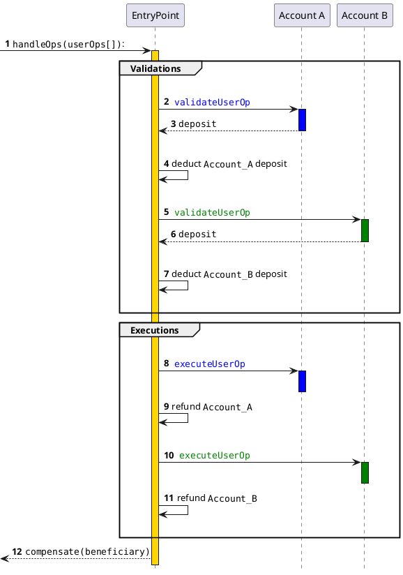
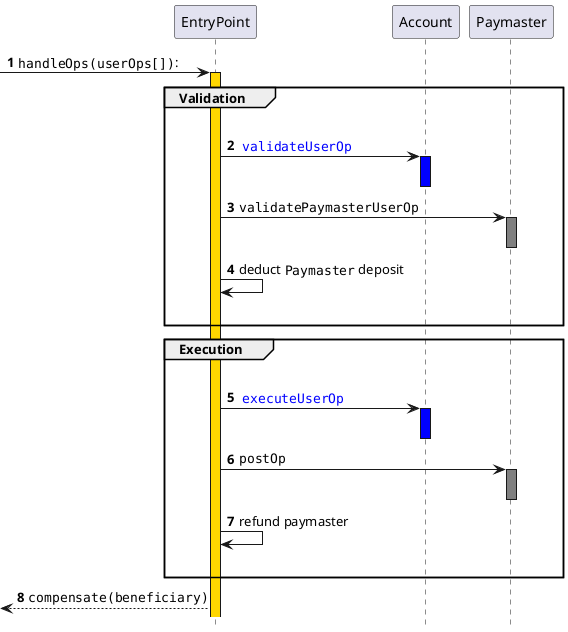
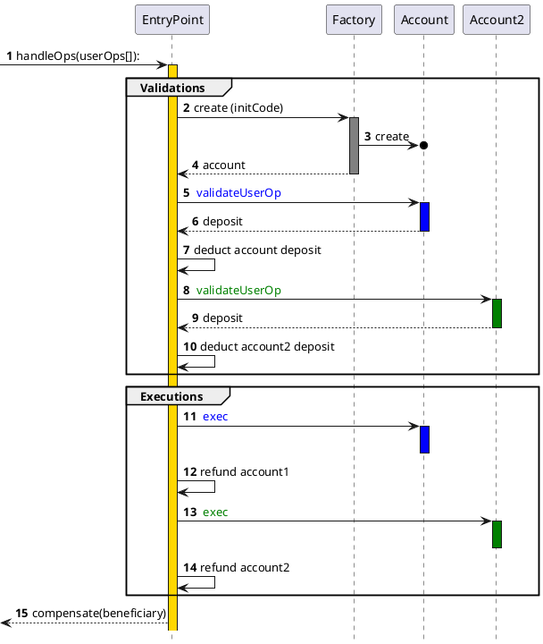

# Bundler Full Sequence Diagram

```plantuml
title UserOperations mempool flow

actor Alice
actor Bob
participant "Bundler RPC"
participant "Ethereum RPC"
participant "UserOp Mempool"

group Alice Submits UserOp
note right of Alice: create UserOp
Alice->"Bundler RPC": ""eth_sendUserOperation""
"Bundler RPC"->"Ethereum RPC": First Validation\ntrace view call to:\n""handleOps([userOpA]"")
"Bundler RPC"->"UserOp Mempool": add ""UserOp"" to mempool
end
|||

group Bob Submits UserOp
note right of Bob: create UserOp
Bob->"Bundler RPC": ""eth_sendUserOperation""
"Bundler RPC"->"Ethereum RPC": First Validation\ntrace view call to\n""handleOps([userOpB]"")
"Bundler RPC"->"UserOp Mempool": add ""UserOp"" to mempool
end
|||

group Build Bundle
    "Bundler RPC"->"UserOp Mempool": fetch pending ""UserOps""
    return ""[UserOpA, UserOpB]""
|||
    loop for each UserOp
        "Bundler RPC"->"Ethereum RPC": Second Validation\ntrace view call to:\n""handleOps([userOp])""
|||
    end

note right of "Bundler RPC": create bundle ""[UserOpA, UserOpB]""
"Bundler RPC"->"Ethereum RPC": Third Validation\ntrace view call to:\n""handleOps([UserOpA, UserOpB])""
|||
"Bundler RPC"->"Ethereum RPC": submit transaction\n""handleOps([UserOpA, UserOpB])""
|||
end
```

# Bundle Sequence Diagram (Without factory)


# Bundle Sequence Diagram (with Paymaster)


# Bundle Sequence Diagram (with Factory)

