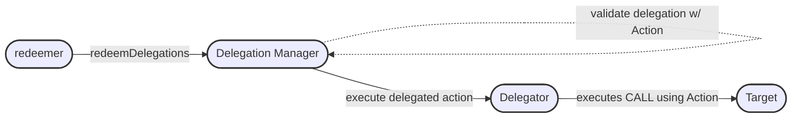

```mermaid
flowchart LR
    redeemer(["redeemer"]) --"redeemDelegations"--> Delegation_Manager(["Delegation Manager"])
    Delegation_Manager -.->|validate delegation w/ Action| Delegation_Manager
    Delegation_Manager --"execute delegated action"--> Delegator(["Delegator"])
    Delegator --"executes CALL using Action"--> Target(["Target"])
    classDef action stroke:#333,stroke-width:2px,stroke-dasharray: 5, 5;
    classDef entity fill:#af,stroke:#333,stroke-width:2px;
    class redeemer,Delegator,Delegation_Manager,Target entity;
```
