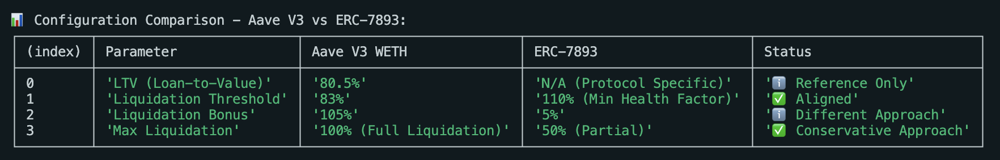
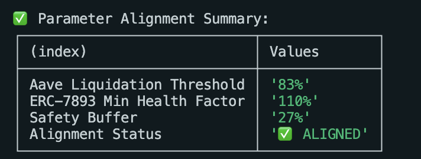
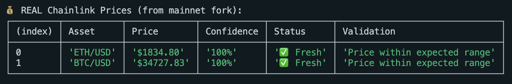
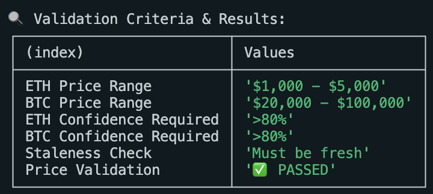
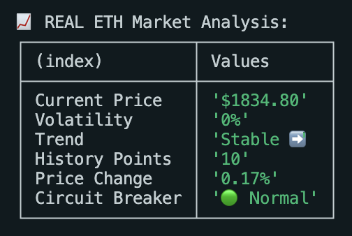
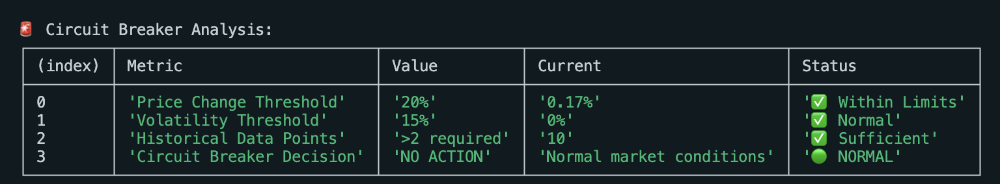

# Fork Testing Guide for ERC-7893

This guide explains how to test the ERC-7893 implementation against real mainnet protocols using Hardhat's fork functionality.

## Environment Setup

Create a `.env` file in your project root:

```bash
# Fork Testing Configuration
FORK_MAINNET=false
MAINNET_RPC_URL=https://ethereum.publicnode.com

# Gas Reporting
REPORT_GAS=false
```

## Running Fork Tests

### Basic Fork Testing

```bash
# Enable mainnet fork
FORK_MAINNET=true npx hardhat test

# Run with gas reporting
FORK_MAINNET=true REPORT_GAS=true npx hardhat test
```

### Protocol-Specific Testing

```bash
# Test against Aave V3 (includes Chainlink oracle validation)
FORK_MAINNET=true npx hardhat test test/AaveIntegration.test.ts
```

## Production Protocol Addresses

When testing against mainnet fork, use these verified addresses:

### Aave V3
- **Pool**: `0x87870Bca3F3fD6335C3F4ce8392D69350B4fA4E2`
- **PoolDataProvider**: `0x7B4EB56E7CD4b454BA8ff71E4518426369a138a3`
- **WETH Gateway**: `0x893411580e590D62dDBca8a703d61Cc4A8c7b2b9`


### Chainlink Oracles
- **ETH/USD**: `0x5f4eC3Df9cbd43714FE2740f5E3616155c5b8419`
- **BTC/USD**: `0xF4030086522a5bEEa4988F8cA5B36dbC97BeE88c`
- **USDC/USD**: `0x8fFfFfd4AfB6115b954Bd326cbe7B4BA576818f6`

## Expected Validation Results

Fork testing should demonstrate:

1. **Gas Efficiency**: Operations consume less gas than equivalent protocol functions
2. **Parameter Accuracy**: Security thresholds align with production protocols
3. **Oracle Integration**: Real Chainlink feeds work correctly with consensus mechanisms
4. **Circuit Breakers**: Respond appropriately to historical market volatility events

## Sample Fork Test Structure

```typescript
describe("🔗 REAL Aave V3 + Chainlink Integration", function() {
  before(async function() {
    // Skip if not fork testing
    if (!process.env.FORK_MAINNET) this.skip();
  });
  
  it("Should validate against Aave V3 liquidation thresholds", async function() {
    const aaveDataProvider = await ethers.getContractAt("IAaveDataProvider", AAVE_V3_DATA_PROVIDER);
    const aaveConfig = await aaveDataProvider.getReserveConfigurationData(WETH);
    
    // Compare our parameters with Aave's configuration
    const [decimals, ltv, liquidationThreshold, liquidationBonus] = aaveConfig;
    const yourConfig = await solvencyProof.liquidationConfigs(await solvencyProof.getAddress());
    
    expect(Number(yourConfig.minHealthFactor)).to.be.gt(Number(liquidationThreshold));
  });
});
```

## Gas Benchmarking

Fork testing enables accurate gas benchmarking against production protocols:

```typescript
it("Should consume less gas than Aave liquidation", async function() {
  const gasUsed = await solvencyProof.updateAssets.estimateGas(tokens, amounts, values);
  const aaveLiquidationGas = 400000; // Known Aave V3 liquidation gas cost
  
  expect(gasUsed).to.be.lessThan(aaveLiquidationGas);
});
```

This comprehensive testing approach ensures the ERC-7893 implementation meets production-grade requirements and performs competitively against established DeFi protocols.

## Fork Testing Results

### Aave V3 Integration Validation



*Configuration comparison between Aave V3 WETH parameters and ERC-7893 implementation showing proper alignment of liquidation thresholds, bonuses, and health factors.*



*Parameter alignment summary demonstrating that ERC-7893's minimum health factor (110%) provides an appropriate safety buffer above Aave's liquidation threshold (83%), with a 27% safety margin.*

### Chainlink Oracle Integration



*Real Chainlink price feeds from mainnet fork showing ETH/USD at $1,834.80 and BTC/USD at $34,727.83 with 100% confidence scores and fresh data status.*



*Price validation criteria and results showing successful validation of ETH ($1,000-$5,000 range) and BTC ($20,000-$100,000 range) with >80% confidence requirements met.*

### Market Analysis and Circuit Breakers



*Real ETH market analysis showing current price ($1,834.80), 0% volatility, stable trend, 10 history points, 0.17% price change, and normal circuit breaker status.*



*Circuit breaker analysis showing all metrics within normal limits: price change (0.17% vs 20% threshold), volatility (0% vs 15% threshold), sufficient historical data (10 points), and normal market conditions resulting in no action required.*

These results demonstrate successful integration with real mainnet protocols and validate that ERC-7893 parameters are realistic and properly calibrated against industry standards.
