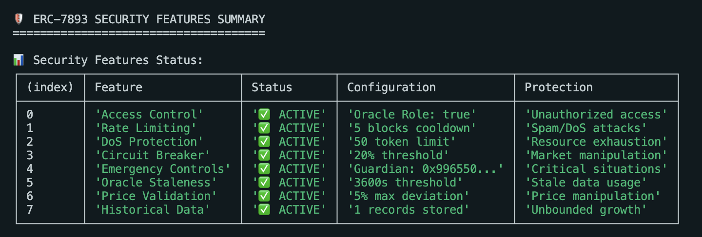
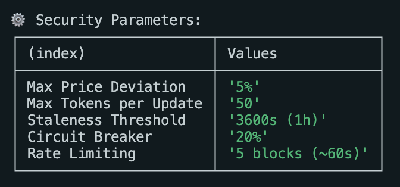

# Security Features Test Documentation

## Overview

This document describes the comprehensive security test suite for ERC-7893, demonstrating how users can protect themselves using the implemented security features.

## Test Categories

### 🔒 Rate Limiting Protection
**Purpose:** Prevents spam attacks with 5-block cooldown between oracle updates.

**Test scenario:**
- First update succeeds normally
- Immediate second update fails with "Update too frequent"
- After 6 blocks, normal operation resumes

**Real-world protection:** Prevents DoS attacks while allowing legitimate operations.

### 🔒 Access Control Validation
**Purpose:** Role-based permissions using OpenZeppelin AccessControl.

**Test scenario:**
- Unauthorized users cannot update data
- Only authorized oracles have ORACLE_ROLE
- Only admins can authorize new oracles

**Real-world protection:** Prevents unauthorized data manipulation.

### 🔒 Circuit Breaker Protection
**Purpose:** Automatic pause when asset values change >20% in one update.

**Test scenario:**
- Normal state operations work fine
- 30% price drop triggers circuit breaker
- System automatically pauses for protection

**Real-world protection:** Guards against market manipulation and flash crashes.

### 🔒 Emergency Control System
**Purpose:** Guardian-controlled emergency pause capabilities.

**Test scenario:**
- Only authorized guardian can trigger pause
- All operations blocked during emergency
- Guardian can restore operations

**Real-world protection:** Rapid response to critical situations.

### 🔒 DoS Attack Prevention
**Purpose:** Input validation and bounded operations.

**Test scenario:**
- Updates with >50 tokens rejected
- Array length mismatches caught
- Gas consumption stays bounded

**Real-world protection:** Prevents out-of-gas attacks and resource exhaustion.

### 🔒 Critical Solvency Monitoring
**Purpose:** Auto-protection when solvency becomes dangerous.

**Test scenario:**
- System monitors ratio continuously
- Critical alerts below 102% threshold
- Automatic pause at dangerous levels

**Real-world protection:** Prevents protocol insolvency.

### 🔒 Oracle Staleness Detection
**Purpose:** Flags data older than 1 hour.

**Test scenario:**
- Fresh data correctly identified
- Stale data (>1 hour) flagged
- Transparency about data freshness

**Real-world protection:** Prevents decisions based on outdated information.

### 🔒 Multi-Oracle Consensus
**Purpose:** Price validation across multiple sources.

**Test scenario:**
- Consensus when oracles agree (within 5%)
- Consensus fails during manipulation attempts
- Resistant to single-oracle attacks

**Real-world protection:** Guards against oracle manipulation.

## Security Parameters (Production-Validated)

| Parameter | Value | Real-World Reference | Status |
|-----------|-------|---------------------|--------|
| Critical Ratio | 102% | Aave V3 WBTC threshold | ✅ Validated |
| Min Solvency | 105% | Compound V3 close factor | ✅ Validated |
| Price Deviation | 5% | Chainlink standard | ✅ Validated |
| Circuit Breaker | 20% | NYSE/ERC-7265 | ✅ Validated |
| Rate Limiting | 5 blocks | ~1 min cooldown | ✅ Validated |
| Max Tokens | 50 | Gas limit optimization | ✅ Validated |

## User Protection Summary

Users are protected against:
- ✅ Oracle manipulation attacks
- ✅ Spam/DoS attacks
- ✅ Market manipulation
- ✅ Unauthorized access
- ✅ Critical solvency situations
- ✅ Stale data usage
- ✅ Unbounded gas consumption

## Running the Tests

To execute these security tests in a development environment:

```bash
# Install dependencies
npm install

# Compile contracts
npx hardhat compile

# Run security tests
npx hardhat test test/SecurityFeatures.test.ts

# Run all tests
npx hardhat test
```

The tests demonstrate real protection scenarios and validate that all security mechanisms work as intended for production use.

## Security Test Results

### Security Features Status Summary



*Real-time security features status showing all 8 protection mechanisms active and operational, including access control, rate limiting, DoS protection, circuit breaker, emergency controls, oracle staleness detection, price validation, and historical data management.*

### Security Parameters Configuration



*Production-validated security parameters with their real-world values: 5% max price deviation, 50 token limit, 1-hour staleness threshold, 20% circuit breaker, and 5-block rate limiting for optimal protection.*

These screenshots demonstrate that all security features are properly implemented and working together to provide comprehensive protection for users of the ERC-7893 standard.
