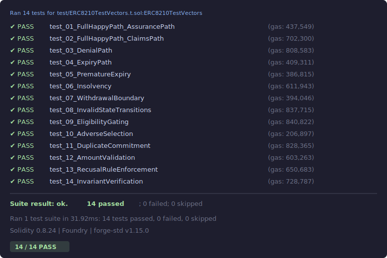

# ERC-8210: Agent Assurance — Test Vectors

Foundry test vectors for [ERC-8210](https://eips.ethereum.org/EIPS/eip-8210) (Agent Assurance Protocol).

Implements the 14 test scenarios specified in the ERC-8210 **Test Cases** section.

## Structure

```
contracts/
  interfaces/
    IAAP.sol         # Core interface, enums, structs, events
    IERC20.sol       # Minimal ERC-20 interface
  mocks/
    AAPMock.sol      # Mock IAAP implementation with ERC-8183 job state simulation
    MockERC20.sol    # Minimal ERC-20 mock (settlement asset)
test/
  ERC8210TestVectors.t.sol   # 14 test vectors
```

## Setup

```bash
forge install foundry-rs/forge-std
```

## Build

```bash
forge build
```

## Test

```bash
forge test -vv
```

## Test Results



## Test Scenarios

| #  | Function                                   | Scenario                    |
|----|--------------------------------------------|-----------------------------|
| 1  | `test_01_FullHappyPath_AssurancePath`      | Full happy path (assurance) |
| 2  | `test_02_FullHappyPath_ClaimsPath`         | Full happy path (claims)    |
| 3  | `test_03_DenialPath`                       | Denial path                 |
| 4  | `test_04_ExpiryPath`                       | Expiry path                 |
| 5  | `test_05_PrematureExpiry`                  | Premature expiry            |
| 6  | `test_06_Insolvency`                       | Insolvency                  |
| 7  | `test_07_WithdrawalBoundary`               | Withdrawal boundary         |
| 8  | `test_08_InvalidStateTransitions`          | Invalid state transitions   |
| 9  | `test_09_EligibilityGating`               | Eligibility gating          |
| 10 | `test_10_AdverseSelection`                 | Adverse selection           |
| 11 | `test_11_DuplicateCommitment`              | Duplicate commitment        |
| 12 | `test_12_AmountValidation`                 | Amount validation           |
| 13 | `test_13_RecusalRuleEnforcement`           | Recusal rule enforcement    |
| 14 | `test_14_InvariantVerification`            | Invariant verification      |
